# Opinion Poll by Kantar, 12–18 October 2017

<a href="#voting-intentions">Voting Intentions</a> | <a href="#seats">Seats</a> | <a href="#coalitions">Coalitions</a> | <a href="#technical-information">Technical Information</a>

## Voting Intentions

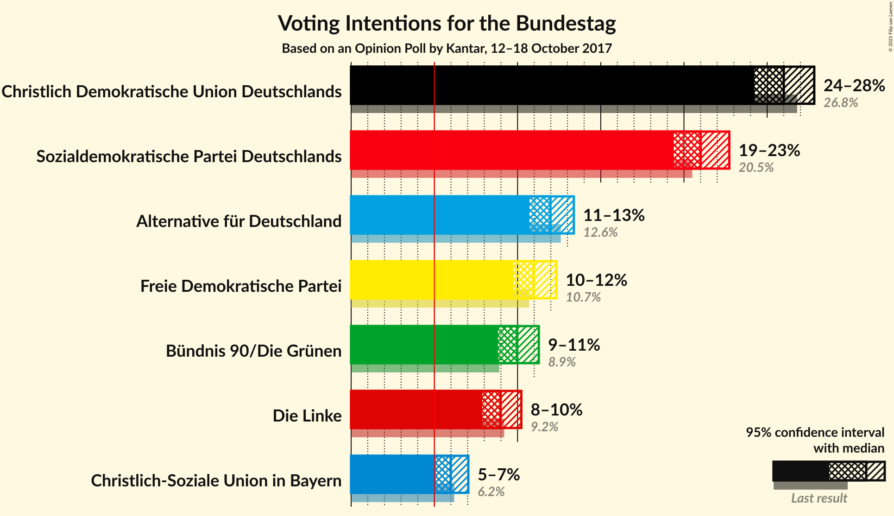

### Confidence Intervals

| Party | Last Result | Poll Result | 80% Confidence Interval | 90% Confidence Interval | 95% Confidence Interval | 99% Confidence Interval |
|:-----:|:-----------:|:-----------:|:-----------------------:|:-----------------------:|:-----------------------:|:-----------------------:|
| Christlich Demokratische Union Deutschlands | 26.8% | 26.0% | 24.8–27.2% |24.5–27.5% |24.2–27.8% |23.7–28.4% |
| Sozialdemokratische Partei Deutschlands | 20.5% | 21.0% | 19.9–22.1% |19.6–22.5% |19.4–22.7% |18.9–23.3% |
| Alternative für Deutschland | 12.6% | 12.0% | 11.1–12.9% |10.9–13.2% |10.7–13.4% |10.3–13.8% |
| Freie Demokratische Partei | 10.7% | 11.0% | 10.2–11.9% |10.0–12.1% |9.8–12.3% |9.4–12.8% |
| Bündnis 90/Die Grünen | 8.9% | 10.0% | 9.2–10.8% |9.0–11.1% |8.8–11.3% |8.5–11.7% |
| Die Linke | 9.2% | 9.0% | 8.3–9.8% |8.0–10.0% |7.9–10.2% |7.5–10.6% |
| Christlich-Soziale Union in Bayern | 6.2% | 6.0% | 5.4–6.7% |5.2–6.9% |5.1–7.0% |4.8–7.4% |

*Note:* The poll result column reflects the actual value used in the calculations. Published results may vary slightly, and in addition be rounded to fewer digits.

## Seats

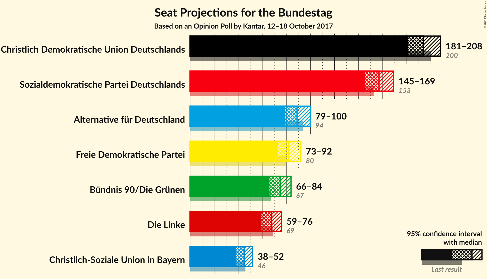

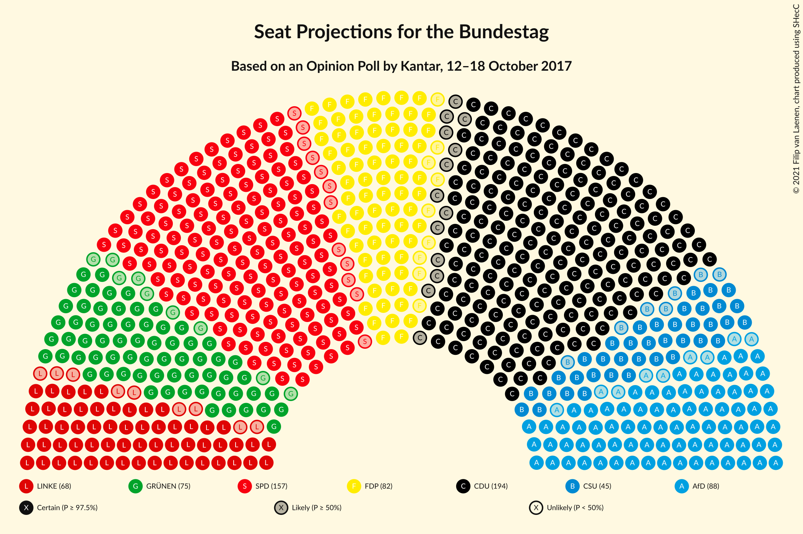

### Confidence Intervals

| Party | Last Result | Median | 80% Confidence Interval | 90% Confidence Interval | 95% Confidence Interval | 99% Confidence Interval |
|:-----:|:-----------:|:------:|:-----------------------:|:-----------------------:|:-----------------------:|:-----------------------:|
| <a href="#christlich-demokratische-union-deutschlands">Christlich Demokratische Union Deutschlands</a> | 200 | 194 | 185–203 |183–204 |181–208 |176–211 |
| <a href="#sozialdemokratische-partei-deutschlands">Sozialdemokratische Partei Deutschlands</a> | 153 | 157 | 149–164 |146–167 |145–169 |141–174 |
| <a href="#alternative-für-deutschland">Alternative für Deutschland</a> | 94 | 89 | 84–97 |80–99 |79–100 |78–102 |
| <a href="#freie-demokratische-partei">Freie Demokratische Partei</a> | 80 | 82 | 76–88 |74–91 |73–92 |70–94 |
| <a href="#bündnis-90/die-grünen">Bündnis 90/Die Grünen</a> | 67 | 75 | 69–80 |67–82 |66–84 |63–87 |
| <a href="#die-linke">Die Linke</a> | 69 | 68 | 62–73 |60–74 |59–76 |56–79 |
| <a href="#christlich-soziale-union-in-bayern">Christlich-Soziale Union in Bayern</a> | 46 | 45 | 40–49 |39–51 |38–52 |36–55 |

### Christlich Demokratische Union Deutschlands

*For a full overview of the results for this party, see the [Christlich Demokratische Union Deutschlands](party-christlichdemokratischeuniondeutschlands.html) page.*

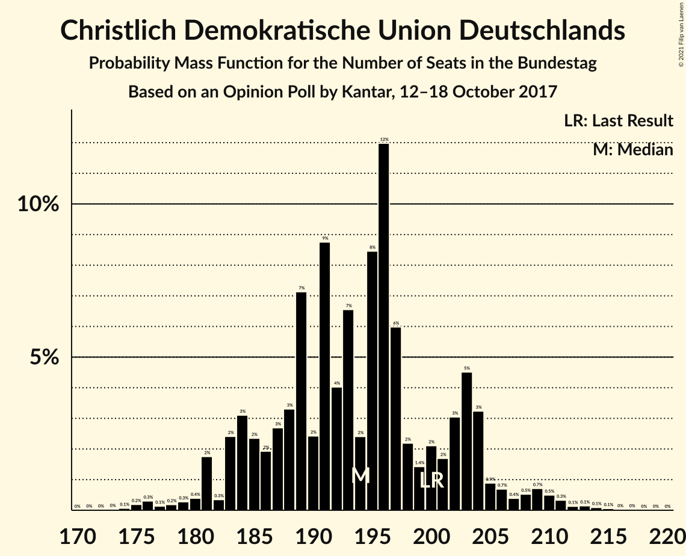

| Number of Seats | Probability | Accumulated | Special Marks |
|:---------------:|:-----------:|:-----------:|:-------------:|
| 173 | 0% | 100% |  |
| 174 | 0.1% | 99.9% |  |
| 175 | 0.2% | 99.9% |  |
| 176 | 0.3% | 99.7% |  |
| 177 | 0.1% | 99.4% |  |
| 178 | 0.2% | 99.2% |  |
| 179 | 0.3% | 99.0% |  |
| 180 | 0.4% | 98.8% |  |
| 181 | 2% | 98% |  |
| 182 | 0.3% | 97% |  |
| 183 | 2% | 96% |  |
| 184 | 3% | 94% |  |
| 185 | 2% | 91% |  |
| 186 | 2% | 88% |  |
| 187 | 3% | 86% |  |
| 188 | 3% | 84% |  |
| 189 | 7% | 80% |  |
| 190 | 2% | 73% |  |
| 191 | 9% | 71% |  |
| 192 | 4% | 62% |  |
| 193 | 7% | 58% |  |
| 194 | 2% | 52% | Median |
| 195 | 8% | 49% |  |
| 196 | 12% | 41% |  |
| 197 | 6% | 29% |  |
| 198 | 2% | 23% |  |
| 199 | 1.4% | 21% |  |
| 200 | 2% | 19% | Last Result |
| 201 | 2% | 17% |  |
| 202 | 3% | 15% |  |
| 203 | 5% | 12% |  |
| 204 | 3% | 8% |  |
| 205 | 0.9% | 5% |  |
| 206 | 0.7% | 4% |  |
| 207 | 0.4% | 3% |  |
| 208 | 0.5% | 3% |  |
| 209 | 0.7% | 2% |  |
| 210 | 0.5% | 1.3% |  |
| 211 | 0.3% | 0.8% |  |
| 212 | 0.1% | 0.5% |  |
| 213 | 0.1% | 0.4% |  |
| 214 | 0.1% | 0.2% |  |
| 215 | 0.1% | 0.1% |  |
| 216 | 0% | 0.1% |  |
| 217 | 0% | 0% |  |

### Sozialdemokratische Partei Deutschlands

*For a full overview of the results for this party, see the [Sozialdemokratische Partei Deutschlands](party-sozialdemokratischeparteideutschlands.html) page.*

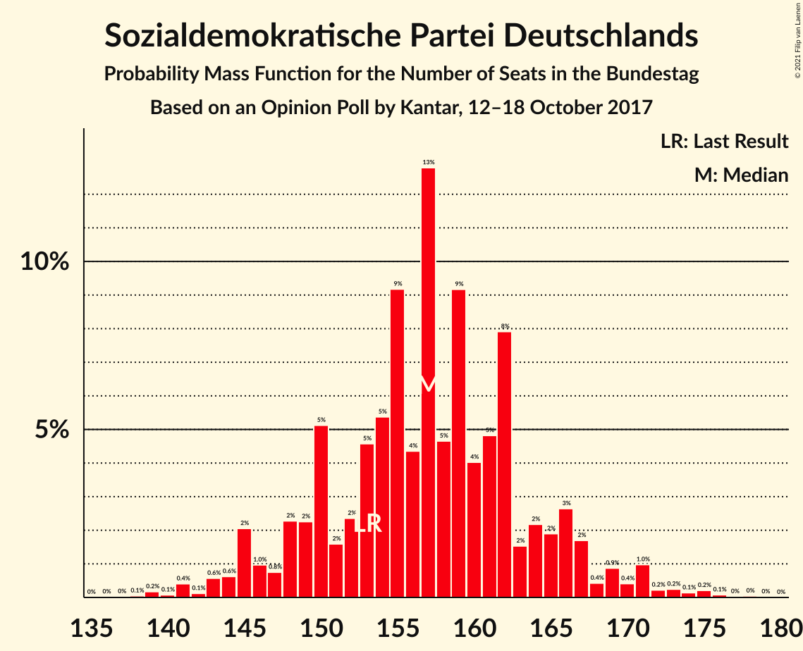

| Number of Seats | Probability | Accumulated | Special Marks |
|:---------------:|:-----------:|:-----------:|:-------------:|
| 137 | 0% | 100% |  |
| 138 | 0.1% | 99.9% |  |
| 139 | 0.2% | 99.9% |  |
| 140 | 0.1% | 99.7% |  |
| 141 | 0.4% | 99.6% |  |
| 142 | 0.1% | 99.2% |  |
| 143 | 0.6% | 99.1% |  |
| 144 | 0.6% | 98.5% |  |
| 145 | 2% | 98% |  |
| 146 | 1.0% | 96% |  |
| 147 | 0.8% | 95% |  |
| 148 | 2% | 94% |  |
| 149 | 2% | 92% |  |
| 150 | 5% | 90% |  |
| 151 | 2% | 84% |  |
| 152 | 2% | 83% |  |
| 153 | 5% | 81% | Last Result |
| 154 | 5% | 76% |  |
| 155 | 9% | 71% |  |
| 156 | 4% | 61% |  |
| 157 | 13% | 57% | Median |
| 158 | 5% | 44% |  |
| 159 | 9% | 40% |  |
| 160 | 4% | 30% |  |
| 161 | 5% | 26% |  |
| 162 | 8% | 22% |  |
| 163 | 2% | 14% |  |
| 164 | 2% | 12% |  |
| 165 | 2% | 10% |  |
| 166 | 3% | 8% |  |
| 167 | 2% | 5% |  |
| 168 | 0.4% | 4% |  |
| 169 | 0.9% | 3% |  |
| 170 | 0.4% | 2% |  |
| 171 | 1.0% | 2% |  |
| 172 | 0.2% | 1.0% |  |
| 173 | 0.2% | 0.8% |  |
| 174 | 0.1% | 0.5% |  |
| 175 | 0.2% | 0.4% |  |
| 176 | 0.1% | 0.2% |  |
| 177 | 0% | 0.1% |  |
| 178 | 0% | 0.1% |  |
| 179 | 0% | 0% |  |

### Alternative für Deutschland

*For a full overview of the results for this party, see the [Alternative für Deutschland](party-alternativefürdeutschland.html) page.*

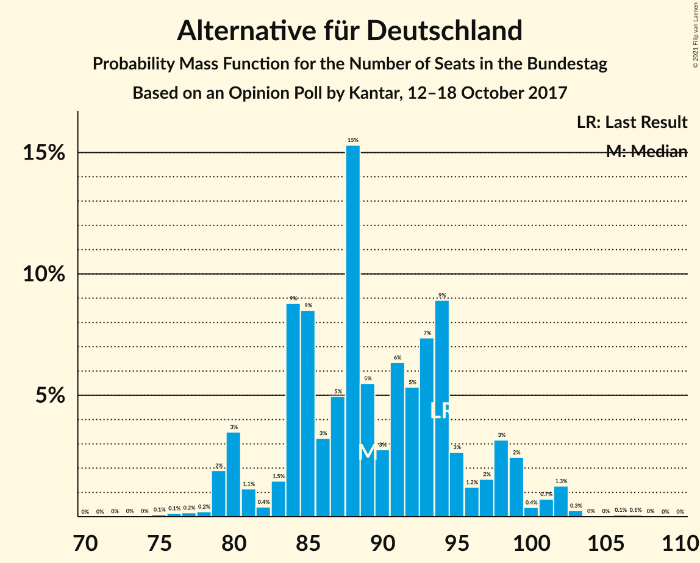

| Number of Seats | Probability | Accumulated | Special Marks |
|:---------------:|:-----------:|:-----------:|:-------------:|
| 73 | 0% | 100% |  |
| 74 | 0% | 99.9% |  |
| 75 | 0.1% | 99.9% |  |
| 76 | 0.1% | 99.8% |  |
| 77 | 0.2% | 99.7% |  |
| 78 | 0.2% | 99.5% |  |
| 79 | 2% | 99.3% |  |
| 80 | 3% | 97% |  |
| 81 | 1.1% | 94% |  |
| 82 | 0.4% | 93% |  |
| 83 | 1.5% | 92% |  |
| 84 | 9% | 91% |  |
| 85 | 9% | 82% |  |
| 86 | 3% | 74% |  |
| 87 | 5% | 70% |  |
| 88 | 15% | 65% |  |
| 89 | 5% | 50% | Median |
| 90 | 3% | 45% |  |
| 91 | 6% | 42% |  |
| 92 | 5% | 36% |  |
| 93 | 7% | 30% |  |
| 94 | 9% | 23% | Last Result |
| 95 | 3% | 14% |  |
| 96 | 1.2% | 11% |  |
| 97 | 2% | 10% |  |
| 98 | 3% | 8% |  |
| 99 | 2% | 5% |  |
| 100 | 0.4% | 3% |  |
| 101 | 0.7% | 2% |  |
| 102 | 1.3% | 2% |  |
| 103 | 0.3% | 0.5% |  |
| 104 | 0% | 0.2% |  |
| 105 | 0% | 0.2% |  |
| 106 | 0.1% | 0.2% |  |
| 107 | 0.1% | 0.1% |  |
| 108 | 0% | 0% |  |

### Freie Demokratische Partei

*For a full overview of the results for this party, see the [Freie Demokratische Partei](party-freiedemokratischepartei.html) page.*

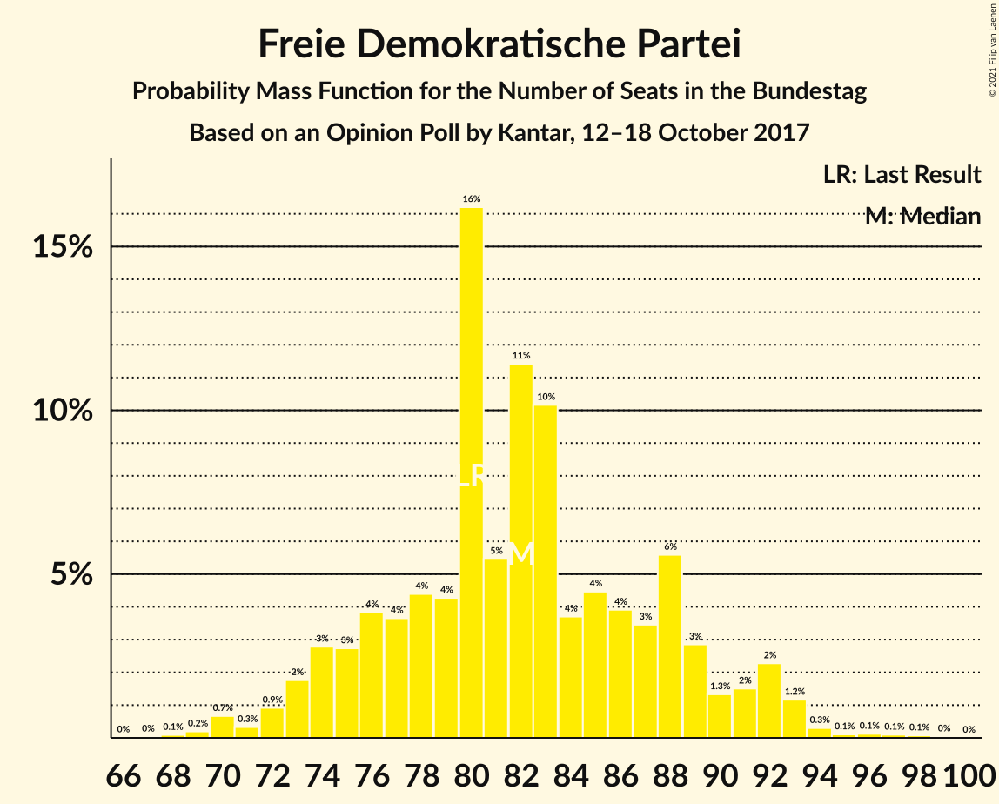

| Number of Seats | Probability | Accumulated | Special Marks |
|:---------------:|:-----------:|:-----------:|:-------------:|
| 67 | 0% | 100% |  |
| 68 | 0.1% | 99.9% |  |
| 69 | 0.2% | 99.8% |  |
| 70 | 0.7% | 99.6% |  |
| 71 | 0.3% | 99.0% |  |
| 72 | 0.9% | 98.6% |  |
| 73 | 2% | 98% |  |
| 74 | 3% | 96% |  |
| 75 | 3% | 93% |  |
| 76 | 4% | 90% |  |
| 77 | 4% | 87% |  |
| 78 | 4% | 83% |  |
| 79 | 4% | 79% |  |
| 80 | 16% | 74% | Last Result |
| 81 | 5% | 58% |  |
| 82 | 11% | 53% | Median |
| 83 | 10% | 41% |  |
| 84 | 4% | 31% |  |
| 85 | 4% | 27% |  |
| 86 | 4% | 23% |  |
| 87 | 3% | 19% |  |
| 88 | 6% | 15% |  |
| 89 | 3% | 10% |  |
| 90 | 1.3% | 7% |  |
| 91 | 2% | 6% |  |
| 92 | 2% | 4% |  |
| 93 | 1.2% | 2% |  |
| 94 | 0.3% | 0.8% |  |
| 95 | 0.1% | 0.5% |  |
| 96 | 0.1% | 0.4% |  |
| 97 | 0.1% | 0.2% |  |
| 98 | 0.1% | 0.1% |  |
| 99 | 0% | 0.1% |  |
| 100 | 0% | 0% |  |

### Bündnis 90/Die Grünen

*For a full overview of the results for this party, see the [Bündnis 90/Die Grünen](party-bündnis90diegrünen.html) page.*

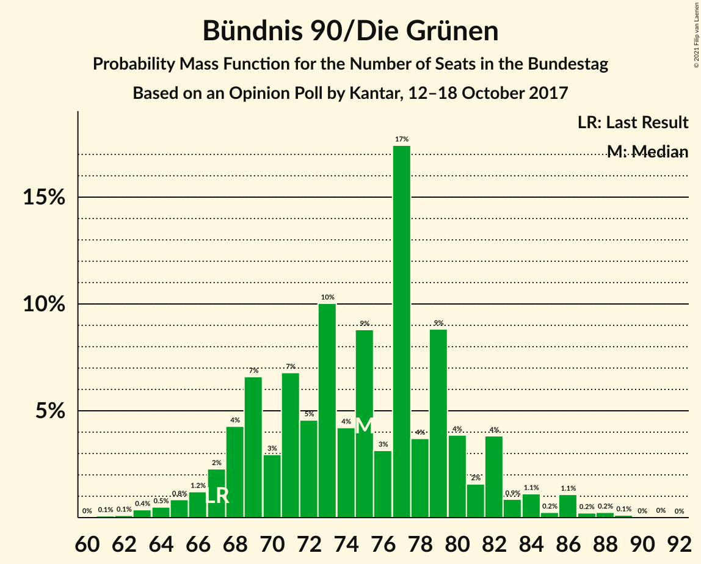

| Number of Seats | Probability | Accumulated | Special Marks |
|:---------------:|:-----------:|:-----------:|:-------------:|
| 60 | 0% | 100% |  |
| 61 | 0.1% | 99.9% |  |
| 62 | 0.1% | 99.8% |  |
| 63 | 0.4% | 99.7% |  |
| 64 | 0.5% | 99.4% |  |
| 65 | 0.8% | 98.9% |  |
| 66 | 1.2% | 98% |  |
| 67 | 2% | 97% | Last Result |
| 68 | 4% | 95% |  |
| 69 | 7% | 90% |  |
| 70 | 3% | 84% |  |
| 71 | 7% | 81% |  |
| 72 | 5% | 74% |  |
| 73 | 10% | 69% |  |
| 74 | 4% | 59% |  |
| 75 | 9% | 55% | Median |
| 76 | 3% | 46% |  |
| 77 | 17% | 43% |  |
| 78 | 4% | 26% |  |
| 79 | 9% | 22% |  |
| 80 | 4% | 13% |  |
| 81 | 2% | 9% |  |
| 82 | 4% | 8% |  |
| 83 | 0.9% | 4% |  |
| 84 | 1.1% | 3% |  |
| 85 | 0.2% | 2% |  |
| 86 | 1.1% | 2% |  |
| 87 | 0.2% | 0.7% |  |
| 88 | 0.2% | 0.5% |  |
| 89 | 0.1% | 0.2% |  |
| 90 | 0% | 0.1% |  |
| 91 | 0% | 0.1% |  |
| 92 | 0% | 0% |  |

### Die Linke

*For a full overview of the results for this party, see the [Die Linke](party-dielinke.html) page.*

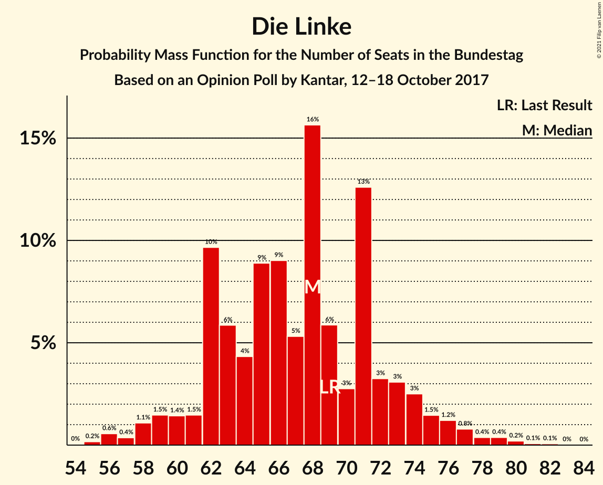

| Number of Seats | Probability | Accumulated | Special Marks |
|:---------------:|:-----------:|:-----------:|:-------------:|
| 54 | 0% | 100% |  |
| 55 | 0.2% | 99.9% |  |
| 56 | 0.6% | 99.7% |  |
| 57 | 0.4% | 99.2% |  |
| 58 | 1.1% | 98.8% |  |
| 59 | 1.5% | 98% |  |
| 60 | 1.4% | 96% |  |
| 61 | 1.5% | 95% |  |
| 62 | 10% | 93% |  |
| 63 | 6% | 84% |  |
| 64 | 4% | 78% |  |
| 65 | 9% | 74% |  |
| 66 | 9% | 65% |  |
| 67 | 5% | 56% |  |
| 68 | 16% | 50% | Median |
| 69 | 6% | 35% | Last Result |
| 70 | 3% | 29% |  |
| 71 | 13% | 26% |  |
| 72 | 3% | 13% |  |
| 73 | 3% | 10% |  |
| 74 | 3% | 7% |  |
| 75 | 1.5% | 5% |  |
| 76 | 1.2% | 3% |  |
| 77 | 0.8% | 2% |  |
| 78 | 0.4% | 1.1% |  |
| 79 | 0.4% | 0.8% |  |
| 80 | 0.2% | 0.4% |  |
| 81 | 0.1% | 0.2% |  |
| 82 | 0.1% | 0.1% |  |
| 83 | 0% | 0% |  |

### Christlich-Soziale Union in Bayern

*For a full overview of the results for this party, see the [Christlich-Soziale Union in Bayern](party-christlich-sozialeunioninbayern.html) page.*

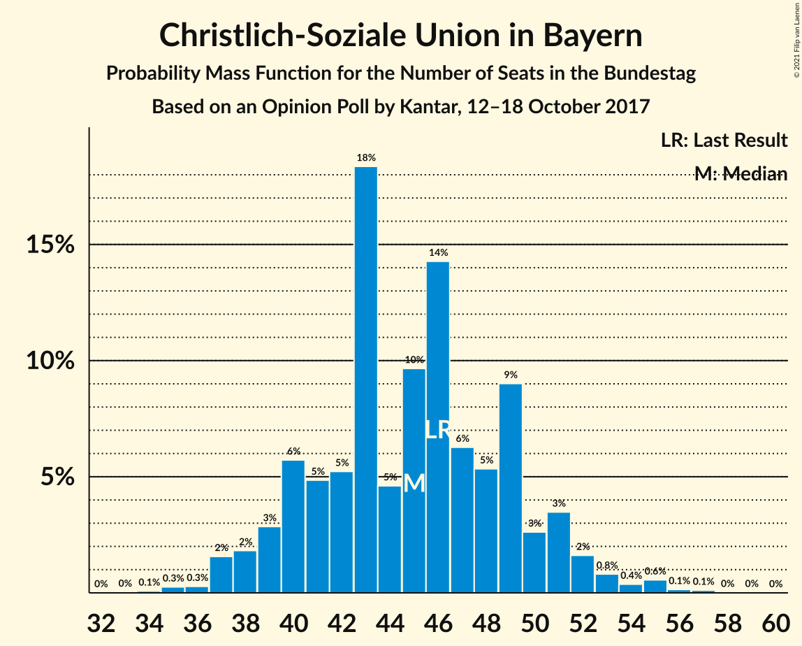

| Number of Seats | Probability | Accumulated | Special Marks |
|:---------------:|:-----------:|:-----------:|:-------------:|
| 34 | 0.1% | 100% |  |
| 35 | 0.3% | 99.9% |  |
| 36 | 0.3% | 99.6% |  |
| 37 | 2% | 99.3% |  |
| 38 | 2% | 98% |  |
| 39 | 3% | 96% |  |
| 40 | 6% | 93% |  |
| 41 | 5% | 87% |  |
| 42 | 5% | 83% |  |
| 43 | 18% | 77% |  |
| 44 | 5% | 59% |  |
| 45 | 10% | 54% | Median |
| 46 | 14% | 45% | Last Result |
| 47 | 6% | 30% |  |
| 48 | 5% | 24% |  |
| 49 | 9% | 19% |  |
| 50 | 3% | 10% |  |
| 51 | 3% | 7% |  |
| 52 | 2% | 4% |  |
| 53 | 0.8% | 2% |  |
| 54 | 0.4% | 1.2% |  |
| 55 | 0.6% | 0.9% |  |
| 56 | 0.1% | 0.3% |  |
| 57 | 0.1% | 0.2% |  |
| 58 | 0% | 0.1% |  |
| 59 | 0% | 0% |  |

## Coalitions

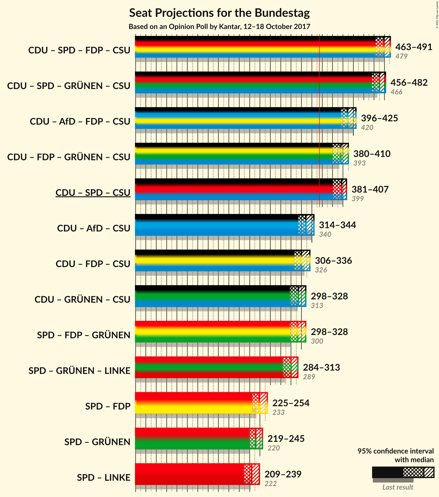

### Confidence Intervals

| Coalition | Last Result | Median | Majority? | 80% Confidence Interval | 90% Confidence Interval | 95% Confidence Interval | 99% Confidence Interval |
|:---------:|:-----------:|:------:|:---------:|:-----------------------:|:-----------------------:|:-----------------------:|:-----------------------:|
| Christlich Demokratische Union Deutschlands – Sozialdemokratische Partei Deutschlands – Freie Demokratische Partei – Christlich-Soziale Union in Bayern | 479 | 479 | 100% | 468–486 | 466–489 | 463–491 | 459–496 |
| Christlich Demokratische Union Deutschlands – Sozialdemokratische Partei Deutschlands – Bündnis 90/Die Grünen – Christlich-Soziale Union in Bayern | 466 | 470 | 100% | 462–480 | 460–481 | 456–482 | 451–489 |
| Christlich Demokratische Union Deutschlands – Alternative für Deutschland – Freie Demokratische Partei – Christlich-Soziale Union in Bayern | 420 | 409 | 100% | 401–419 | 398–423 | 396–425 | 391–430 |
| Christlich Demokratische Union Deutschlands – Freie Demokratische Partei – Bündnis 90/Die Grünen – Christlich-Soziale Union in Bayern | 393 | 396 | 100% | 386–404 | 382–407 | 380–410 | 376–416 |
| Christlich Demokratische Union Deutschlands – Sozialdemokratische Partei Deutschlands – Christlich-Soziale Union in Bayern | 399 | 397 | 100% | 388–406 | 382–407 | 381–407 | 379–414 |
| Christlich Demokratische Union Deutschlands – Alternative für Deutschland – Christlich-Soziale Union in Bayern | 340 | 328 | 0% | 319–339 | 316–342 | 314–344 | 309–348 |
| Christlich Demokratische Union Deutschlands – Freie Demokratische Partei – Christlich-Soziale Union in Bayern | 326 | 320 | 0% | 312–330 | 308–332 | 306–336 | 302–341 |
| Christlich Demokratische Union Deutschlands – Bündnis 90/Die Grünen – Christlich-Soziale Union in Bayern | 313 | 314 | 0% | 304–323 | 300–325 | 298–328 | 295–334 |
| Sozialdemokratische Partei Deutschlands – Freie Demokratische Partei – Bündnis 90/Die Grünen | 300 | 313 | 0% | 303–323 | 302–328 | 298–328 | 292–333 |
| Sozialdemokratische Partei Deutschlands – Bündnis 90/Die Grünen – Die Linke | 289 | 300 | 0% | 290–308 | 286–311 | 284–313 | 279–318 |
| Sozialdemokratische Partei Deutschlands – Freie Demokratische Partei | 233 | 239 | 0% | 230–247 | 226–250 | 225–254 | 221–259 |
| Sozialdemokratische Partei Deutschlands – Bündnis 90/Die Grünen | 220 | 232 | 0% | 223–240 | 220–244 | 219–245 | 213–250 |
| Sozialdemokratische Partei Deutschlands – Die Linke | 222 | 224 | 0% | 216–233 | 212–237 | 209–239 | 206–243 |

### Christlich Demokratische Union Deutschlands – Sozialdemokratische Partei Deutschlands – Freie Demokratische Partei – Christlich-Soziale Union in Bayern

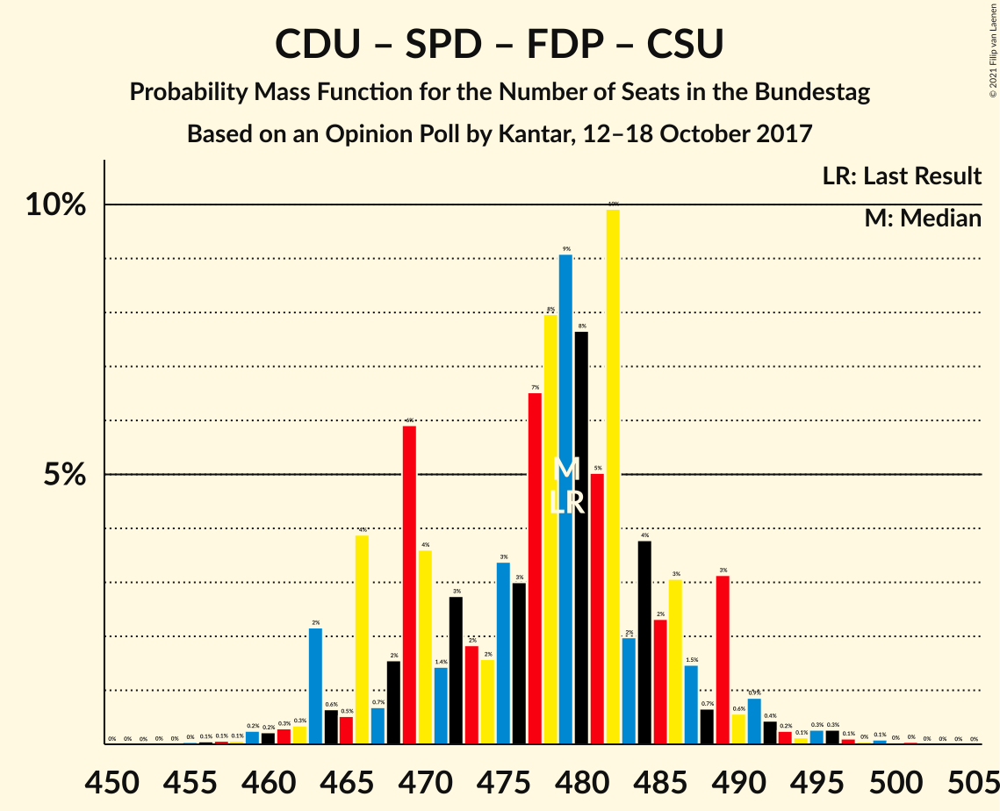

| Number of Seats | Probability | Accumulated | Special Marks |
|:---------------:|:-----------:|:-----------:|:-------------:|
| 454 | 0% | 100% |  |
| 455 | 0% | 99.9% |  |
| 456 | 0.1% | 99.9% |  |
| 457 | 0.1% | 99.9% |  |
| 458 | 0.1% | 99.8% |  |
| 459 | 0.2% | 99.7% |  |
| 460 | 0.2% | 99.5% |  |
| 461 | 0.3% | 99.3% |  |
| 462 | 0.3% | 99.0% |  |
| 463 | 2% | 98.6% |  |
| 464 | 0.6% | 96% |  |
| 465 | 0.5% | 96% |  |
| 466 | 4% | 95% |  |
| 467 | 0.7% | 91% |  |
| 468 | 2% | 91% |  |
| 469 | 6% | 89% |  |
| 470 | 4% | 83% |  |
| 471 | 1.4% | 80% |  |
| 472 | 3% | 78% |  |
| 473 | 2% | 75% |  |
| 474 | 2% | 74% |  |
| 475 | 3% | 72% |  |
| 476 | 3% | 69% |  |
| 477 | 7% | 66% |  |
| 478 | 8% | 59% | Median |
| 479 | 9% | 51% | Last Result |
| 480 | 8% | 42% |  |
| 481 | 5% | 34% |  |
| 482 | 10% | 29% |  |
| 483 | 2% | 20% |  |
| 484 | 4% | 18% |  |
| 485 | 2% | 14% |  |
| 486 | 3% | 11% |  |
| 487 | 1.5% | 8% |  |
| 488 | 0.7% | 7% |  |
| 489 | 3% | 6% |  |
| 490 | 0.6% | 3% |  |
| 491 | 0.9% | 3% |  |
| 492 | 0.4% | 2% |  |
| 493 | 0.2% | 1.2% |  |
| 494 | 0.1% | 1.0% |  |
| 495 | 0.3% | 0.9% |  |
| 496 | 0.3% | 0.6% |  |
| 497 | 0.1% | 0.3% |  |
| 498 | 0% | 0.2% |  |
| 499 | 0.1% | 0.2% |  |
| 500 | 0% | 0.1% |  |
| 501 | 0% | 0.1% |  |
| 502 | 0% | 0% |  |

### Christlich Demokratische Union Deutschlands – Sozialdemokratische Partei Deutschlands – Bündnis 90/Die Grünen – Christlich-Soziale Union in Bayern

| Number of Seats | Probability | Accumulated | Special Marks |
|:---------------:|:-----------:|:-----------:|:-------------:|
| 447 | 0% | 100% |  |
| 448 | 0.1% | 99.9% |  |
| 449 | 0.1% | 99.8% |  |
| 450 | 0.2% | 99.8% |  |
| 451 | 0.3% | 99.6% |  |
| 452 | 0.5% | 99.3% |  |
| 453 | 0.3% | 98.8% |  |
| 454 | 0.3% | 98% |  |
| 455 | 0.3% | 98% |  |
| 456 | 0.5% | 98% |  |
| 457 | 0.2% | 97% |  |
| 458 | 0.5% | 97% |  |
| 459 | 0.6% | 97% |  |
| 460 | 3% | 96% |  |
| 461 | 2% | 93% |  |
| 462 | 8% | 91% |  |
| 463 | 3% | 84% |  |
| 464 | 6% | 81% |  |
| 465 | 5% | 75% |  |
| 466 | 6% | 71% | Last Result |
| 467 | 7% | 64% |  |
| 468 | 4% | 58% |  |
| 469 | 2% | 53% |  |
| 470 | 2% | 51% |  |
| 471 | 1.2% | 49% | Median |
| 472 | 3% | 48% |  |
| 473 | 3% | 45% |  |
| 474 | 4% | 43% |  |
| 475 | 2% | 39% |  |
| 476 | 13% | 37% |  |
| 477 | 7% | 24% |  |
| 478 | 3% | 16% |  |
| 479 | 3% | 13% |  |
| 480 | 3% | 10% |  |
| 481 | 2% | 7% |  |
| 482 | 2% | 5% |  |
| 483 | 0.4% | 2% |  |
| 484 | 0.4% | 2% |  |
| 485 | 0.1% | 2% |  |
| 486 | 0.3% | 2% |  |
| 487 | 0.5% | 1.3% |  |
| 488 | 0.1% | 0.8% |  |
| 489 | 0.3% | 0.7% |  |
| 490 | 0.2% | 0.4% |  |
| 491 | 0.1% | 0.3% |  |
| 492 | 0.1% | 0.1% |  |
| 493 | 0% | 0.1% |  |
| 494 | 0% | 0% |  |

### Christlich Demokratische Union Deutschlands – Alternative für Deutschland – Freie Demokratische Partei – Christlich-Soziale Union in Bayern

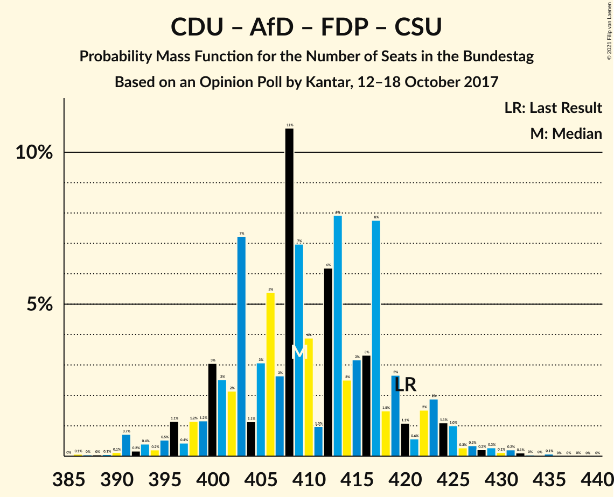

| Number of Seats | Probability | Accumulated | Special Marks |
|:---------------:|:-----------:|:-----------:|:-------------:|
| 385 | 0% | 100% |  |
| 386 | 0.1% | 99.9% |  |
| 387 | 0% | 99.9% |  |
| 388 | 0% | 99.8% |  |
| 389 | 0.1% | 99.8% |  |
| 390 | 0.1% | 99.7% |  |
| 391 | 0.7% | 99.6% |  |
| 392 | 0.2% | 98.9% |  |
| 393 | 0.4% | 98.7% |  |
| 394 | 0.2% | 98% |  |
| 395 | 0.5% | 98% |  |
| 396 | 1.1% | 98% |  |
| 397 | 0.4% | 96% |  |
| 398 | 1.2% | 96% |  |
| 399 | 1.2% | 95% |  |
| 400 | 3% | 94% |  |
| 401 | 3% | 91% |  |
| 402 | 2% | 88% |  |
| 403 | 7% | 86% |  |
| 404 | 1.1% | 79% |  |
| 405 | 3% | 78% |  |
| 406 | 5% | 75% |  |
| 407 | 3% | 69% |  |
| 408 | 11% | 67% |  |
| 409 | 7% | 56% |  |
| 410 | 4% | 49% | Median |
| 411 | 1.0% | 45% |  |
| 412 | 6% | 44% |  |
| 413 | 8% | 38% |  |
| 414 | 3% | 30% |  |
| 415 | 3% | 27% |  |
| 416 | 3% | 24% |  |
| 417 | 8% | 21% |  |
| 418 | 1.5% | 13% |  |
| 419 | 3% | 12% |  |
| 420 | 1.1% | 9% | Last Result |
| 421 | 0.6% | 8% |  |
| 422 | 2% | 7% |  |
| 423 | 2% | 6% |  |
| 424 | 1.1% | 4% |  |
| 425 | 1.0% | 3% |  |
| 426 | 0.3% | 2% |  |
| 427 | 0.3% | 1.4% |  |
| 428 | 0.2% | 1.1% |  |
| 429 | 0.3% | 0.9% |  |
| 430 | 0.1% | 0.6% |  |
| 431 | 0.2% | 0.5% |  |
| 432 | 0.1% | 0.3% |  |
| 433 | 0% | 0.2% |  |
| 434 | 0% | 0.1% |  |
| 435 | 0.1% | 0.1% |  |
| 436 | 0% | 0% |  |

### Christlich Demokratische Union Deutschlands – Freie Demokratische Partei – Bündnis 90/Die Grünen – Christlich-Soziale Union in Bayern

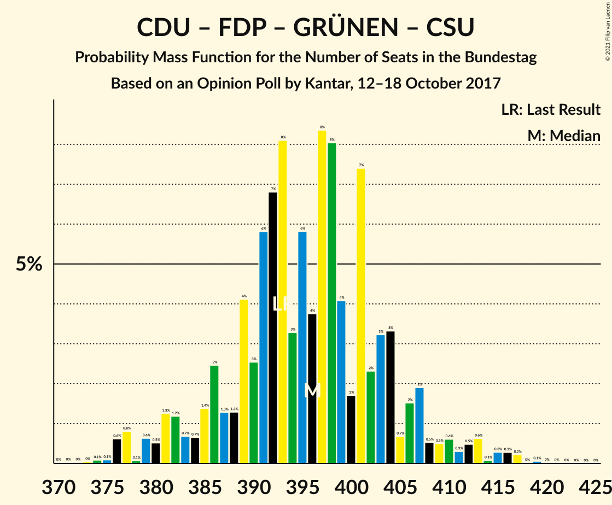

| Number of Seats | Probability | Accumulated | Special Marks |
|:---------------:|:-----------:|:-----------:|:-------------:|
| 371 | 0% | 100% |  |
| 372 | 0% | 99.9% |  |
| 373 | 0% | 99.9% |  |
| 374 | 0.1% | 99.9% |  |
| 375 | 0.1% | 99.8% |  |
| 376 | 0.6% | 99.7% |  |
| 377 | 0.8% | 99.1% |  |
| 378 | 0.1% | 98% |  |
| 379 | 0.6% | 98% |  |
| 380 | 0.5% | 98% |  |
| 381 | 1.3% | 97% |  |
| 382 | 1.2% | 96% |  |
| 383 | 0.7% | 95% |  |
| 384 | 0.7% | 94% |  |
| 385 | 1.4% | 93% |  |
| 386 | 2% | 92% |  |
| 387 | 1.3% | 89% |  |
| 388 | 1.3% | 88% |  |
| 389 | 4% | 87% |  |
| 390 | 3% | 83% |  |
| 391 | 6% | 80% |  |
| 392 | 7% | 74% |  |
| 393 | 8% | 68% | Last Result |
| 394 | 3% | 59% |  |
| 395 | 6% | 56% |  |
| 396 | 4% | 50% | Median |
| 397 | 8% | 47% |  |
| 398 | 8% | 38% |  |
| 399 | 4% | 30% |  |
| 400 | 2% | 26% |  |
| 401 | 7% | 24% |  |
| 402 | 2% | 17% |  |
| 403 | 3% | 15% |  |
| 404 | 3% | 11% |  |
| 405 | 0.7% | 8% |  |
| 406 | 2% | 7% |  |
| 407 | 2% | 6% |  |
| 408 | 0.5% | 4% |  |
| 409 | 0.5% | 4% |  |
| 410 | 0.6% | 3% |  |
| 411 | 0.3% | 2% |  |
| 412 | 0.5% | 2% |  |
| 413 | 0.6% | 2% |  |
| 414 | 0.1% | 1.0% |  |
| 415 | 0.3% | 0.9% |  |
| 416 | 0.3% | 0.6% |  |
| 417 | 0.2% | 0.3% |  |
| 418 | 0% | 0.1% |  |
| 419 | 0.1% | 0.1% |  |
| 420 | 0% | 0.1% |  |
| 421 | 0% | 0% |  |

### Christlich Demokratische Union Deutschlands – Sozialdemokratische Partei Deutschlands – Christlich-Soziale Union in Bayern

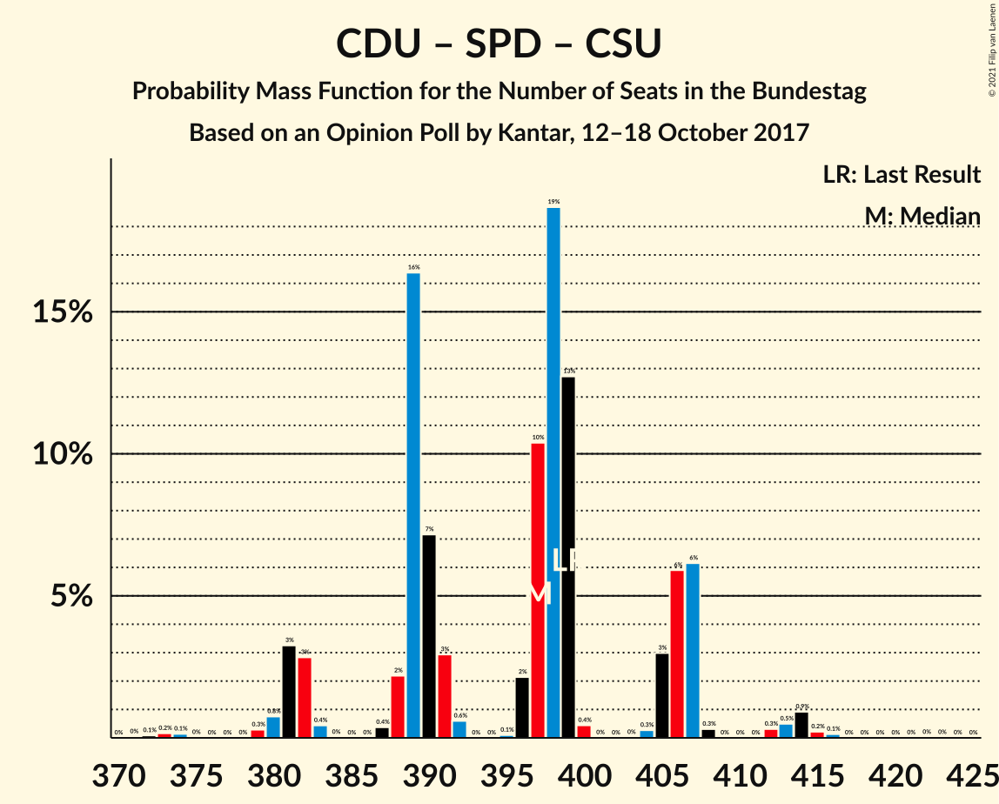

| Number of Seats | Probability | Accumulated | Special Marks |
|:---------------:|:-----------:|:-----------:|:-------------:|
| 371 | 0% | 100% |  |
| 372 | 0.1% | 99.9% |  |
| 373 | 0.2% | 99.9% |  |
| 374 | 0.1% | 99.7% |  |
| 375 | 0% | 99.6% |  |
| 376 | 0% | 99.5% |  |
| 377 | 0% | 99.5% |  |
| 378 | 0% | 99.5% |  |
| 379 | 0.3% | 99.5% |  |
| 380 | 0.8% | 99.2% |  |
| 381 | 3% | 98% |  |
| 382 | 3% | 95% |  |
| 383 | 0.4% | 92% |  |
| 384 | 0% | 92% |  |
| 385 | 0% | 92% |  |
| 386 | 0% | 92% |  |
| 387 | 0.4% | 92% |  |
| 388 | 2% | 92% |  |
| 389 | 16% | 89% |  |
| 390 | 7% | 73% |  |
| 391 | 3% | 66% |  |
| 392 | 0.6% | 63% |  |
| 393 | 0% | 62% |  |
| 394 | 0% | 62% |  |
| 395 | 0.1% | 62% |  |
| 396 | 2% | 62% | Median |
| 397 | 10% | 60% |  |
| 398 | 19% | 50% |  |
| 399 | 13% | 31% | Last Result |
| 400 | 0.4% | 18% |  |
| 401 | 0% | 18% |  |
| 402 | 0% | 18% |  |
| 403 | 0% | 18% |  |
| 404 | 0.3% | 18% |  |
| 405 | 3% | 17% |  |
| 406 | 6% | 15% |  |
| 407 | 6% | 9% |  |
| 408 | 0.3% | 2% |  |
| 409 | 0% | 2% |  |
| 410 | 0% | 2% |  |
| 411 | 0% | 2% |  |
| 412 | 0.3% | 2% |  |
| 413 | 0.5% | 2% |  |
| 414 | 0.9% | 1.3% |  |
| 415 | 0.2% | 0.4% |  |
| 416 | 0.1% | 0.2% |  |
| 417 | 0% | 0.1% |  |
| 418 | 0% | 0.1% |  |
| 419 | 0% | 0.1% |  |
| 420 | 0% | 0.1% |  |
| 421 | 0% | 0.1% |  |
| 422 | 0% | 0.1% |  |
| 423 | 0% | 0% |  |

### Christlich Demokratische Union Deutschlands – Alternative für Deutschland – Christlich-Soziale Union in Bayern

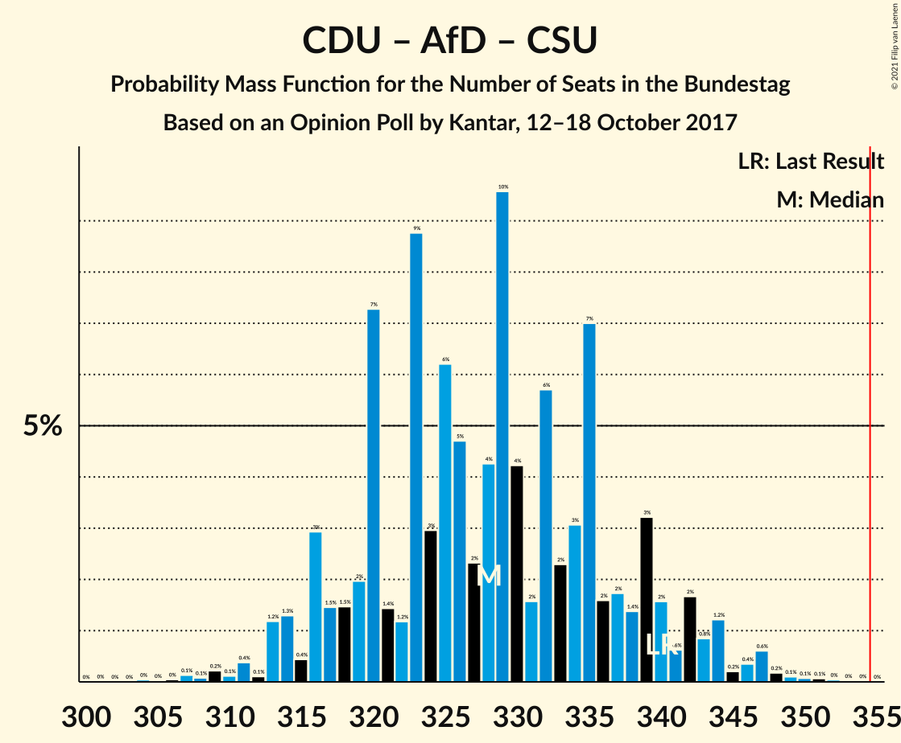

| Number of Seats | Probability | Accumulated | Special Marks |
|:---------------:|:-----------:|:-----------:|:-------------:|
| 304 | 0% | 100% |  |
| 305 | 0% | 99.9% |  |
| 306 | 0% | 99.9% |  |
| 307 | 0.1% | 99.9% |  |
| 308 | 0.1% | 99.7% |  |
| 309 | 0.2% | 99.6% |  |
| 310 | 0.1% | 99.4% |  |
| 311 | 0.4% | 99.3% |  |
| 312 | 0.1% | 98.9% |  |
| 313 | 1.2% | 98.8% |  |
| 314 | 1.3% | 98% |  |
| 315 | 0.4% | 96% |  |
| 316 | 3% | 96% |  |
| 317 | 1.5% | 93% |  |
| 318 | 1.5% | 92% |  |
| 319 | 2% | 90% |  |
| 320 | 7% | 88% |  |
| 321 | 1.4% | 81% |  |
| 322 | 1.2% | 79% |  |
| 323 | 9% | 78% |  |
| 324 | 3% | 69% |  |
| 325 | 6% | 66% |  |
| 326 | 5% | 60% |  |
| 327 | 2% | 56% |  |
| 328 | 4% | 53% | Median |
| 329 | 10% | 49% |  |
| 330 | 4% | 39% |  |
| 331 | 2% | 35% |  |
| 332 | 6% | 34% |  |
| 333 | 2% | 28% |  |
| 334 | 3% | 26% |  |
| 335 | 7% | 23% |  |
| 336 | 2% | 16% |  |
| 337 | 2% | 14% |  |
| 338 | 1.4% | 12% |  |
| 339 | 3% | 11% |  |
| 340 | 2% | 8% | Last Result |
| 341 | 0.6% | 6% |  |
| 342 | 2% | 5% |  |
| 343 | 0.8% | 4% |  |
| 344 | 1.2% | 3% |  |
| 345 | 0.2% | 2% |  |
| 346 | 0.4% | 1.5% |  |
| 347 | 0.6% | 1.1% |  |
| 348 | 0.2% | 0.5% |  |
| 349 | 0.1% | 0.3% |  |
| 350 | 0.1% | 0.2% |  |
| 351 | 0.1% | 0.2% |  |
| 352 | 0% | 0.1% |  |
| 353 | 0% | 0.1% |  |
| 354 | 0% | 0% |  |

### Christlich Demokratische Union Deutschlands – Freie Demokratische Partei – Christlich-Soziale Union in Bayern

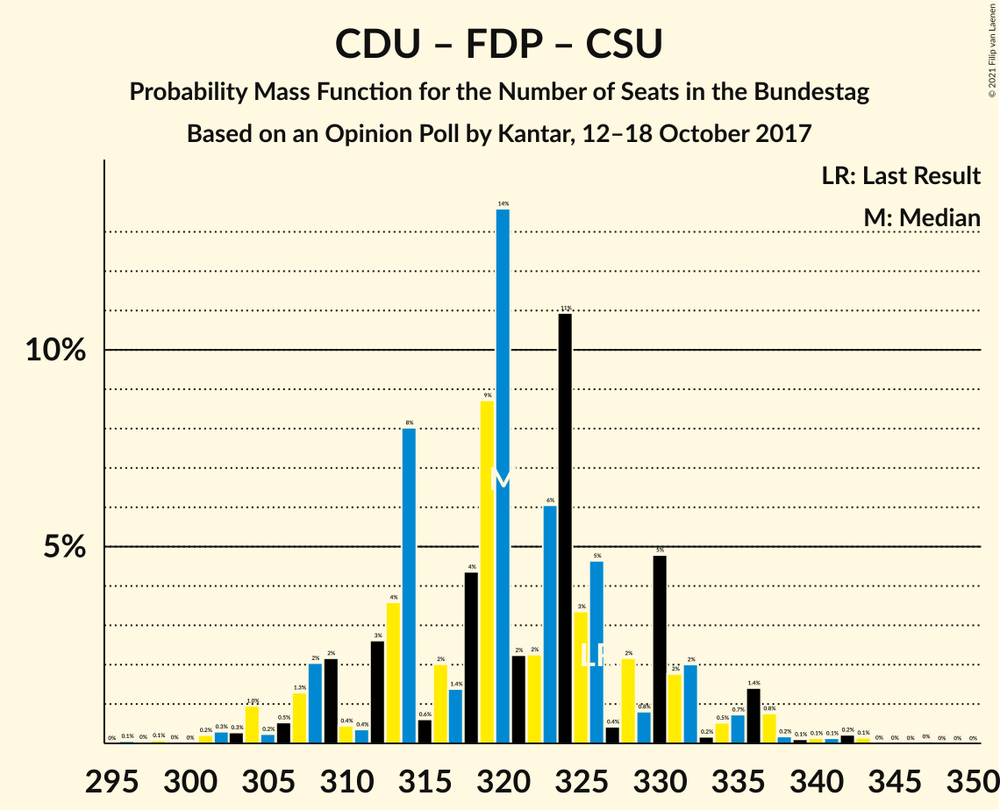

| Number of Seats | Probability | Accumulated | Special Marks |
|:---------------:|:-----------:|:-----------:|:-------------:|
| 296 | 0.1% | 100% |  |
| 297 | 0% | 99.9% |  |
| 298 | 0.1% | 99.9% |  |
| 299 | 0% | 99.8% |  |
| 300 | 0% | 99.8% |  |
| 301 | 0.2% | 99.8% |  |
| 302 | 0.3% | 99.6% |  |
| 303 | 0.3% | 99.3% |  |
| 304 | 1.0% | 99.0% |  |
| 305 | 0.2% | 98% |  |
| 306 | 0.5% | 98% |  |
| 307 | 1.3% | 97% |  |
| 308 | 2% | 96% |  |
| 309 | 2% | 94% |  |
| 310 | 0.4% | 92% |  |
| 311 | 0.4% | 91% |  |
| 312 | 3% | 91% |  |
| 313 | 4% | 88% |  |
| 314 | 8% | 85% |  |
| 315 | 0.6% | 77% |  |
| 316 | 2% | 76% |  |
| 317 | 1.4% | 74% |  |
| 318 | 4% | 73% |  |
| 319 | 9% | 68% |  |
| 320 | 14% | 60% |  |
| 321 | 2% | 46% | Median |
| 322 | 2% | 44% |  |
| 323 | 6% | 42% |  |
| 324 | 11% | 35% |  |
| 325 | 3% | 25% |  |
| 326 | 5% | 21% | Last Result |
| 327 | 0.4% | 17% |  |
| 328 | 2% | 16% |  |
| 329 | 0.8% | 14% |  |
| 330 | 5% | 13% |  |
| 331 | 2% | 8% |  |
| 332 | 2% | 7% |  |
| 333 | 0.2% | 5% |  |
| 334 | 0.5% | 4% |  |
| 335 | 0.7% | 4% |  |
| 336 | 1.4% | 3% |  |
| 337 | 0.8% | 2% |  |
| 338 | 0.2% | 1.0% |  |
| 339 | 0.1% | 0.8% |  |
| 340 | 0.1% | 0.7% |  |
| 341 | 0.1% | 0.6% |  |
| 342 | 0.2% | 0.5% |  |
| 343 | 0.1% | 0.2% |  |
| 344 | 0% | 0.1% |  |
| 345 | 0% | 0.1% |  |
| 346 | 0% | 0.1% |  |
| 347 | 0% | 0.1% |  |
| 348 | 0% | 0% |  |

### Christlich Demokratische Union Deutschlands – Bündnis 90/Die Grünen – Christlich-Soziale Union in Bayern

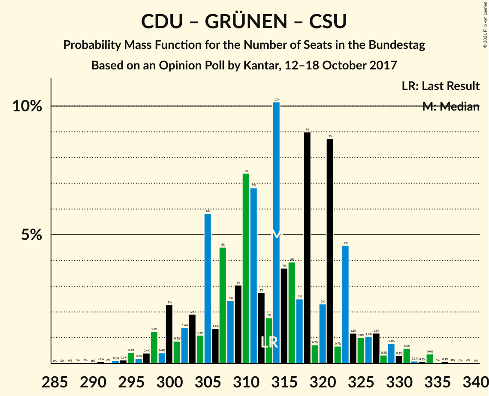

| Number of Seats | Probability | Accumulated | Special Marks |
|:---------------:|:-----------:|:-----------:|:-------------:|
| 288 | 0% | 100% |  |
| 289 | 0% | 99.9% |  |
| 290 | 0% | 99.9% |  |
| 291 | 0.1% | 99.9% |  |
| 292 | 0% | 99.8% |  |
| 293 | 0.1% | 99.8% |  |
| 294 | 0.1% | 99.7% |  |
| 295 | 0.4% | 99.6% |  |
| 296 | 0.2% | 99.1% |  |
| 297 | 0.4% | 98.9% |  |
| 298 | 1.2% | 98.5% |  |
| 299 | 0.4% | 97% |  |
| 300 | 2% | 97% |  |
| 301 | 0.9% | 95% |  |
| 302 | 1.4% | 94% |  |
| 303 | 2% | 92% |  |
| 304 | 1.1% | 90% |  |
| 305 | 6% | 89% |  |
| 306 | 1.4% | 84% |  |
| 307 | 5% | 82% |  |
| 308 | 2% | 78% |  |
| 309 | 3% | 75% |  |
| 310 | 7% | 72% |  |
| 311 | 7% | 65% |  |
| 312 | 3% | 58% |  |
| 313 | 2% | 55% | Last Result |
| 314 | 10% | 53% | Median |
| 315 | 4% | 43% |  |
| 316 | 4% | 40% |  |
| 317 | 3% | 36% |  |
| 318 | 9% | 33% |  |
| 319 | 0.7% | 24% |  |
| 320 | 2% | 23% |  |
| 321 | 9% | 21% |  |
| 322 | 0.7% | 12% |  |
| 323 | 5% | 12% |  |
| 324 | 1.2% | 7% |  |
| 325 | 1.0% | 6% |  |
| 326 | 1.0% | 5% |  |
| 327 | 1.2% | 4% |  |
| 328 | 0.3% | 3% |  |
| 329 | 0.8% | 2% |  |
| 330 | 0.3% | 2% |  |
| 331 | 0.6% | 1.3% |  |
| 332 | 0.1% | 0.7% |  |
| 333 | 0.1% | 0.6% |  |
| 334 | 0.4% | 0.6% |  |
| 335 | 0% | 0.2% |  |
| 336 | 0.1% | 0.2% |  |
| 337 | 0% | 0.1% |  |
| 338 | 0% | 0.1% |  |
| 339 | 0% | 0.1% |  |
| 340 | 0% | 0% |  |

### Sozialdemokratische Partei Deutschlands – Freie Demokratische Partei – Bündnis 90/Die Grünen

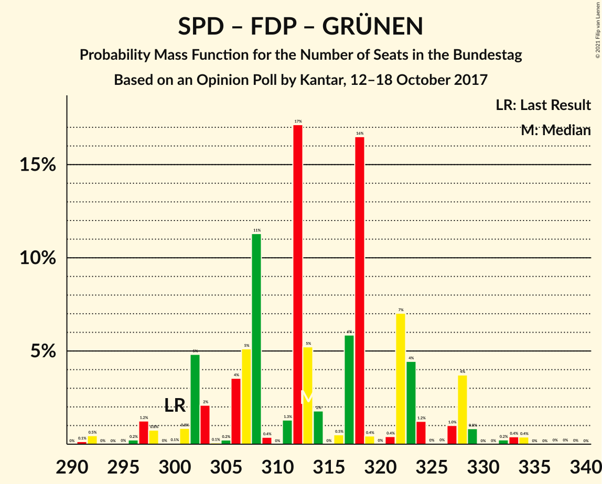

| Number of Seats | Probability | Accumulated | Special Marks |
|:---------------:|:-----------:|:-----------:|:-------------:|
| 291 | 0.1% | 100% |  |
| 292 | 0.5% | 99.8% |  |
| 293 | 0% | 99.4% |  |
| 294 | 0% | 99.3% |  |
| 295 | 0% | 99.3% |  |
| 296 | 0.2% | 99.3% |  |
| 297 | 1.2% | 99.1% |  |
| 298 | 0.8% | 98% |  |
| 299 | 0% | 97% |  |
| 300 | 0.1% | 97% | Last Result |
| 301 | 0.8% | 97% |  |
| 302 | 5% | 96% |  |
| 303 | 2% | 91% |  |
| 304 | 0.1% | 89% |  |
| 305 | 0.2% | 89% |  |
| 306 | 4% | 89% |  |
| 307 | 5% | 85% |  |
| 308 | 11% | 80% |  |
| 309 | 0.4% | 69% |  |
| 310 | 0% | 69% |  |
| 311 | 1.3% | 69% |  |
| 312 | 17% | 67% |  |
| 313 | 5% | 50% |  |
| 314 | 2% | 45% | Median |
| 315 | 0% | 43% |  |
| 316 | 0.5% | 43% |  |
| 317 | 6% | 43% |  |
| 318 | 16% | 37% |  |
| 319 | 0.4% | 20% |  |
| 320 | 0% | 20% |  |
| 321 | 0.4% | 20% |  |
| 322 | 7% | 19% |  |
| 323 | 4% | 12% |  |
| 324 | 1.2% | 8% |  |
| 325 | 0% | 7% |  |
| 326 | 0% | 7% |  |
| 327 | 1.0% | 7% |  |
| 328 | 4% | 6% |  |
| 329 | 0.8% | 2% |  |
| 330 | 0% | 1.1% |  |
| 331 | 0% | 1.1% |  |
| 332 | 0.2% | 1.1% |  |
| 333 | 0.4% | 0.9% |  |
| 334 | 0.4% | 0.5% |  |
| 335 | 0% | 0.1% |  |
| 336 | 0% | 0.1% |  |
| 337 | 0% | 0.1% |  |
| 338 | 0% | 0.1% |  |
| 339 | 0% | 0% |  |

### Sozialdemokratische Partei Deutschlands – Bündnis 90/Die Grünen – Die Linke

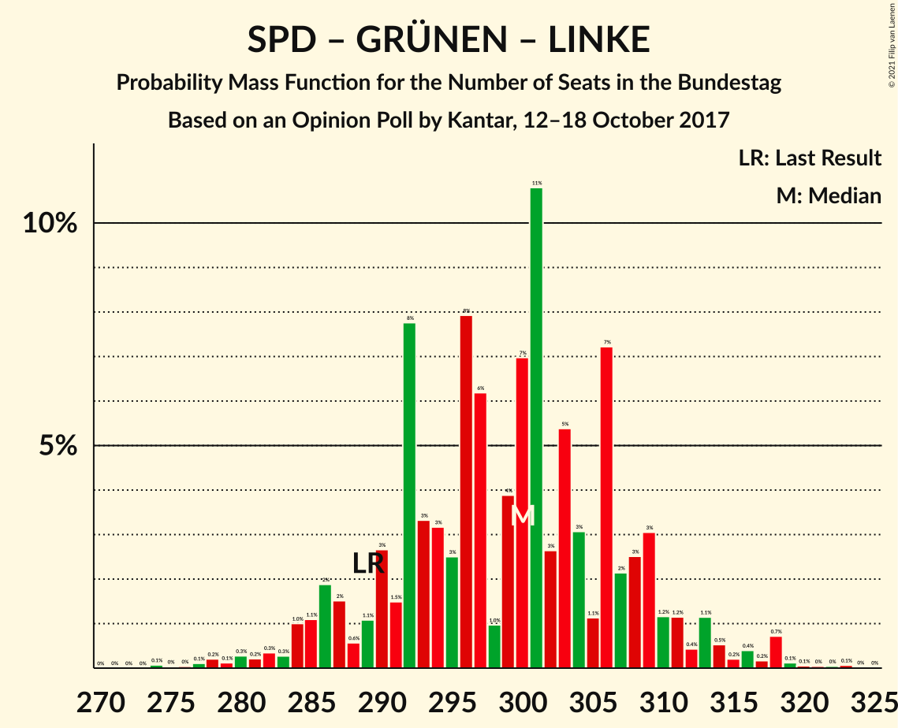

| Number of Seats | Probability | Accumulated | Special Marks |
|:---------------:|:-----------:|:-----------:|:-------------:|
| 274 | 0.1% | 100% |  |
| 275 | 0% | 99.9% |  |
| 276 | 0% | 99.9% |  |
| 277 | 0.1% | 99.8% |  |
| 278 | 0.2% | 99.7% |  |
| 279 | 0.1% | 99.5% |  |
| 280 | 0.3% | 99.4% |  |
| 281 | 0.2% | 99.1% |  |
| 282 | 0.3% | 98.9% |  |
| 283 | 0.3% | 98.6% |  |
| 284 | 1.0% | 98% |  |
| 285 | 1.1% | 97% |  |
| 286 | 2% | 96% |  |
| 287 | 2% | 94% |  |
| 288 | 0.6% | 93% |  |
| 289 | 1.1% | 92% | Last Result |
| 290 | 3% | 91% |  |
| 291 | 1.5% | 88% |  |
| 292 | 8% | 87% |  |
| 293 | 3% | 79% |  |
| 294 | 3% | 76% |  |
| 295 | 3% | 73% |  |
| 296 | 8% | 70% |  |
| 297 | 6% | 62% |  |
| 298 | 1.0% | 56% |  |
| 299 | 4% | 55% |  |
| 300 | 7% | 51% | Median |
| 301 | 11% | 44% |  |
| 302 | 3% | 33% |  |
| 303 | 5% | 31% |  |
| 304 | 3% | 25% |  |
| 305 | 1.1% | 22% |  |
| 306 | 7% | 21% |  |
| 307 | 2% | 14% |  |
| 308 | 3% | 12% |  |
| 309 | 3% | 9% |  |
| 310 | 1.2% | 6% |  |
| 311 | 1.2% | 5% |  |
| 312 | 0.4% | 4% |  |
| 313 | 1.1% | 4% |  |
| 314 | 0.5% | 2% |  |
| 315 | 0.2% | 2% |  |
| 316 | 0.4% | 2% |  |
| 317 | 0.2% | 1.3% |  |
| 318 | 0.7% | 1.1% |  |
| 319 | 0.1% | 0.4% |  |
| 320 | 0.1% | 0.3% |  |
| 321 | 0% | 0.2% |  |
| 322 | 0% | 0.2% |  |
| 323 | 0.1% | 0.1% |  |
| 324 | 0% | 0.1% |  |
| 325 | 0% | 0% |  |

### Sozialdemokratische Partei Deutschlands – Freie Demokratische Partei

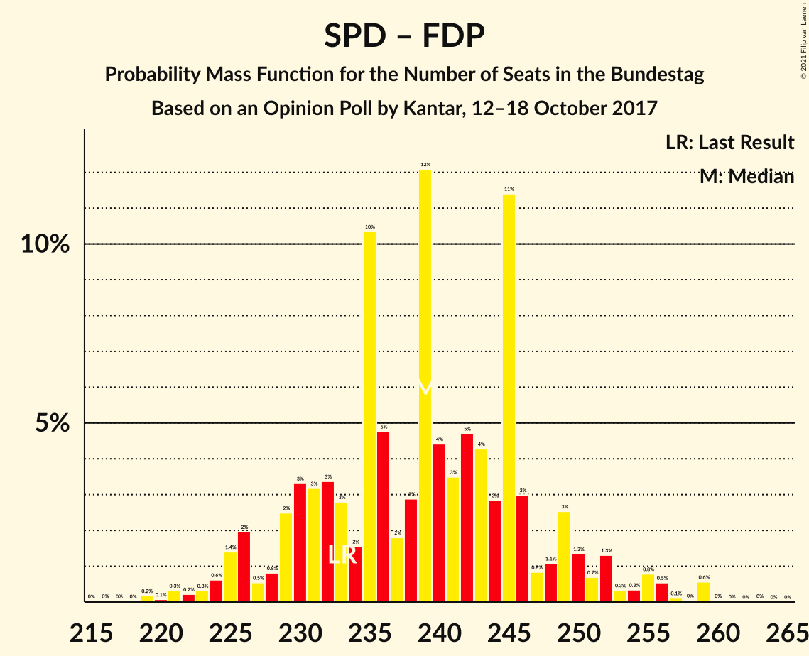

| Number of Seats | Probability | Accumulated | Special Marks |
|:---------------:|:-----------:|:-----------:|:-------------:|
| 216 | 0% | 100% |  |
| 217 | 0% | 99.9% |  |
| 218 | 0% | 99.9% |  |
| 219 | 0.2% | 99.9% |  |
| 220 | 0.1% | 99.7% |  |
| 221 | 0.3% | 99.6% |  |
| 222 | 0.2% | 99.3% |  |
| 223 | 0.3% | 99.1% |  |
| 224 | 0.6% | 98.8% |  |
| 225 | 1.4% | 98% |  |
| 226 | 2% | 97% |  |
| 227 | 0.5% | 95% |  |
| 228 | 0.8% | 94% |  |
| 229 | 2% | 93% |  |
| 230 | 3% | 91% |  |
| 231 | 3% | 88% |  |
| 232 | 3% | 84% |  |
| 233 | 3% | 81% | Last Result |
| 234 | 2% | 78% |  |
| 235 | 10% | 77% |  |
| 236 | 5% | 66% |  |
| 237 | 2% | 62% |  |
| 238 | 3% | 60% |  |
| 239 | 12% | 57% | Median |
| 240 | 4% | 45% |  |
| 241 | 3% | 40% |  |
| 242 | 5% | 37% |  |
| 243 | 4% | 32% |  |
| 244 | 3% | 28% |  |
| 245 | 11% | 25% |  |
| 246 | 3% | 14% |  |
| 247 | 0.8% | 11% |  |
| 248 | 1.1% | 10% |  |
| 249 | 3% | 9% |  |
| 250 | 1.3% | 6% |  |
| 251 | 0.7% | 5% |  |
| 252 | 1.3% | 4% |  |
| 253 | 0.3% | 3% |  |
| 254 | 0.3% | 3% |  |
| 255 | 0.8% | 2% |  |
| 256 | 0.5% | 1.4% |  |
| 257 | 0.1% | 0.9% |  |
| 258 | 0% | 0.7% |  |
| 259 | 0.6% | 0.7% |  |
| 260 | 0% | 0.1% |  |
| 261 | 0% | 0.1% |  |
| 262 | 0% | 0.1% |  |
| 263 | 0% | 0.1% |  |
| 264 | 0% | 0% |  |

### Sozialdemokratische Partei Deutschlands – Bündnis 90/Die Grünen

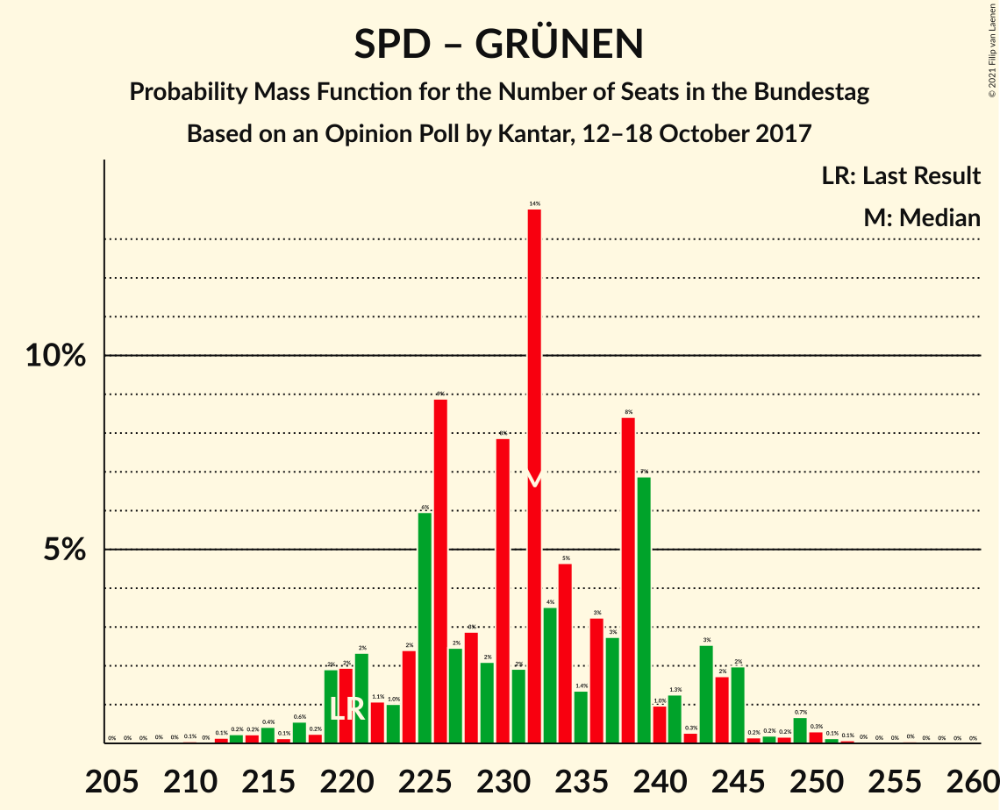

| Number of Seats | Probability | Accumulated | Special Marks |
|:---------------:|:-----------:|:-----------:|:-------------:|
| 208 | 0% | 100% |  |
| 209 | 0% | 99.9% |  |
| 210 | 0.1% | 99.9% |  |
| 211 | 0% | 99.9% |  |
| 212 | 0.1% | 99.8% |  |
| 213 | 0.2% | 99.7% |  |
| 214 | 0.2% | 99.5% |  |
| 215 | 0.4% | 99.2% |  |
| 216 | 0.1% | 98.8% |  |
| 217 | 0.6% | 98.7% |  |
| 218 | 0.2% | 98% |  |
| 219 | 2% | 98% |  |
| 220 | 2% | 96% | Last Result |
| 221 | 2% | 94% |  |
| 222 | 1.1% | 92% |  |
| 223 | 1.0% | 91% |  |
| 224 | 2% | 90% |  |
| 225 | 6% | 87% |  |
| 226 | 9% | 81% |  |
| 227 | 2% | 72% |  |
| 228 | 3% | 70% |  |
| 229 | 2% | 67% |  |
| 230 | 8% | 65% |  |
| 231 | 2% | 57% |  |
| 232 | 14% | 55% | Median |
| 233 | 4% | 41% |  |
| 234 | 5% | 38% |  |
| 235 | 1.4% | 33% |  |
| 236 | 3% | 32% |  |
| 237 | 3% | 29% |  |
| 238 | 8% | 26% |  |
| 239 | 7% | 17% |  |
| 240 | 1.0% | 11% |  |
| 241 | 1.3% | 10% |  |
| 242 | 0.3% | 8% |  |
| 243 | 3% | 8% |  |
| 244 | 2% | 6% |  |
| 245 | 2% | 4% |  |
| 246 | 0.2% | 2% |  |
| 247 | 0.2% | 2% |  |
| 248 | 0.2% | 1.5% |  |
| 249 | 0.7% | 1.3% |  |
| 250 | 0.3% | 0.6% |  |
| 251 | 0.1% | 0.3% |  |
| 252 | 0.1% | 0.2% |  |
| 253 | 0% | 0.1% |  |
| 254 | 0% | 0.1% |  |
| 255 | 0% | 0.1% |  |
| 256 | 0% | 0.1% |  |
| 257 | 0% | 0% |  |

### Sozialdemokratische Partei Deutschlands – Die Linke

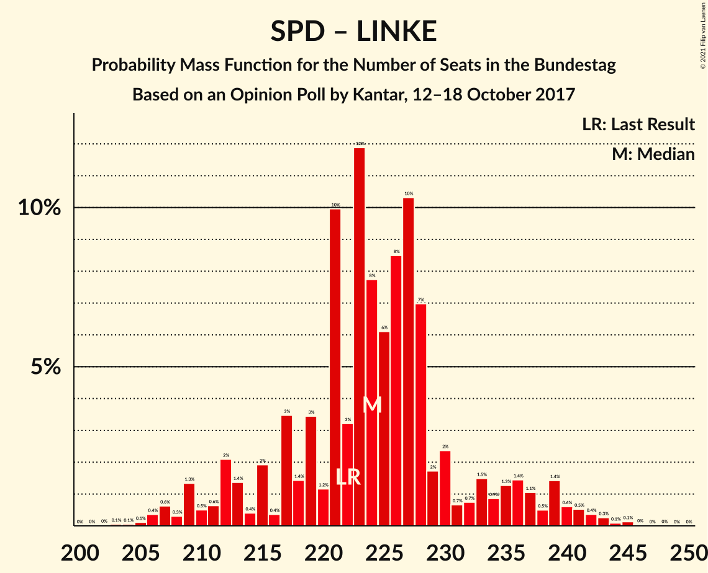

| Number of Seats | Probability | Accumulated | Special Marks |
|:---------------:|:-----------:|:-----------:|:-------------:|
| 202 | 0% | 100% |  |
| 203 | 0.1% | 99.9% |  |
| 204 | 0.1% | 99.9% |  |
| 205 | 0.1% | 99.8% |  |
| 206 | 0.4% | 99.7% |  |
| 207 | 0.6% | 99.4% |  |
| 208 | 0.3% | 98.7% |  |
| 209 | 1.3% | 98% |  |
| 210 | 0.5% | 97% |  |
| 211 | 0.6% | 97% |  |
| 212 | 2% | 96% |  |
| 213 | 1.4% | 94% |  |
| 214 | 0.4% | 92% |  |
| 215 | 2% | 92% |  |
| 216 | 0.4% | 90% |  |
| 217 | 3% | 90% |  |
| 218 | 1.4% | 86% |  |
| 219 | 3% | 85% |  |
| 220 | 1.2% | 81% |  |
| 221 | 10% | 80% |  |
| 222 | 3% | 70% | Last Result |
| 223 | 12% | 67% |  |
| 224 | 8% | 55% |  |
| 225 | 6% | 47% | Median |
| 226 | 8% | 41% |  |
| 227 | 10% | 33% |  |
| 228 | 7% | 23% |  |
| 229 | 2% | 16% |  |
| 230 | 2% | 14% |  |
| 231 | 0.7% | 11% |  |
| 232 | 0.7% | 11% |  |
| 233 | 1.5% | 10% |  |
| 234 | 0.9% | 9% |  |
| 235 | 1.3% | 8% |  |
| 236 | 1.4% | 6% |  |
| 237 | 1.1% | 5% |  |
| 238 | 0.5% | 4% |  |
| 239 | 1.4% | 3% |  |
| 240 | 0.6% | 2% |  |
| 241 | 0.5% | 1.4% |  |
| 242 | 0.4% | 0.9% |  |
| 243 | 0.3% | 0.5% |  |
| 244 | 0.1% | 0.3% |  |
| 245 | 0.1% | 0.2% |  |
| 246 | 0% | 0.1% |  |
| 247 | 0% | 0% |  |

## Technical Information

### Opinion Poll

+ **Polling firm:** Kantar
+ **Commissioner(s):** —
+ **Fieldwork period:** 12–18 October 2017

### Calculations

+ **Sample size:** 2304
+ **Simulations done:** 131,072
+ **Error estimate:** 0.76%

