# Opinion Poll by Kantar for Bild am Sonntag, 6–12 December 2018

<a href="#voting-intentions">Voting Intentions</a> | <a href="#seats">Seats</a> | <a href="#coalitions">Coalitions</a> | <a href="#technical-information">Technical Information</a>

## Voting Intentions

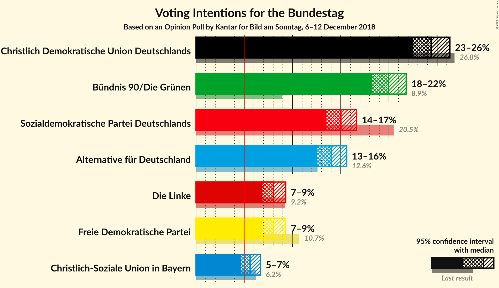

### Confidence Intervals

| Party | Last Result | Poll Result | 80% Confidence Interval | 90% Confidence Interval | 95% Confidence Interval | 99% Confidence Interval |
|:-----:|:-----------:|:-----------:|:-----------------------:|:-----------------------:|:-----------------------:|:-----------------------:|
| Christlich Demokratische Union Deutschlands | 26.8% | 24.4% | 23.2–25.7% |22.8–26.0% |22.5–26.3% |22.0–26.9% |
| Bündnis 90/Die Grünen | 8.9% | 20.0% | 18.9–21.2% |18.5–21.5% |18.3–21.8% |17.8–22.4% |
| Sozialdemokratische Partei Deutschlands | 20.5% | 15.0% | 14.0–16.1% |13.7–16.4% |13.5–16.7% |13.1–17.2% |
| Alternative für Deutschland | 12.6% | 14.0% | 13.1–15.1% |12.8–15.4% |12.6–15.6% |12.1–16.1% |
| Freie Demokratische Partei | 10.7% | 8.0% | 7.3–8.9% |7.1–9.1% |6.9–9.3% |6.6–9.7% |
| Die Linke | 9.2% | 8.0% | 7.3–8.9% |7.1–9.1% |6.9–9.3% |6.6–9.7% |
| Christlich-Soziale Union in Bayern | 6.2% | 5.6% | 5.0–6.3% |4.8–6.5% |4.7–6.7% |4.4–7.1% |

*Note:* The poll result column reflects the actual value used in the calculations. Published results may vary slightly, and in addition be rounded to fewer digits.

## Seats

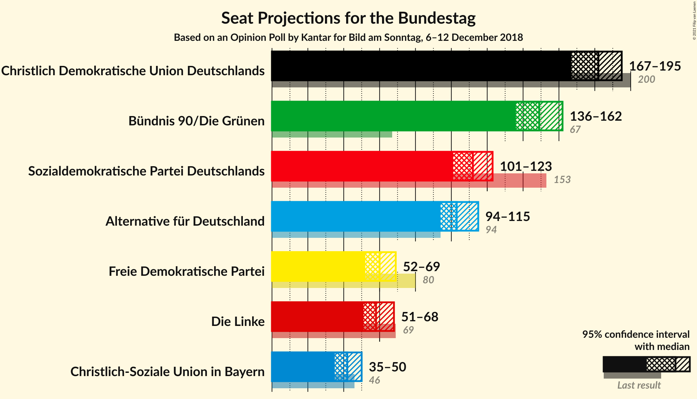

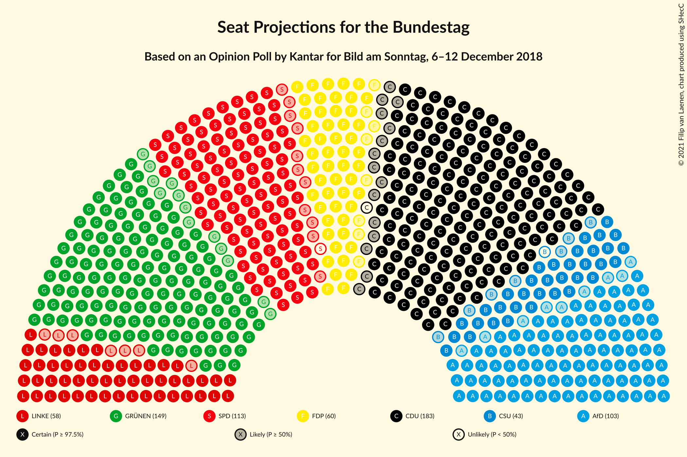

### Confidence Intervals

| Party | Last Result | Median | 80% Confidence Interval | 90% Confidence Interval | 95% Confidence Interval | 99% Confidence Interval |
|:-----:|:-----------:|:------:|:-----------------------:|:-----------------------:|:-----------------------:|:-----------------------:|
| <a href="#christlich-demokratische-union-deutschlands">Christlich Demokratische Union Deutschlands</a> | 200 | 182 | 173–190 |170–193 |167–195 |164–200 |
| <a href="#bündnis-90/die-grünen">Bündnis 90/Die Grünen</a> | 67 | 149 | 141–156 |138–160 |136–162 |133–167 |
| <a href="#sozialdemokratische-partei-deutschlands">Sozialdemokratische Partei Deutschlands</a> | 153 | 112 | 104–119 |103–121 |101–123 |97–128 |
| <a href="#alternative-für-deutschland">Alternative für Deutschland</a> | 94 | 103 | 97–112 |95–114 |94–115 |90–120 |
| <a href="#freie-demokratische-partei">Freie Demokratische Partei</a> | 80 | 60 | 54–66 |53–68 |52–69 |49–72 |
| <a href="#die-linke">Die Linke</a> | 69 | 58 | 54–66 |52–68 |51–68 |48–72 |
| <a href="#christlich-soziale-union-in-bayern">Christlich-Soziale Union in Bayern</a> | 46 | 42 | 37–48 |36–49 |35–50 |33–52 |

### Christlich Demokratische Union Deutschlands

*For a full overview of the results for this party, see the [Christlich Demokratische Union Deutschlands](party-christlichdemokratischeuniondeutschlands.html) page.*

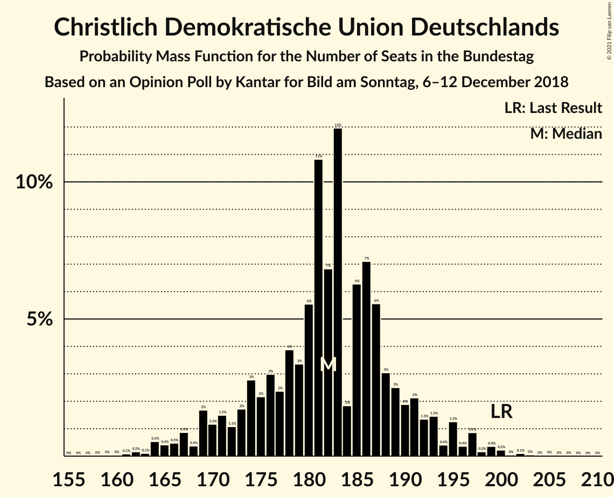

| Number of Seats | Probability | Accumulated | Special Marks |
|:---------------:|:-----------:|:-----------:|:-------------:|
| 159 | 0% | 100% |  |
| 160 | 0% | 99.9% |  |
| 161 | 0.1% | 99.9% |  |
| 162 | 0.2% | 99.8% |  |
| 163 | 0.1% | 99.6% |  |
| 164 | 0.5% | 99.5% |  |
| 165 | 0.4% | 99.0% |  |
| 166 | 0.5% | 98.6% |  |
| 167 | 0.9% | 98% |  |
| 168 | 0.4% | 97% |  |
| 169 | 2% | 97% |  |
| 170 | 1.2% | 95% |  |
| 171 | 1.5% | 94% |  |
| 172 | 1.1% | 93% |  |
| 173 | 2% | 91% |  |
| 174 | 3% | 90% |  |
| 175 | 2% | 87% |  |
| 176 | 3% | 85% |  |
| 177 | 2% | 82% |  |
| 178 | 4% | 79% |  |
| 179 | 3% | 76% |  |
| 180 | 6% | 72% |  |
| 181 | 11% | 67% |  |
| 182 | 7% | 56% | Median |
| 183 | 12% | 49% |  |
| 184 | 2% | 37% |  |
| 185 | 6% | 35% |  |
| 186 | 7% | 29% |  |
| 187 | 6% | 22% |  |
| 188 | 3% | 16% |  |
| 189 | 3% | 13% |  |
| 190 | 2% | 11% |  |
| 191 | 2% | 9% |  |
| 192 | 1.3% | 7% |  |
| 193 | 1.5% | 5% |  |
| 194 | 0.4% | 4% |  |
| 195 | 1.3% | 3% |  |
| 196 | 0.4% | 2% |  |
| 197 | 0.9% | 2% |  |
| 198 | 0.2% | 1.0% |  |
| 199 | 0.4% | 0.9% |  |
| 200 | 0.2% | 0.5% | Last Result |
| 201 | 0% | 0.3% |  |
| 202 | 0.1% | 0.2% |  |
| 203 | 0% | 0.1% |  |
| 204 | 0% | 0.1% |  |
| 205 | 0% | 0.1% |  |
| 206 | 0% | 0% |  |

### Bündnis 90/Die Grünen

*For a full overview of the results for this party, see the [Bündnis 90/Die Grünen](party-bündnis90diegrünen.html) page.*

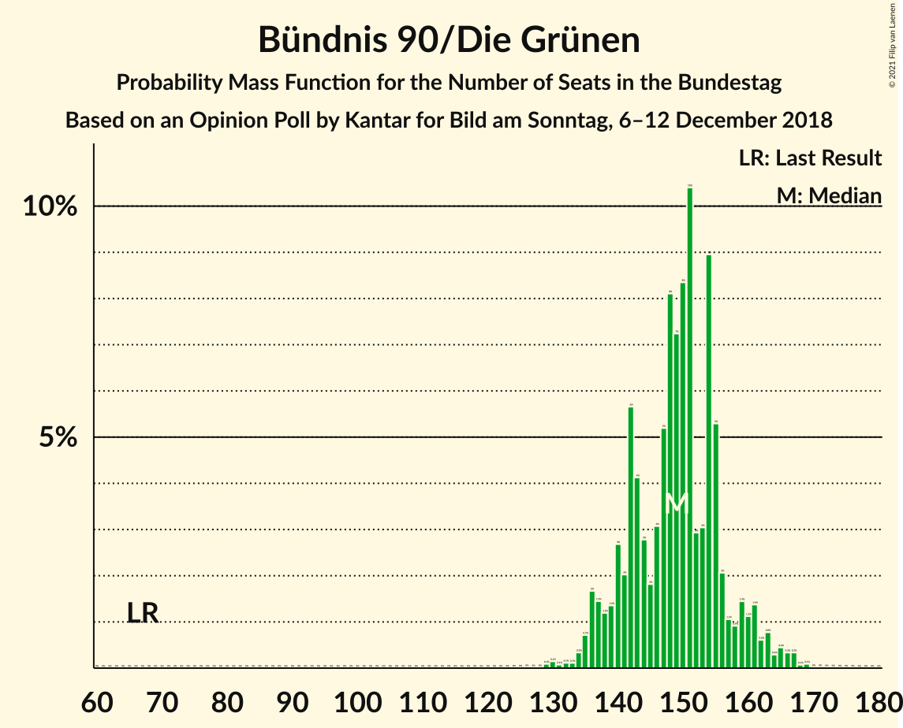

| Number of Seats | Probability | Accumulated | Special Marks |
|:---------------:|:-----------:|:-----------:|:-------------:|
| 67 | 0% | 100% | Last Result |
| 68 | 0% | 100% |  |
| 69 | 0% | 100% |  |
| 70 | 0% | 100% |  |
| 71 | 0% | 100% |  |
| 72 | 0% | 100% |  |
| 73 | 0% | 100% |  |
| 74 | 0% | 100% |  |
| 75 | 0% | 100% |  |
| 76 | 0% | 100% |  |
| 77 | 0% | 100% |  |
| 78 | 0% | 100% |  |
| 79 | 0% | 100% |  |
| 80 | 0% | 100% |  |
| 81 | 0% | 100% |  |
| 82 | 0% | 100% |  |
| 83 | 0% | 100% |  |
| 84 | 0% | 100% |  |
| 85 | 0% | 100% |  |
| 86 | 0% | 100% |  |
| 87 | 0% | 100% |  |
| 88 | 0% | 100% |  |
| 89 | 0% | 100% |  |
| 90 | 0% | 100% |  |
| 91 | 0% | 100% |  |
| 92 | 0% | 100% |  |
| 93 | 0% | 100% |  |
| 94 | 0% | 100% |  |
| 95 | 0% | 100% |  |
| 96 | 0% | 100% |  |
| 97 | 0% | 100% |  |
| 98 | 0% | 100% |  |
| 99 | 0% | 100% |  |
| 100 | 0% | 100% |  |
| 101 | 0% | 100% |  |
| 102 | 0% | 100% |  |
| 103 | 0% | 100% |  |
| 104 | 0% | 100% |  |
| 105 | 0% | 100% |  |
| 106 | 0% | 100% |  |
| 107 | 0% | 100% |  |
| 108 | 0% | 100% |  |
| 109 | 0% | 100% |  |
| 110 | 0% | 100% |  |
| 111 | 0% | 100% |  |
| 112 | 0% | 100% |  |
| 113 | 0% | 100% |  |
| 114 | 0% | 100% |  |
| 115 | 0% | 100% |  |
| 116 | 0% | 100% |  |
| 117 | 0% | 100% |  |
| 118 | 0% | 100% |  |
| 119 | 0% | 100% |  |
| 120 | 0% | 100% |  |
| 121 | 0% | 100% |  |
| 122 | 0% | 100% |  |
| 123 | 0% | 100% |  |
| 124 | 0% | 100% |  |
| 125 | 0% | 100% |  |
| 126 | 0% | 100% |  |
| 127 | 0% | 100% |  |
| 128 | 0% | 100% |  |
| 129 | 0.1% | 100% |  |
| 130 | 0.1% | 99.9% |  |
| 131 | 0.1% | 99.7% |  |
| 132 | 0.1% | 99.6% |  |
| 133 | 0.1% | 99.5% |  |
| 134 | 0.3% | 99.4% |  |
| 135 | 0.7% | 99.1% |  |
| 136 | 2% | 98% |  |
| 137 | 1.5% | 97% |  |
| 138 | 1.2% | 95% |  |
| 139 | 1.4% | 94% |  |
| 140 | 3% | 93% |  |
| 141 | 2% | 90% |  |
| 142 | 6% | 88% |  |
| 143 | 4% | 82% |  |
| 144 | 3% | 78% |  |
| 145 | 2% | 75% |  |
| 146 | 3% | 74% |  |
| 147 | 5% | 71% |  |
| 148 | 8% | 65% |  |
| 149 | 7% | 57% | Median |
| 150 | 8% | 50% |  |
| 151 | 10% | 42% |  |
| 152 | 3% | 31% |  |
| 153 | 3% | 28% |  |
| 154 | 9% | 25% |  |
| 155 | 5% | 16% |  |
| 156 | 2% | 11% |  |
| 157 | 1.1% | 9% |  |
| 158 | 0.9% | 8% |  |
| 159 | 1.4% | 7% |  |
| 160 | 1.1% | 6% |  |
| 161 | 1.4% | 4% |  |
| 162 | 0.6% | 3% |  |
| 163 | 0.8% | 2% |  |
| 164 | 0.3% | 2% |  |
| 165 | 0.4% | 1.3% |  |
| 166 | 0.3% | 0.9% |  |
| 167 | 0.3% | 0.6% |  |
| 168 | 0.1% | 0.2% |  |
| 169 | 0.1% | 0.2% |  |
| 170 | 0% | 0.1% |  |
| 171 | 0% | 0% |  |

### Sozialdemokratische Partei Deutschlands

*For a full overview of the results for this party, see the [Sozialdemokratische Partei Deutschlands](party-sozialdemokratischeparteideutschlands.html) page.*

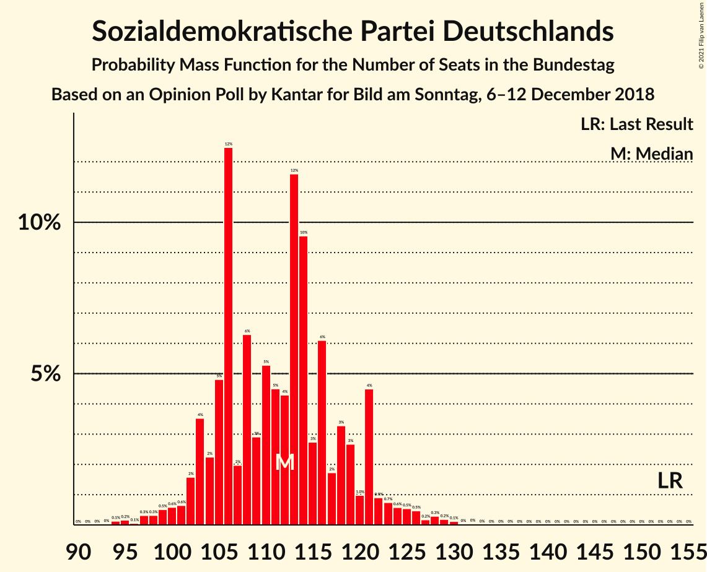

| Number of Seats | Probability | Accumulated | Special Marks |
|:---------------:|:-----------:|:-----------:|:-------------:|
| 94 | 0.1% | 100% |  |
| 95 | 0.2% | 99.8% |  |
| 96 | 0.1% | 99.7% |  |
| 97 | 0.3% | 99.6% |  |
| 98 | 0.3% | 99.3% |  |
| 99 | 0.5% | 99.0% |  |
| 100 | 0.6% | 98% |  |
| 101 | 0.6% | 98% |  |
| 102 | 2% | 97% |  |
| 103 | 4% | 96% |  |
| 104 | 2% | 92% |  |
| 105 | 5% | 90% |  |
| 106 | 12% | 85% |  |
| 107 | 2% | 73% |  |
| 108 | 6% | 71% |  |
| 109 | 3% | 64% |  |
| 110 | 5% | 61% |  |
| 111 | 5% | 56% |  |
| 112 | 4% | 52% | Median |
| 113 | 12% | 47% |  |
| 114 | 10% | 36% |  |
| 115 | 3% | 26% |  |
| 116 | 6% | 23% |  |
| 117 | 2% | 17% |  |
| 118 | 3% | 16% |  |
| 119 | 3% | 12% |  |
| 120 | 1.0% | 10% |  |
| 121 | 4% | 9% |  |
| 122 | 0.9% | 4% |  |
| 123 | 0.7% | 3% |  |
| 124 | 0.6% | 2% |  |
| 125 | 0.5% | 2% |  |
| 126 | 0.5% | 1.4% |  |
| 127 | 0.2% | 0.9% |  |
| 128 | 0.3% | 0.7% |  |
| 129 | 0.2% | 0.4% |  |
| 130 | 0.1% | 0.2% |  |
| 131 | 0% | 0.1% |  |
| 132 | 0% | 0.1% |  |
| 133 | 0% | 0% |  |
| 134 | 0% | 0% |  |
| 135 | 0% | 0% |  |
| 136 | 0% | 0% |  |
| 137 | 0% | 0% |  |
| 138 | 0% | 0% |  |
| 139 | 0% | 0% |  |
| 140 | 0% | 0% |  |
| 141 | 0% | 0% |  |
| 142 | 0% | 0% |  |
| 143 | 0% | 0% |  |
| 144 | 0% | 0% |  |
| 145 | 0% | 0% |  |
| 146 | 0% | 0% |  |
| 147 | 0% | 0% |  |
| 148 | 0% | 0% |  |
| 149 | 0% | 0% |  |
| 150 | 0% | 0% |  |
| 151 | 0% | 0% |  |
| 152 | 0% | 0% |  |
| 153 | 0% | 0% | Last Result |

### Alternative für Deutschland

*For a full overview of the results for this party, see the [Alternative für Deutschland](party-alternativefürdeutschland.html) page.*

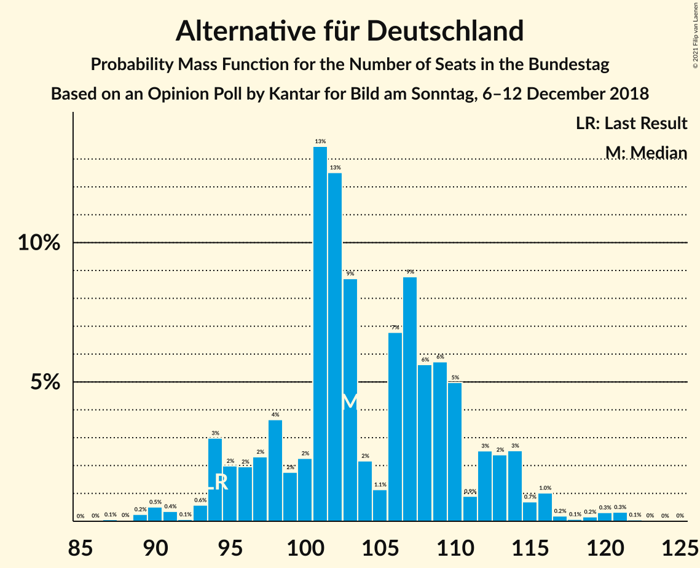

| Number of Seats | Probability | Accumulated | Special Marks |
|:---------------:|:-----------:|:-----------:|:-------------:|
| 87 | 0.1% | 100% |  |
| 88 | 0% | 99.9% |  |
| 89 | 0.2% | 99.9% |  |
| 90 | 0.5% | 99.6% |  |
| 91 | 0.4% | 99.1% |  |
| 92 | 0.1% | 98.7% |  |
| 93 | 0.6% | 98.7% |  |
| 94 | 3% | 98% | Last Result |
| 95 | 2% | 95% |  |
| 96 | 2% | 93% |  |
| 97 | 2% | 91% |  |
| 98 | 4% | 89% |  |
| 99 | 2% | 85% |  |
| 100 | 2% | 83% |  |
| 101 | 13% | 81% |  |
| 102 | 13% | 68% |  |
| 103 | 9% | 55% | Median |
| 104 | 2% | 46% |  |
| 105 | 1.1% | 44% |  |
| 106 | 7% | 43% |  |
| 107 | 9% | 36% |  |
| 108 | 6% | 28% |  |
| 109 | 6% | 22% |  |
| 110 | 5% | 16% |  |
| 111 | 0.9% | 11% |  |
| 112 | 3% | 10% |  |
| 113 | 2% | 8% |  |
| 114 | 3% | 5% |  |
| 115 | 0.7% | 3% |  |
| 116 | 1.0% | 2% |  |
| 117 | 0.2% | 1.2% |  |
| 118 | 0.1% | 1.0% |  |
| 119 | 0.2% | 1.0% |  |
| 120 | 0.3% | 0.8% |  |
| 121 | 0.3% | 0.5% |  |
| 122 | 0.1% | 0.1% |  |
| 123 | 0% | 0.1% |  |
| 124 | 0% | 0.1% |  |
| 125 | 0% | 0% |  |

### Freie Demokratische Partei

*For a full overview of the results for this party, see the [Freie Demokratische Partei](party-freiedemokratischepartei.html) page.*

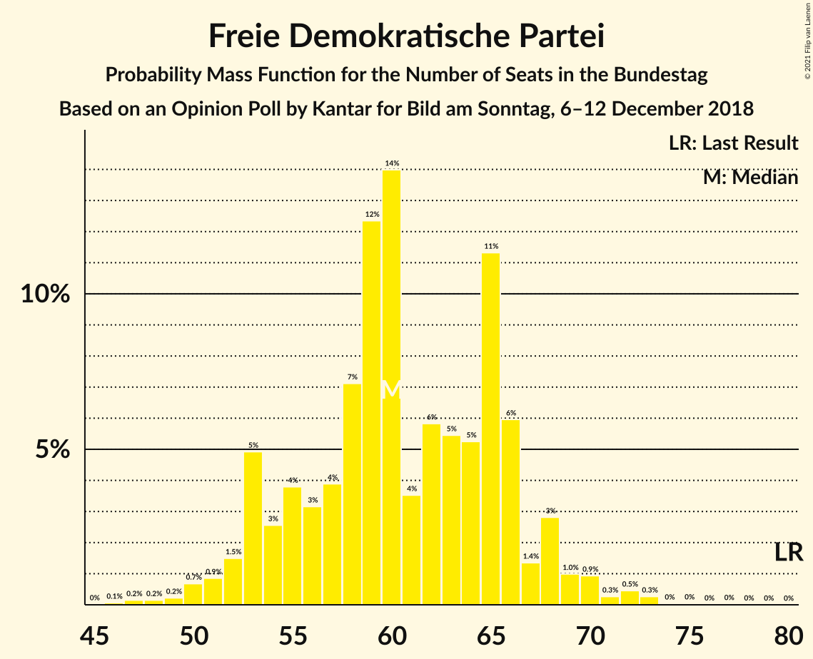

| Number of Seats | Probability | Accumulated | Special Marks |
|:---------------:|:-----------:|:-----------:|:-------------:|
| 46 | 0.1% | 100% |  |
| 47 | 0.2% | 99.9% |  |
| 48 | 0.2% | 99.8% |  |
| 49 | 0.2% | 99.6% |  |
| 50 | 0.7% | 99.4% |  |
| 51 | 0.9% | 98.7% |  |
| 52 | 1.5% | 98% |  |
| 53 | 5% | 96% |  |
| 54 | 3% | 91% |  |
| 55 | 4% | 89% |  |
| 56 | 3% | 85% |  |
| 57 | 4% | 82% |  |
| 58 | 7% | 78% |  |
| 59 | 12% | 71% |  |
| 60 | 14% | 59% | Median |
| 61 | 4% | 45% |  |
| 62 | 6% | 41% |  |
| 63 | 5% | 35% |  |
| 64 | 5% | 30% |  |
| 65 | 11% | 25% |  |
| 66 | 6% | 13% |  |
| 67 | 1.4% | 7% |  |
| 68 | 3% | 6% |  |
| 69 | 1.0% | 3% |  |
| 70 | 0.9% | 2% |  |
| 71 | 0.3% | 1.1% |  |
| 72 | 0.5% | 0.9% |  |
| 73 | 0.3% | 0.4% |  |
| 74 | 0% | 0.1% |  |
| 75 | 0% | 0.1% |  |
| 76 | 0% | 0.1% |  |
| 77 | 0% | 0% |  |
| 78 | 0% | 0% |  |
| 79 | 0% | 0% |  |
| 80 | 0% | 0% | Last Result |

### Die Linke

*For a full overview of the results for this party, see the [Die Linke](party-dielinke.html) page.*

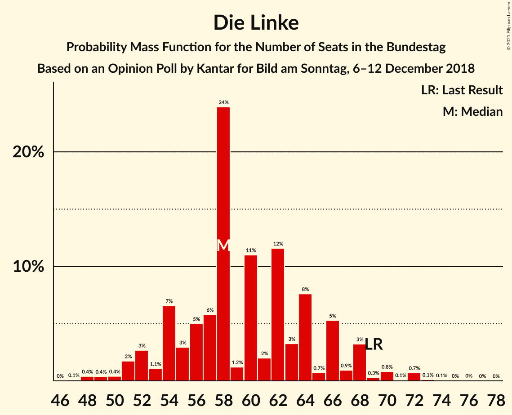

| Number of Seats | Probability | Accumulated | Special Marks |
|:---------------:|:-----------:|:-----------:|:-------------:|
| 46 | 0% | 100% |  |
| 47 | 0.1% | 99.9% |  |
| 48 | 0.4% | 99.8% |  |
| 49 | 0.4% | 99.5% |  |
| 50 | 0.4% | 99.1% |  |
| 51 | 2% | 98.7% |  |
| 52 | 3% | 97% |  |
| 53 | 1.1% | 94% |  |
| 54 | 7% | 93% |  |
| 55 | 3% | 87% |  |
| 56 | 5% | 84% |  |
| 57 | 6% | 79% |  |
| 58 | 24% | 73% | Median |
| 59 | 1.2% | 49% |  |
| 60 | 11% | 48% |  |
| 61 | 2% | 37% |  |
| 62 | 12% | 35% |  |
| 63 | 3% | 23% |  |
| 64 | 8% | 20% |  |
| 65 | 0.7% | 12% |  |
| 66 | 5% | 12% |  |
| 67 | 0.9% | 6% |  |
| 68 | 3% | 5% |  |
| 69 | 0.3% | 2% | Last Result |
| 70 | 0.8% | 2% |  |
| 71 | 0.1% | 1.1% |  |
| 72 | 0.7% | 1.0% |  |
| 73 | 0.1% | 0.3% |  |
| 74 | 0.1% | 0.2% |  |
| 75 | 0% | 0.1% |  |
| 76 | 0% | 0.1% |  |
| 77 | 0% | 0% |  |

### Christlich-Soziale Union in Bayern

*For a full overview of the results for this party, see the [Christlich-Soziale Union in Bayern](party-christlich-sozialeunioninbayern.html) page.*

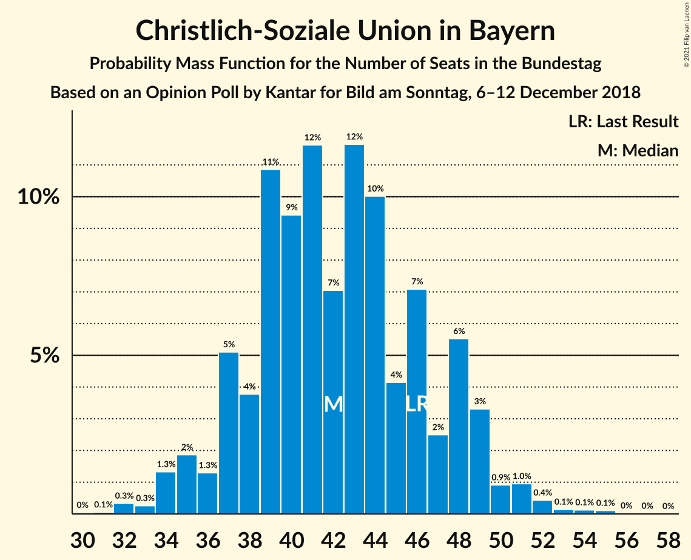

| Number of Seats | Probability | Accumulated | Special Marks |
|:---------------:|:-----------:|:-----------:|:-------------:|
| 30 | 0% | 100% |  |
| 31 | 0.1% | 99.9% |  |
| 32 | 0.3% | 99.9% |  |
| 33 | 0.3% | 99.6% |  |
| 34 | 1.3% | 99.3% |  |
| 35 | 2% | 98% |  |
| 36 | 1.3% | 96% |  |
| 37 | 5% | 95% |  |
| 38 | 4% | 90% |  |
| 39 | 11% | 86% |  |
| 40 | 9% | 75% |  |
| 41 | 12% | 66% |  |
| 42 | 7% | 54% | Median |
| 43 | 12% | 47% |  |
| 44 | 10% | 35% |  |
| 45 | 4% | 25% |  |
| 46 | 7% | 21% | Last Result |
| 47 | 2% | 14% |  |
| 48 | 6% | 12% |  |
| 49 | 3% | 6% |  |
| 50 | 0.9% | 3% |  |
| 51 | 1.0% | 2% |  |
| 52 | 0.4% | 0.9% |  |
| 53 | 0.1% | 0.4% |  |
| 54 | 0.1% | 0.3% |  |
| 55 | 0.1% | 0.2% |  |
| 56 | 0% | 0.1% |  |
| 57 | 0% | 0% |  |

## Coalitions

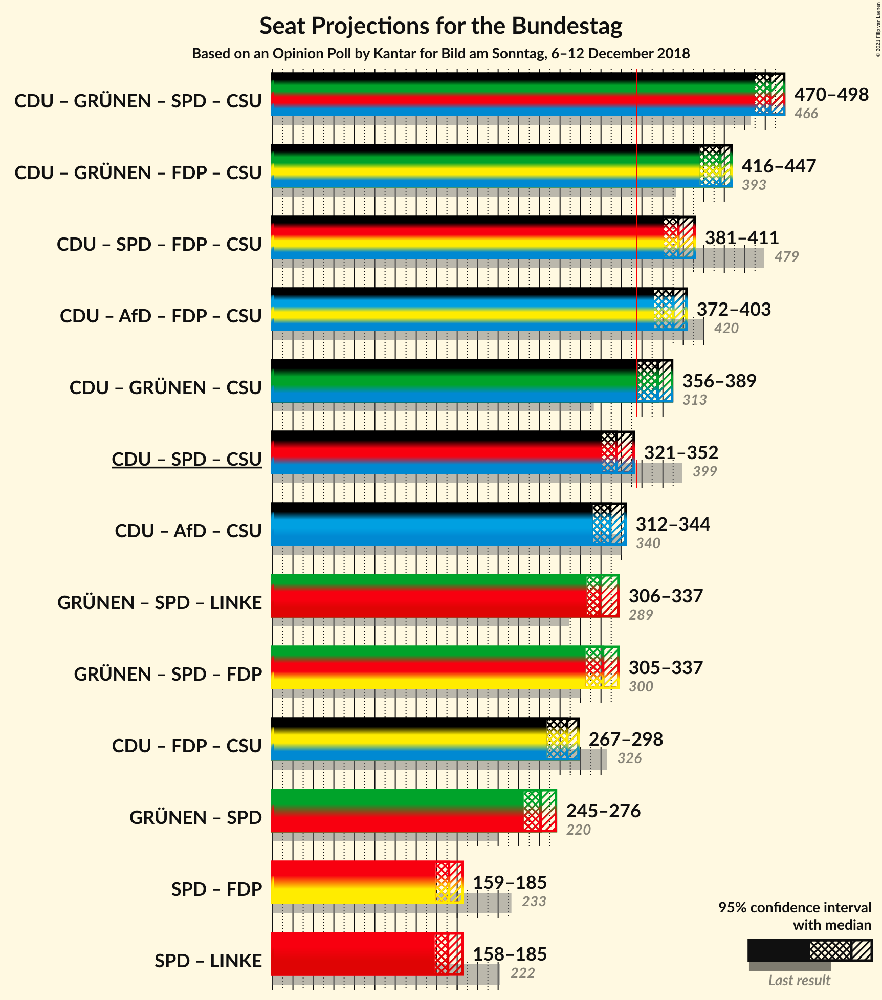

### Confidence Intervals

| Coalition | Last Result | Median | Majority? | 80% Confidence Interval | 90% Confidence Interval | 95% Confidence Interval | 99% Confidence Interval |
|:---------:|:-----------:|:------:|:---------:|:-----------------------:|:-----------------------:|:-----------------------:|:-----------------------:|
| Christlich Demokratische Union Deutschlands – Bündnis 90/Die Grünen – Sozialdemokratische Partei Deutschlands – Christlich-Soziale Union in Bayern | 466 | 485 | 100% | 476–495 | 472–496 | 470–498 | 465–504 |
| Christlich Demokratische Union Deutschlands – Bündnis 90/Die Grünen – Freie Demokratische Partei – Christlich-Soziale Union in Bayern | 393 | 436 | 100% | 423–443 | 420–447 | 416–447 | 411–451 |
| Christlich Demokratische Union Deutschlands – Sozialdemokratische Partei Deutschlands – Freie Demokratische Partei – Christlich-Soziale Union in Bayern | 479 | 395 | 100% | 386–405 | 383–408 | 381–411 | 374–416 |
| Christlich Demokratische Union Deutschlands – Alternative für Deutschland – Freie Demokratische Partei – Christlich-Soziale Union in Bayern | 420 | 390 | 100% | 379–399 | 375–401 | 372–403 | 366–409 |
| Christlich Demokratische Union Deutschlands – Bündnis 90/Die Grünen – Christlich-Soziale Union in Bayern | 313 | 375 | 98.9% | 365–382 | 359–387 | 356–389 | 353–391 |
| Christlich Demokratische Union Deutschlands – Sozialdemokratische Partei Deutschlands – Christlich-Soziale Union in Bayern | 399 | 335 | 1.2% | 326–345 | 322–349 | 321–352 | 315–356 |
| Christlich Demokratische Union Deutschlands – Alternative für Deutschland – Christlich-Soziale Union in Bayern | 340 | 329 | 0.1% | 319–338 | 315–341 | 312–344 | 307–349 |
| Bündnis 90/Die Grünen – Sozialdemokratische Partei Deutschlands – Die Linke | 289 | 319 | 0% | 310–330 | 308–334 | 306–337 | 300–343 |
| Bündnis 90/Die Grünen – Sozialdemokratische Partei Deutschlands – Freie Demokratische Partei | 300 | 322 | 0% | 312–330 | 308–333 | 305–337 | 300–342 |
| Christlich Demokratische Union Deutschlands – Freie Demokratische Partei – Christlich-Soziale Union in Bayern | 326 | 287 | 0% | 273–294 | 270–296 | 267–298 | 262–304 |
| Bündnis 90/Die Grünen – Sozialdemokratische Partei Deutschlands | 220 | 261 | 0% | 252–270 | 247–272 | 245–276 | 242–281 |
| Sozialdemokratische Partei Deutschlands – Freie Demokratische Partei | 233 | 172 | 0% | 163–181 | 161–183 | 159–185 | 154–190 |
| Sozialdemokratische Partei Deutschlands – Die Linke | 222 | 171 | 0% | 163–180 | 161–183 | 158–185 | 154–191 |

### Christlich Demokratische Union Deutschlands – Bündnis 90/Die Grünen – Sozialdemokratische Partei Deutschlands – Christlich-Soziale Union in Bayern

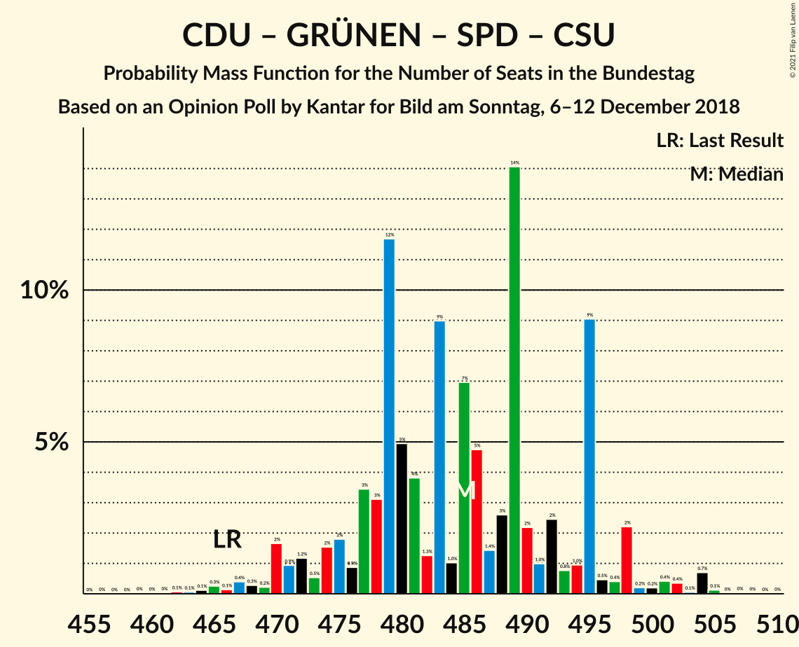

| Number of Seats | Probability | Accumulated | Special Marks |
|:---------------:|:-----------:|:-----------:|:-------------:|
| 459 | 0% | 100% |  |
| 460 | 0% | 99.9% |  |
| 461 | 0% | 99.9% |  |
| 462 | 0.1% | 99.9% |  |
| 463 | 0.1% | 99.8% |  |
| 464 | 0.1% | 99.8% |  |
| 465 | 0.3% | 99.6% |  |
| 466 | 0.1% | 99.4% | Last Result |
| 467 | 0.4% | 99.2% |  |
| 468 | 0.3% | 98.8% |  |
| 469 | 0.2% | 98.6% |  |
| 470 | 2% | 98% |  |
| 471 | 0.9% | 97% |  |
| 472 | 1.2% | 96% |  |
| 473 | 0.5% | 95% |  |
| 474 | 2% | 94% |  |
| 475 | 2% | 92% |  |
| 476 | 0.9% | 91% |  |
| 477 | 3% | 90% |  |
| 478 | 3% | 86% |  |
| 479 | 12% | 83% |  |
| 480 | 5% | 72% |  |
| 481 | 4% | 67% |  |
| 482 | 1.3% | 63% |  |
| 483 | 9% | 62% |  |
| 484 | 1.0% | 53% |  |
| 485 | 7% | 52% | Median |
| 486 | 5% | 45% |  |
| 487 | 1.4% | 40% |  |
| 488 | 3% | 38% |  |
| 489 | 14% | 36% |  |
| 490 | 2% | 22% |  |
| 491 | 1.0% | 20% |  |
| 492 | 2% | 19% |  |
| 493 | 0.8% | 16% |  |
| 494 | 1.0% | 15% |  |
| 495 | 9% | 14% |  |
| 496 | 0.5% | 5% |  |
| 497 | 0.4% | 5% |  |
| 498 | 2% | 4% |  |
| 499 | 0.2% | 2% |  |
| 500 | 0.2% | 2% |  |
| 501 | 0.4% | 2% |  |
| 502 | 0.4% | 1.4% |  |
| 503 | 0.1% | 1.0% |  |
| 504 | 0.7% | 1.0% |  |
| 505 | 0.1% | 0.3% |  |
| 506 | 0% | 0.1% |  |
| 507 | 0% | 0.1% |  |
| 508 | 0% | 0.1% |  |
| 509 | 0% | 0% |  |

### Christlich Demokratische Union Deutschlands – Bündnis 90/Die Grünen – Freie Demokratische Partei – Christlich-Soziale Union in Bayern

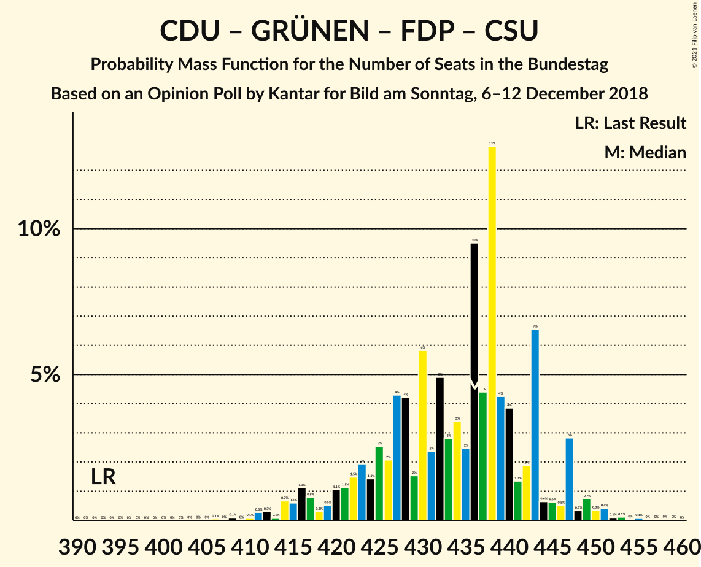

| Number of Seats | Probability | Accumulated | Special Marks |
|:---------------:|:-----------:|:-----------:|:-------------:|
| 393 | 0% | 100% | Last Result |
| 394 | 0% | 100% |  |
| 395 | 0% | 100% |  |
| 396 | 0% | 100% |  |
| 397 | 0% | 100% |  |
| 398 | 0% | 100% |  |
| 399 | 0% | 100% |  |
| 400 | 0% | 100% |  |
| 401 | 0% | 100% |  |
| 402 | 0% | 100% |  |
| 403 | 0% | 100% |  |
| 404 | 0% | 100% |  |
| 405 | 0% | 100% |  |
| 406 | 0.1% | 100% |  |
| 407 | 0% | 99.9% |  |
| 408 | 0.1% | 99.9% |  |
| 409 | 0% | 99.8% |  |
| 410 | 0.1% | 99.8% |  |
| 411 | 0.3% | 99.7% |  |
| 412 | 0.3% | 99.4% |  |
| 413 | 0.1% | 99.1% |  |
| 414 | 0.7% | 99.0% |  |
| 415 | 0.6% | 98% |  |
| 416 | 1.1% | 98% |  |
| 417 | 0.8% | 97% |  |
| 418 | 0.3% | 96% |  |
| 419 | 0.5% | 96% |  |
| 420 | 1.1% | 95% |  |
| 421 | 1.1% | 94% |  |
| 422 | 1.5% | 93% |  |
| 423 | 2% | 91% |  |
| 424 | 1.4% | 89% |  |
| 425 | 3% | 88% |  |
| 426 | 2% | 85% |  |
| 427 | 4% | 83% |  |
| 428 | 4% | 79% |  |
| 429 | 2% | 75% |  |
| 430 | 6% | 73% |  |
| 431 | 2% | 67% |  |
| 432 | 5% | 65% |  |
| 433 | 3% | 60% | Median |
| 434 | 3% | 57% |  |
| 435 | 2% | 54% |  |
| 436 | 10% | 52% |  |
| 437 | 4% | 42% |  |
| 438 | 13% | 38% |  |
| 439 | 4% | 25% |  |
| 440 | 4% | 21% |  |
| 441 | 1.3% | 17% |  |
| 442 | 2% | 15% |  |
| 443 | 7% | 13% |  |
| 444 | 0.6% | 7% |  |
| 445 | 0.6% | 6% |  |
| 446 | 0.5% | 6% |  |
| 447 | 3% | 5% |  |
| 448 | 0.3% | 2% |  |
| 449 | 0.7% | 2% |  |
| 450 | 0.3% | 1.2% |  |
| 451 | 0.4% | 0.9% |  |
| 452 | 0.1% | 0.5% |  |
| 453 | 0.1% | 0.4% |  |
| 454 | 0% | 0.2% |  |
| 455 | 0.1% | 0.2% |  |
| 456 | 0% | 0.1% |  |
| 457 | 0% | 0.1% |  |
| 458 | 0% | 0.1% |  |
| 459 | 0% | 0% |  |

### Christlich Demokratische Union Deutschlands – Sozialdemokratische Partei Deutschlands – Freie Demokratische Partei – Christlich-Soziale Union in Bayern

| Number of Seats | Probability | Accumulated | Special Marks |
|:---------------:|:-----------:|:-----------:|:-------------:|
| 368 | 0% | 100% |  |
| 369 | 0% | 99.9% |  |
| 370 | 0% | 99.9% |  |
| 371 | 0% | 99.9% |  |
| 372 | 0.1% | 99.9% |  |
| 373 | 0.2% | 99.8% |  |
| 374 | 0.2% | 99.6% |  |
| 375 | 0.3% | 99.4% |  |
| 376 | 0.1% | 99.1% |  |
| 377 | 0.3% | 98.9% |  |
| 378 | 0.2% | 98.7% |  |
| 379 | 0.2% | 98% |  |
| 380 | 0.6% | 98% |  |
| 381 | 0.8% | 98% |  |
| 382 | 2% | 97% |  |
| 383 | 1.0% | 95% |  |
| 384 | 2% | 94% |  |
| 385 | 2% | 93% |  |
| 386 | 0.9% | 91% |  |
| 387 | 0.6% | 90% |  |
| 388 | 4% | 89% |  |
| 389 | 3% | 85% |  |
| 390 | 0.8% | 83% |  |
| 391 | 3% | 82% |  |
| 392 | 8% | 79% |  |
| 393 | 8% | 71% |  |
| 394 | 6% | 63% |  |
| 395 | 12% | 58% |  |
| 396 | 2% | 46% | Median |
| 397 | 4% | 45% |  |
| 398 | 2% | 40% |  |
| 399 | 2% | 38% |  |
| 400 | 5% | 36% |  |
| 401 | 4% | 31% |  |
| 402 | 2% | 27% |  |
| 403 | 5% | 24% |  |
| 404 | 8% | 20% |  |
| 405 | 2% | 12% |  |
| 406 | 1.3% | 10% |  |
| 407 | 2% | 8% |  |
| 408 | 2% | 6% |  |
| 409 | 0.6% | 5% |  |
| 410 | 0.4% | 4% |  |
| 411 | 1.5% | 4% |  |
| 412 | 0.5% | 2% |  |
| 413 | 0.7% | 2% |  |
| 414 | 0.4% | 1.2% |  |
| 415 | 0.3% | 0.8% |  |
| 416 | 0.2% | 0.6% |  |
| 417 | 0.1% | 0.3% |  |
| 418 | 0% | 0.2% |  |
| 419 | 0.1% | 0.2% |  |
| 420 | 0% | 0.1% |  |
| 421 | 0% | 0.1% |  |
| 422 | 0% | 0.1% |  |
| 423 | 0% | 0% |  |
| 424 | 0% | 0% |  |
| 425 | 0% | 0% |  |
| 426 | 0% | 0% |  |
| 427 | 0% | 0% |  |
| 428 | 0% | 0% |  |
| 429 | 0% | 0% |  |
| 430 | 0% | 0% |  |
| 431 | 0% | 0% |  |
| 432 | 0% | 0% |  |
| 433 | 0% | 0% |  |
| 434 | 0% | 0% |  |
| 435 | 0% | 0% |  |
| 436 | 0% | 0% |  |
| 437 | 0% | 0% |  |
| 438 | 0% | 0% |  |
| 439 | 0% | 0% |  |
| 440 | 0% | 0% |  |
| 441 | 0% | 0% |  |
| 442 | 0% | 0% |  |
| 443 | 0% | 0% |  |
| 444 | 0% | 0% |  |
| 445 | 0% | 0% |  |
| 446 | 0% | 0% |  |
| 447 | 0% | 0% |  |
| 448 | 0% | 0% |  |
| 449 | 0% | 0% |  |
| 450 | 0% | 0% |  |
| 451 | 0% | 0% |  |
| 452 | 0% | 0% |  |
| 453 | 0% | 0% |  |
| 454 | 0% | 0% |  |
| 455 | 0% | 0% |  |
| 456 | 0% | 0% |  |
| 457 | 0% | 0% |  |
| 458 | 0% | 0% |  |
| 459 | 0% | 0% |  |
| 460 | 0% | 0% |  |
| 461 | 0% | 0% |  |
| 462 | 0% | 0% |  |
| 463 | 0% | 0% |  |
| 464 | 0% | 0% |  |
| 465 | 0% | 0% |  |
| 466 | 0% | 0% |  |
| 467 | 0% | 0% |  |
| 468 | 0% | 0% |  |
| 469 | 0% | 0% |  |
| 470 | 0% | 0% |  |
| 471 | 0% | 0% |  |
| 472 | 0% | 0% |  |
| 473 | 0% | 0% |  |
| 474 | 0% | 0% |  |
| 475 | 0% | 0% |  |
| 476 | 0% | 0% |  |
| 477 | 0% | 0% |  |
| 478 | 0% | 0% |  |
| 479 | 0% | 0% | Last Result |

### Christlich Demokratische Union Deutschlands – Alternative für Deutschland – Freie Demokratische Partei – Christlich-Soziale Union in Bayern

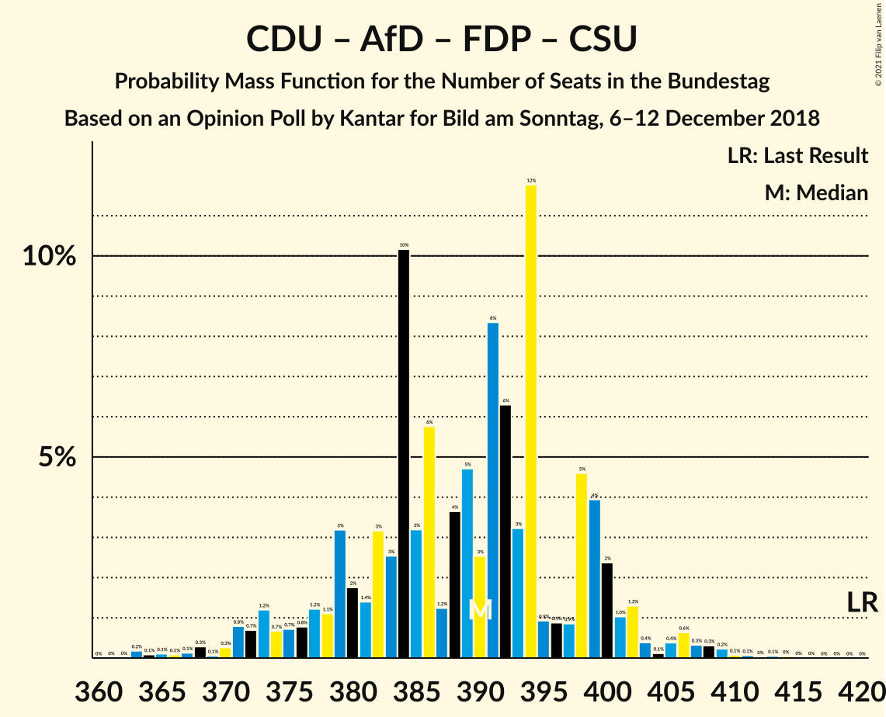

| Number of Seats | Probability | Accumulated | Special Marks |
|:---------------:|:-----------:|:-----------:|:-------------:|
| 363 | 0.2% | 100% |  |
| 364 | 0.1% | 99.8% |  |
| 365 | 0.1% | 99.7% |  |
| 366 | 0.1% | 99.6% |  |
| 367 | 0.1% | 99.5% |  |
| 368 | 0.3% | 99.4% |  |
| 369 | 0.1% | 99.1% |  |
| 370 | 0.3% | 99.0% |  |
| 371 | 0.8% | 98.8% |  |
| 372 | 0.7% | 98% |  |
| 373 | 1.2% | 97% |  |
| 374 | 0.7% | 96% |  |
| 375 | 0.7% | 95% |  |
| 376 | 0.8% | 95% |  |
| 377 | 1.2% | 94% |  |
| 378 | 1.1% | 93% |  |
| 379 | 3% | 92% |  |
| 380 | 2% | 88% |  |
| 381 | 1.4% | 87% |  |
| 382 | 3% | 85% |  |
| 383 | 3% | 82% |  |
| 384 | 10% | 80% |  |
| 385 | 3% | 69% |  |
| 386 | 6% | 66% |  |
| 387 | 1.2% | 60% | Median |
| 388 | 4% | 59% |  |
| 389 | 5% | 56% |  |
| 390 | 3% | 51% |  |
| 391 | 8% | 48% |  |
| 392 | 6% | 40% |  |
| 393 | 3% | 34% |  |
| 394 | 12% | 30% |  |
| 395 | 0.9% | 19% |  |
| 396 | 0.9% | 18% |  |
| 397 | 0.9% | 17% |  |
| 398 | 5% | 16% |  |
| 399 | 4% | 11% |  |
| 400 | 2% | 7% |  |
| 401 | 1.0% | 5% |  |
| 402 | 1.3% | 4% |  |
| 403 | 0.4% | 3% |  |
| 404 | 0.1% | 2% |  |
| 405 | 0.4% | 2% |  |
| 406 | 0.6% | 2% |  |
| 407 | 0.3% | 1.2% |  |
| 408 | 0.3% | 0.8% |  |
| 409 | 0.2% | 0.5% |  |
| 410 | 0.1% | 0.3% |  |
| 411 | 0.1% | 0.2% |  |
| 412 | 0% | 0.2% |  |
| 413 | 0.1% | 0.1% |  |
| 414 | 0% | 0.1% |  |
| 415 | 0% | 0% |  |
| 416 | 0% | 0% |  |
| 417 | 0% | 0% |  |
| 418 | 0% | 0% |  |
| 419 | 0% | 0% |  |
| 420 | 0% | 0% | Last Result |

### Christlich Demokratische Union Deutschlands – Bündnis 90/Die Grünen – Christlich-Soziale Union in Bayern

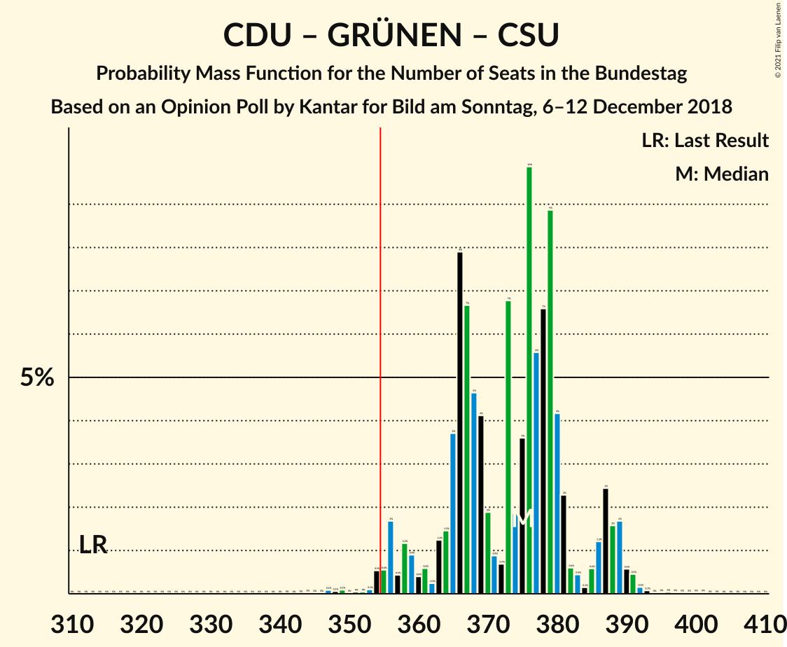

| Number of Seats | Probability | Accumulated | Special Marks |
|:---------------:|:-----------:|:-----------:|:-------------:|
| 313 | 0% | 100% | Last Result |
| 314 | 0% | 100% |  |
| 315 | 0% | 100% |  |
| 316 | 0% | 100% |  |
| 317 | 0% | 100% |  |
| 318 | 0% | 100% |  |
| 319 | 0% | 100% |  |
| 320 | 0% | 100% |  |
| 321 | 0% | 100% |  |
| 322 | 0% | 100% |  |
| 323 | 0% | 100% |  |
| 324 | 0% | 100% |  |
| 325 | 0% | 100% |  |
| 326 | 0% | 100% |  |
| 327 | 0% | 100% |  |
| 328 | 0% | 100% |  |
| 329 | 0% | 100% |  |
| 330 | 0% | 100% |  |
| 331 | 0% | 100% |  |
| 332 | 0% | 100% |  |
| 333 | 0% | 100% |  |
| 334 | 0% | 100% |  |
| 335 | 0% | 100% |  |
| 336 | 0% | 100% |  |
| 337 | 0% | 100% |  |
| 338 | 0% | 100% |  |
| 339 | 0% | 100% |  |
| 340 | 0% | 100% |  |
| 341 | 0% | 100% |  |
| 342 | 0% | 100% |  |
| 343 | 0% | 100% |  |
| 344 | 0% | 100% |  |
| 345 | 0% | 100% |  |
| 346 | 0% | 99.9% |  |
| 347 | 0.1% | 99.9% |  |
| 348 | 0.1% | 99.8% |  |
| 349 | 0.1% | 99.8% |  |
| 350 | 0% | 99.7% |  |
| 351 | 0% | 99.7% |  |
| 352 | 0% | 99.6% |  |
| 353 | 0.1% | 99.6% |  |
| 354 | 0.5% | 99.5% |  |
| 355 | 0.6% | 98.9% | Majority |
| 356 | 2% | 98% |  |
| 357 | 0.4% | 97% |  |
| 358 | 1.2% | 96% |  |
| 359 | 0.9% | 95% |  |
| 360 | 0.4% | 94% |  |
| 361 | 0.6% | 94% |  |
| 362 | 0.2% | 93% |  |
| 363 | 1.2% | 93% |  |
| 364 | 1.5% | 92% |  |
| 365 | 4% | 90% |  |
| 366 | 8% | 87% |  |
| 367 | 7% | 79% |  |
| 368 | 5% | 72% |  |
| 369 | 4% | 67% |  |
| 370 | 2% | 63% |  |
| 371 | 0.9% | 61% |  |
| 372 | 0.7% | 60% |  |
| 373 | 7% | 60% | Median |
| 374 | 2% | 53% |  |
| 375 | 4% | 51% |  |
| 376 | 10% | 48% |  |
| 377 | 6% | 38% |  |
| 378 | 7% | 32% |  |
| 379 | 9% | 25% |  |
| 380 | 4% | 17% |  |
| 381 | 2% | 12% |  |
| 382 | 0.6% | 10% |  |
| 383 | 0.4% | 10% |  |
| 384 | 0.1% | 9% |  |
| 385 | 0.6% | 9% |  |
| 386 | 1.2% | 8% |  |
| 387 | 2% | 7% |  |
| 388 | 2% | 5% |  |
| 389 | 2% | 3% |  |
| 390 | 0.6% | 1.5% |  |
| 391 | 0.5% | 0.9% |  |
| 392 | 0.2% | 0.5% |  |
| 393 | 0.1% | 0.3% |  |
| 394 | 0% | 0.2% |  |
| 395 | 0% | 0.2% |  |
| 396 | 0% | 0.2% |  |
| 397 | 0% | 0.1% |  |
| 398 | 0% | 0.1% |  |
| 399 | 0% | 0.1% |  |
| 400 | 0% | 0.1% |  |
| 401 | 0% | 0% |  |

### Christlich Demokratische Union Deutschlands – Sozialdemokratische Partei Deutschlands – Christlich-Soziale Union in Bayern

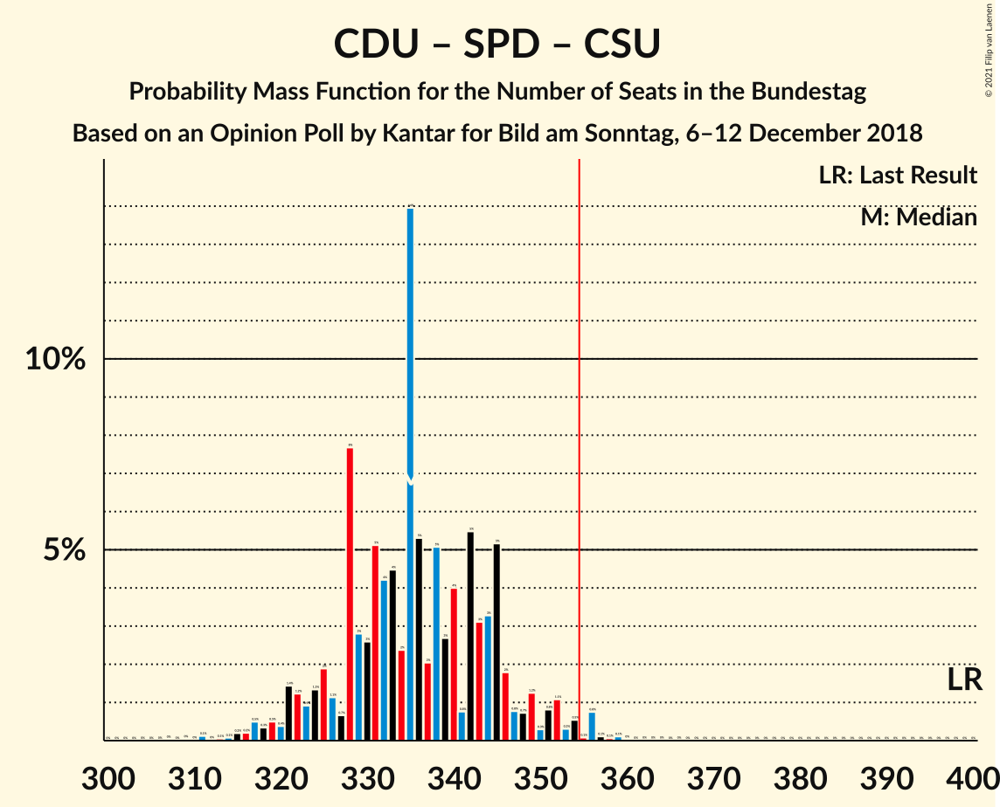

| Number of Seats | Probability | Accumulated | Special Marks |
|:---------------:|:-----------:|:-----------:|:-------------:|
| 308 | 0% | 100% |  |
| 309 | 0% | 99.9% |  |
| 310 | 0% | 99.9% |  |
| 311 | 0.1% | 99.9% |  |
| 312 | 0% | 99.8% |  |
| 313 | 0.1% | 99.7% |  |
| 314 | 0.1% | 99.7% |  |
| 315 | 0.2% | 99.6% |  |
| 316 | 0.2% | 99.4% |  |
| 317 | 0.5% | 99.2% |  |
| 318 | 0.3% | 98.7% |  |
| 319 | 0.5% | 98% |  |
| 320 | 0.4% | 98% |  |
| 321 | 1.4% | 98% |  |
| 322 | 1.2% | 96% |  |
| 323 | 0.9% | 95% |  |
| 324 | 1.3% | 94% |  |
| 325 | 2% | 93% |  |
| 326 | 1.1% | 91% |  |
| 327 | 0.7% | 90% |  |
| 328 | 8% | 89% |  |
| 329 | 3% | 81% |  |
| 330 | 3% | 78% |  |
| 331 | 5% | 76% |  |
| 332 | 4% | 71% |  |
| 333 | 4% | 66% |  |
| 334 | 2% | 62% |  |
| 335 | 14% | 60% |  |
| 336 | 5% | 46% | Median |
| 337 | 2% | 40% |  |
| 338 | 5% | 38% |  |
| 339 | 3% | 33% |  |
| 340 | 4% | 31% |  |
| 341 | 0.8% | 27% |  |
| 342 | 5% | 26% |  |
| 343 | 3% | 20% |  |
| 344 | 3% | 17% |  |
| 345 | 5% | 14% |  |
| 346 | 2% | 9% |  |
| 347 | 0.8% | 7% |  |
| 348 | 0.7% | 6% |  |
| 349 | 1.2% | 6% |  |
| 350 | 0.3% | 4% |  |
| 351 | 0.8% | 4% |  |
| 352 | 1.1% | 3% |  |
| 353 | 0.3% | 2% |  |
| 354 | 0.5% | 2% |  |
| 355 | 0.1% | 1.2% | Majority |
| 356 | 0.8% | 1.1% |  |
| 357 | 0.1% | 0.4% |  |
| 358 | 0.1% | 0.3% |  |
| 359 | 0.1% | 0.2% |  |
| 360 | 0% | 0.1% |  |
| 361 | 0% | 0.1% |  |
| 362 | 0% | 0.1% |  |
| 363 | 0% | 0% |  |
| 364 | 0% | 0% |  |
| 365 | 0% | 0% |  |
| 366 | 0% | 0% |  |
| 367 | 0% | 0% |  |
| 368 | 0% | 0% |  |
| 369 | 0% | 0% |  |
| 370 | 0% | 0% |  |
| 371 | 0% | 0% |  |
| 372 | 0% | 0% |  |
| 373 | 0% | 0% |  |
| 374 | 0% | 0% |  |
| 375 | 0% | 0% |  |
| 376 | 0% | 0% |  |
| 377 | 0% | 0% |  |
| 378 | 0% | 0% |  |
| 379 | 0% | 0% |  |
| 380 | 0% | 0% |  |
| 381 | 0% | 0% |  |
| 382 | 0% | 0% |  |
| 383 | 0% | 0% |  |
| 384 | 0% | 0% |  |
| 385 | 0% | 0% |  |
| 386 | 0% | 0% |  |
| 387 | 0% | 0% |  |
| 388 | 0% | 0% |  |
| 389 | 0% | 0% |  |
| 390 | 0% | 0% |  |
| 391 | 0% | 0% |  |
| 392 | 0% | 0% |  |
| 393 | 0% | 0% |  |
| 394 | 0% | 0% |  |
| 395 | 0% | 0% |  |
| 396 | 0% | 0% |  |
| 397 | 0% | 0% |  |
| 398 | 0% | 0% |  |
| 399 | 0% | 0% | Last Result |

### Christlich Demokratische Union Deutschlands – Alternative für Deutschland – Christlich-Soziale Union in Bayern

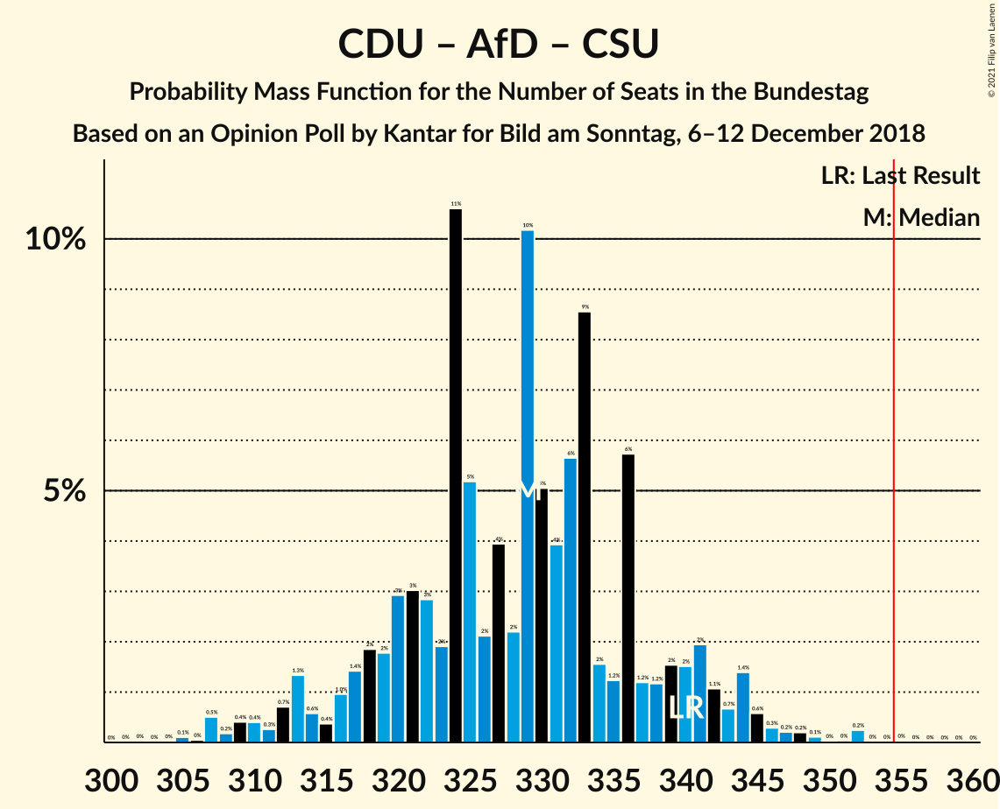

| Number of Seats | Probability | Accumulated | Special Marks |
|:---------------:|:-----------:|:-----------:|:-------------:|
| 302 | 0% | 100% |  |
| 303 | 0% | 99.9% |  |
| 304 | 0% | 99.9% |  |
| 305 | 0.1% | 99.9% |  |
| 306 | 0% | 99.8% |  |
| 307 | 0.5% | 99.7% |  |
| 308 | 0.2% | 99.2% |  |
| 309 | 0.4% | 99.1% |  |
| 310 | 0.4% | 98.6% |  |
| 311 | 0.3% | 98% |  |
| 312 | 0.7% | 98% |  |
| 313 | 1.3% | 97% |  |
| 314 | 0.6% | 96% |  |
| 315 | 0.4% | 95% |  |
| 316 | 1.0% | 95% |  |
| 317 | 1.4% | 94% |  |
| 318 | 2% | 93% |  |
| 319 | 2% | 91% |  |
| 320 | 3% | 89% |  |
| 321 | 3% | 86% |  |
| 322 | 3% | 83% |  |
| 323 | 2% | 80% |  |
| 324 | 11% | 78% |  |
| 325 | 5% | 68% |  |
| 326 | 2% | 62% |  |
| 327 | 4% | 60% | Median |
| 328 | 2% | 56% |  |
| 329 | 10% | 54% |  |
| 330 | 5% | 44% |  |
| 331 | 4% | 39% |  |
| 332 | 6% | 35% |  |
| 333 | 9% | 29% |  |
| 334 | 2% | 21% |  |
| 335 | 1.2% | 19% |  |
| 336 | 6% | 18% |  |
| 337 | 1.2% | 12% |  |
| 338 | 1.2% | 11% |  |
| 339 | 2% | 10% |  |
| 340 | 2% | 8% | Last Result |
| 341 | 2% | 7% |  |
| 342 | 1.1% | 5% |  |
| 343 | 0.7% | 4% |  |
| 344 | 1.4% | 3% |  |
| 345 | 0.6% | 2% |  |
| 346 | 0.3% | 1.2% |  |
| 347 | 0.2% | 0.9% |  |
| 348 | 0.2% | 0.7% |  |
| 349 | 0.1% | 0.5% |  |
| 350 | 0% | 0.4% |  |
| 351 | 0% | 0.4% |  |
| 352 | 0.2% | 0.3% |  |
| 353 | 0% | 0.1% |  |
| 354 | 0% | 0.1% |  |
| 355 | 0% | 0.1% | Majority |
| 356 | 0% | 0% |  |

### Bündnis 90/Die Grünen – Sozialdemokratische Partei Deutschlands – Die Linke

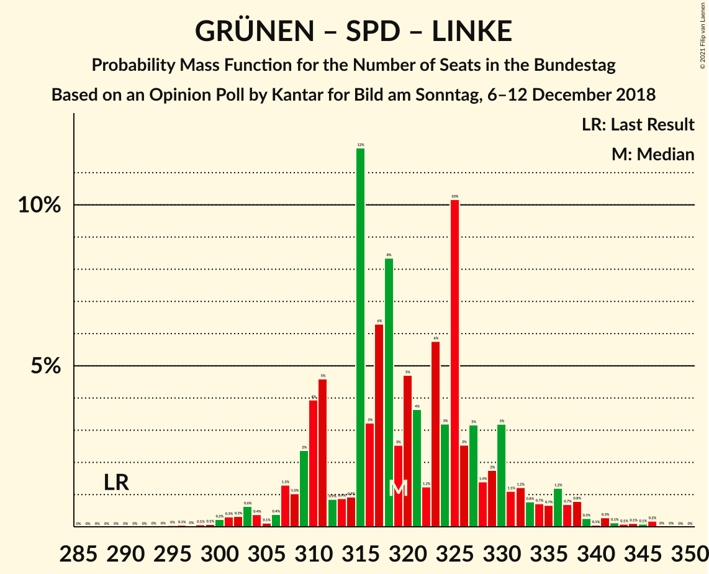

| Number of Seats | Probability | Accumulated | Special Marks |
|:---------------:|:-----------:|:-----------:|:-------------:|
| 289 | 0% | 100% | Last Result |
| 290 | 0% | 100% |  |
| 291 | 0% | 100% |  |
| 292 | 0% | 100% |  |
| 293 | 0% | 100% |  |
| 294 | 0% | 100% |  |
| 295 | 0% | 100% |  |
| 296 | 0.1% | 99.9% |  |
| 297 | 0% | 99.9% |  |
| 298 | 0.1% | 99.8% |  |
| 299 | 0.1% | 99.8% |  |
| 300 | 0.2% | 99.7% |  |
| 301 | 0.3% | 99.5% |  |
| 302 | 0.3% | 99.2% |  |
| 303 | 0.6% | 98.8% |  |
| 304 | 0.4% | 98% |  |
| 305 | 0.1% | 98% |  |
| 306 | 0.4% | 98% |  |
| 307 | 1.3% | 97% |  |
| 308 | 1.0% | 96% |  |
| 309 | 2% | 95% |  |
| 310 | 4% | 93% |  |
| 311 | 5% | 89% |  |
| 312 | 0.9% | 84% |  |
| 313 | 0.9% | 83% |  |
| 314 | 0.9% | 82% |  |
| 315 | 12% | 81% |  |
| 316 | 3% | 70% |  |
| 317 | 6% | 66% |  |
| 318 | 8% | 60% |  |
| 319 | 3% | 52% | Median |
| 320 | 5% | 49% |  |
| 321 | 4% | 44% |  |
| 322 | 1.2% | 41% |  |
| 323 | 6% | 40% |  |
| 324 | 3% | 34% |  |
| 325 | 10% | 31% |  |
| 326 | 3% | 20% |  |
| 327 | 3% | 18% |  |
| 328 | 1.4% | 15% |  |
| 329 | 2% | 13% |  |
| 330 | 3% | 12% |  |
| 331 | 1.1% | 8% |  |
| 332 | 1.2% | 7% |  |
| 333 | 0.8% | 6% |  |
| 334 | 0.7% | 5% |  |
| 335 | 0.7% | 5% |  |
| 336 | 1.2% | 4% |  |
| 337 | 0.7% | 3% |  |
| 338 | 0.8% | 2% |  |
| 339 | 0.3% | 1.2% |  |
| 340 | 0.1% | 1.0% |  |
| 341 | 0.3% | 0.9% |  |
| 342 | 0.1% | 0.6% |  |
| 343 | 0.1% | 0.5% |  |
| 344 | 0.1% | 0.4% |  |
| 345 | 0.1% | 0.3% |  |
| 346 | 0.2% | 0.2% |  |
| 347 | 0% | 0% |  |

### Bündnis 90/Die Grünen – Sozialdemokratische Partei Deutschlands – Freie Demokratische Partei

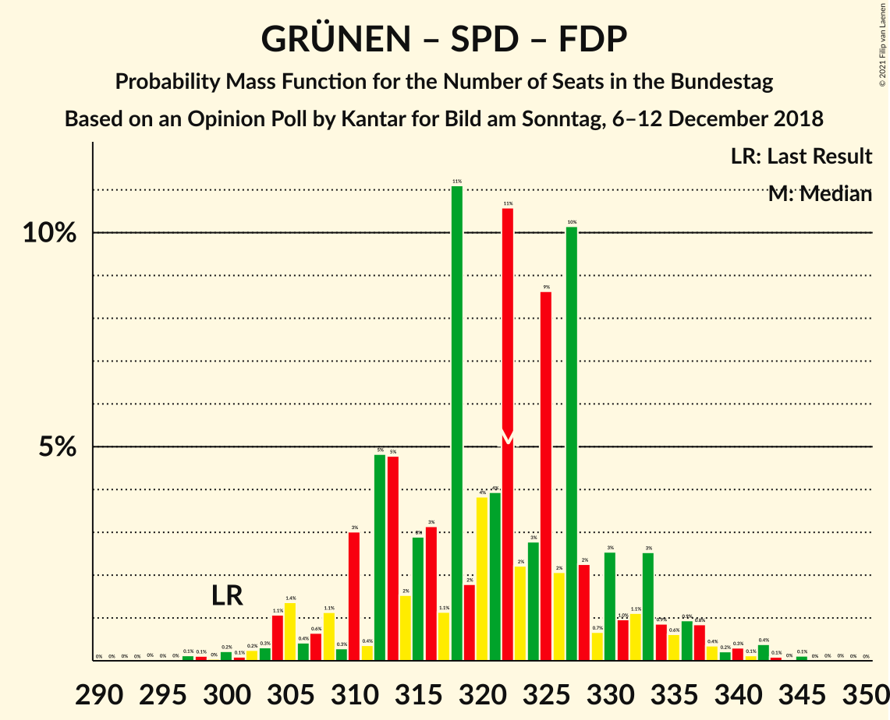

| Number of Seats | Probability | Accumulated | Special Marks |
|:---------------:|:-----------:|:-----------:|:-------------:|
| 294 | 0% | 100% |  |
| 295 | 0% | 99.9% |  |
| 296 | 0% | 99.9% |  |
| 297 | 0.1% | 99.9% |  |
| 298 | 0.1% | 99.8% |  |
| 299 | 0% | 99.7% |  |
| 300 | 0.2% | 99.6% | Last Result |
| 301 | 0.1% | 99.4% |  |
| 302 | 0.2% | 99.3% |  |
| 303 | 0.3% | 99.1% |  |
| 304 | 1.1% | 98.8% |  |
| 305 | 1.4% | 98% |  |
| 306 | 0.4% | 96% |  |
| 307 | 0.6% | 96% |  |
| 308 | 1.1% | 95% |  |
| 309 | 0.3% | 94% |  |
| 310 | 3% | 94% |  |
| 311 | 0.4% | 91% |  |
| 312 | 5% | 90% |  |
| 313 | 5% | 86% |  |
| 314 | 2% | 81% |  |
| 315 | 3% | 79% |  |
| 316 | 3% | 76% |  |
| 317 | 1.1% | 73% |  |
| 318 | 11% | 72% |  |
| 319 | 2% | 61% |  |
| 320 | 4% | 59% |  |
| 321 | 4% | 55% | Median |
| 322 | 11% | 51% |  |
| 323 | 2% | 41% |  |
| 324 | 3% | 39% |  |
| 325 | 9% | 36% |  |
| 326 | 2% | 27% |  |
| 327 | 10% | 25% |  |
| 328 | 2% | 15% |  |
| 329 | 0.7% | 13% |  |
| 330 | 3% | 12% |  |
| 331 | 1.0% | 10% |  |
| 332 | 1.1% | 9% |  |
| 333 | 3% | 7% |  |
| 334 | 0.9% | 5% |  |
| 335 | 0.6% | 4% |  |
| 336 | 0.9% | 3% |  |
| 337 | 0.8% | 3% |  |
| 338 | 0.4% | 2% |  |
| 339 | 0.2% | 1.3% |  |
| 340 | 0.3% | 1.1% |  |
| 341 | 0.1% | 0.8% |  |
| 342 | 0.4% | 0.7% |  |
| 343 | 0.1% | 0.3% |  |
| 344 | 0% | 0.2% |  |
| 345 | 0.1% | 0.2% |  |
| 346 | 0% | 0.1% |  |
| 347 | 0% | 0.1% |  |
| 348 | 0% | 0% |  |

### Christlich Demokratische Union Deutschlands – Freie Demokratische Partei – Christlich-Soziale Union in Bayern

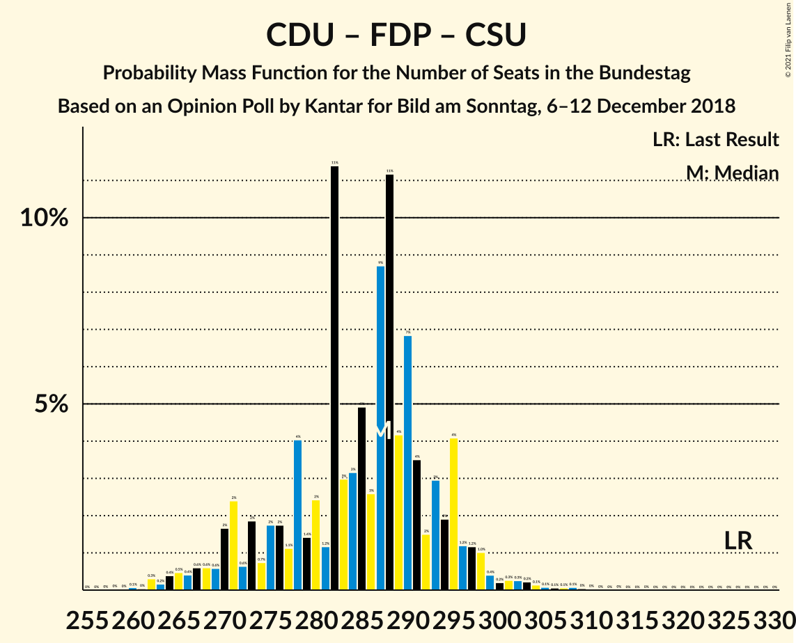

| Number of Seats | Probability | Accumulated | Special Marks |
|:---------------:|:-----------:|:-----------:|:-------------:|
| 258 | 0% | 100% |  |
| 259 | 0% | 99.9% |  |
| 260 | 0.1% | 99.9% |  |
| 261 | 0% | 99.8% |  |
| 262 | 0.3% | 99.8% |  |
| 263 | 0.2% | 99.5% |  |
| 264 | 0.4% | 99.3% |  |
| 265 | 0.5% | 98.9% |  |
| 266 | 0.4% | 98% |  |
| 267 | 0.6% | 98% |  |
| 268 | 0.6% | 97% |  |
| 269 | 0.6% | 97% |  |
| 270 | 2% | 96% |  |
| 271 | 2% | 95% |  |
| 272 | 0.6% | 92% |  |
| 273 | 2% | 92% |  |
| 274 | 0.7% | 90% |  |
| 275 | 2% | 89% |  |
| 276 | 2% | 87% |  |
| 277 | 1.1% | 85% |  |
| 278 | 4% | 84% |  |
| 279 | 1.4% | 80% |  |
| 280 | 2% | 79% |  |
| 281 | 1.2% | 76% |  |
| 282 | 11% | 75% |  |
| 283 | 3% | 64% |  |
| 284 | 3% | 61% | Median |
| 285 | 5% | 58% |  |
| 286 | 3% | 53% |  |
| 287 | 9% | 50% |  |
| 288 | 11% | 41% |  |
| 289 | 4% | 30% |  |
| 290 | 7% | 26% |  |
| 291 | 4% | 19% |  |
| 292 | 2% | 16% |  |
| 293 | 3% | 14% |  |
| 294 | 2% | 11% |  |
| 295 | 4% | 9% |  |
| 296 | 1.2% | 5% |  |
| 297 | 1.2% | 4% |  |
| 298 | 1.0% | 3% |  |
| 299 | 0.4% | 2% |  |
| 300 | 0.2% | 2% |  |
| 301 | 0.3% | 1.3% |  |
| 302 | 0.3% | 1.0% |  |
| 303 | 0.2% | 0.8% |  |
| 304 | 0.1% | 0.6% |  |
| 305 | 0.1% | 0.4% |  |
| 306 | 0.1% | 0.3% |  |
| 307 | 0.1% | 0.3% |  |
| 308 | 0.1% | 0.2% |  |
| 309 | 0% | 0.1% |  |
| 310 | 0% | 0.1% |  |
| 311 | 0% | 0% |  |
| 312 | 0% | 0% |  |
| 313 | 0% | 0% |  |
| 314 | 0% | 0% |  |
| 315 | 0% | 0% |  |
| 316 | 0% | 0% |  |
| 317 | 0% | 0% |  |
| 318 | 0% | 0% |  |
| 319 | 0% | 0% |  |
| 320 | 0% | 0% |  |
| 321 | 0% | 0% |  |
| 322 | 0% | 0% |  |
| 323 | 0% | 0% |  |
| 324 | 0% | 0% |  |
| 325 | 0% | 0% |  |
| 326 | 0% | 0% | Last Result |

### Bündnis 90/Die Grünen – Sozialdemokratische Partei Deutschlands

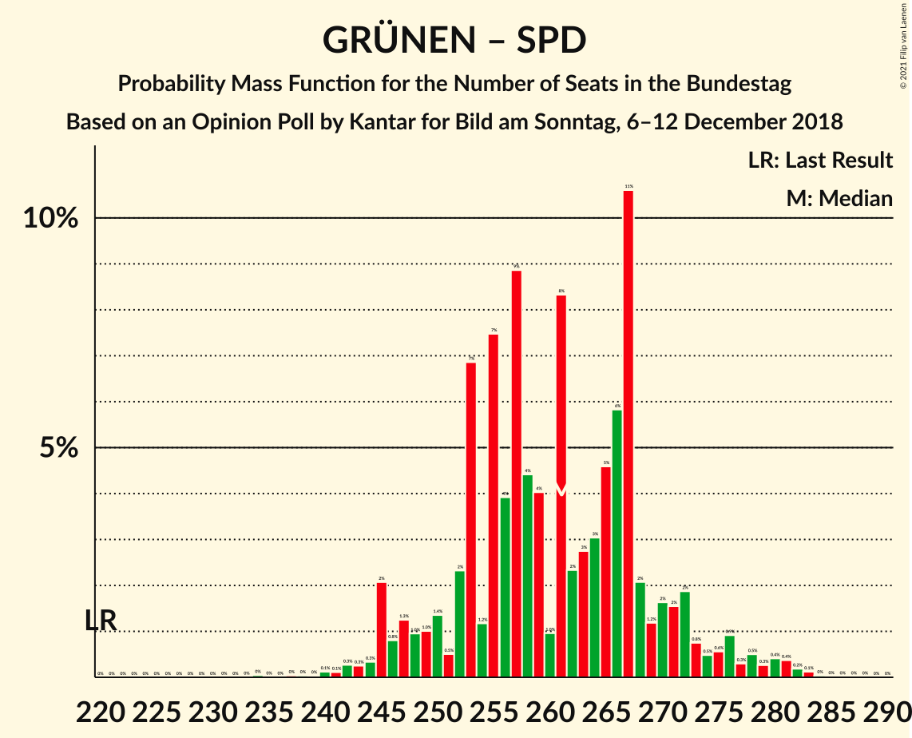

| Number of Seats | Probability | Accumulated | Special Marks |
|:---------------:|:-----------:|:-----------:|:-------------:|
| 220 | 0% | 100% | Last Result |
| 221 | 0% | 100% |  |
| 222 | 0% | 100% |  |
| 223 | 0% | 100% |  |
| 224 | 0% | 100% |  |
| 225 | 0% | 100% |  |
| 226 | 0% | 100% |  |
| 227 | 0% | 100% |  |
| 228 | 0% | 100% |  |
| 229 | 0% | 100% |  |
| 230 | 0% | 100% |  |
| 231 | 0% | 100% |  |
| 232 | 0% | 100% |  |
| 233 | 0% | 100% |  |
| 234 | 0% | 100% |  |
| 235 | 0% | 99.9% |  |
| 236 | 0% | 99.9% |  |
| 237 | 0% | 99.9% |  |
| 238 | 0% | 99.9% |  |
| 239 | 0% | 99.8% |  |
| 240 | 0.1% | 99.8% |  |
| 241 | 0.1% | 99.7% |  |
| 242 | 0.3% | 99.6% |  |
| 243 | 0.3% | 99.3% |  |
| 244 | 0.3% | 99.1% |  |
| 245 | 2% | 98.7% |  |
| 246 | 0.8% | 97% |  |
| 247 | 1.3% | 96% |  |
| 248 | 1.0% | 95% |  |
| 249 | 1.0% | 94% |  |
| 250 | 1.4% | 93% |  |
| 251 | 0.5% | 91% |  |
| 252 | 2% | 91% |  |
| 253 | 7% | 88% |  |
| 254 | 1.2% | 82% |  |
| 255 | 7% | 80% |  |
| 256 | 4% | 73% |  |
| 257 | 9% | 69% |  |
| 258 | 4% | 60% |  |
| 259 | 4% | 56% |  |
| 260 | 1.0% | 52% |  |
| 261 | 8% | 51% | Median |
| 262 | 2% | 42% |  |
| 263 | 3% | 40% |  |
| 264 | 3% | 37% |  |
| 265 | 5% | 34% |  |
| 266 | 6% | 30% |  |
| 267 | 11% | 24% |  |
| 268 | 2% | 13% |  |
| 269 | 1.2% | 11% |  |
| 270 | 2% | 10% |  |
| 271 | 2% | 8% |  |
| 272 | 2% | 7% |  |
| 273 | 0.8% | 5% |  |
| 274 | 0.5% | 4% |  |
| 275 | 0.6% | 4% |  |
| 276 | 0.9% | 3% |  |
| 277 | 0.3% | 2% |  |
| 278 | 0.5% | 2% |  |
| 279 | 0.3% | 1.5% |  |
| 280 | 0.4% | 1.2% |  |
| 281 | 0.4% | 0.8% |  |
| 282 | 0.2% | 0.4% |  |
| 283 | 0.1% | 0.2% |  |
| 284 | 0% | 0.1% |  |
| 285 | 0% | 0.1% |  |
| 286 | 0% | 0.1% |  |
| 287 | 0% | 0% |  |

### Sozialdemokratische Partei Deutschlands – Freie Demokratische Partei

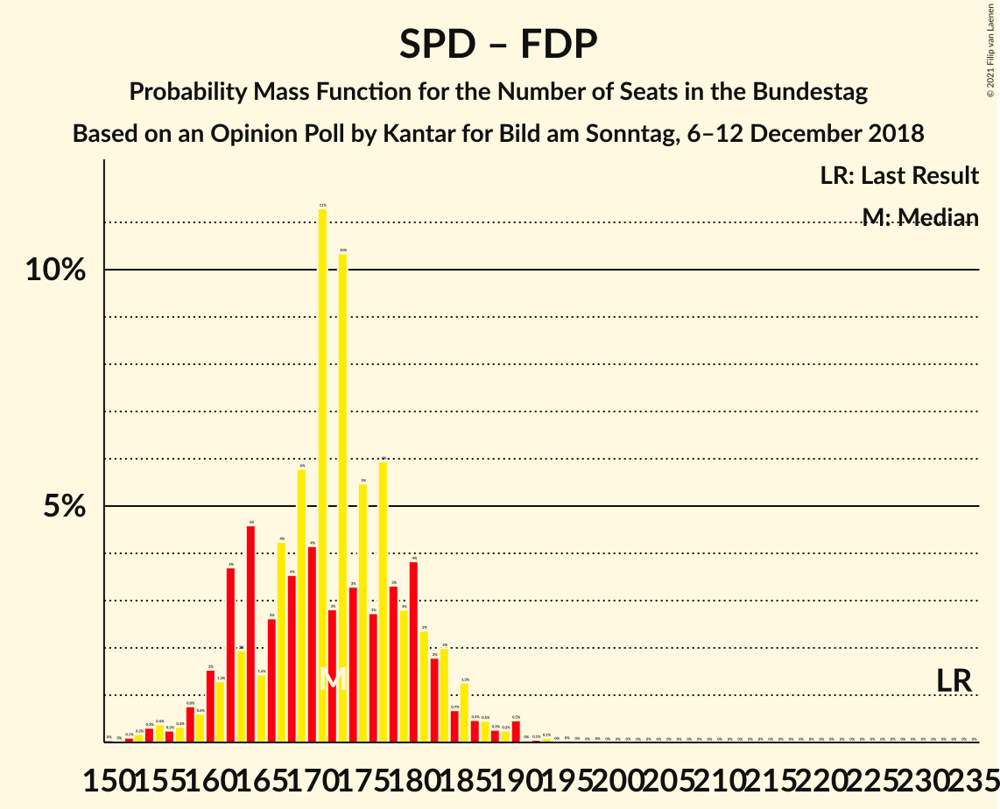

| Number of Seats | Probability | Accumulated | Special Marks |
|:---------------:|:-----------:|:-----------:|:-------------:|
| 150 | 0% | 100% |  |
| 151 | 0% | 99.9% |  |
| 152 | 0.1% | 99.9% |  |
| 153 | 0.2% | 99.8% |  |
| 154 | 0.3% | 99.6% |  |
| 155 | 0.4% | 99.3% |  |
| 156 | 0.2% | 98.9% |  |
| 157 | 0.3% | 98.7% |  |
| 158 | 0.8% | 98% |  |
| 159 | 0.6% | 98% |  |
| 160 | 2% | 97% |  |
| 161 | 1.3% | 95% |  |
| 162 | 4% | 94% |  |
| 163 | 2% | 90% |  |
| 164 | 5% | 89% |  |
| 165 | 1.4% | 84% |  |
| 166 | 3% | 82% |  |
| 167 | 4% | 80% |  |
| 168 | 4% | 76% |  |
| 169 | 6% | 72% |  |
| 170 | 4% | 66% |  |
| 171 | 11% | 62% |  |
| 172 | 3% | 51% | Median |
| 173 | 10% | 48% |  |
| 174 | 3% | 38% |  |
| 175 | 5% | 34% |  |
| 176 | 3% | 29% |  |
| 177 | 6% | 26% |  |
| 178 | 3% | 20% |  |
| 179 | 3% | 17% |  |
| 180 | 4% | 14% |  |
| 181 | 2% | 10% |  |
| 182 | 2% | 8% |  |
| 183 | 2% | 6% |  |
| 184 | 0.7% | 4% |  |
| 185 | 1.3% | 3% |  |
| 186 | 0.5% | 2% |  |
| 187 | 0.5% | 2% |  |
| 188 | 0.3% | 1.3% |  |
| 189 | 0.2% | 1.0% |  |
| 190 | 0.5% | 0.7% |  |
| 191 | 0% | 0.3% |  |
| 192 | 0.1% | 0.2% |  |
| 193 | 0.1% | 0.2% |  |
| 194 | 0% | 0.1% |  |
| 195 | 0% | 0.1% |  |
| 196 | 0% | 0% |  |
| 197 | 0% | 0% |  |
| 198 | 0% | 0% |  |
| 199 | 0% | 0% |  |
| 200 | 0% | 0% |  |
| 201 | 0% | 0% |  |
| 202 | 0% | 0% |  |
| 203 | 0% | 0% |  |
| 204 | 0% | 0% |  |
| 205 | 0% | 0% |  |
| 206 | 0% | 0% |  |
| 207 | 0% | 0% |  |
| 208 | 0% | 0% |  |
| 209 | 0% | 0% |  |
| 210 | 0% | 0% |  |
| 211 | 0% | 0% |  |
| 212 | 0% | 0% |  |
| 213 | 0% | 0% |  |
| 214 | 0% | 0% |  |
| 215 | 0% | 0% |  |
| 216 | 0% | 0% |  |
| 217 | 0% | 0% |  |
| 218 | 0% | 0% |  |
| 219 | 0% | 0% |  |
| 220 | 0% | 0% |  |
| 221 | 0% | 0% |  |
| 222 | 0% | 0% |  |
| 223 | 0% | 0% |  |
| 224 | 0% | 0% |  |
| 225 | 0% | 0% |  |
| 226 | 0% | 0% |  |
| 227 | 0% | 0% |  |
| 228 | 0% | 0% |  |
| 229 | 0% | 0% |  |
| 230 | 0% | 0% |  |
| 231 | 0% | 0% |  |
| 232 | 0% | 0% |  |
| 233 | 0% | 0% | Last Result |

### Sozialdemokratische Partei Deutschlands – Die Linke

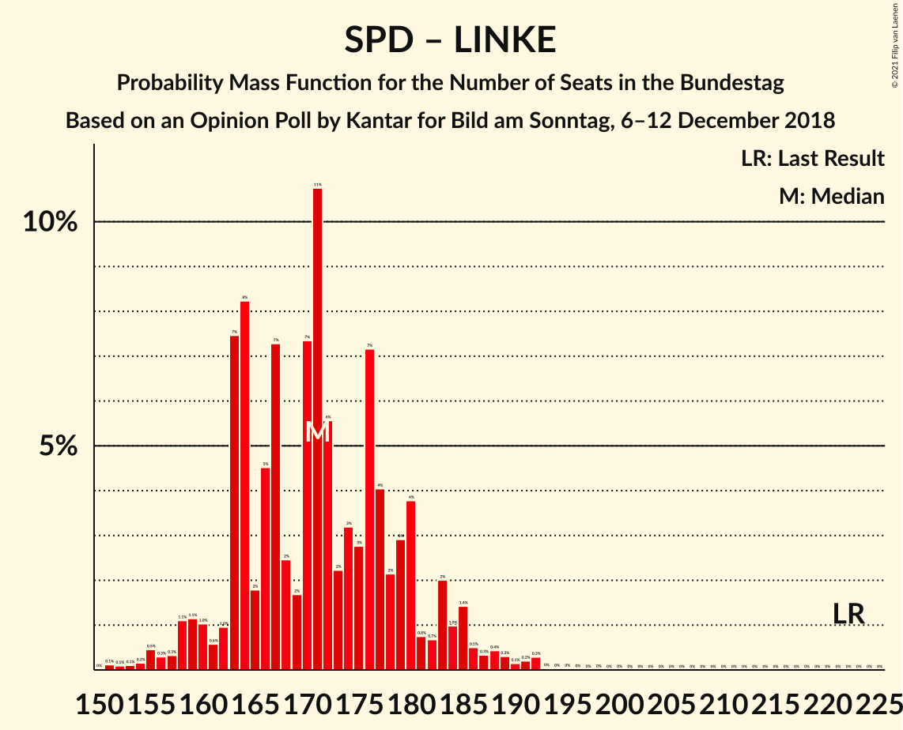

| Number of Seats | Probability | Accumulated | Special Marks |
|:---------------:|:-----------:|:-----------:|:-------------:|
| 150 | 0% | 100% |  |
| 151 | 0.1% | 99.9% |  |
| 152 | 0.1% | 99.8% |  |
| 153 | 0.1% | 99.7% |  |
| 154 | 0.2% | 99.6% |  |
| 155 | 0.5% | 99.5% |  |
| 156 | 0.3% | 99.0% |  |
| 157 | 0.3% | 98.7% |  |
| 158 | 1.1% | 98% |  |
| 159 | 1.1% | 97% |  |
| 160 | 1.0% | 96% |  |
| 161 | 0.6% | 95% |  |
| 162 | 1.0% | 95% |  |
| 163 | 7% | 94% |  |
| 164 | 8% | 86% |  |
| 165 | 2% | 78% |  |
| 166 | 5% | 76% |  |
| 167 | 7% | 72% |  |
| 168 | 2% | 64% |  |
| 169 | 2% | 62% |  |
| 170 | 7% | 60% | Median |
| 171 | 11% | 53% |  |
| 172 | 6% | 42% |  |
| 173 | 2% | 36% |  |
| 174 | 3% | 34% |  |
| 175 | 3% | 31% |  |
| 176 | 7% | 28% |  |
| 177 | 4% | 21% |  |
| 178 | 2% | 17% |  |
| 179 | 3% | 15% |  |
| 180 | 4% | 12% |  |
| 181 | 0.8% | 8% |  |
| 182 | 0.7% | 7% |  |
| 183 | 2% | 7% |  |
| 184 | 1.0% | 5% |  |
| 185 | 1.4% | 4% |  |
| 186 | 0.5% | 2% |  |
| 187 | 0.3% | 2% |  |
| 188 | 0.4% | 2% |  |
| 189 | 0.3% | 1.1% |  |
| 190 | 0.1% | 0.8% |  |
| 191 | 0.2% | 0.6% |  |
| 192 | 0.3% | 0.4% |  |
| 193 | 0% | 0.1% |  |
| 194 | 0% | 0.1% |  |
| 195 | 0% | 0.1% |  |
| 196 | 0% | 0% |  |
| 197 | 0% | 0% |  |
| 198 | 0% | 0% |  |
| 199 | 0% | 0% |  |
| 200 | 0% | 0% |  |
| 201 | 0% | 0% |  |
| 202 | 0% | 0% |  |
| 203 | 0% | 0% |  |
| 204 | 0% | 0% |  |
| 205 | 0% | 0% |  |
| 206 | 0% | 0% |  |
| 207 | 0% | 0% |  |
| 208 | 0% | 0% |  |
| 209 | 0% | 0% |  |
| 210 | 0% | 0% |  |
| 211 | 0% | 0% |  |
| 212 | 0% | 0% |  |
| 213 | 0% | 0% |  |
| 214 | 0% | 0% |  |
| 215 | 0% | 0% |  |
| 216 | 0% | 0% |  |
| 217 | 0% | 0% |  |
| 218 | 0% | 0% |  |
| 219 | 0% | 0% |  |
| 220 | 0% | 0% |  |
| 221 | 0% | 0% |  |
| 222 | 0% | 0% | Last Result |

## Technical Information

### Opinion Poll

+ **Polling firm:** Kantar
+ **Commissioner(s):** Bild am Sonntag
+ **Fieldwork period:** 6–12 December 2018

### Calculations

+ **Sample size:** 1997
+ **Simulations done:** 131,072
+ **Error estimate:** 0.73%

