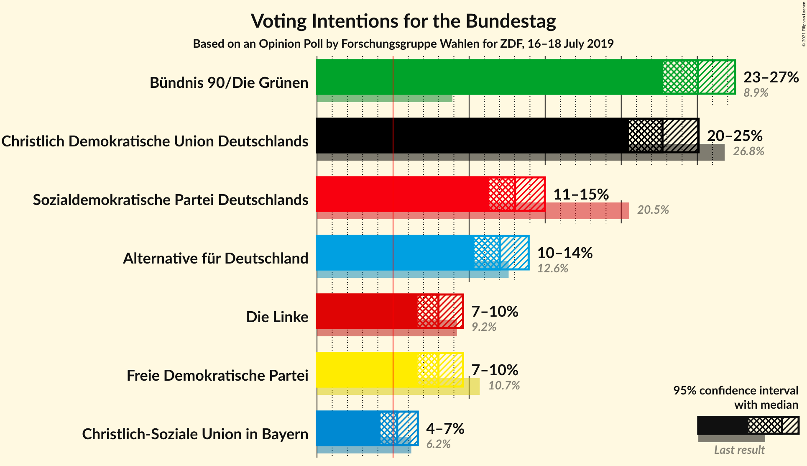
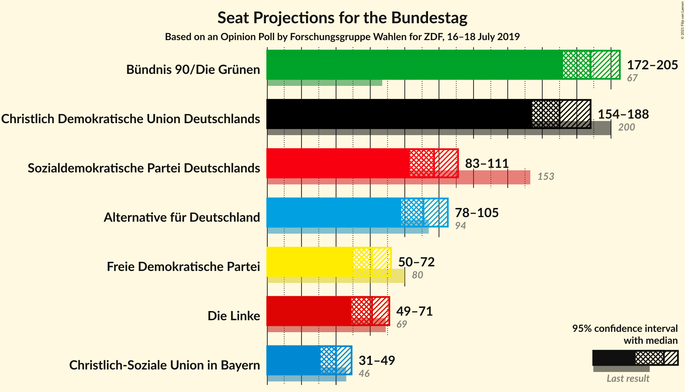
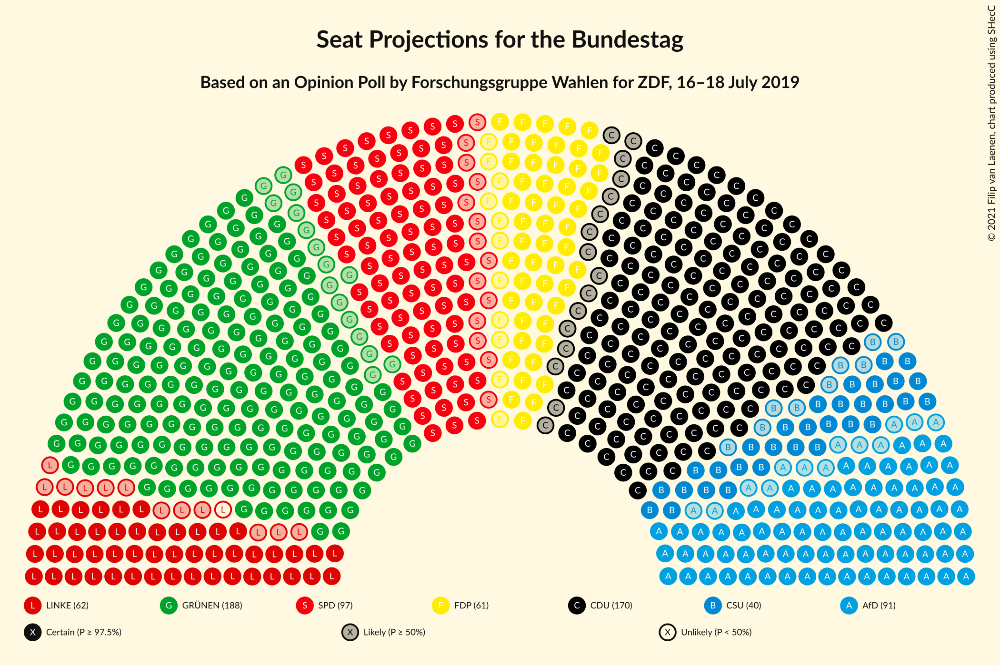
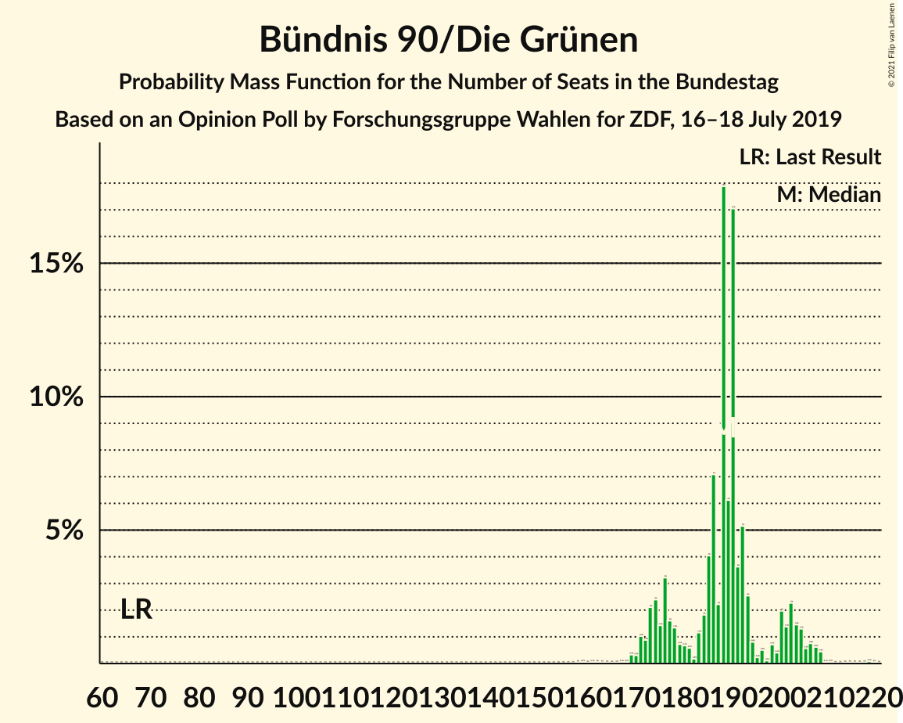
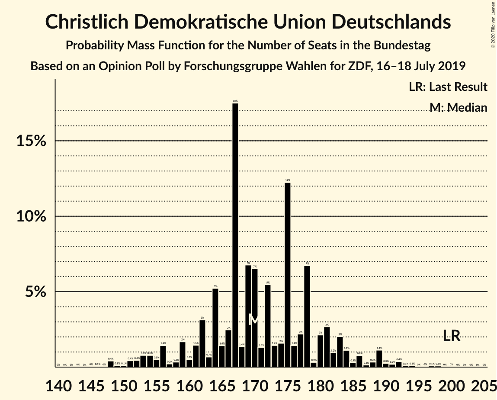
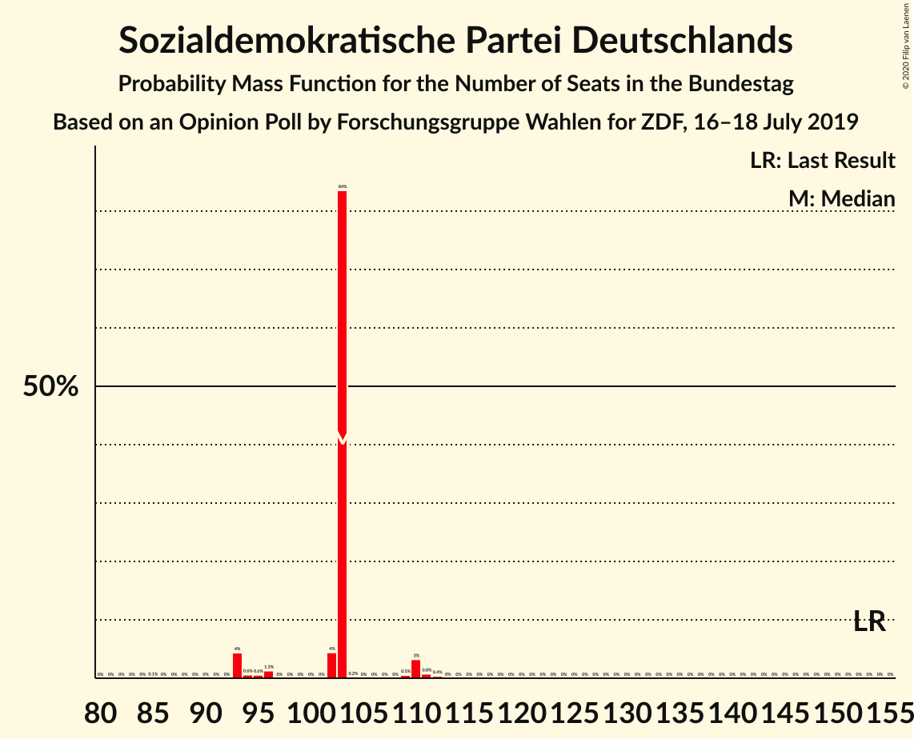
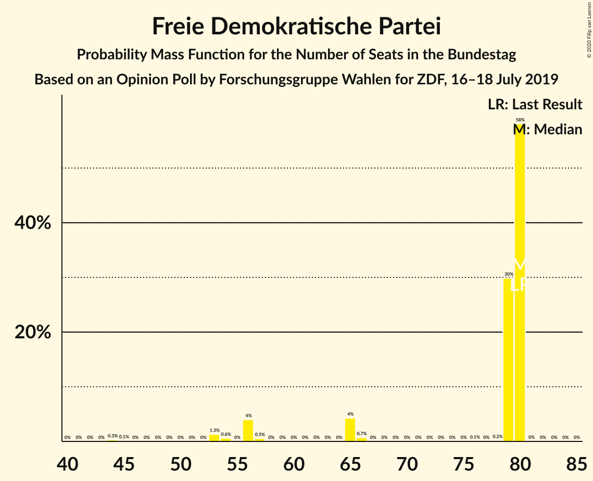
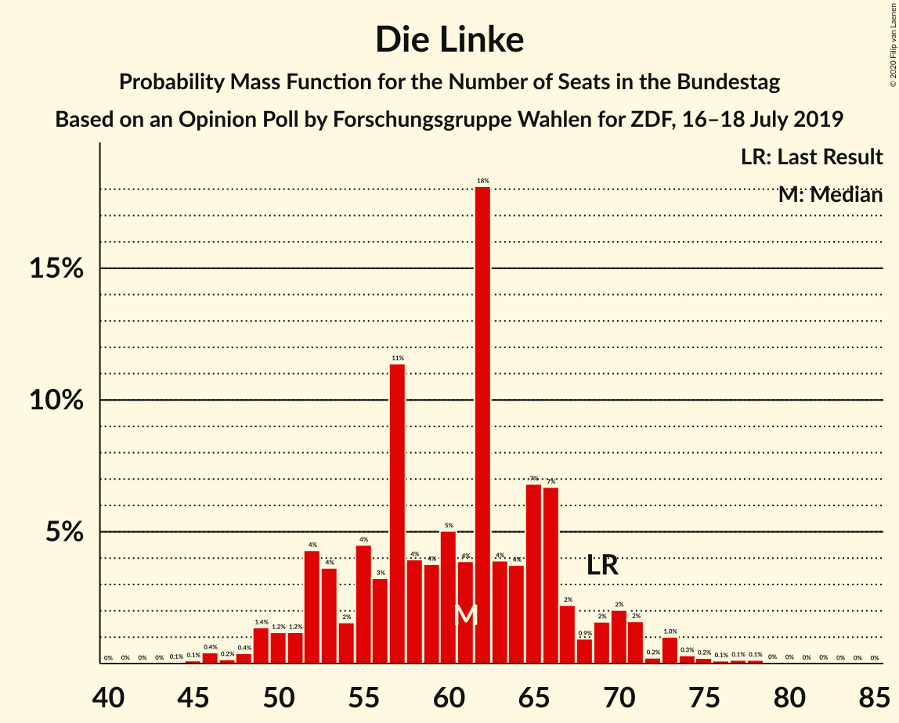
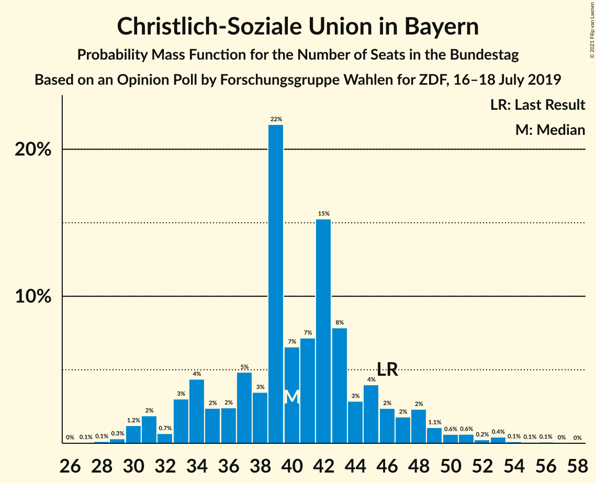
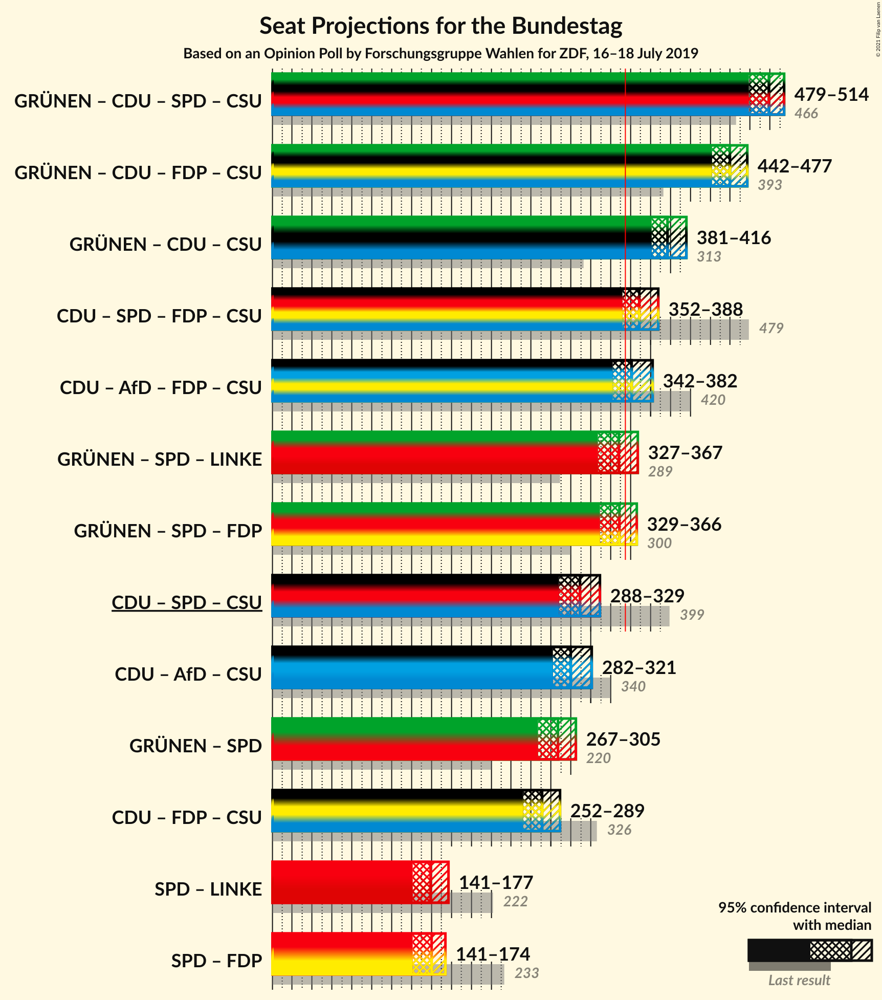

# Opinion Poll by Forschungsgruppe Wahlen for ZDF, 16–18 July 2019

<a href="#voting-intentions">Voting Intentions</a> | <a href="#seats">Seats</a> | <a href="#coalitions">Coalitions</a> | <a href="#technical-information">Technical Information</a>

## Voting Intentions

### Confidence Intervals

| Party | Last Result | Poll Result | 80% Confidence Interval | 90% Confidence Interval | 95% Confidence Interval | 99% Confidence Interval |
|:-----:|:-----------:|:-----------:|:-----------------------:|:-----------------------:|:-----------------------:|:-----------------------:|
| Bündnis 90/Die Grünen | 8.9% | 25.0% | 23.5–26.6% |23.1–27.1% |22.7–27.5% |22.0–28.3% |
| Christlich Demokratische Union Deutschlands | 26.8% | 22.7% | 21.3–24.3% |20.9–24.7% |20.5–25.1% |19.8–25.8% |
| Sozialdemokratische Partei Deutschlands | 20.5% | 13.0% | 11.9–14.3% |11.6–14.7% |11.3–15.0% |10.8–15.6% |
| Alternative für Deutschland | 12.6% | 12.0% | 10.9–13.3% |10.6–13.6% |10.3–13.9% |9.8–14.5% |
| Freie Demokratische Partei | 10.7% | 8.0% | 7.1–9.0% |6.8–9.3% |6.6–9.6% |6.2–10.1% |
| Die Linke | 9.2% | 8.0% | 7.1–9.0% |6.8–9.3% |6.6–9.6% |6.2–10.1% |
| Christlich-Soziale Union in Bayern | 6.2% | 5.3% | 4.5–6.2% |4.3–6.4% |4.2–6.6% |3.9–7.1% |

*Note:* The poll result column reflects the actual value used in the calculations. Published results may vary slightly, and in addition be rounded to fewer digits.

## Seats

### Confidence Intervals

| Party | Last Result | Median | 80% Confidence Interval | 90% Confidence Interval | 95% Confidence Interval | 99% Confidence Interval |
|:-----:|:-----------:|:------:|:-----------------------:|:-----------------------:|:-----------------------:|:-----------------------:|
| <a href="#bündnis-90/die-grünen">Bündnis 90/Die Grünen</a> | 67 | 209 | 209 |192–209 |191–210 |190–210 |
| <a href="#christlich-demokratische-union-deutschlands">Christlich Demokratische Union Deutschlands</a> | 200 | 145 | 145–146 |145–170 |143–170 |143–170 |
| <a href="#sozialdemokratische-partei-deutschlands">Sozialdemokratische Partei Deutschlands</a> | 153 | 103 | 102–103 |94–104 |93–110 |93–111 |
| <a href="#alternative-für-deutschland">Alternative für Deutschland</a> | 94 | 85 | 85 |84–100 |67–100 |66–124 |
| <a href="#freie-demokratische-partei">Freie Demokratische Partei</a> | 80 | 80 | 65–80 |56–80 |56–80 |53–80 |
| <a href="#die-linke">Die Linke</a> | 69 | 52 | 52–65 |52–70 |52–85 |52–85 |
| <a href="#christlich-soziale-union-in-bayern">Christlich-Soziale Union in Bayern</a> | 46 | 35 | 31–35 |28–35 |27–36 |27–36 |

### Bündnis 90/Die Grünen

*For a full overview of the results for this party, see the [Bündnis 90/Die Grünen](party-bündnis90diegrünen.html) page.*

| Number of Seats | Probability | Accumulated | Special Marks |
|:---------------:|:-----------:|:-----------:|:-------------:|
| 67 | 0% | 100% | Last Result |
| 68 | 0% | 100% |  |
| 69 | 0% | 100% |  |
| 70 | 0% | 100% |  |
| 71 | 0% | 100% |  |
| 72 | 0% | 100% |  |
| 73 | 0% | 100% |  |
| 74 | 0% | 100% |  |
| 75 | 0% | 100% |  |
| 76 | 0% | 100% |  |
| 77 | 0% | 100% |  |
| 78 | 0% | 100% |  |
| 79 | 0% | 100% |  |
| 80 | 0% | 100% |  |
| 81 | 0% | 100% |  |
| 82 | 0% | 100% |  |
| 83 | 0% | 100% |  |
| 84 | 0% | 100% |  |
| 85 | 0% | 100% |  |
| 86 | 0% | 100% |  |
| 87 | 0% | 100% |  |
| 88 | 0% | 100% |  |
| 89 | 0% | 100% |  |
| 90 | 0% | 100% |  |
| 91 | 0% | 100% |  |
| 92 | 0% | 100% |  |
| 93 | 0% | 100% |  |
| 94 | 0% | 100% |  |
| 95 | 0% | 100% |  |
| 96 | 0% | 100% |  |
| 97 | 0% | 100% |  |
| 98 | 0% | 100% |  |
| 99 | 0% | 100% |  |
| 100 | 0% | 100% |  |
| 101 | 0% | 100% |  |
| 102 | 0% | 100% |  |
| 103 | 0% | 100% |  |
| 104 | 0% | 100% |  |
| 105 | 0% | 100% |  |
| 106 | 0% | 100% |  |
| 107 | 0% | 100% |  |
| 108 | 0% | 100% |  |
| 109 | 0% | 100% |  |
| 110 | 0% | 100% |  |
| 111 | 0% | 100% |  |
| 112 | 0% | 100% |  |
| 113 | 0% | 100% |  |
| 114 | 0% | 100% |  |
| 115 | 0% | 100% |  |
| 116 | 0% | 100% |  |
| 117 | 0% | 100% |  |
| 118 | 0% | 100% |  |
| 119 | 0% | 100% |  |
| 120 | 0% | 100% |  |
| 121 | 0% | 100% |  |
| 122 | 0% | 100% |  |
| 123 | 0% | 100% |  |
| 124 | 0% | 100% |  |
| 125 | 0% | 100% |  |
| 126 | 0% | 100% |  |
| 127 | 0% | 100% |  |
| 128 | 0% | 100% |  |
| 129 | 0% | 100% |  |
| 130 | 0% | 100% |  |
| 131 | 0% | 100% |  |
| 132 | 0% | 100% |  |
| 133 | 0% | 100% |  |
| 134 | 0% | 100% |  |
| 135 | 0% | 100% |  |
| 136 | 0% | 100% |  |
| 137 | 0% | 100% |  |
| 138 | 0% | 100% |  |
| 139 | 0% | 100% |  |
| 140 | 0% | 100% |  |
| 141 | 0% | 100% |  |
| 142 | 0% | 100% |  |
| 143 | 0% | 100% |  |
| 144 | 0% | 100% |  |
| 145 | 0% | 100% |  |
| 146 | 0% | 100% |  |
| 147 | 0% | 100% |  |
| 148 | 0% | 100% |  |
| 149 | 0% | 100% |  |
| 150 | 0% | 100% |  |
| 151 | 0% | 100% |  |
| 152 | 0% | 100% |  |
| 153 | 0% | 100% |  |
| 154 | 0% | 100% |  |
| 155 | 0% | 100% |  |
| 156 | 0% | 100% |  |
| 157 | 0% | 100% |  |
| 158 | 0% | 100% |  |
| 159 | 0% | 100% |  |
| 160 | 0% | 100% |  |
| 161 | 0% | 100% |  |
| 162 | 0% | 100% |  |
| 163 | 0% | 100% |  |
| 164 | 0% | 100% |  |
| 165 | 0% | 100% |  |
| 166 | 0% | 100% |  |
| 167 | 0% | 100% |  |
| 168 | 0% | 100% |  |
| 169 | 0% | 100% |  |
| 170 | 0% | 100% |  |
| 171 | 0% | 100% |  |
| 172 | 0% | 100% |  |
| 173 | 0% | 100% |  |
| 174 | 0% | 100% |  |
| 175 | 0% | 100% |  |
| 176 | 0% | 100% |  |
| 177 | 0% | 100% |  |
| 178 | 0% | 100% |  |
| 179 | 0% | 100% |  |
| 180 | 0% | 100% |  |
| 181 | 0% | 100% |  |
| 182 | 0% | 100% |  |
| 183 | 0% | 100% |  |
| 184 | 0.1% | 100% |  |
| 185 | 0% | 99.9% |  |
| 186 | 0% | 99.9% |  |
| 187 | 0% | 99.9% |  |
| 188 | 0% | 99.9% |  |
| 189 | 0% | 99.9% |  |
| 190 | 2% | 99.9% |  |
| 191 | 0.7% | 98% |  |
| 192 | 4% | 97% |  |
| 193 | 0% | 93% |  |
| 194 | 0% | 93% |  |
| 195 | 0% | 93% |  |
| 196 | 0% | 93% |  |
| 197 | 0% | 93% |  |
| 198 | 0% | 93% |  |
| 199 | 0% | 93% |  |
| 200 | 0% | 93% |  |
| 201 | 0% | 93% |  |
| 202 | 0% | 93% |  |
| 203 | 0% | 93% |  |
| 204 | 0% | 93% |  |
| 205 | 0% | 93% |  |
| 206 | 0% | 93% |  |
| 207 | 0.1% | 93% |  |
| 208 | 0.3% | 93% |  |
| 209 | 88% | 93% | Median |
| 210 | 4% | 4% |  |
| 211 | 0% | 0% |  |

### Christlich Demokratische Union Deutschlands

*For a full overview of the results for this party, see the [Christlich Demokratische Union Deutschlands](party-christlichdemokratischeuniondeutschlands.html) page.*

| Number of Seats | Probability | Accumulated | Special Marks |
|:---------------:|:-----------:|:-----------:|:-------------:|
| 143 | 4% | 100% |  |
| 144 | 0.6% | 96% |  |
| 145 | 58% | 95% | Median |
| 146 | 30% | 37% |  |
| 147 | 0% | 7% |  |
| 148 | 0% | 7% |  |
| 149 | 0% | 7% |  |
| 150 | 0% | 7% |  |
| 151 | 0% | 7% |  |
| 152 | 0% | 7% |  |
| 153 | 0% | 7% |  |
| 154 | 2% | 7% |  |
| 155 | 0% | 5% |  |
| 156 | 0% | 5% |  |
| 157 | 0% | 5% |  |
| 158 | 0% | 5% |  |
| 159 | 0% | 5% |  |
| 160 | 0% | 5% |  |
| 161 | 0% | 5% |  |
| 162 | 0% | 5% |  |
| 163 | 0% | 5% |  |
| 164 | 0% | 5% |  |
| 165 | 0% | 5% |  |
| 166 | 0% | 5% |  |
| 167 | 0% | 5% |  |
| 168 | 0% | 5% |  |
| 169 | 0% | 5% |  |
| 170 | 5% | 5% |  |
| 171 | 0% | 0.5% |  |
| 172 | 0% | 0.5% |  |
| 173 | 0% | 0.5% |  |
| 174 | 0% | 0.5% |  |
| 175 | 0% | 0.5% |  |
| 176 | 0% | 0.5% |  |
| 177 | 0% | 0.5% |  |
| 178 | 0% | 0.5% |  |
| 179 | 0% | 0.5% |  |
| 180 | 0% | 0.5% |  |
| 181 | 0.4% | 0.5% |  |
| 182 | 0% | 0.1% |  |
| 183 | 0% | 0.1% |  |
| 184 | 0% | 0.1% |  |
| 185 | 0% | 0.1% |  |
| 186 | 0% | 0.1% |  |
| 187 | 0% | 0.1% |  |
| 188 | 0% | 0.1% |  |
| 189 | 0% | 0.1% |  |
| 190 | 0% | 0.1% |  |
| 191 | 0% | 0.1% |  |
| 192 | 0% | 0.1% |  |
| 193 | 0% | 0.1% |  |
| 194 | 0% | 0.1% |  |
| 195 | 0% | 0.1% |  |
| 196 | 0% | 0.1% |  |
| 197 | 0% | 0.1% |  |
| 198 | 0% | 0.1% |  |
| 199 | 0% | 0.1% |  |
| 200 | 0% | 0.1% | Last Result |
| 201 | 0% | 0.1% |  |
| 202 | 0% | 0.1% |  |
| 203 | 0% | 0.1% |  |
| 204 | 0% | 0.1% |  |
| 205 | 0% | 0.1% |  |
| 206 | 0% | 0.1% |  |
| 207 | 0% | 0.1% |  |
| 208 | 0% | 0.1% |  |
| 209 | 0% | 0.1% |  |
| 210 | 0.1% | 0.1% |  |
| 211 | 0% | 0% |  |

### Sozialdemokratische Partei Deutschlands

*For a full overview of the results for this party, see the [Sozialdemokratische Partei Deutschlands](party-sozialdemokratischeparteideutschlands.html) page.*

| Number of Seats | Probability | Accumulated | Special Marks |
|:---------------:|:-----------:|:-----------:|:-------------:|
| 85 | 0.1% | 100% |  |
| 86 | 0% | 99.9% |  |
| 87 | 0% | 99.9% |  |
| 88 | 0% | 99.9% |  |
| 89 | 0% | 99.9% |  |
| 90 | 0% | 99.9% |  |
| 91 | 0% | 99.9% |  |
| 92 | 0% | 99.9% |  |
| 93 | 4% | 99.9% |  |
| 94 | 0.6% | 96% |  |
| 95 | 0.6% | 95% |  |
| 96 | 1.3% | 94% |  |
| 97 | 0% | 93% |  |
| 98 | 0% | 93% |  |
| 99 | 0% | 93% |  |
| 100 | 0% | 93% |  |
| 101 | 0% | 93% |  |
| 102 | 4% | 93% |  |
| 103 | 84% | 89% | Median |
| 104 | 0.2% | 5% |  |
| 105 | 0% | 5% |  |
| 106 | 0% | 5% |  |
| 107 | 0% | 5% |  |
| 108 | 0% | 5% |  |
| 109 | 0.5% | 5% |  |
| 110 | 3% | 4% |  |
| 111 | 0.8% | 1.2% |  |
| 112 | 0.4% | 0.4% |  |
| 113 | 0% | 0% |  |
| 114 | 0% | 0% |  |
| 115 | 0% | 0% |  |
| 116 | 0% | 0% |  |
| 117 | 0% | 0% |  |
| 118 | 0% | 0% |  |
| 119 | 0% | 0% |  |
| 120 | 0% | 0% |  |
| 121 | 0% | 0% |  |
| 122 | 0% | 0% |  |
| 123 | 0% | 0% |  |
| 124 | 0% | 0% |  |
| 125 | 0% | 0% |  |
| 126 | 0% | 0% |  |
| 127 | 0% | 0% |  |
| 128 | 0% | 0% |  |
| 129 | 0% | 0% |  |
| 130 | 0% | 0% |  |
| 131 | 0% | 0% |  |
| 132 | 0% | 0% |  |
| 133 | 0% | 0% |  |
| 134 | 0% | 0% |  |
| 135 | 0% | 0% |  |
| 136 | 0% | 0% |  |
| 137 | 0% | 0% |  |
| 138 | 0% | 0% |  |
| 139 | 0% | 0% |  |
| 140 | 0% | 0% |  |
| 141 | 0% | 0% |  |
| 142 | 0% | 0% |  |
| 143 | 0% | 0% |  |
| 144 | 0% | 0% |  |
| 145 | 0% | 0% |  |
| 146 | 0% | 0% |  |
| 147 | 0% | 0% |  |
| 148 | 0% | 0% |  |
| 149 | 0% | 0% |  |
| 150 | 0% | 0% |  |
| 151 | 0% | 0% |  |
| 152 | 0% | 0% |  |
| 153 | 0% | 0% | Last Result |

### Alternative für Deutschland

*For a full overview of the results for this party, see the [Alternative für Deutschland](party-alternativefürdeutschland.html) page.*

| Number of Seats | Probability | Accumulated | Special Marks |
|:---------------:|:-----------:|:-----------:|:-------------:|
| 66 | 0.5% | 100% |  |
| 67 | 4% | 99.5% |  |
| 68 | 0% | 95% |  |
| 69 | 0% | 95% |  |
| 70 | 0% | 95% |  |
| 71 | 0% | 95% |  |
| 72 | 0% | 95% |  |
| 73 | 0.1% | 95% |  |
| 74 | 0% | 95% |  |
| 75 | 0% | 95% |  |
| 76 | 0% | 95% |  |
| 77 | 0% | 95% |  |
| 78 | 0% | 95% |  |
| 79 | 0% | 95% |  |
| 80 | 0% | 95% |  |
| 81 | 0% | 95% |  |
| 82 | 0% | 95% |  |
| 83 | 0% | 95% |  |
| 84 | 4% | 95% |  |
| 85 | 84% | 91% | Median |
| 86 | 0% | 7% |  |
| 87 | 0% | 7% |  |
| 88 | 0% | 7% |  |
| 89 | 0% | 7% |  |
| 90 | 0.4% | 7% |  |
| 91 | 0% | 7% |  |
| 92 | 0% | 7% |  |
| 93 | 0% | 7% |  |
| 94 | 0% | 7% | Last Result |
| 95 | 0% | 7% |  |
| 96 | 0% | 7% |  |
| 97 | 0% | 7% |  |
| 98 | 0% | 7% |  |
| 99 | 0% | 7% |  |
| 100 | 5% | 7% |  |
| 101 | 0% | 2% |  |
| 102 | 0% | 2% |  |
| 103 | 0% | 2% |  |
| 104 | 0% | 2% |  |
| 105 | 0% | 2% |  |
| 106 | 0% | 2% |  |
| 107 | 0% | 2% |  |
| 108 | 0% | 2% |  |
| 109 | 0% | 2% |  |
| 110 | 0% | 2% |  |
| 111 | 0% | 2% |  |
| 112 | 0% | 2% |  |
| 113 | 0% | 2% |  |
| 114 | 0% | 2% |  |
| 115 | 0% | 2% |  |
| 116 | 0% | 2% |  |
| 117 | 0% | 2% |  |
| 118 | 0% | 2% |  |
| 119 | 0% | 2% |  |
| 120 | 0% | 2% |  |
| 121 | 0% | 2% |  |
| 122 | 0% | 2% |  |
| 123 | 0% | 2% |  |
| 124 | 2% | 2% |  |
| 125 | 0% | 0% |  |

### Freie Demokratische Partei

*For a full overview of the results for this party, see the [Freie Demokratische Partei](party-freiedemokratischepartei.html) page.*

| Number of Seats | Probability | Accumulated | Special Marks |
|:---------------:|:-----------:|:-----------:|:-------------:|
| 44 | 0.3% | 100% |  |
| 45 | 0.1% | 99.7% |  |
| 46 | 0% | 99.6% |  |
| 47 | 0% | 99.6% |  |
| 48 | 0% | 99.6% |  |
| 49 | 0% | 99.6% |  |
| 50 | 0% | 99.6% |  |
| 51 | 0% | 99.6% |  |
| 52 | 0% | 99.6% |  |
| 53 | 1.3% | 99.6% |  |
| 54 | 0.6% | 98% |  |
| 55 | 0% | 98% |  |
| 56 | 4% | 98% |  |
| 57 | 0.5% | 94% |  |
| 58 | 0% | 93% |  |
| 59 | 0% | 93% |  |
| 60 | 0% | 93% |  |
| 61 | 0% | 93% |  |
| 62 | 0% | 93% |  |
| 63 | 0% | 93% |  |
| 64 | 0% | 93% |  |
| 65 | 4% | 93% |  |
| 66 | 0.7% | 89% |  |
| 67 | 0% | 88% |  |
| 68 | 0% | 88% |  |
| 69 | 0% | 88% |  |
| 70 | 0% | 88% |  |
| 71 | 0% | 88% |  |
| 72 | 0% | 88% |  |
| 73 | 0% | 88% |  |
| 74 | 0% | 88% |  |
| 75 | 0% | 88% |  |
| 76 | 0.1% | 88% |  |
| 77 | 0% | 88% |  |
| 78 | 0.2% | 88% |  |
| 79 | 30% | 88% |  |
| 80 | 58% | 58% | Last Result, Median |
| 81 | 0% | 0% |  |

### Die Linke

*For a full overview of the results for this party, see the [Die Linke](party-dielinke.html) page.*

| Number of Seats | Probability | Accumulated | Special Marks |
|:---------------:|:-----------:|:-----------:|:-------------:|
| 47 | 0.1% | 100% |  |
| 48 | 0% | 99.9% |  |
| 49 | 0% | 99.9% |  |
| 50 | 0.4% | 99.9% |  |
| 51 | 0% | 99.5% |  |
| 52 | 88% | 99.5% | Median |
| 53 | 0% | 11% |  |
| 54 | 0% | 11% |  |
| 55 | 0% | 11% |  |
| 56 | 0% | 11% |  |
| 57 | 0% | 11% |  |
| 58 | 0% | 11% |  |
| 59 | 0% | 11% |  |
| 60 | 0% | 11% |  |
| 61 | 0% | 11% |  |
| 62 | 0% | 11% |  |
| 63 | 0% | 11% |  |
| 64 | 0% | 11% |  |
| 65 | 2% | 11% |  |
| 66 | 0% | 10% |  |
| 67 | 0% | 9% |  |
| 68 | 0% | 9% |  |
| 69 | 4% | 9% | Last Result |
| 70 | 0.5% | 6% |  |
| 71 | 0% | 5% |  |
| 72 | 0% | 5% |  |
| 73 | 0% | 5% |  |
| 74 | 0% | 5% |  |
| 75 | 0% | 5% |  |
| 76 | 0% | 5% |  |
| 77 | 0% | 5% |  |
| 78 | 0% | 5% |  |
| 79 | 0% | 5% |  |
| 80 | 0% | 5% |  |
| 81 | 0% | 5% |  |
| 82 | 0% | 5% |  |
| 83 | 0% | 5% |  |
| 84 | 0.6% | 5% |  |
| 85 | 4% | 4% |  |
| 86 | 0% | 0% |  |

### Christlich-Soziale Union in Bayern

*For a full overview of the results for this party, see the [Christlich-Soziale Union in Bayern](party-christlich-sozialeunioninbayern.html) page.*

| Number of Seats | Probability | Accumulated | Special Marks |
|:---------------:|:-----------:|:-----------:|:-------------:|
| 24 | 0.4% | 100% |  |
| 25 | 0% | 99.6% |  |
| 26 | 0% | 99.6% |  |
| 27 | 3% | 99.6% |  |
| 28 | 4% | 97% |  |
| 29 | 0% | 93% |  |
| 30 | 0.6% | 93% |  |
| 31 | 4% | 93% |  |
| 32 | 0% | 88% |  |
| 33 | 0% | 88% |  |
| 34 | 0.1% | 88% |  |
| 35 | 84% | 88% | Median |
| 36 | 4% | 4% |  |
| 37 | 0% | 0% |  |
| 38 | 0% | 0% |  |
| 39 | 0% | 0% |  |
| 40 | 0% | 0% |  |
| 41 | 0% | 0% |  |
| 42 | 0% | 0% |  |
| 43 | 0% | 0% |  |
| 44 | 0% | 0% |  |
| 45 | 0% | 0% |  |
| 46 | 0% | 0% | Last Result |

## Coalitions

### Confidence Intervals

| Coalition | Last Result | Median | Majority? | 80% Confidence Interval | 90% Confidence Interval | 95% Confidence Interval | 99% Confidence Interval |
|:---------:|:-----------:|:------:|:---------:|:-----------------------:|:-----------------------:|:-----------------------:|:-----------------------:|
| Bündnis 90/Die Grünen – Christlich Demokratische Union Deutschlands – Sozialdemokratische Partei Deutschlands – Christlich-Soziale Union in Bayern | 466 | N/A | N/A | 492–493 | 466–513 | 459–517 | 458–517 |
| Bündnis 90/Die Grünen – Christlich Demokratische Union Deutschlands – Freie Demokratische Partei – Christlich-Soziale Union in Bayern | 393 | N/A | N/A | 463–469 | 431–469 | 431–471 | 424–471 |
| Bündnis 90/Die Grünen – Christlich Demokratische Union Deutschlands – Christlich-Soziale Union in Bayern | 313 | N/A | N/A | 389–390 | 371–406 | 366–407 | 365–407 |
| Bündnis 90/Die Grünen – Sozialdemokratische Partei Deutschlands – Freie Demokratische Partei | 300 | N/A | N/A | 375–392 | 350–392 | 350–392 | 339–392 |
| Bündnis 90/Die Grünen – Sozialdemokratische Partei Deutschlands – Die Linke | 289 | N/A | N/A | 364–365 | 364–370 | 364–388 | 350–389 |
| Christlich Demokratische Union Deutschlands – Sozialdemokratische Partei Deutschlands – Freie Demokratische Partei – Christlich-Soziale Union in Bayern | 479 | N/A | N/A | 363 | 332–363 | 332–364 | 330–364 |
| Christlich Demokratische Union Deutschlands – Alternative für Deutschland – Freie Demokratische Partei – Christlich-Soziale Union in Bayern | 420 | 345 | 2% | 344–345 | 339–345 | 321–345 | 320–359 |
| Bündnis 90/Die Grünen – Sozialdemokratische Partei Deutschlands | 220 | N/A | N/A | 312 | 285–313 | 285–319 | 284–320 |
| Christlich Demokratische Union Deutschlands – Sozialdemokratische Partei Deutschlands – Christlich-Soziale Union in Bayern | 399 | N/A | N/A | 283–284 | 276–307 | 267–308 | 267–308 |
| Christlich Demokratische Union Deutschlands – Alternative für Deutschland – Christlich-Soziale Union in Bayern | 340 | 265 | 0% | 265–266 | 265–274 | 265–274 | 264–305 |
| Christlich Demokratische Union Deutschlands – Freie Demokratische Partei – Christlich-Soziale Union in Bayern | 326 | 260 | 0% | 254–260 | 239–260 | 239–261 | 234–261 |
| Sozialdemokratische Partei Deutschlands – Freie Demokratische Partei | 233 | N/A | N/A | 166–183 | 158–183 | 158–183 | 149–183 |
| Sozialdemokratische Partei Deutschlands – Die Linke | 222 | N/A | N/A | 155–161 | 155–178 | 154–179 | 154–180 |

