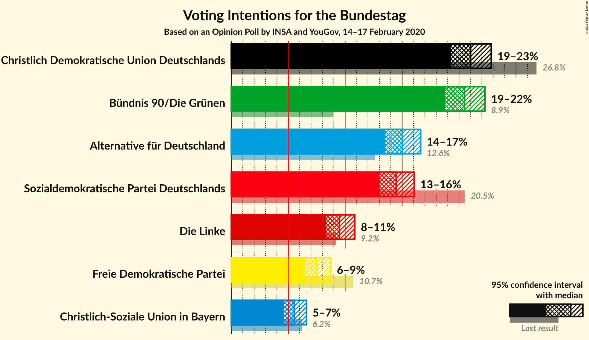
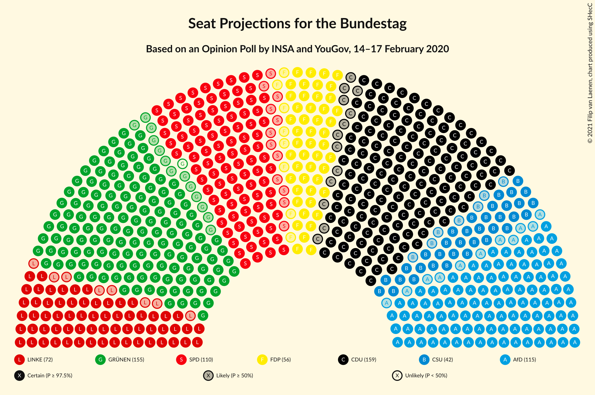
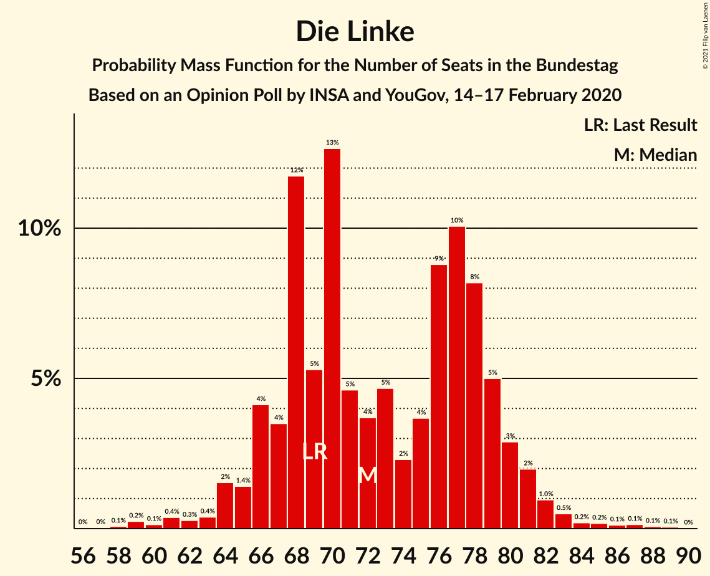
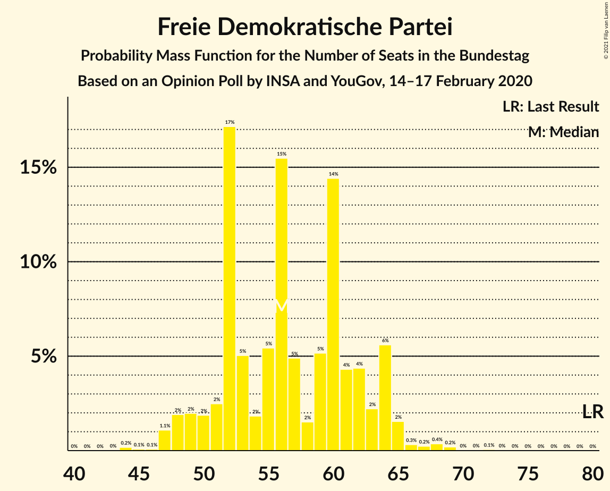

# Opinion Poll by INSA and YouGov, 14–17 February 2020

<a href="#voting-intentions">Voting Intentions</a> | <a href="#seats">Seats</a> | <a href="#coalitions">Coalitions</a> | <a href="#technical-information">Technical Information</a>

## Voting Intentions

### Confidence Intervals

| Party | Last Result | Poll Result | 80% Confidence Interval | 90% Confidence Interval | 95% Confidence Interval | 99% Confidence Interval |
|:-----:|:-----------:|:-----------:|:-----------------------:|:-----------------------:|:-----------------------:|:-----------------------:|
| Christlich Demokratische Union Deutschlands | 26.8% | 21.5% | 20.4–22.8% |20.1–23.1% |19.8–23.4% |19.3–24.0% |
| Bündnis 90/Die Grünen | 8.9% | 20.5% | 19.4–21.7% |19.1–22.0% |18.8–22.3% |18.3–22.9% |
| Alternative für Deutschland | 12.6% | 15.0% | 14.0–16.1% |13.8–16.4% |13.5–16.6% |13.1–17.1% |
| Sozialdemokratische Partei Deutschlands | 20.5% | 14.5% | 13.5–15.5% |13.2–15.8% |13.0–16.1% |12.6–16.6% |
| Die Linke | 9.2% | 9.5% | 8.7–10.4% |8.5–10.6% |8.3–10.8% |7.9–11.3% |
| Freie Demokratische Partei | 10.7% | 7.5% | 6.8–8.3% |6.6–8.5% |6.4–8.7% |6.1–9.1% |
| Christlich-Soziale Union in Bayern | 6.2% | 4.9% | 4.4–5.6% |4.2–5.8% |4.1–6.0% |3.8–6.3% |

*Note:* The poll result column reflects the actual value used in the calculations. Published results may vary slightly, and in addition be rounded to fewer digits.

## Seats

### Confidence Intervals

| Party | Last Result | Median | 80% Confidence Interval | 90% Confidence Interval | 95% Confidence Interval | 99% Confidence Interval |
|:-----:|:-----------:|:------:|:-----------------------:|:-----------------------:|:-----------------------:|:-----------------------:|
| <a href="#christlich-demokratische-union-deutschlands">Christlich Demokratische Union Deutschlands</a> | 200 | 164 | 154–172 |151–177 |150–177 |146–180 |
| <a href="#bündnis-90/die-grünen">Bündnis 90/Die Grünen</a> | 67 | 155 | 146–165 |145–165 |141–170 |137–174 |
| <a href="#alternative-für-deutschland">Alternative für Deutschland</a> | 94 | 113 | 106–122 |104–125 |102–126 |99–130 |
| <a href="#sozialdemokratische-partei-deutschlands">Sozialdemokratische Partei Deutschlands</a> | 153 | 112 | 102–118 |100–120 |98–122 |95–126 |
| <a href="#die-linke">Die Linke</a> | 69 | 72 | 65–79 |64–80 |63–83 |61–85 |
| <a href="#freie-demokratische-partei">Freie Demokratische Partei</a> | 80 | 56 | 51–63 |49–64 |49–65 |47–69 |
| <a href="#christlich-soziale-union-in-bayern">Christlich-Soziale Union in Bayern</a> | 46 | 38 | 33–42 |32–44 |31–45 |29–48 |

### Christlich Demokratische Union Deutschlands

*For a full overview of the results for this party, see the [Christlich Demokratische Union Deutschlands](party-christlichdemokratischeuniondeutschlands.html) page.*

| Number of Seats | Probability | Accumulated | Special Marks |
|:---------------:|:-----------:|:-----------:|:-------------:|
| 142 | 0.1% | 100% |  |
| 143 | 0.1% | 99.8% |  |
| 144 | 0% | 99.8% |  |
| 145 | 0.1% | 99.7% |  |
| 146 | 0.3% | 99.6% |  |
| 147 | 0.3% | 99.3% |  |
| 148 | 0.3% | 99.0% |  |
| 149 | 0.4% | 98.7% |  |
| 150 | 3% | 98% |  |
| 151 | 1.0% | 96% |  |
| 152 | 1.4% | 95% |  |
| 153 | 1.2% | 93% |  |
| 154 | 2% | 92% |  |
| 155 | 0.8% | 90% |  |
| 156 | 3% | 89% |  |
| 157 | 2% | 86% |  |
| 158 | 4% | 84% |  |
| 159 | 11% | 80% |  |
| 160 | 5% | 69% |  |
| 161 | 7% | 64% |  |
| 162 | 4% | 57% |  |
| 163 | 1.4% | 53% |  |
| 164 | 9% | 51% | Median |
| 165 | 3% | 42% |  |
| 166 | 2% | 40% |  |
| 167 | 4% | 38% |  |
| 168 | 9% | 33% |  |
| 169 | 6% | 24% |  |
| 170 | 3% | 18% |  |
| 171 | 3% | 15% |  |
| 172 | 3% | 13% |  |
| 173 | 0.9% | 10% |  |
| 174 | 0.7% | 9% |  |
| 175 | 0.7% | 8% |  |
| 176 | 2% | 7% |  |
| 177 | 4% | 6% |  |
| 178 | 0.5% | 2% |  |
| 179 | 0.3% | 1.3% |  |
| 180 | 0.6% | 1.1% |  |
| 181 | 0.1% | 0.4% |  |
| 182 | 0.1% | 0.4% |  |
| 183 | 0.1% | 0.3% |  |
| 184 | 0% | 0.2% |  |
| 185 | 0.1% | 0.2% |  |
| 186 | 0% | 0.1% |  |
| 187 | 0% | 0% |  |
| 188 | 0% | 0% |  |
| 189 | 0% | 0% |  |
| 190 | 0% | 0% |  |
| 191 | 0% | 0% |  |
| 192 | 0% | 0% |  |
| 193 | 0% | 0% |  |
| 194 | 0% | 0% |  |
| 195 | 0% | 0% |  |
| 196 | 0% | 0% |  |
| 197 | 0% | 0% |  |
| 198 | 0% | 0% |  |
| 199 | 0% | 0% |  |
| 200 | 0% | 0% | Last Result |

### Bündnis 90/Die Grünen

*For a full overview of the results for this party, see the [Bündnis 90/Die Grünen](party-bündnis90diegrünen.html) page.*

| Number of Seats | Probability | Accumulated | Special Marks |
|:---------------:|:-----------:|:-----------:|:-------------:|
| 67 | 0% | 100% | Last Result |
| 68 | 0% | 100% |  |
| 69 | 0% | 100% |  |
| 70 | 0% | 100% |  |
| 71 | 0% | 100% |  |
| 72 | 0% | 100% |  |
| 73 | 0% | 100% |  |
| 74 | 0% | 100% |  |
| 75 | 0% | 100% |  |
| 76 | 0% | 100% |  |
| 77 | 0% | 100% |  |
| 78 | 0% | 100% |  |
| 79 | 0% | 100% |  |
| 80 | 0% | 100% |  |
| 81 | 0% | 100% |  |
| 82 | 0% | 100% |  |
| 83 | 0% | 100% |  |
| 84 | 0% | 100% |  |
| 85 | 0% | 100% |  |
| 86 | 0% | 100% |  |
| 87 | 0% | 100% |  |
| 88 | 0% | 100% |  |
| 89 | 0% | 100% |  |
| 90 | 0% | 100% |  |
| 91 | 0% | 100% |  |
| 92 | 0% | 100% |  |
| 93 | 0% | 100% |  |
| 94 | 0% | 100% |  |
| 95 | 0% | 100% |  |
| 96 | 0% | 100% |  |
| 97 | 0% | 100% |  |
| 98 | 0% | 100% |  |
| 99 | 0% | 100% |  |
| 100 | 0% | 100% |  |
| 101 | 0% | 100% |  |
| 102 | 0% | 100% |  |
| 103 | 0% | 100% |  |
| 104 | 0% | 100% |  |
| 105 | 0% | 100% |  |
| 106 | 0% | 100% |  |
| 107 | 0% | 100% |  |
| 108 | 0% | 100% |  |
| 109 | 0% | 100% |  |
| 110 | 0% | 100% |  |
| 111 | 0% | 100% |  |
| 112 | 0% | 100% |  |
| 113 | 0% | 100% |  |
| 114 | 0% | 100% |  |
| 115 | 0% | 100% |  |
| 116 | 0% | 100% |  |
| 117 | 0% | 100% |  |
| 118 | 0% | 100% |  |
| 119 | 0% | 100% |  |
| 120 | 0% | 100% |  |
| 121 | 0% | 100% |  |
| 122 | 0% | 100% |  |
| 123 | 0% | 100% |  |
| 124 | 0% | 100% |  |
| 125 | 0% | 100% |  |
| 126 | 0% | 100% |  |
| 127 | 0% | 100% |  |
| 128 | 0% | 100% |  |
| 129 | 0% | 100% |  |
| 130 | 0% | 100% |  |
| 131 | 0% | 100% |  |
| 132 | 0% | 100% |  |
| 133 | 0% | 99.9% |  |
| 134 | 0% | 99.9% |  |
| 135 | 0% | 99.9% |  |
| 136 | 0.2% | 99.9% |  |
| 137 | 0.4% | 99.7% |  |
| 138 | 0% | 99.3% |  |
| 139 | 0.2% | 99.2% |  |
| 140 | 0.8% | 99.0% |  |
| 141 | 2% | 98% |  |
| 142 | 0.5% | 96% |  |
| 143 | 0.2% | 96% |  |
| 144 | 0.3% | 96% |  |
| 145 | 2% | 95% |  |
| 146 | 12% | 93% |  |
| 147 | 1.3% | 81% |  |
| 148 | 1.2% | 80% |  |
| 149 | 2% | 79% |  |
| 150 | 6% | 77% |  |
| 151 | 6% | 72% |  |
| 152 | 2% | 65% |  |
| 153 | 0.7% | 63% |  |
| 154 | 4% | 63% |  |
| 155 | 19% | 59% | Median |
| 156 | 5% | 40% |  |
| 157 | 1.0% | 35% |  |
| 158 | 3% | 34% |  |
| 159 | 4% | 31% |  |
| 160 | 7% | 27% |  |
| 161 | 2% | 20% |  |
| 162 | 0.7% | 18% |  |
| 163 | 2% | 17% |  |
| 164 | 2% | 15% |  |
| 165 | 9% | 13% |  |
| 166 | 0.4% | 4% |  |
| 167 | 0.1% | 4% |  |
| 168 | 0.7% | 4% |  |
| 169 | 0.6% | 3% |  |
| 170 | 1.4% | 3% |  |
| 171 | 0% | 1.1% |  |
| 172 | 0.1% | 1.0% |  |
| 173 | 0.3% | 0.9% |  |
| 174 | 0.4% | 0.6% |  |
| 175 | 0% | 0.2% |  |
| 176 | 0% | 0.1% |  |
| 177 | 0% | 0.1% |  |
| 178 | 0% | 0.1% |  |
| 179 | 0% | 0.1% |  |
| 180 | 0% | 0% |  |

### Alternative für Deutschland

*For a full overview of the results for this party, see the [Alternative für Deutschland](party-alternativefürdeutschland.html) page.*

| Number of Seats | Probability | Accumulated | Special Marks |
|:---------------:|:-----------:|:-----------:|:-------------:|
| 94 | 0% | 100% | Last Result |
| 95 | 0% | 100% |  |
| 96 | 0.2% | 100% |  |
| 97 | 0.2% | 99.8% |  |
| 98 | 0% | 99.6% |  |
| 99 | 0.1% | 99.6% |  |
| 100 | 0.8% | 99.5% |  |
| 101 | 1.2% | 98.7% |  |
| 102 | 0.4% | 98% |  |
| 103 | 0.1% | 97% |  |
| 104 | 2% | 97% |  |
| 105 | 5% | 95% |  |
| 106 | 0.7% | 90% |  |
| 107 | 0.2% | 89% |  |
| 108 | 4% | 89% |  |
| 109 | 14% | 85% |  |
| 110 | 4% | 71% |  |
| 111 | 0.6% | 68% |  |
| 112 | 9% | 67% |  |
| 113 | 19% | 58% | Median |
| 114 | 4% | 39% |  |
| 115 | 0.6% | 36% |  |
| 116 | 2% | 35% |  |
| 117 | 10% | 33% |  |
| 118 | 2% | 23% |  |
| 119 | 2% | 21% |  |
| 120 | 0.5% | 19% |  |
| 121 | 6% | 19% |  |
| 122 | 6% | 12% |  |
| 123 | 1.1% | 7% |  |
| 124 | 0.2% | 6% |  |
| 125 | 2% | 5% |  |
| 126 | 1.2% | 4% |  |
| 127 | 1.4% | 2% |  |
| 128 | 0.1% | 1.0% |  |
| 129 | 0.2% | 0.9% |  |
| 130 | 0.3% | 0.8% |  |
| 131 | 0.2% | 0.5% |  |
| 132 | 0.1% | 0.2% |  |
| 133 | 0% | 0.1% |  |
| 134 | 0% | 0.1% |  |
| 135 | 0.1% | 0.1% |  |
| 136 | 0% | 0% |  |

### Sozialdemokratische Partei Deutschlands

*For a full overview of the results for this party, see the [Sozialdemokratische Partei Deutschlands](party-sozialdemokratischeparteideutschlands.html) page.*

| Number of Seats | Probability | Accumulated | Special Marks |
|:---------------:|:-----------:|:-----------:|:-------------:|
| 92 | 0.2% | 100% |  |
| 93 | 0.1% | 99.7% |  |
| 94 | 0% | 99.7% |  |
| 95 | 0.4% | 99.6% |  |
| 96 | 0.4% | 99.2% |  |
| 97 | 0.2% | 98.8% |  |
| 98 | 2% | 98.6% |  |
| 99 | 0.9% | 97% |  |
| 100 | 3% | 96% |  |
| 101 | 1.2% | 93% |  |
| 102 | 2% | 92% |  |
| 103 | 1.5% | 89% |  |
| 104 | 3% | 88% |  |
| 105 | 2% | 85% |  |
| 106 | 13% | 82% |  |
| 107 | 5% | 69% |  |
| 108 | 1.5% | 64% |  |
| 109 | 5% | 63% |  |
| 110 | 2% | 57% |  |
| 111 | 4% | 55% |  |
| 112 | 13% | 51% | Median |
| 113 | 7% | 38% |  |
| 114 | 2% | 31% |  |
| 115 | 10% | 28% |  |
| 116 | 2% | 18% |  |
| 117 | 5% | 16% |  |
| 118 | 2% | 11% |  |
| 119 | 0.5% | 9% |  |
| 120 | 6% | 9% |  |
| 121 | 0.4% | 3% |  |
| 122 | 0.6% | 3% |  |
| 123 | 0.2% | 2% |  |
| 124 | 0.3% | 2% |  |
| 125 | 0.4% | 1.3% |  |
| 126 | 0.5% | 0.9% |  |
| 127 | 0.2% | 0.4% |  |
| 128 | 0.1% | 0.3% |  |
| 129 | 0.1% | 0.2% |  |
| 130 | 0% | 0.1% |  |
| 131 | 0% | 0.1% |  |
| 132 | 0% | 0% |  |
| 133 | 0% | 0% |  |
| 134 | 0% | 0% |  |
| 135 | 0% | 0% |  |
| 136 | 0% | 0% |  |
| 137 | 0% | 0% |  |
| 138 | 0% | 0% |  |
| 139 | 0% | 0% |  |
| 140 | 0% | 0% |  |
| 141 | 0% | 0% |  |
| 142 | 0% | 0% |  |
| 143 | 0% | 0% |  |
| 144 | 0% | 0% |  |
| 145 | 0% | 0% |  |
| 146 | 0% | 0% |  |
| 147 | 0% | 0% |  |
| 148 | 0% | 0% |  |
| 149 | 0% | 0% |  |
| 150 | 0% | 0% |  |
| 151 | 0% | 0% |  |
| 152 | 0% | 0% |  |
| 153 | 0% | 0% | Last Result |

### Die Linke

*For a full overview of the results for this party, see the [Die Linke](party-dielinke.html) page.*

| Number of Seats | Probability | Accumulated | Special Marks |
|:---------------:|:-----------:|:-----------:|:-------------:|
| 57 | 0% | 100% |  |
| 58 | 0.1% | 99.9% |  |
| 59 | 0.2% | 99.8% |  |
| 60 | 0.1% | 99.7% |  |
| 61 | 0.6% | 99.5% |  |
| 62 | 0.5% | 98.9% |  |
| 63 | 1.5% | 98% |  |
| 64 | 6% | 97% |  |
| 65 | 2% | 91% |  |
| 66 | 5% | 89% |  |
| 67 | 4% | 85% |  |
| 68 | 4% | 81% |  |
| 69 | 6% | 77% | Last Result |
| 70 | 3% | 71% |  |
| 71 | 12% | 68% |  |
| 72 | 11% | 56% | Median |
| 73 | 3% | 45% |  |
| 74 | 10% | 42% |  |
| 75 | 4% | 32% |  |
| 76 | 6% | 28% |  |
| 77 | 5% | 22% |  |
| 78 | 4% | 17% |  |
| 79 | 6% | 13% |  |
| 80 | 3% | 7% |  |
| 81 | 0.3% | 4% |  |
| 82 | 0.6% | 4% |  |
| 83 | 2% | 3% |  |
| 84 | 0.7% | 1.4% |  |
| 85 | 0.4% | 0.6% |  |
| 86 | 0.1% | 0.3% |  |
| 87 | 0.1% | 0.2% |  |
| 88 | 0% | 0.1% |  |
| 89 | 0% | 0.1% |  |
| 90 | 0% | 0% |  |

### Freie Demokratische Partei

*For a full overview of the results for this party, see the [Freie Demokratische Partei](party-freiedemokratischepartei.html) page.*

| Number of Seats | Probability | Accumulated | Special Marks |
|:---------------:|:-----------:|:-----------:|:-------------:|
| 44 | 0% | 100% |  |
| 45 | 0.2% | 99.9% |  |
| 46 | 0.1% | 99.8% |  |
| 47 | 0.7% | 99.6% |  |
| 48 | 0.9% | 99.0% |  |
| 49 | 4% | 98% |  |
| 50 | 2% | 94% |  |
| 51 | 12% | 92% |  |
| 52 | 5% | 80% |  |
| 53 | 8% | 75% |  |
| 54 | 5% | 67% |  |
| 55 | 7% | 63% |  |
| 56 | 8% | 55% | Median |
| 57 | 7% | 48% |  |
| 58 | 7% | 41% |  |
| 59 | 10% | 34% |  |
| 60 | 6% | 24% |  |
| 61 | 3% | 18% |  |
| 62 | 5% | 16% |  |
| 63 | 4% | 10% |  |
| 64 | 3% | 7% |  |
| 65 | 2% | 4% |  |
| 66 | 0.6% | 2% |  |
| 67 | 0.8% | 2% |  |
| 68 | 0.4% | 0.9% |  |
| 69 | 0.2% | 0.6% |  |
| 70 | 0.1% | 0.4% |  |
| 71 | 0.1% | 0.2% |  |
| 72 | 0.1% | 0.2% |  |
| 73 | 0% | 0.1% |  |
| 74 | 0% | 0.1% |  |
| 75 | 0% | 0% |  |
| 76 | 0% | 0% |  |
| 77 | 0% | 0% |  |
| 78 | 0% | 0% |  |
| 79 | 0% | 0% |  |
| 80 | 0% | 0% | Last Result |

### Christlich-Soziale Union in Bayern

*For a full overview of the results for this party, see the [Christlich-Soziale Union in Bayern](party-christlich-sozialeunioninbayern.html) page.*

| Number of Seats | Probability | Accumulated | Special Marks |
|:---------------:|:-----------:|:-----------:|:-------------:|
| 27 | 0.2% | 100% |  |
| 28 | 0.1% | 99.8% |  |
| 29 | 0.7% | 99.7% |  |
| 30 | 1.0% | 99.0% |  |
| 31 | 2% | 98% |  |
| 32 | 2% | 96% |  |
| 33 | 7% | 93% |  |
| 34 | 7% | 87% |  |
| 35 | 9% | 80% |  |
| 36 | 6% | 71% |  |
| 37 | 9% | 65% |  |
| 38 | 11% | 56% | Median |
| 39 | 18% | 45% |  |
| 40 | 4% | 28% |  |
| 41 | 11% | 24% |  |
| 42 | 3% | 12% |  |
| 43 | 3% | 9% |  |
| 44 | 3% | 6% |  |
| 45 | 1.3% | 3% |  |
| 46 | 1.0% | 2% | Last Result |
| 47 | 0.4% | 1.0% |  |
| 48 | 0.3% | 0.6% |  |
| 49 | 0.1% | 0.3% |  |
| 50 | 0.1% | 0.2% |  |
| 51 | 0% | 0.1% |  |
| 52 | 0% | 0% |  |

## Coalitions

### Confidence Intervals

| Coalition | Last Result | Median | Majority? | 80% Confidence Interval | 90% Confidence Interval | 95% Confidence Interval | 99% Confidence Interval |
|:---------:|:-----------:|:------:|:---------:|:-----------------------:|:-----------------------:|:-----------------------:|:-----------------------:|
| Christlich Demokratische Union Deutschlands – Bündnis 90/Die Grünen – Sozialdemokratische Partei Deutschlands – Christlich-Soziale Union in Bayern | 466 | N/A | N/A | 457–476 | 454–476 | 448–479 | 445–486 |
| Christlich Demokratische Union Deutschlands – Bündnis 90/Die Grünen – Freie Demokratische Partei – Christlich-Soziale Union in Bayern | 393 | 411 | 100% | 400–426 | 398–429 | 395–430 | 392–434 |
| Christlich Demokratische Union Deutschlands – Alternative für Deutschland – Freie Demokratische Partei – Christlich-Soziale Union in Bayern | 420 | 371 | 98.8% | 362–382 | 359–385 | 356–386 | 352–392 |
| Christlich Demokratische Union Deutschlands – Sozialdemokratische Partei Deutschlands – Freie Demokratische Partei – Christlich-Soziale Union in Bayern | 479 | 370 | 94% | 358–379 | 354–381 | 351–382 | 345–388 |
| Christlich Demokratische Union Deutschlands – Bündnis 90/Die Grünen – Christlich-Soziale Union in Bayern | 313 | N/A | N/A | 343–368 | 342–370 | 339–371 | 335–377 |
| Bündnis 90/Die Grünen – Sozialdemokratische Partei Deutschlands – Die Linke | 289 | N/A | N/A | 327–347 | 324–350 | 323–353 | 317–357 |
| Bündnis 90/Die Grünen – Sozialdemokratische Partei Deutschlands – Freie Demokratische Partei | 300 | N/A | N/A | 311–332 | 309–333 | 307–339 | 300–342 |
| Christlich Demokratische Union Deutschlands – Alternative für Deutschland – Christlich-Soziale Union in Bayern | 340 | 317 | 0% | 306–324 | 302–328 | 300–331 | 295–336 |
| Christlich Demokratische Union Deutschlands – Sozialdemokratische Partei Deutschlands – Christlich-Soziale Union in Bayern | 399 | N/A | N/A | 301–321 | 297–323 | 294–325 | 291–330 |
| Bündnis 90/Die Grünen – Sozialdemokratische Partei Deutschlands | 220 | N/A | N/A | 256–272 | 252–279 | 249–281 | 246–284 |
| Christlich Demokratische Union Deutschlands – Freie Demokratische Partei – Christlich-Soziale Union in Bayern | 326 | 257 | 0% | 248–270 | 245–273 | 241–273 | 236–278 |
| Sozialdemokratische Partei Deutschlands – Die Linke | 222 | N/A | N/A | 172–193 | 171–196 | 169–196 | 164–200 |
| Sozialdemokratische Partei Deutschlands – Freie Demokratische Partei | 233 | N/A | N/A | 159–177 | 155–178 | 153–180 | 151–184 |

