# Poll Average

<a href="#voting-intentions">Voting Intentions</a> | <a href="#seats">Seats</a> | <a href="#coalitions">Coalitions</a> | <a href="#technical-information">Technical Information</a>

## Summary

The table below lists the polls on which the average is based. They are the most recent polls (less than 90 days old) registered and analyzed so far.

| Period     | Polling firm/Commissioner(s) | CDU | SPD | AfD | FDP | LINKE | GRÜNEN | CSU |
|:----------:|:----------------------------:|:--:|:--:|:--:|:--:|:--:|:--:|:--:|
| 24 September 2017 | General Election | 26.8%   200 | 20.5%   153 | 12.6%   94 | 10.7%   80 | 9.2%   69 | 8.9%   67 | 6.2%   46 |
| N/A | Poll Average | 16–26%   124–199 | 12–19%   90–139 | 9–13%   65–97 | 8–13%   60–101 | 6–9%   44–70 | 19–30%   146–225 | 3–7%   26–51 |
| [23 April 2021](2021-04-23-INSAandYouGov.html) | INSA and YouGov | 17–22%   127–163 | 15–19%   110–145 | 9–13%   68–97 | 10–14%   75–105 | 6–10%   48–73 | 20–26%   152–191 | 3–6%   25–44 |
| [15–21 April 2021](2021-04-21-Kantar.html) | Kantar | 20–24%   148–183 | 11–15%   85–113 | 8–12%   64–89 | 7–11%   56–81 | 6–9%   43–65 | 26–31%   192–229 | 4–6%   30–48 |
| [19–20 April 2021](2021-04-20-Forsa.html) | Forsa | 15–19%   115–149 | 11–15%   86–116 | 9–13%   71–99 | 10–14%   78–107 | 6–9%   43–66 | 25–31%   196–236 | 3–5%   22–40 |
| [13–15 April 2021](2021-04-15-ForschungsgruppeWahlen.html) | Forschungsgruppe Wahlen | 23–28%   174–210 | 12–16%   93–122 | 9–13%   72–97 | 8–11%   57–81 | 6–8%   43–64 | 19–23%   143–177 | 5–7%   36–55 |
| [6–15 April 2021](2021-04-15-Allensbach.html) | Allensbach | 20–25%   151–189 | 14–19%   107–141 | 8–11%   60–86 | 8–12%   62–89 | 6–9%   45–69 | 21–26%   154–191 | 4–7%   30–51 |
| [13–14 April 2021](2021-04-14-Infratestdimap.html) | Infratest dimap | 20–25%   156–191 | 13–17%   99–130 | 9–13%   71–97 | 9–13%   71–98 | 6–9%   43–65 | 19–23%   143–178 | 4–7%   31–51 |
| [25–29 March 2021](2021-03-29-YouGov.html) | YouGov | 20–24%   152–180 | 15–19%   117–140 | 10–12%   73–93 | 9–11%   66–85 | 7–9%   52–70 | 19–23%   145–172 | 4–6%   32–46 |
| [24–29 March 2021](2021-03-29-GMS.html) | GMS | 19–24%   142–180 | 14–18%   105–139 | 9–13%   70–99 | 9–13%   70–99 | 6–10%   49–74 | 19–24%   142–179 | 4–6%   28–49 |
| 24 September 2017 | General Election | 26.8%   200 | 20.5%   153 | 12.6%   94 | 10.7%   80 | 9.2%   69 | 8.9%   67 | 6.2%   46 |

Only polls for which at least the sample size has been published are included in the table above.

**Legend:**
+ **Top half of each row:** Voting intentions (95% confidence interval)
+ **Bottom half of each row:** Seat projections for the Bundestag (95% confidence interval)
+ **CDU:** Christlich Demokratische Union Deutschlands
+ **SPD:** Sozialdemokratische Partei Deutschlands
+ **AfD:** Alternative für Deutschland
+ **FDP:** Freie Demokratische Partei
+ **LINKE:** Die Linke
+ **GRÜNEN:** Bündnis 90/Die Grünen
+ **CSU:** Christlich-Soziale Union in Bayern
+ **N/A (single party):** Party not included the published results
+ **N/A (entire row):** Calculation for this opinion poll not started yet

## Voting Intentions

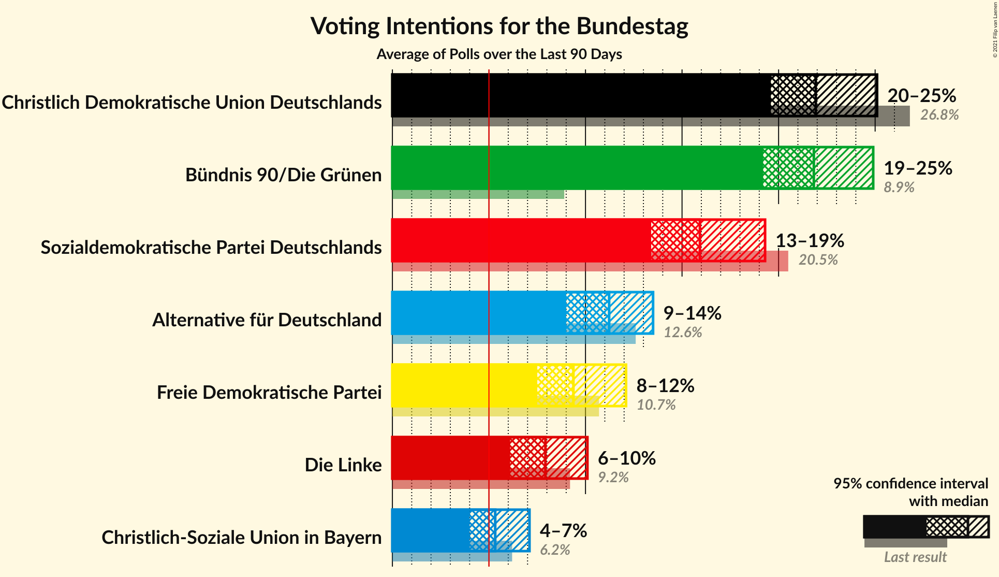

### Confidence Intervals

| Party | Last Result | Median | 80% Confidence Interval | 90% Confidence Interval | 95% Confidence Interval | 99% Confidence Interval |
|:-----:|:-----------:|:------:|:-----------------------:|:-----------------------:|:-----------------------:|:-----------------------:|
| <a href="#christlich-demokratische-union-deutschlands">Christlich Demokratische Union Deutschlands</a> | 26.8% | 21.8% | 17.8–24.8% |16.8–25.7% | 16.2–26.3% | 15.3–27.4% |
| <a href="#sozialdemokratische-partei-deutschlands">Sozialdemokratische Partei Deutschlands</a> | 20.5% | 15.3% | 12.7–17.6% |12.2–18.1% | 11.8–18.6% | 11.1–19.4% |
| <a href="#alternative-für-deutschland">Alternative für Deutschland</a> | 12.6% | 10.8% | 9.4–12.1% |9.0–12.4% | 8.6–12.8% | 8.0–13.5% |
| <a href="#freie-demokratische-partei">Freie Demokratische Partei</a> | 10.7% | 10.5% | 8.7–12.5% |8.3–13.0% | 8.0–13.4% | 7.4–14.2% |
| <a href="#die-linke">Die Linke</a> | 9.2% | 7.5% | 6.4–8.7% |6.1–9.0% | 5.9–9.3% | 5.4–10.0% |
| <a href="#bündnis-90/die-grünen">Bündnis 90/Die Grünen</a> | 8.9% | 22.3% | 20.1–28.4% |19.6–29.1% | 19.2–29.7% | 18.4–30.8% |
| <a href="#christlich-soziale-union-in-bayern">Christlich-Soziale Union in Bayern</a> | 6.2% | 5.1% | 4.0–6.1% |3.7–6.4% | 3.4–6.7% | 3.0–7.2% |

### Christlich Demokratische Union Deutschlands

*For a full overview of the results for this party, see the [Christlich Demokratische Union Deutschlands](party-christlichdemokratischeuniondeutschlands.html) page.*

| Voting Intentions | Probability | Accumulated | Special Marks |
|:-----------------:|:-----------:|:-----------:|:-------------:|
| 12.5–13.5% | 0% | 100% |  |
| 13.5–14.5% | 0.1% | 100% |  |
| 14.5–15.5% | 0.8% | 99.9% |  |
| 15.5–16.5% | 3% | 99.1% |  |
| 16.5–17.5% | 5% | 96% |  |
| 17.5–18.5% | 5% | 91% |  |
| 18.5–19.5% | 6% | 86% |  |
| 19.5–20.5% | 9% | 80% |  |
| 20.5–21.5% | 15% | 71% |  |
| 21.5–22.5% | 20% | 56% | Median |
| 22.5–23.5% | 15% | 36% |  |
| 23.5–24.5% | 9% | 21% |  |
| 24.5–25.5% | 6% | 11% |  |
| 25.5–26.5% | 4% | 6% |  |
| 26.5–27.5% | 1.5% | 2% | Last Result |
| 27.5–28.5% | 0.3% | 0.4% |  |
| 28.5–29.5% | 0% | 0.1% |  |
| 29.5–30.5% | 0% | 0% |  |

### Sozialdemokratische Partei Deutschlands

*For a full overview of the results for this party, see the [Sozialdemokratische Partei Deutschlands](party-sozialdemokratischeparteideutschlands.html) page.*

| Voting Intentions | Probability | Accumulated | Special Marks |
|:-----------------:|:-----------:|:-----------:|:-------------:|
| 8.5–9.5% | 0% | 100% |  |
| 9.5–10.5% | 0.1% | 100% |  |
| 10.5–11.5% | 1.4% | 99.9% |  |
| 11.5–12.5% | 7% | 98.5% |  |
| 12.5–13.5% | 14% | 92% |  |
| 13.5–14.5% | 16% | 78% |  |
| 14.5–15.5% | 16% | 62% | Median |
| 15.5–16.5% | 18% | 46% |  |
| 16.5–17.5% | 17% | 28% |  |
| 17.5–18.5% | 9% | 11% |  |
| 18.5–19.5% | 2% | 3% |  |
| 19.5–20.5% | 0.3% | 0.4% |  |
| 20.5–21.5% | 0% | 0% | Last Result |

### Alternative für Deutschland

*For a full overview of the results for this party, see the [Alternative für Deutschland](party-alternativefürdeutschland.html) page.*

| Voting Intentions | Probability | Accumulated | Special Marks |
|:-----------------:|:-----------:|:-----------:|:-------------:|
| 5.5–6.5% | 0% | 100% |  |
| 6.5–7.5% | 0.1% | 100% |  |
| 7.5–8.5% | 2% | 99.9% |  |
| 8.5–9.5% | 11% | 98% |  |
| 9.5–10.5% | 28% | 87% |  |
| 10.5–11.5% | 37% | 59% | Median |
| 11.5–12.5% | 18% | 22% |  |
| 12.5–13.5% | 4% | 4% | Last Result |
| 13.5–14.5% | 0.4% | 0.4% |  |
| 14.5–15.5% | 0% | 0% |  |

### Freie Demokratische Partei

*For a full overview of the results for this party, see the [Freie Demokratische Partei](party-freiedemokratischepartei.html) page.*

| Voting Intentions | Probability | Accumulated | Special Marks |
|:-----------------:|:-----------:|:-----------:|:-------------:|
| 5.5–6.5% | 0% | 100% |  |
| 6.5–7.5% | 0.7% | 100% |  |
| 7.5–8.5% | 7% | 99.3% |  |
| 8.5–9.5% | 19% | 92% |  |
| 9.5–10.5% | 25% | 73% | Median |
| 10.5–11.5% | 23% | 48% | Last Result |
| 11.5–12.5% | 16% | 25% |  |
| 12.5–13.5% | 7% | 9% |  |
| 13.5–14.5% | 2% | 2% |  |
| 14.5–15.5% | 0.2% | 0.2% |  |
| 15.5–16.5% | 0% | 0% |  |

### Die Linke

*For a full overview of the results for this party, see the [Die Linke](party-dielinke.html) page.*

| Voting Intentions | Probability | Accumulated | Special Marks |
|:-----------------:|:-----------:|:-----------:|:-------------:|
| 3.5–4.5% | 0% | 100% |  |
| 4.5–5.5% | 0.8% | 100% |  |
| 5.5–6.5% | 14% | 99.2% |  |
| 6.5–7.5% | 39% | 85% | Median |
| 7.5–8.5% | 35% | 47% |  |
| 8.5–9.5% | 11% | 12% | Last Result |
| 9.5–10.5% | 1.4% | 1.5% |  |
| 10.5–11.5% | 0.1% | 0.1% |  |
| 11.5–12.5% | 0% | 0% |  |

### Bündnis 90/Die Grünen

*For a full overview of the results for this party, see the [Bündnis 90/Die Grünen](party-bündnis90diegrünen.html) page.*

| Voting Intentions | Probability | Accumulated | Special Marks |
|:-----------------:|:-----------:|:-----------:|:-------------:|
| 8.5–9.5% | 0% | 100% | Last Result |
| 9.5–10.5% | 0% | 100% |  |
| 10.5–11.5% | 0% | 100% |  |
| 11.5–12.5% | 0% | 100% |  |
| 12.5–13.5% | 0% | 100% |  |
| 13.5–14.5% | 0% | 100% |  |
| 14.5–15.5% | 0% | 100% |  |
| 15.5–16.5% | 0% | 100% |  |
| 16.5–17.5% | 0% | 100% |  |
| 17.5–18.5% | 0.6% | 100% |  |
| 18.5–19.5% | 4% | 99.4% |  |
| 19.5–20.5% | 13% | 95% |  |
| 20.5–21.5% | 20% | 83% |  |
| 21.5–22.5% | 17% | 63% | Median |
| 22.5–23.5% | 11% | 46% |  |
| 23.5–24.5% | 6% | 35% |  |
| 24.5–25.5% | 3% | 28% |  |
| 25.5–26.5% | 3% | 25% |  |
| 26.5–27.5% | 6% | 22% |  |
| 27.5–28.5% | 7% | 16% |  |
| 28.5–29.5% | 6% | 9% |  |
| 29.5–30.5% | 2% | 3% |  |
| 30.5–31.5% | 0.6% | 0.8% |  |
| 31.5–32.5% | 0.1% | 0.1% |  |
| 32.5–33.5% | 0% | 0% |  |

### Christlich-Soziale Union in Bayern

*For a full overview of the results for this party, see the [Christlich-Soziale Union in Bayern](party-christlich-sozialeunioninbayern.html) page.*

| Voting Intentions | Probability | Accumulated | Special Marks |
|:-----------------:|:-----------:|:-----------:|:-------------:|
| 1.5–2.5% | 0% | 100% |  |
| 2.5–3.5% | 4% | 100% |  |
| 3.5–4.5% | 23% | 96% |  |
| 4.5–5.5% | 46% | 73% | Median |
| 5.5–6.5% | 23% | 27% | Last Result |
| 6.5–7.5% | 3% | 3% |  |
| 7.5–8.5% | 0.1% | 0.2% |  |
| 8.5–9.5% | 0% | 0% |  |

## Seats

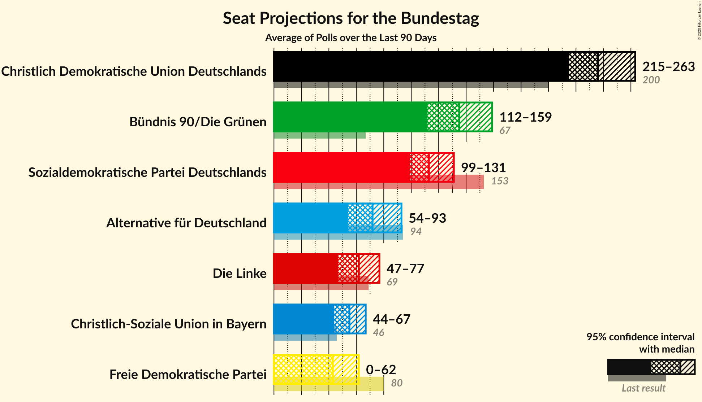

### Confidence Intervals

| Party | Last Result | Median | 80% Confidence Interval | 90% Confidence Interval | 95% Confidence Interval | 99% Confidence Interval |
|:-----:|:-----------:|:------:|:-----------------------:|:-----------------------:|:-----------------------:|:-----------------------:|
| <a href="#christlich-demokratische-union-deutschlands">Christlich Demokratische Union Deutschlands</a> | 200 | 165 | 135–187 |128–195 | 124–199 | 117–208 |
| <a href="#sozialdemokratische-partei-deutschlands">Sozialdemokratische Partei Deutschlands</a> | 153 | 116 | 96–132 |92–136 | 90–139 | 85–145 |
| <a href="#alternative-für-deutschland">Alternative für Deutschland</a> | 94 | 81 | 70–91 |68–94 | 65–97 | 60–102 |
| <a href="#freie-demokratische-partei">Freie Demokratische Partei</a> | 80 | 79 | 66–94 |63–98 | 60–101 | 56–107 |
| <a href="#die-linke">Die Linke</a> | 69 | 56 | 48–65 |46–68 | 44–70 | 41–75 |
| <a href="#bündnis-90/die-grünen">Bündnis 90/Die Grünen</a> | 67 | 168 | 152–215 |148–221 | 146–225 | 140–235 |
| <a href="#christlich-soziale-union-in-bayern">Christlich-Soziale Union in Bayern</a> | 46 | 38 | 30–46 |28–48 | 26–51 | 23–55 |

### Christlich Demokratische Union Deutschlands

*For a full overview of the results for this party, see the [Christlich Demokratische Union Deutschlands](party-christlichdemokratischeuniondeutschlands.html) page.*

| Number of Seats | Probability | Accumulated | Special Marks |
|:---------------:|:-----------:|:-----------:|:-------------:|
| 110 | 0% | 100% |  |
| 111 | 0% | 99.9% |  |
| 112 | 0% | 99.9% |  |
| 113 | 0% | 99.9% |  |
| 114 | 0.1% | 99.8% |  |
| 115 | 0.1% | 99.8% |  |
| 116 | 0.1% | 99.7% |  |
| 117 | 0.1% | 99.6% |  |
| 118 | 0.2% | 99.4% |  |
| 119 | 0.2% | 99.2% |  |
| 120 | 0.2% | 99.0% |  |
| 121 | 0.3% | 98.8% |  |
| 122 | 0.4% | 98.5% |  |
| 123 | 0.4% | 98% |  |
| 124 | 0.4% | 98% |  |
| 125 | 0.6% | 97% |  |
| 126 | 0.5% | 97% |  |
| 127 | 0.6% | 96% |  |
| 128 | 0.8% | 96% |  |
| 129 | 0.5% | 95% |  |
| 130 | 0.7% | 94% |  |
| 131 | 0.8% | 94% |  |
| 132 | 0.9% | 93% |  |
| 133 | 0.7% | 92% |  |
| 134 | 0.7% | 91% |  |
| 135 | 1.0% | 91% |  |
| 136 | 0.9% | 90% |  |
| 137 | 0.7% | 89% |  |
| 138 | 1.0% | 88% |  |
| 139 | 0.9% | 87% |  |
| 140 | 0.8% | 86% |  |
| 141 | 0.9% | 85% |  |
| 142 | 0.8% | 84% |  |
| 143 | 1.0% | 84% |  |
| 144 | 1.0% | 83% |  |
| 145 | 1.0% | 82% |  |
| 146 | 0.9% | 81% |  |
| 147 | 0.9% | 80% |  |
| 148 | 1.1% | 79% |  |
| 149 | 0.8% | 78% |  |
| 150 | 1.2% | 77% |  |
| 151 | 1.2% | 76% |  |
| 152 | 1.1% | 75% |  |
| 153 | 1.5% | 73% |  |
| 154 | 1.4% | 72% |  |
| 155 | 1.2% | 71% |  |
| 156 | 2% | 69% |  |
| 157 | 2% | 68% |  |
| 158 | 2% | 66% |  |
| 159 | 2% | 64% |  |
| 160 | 2% | 62% |  |
| 161 | 2% | 59% |  |
| 162 | 2% | 57% |  |
| 163 | 2% | 55% |  |
| 164 | 3% | 53% |  |
| 165 | 3% | 50% | Median |
| 166 | 3% | 48% |  |
| 167 | 3% | 45% |  |
| 168 | 3% | 42% |  |
| 169 | 3% | 39% |  |
| 170 | 2% | 37% |  |
| 171 | 2% | 34% |  |
| 172 | 3% | 32% |  |
| 173 | 3% | 30% |  |
| 174 | 2% | 27% |  |
| 175 | 2% | 25% |  |
| 176 | 1.4% | 24% |  |
| 177 | 2% | 22% |  |
| 178 | 1.3% | 21% |  |
| 179 | 2% | 19% |  |
| 180 | 1.4% | 18% |  |
| 181 | 1.1% | 16% |  |
| 182 | 1.1% | 15% |  |
| 183 | 0.9% | 14% |  |
| 184 | 0.8% | 13% |  |
| 185 | 0.9% | 13% |  |
| 186 | 0.9% | 12% |  |
| 187 | 0.8% | 11% |  |
| 188 | 0.9% | 10% |  |
| 189 | 0.9% | 9% |  |
| 190 | 0.5% | 8% |  |
| 191 | 0.8% | 8% |  |
| 192 | 0.5% | 7% |  |
| 193 | 0.6% | 6% |  |
| 194 | 0.6% | 6% |  |
| 195 | 0.6% | 5% |  |
| 196 | 0.5% | 4% |  |
| 197 | 0.5% | 4% |  |
| 198 | 0.5% | 3% |  |
| 199 | 0.4% | 3% |  |
| 200 | 0.4% | 2% | Last Result |
| 201 | 0.4% | 2% |  |
| 202 | 0.2% | 2% |  |
| 203 | 0.2% | 2% |  |
| 204 | 0.3% | 1.3% |  |
| 205 | 0.1% | 1.0% |  |
| 206 | 0.2% | 0.9% |  |
| 207 | 0.2% | 0.7% |  |
| 208 | 0.1% | 0.6% |  |
| 209 | 0.1% | 0.4% |  |
| 210 | 0.1% | 0.4% |  |
| 211 | 0% | 0.3% |  |
| 212 | 0% | 0.2% |  |
| 213 | 0.1% | 0.2% |  |
| 214 | 0% | 0.1% |  |
| 215 | 0% | 0.1% |  |
| 216 | 0% | 0.1% |  |
| 217 | 0% | 0% |  |

### Sozialdemokratische Partei Deutschlands

*For a full overview of the results for this party, see the [Sozialdemokratische Partei Deutschlands](party-sozialdemokratischeparteideutschlands.html) page.*

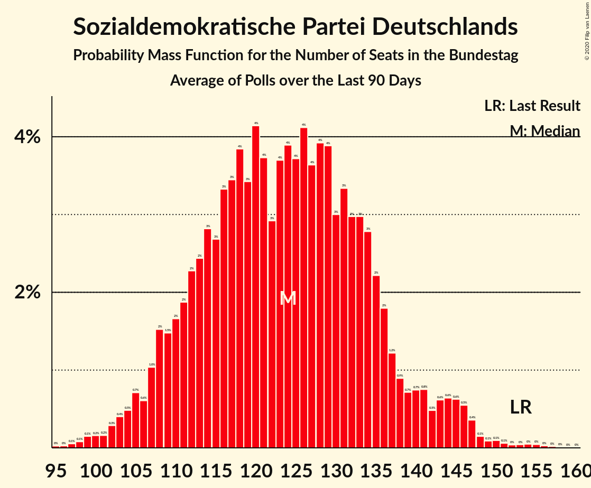

| Number of Seats | Probability | Accumulated | Special Marks |
|:---------------:|:-----------:|:-----------:|:-------------:|
| 79 | 0% | 100% |  |
| 80 | 0% | 99.9% |  |
| 81 | 0% | 99.9% |  |
| 82 | 0.1% | 99.8% |  |
| 83 | 0.1% | 99.8% |  |
| 84 | 0.2% | 99.7% |  |
| 85 | 0.3% | 99.5% |  |
| 86 | 0.4% | 99.2% |  |
| 87 | 0.5% | 98.9% |  |
| 88 | 0.4% | 98% |  |
| 89 | 0.4% | 98% |  |
| 90 | 0.5% | 98% |  |
| 91 | 1.0% | 97% |  |
| 92 | 1.1% | 96% |  |
| 93 | 1.3% | 95% |  |
| 94 | 1.2% | 94% |  |
| 95 | 1.4% | 93% |  |
| 96 | 1.4% | 91% |  |
| 97 | 2% | 90% |  |
| 98 | 2% | 88% |  |
| 99 | 2% | 86% |  |
| 100 | 2% | 84% |  |
| 101 | 3% | 82% |  |
| 102 | 2% | 80% |  |
| 103 | 2% | 78% |  |
| 104 | 2% | 76% |  |
| 105 | 2% | 75% |  |
| 106 | 2% | 72% |  |
| 107 | 2% | 70% |  |
| 108 | 2% | 68% |  |
| 109 | 2% | 66% |  |
| 110 | 2% | 64% |  |
| 111 | 2% | 61% |  |
| 112 | 2% | 60% |  |
| 113 | 2% | 58% |  |
| 114 | 2% | 55% |  |
| 115 | 2% | 53% |  |
| 116 | 2% | 51% | Median |
| 117 | 3% | 49% |  |
| 118 | 3% | 46% |  |
| 119 | 2% | 43% |  |
| 120 | 3% | 41% |  |
| 121 | 3% | 38% |  |
| 122 | 3% | 36% |  |
| 123 | 3% | 33% |  |
| 124 | 3% | 30% |  |
| 125 | 2% | 27% |  |
| 126 | 3% | 25% |  |
| 127 | 3% | 22% |  |
| 128 | 2% | 20% |  |
| 129 | 2% | 17% |  |
| 130 | 2% | 15% |  |
| 131 | 2% | 13% |  |
| 132 | 2% | 11% |  |
| 133 | 1.4% | 9% |  |
| 134 | 1.1% | 8% |  |
| 135 | 1.5% | 7% |  |
| 136 | 1.3% | 6% |  |
| 137 | 0.9% | 4% |  |
| 138 | 0.7% | 3% |  |
| 139 | 0.5% | 3% |  |
| 140 | 0.5% | 2% |  |
| 141 | 0.4% | 2% |  |
| 142 | 0.2% | 1.1% |  |
| 143 | 0.2% | 0.9% |  |
| 144 | 0.2% | 0.7% |  |
| 145 | 0.1% | 0.6% |  |
| 146 | 0.1% | 0.4% |  |
| 147 | 0.1% | 0.3% |  |
| 148 | 0.1% | 0.2% |  |
| 149 | 0% | 0.2% |  |
| 150 | 0% | 0.1% |  |
| 151 | 0% | 0.1% |  |
| 152 | 0% | 0.1% |  |
| 153 | 0% | 0% | Last Result |

### Alternative für Deutschland

*For a full overview of the results for this party, see the [Alternative für Deutschland](party-alternativefürdeutschland.html) page.*

| Number of Seats | Probability | Accumulated | Special Marks |
|:---------------:|:-----------:|:-----------:|:-------------:|
| 54 | 0% | 100% |  |
| 55 | 0% | 99.9% |  |
| 56 | 0% | 99.9% |  |
| 57 | 0% | 99.9% |  |
| 58 | 0.1% | 99.9% |  |
| 59 | 0.1% | 99.8% |  |
| 60 | 0.4% | 99.6% |  |
| 61 | 0.4% | 99.3% |  |
| 62 | 0.5% | 98.9% |  |
| 63 | 0.4% | 98% |  |
| 64 | 0.3% | 98% |  |
| 65 | 0.4% | 98% |  |
| 66 | 0.7% | 97% |  |
| 67 | 1.3% | 97% |  |
| 68 | 2% | 95% |  |
| 69 | 2% | 93% |  |
| 70 | 2% | 91% |  |
| 71 | 2% | 89% |  |
| 72 | 2% | 87% |  |
| 73 | 2% | 85% |  |
| 74 | 3% | 83% |  |
| 75 | 4% | 80% |  |
| 76 | 4% | 76% |  |
| 77 | 4% | 72% |  |
| 78 | 4% | 68% |  |
| 79 | 5% | 64% |  |
| 80 | 5% | 59% |  |
| 81 | 6% | 54% | Median |
| 82 | 5% | 49% |  |
| 83 | 4% | 44% |  |
| 84 | 5% | 40% |  |
| 85 | 5% | 35% |  |
| 86 | 5% | 30% |  |
| 87 | 4% | 25% |  |
| 88 | 4% | 22% |  |
| 89 | 3% | 18% |  |
| 90 | 3% | 15% |  |
| 91 | 2% | 12% |  |
| 92 | 2% | 10% |  |
| 93 | 2% | 8% |  |
| 94 | 1.2% | 6% | Last Result |
| 95 | 1.1% | 5% |  |
| 96 | 0.9% | 4% |  |
| 97 | 0.8% | 3% |  |
| 98 | 0.5% | 2% |  |
| 99 | 0.3% | 1.4% |  |
| 100 | 0.3% | 1.1% |  |
| 101 | 0.2% | 0.8% |  |
| 102 | 0.2% | 0.6% |  |
| 103 | 0.1% | 0.4% |  |
| 104 | 0.1% | 0.3% |  |
| 105 | 0.1% | 0.2% |  |
| 106 | 0% | 0.1% |  |
| 107 | 0% | 0.1% |  |
| 108 | 0% | 0.1% |  |
| 109 | 0% | 0% |  |

### Freie Demokratische Partei

*For a full overview of the results for this party, see the [Freie Demokratische Partei](party-freiedemokratischepartei.html) page.*

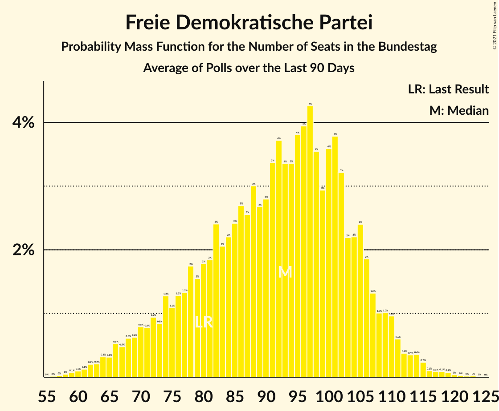

| Number of Seats | Probability | Accumulated | Special Marks |
|:---------------:|:-----------:|:-----------:|:-------------:|
| 52 | 0% | 100% |  |
| 53 | 0.1% | 99.9% |  |
| 54 | 0.1% | 99.9% |  |
| 55 | 0.1% | 99.8% |  |
| 56 | 0.2% | 99.6% |  |
| 57 | 0.3% | 99.4% |  |
| 58 | 0.5% | 99.1% |  |
| 59 | 0.5% | 98.7% |  |
| 60 | 0.8% | 98% |  |
| 61 | 0.9% | 97% |  |
| 62 | 1.1% | 96% |  |
| 63 | 1.4% | 95% |  |
| 64 | 2% | 94% |  |
| 65 | 2% | 92% |  |
| 66 | 2% | 91% |  |
| 67 | 2% | 88% |  |
| 68 | 3% | 86% |  |
| 69 | 3% | 83% |  |
| 70 | 3% | 81% |  |
| 71 | 3% | 78% |  |
| 72 | 3% | 74% |  |
| 73 | 3% | 71% |  |
| 74 | 3% | 68% |  |
| 75 | 4% | 65% |  |
| 76 | 3% | 61% |  |
| 77 | 3% | 58% |  |
| 78 | 4% | 55% |  |
| 79 | 3% | 51% | Median |
| 80 | 3% | 48% | Last Result |
| 81 | 3% | 45% |  |
| 82 | 3% | 42% |  |
| 83 | 3% | 39% |  |
| 84 | 3% | 36% |  |
| 85 | 3% | 33% |  |
| 86 | 3% | 30% |  |
| 87 | 3% | 28% |  |
| 88 | 3% | 25% |  |
| 89 | 2% | 22% |  |
| 90 | 2% | 20% |  |
| 91 | 2% | 17% |  |
| 92 | 2% | 15% |  |
| 93 | 2% | 13% |  |
| 94 | 2% | 11% |  |
| 95 | 2% | 10% |  |
| 96 | 1.3% | 8% |  |
| 97 | 1.2% | 7% |  |
| 98 | 1.2% | 6% |  |
| 99 | 0.9% | 5% |  |
| 100 | 0.7% | 4% |  |
| 101 | 0.6% | 3% |  |
| 102 | 0.6% | 2% |  |
| 103 | 0.4% | 2% |  |
| 104 | 0.4% | 1.5% |  |
| 105 | 0.3% | 1.1% |  |
| 106 | 0.2% | 0.8% |  |
| 107 | 0.2% | 0.7% |  |
| 108 | 0.1% | 0.5% |  |
| 109 | 0.1% | 0.4% |  |
| 110 | 0.1% | 0.3% |  |
| 111 | 0.1% | 0.2% |  |
| 112 | 0% | 0.1% |  |
| 113 | 0% | 0.1% |  |
| 114 | 0% | 0.1% |  |
| 115 | 0% | 0% |  |

### Die Linke

*For a full overview of the results for this party, see the [Die Linke](party-dielinke.html) page.*

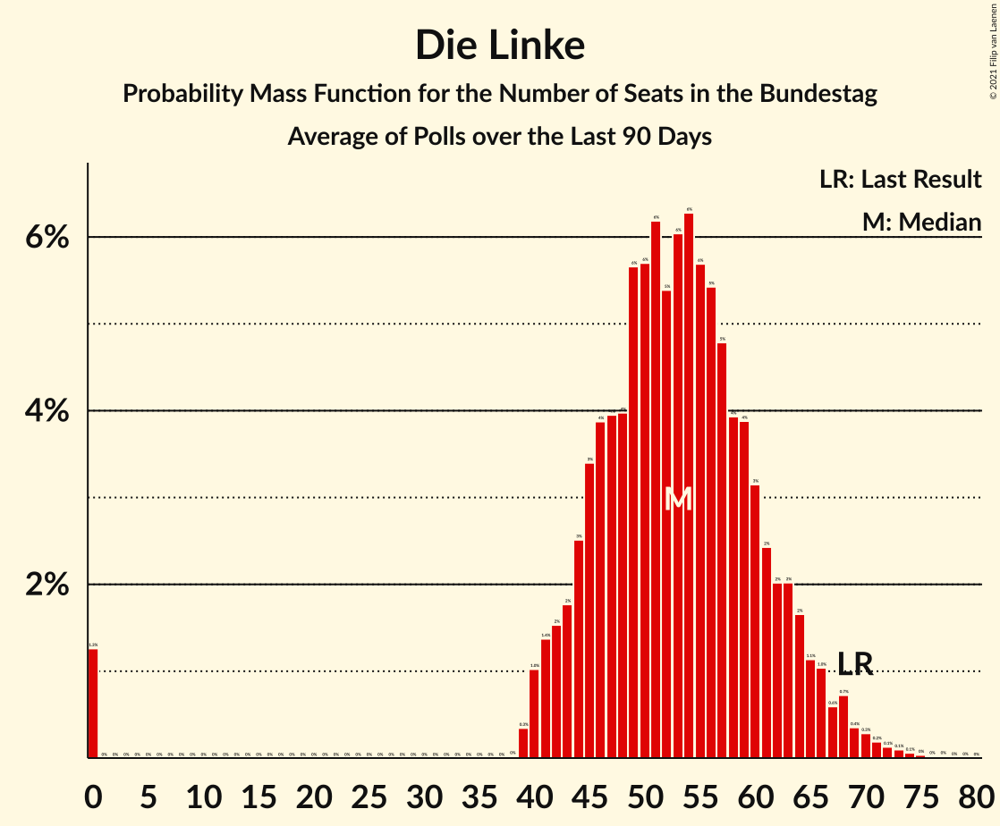

| Number of Seats | Probability | Accumulated | Special Marks |
|:---------------:|:-----------:|:-----------:|:-------------:|
| 0 | 0.1% | 100% |  |
| 1 | 0% | 99.9% |  |
| 2 | 0% | 99.9% |  |
| 3 | 0% | 99.9% |  |
| 4 | 0% | 99.9% |  |
| 5 | 0% | 99.9% |  |
| 6 | 0% | 99.9% |  |
| 7 | 0% | 99.9% |  |
| 8 | 0% | 99.9% |  |
| 9 | 0% | 99.9% |  |
| 10 | 0% | 99.9% |  |
| 11 | 0% | 99.9% |  |
| 12 | 0% | 99.9% |  |
| 13 | 0% | 99.9% |  |
| 14 | 0% | 99.9% |  |
| 15 | 0% | 99.9% |  |
| 16 | 0% | 99.9% |  |
| 17 | 0% | 99.9% |  |
| 18 | 0% | 99.9% |  |
| 19 | 0% | 99.9% |  |
| 20 | 0% | 99.9% |  |
| 21 | 0% | 99.9% |  |
| 22 | 0% | 99.9% |  |
| 23 | 0% | 99.9% |  |
| 24 | 0% | 99.9% |  |
| 25 | 0% | 99.9% |  |
| 26 | 0% | 99.9% |  |
| 27 | 0% | 99.9% |  |
| 28 | 0% | 99.9% |  |
| 29 | 0% | 99.9% |  |
| 30 | 0% | 99.9% |  |
| 31 | 0% | 99.9% |  |
| 32 | 0% | 99.9% |  |
| 33 | 0% | 99.9% |  |
| 34 | 0% | 99.9% |  |
| 35 | 0% | 99.9% |  |
| 36 | 0% | 99.9% |  |
| 37 | 0% | 99.9% |  |
| 38 | 0% | 99.9% |  |
| 39 | 0.1% | 99.9% |  |
| 40 | 0.1% | 99.8% |  |
| 41 | 0.3% | 99.7% |  |
| 42 | 0.4% | 99.4% |  |
| 43 | 0.7% | 99.0% |  |
| 44 | 1.0% | 98% |  |
| 45 | 1.3% | 97% |  |
| 46 | 2% | 96% |  |
| 47 | 2% | 94% |  |
| 48 | 3% | 92% |  |
| 49 | 4% | 90% |  |
| 50 | 3% | 86% |  |
| 51 | 5% | 82% |  |
| 52 | 5% | 77% |  |
| 53 | 6% | 72% |  |
| 54 | 5% | 66% |  |
| 55 | 6% | 61% |  |
| 56 | 6% | 54% | Median |
| 57 | 5% | 49% |  |
| 58 | 5% | 43% |  |
| 59 | 6% | 38% |  |
| 60 | 5% | 32% |  |
| 61 | 5% | 28% |  |
| 62 | 4% | 22% |  |
| 63 | 4% | 18% |  |
| 64 | 3% | 14% |  |
| 65 | 2% | 12% |  |
| 66 | 2% | 9% |  |
| 67 | 2% | 7% |  |
| 68 | 1.3% | 6% |  |
| 69 | 1.1% | 4% | Last Result |
| 70 | 0.9% | 3% |  |
| 71 | 0.6% | 2% |  |
| 72 | 0.5% | 2% |  |
| 73 | 0.3% | 1.2% |  |
| 74 | 0.3% | 0.8% |  |
| 75 | 0.2% | 0.6% |  |
| 76 | 0.1% | 0.4% |  |
| 77 | 0.1% | 0.3% |  |
| 78 | 0.1% | 0.2% |  |
| 79 | 0% | 0.1% |  |
| 80 | 0% | 0.1% |  |
| 81 | 0% | 0.1% |  |
| 82 | 0% | 0% |  |

### Bündnis 90/Die Grünen

*For a full overview of the results for this party, see the [Bündnis 90/Die Grünen](party-bündnis90diegrünen.html) page.*

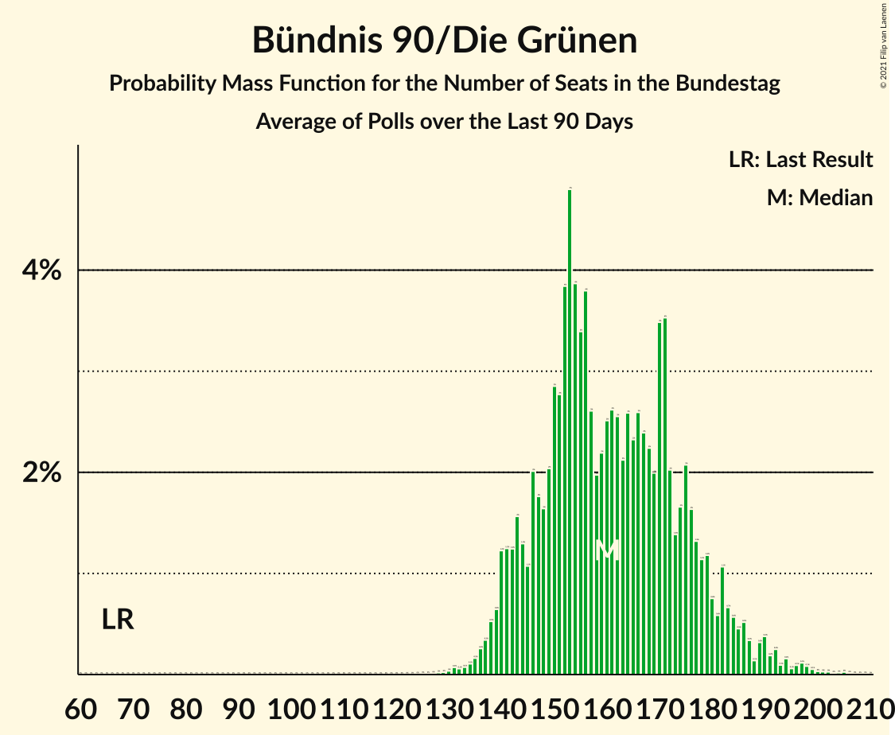

| Number of Seats | Probability | Accumulated | Special Marks |
|:---------------:|:-----------:|:-----------:|:-------------:|
| 67 | 0% | 100% | Last Result |
| 68 | 0% | 100% |  |
| 69 | 0% | 100% |  |
| 70 | 0% | 100% |  |
| 71 | 0% | 100% |  |
| 72 | 0% | 100% |  |
| 73 | 0% | 100% |  |
| 74 | 0% | 100% |  |
| 75 | 0% | 100% |  |
| 76 | 0% | 100% |  |
| 77 | 0% | 100% |  |
| 78 | 0% | 100% |  |
| 79 | 0% | 100% |  |
| 80 | 0% | 100% |  |
| 81 | 0% | 100% |  |
| 82 | 0% | 100% |  |
| 83 | 0% | 100% |  |
| 84 | 0% | 100% |  |
| 85 | 0% | 100% |  |
| 86 | 0% | 100% |  |
| 87 | 0% | 100% |  |
| 88 | 0% | 100% |  |
| 89 | 0% | 100% |  |
| 90 | 0% | 100% |  |
| 91 | 0% | 100% |  |
| 92 | 0% | 100% |  |
| 93 | 0% | 100% |  |
| 94 | 0% | 100% |  |
| 95 | 0% | 100% |  |
| 96 | 0% | 100% |  |
| 97 | 0% | 100% |  |
| 98 | 0% | 100% |  |
| 99 | 0% | 100% |  |
| 100 | 0% | 100% |  |
| 101 | 0% | 100% |  |
| 102 | 0% | 100% |  |
| 103 | 0% | 100% |  |
| 104 | 0% | 100% |  |
| 105 | 0% | 100% |  |
| 106 | 0% | 100% |  |
| 107 | 0% | 100% |  |
| 108 | 0% | 100% |  |
| 109 | 0% | 100% |  |
| 110 | 0% | 100% |  |
| 111 | 0% | 100% |  |
| 112 | 0% | 100% |  |
| 113 | 0% | 100% |  |
| 114 | 0% | 100% |  |
| 115 | 0% | 100% |  |
| 116 | 0% | 100% |  |
| 117 | 0% | 100% |  |
| 118 | 0% | 100% |  |
| 119 | 0% | 100% |  |
| 120 | 0% | 100% |  |
| 121 | 0% | 100% |  |
| 122 | 0% | 100% |  |
| 123 | 0% | 100% |  |
| 124 | 0% | 100% |  |
| 125 | 0% | 100% |  |
| 126 | 0% | 100% |  |
| 127 | 0% | 100% |  |
| 128 | 0% | 100% |  |
| 129 | 0% | 100% |  |
| 130 | 0% | 100% |  |
| 131 | 0% | 100% |  |
| 132 | 0% | 100% |  |
| 133 | 0% | 100% |  |
| 134 | 0% | 100% |  |
| 135 | 0% | 99.9% |  |
| 136 | 0.1% | 99.9% |  |
| 137 | 0.1% | 99.8% |  |
| 138 | 0.1% | 99.8% |  |
| 139 | 0.1% | 99.7% |  |
| 140 | 0.2% | 99.6% |  |
| 141 | 0.2% | 99.4% |  |
| 142 | 0.3% | 99.2% |  |
| 143 | 0.3% | 98.9% |  |
| 144 | 0.4% | 98.6% |  |
| 145 | 0.6% | 98% |  |
| 146 | 0.7% | 98% |  |
| 147 | 0.8% | 97% |  |
| 148 | 1.1% | 96% |  |
| 149 | 1.2% | 95% |  |
| 150 | 1.5% | 94% |  |
| 151 | 1.4% | 92% |  |
| 152 | 2% | 91% |  |
| 153 | 2% | 89% |  |
| 154 | 2% | 87% |  |
| 155 | 2% | 85% |  |
| 156 | 2% | 83% |  |
| 157 | 2% | 80% |  |
| 158 | 3% | 78% |  |
| 159 | 3% | 75% |  |
| 160 | 3% | 72% |  |
| 161 | 3% | 69% |  |
| 162 | 3% | 66% |  |
| 163 | 3% | 63% |  |
| 164 | 2% | 60% |  |
| 165 | 3% | 58% |  |
| 166 | 2% | 55% |  |
| 167 | 2% | 53% |  |
| 168 | 2% | 51% | Median |
| 169 | 2% | 48% |  |
| 170 | 2% | 47% |  |
| 171 | 2% | 45% |  |
| 172 | 3% | 42% |  |
| 173 | 2% | 40% |  |
| 174 | 1.4% | 38% |  |
| 175 | 1.1% | 36% |  |
| 176 | 1.2% | 35% |  |
| 177 | 1.1% | 34% |  |
| 178 | 1.0% | 33% |  |
| 179 | 0.9% | 32% |  |
| 180 | 0.6% | 31% |  |
| 181 | 0.5% | 30% |  |
| 182 | 0.5% | 30% |  |
| 183 | 0.9% | 29% |  |
| 184 | 1.0% | 29% |  |
| 185 | 0.8% | 28% |  |
| 186 | 0.3% | 27% |  |
| 187 | 0.3% | 26% |  |
| 188 | 0.2% | 26% |  |
| 189 | 0.3% | 26% |  |
| 190 | 0.2% | 26% |  |
| 191 | 0.2% | 25% |  |
| 192 | 0.2% | 25% |  |
| 193 | 0.2% | 25% |  |
| 194 | 0.3% | 25% |  |
| 195 | 0.4% | 24% |  |
| 196 | 0.3% | 24% |  |
| 197 | 0.4% | 24% |  |
| 198 | 0.2% | 23% |  |
| 199 | 0.4% | 23% |  |
| 200 | 0.5% | 23% |  |
| 201 | 0.4% | 22% |  |
| 202 | 0.8% | 22% |  |
| 203 | 0.5% | 21% |  |
| 204 | 0.9% | 21% |  |
| 205 | 0.8% | 20% |  |
| 206 | 0.6% | 19% |  |
| 207 | 0.9% | 18% |  |
| 208 | 0.6% | 17% |  |
| 209 | 1.0% | 17% |  |
| 210 | 0.9% | 16% |  |
| 211 | 0.9% | 15% |  |
| 212 | 1.4% | 14% |  |
| 213 | 0.7% | 12% |  |
| 214 | 1.2% | 12% |  |
| 215 | 1.0% | 11% |  |
| 216 | 0.5% | 10% |  |
| 217 | 0.9% | 9% |  |
| 218 | 0.6% | 8% |  |
| 219 | 1.3% | 8% |  |
| 220 | 1.0% | 6% |  |
| 221 | 0.7% | 5% |  |
| 222 | 0.8% | 5% |  |
| 223 | 0.4% | 4% |  |
| 224 | 0.5% | 3% |  |
| 225 | 0.4% | 3% |  |
| 226 | 0.3% | 2% |  |
| 227 | 0.3% | 2% |  |
| 228 | 0.3% | 2% |  |
| 229 | 0.2% | 1.5% |  |
| 230 | 0.2% | 1.2% |  |
| 231 | 0.2% | 1.1% |  |
| 232 | 0.2% | 0.9% |  |
| 233 | 0.1% | 0.7% |  |
| 234 | 0.1% | 0.6% |  |
| 235 | 0.1% | 0.5% |  |
| 236 | 0.1% | 0.4% |  |
| 237 | 0.1% | 0.3% |  |
| 238 | 0% | 0.2% |  |
| 239 | 0.1% | 0.2% |  |
| 240 | 0% | 0.1% |  |
| 241 | 0% | 0.1% |  |
| 242 | 0% | 0.1% |  |
| 243 | 0% | 0.1% |  |
| 244 | 0% | 0% |  |

### Christlich-Soziale Union in Bayern

*For a full overview of the results for this party, see the [Christlich-Soziale Union in Bayern](party-christlich-sozialeunioninbayern.html) page.*

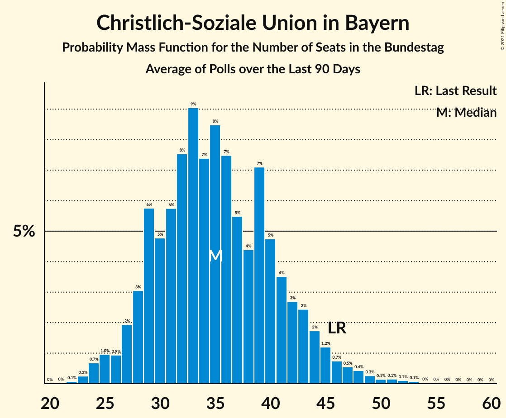

| Number of Seats | Probability | Accumulated | Special Marks |
|:---------------:|:-----------:|:-----------:|:-------------:|
| 20 | 0.1% | 100% |  |
| 21 | 0.1% | 99.9% |  |
| 22 | 0.2% | 99.8% |  |
| 23 | 0.4% | 99.6% |  |
| 24 | 0.5% | 99.2% |  |
| 25 | 0.7% | 98.7% |  |
| 26 | 1.1% | 98% |  |
| 27 | 1.4% | 97% |  |
| 28 | 2% | 95% |  |
| 29 | 2% | 94% |  |
| 30 | 3% | 91% |  |
| 31 | 4% | 89% |  |
| 32 | 4% | 85% |  |
| 33 | 4% | 81% |  |
| 34 | 5% | 77% |  |
| 35 | 5% | 72% |  |
| 36 | 6% | 67% |  |
| 37 | 7% | 60% |  |
| 38 | 7% | 53% | Median |
| 39 | 6% | 46% |  |
| 40 | 6% | 41% |  |
| 41 | 6% | 34% |  |
| 42 | 5% | 28% |  |
| 43 | 4% | 23% |  |
| 44 | 4% | 18% |  |
| 45 | 3% | 15% |  |
| 46 | 3% | 12% | Last Result |
| 47 | 2% | 9% |  |
| 48 | 2% | 7% |  |
| 49 | 1.4% | 5% |  |
| 50 | 0.9% | 3% |  |
| 51 | 0.8% | 3% |  |
| 52 | 0.6% | 2% |  |
| 53 | 0.4% | 1.1% |  |
| 54 | 0.2% | 0.7% |  |
| 55 | 0.2% | 0.5% |  |
| 56 | 0.1% | 0.3% |  |
| 57 | 0.1% | 0.2% |  |
| 58 | 0.1% | 0.1% |  |
| 59 | 0% | 0.1% |  |
| 60 | 0% | 0% |  |

## Coalitions

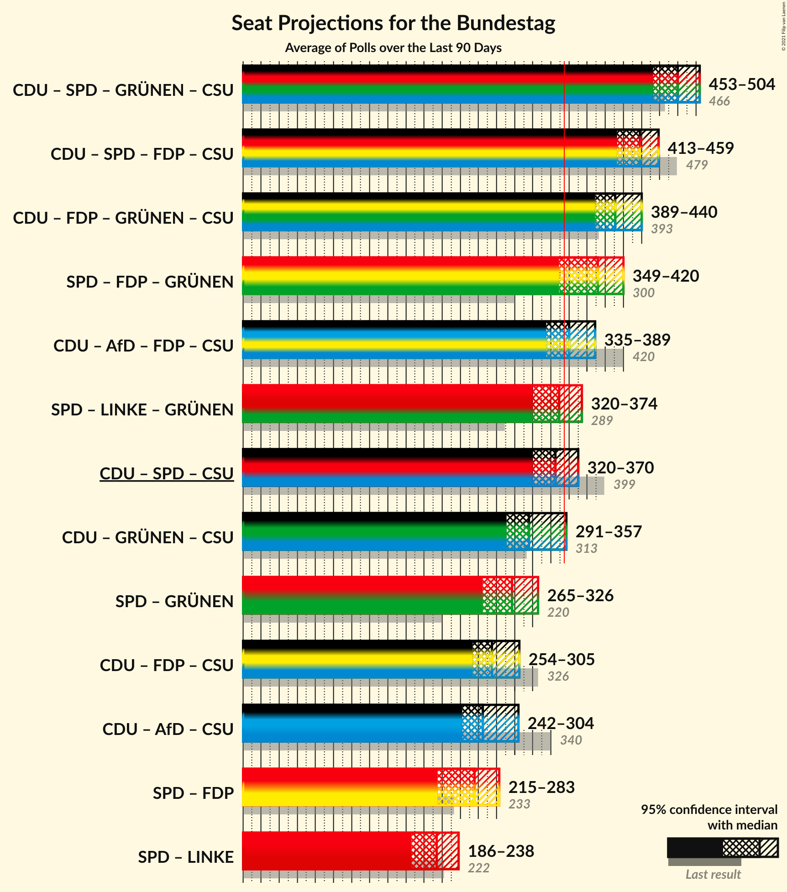

### Confidence Intervals

| Coalition | Last Result | Median | Majority? | 80% Confidence Interval | 90% Confidence Interval | 95% Confidence Interval | 99% Confidence Interval |
|:---------:|:-----------:|:------:|:---------:|:-----------------------:|:-----------------------:|:-----------------------:|:-----------------------:|
| Christlich Demokratische Union Deutschlands – Sozialdemokratische Partei Deutschlands – Bündnis 90/Die Grünen – Christlich-Soziale Union in Bayern | 466 | 491 | 100% | 471–514 | 466–518 | 462–522 | 454–529 |
| Christlich Demokratische Union Deutschlands – Freie Demokratische Partei – Bündnis 90/Die Grünen – Christlich-Soziale Union in Bayern | 393 | 456 | 100% | 433–481 | 429–486 | 425–491 | 417–499 |
| Christlich Demokratische Union Deutschlands – Sozialdemokratische Partei Deutschlands – Freie Demokratische Partei – Christlich-Soziale Union in Bayern | 479 | 402 | 93% | 359–419 | 351–424 | 345–428 | 336–435 |
| Christlich Demokratische Union Deutschlands – Bündnis 90/Die Grünen – Christlich-Soziale Union in Bayern | 313 | 374 | 85% | 350–410 | 344–417 | 339–422 | 330–432 |
| Sozialdemokratische Partei Deutschlands – Freie Demokratische Partei – Bündnis 90/Die Grünen | 300 | 369 | 77% | 341–402 | 333–411 | 327–417 | 317–427 |
| Christlich Demokratische Union Deutschlands – Alternative für Deutschland – Freie Demokratische Partei – Christlich-Soziale Union in Bayern | 420 | 360 | 62% | 338–389 | 332–395 | 328–400 | 319–408 |
| Sozialdemokratische Partei Deutschlands – Die Linke – Bündnis 90/Die Grünen | 289 | 349 | 38% | 320–371 | 314–377 | 309–381 | 301–390 |
| Christlich Demokratische Union Deutschlands – Sozialdemokratische Partei Deutschlands – Christlich-Soziale Union in Bayern | 399 | 322 | 2% | 272–344 | 260–350 | 253–354 | 244–362 |
| Christlich Demokratische Union Deutschlands – Alternative für Deutschland – Christlich-Soziale Union in Bayern | 340 | 282 | 0% | 250–314 | 243–323 | 238–329 | 229–339 |
| Sozialdemokratische Partei Deutschlands – Bündnis 90/Die Grünen | 220 | 290 | 0% | 267–316 | 261–322 | 256–326 | 248–336 |
| Christlich Demokratische Union Deutschlands – Freie Demokratische Partei – Christlich-Soziale Union in Bayern | 326 | 280 | 0% | 256–305 | 249–311 | 245–315 | 236–324 |
| Sozialdemokratische Partei Deutschlands – Freie Demokratische Partei | 233 | 197 | 0% | 168–216 | 162–222 | 158–227 | 150–236 |
| Sozialdemokratische Partei Deutschlands – Die Linke | 222 | 172 | 0% | 149–193 | 145–197 | 142–200 | 135–207 |

### Christlich Demokratische Union Deutschlands – Sozialdemokratische Partei Deutschlands – Bündnis 90/Die Grünen – Christlich-Soziale Union in Bayern

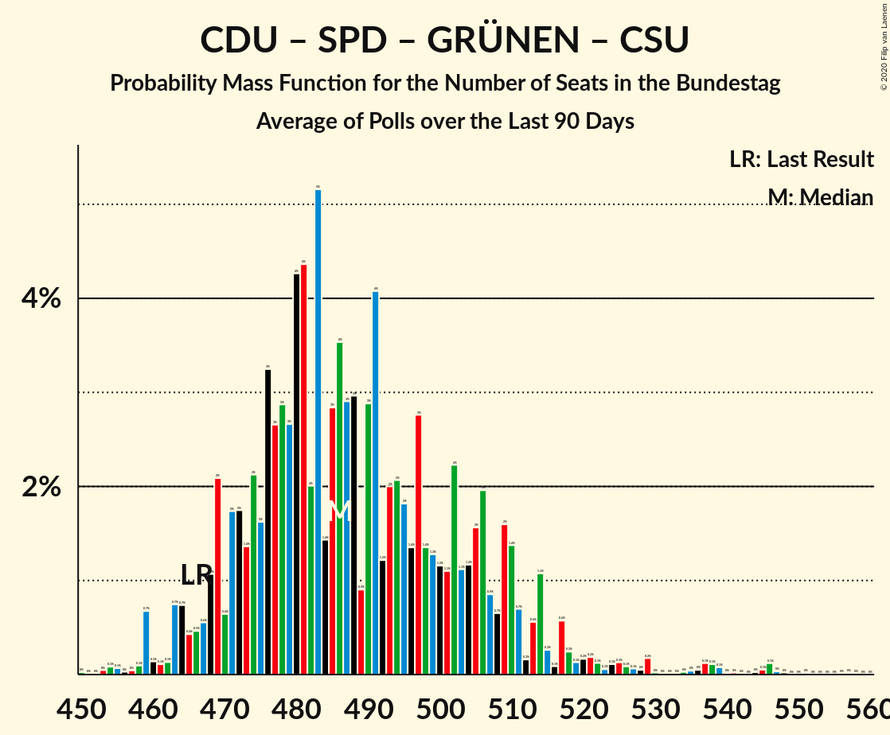

| Number of Seats | Probability | Accumulated | Special Marks |
|:---------------:|:-----------:|:-----------:|:-------------:|
| 446 | 0% | 100% |  |
| 447 | 0% | 99.9% |  |
| 448 | 0% | 99.9% |  |
| 449 | 0% | 99.9% |  |
| 450 | 0% | 99.8% |  |
| 451 | 0.1% | 99.8% |  |
| 452 | 0.1% | 99.7% |  |
| 453 | 0.1% | 99.7% |  |
| 454 | 0.1% | 99.6% |  |
| 455 | 0.2% | 99.5% |  |
| 456 | 0.1% | 99.3% |  |
| 457 | 0.2% | 99.2% |  |
| 458 | 0.2% | 99.0% |  |
| 459 | 0.3% | 98.8% |  |
| 460 | 0.3% | 98% |  |
| 461 | 0.4% | 98% |  |
| 462 | 0.6% | 98% |  |
| 463 | 0.6% | 97% |  |
| 464 | 0.5% | 97% |  |
| 465 | 0.6% | 96% |  |
| 466 | 0.8% | 95% | Last Result |
| 467 | 0.8% | 95% |  |
| 468 | 1.0% | 94% |  |
| 469 | 0.9% | 93% |  |
| 470 | 1.1% | 92% |  |
| 471 | 1.3% | 91% |  |
| 472 | 1.3% | 89% |  |
| 473 | 1.4% | 88% |  |
| 474 | 1.4% | 87% |  |
| 475 | 2% | 85% |  |
| 476 | 2% | 83% |  |
| 477 | 2% | 82% |  |
| 478 | 2% | 80% |  |
| 479 | 2% | 78% |  |
| 480 | 2% | 76% |  |
| 481 | 2% | 74% |  |
| 482 | 2% | 72% |  |
| 483 | 2% | 69% |  |
| 484 | 2% | 68% |  |
| 485 | 2% | 66% |  |
| 486 | 2% | 63% |  |
| 487 | 2% | 61% | Median |
| 488 | 3% | 59% |  |
| 489 | 2% | 56% |  |
| 490 | 2% | 54% |  |
| 491 | 3% | 52% |  |
| 492 | 2% | 49% |  |
| 493 | 2% | 47% |  |
| 494 | 2% | 45% |  |
| 495 | 2% | 42% |  |
| 496 | 2% | 40% |  |
| 497 | 2% | 38% |  |
| 498 | 2% | 36% |  |
| 499 | 2% | 34% |  |
| 500 | 2% | 32% |  |
| 501 | 2% | 30% |  |
| 502 | 2% | 28% |  |
| 503 | 2% | 27% |  |
| 504 | 2% | 25% |  |
| 505 | 1.3% | 23% |  |
| 506 | 2% | 22% |  |
| 507 | 2% | 20% |  |
| 508 | 2% | 19% |  |
| 509 | 1.3% | 17% |  |
| 510 | 2% | 16% |  |
| 511 | 1.1% | 14% |  |
| 512 | 1.1% | 13% |  |
| 513 | 1.4% | 12% |  |
| 514 | 1.2% | 10% |  |
| 515 | 1.1% | 9% |  |
| 516 | 1.1% | 8% |  |
| 517 | 1.1% | 7% |  |
| 518 | 0.9% | 6% |  |
| 519 | 0.7% | 5% |  |
| 520 | 0.7% | 4% |  |
| 521 | 0.6% | 3% |  |
| 522 | 0.5% | 3% |  |
| 523 | 0.4% | 2% |  |
| 524 | 0.4% | 2% |  |
| 525 | 0.3% | 2% |  |
| 526 | 0.2% | 1.3% |  |
| 527 | 0.2% | 1.0% |  |
| 528 | 0.2% | 0.8% |  |
| 529 | 0.1% | 0.6% |  |
| 530 | 0.1% | 0.5% |  |
| 531 | 0.1% | 0.4% |  |
| 532 | 0.1% | 0.3% |  |
| 533 | 0% | 0.2% |  |
| 534 | 0% | 0.2% |  |
| 535 | 0% | 0.1% |  |
| 536 | 0% | 0.1% |  |
| 537 | 0% | 0.1% |  |
| 538 | 0% | 0.1% |  |
| 539 | 0% | 0.1% |  |
| 540 | 0% | 0% |  |

### Christlich Demokratische Union Deutschlands – Freie Demokratische Partei – Bündnis 90/Die Grünen – Christlich-Soziale Union in Bayern

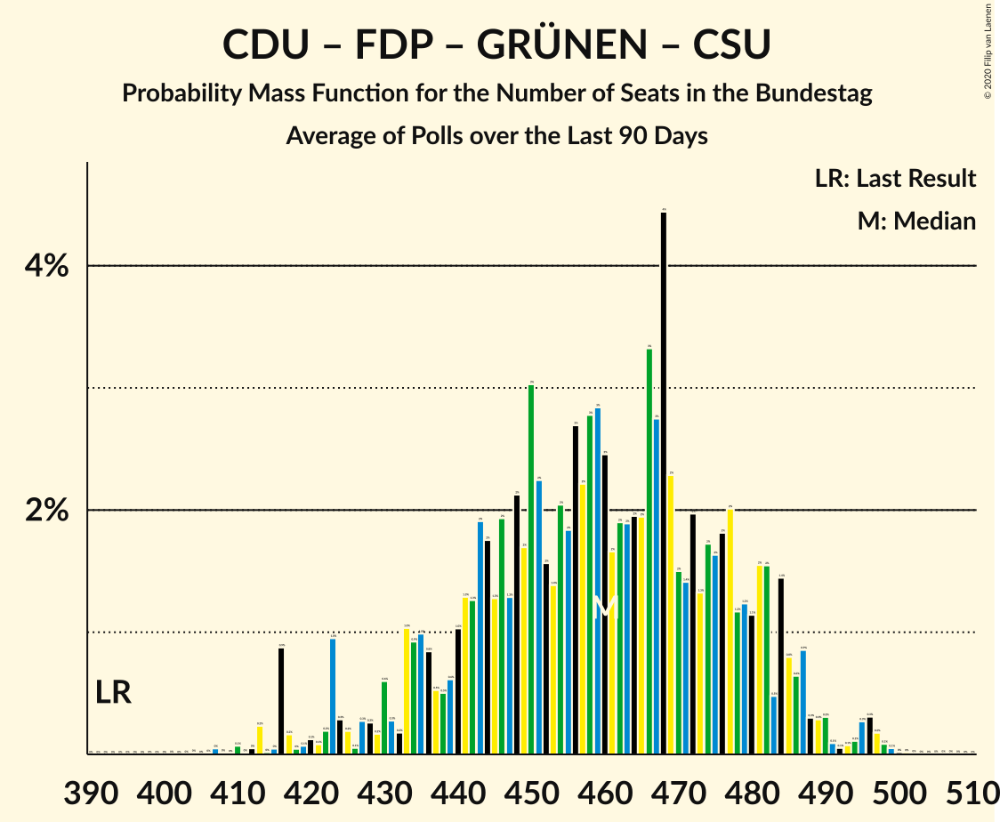

| Number of Seats | Probability | Accumulated | Special Marks |
|:---------------:|:-----------:|:-----------:|:-------------:|
| 393 | 0% | 100% | Last Result |
| 394 | 0% | 100% |  |
| 395 | 0% | 100% |  |
| 396 | 0% | 100% |  |
| 397 | 0% | 100% |  |
| 398 | 0% | 100% |  |
| 399 | 0% | 100% |  |
| 400 | 0% | 100% |  |
| 401 | 0% | 100% |  |
| 402 | 0% | 100% |  |
| 403 | 0% | 100% |  |
| 404 | 0% | 100% |  |
| 405 | 0% | 100% |  |
| 406 | 0% | 100% |  |
| 407 | 0% | 100% |  |
| 408 | 0% | 100% |  |
| 409 | 0% | 99.9% |  |
| 410 | 0% | 99.9% |  |
| 411 | 0% | 99.9% |  |
| 412 | 0% | 99.9% |  |
| 413 | 0.1% | 99.9% |  |
| 414 | 0.1% | 99.8% |  |
| 415 | 0.1% | 99.7% |  |
| 416 | 0.1% | 99.7% |  |
| 417 | 0.1% | 99.6% |  |
| 418 | 0.1% | 99.5% |  |
| 419 | 0.1% | 99.4% |  |
| 420 | 0.2% | 99.2% |  |
| 421 | 0.2% | 99.0% |  |
| 422 | 0.4% | 98.8% |  |
| 423 | 0.4% | 98% |  |
| 424 | 0.4% | 98% |  |
| 425 | 0.6% | 98% |  |
| 426 | 0.5% | 97% |  |
| 427 | 0.6% | 96% |  |
| 428 | 0.7% | 96% |  |
| 429 | 0.7% | 95% |  |
| 430 | 0.8% | 94% |  |
| 431 | 1.3% | 94% |  |
| 432 | 1.1% | 92% |  |
| 433 | 1.5% | 91% |  |
| 434 | 1.4% | 90% |  |
| 435 | 2% | 88% |  |
| 436 | 1.3% | 87% |  |
| 437 | 1.5% | 85% |  |
| 438 | 2% | 84% |  |
| 439 | 2% | 82% |  |
| 440 | 2% | 80% |  |
| 441 | 2% | 79% |  |
| 442 | 2% | 77% |  |
| 443 | 2% | 75% |  |
| 444 | 2% | 73% |  |
| 445 | 2% | 71% |  |
| 446 | 2% | 70% |  |
| 447 | 2% | 68% |  |
| 448 | 2% | 66% |  |
| 449 | 2% | 64% |  |
| 450 | 2% | 63% | Median |
| 451 | 2% | 61% |  |
| 452 | 2% | 58% |  |
| 453 | 2% | 57% |  |
| 454 | 2% | 55% |  |
| 455 | 2% | 53% |  |
| 456 | 2% | 52% |  |
| 457 | 2% | 50% |  |
| 458 | 2% | 47% |  |
| 459 | 1.4% | 45% |  |
| 460 | 2% | 44% |  |
| 461 | 3% | 42% |  |
| 462 | 2% | 39% |  |
| 463 | 1.4% | 37% |  |
| 464 | 2% | 36% |  |
| 465 | 2% | 34% |  |
| 466 | 2% | 32% |  |
| 467 | 2% | 30% |  |
| 468 | 2% | 28% |  |
| 469 | 2% | 27% |  |
| 470 | 2% | 25% |  |
| 471 | 2% | 23% |  |
| 472 | 1.4% | 21% |  |
| 473 | 1.1% | 20% |  |
| 474 | 1.5% | 19% |  |
| 475 | 2% | 17% |  |
| 476 | 1.5% | 16% |  |
| 477 | 1.0% | 14% |  |
| 478 | 1.0% | 13% |  |
| 479 | 1.1% | 12% |  |
| 480 | 1.0% | 11% |  |
| 481 | 0.9% | 10% |  |
| 482 | 0.9% | 9% |  |
| 483 | 0.9% | 8% |  |
| 484 | 0.9% | 7% |  |
| 485 | 0.9% | 6% |  |
| 486 | 0.6% | 5% |  |
| 487 | 0.5% | 5% |  |
| 488 | 0.6% | 4% |  |
| 489 | 0.4% | 4% |  |
| 490 | 0.5% | 3% |  |
| 491 | 0.5% | 3% |  |
| 492 | 0.5% | 2% |  |
| 493 | 0.3% | 2% |  |
| 494 | 0.3% | 2% |  |
| 495 | 0.2% | 1.3% |  |
| 496 | 0.2% | 1.1% |  |
| 497 | 0.2% | 0.9% |  |
| 498 | 0.1% | 0.8% |  |
| 499 | 0.1% | 0.6% |  |
| 500 | 0.1% | 0.5% |  |
| 501 | 0.1% | 0.4% |  |
| 502 | 0.1% | 0.3% |  |
| 503 | 0% | 0.2% |  |
| 504 | 0% | 0.2% |  |
| 505 | 0% | 0.1% |  |
| 506 | 0% | 0.1% |  |
| 507 | 0% | 0.1% |  |
| 508 | 0% | 0.1% |  |
| 509 | 0% | 0.1% |  |
| 510 | 0% | 0.1% |  |
| 511 | 0% | 0% |  |

### Christlich Demokratische Union Deutschlands – Sozialdemokratische Partei Deutschlands – Freie Demokratische Partei – Christlich-Soziale Union in Bayern

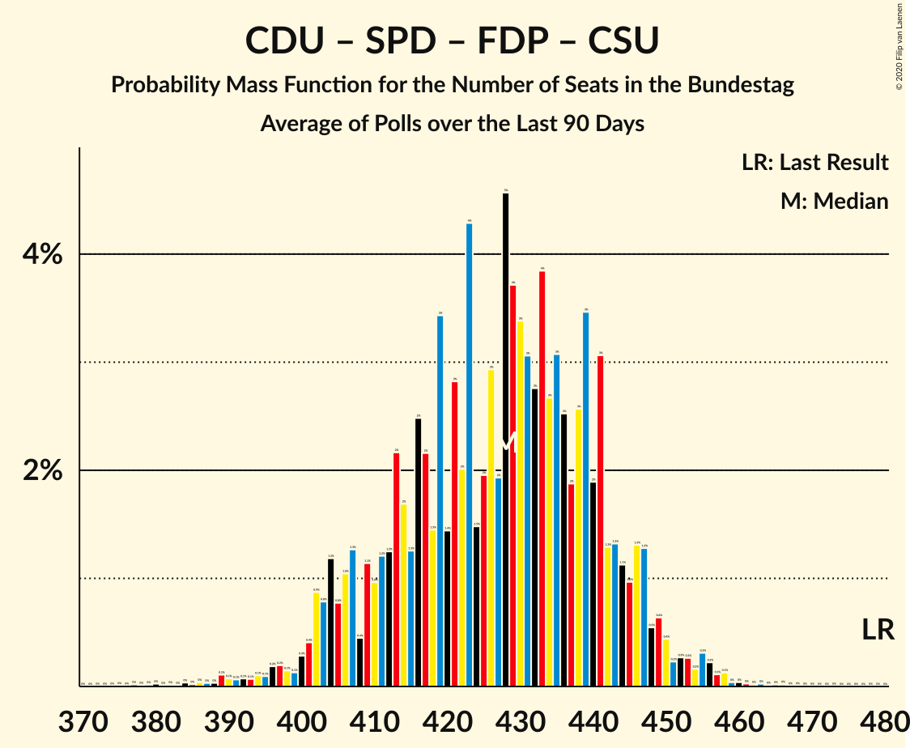

| Number of Seats | Probability | Accumulated | Special Marks |
|:---------------:|:-----------:|:-----------:|:-------------:|
| 326 | 0% | 100% |  |
| 327 | 0% | 99.9% |  |
| 328 | 0% | 99.9% |  |
| 329 | 0% | 99.9% |  |
| 330 | 0% | 99.9% |  |
| 331 | 0.1% | 99.8% |  |
| 332 | 0% | 99.8% |  |
| 333 | 0.1% | 99.7% |  |
| 334 | 0.1% | 99.7% |  |
| 335 | 0.1% | 99.6% |  |
| 336 | 0.1% | 99.5% |  |
| 337 | 0.1% | 99.4% |  |
| 338 | 0.1% | 99.3% |  |
| 339 | 0.2% | 99.2% |  |
| 340 | 0.2% | 99.0% |  |
| 341 | 0.2% | 98.8% |  |
| 342 | 0.3% | 98.6% |  |
| 343 | 0.2% | 98% |  |
| 344 | 0.3% | 98% |  |
| 345 | 0.4% | 98% |  |
| 346 | 0.4% | 97% |  |
| 347 | 0.4% | 97% |  |
| 348 | 0.5% | 97% |  |
| 349 | 0.4% | 96% |  |
| 350 | 0.6% | 96% |  |
| 351 | 0.5% | 95% |  |
| 352 | 0.8% | 95% |  |
| 353 | 0.4% | 94% |  |
| 354 | 0.6% | 93% |  |
| 355 | 0.7% | 93% | Majority |
| 356 | 0.8% | 92% |  |
| 357 | 0.6% | 91% |  |
| 358 | 0.6% | 91% |  |
| 359 | 0.8% | 90% |  |
| 360 | 0.6% | 89% |  |
| 361 | 0.7% | 89% |  |
| 362 | 1.0% | 88% |  |
| 363 | 0.8% | 87% |  |
| 364 | 0.5% | 86% |  |
| 365 | 0.8% | 86% |  |
| 366 | 0.7% | 85% |  |
| 367 | 0.7% | 84% |  |
| 368 | 0.8% | 84% |  |
| 369 | 0.8% | 83% |  |
| 370 | 0.4% | 82% |  |
| 371 | 0.5% | 82% |  |
| 372 | 1.0% | 81% |  |
| 373 | 0.7% | 80% |  |
| 374 | 0.4% | 79% |  |
| 375 | 0.5% | 79% |  |
| 376 | 0.4% | 78% |  |
| 377 | 0.5% | 78% |  |
| 378 | 0.7% | 78% |  |
| 379 | 0.8% | 77% |  |
| 380 | 0.4% | 76% |  |
| 381 | 0.6% | 76% |  |
| 382 | 0.8% | 75% |  |
| 383 | 0.6% | 74% |  |
| 384 | 0.8% | 74% |  |
| 385 | 0.6% | 73% |  |
| 386 | 0.8% | 72% |  |
| 387 | 0.8% | 72% |  |
| 388 | 1.1% | 71% |  |
| 389 | 1.0% | 70% |  |
| 390 | 1.0% | 69% |  |
| 391 | 1.1% | 68% |  |
| 392 | 1.0% | 67% |  |
| 393 | 1.2% | 66% |  |
| 394 | 2% | 64% |  |
| 395 | 1.2% | 63% |  |
| 396 | 1.4% | 62% |  |
| 397 | 1.3% | 60% |  |
| 398 | 2% | 59% | Median |
| 399 | 2% | 57% |  |
| 400 | 2% | 55% |  |
| 401 | 2% | 53% |  |
| 402 | 2% | 51% |  |
| 403 | 2% | 49% |  |
| 404 | 2% | 47% |  |
| 405 | 3% | 44% |  |
| 406 | 3% | 42% |  |
| 407 | 2% | 39% |  |
| 408 | 3% | 37% |  |
| 409 | 3% | 34% |  |
| 410 | 3% | 31% |  |
| 411 | 2% | 28% |  |
| 412 | 3% | 26% |  |
| 413 | 2% | 24% |  |
| 414 | 3% | 22% |  |
| 415 | 2% | 19% |  |
| 416 | 2% | 17% |  |
| 417 | 2% | 15% |  |
| 418 | 2% | 13% |  |
| 419 | 2% | 11% |  |
| 420 | 1.3% | 10% |  |
| 421 | 1.4% | 9% |  |
| 422 | 1.1% | 7% |  |
| 423 | 0.9% | 6% |  |
| 424 | 0.9% | 5% |  |
| 425 | 0.7% | 4% |  |
| 426 | 0.5% | 4% |  |
| 427 | 0.5% | 3% |  |
| 428 | 0.5% | 3% |  |
| 429 | 0.4% | 2% |  |
| 430 | 0.3% | 2% |  |
| 431 | 0.3% | 1.3% |  |
| 432 | 0.2% | 1.1% |  |
| 433 | 0.2% | 0.8% |  |
| 434 | 0.1% | 0.7% |  |
| 435 | 0.1% | 0.5% |  |
| 436 | 0.1% | 0.4% |  |
| 437 | 0.1% | 0.3% |  |
| 438 | 0.1% | 0.2% |  |
| 439 | 0% | 0.2% |  |
| 440 | 0% | 0.2% |  |
| 441 | 0% | 0.1% |  |
| 442 | 0% | 0.1% |  |
| 443 | 0% | 0.1% |  |
| 444 | 0% | 0.1% |  |
| 445 | 0% | 0% |  |
| 446 | 0% | 0% |  |
| 447 | 0% | 0% |  |
| 448 | 0% | 0% |  |
| 449 | 0% | 0% |  |
| 450 | 0% | 0% |  |
| 451 | 0% | 0% |  |
| 452 | 0% | 0% |  |
| 453 | 0% | 0% |  |
| 454 | 0% | 0% |  |
| 455 | 0% | 0% |  |
| 456 | 0% | 0% |  |
| 457 | 0% | 0% |  |
| 458 | 0% | 0% |  |
| 459 | 0% | 0% |  |
| 460 | 0% | 0% |  |
| 461 | 0% | 0% |  |
| 462 | 0% | 0% |  |
| 463 | 0% | 0% |  |
| 464 | 0% | 0% |  |
| 465 | 0% | 0% |  |
| 466 | 0% | 0% |  |
| 467 | 0% | 0% |  |
| 468 | 0% | 0% |  |
| 469 | 0% | 0% |  |
| 470 | 0% | 0% |  |
| 471 | 0% | 0% |  |
| 472 | 0% | 0% |  |
| 473 | 0% | 0% |  |
| 474 | 0% | 0% |  |
| 475 | 0% | 0% |  |
| 476 | 0% | 0% |  |
| 477 | 0% | 0% |  |
| 478 | 0% | 0% |  |
| 479 | 0% | 0% | Last Result |

### Christlich Demokratische Union Deutschlands – Bündnis 90/Die Grünen – Christlich-Soziale Union in Bayern

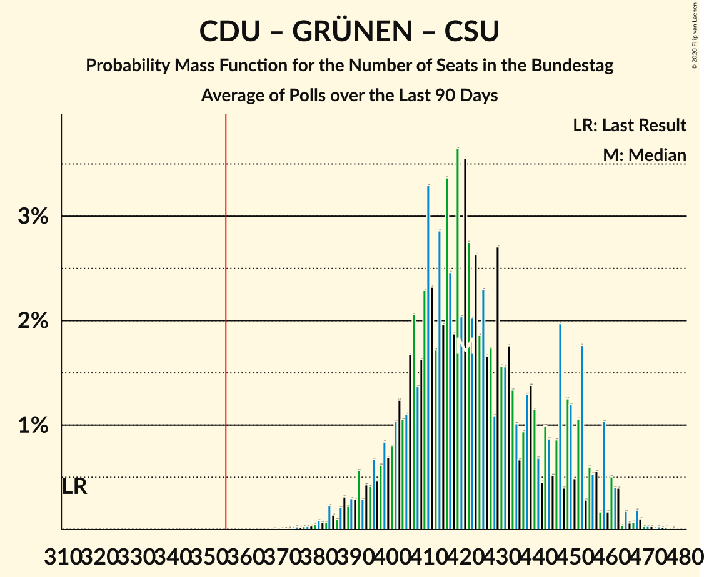

| Number of Seats | Probability | Accumulated | Special Marks |
|:---------------:|:-----------:|:-----------:|:-------------:|
| 313 | 0% | 100% | Last Result |
| 314 | 0% | 100% |  |
| 315 | 0% | 100% |  |
| 316 | 0% | 100% |  |
| 317 | 0% | 100% |  |
| 318 | 0% | 100% |  |
| 319 | 0% | 100% |  |
| 320 | 0% | 100% |  |
| 321 | 0% | 99.9% |  |
| 322 | 0% | 99.9% |  |
| 323 | 0% | 99.9% |  |
| 324 | 0% | 99.9% |  |
| 325 | 0% | 99.8% |  |
| 326 | 0.1% | 99.8% |  |
| 327 | 0.1% | 99.7% |  |
| 328 | 0.1% | 99.7% |  |
| 329 | 0.1% | 99.6% |  |
| 330 | 0.1% | 99.5% |  |
| 331 | 0.1% | 99.4% |  |
| 332 | 0.2% | 99.3% |  |
| 333 | 0.1% | 99.1% |  |
| 334 | 0.1% | 98.9% |  |
| 335 | 0.3% | 98.8% |  |
| 336 | 0.3% | 98.5% |  |
| 337 | 0.3% | 98% |  |
| 338 | 0.4% | 98% |  |
| 339 | 0.3% | 98% |  |
| 340 | 0.5% | 97% |  |
| 341 | 0.5% | 97% |  |
| 342 | 0.5% | 96% |  |
| 343 | 0.6% | 96% |  |
| 344 | 0.7% | 95% |  |
| 345 | 0.6% | 95% |  |
| 346 | 0.7% | 94% |  |
| 347 | 1.0% | 93% |  |
| 348 | 0.7% | 92% |  |
| 349 | 0.9% | 92% |  |
| 350 | 1.1% | 91% |  |
| 351 | 1.2% | 90% |  |
| 352 | 1.0% | 88% |  |
| 353 | 1.4% | 87% |  |
| 354 | 1.3% | 86% |  |
| 355 | 2% | 85% | Majority |
| 356 | 2% | 83% |  |
| 357 | 2% | 82% |  |
| 358 | 1.3% | 80% |  |
| 359 | 2% | 79% |  |
| 360 | 2% | 77% |  |
| 361 | 2% | 75% |  |
| 362 | 2% | 73% |  |
| 363 | 2% | 71% |  |
| 364 | 2% | 70% |  |
| 365 | 2% | 68% |  |
| 366 | 2% | 66% |  |
| 367 | 2% | 64% |  |
| 368 | 2% | 62% |  |
| 369 | 3% | 61% |  |
| 370 | 2% | 58% |  |
| 371 | 2% | 57% | Median |
| 372 | 2% | 55% |  |
| 373 | 2% | 53% |  |
| 374 | 2% | 52% |  |
| 375 | 2% | 50% |  |
| 376 | 2% | 48% |  |
| 377 | 1.4% | 46% |  |
| 378 | 2% | 45% |  |
| 379 | 1.4% | 43% |  |
| 380 | 2% | 41% |  |
| 381 | 2% | 40% |  |
| 382 | 1.4% | 38% |  |
| 383 | 1.2% | 37% |  |
| 384 | 1.3% | 35% |  |
| 385 | 1.5% | 34% |  |
| 386 | 1.3% | 33% |  |
| 387 | 1.1% | 31% |  |
| 388 | 1.3% | 30% |  |
| 389 | 1.4% | 29% |  |
| 390 | 1.1% | 27% |  |
| 391 | 1.2% | 26% |  |
| 392 | 1.1% | 25% |  |
| 393 | 1.0% | 24% |  |
| 394 | 1.0% | 23% |  |
| 395 | 0.9% | 22% |  |
| 396 | 1.4% | 21% |  |
| 397 | 0.8% | 20% |  |
| 398 | 0.9% | 19% |  |
| 399 | 0.7% | 18% |  |
| 400 | 0.9% | 17% |  |
| 401 | 0.8% | 16% |  |
| 402 | 0.8% | 16% |  |
| 403 | 0.8% | 15% |  |
| 404 | 0.6% | 14% |  |
| 405 | 0.7% | 13% |  |
| 406 | 0.7% | 13% |  |
| 407 | 0.7% | 12% |  |
| 408 | 0.6% | 11% |  |
| 409 | 0.6% | 11% |  |
| 410 | 0.9% | 10% |  |
| 411 | 0.7% | 9% |  |
| 412 | 0.6% | 8% |  |
| 413 | 0.4% | 8% |  |
| 414 | 0.8% | 7% |  |
| 415 | 0.5% | 7% |  |
| 416 | 0.7% | 6% |  |
| 417 | 0.7% | 5% |  |
| 418 | 0.4% | 5% |  |
| 419 | 0.5% | 4% |  |
| 420 | 0.4% | 4% |  |
| 421 | 0.5% | 4% |  |
| 422 | 0.5% | 3% |  |
| 423 | 0.3% | 2% |  |
| 424 | 0.3% | 2% |  |
| 425 | 0.3% | 2% |  |
| 426 | 0.2% | 2% |  |
| 427 | 0.2% | 1.4% |  |
| 428 | 0.2% | 1.2% |  |
| 429 | 0.2% | 1.0% |  |
| 430 | 0.1% | 0.8% |  |
| 431 | 0.1% | 0.7% |  |
| 432 | 0.1% | 0.6% |  |
| 433 | 0.1% | 0.5% |  |
| 434 | 0.1% | 0.4% |  |
| 435 | 0.1% | 0.3% |  |
| 436 | 0.1% | 0.2% |  |
| 437 | 0% | 0.2% |  |
| 438 | 0% | 0.1% |  |
| 439 | 0% | 0.1% |  |
| 440 | 0% | 0.1% |  |
| 441 | 0% | 0.1% |  |
| 442 | 0% | 0.1% |  |
| 443 | 0% | 0% |  |

### Sozialdemokratische Partei Deutschlands – Freie Demokratische Partei – Bündnis 90/Die Grünen

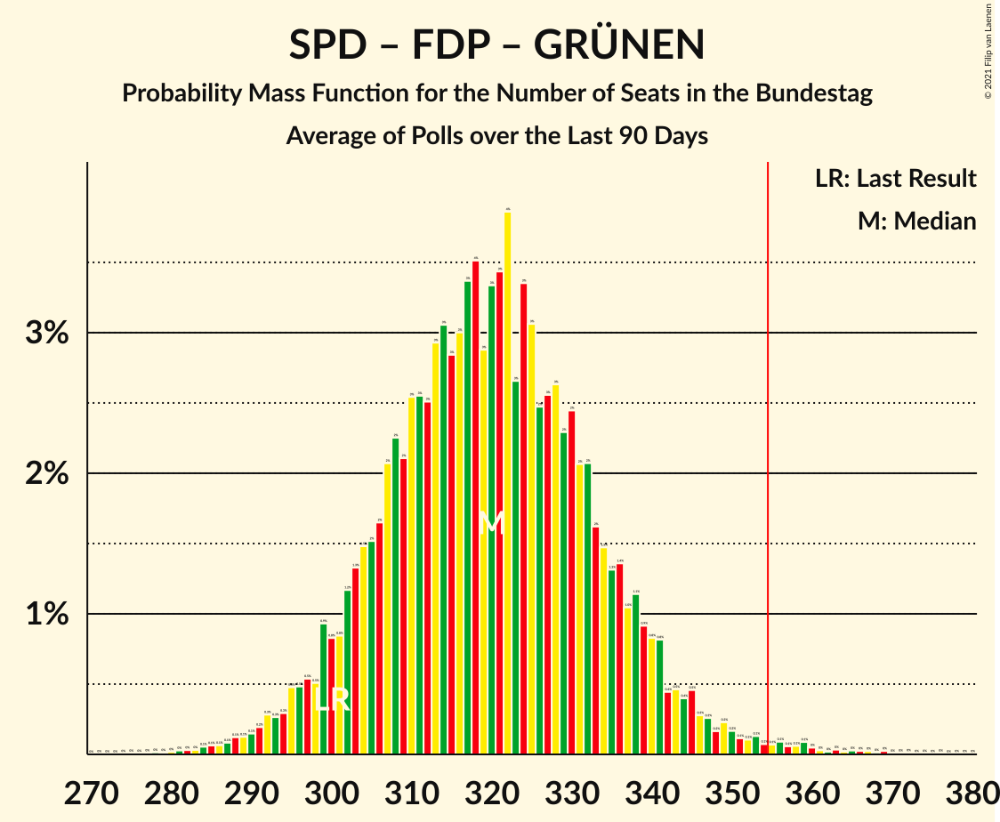

| Number of Seats | Probability | Accumulated | Special Marks |
|:---------------:|:-----------:|:-----------:|:-------------:|
| 300 | 0% | 100% | Last Result |
| 301 | 0% | 100% |  |
| 302 | 0% | 100% |  |
| 303 | 0% | 100% |  |
| 304 | 0% | 100% |  |
| 305 | 0% | 100% |  |
| 306 | 0% | 100% |  |
| 307 | 0% | 100% |  |
| 308 | 0% | 100% |  |
| 309 | 0% | 99.9% |  |
| 310 | 0% | 99.9% |  |
| 311 | 0% | 99.9% |  |
| 312 | 0% | 99.9% |  |
| 313 | 0.1% | 99.8% |  |
| 314 | 0.1% | 99.8% |  |
| 315 | 0.1% | 99.7% |  |
| 316 | 0.1% | 99.6% |  |
| 317 | 0.1% | 99.5% |  |
| 318 | 0.1% | 99.4% |  |
| 319 | 0.2% | 99.3% |  |
| 320 | 0.2% | 99.1% |  |
| 321 | 0.1% | 98.9% |  |
| 322 | 0.2% | 98.8% |  |
| 323 | 0.3% | 98.6% |  |
| 324 | 0.1% | 98% |  |
| 325 | 0.3% | 98% |  |
| 326 | 0.3% | 98% |  |
| 327 | 0.2% | 98% |  |
| 328 | 0.3% | 97% |  |
| 329 | 0.3% | 97% |  |
| 330 | 0.5% | 97% |  |
| 331 | 0.4% | 96% |  |
| 332 | 0.4% | 96% |  |
| 333 | 0.6% | 95% |  |
| 334 | 0.6% | 95% |  |
| 335 | 0.4% | 94% |  |
| 336 | 0.6% | 94% |  |
| 337 | 0.7% | 93% |  |
| 338 | 0.6% | 92% |  |
| 339 | 0.7% | 92% |  |
| 340 | 0.8% | 91% |  |
| 341 | 0.6% | 90% |  |
| 342 | 0.6% | 90% |  |
| 343 | 0.8% | 89% |  |
| 344 | 0.6% | 88% |  |
| 345 | 0.8% | 88% |  |
| 346 | 0.7% | 87% |  |
| 347 | 0.8% | 86% |  |
| 348 | 0.9% | 85% |  |
| 349 | 1.2% | 84% |  |
| 350 | 1.1% | 83% |  |
| 351 | 1.2% | 82% |  |
| 352 | 1.2% | 81% |  |
| 353 | 1.3% | 80% |  |
| 354 | 2% | 79% |  |
| 355 | 1.2% | 77% | Majority |
| 356 | 2% | 76% |  |
| 357 | 2% | 74% |  |
| 358 | 2% | 73% |  |
| 359 | 2% | 71% |  |
| 360 | 2% | 69% |  |
| 361 | 2% | 67% |  |
| 362 | 2% | 65% |  |
| 363 | 2% | 63% | Median |
| 364 | 2% | 61% |  |
| 365 | 2% | 59% |  |
| 366 | 2% | 57% |  |
| 367 | 2% | 55% |  |
| 368 | 2% | 53% |  |
| 369 | 2% | 51% |  |
| 370 | 2% | 49% |  |
| 371 | 2% | 47% |  |
| 372 | 2% | 45% |  |
| 373 | 2% | 43% |  |
| 374 | 2% | 41% |  |
| 375 | 2% | 40% |  |
| 376 | 2% | 38% |  |
| 377 | 1.5% | 36% |  |
| 378 | 2% | 35% |  |
| 379 | 1.3% | 33% |  |
| 380 | 1.4% | 32% |  |
| 381 | 2% | 30% |  |
| 382 | 1.4% | 29% |  |
| 383 | 1.2% | 27% |  |
| 384 | 1.2% | 26% |  |
| 385 | 1.2% | 25% |  |
| 386 | 1.2% | 23% |  |
| 387 | 1.1% | 22% |  |
| 388 | 0.9% | 21% |  |
| 389 | 0.9% | 20% |  |
| 390 | 0.9% | 19% |  |
| 391 | 0.9% | 18% |  |
| 392 | 0.8% | 18% |  |
| 393 | 0.9% | 17% |  |
| 394 | 0.7% | 16% |  |
| 395 | 0.7% | 15% |  |
| 396 | 1.0% | 14% |  |
| 397 | 0.7% | 13% |  |
| 398 | 0.7% | 13% |  |
| 399 | 0.6% | 12% |  |
| 400 | 0.5% | 11% |  |
| 401 | 0.5% | 11% |  |
| 402 | 0.5% | 10% |  |
| 403 | 0.5% | 10% |  |
| 404 | 0.5% | 9% |  |
| 405 | 0.6% | 9% |  |
| 406 | 0.5% | 8% |  |
| 407 | 0.5% | 8% |  |
| 408 | 0.6% | 7% |  |
| 409 | 0.5% | 7% |  |
| 410 | 0.5% | 6% |  |
| 411 | 0.8% | 6% |  |
| 412 | 0.7% | 5% |  |
| 413 | 0.6% | 4% |  |
| 414 | 0.4% | 4% |  |
| 415 | 0.3% | 3% |  |
| 416 | 0.4% | 3% |  |
| 417 | 0.3% | 3% |  |
| 418 | 0.3% | 2% |  |
| 419 | 0.4% | 2% |  |
| 420 | 0.2% | 2% |  |
| 421 | 0.2% | 1.4% |  |
| 422 | 0.1% | 1.2% |  |
| 423 | 0.2% | 1.1% |  |
| 424 | 0.1% | 1.0% |  |
| 425 | 0.1% | 0.8% |  |
| 426 | 0.1% | 0.7% |  |
| 427 | 0.1% | 0.6% |  |
| 428 | 0.1% | 0.5% |  |
| 429 | 0.1% | 0.4% |  |
| 430 | 0% | 0.3% |  |
| 431 | 0.1% | 0.3% |  |
| 432 | 0% | 0.2% |  |
| 433 | 0.1% | 0.2% |  |
| 434 | 0% | 0.1% |  |
| 435 | 0% | 0.1% |  |
| 436 | 0% | 0.1% |  |
| 437 | 0% | 0.1% |  |
| 438 | 0% | 0% |  |

### Christlich Demokratische Union Deutschlands – Alternative für Deutschland – Freie Demokratische Partei – Christlich-Soziale Union in Bayern

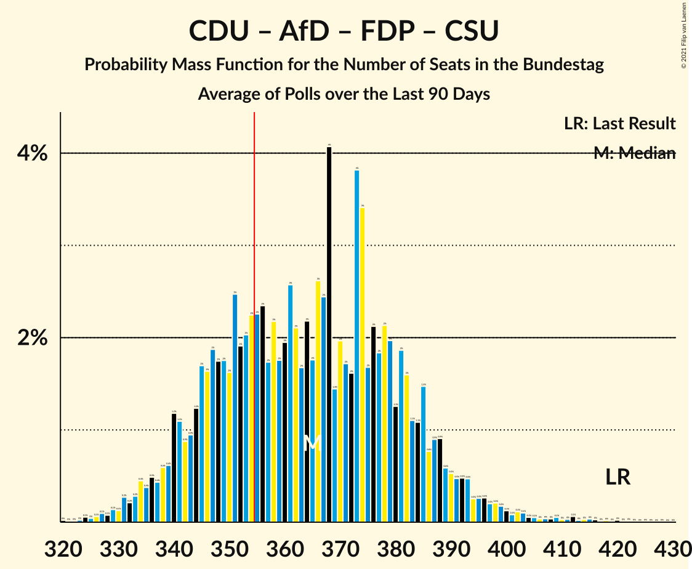

| Number of Seats | Probability | Accumulated | Special Marks |
|:---------------:|:-----------:|:-----------:|:-------------:|
| 310 | 0% | 100% |  |
| 311 | 0% | 99.9% |  |
| 312 | 0% | 99.9% |  |
| 313 | 0% | 99.9% |  |
| 314 | 0% | 99.9% |  |
| 315 | 0% | 99.8% |  |
| 316 | 0% | 99.8% |  |
| 317 | 0.1% | 99.7% |  |
| 318 | 0.1% | 99.7% |  |
| 319 | 0.1% | 99.6% |  |
| 320 | 0.1% | 99.5% |  |
| 321 | 0.2% | 99.4% |  |
| 322 | 0.1% | 99.2% |  |
| 323 | 0.2% | 99.0% |  |
| 324 | 0.3% | 98.8% |  |
| 325 | 0.3% | 98.6% |  |
| 326 | 0.3% | 98% |  |
| 327 | 0.3% | 98% |  |
| 328 | 0.6% | 98% |  |
| 329 | 0.5% | 97% |  |
| 330 | 0.6% | 97% |  |
| 331 | 0.5% | 96% |  |
| 332 | 0.7% | 95% |  |
| 333 | 0.5% | 95% |  |
| 334 | 1.0% | 94% |  |
| 335 | 1.0% | 93% |  |
| 336 | 0.9% | 92% |  |
| 337 | 1.2% | 91% |  |
| 338 | 1.3% | 90% |  |
| 339 | 0.9% | 89% |  |
| 340 | 1.5% | 88% |  |
| 341 | 2% | 87% |  |
| 342 | 1.0% | 85% |  |
| 343 | 2% | 84% |  |
| 344 | 2% | 82% |  |
| 345 | 1.4% | 81% |  |
| 346 | 2% | 79% |  |
| 347 | 2% | 78% |  |
| 348 | 2% | 76% |  |
| 349 | 2% | 74% |  |
| 350 | 2% | 72% |  |
| 351 | 2% | 70% |  |
| 352 | 2% | 68% |  |
| 353 | 2% | 66% |  |
| 354 | 2% | 64% |  |
| 355 | 2% | 62% | Majority |
| 356 | 2% | 60% |  |
| 357 | 2% | 58% |  |
| 358 | 2% | 56% |  |
| 359 | 2% | 54% |  |
| 360 | 2% | 52% |  |
| 361 | 2% | 50% |  |
| 362 | 2% | 47% |  |
| 363 | 2% | 46% | Median |
| 364 | 2% | 43% |  |
| 365 | 2% | 41% |  |
| 366 | 2% | 40% |  |
| 367 | 2% | 38% |  |
| 368 | 2% | 36% |  |
| 369 | 2% | 34% |  |
| 370 | 2% | 33% |  |
| 371 | 1.4% | 31% |  |
| 372 | 1.4% | 30% |  |
| 373 | 1.5% | 28% |  |
| 374 | 1.1% | 27% |  |
| 375 | 1.2% | 26% |  |
| 376 | 0.9% | 24% |  |
| 377 | 1.2% | 24% |  |
| 378 | 1.0% | 22% |  |
| 379 | 2% | 21% |  |
| 380 | 1.5% | 19% |  |
| 381 | 1.0% | 18% |  |
| 382 | 0.8% | 17% |  |
| 383 | 0.9% | 16% |  |
| 384 | 1.0% | 15% |  |
| 385 | 1.2% | 14% |  |
| 386 | 1.1% | 13% |  |
| 387 | 0.8% | 12% |  |
| 388 | 1.1% | 11% |  |
| 389 | 1.0% | 10% |  |
| 390 | 1.2% | 9% |  |
| 391 | 1.0% | 8% |  |
| 392 | 0.7% | 7% |  |
| 393 | 0.5% | 6% |  |
| 394 | 0.6% | 6% |  |
| 395 | 0.6% | 5% |  |
| 396 | 0.6% | 5% |  |
| 397 | 0.7% | 4% |  |
| 398 | 0.5% | 3% |  |
| 399 | 0.3% | 3% |  |
| 400 | 0.5% | 3% |  |
| 401 | 0.4% | 2% |  |
| 402 | 0.3% | 2% |  |
| 403 | 0.2% | 1.4% |  |
| 404 | 0.2% | 1.2% |  |
| 405 | 0.1% | 1.0% |  |
| 406 | 0.1% | 0.9% |  |
| 407 | 0.2% | 0.7% |  |
| 408 | 0.1% | 0.5% |  |
| 409 | 0.1% | 0.5% |  |
| 410 | 0.1% | 0.4% |  |
| 411 | 0.1% | 0.3% |  |
| 412 | 0% | 0.2% |  |
| 413 | 0% | 0.2% |  |
| 414 | 0% | 0.1% |  |
| 415 | 0% | 0.1% |  |
| 416 | 0% | 0.1% |  |
| 417 | 0% | 0.1% |  |
| 418 | 0% | 0.1% |  |
| 419 | 0% | 0% |  |
| 420 | 0% | 0% | Last Result |

### Sozialdemokratische Partei Deutschlands – Die Linke – Bündnis 90/Die Grünen

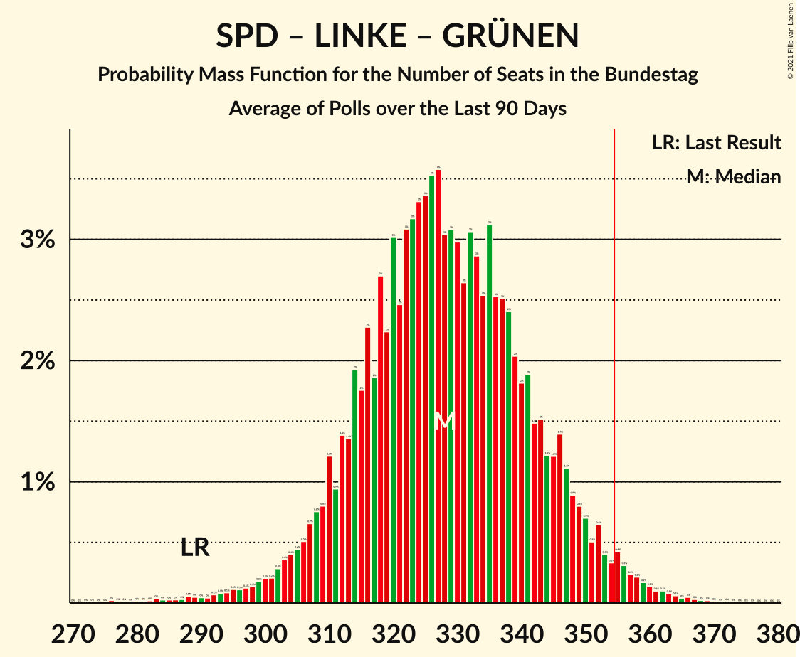

| Number of Seats | Probability | Accumulated | Special Marks |
|:---------------:|:-----------:|:-----------:|:-------------:|
| 289 | 0% | 100% | Last Result |
| 290 | 0% | 100% |  |
| 291 | 0% | 100% |  |
| 292 | 0% | 99.9% |  |
| 293 | 0% | 99.9% |  |
| 294 | 0% | 99.9% |  |
| 295 | 0% | 99.9% |  |
| 296 | 0% | 99.9% |  |
| 297 | 0% | 99.8% |  |
| 298 | 0.1% | 99.8% |  |
| 299 | 0.1% | 99.7% |  |
| 300 | 0.1% | 99.6% |  |
| 301 | 0.1% | 99.5% |  |
| 302 | 0.2% | 99.5% |  |
| 303 | 0.1% | 99.3% |  |
| 304 | 0.1% | 99.1% |  |
| 305 | 0.2% | 99.0% |  |
| 306 | 0.2% | 98.8% |  |
| 307 | 0.3% | 98.6% |  |
| 308 | 0.4% | 98% |  |
| 309 | 0.5% | 98% |  |
| 310 | 0.3% | 97% |  |
| 311 | 0.5% | 97% |  |
| 312 | 0.7% | 97% |  |
| 313 | 0.6% | 96% |  |
| 314 | 0.6% | 95% |  |
| 315 | 0.6% | 95% |  |
| 316 | 0.5% | 94% |  |
| 317 | 0.7% | 94% |  |
| 318 | 1.0% | 93% |  |
| 319 | 1.2% | 92% |  |
| 320 | 1.0% | 91% |  |
| 321 | 1.1% | 90% |  |
| 322 | 0.8% | 89% |  |
| 323 | 1.1% | 88% |  |
| 324 | 1.2% | 87% |  |
| 325 | 1.0% | 86% |  |
| 326 | 0.9% | 85% |  |
| 327 | 0.8% | 84% |  |
| 328 | 1.0% | 83% |  |
| 329 | 1.5% | 82% |  |
| 330 | 2% | 81% |  |
| 331 | 1.0% | 79% |  |
| 332 | 1.2% | 78% |  |
| 333 | 0.9% | 76% |  |
| 334 | 1.2% | 76% |  |
| 335 | 1.1% | 74% |  |
| 336 | 1.5% | 73% |  |
| 337 | 1.4% | 72% |  |
| 338 | 1.4% | 70% |  |
| 339 | 2% | 69% |  |
| 340 | 2% | 67% | Median |
| 341 | 2% | 66% |  |
| 342 | 2% | 64% |  |
| 343 | 2% | 62% |  |
| 344 | 2% | 60% |  |
| 345 | 2% | 59% |  |
| 346 | 2% | 57% |  |
| 347 | 2% | 54% |  |
| 348 | 2% | 53% |  |
| 349 | 2% | 50% |  |
| 350 | 2% | 48% |  |
| 351 | 2% | 46% |  |
| 352 | 2% | 44% |  |
| 353 | 2% | 42% |  |
| 354 | 2% | 40% |  |
| 355 | 2% | 38% | Majority |
| 356 | 2% | 36% |  |
| 357 | 2% | 34% |  |
| 358 | 2% | 32% |  |
| 359 | 2% | 30% |  |
| 360 | 2% | 28% |  |
| 361 | 2% | 26% |  |
| 362 | 2% | 24% |  |
| 363 | 2% | 22% |  |
| 364 | 1.4% | 21% |  |
| 365 | 2% | 19% |  |
| 366 | 2% | 18% |  |
| 367 | 1.0% | 16% |  |
| 368 | 2% | 15% |  |
| 369 | 1.5% | 13% |  |
| 370 | 0.9% | 12% |  |
| 371 | 1.3% | 11% |  |
| 372 | 1.2% | 10% |  |
| 373 | 0.9% | 9% |  |
| 374 | 1.0% | 8% |  |
| 375 | 1.0% | 7% |  |
| 376 | 0.5% | 6% |  |
| 377 | 0.7% | 5% |  |
| 378 | 0.5% | 5% |  |
| 379 | 0.6% | 4% |  |
| 380 | 0.5% | 3% |  |
| 381 | 0.6% | 3% |  |
| 382 | 0.3% | 2% |  |
| 383 | 0.3% | 2% |  |
| 384 | 0.3% | 2% |  |
| 385 | 0.3% | 1.4% |  |
| 386 | 0.2% | 1.2% |  |
| 387 | 0.1% | 1.0% |  |
| 388 | 0.2% | 0.8% |  |
| 389 | 0.1% | 0.6% |  |
| 390 | 0.1% | 0.5% |  |
| 391 | 0.1% | 0.4% |  |
| 392 | 0.1% | 0.3% |  |
| 393 | 0% | 0.3% |  |
| 394 | 0% | 0.2% |  |
| 395 | 0% | 0.2% |  |
| 396 | 0% | 0.1% |  |
| 397 | 0% | 0.1% |  |
| 398 | 0% | 0.1% |  |
| 399 | 0% | 0.1% |  |
| 400 | 0% | 0% |  |

### Christlich Demokratische Union Deutschlands – Sozialdemokratische Partei Deutschlands – Christlich-Soziale Union in Bayern

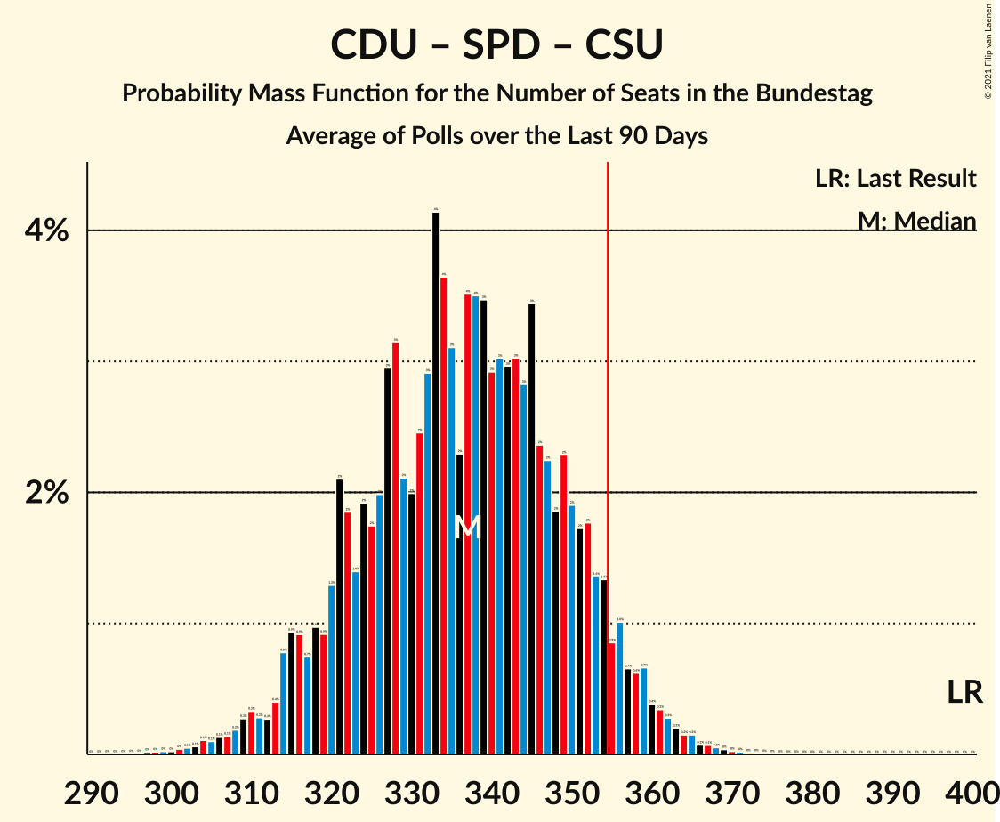

| Number of Seats | Probability | Accumulated | Special Marks |
|:---------------:|:-----------:|:-----------:|:-------------:|
| 234 | 0% | 100% |  |
| 235 | 0% | 99.9% |  |
| 236 | 0% | 99.9% |  |
| 237 | 0% | 99.9% |  |
| 238 | 0% | 99.9% |  |
| 239 | 0% | 99.9% |  |
| 240 | 0.1% | 99.9% |  |
| 241 | 0.1% | 99.8% |  |
| 242 | 0.1% | 99.7% |  |
| 243 | 0.1% | 99.6% |  |
| 244 | 0.1% | 99.5% |  |
| 245 | 0.2% | 99.4% |  |
| 246 | 0.1% | 99.2% |  |
| 247 | 0.1% | 99.2% |  |
| 248 | 0.1% | 99.1% |  |
| 249 | 0.1% | 99.0% |  |
| 250 | 0.2% | 98.9% |  |
| 251 | 0.4% | 98.6% |  |
| 252 | 0.4% | 98% |  |
| 253 | 0.4% | 98% |  |
| 254 | 0.4% | 97% |  |
| 255 | 0.5% | 97% |  |
| 256 | 0.4% | 97% |  |
| 257 | 0.3% | 96% |  |
| 258 | 0.3% | 96% |  |
| 259 | 0.2% | 96% |  |
| 260 | 0.4% | 95% |  |
| 261 | 0.5% | 95% |  |
| 262 | 0.7% | 94% |  |
| 263 | 0.7% | 94% |  |
| 264 | 0.5% | 93% |  |
| 265 | 0.4% | 93% |  |
| 266 | 0.5% | 92% |  |
| 267 | 0.4% | 92% |  |
| 268 | 0.2% | 91% |  |
| 269 | 0.3% | 91% |  |
| 270 | 0.2% | 91% |  |
| 271 | 0.3% | 91% |  |
| 272 | 0.3% | 90% |  |
| 273 | 0.4% | 90% |  |
| 274 | 0.6% | 90% |  |
| 275 | 0.3% | 89% |  |
| 276 | 0.3% | 89% |  |
| 277 | 0.3% | 88% |  |
| 278 | 0.2% | 88% |  |
| 279 | 0.2% | 88% |  |
| 280 | 0.2% | 88% |  |
| 281 | 0.2% | 88% |  |
| 282 | 0.2% | 88% |  |
| 283 | 0.3% | 87% |  |
| 284 | 0.2% | 87% |  |
| 285 | 0.3% | 87% |  |
| 286 | 0.3% | 87% |  |
| 287 | 0.3% | 86% |  |
| 288 | 0.4% | 86% |  |
| 289 | 0.5% | 86% |  |
| 290 | 0.4% | 85% |  |
| 291 | 0.4% | 85% |  |
| 292 | 0.5% | 84% |  |
| 293 | 0.9% | 84% |  |
| 294 | 0.7% | 83% |  |
| 295 | 0.7% | 82% |  |
| 296 | 0.8% | 81% |  |
| 297 | 0.8% | 81% |  |
| 298 | 0.7% | 80% |  |
| 299 | 1.0% | 79% |  |
| 300 | 1.0% | 78% |  |
| 301 | 1.1% | 77% |  |
| 302 | 0.9% | 76% |  |
| 303 | 1.0% | 75% |  |
| 304 | 1.0% | 74% |  |
| 305 | 1.4% | 73% |  |
| 306 | 1.4% | 72% |  |
| 307 | 1.1% | 70% |  |
| 308 | 1.3% | 69% |  |
| 309 | 1.0% | 68% |  |
| 310 | 1.3% | 67% |  |
| 311 | 1.3% | 66% |  |
| 312 | 1.4% | 64% |  |
| 313 | 1.2% | 63% |  |
| 314 | 1.4% | 62% |  |
| 315 | 1.1% | 60% |  |
| 316 | 1.4% | 59% |  |
| 317 | 1.4% | 58% |  |
| 318 | 1.3% | 56% |  |
| 319 | 2% | 55% | Median |
| 320 | 1.4% | 54% |  |
| 321 | 1.5% | 52% |  |
| 322 | 2% | 51% |  |
| 323 | 2% | 49% |  |
| 324 | 2% | 47% |  |
| 325 | 2% | 46% |  |
| 326 | 2% | 44% |  |
| 327 | 2% | 42% |  |
| 328 | 2% | 40% |  |
| 329 | 2% | 37% |  |
| 330 | 2% | 35% |  |
| 331 | 2% | 33% |  |
| 332 | 1.5% | 31% |  |
| 333 | 2% | 30% |  |
| 334 | 2% | 28% |  |
| 335 | 2% | 26% |  |
| 336 | 2% | 24% |  |
| 337 | 2% | 22% |  |
| 338 | 2% | 20% |  |
| 339 | 2% | 18% |  |
| 340 | 2% | 16% |  |
| 341 | 2% | 14% |  |
| 342 | 1.4% | 13% |  |
| 343 | 1.3% | 11% |  |
| 344 | 0.9% | 10% |  |
| 345 | 1.0% | 9% |  |
| 346 | 1.0% | 8% |  |
| 347 | 0.8% | 7% |  |
| 348 | 0.6% | 6% |  |
| 349 | 0.7% | 6% |  |
| 350 | 0.6% | 5% |  |
| 351 | 0.5% | 4% |  |
| 352 | 0.5% | 4% |  |
| 353 | 0.6% | 3% |  |
| 354 | 0.3% | 3% |  |
| 355 | 0.4% | 2% | Majority |
| 356 | 0.4% | 2% |  |
| 357 | 0.3% | 2% |  |
| 358 | 0.3% | 1.3% |  |
| 359 | 0.2% | 1.1% |  |
| 360 | 0.1% | 0.9% |  |
| 361 | 0.2% | 0.7% |  |
| 362 | 0.1% | 0.6% |  |
| 363 | 0.1% | 0.4% |  |
| 364 | 0.1% | 0.4% |  |
| 365 | 0.1% | 0.3% |  |
| 366 | 0.1% | 0.2% |  |
| 367 | 0% | 0.2% |  |
| 368 | 0% | 0.1% |  |
| 369 | 0% | 0.1% |  |
| 370 | 0% | 0.1% |  |
| 371 | 0% | 0.1% |  |
| 372 | 0% | 0% |  |
| 373 | 0% | 0% |  |
| 374 | 0% | 0% |  |
| 375 | 0% | 0% |  |
| 376 | 0% | 0% |  |
| 377 | 0% | 0% |  |
| 378 | 0% | 0% |  |
| 379 | 0% | 0% |  |
| 380 | 0% | 0% |  |
| 381 | 0% | 0% |  |
| 382 | 0% | 0% |  |
| 383 | 0% | 0% |  |
| 384 | 0% | 0% |  |
| 385 | 0% | 0% |  |
| 386 | 0% | 0% |  |
| 387 | 0% | 0% |  |
| 388 | 0% | 0% |  |
| 389 | 0% | 0% |  |
| 390 | 0% | 0% |  |
| 391 | 0% | 0% |  |
| 392 | 0% | 0% |  |
| 393 | 0% | 0% |  |
| 394 | 0% | 0% |  |
| 395 | 0% | 0% |  |
| 396 | 0% | 0% |  |
| 397 | 0% | 0% |  |
| 398 | 0% | 0% |  |
| 399 | 0% | 0% | Last Result |

### Christlich Demokratische Union Deutschlands – Alternative für Deutschland – Christlich-Soziale Union in Bayern

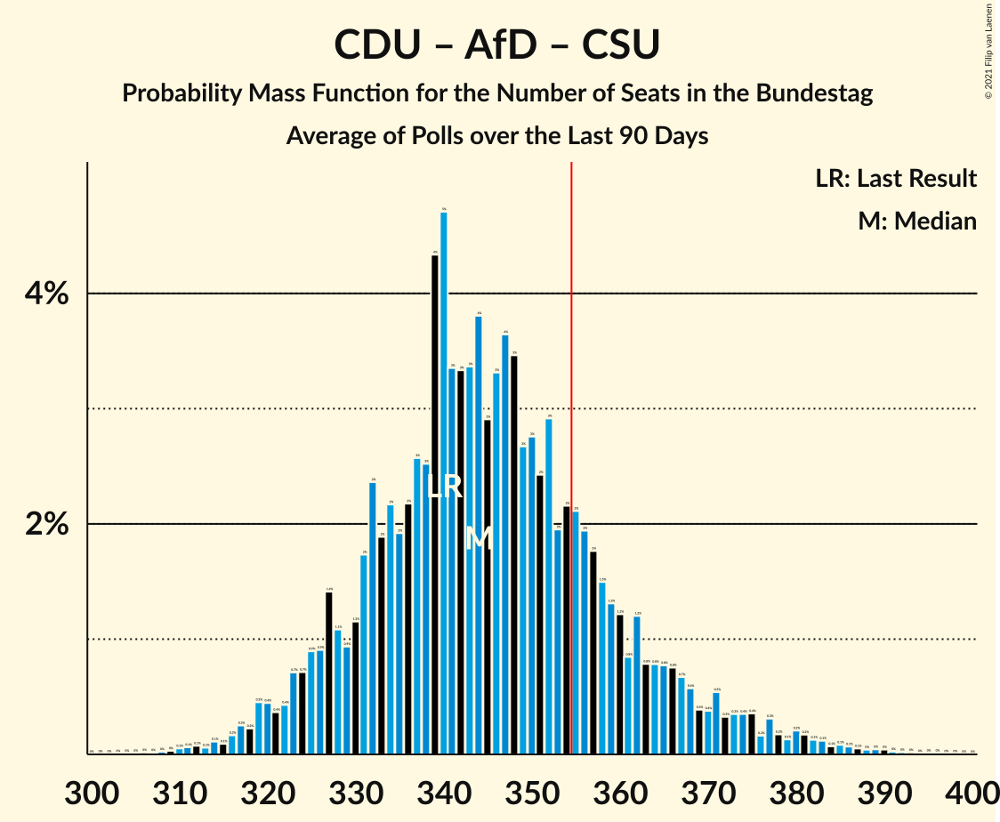

| Number of Seats | Probability | Accumulated | Special Marks |
|:---------------:|:-----------:|:-----------:|:-------------:|
| 220 | 0% | 100% |  |
| 221 | 0% | 99.9% |  |
| 222 | 0% | 99.9% |  |
| 223 | 0% | 99.9% |  |
| 224 | 0.1% | 99.8% |  |
| 225 | 0.1% | 99.8% |  |
| 226 | 0.1% | 99.7% |  |
| 227 | 0.1% | 99.6% |  |
| 228 | 0.1% | 99.6% |  |
| 229 | 0.1% | 99.5% |  |
| 230 | 0.1% | 99.4% |  |
| 231 | 0.1% | 99.3% |  |
| 232 | 0.3% | 99.2% |  |
| 233 | 0.2% | 98.9% |  |
| 234 | 0.2% | 98.7% |  |
| 235 | 0.3% | 98.5% |  |
| 236 | 0.2% | 98% |  |
| 237 | 0.3% | 98% |  |
| 238 | 0.3% | 98% |  |
| 239 | 0.4% | 97% |  |
| 240 | 0.4% | 97% |  |
| 241 | 0.7% | 97% |  |
| 242 | 0.7% | 96% |  |
| 243 | 0.7% | 95% |  |
| 244 | 0.7% | 95% |  |
| 245 | 0.8% | 94% |  |
| 246 | 0.6% | 93% |  |
| 247 | 0.8% | 92% |  |
| 248 | 0.5% | 92% |  |
| 249 | 0.8% | 91% |  |
| 250 | 0.6% | 90% |  |
| 251 | 0.7% | 90% |  |
| 252 | 0.6% | 89% |  |
| 253 | 0.5% | 88% |  |
| 254 | 0.6% | 88% |  |
| 255 | 0.6% | 87% |  |
| 256 | 0.6% | 87% |  |
| 257 | 0.6% | 86% |  |
| 258 | 0.9% | 85% |  |
| 259 | 0.9% | 85% |  |
| 260 | 1.2% | 84% |  |
| 261 | 0.9% | 82% |  |
| 262 | 1.1% | 81% |  |
| 263 | 1.2% | 80% |  |
| 264 | 1.4% | 79% |  |
| 265 | 1.3% | 78% |  |
| 266 | 1.1% | 77% |  |
| 267 | 1.4% | 75% |  |
| 268 | 1.1% | 74% |  |
| 269 | 1.2% | 73% |  |
| 270 | 1.0% | 72% |  |
| 271 | 1.0% | 71% |  |
| 272 | 1.4% | 70% |  |
| 273 | 2% | 68% |  |
| 274 | 2% | 67% |  |
| 275 | 2% | 65% |  |
| 276 | 1.4% | 63% |  |
| 277 | 2% | 62% |  |
| 278 | 2% | 60% |  |
| 279 | 2% | 58% |  |
| 280 | 2% | 57% |  |
| 281 | 3% | 55% |  |
| 282 | 2% | 52% |  |
| 283 | 2% | 50% |  |
| 284 | 2% | 48% | Median |
| 285 | 2% | 46% |  |
| 286 | 2% | 44% |  |
| 287 | 2% | 42% |  |
| 288 | 2% | 40% |  |
| 289 | 2% | 38% |  |
| 290 | 2% | 36% |  |
| 291 | 2% | 34% |  |
| 292 | 2% | 32% |  |
| 293 | 1.4% | 30% |  |
| 294 | 2% | 28% |  |
| 295 | 2% | 27% |  |
| 296 | 1.1% | 25% |  |
| 297 | 1.3% | 24% |  |
| 298 | 1.5% | 23% |  |
| 299 | 1.1% | 21% |  |
| 300 | 1.0% | 20% |  |
| 301 | 1.0% | 19% |  |
| 302 | 0.9% | 18% |  |
| 303 | 0.6% | 17% |  |
| 304 | 0.9% | 17% |  |
| 305 | 0.8% | 16% |  |
| 306 | 0.5% | 15% |  |
| 307 | 0.5% | 14% |  |
| 308 | 0.9% | 14% |  |
| 309 | 0.7% | 13% |  |
| 310 | 0.4% | 12% |  |
| 311 | 0.5% | 12% |  |
| 312 | 0.5% | 11% |  |
| 313 | 0.7% | 11% |  |
| 314 | 0.7% | 10% |  |
| 315 | 0.5% | 10% |  |
| 316 | 0.5% | 9% |  |
| 317 | 0.6% | 9% |  |
| 318 | 0.7% | 8% |  |
| 319 | 0.6% | 7% |  |
| 320 | 0.4% | 7% |  |
| 321 | 0.5% | 6% |  |
| 322 | 0.7% | 6% |  |
| 323 | 0.6% | 5% |  |
| 324 | 0.4% | 5% |  |
| 325 | 0.3% | 4% |  |
| 326 | 0.5% | 4% |  |
| 327 | 0.6% | 3% |  |
| 328 | 0.3% | 3% |  |
| 329 | 0.2% | 3% |  |
| 330 | 0.2% | 2% |  |
| 331 | 0.5% | 2% |  |
| 332 | 0.2% | 2% |  |
| 333 | 0.1% | 1.4% |  |
| 334 | 0.2% | 1.3% |  |
| 335 | 0.2% | 1.0% |  |
| 336 | 0.1% | 0.8% |  |
| 337 | 0.1% | 0.7% |  |
| 338 | 0.1% | 0.6% |  |
| 339 | 0.1% | 0.5% |  |
| 340 | 0.1% | 0.4% | Last Result |
| 341 | 0.1% | 0.3% |  |
| 342 | 0% | 0.2% |  |
| 343 | 0% | 0.2% |  |
| 344 | 0% | 0.2% |  |
| 345 | 0% | 0.1% |  |
| 346 | 0% | 0.1% |  |
| 347 | 0% | 0.1% |  |
| 348 | 0% | 0.1% |  |
| 349 | 0% | 0% |  |

### Sozialdemokratische Partei Deutschlands – Bündnis 90/Die Grünen

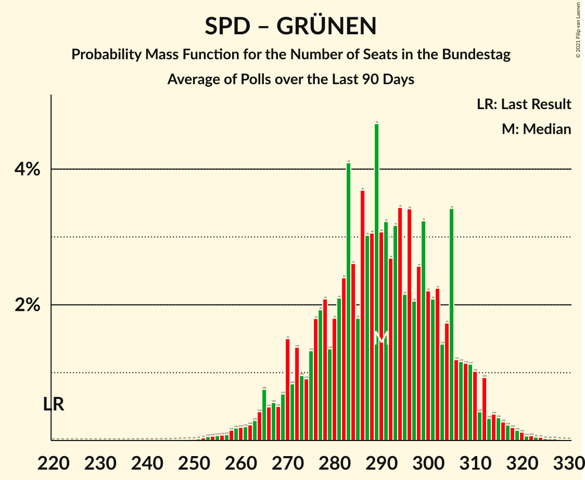

| Number of Seats | Probability | Accumulated | Special Marks |
|:---------------:|:-----------:|:-----------:|:-------------:|
| 220 | 0% | 100% | Last Result |
| 221 | 0% | 100% |  |
| 222 | 0% | 100% |  |
| 223 | 0% | 100% |  |
| 224 | 0% | 100% |  |
| 225 | 0% | 100% |  |
| 226 | 0% | 100% |  |
| 227 | 0% | 100% |  |
| 228 | 0% | 100% |  |
| 229 | 0% | 100% |  |
| 230 | 0% | 100% |  |
| 231 | 0% | 100% |  |
| 232 | 0% | 100% |  |
| 233 | 0% | 100% |  |
| 234 | 0% | 100% |  |
| 235 | 0% | 100% |  |
| 236 | 0% | 100% |  |
| 237 | 0% | 100% |  |
| 238 | 0% | 100% |  |
| 239 | 0% | 100% |  |
| 240 | 0% | 100% |  |
| 241 | 0% | 99.9% |  |
| 242 | 0% | 99.9% |  |
| 243 | 0% | 99.9% |  |
| 244 | 0% | 99.9% |  |
| 245 | 0.1% | 99.8% |  |
| 246 | 0.1% | 99.7% |  |
| 247 | 0.1% | 99.7% |  |
| 248 | 0.1% | 99.5% |  |
| 249 | 0.1% | 99.4% |  |
| 250 | 0.2% | 99.3% |  |
| 251 | 0.2% | 99.1% |  |
| 252 | 0.2% | 98.9% |  |
| 253 | 0.3% | 98.7% |  |
| 254 | 0.3% | 98% |  |
| 255 | 0.4% | 98% |  |
| 256 | 0.4% | 98% |  |
| 257 | 0.4% | 97% |  |
| 258 | 0.5% | 97% |  |
| 259 | 0.4% | 96% |  |
| 260 | 0.6% | 96% |  |
| 261 | 0.6% | 95% |  |
| 262 | 0.8% | 95% |  |
| 263 | 0.7% | 94% |  |
| 264 | 1.0% | 93% |  |
| 265 | 1.0% | 92% |  |
| 266 | 1.1% | 91% |  |
| 267 | 1.3% | 90% |  |
| 268 | 1.2% | 89% |  |
| 269 | 1.4% | 88% |  |
| 270 | 1.3% | 86% |  |
| 271 | 1.4% | 85% |  |
| 272 | 1.3% | 83% |  |
| 273 | 2% | 82% |  |
| 274 | 1.4% | 80% |  |
| 275 | 1.5% | 79% |  |
| 276 | 2% | 78% |  |
| 277 | 2% | 76% |  |
| 278 | 2% | 74% |  |
| 279 | 2% | 72% |  |
| 280 | 2% | 70% |  |
| 281 | 2% | 68% |  |
| 282 | 2% | 67% |  |
| 283 | 2% | 65% |  |
| 284 | 2% | 63% | Median |
| 285 | 2% | 61% |  |
| 286 | 2% | 60% |  |
| 287 | 2% | 57% |  |
| 288 | 2% | 55% |  |
| 289 | 2% | 53% |  |
| 290 | 2% | 52% |  |
| 291 | 2% | 49% |  |
| 292 | 2% | 48% |  |
| 293 | 2% | 46% |  |
| 294 | 2% | 44% |  |
| 295 | 2% | 42% |  |
| 296 | 1.5% | 40% |  |
| 297 | 2% | 39% |  |
| 298 | 2% | 36% |  |
| 299 | 2% | 35% |  |
| 300 | 2% | 33% |  |
| 301 | 2% | 31% |  |
| 302 | 1.5% | 30% |  |
| 303 | 2% | 28% |  |
| 304 | 2% | 27% |  |
| 305 | 1.3% | 25% |  |
| 306 | 1.3% | 24% |  |
| 307 | 1.5% | 22% |  |
| 308 | 2% | 21% |  |
| 309 | 1.2% | 19% |  |
| 310 | 1.2% | 18% |  |
| 311 | 1.3% | 17% |  |
| 312 | 1.3% | 15% |  |
| 313 | 1.3% | 14% |  |
| 314 | 1.5% | 13% |  |
| 315 | 0.8% | 11% |  |
| 316 | 0.8% | 11% |  |
| 317 | 1.0% | 10% |  |
| 318 | 1.0% | 9% |  |
| 319 | 0.9% | 8% |  |
| 320 | 0.9% | 7% |  |
| 321 | 0.6% | 6% |  |
| 322 | 0.7% | 5% |  |
| 323 | 0.5% | 5% |  |
| 324 | 0.7% | 4% |  |
| 325 | 0.4% | 3% |  |
| 326 | 0.5% | 3% |  |
| 327 | 0.3% | 2% |  |
| 328 | 0.3% | 2% |  |
| 329 | 0.2% | 2% |  |
| 330 | 0.3% | 2% |  |
| 331 | 0.2% | 1.3% |  |
| 332 | 0.1% | 1.0% |  |
| 333 | 0.2% | 0.9% |  |
| 334 | 0.1% | 0.7% |  |
| 335 | 0.1% | 0.6% |  |
| 336 | 0.1% | 0.5% |  |
| 337 | 0.1% | 0.4% |  |
| 338 | 0% | 0.3% |  |
| 339 | 0% | 0.3% |  |
| 340 | 0% | 0.2% |  |
| 341 | 0% | 0.2% |  |
| 342 | 0% | 0.1% |  |
| 343 | 0% | 0.1% |  |
| 344 | 0% | 0.1% |  |
| 345 | 0% | 0.1% |  |
| 346 | 0% | 0% |  |

### Christlich Demokratische Union Deutschlands – Freie Demokratische Partei – Christlich-Soziale Union in Bayern

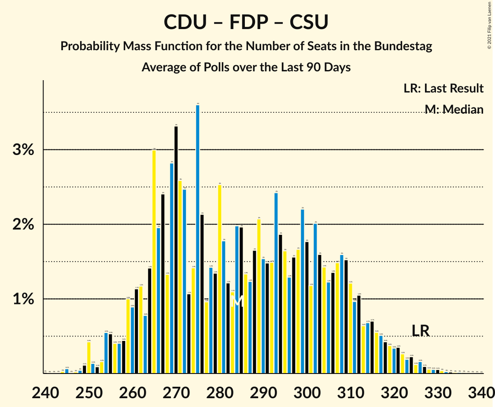

| Number of Seats | Probability | Accumulated | Special Marks |
|:---------------:|:-----------:|:-----------:|:-------------:|
| 227 | 0% | 100% |  |
| 228 | 0% | 99.9% |  |
| 229 | 0% | 99.9% |  |
| 230 | 0% | 99.9% |  |
| 231 | 0.1% | 99.9% |  |
| 232 | 0.1% | 99.8% |  |
| 233 | 0% | 99.8% |  |
| 234 | 0% | 99.7% |  |
| 235 | 0.1% | 99.7% |  |
| 236 | 0.2% | 99.6% |  |
| 237 | 0.1% | 99.4% |  |
| 238 | 0.2% | 99.3% |  |
| 239 | 0.1% | 99.1% |  |
| 240 | 0.1% | 99.0% |  |
| 241 | 0.2% | 98.9% |  |
| 242 | 0.4% | 98.7% |  |
| 243 | 0.6% | 98% |  |
| 244 | 0.2% | 98% |  |
| 245 | 0.3% | 98% |  |
| 246 | 0.3% | 97% |  |
| 247 | 0.4% | 97% |  |
| 248 | 0.4% | 97% |  |
| 249 | 1.3% | 96% |  |
| 250 | 0.5% | 95% |  |
| 251 | 0.3% | 94% |  |
| 252 | 0.6% | 94% |  |
| 253 | 0.9% | 93% |  |
| 254 | 0.5% | 92% |  |
| 255 | 1.0% | 92% |  |
| 256 | 1.3% | 91% |  |
| 257 | 0.8% | 90% |  |
| 258 | 0.6% | 89% |  |
| 259 | 1.1% | 88% |  |
| 260 | 1.3% | 87% |  |
| 261 | 1.0% | 86% |  |
| 262 | 2% | 85% |  |
| 263 | 1.4% | 83% |  |
| 264 | 1.2% | 82% |  |
| 265 | 1.3% | 81% |  |
| 266 | 2% | 79% |  |
| 267 | 2% | 78% |  |
| 268 | 2% | 76% |  |
| 269 | 2% | 74% |  |
| 270 | 2% | 73% |  |
| 271 | 2% | 71% |  |
| 272 | 2% | 69% |  |
| 273 | 2% | 67% |  |
| 274 | 2% | 65% |  |
| 275 | 2% | 63% |  |
| 276 | 2% | 61% |  |
| 277 | 2% | 58% |  |
| 278 | 2% | 56% |  |
| 279 | 3% | 54% |  |
| 280 | 2% | 52% |  |
| 281 | 2% | 49% |  |
| 282 | 2% | 47% | Median |
| 283 | 2% | 45% |  |
| 284 | 2% | 43% |  |
| 285 | 3% | 41% |  |
| 286 | 2% | 38% |  |
| 287 | 2% | 37% |  |
| 288 | 2% | 35% |  |
| 289 | 2% | 33% |  |
| 290 | 2% | 31% |  |
| 291 | 2% | 29% |  |
| 292 | 1.4% | 28% |  |
| 293 | 2% | 26% |  |
| 294 | 2% | 24% |  |
| 295 | 1.3% | 23% |  |
| 296 | 1.2% | 21% |  |
| 297 | 1.3% | 20% |  |
| 298 | 1.3% | 19% |  |
| 299 | 2% | 18% |  |
| 300 | 1.3% | 16% |  |
| 301 | 0.9% | 15% |  |
| 302 | 1.4% | 14% |  |
| 303 | 1.1% | 13% |  |
| 304 | 0.9% | 12% |  |
| 305 | 0.8% | 11% |  |
| 306 | 0.9% | 10% |  |
| 307 | 1.0% | 9% |  |
| 308 | 1.0% | 8% |  |
| 309 | 1.0% | 7% |  |
| 310 | 0.8% | 6% |  |
| 311 | 0.6% | 5% |  |
| 312 | 0.7% | 4% |  |
| 313 | 0.4% | 4% |  |
| 314 | 0.4% | 3% |  |
| 315 | 0.4% | 3% |  |
| 316 | 0.4% | 2% |  |
| 317 | 0.3% | 2% |  |
| 318 | 0.3% | 2% |  |
| 319 | 0.2% | 2% |  |
| 320 | 0.2% | 1.3% |  |
| 321 | 0.2% | 1.1% |  |
| 322 | 0.2% | 0.9% |  |
| 323 | 0.1% | 0.7% |  |
| 324 | 0.1% | 0.6% |  |
| 325 | 0.1% | 0.4% |  |
| 326 | 0.1% | 0.4% | Last Result |
| 327 | 0.1% | 0.3% |  |
| 328 | 0% | 0.2% |  |
| 329 | 0% | 0.2% |  |
| 330 | 0% | 0.1% |  |
| 331 | 0% | 0.1% |  |
| 332 | 0% | 0.1% |  |
| 333 | 0% | 0.1% |  |
| 334 | 0% | 0% |  |

### Sozialdemokratische Partei Deutschlands – Freie Demokratische Partei

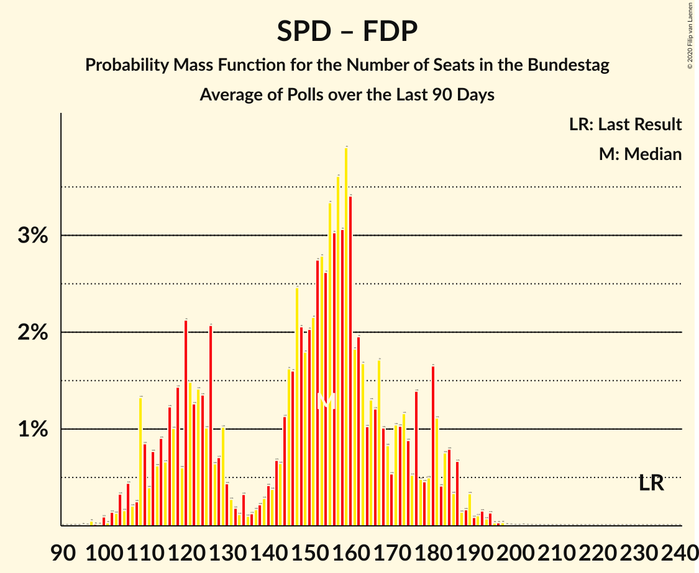

| Number of Seats | Probability | Accumulated | Special Marks |
|:---------------:|:-----------:|:-----------:|:-------------:|
| 143 | 0% | 100% |  |
| 144 | 0% | 99.9% |  |
| 145 | 0% | 99.9% |  |
| 146 | 0% | 99.9% |  |
| 147 | 0% | 99.8% |  |
| 148 | 0.1% | 99.8% |  |
| 149 | 0.1% | 99.7% |  |
| 150 | 0.1% | 99.6% |  |
| 151 | 0.2% | 99.5% |  |
| 152 | 0.1% | 99.3% |  |
| 153 | 0.2% | 99.2% |  |
| 154 | 0.3% | 98.9% |  |
| 155 | 0.2% | 98.6% |  |
| 156 | 0.3% | 98% |  |
| 157 | 0.5% | 98% |  |
| 158 | 0.3% | 98% |  |
| 159 | 0.5% | 97% |  |
| 160 | 0.7% | 97% |  |
| 161 | 0.5% | 96% |  |
| 162 | 0.8% | 96% |  |
| 163 | 0.7% | 95% |  |
| 164 | 0.7% | 94% |  |
| 165 | 1.0% | 93% |  |
| 166 | 1.0% | 92% |  |
| 167 | 0.9% | 91% |  |
| 168 | 1.1% | 90% |  |
| 169 | 1.1% | 89% |  |
| 170 | 0.9% | 88% |  |
| 171 | 1.1% | 87% |  |
| 172 | 1.1% | 86% |  |
| 173 | 0.9% | 85% |  |
| 174 | 1.1% | 84% |  |
| 175 | 1.1% | 83% |  |
| 176 | 0.9% | 82% |  |
| 177 | 1.1% | 81% |  |
| 178 | 1.0% | 80% |  |
| 179 | 0.9% | 79% |  |
| 180 | 1.1% | 78% |  |
| 181 | 1.2% | 77% |  |
| 182 | 1.0% | 76% |  |
| 183 | 1.2% | 75% |  |
| 184 | 1.3% | 74% |  |
| 185 | 1.2% | 72% |  |
| 186 | 1.3% | 71% |  |
| 187 | 2% | 70% |  |
| 188 | 1.3% | 68% |  |
| 189 | 2% | 67% |  |
| 190 | 2% | 65% |  |
| 191 | 2% | 63% |  |
| 192 | 2% | 62% |  |
| 193 | 2% | 60% |  |
| 194 | 2% | 58% |  |
| 195 | 2% | 56% | Median |
| 196 | 2% | 53% |  |
| 197 | 2% | 51% |  |
| 198 | 3% | 49% |  |
| 199 | 3% | 46% |  |
| 200 | 2% | 44% |  |
| 201 | 3% | 41% |  |
| 202 | 2% | 39% |  |
| 203 | 2% | 36% |  |
| 204 | 3% | 34% |  |
| 205 | 2% | 31% |  |
| 206 | 2% | 29% |  |
| 207 | 2% | 27% |  |
| 208 | 2% | 24% |  |
| 209 | 2% | 22% |  |
| 210 | 2% | 20% |  |
| 211 | 2% | 18% |  |
| 212 | 1.5% | 16% |  |
| 213 | 2% | 14% |  |
| 214 | 1.2% | 13% |  |
| 215 | 1.2% | 11% |  |
| 216 | 1.1% | 10% |  |
| 217 | 0.9% | 9% |  |
| 218 | 1.0% | 8% |  |
| 219 | 0.7% | 7% |  |
| 220 | 0.8% | 7% |  |
| 221 | 0.5% | 6% |  |
| 222 | 0.7% | 5% |  |
| 223 | 0.6% | 5% |  |
| 224 | 0.5% | 4% |  |
| 225 | 0.5% | 3% |  |
| 226 | 0.3% | 3% |  |
| 227 | 0.3% | 3% |  |
| 228 | 0.4% | 2% |  |
| 229 | 0.3% | 2% |  |
| 230 | 0.3% | 2% |  |
| 231 | 0.2% | 1.4% |  |
| 232 | 0.1% | 1.2% |  |
| 233 | 0.1% | 1.0% | Last Result |
| 234 | 0.2% | 0.9% |  |
| 235 | 0.1% | 0.7% |  |
| 236 | 0.2% | 0.6% |  |
| 237 | 0.1% | 0.5% |  |
| 238 | 0.1% | 0.3% |  |
| 239 | 0.1% | 0.3% |  |
| 240 | 0% | 0.2% |  |
| 241 | 0.1% | 0.2% |  |
| 242 | 0% | 0.1% |  |
| 243 | 0% | 0.1% |  |
| 244 | 0% | 0.1% |  |
| 245 | 0% | 0% |  |

### Sozialdemokratische Partei Deutschlands – Die Linke

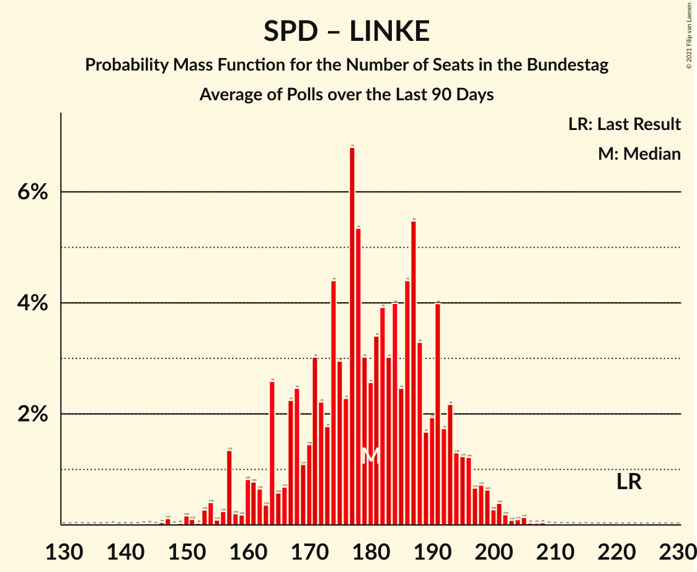

| Number of Seats | Probability | Accumulated | Special Marks |
|:---------------:|:-----------:|:-----------:|:-------------:|
| 123 | 0% | 100% |  |
| 124 | 0% | 99.9% |  |
| 125 | 0% | 99.9% |  |
| 126 | 0% | 99.9% |  |
| 127 | 0% | 99.9% |  |
| 128 | 0% | 99.9% |  |
| 129 | 0% | 99.9% |  |
| 130 | 0% | 99.9% |  |
| 131 | 0.1% | 99.8% |  |
| 132 | 0.1% | 99.8% |  |
| 133 | 0.1% | 99.7% |  |
| 134 | 0.1% | 99.6% |  |
| 135 | 0.1% | 99.5% |  |
| 136 | 0.2% | 99.4% |  |
| 137 | 0.2% | 99.2% |  |
| 138 | 0.3% | 98.9% |  |
| 139 | 0.3% | 98.7% |  |
| 140 | 0.5% | 98% |  |
| 141 | 0.4% | 98% |  |
| 142 | 0.8% | 98% |  |
| 143 | 0.8% | 97% |  |
| 144 | 0.8% | 96% |  |
| 145 | 1.0% | 95% |  |
| 146 | 1.1% | 94% |  |
| 147 | 1.3% | 93% |  |
| 148 | 1.1% | 92% |  |
| 149 | 1.5% | 91% |  |
| 150 | 2% | 89% |  |
| 151 | 1.4% | 88% |  |
| 152 | 2% | 86% |  |
| 153 | 2% | 85% |  |
| 154 | 2% | 83% |  |
| 155 | 2% | 81% |  |
| 156 | 2% | 80% |  |
| 157 | 2% | 78% |  |
| 158 | 2% | 76% |  |
| 159 | 2% | 74% |  |
| 160 | 2% | 72% |  |
| 161 | 2% | 70% |  |
| 162 | 2% | 68% |  |
| 163 | 2% | 67% |  |
| 164 | 2% | 65% |  |
| 165 | 2% | 63% |  |
| 166 | 2% | 61% |  |
| 167 | 2% | 60% |  |
| 168 | 2% | 58% |  |
| 169 | 2% | 56% |  |
| 170 | 1.4% | 54% |  |
| 171 | 2% | 53% |  |
| 172 | 2% | 51% | Median |
| 173 | 2% | 49% |  |
| 174 | 2% | 48% |  |
| 175 | 2% | 46% |  |
| 176 | 2% | 44% |  |
| 177 | 2% | 42% |  |
| 178 | 2% | 40% |  |
| 179 | 2% | 38% |  |
| 180 | 2% | 36% |  |
| 181 | 2% | 34% |  |
| 182 | 2% | 32% |  |
| 183 | 2% | 30% |  |
| 184 | 2% | 28% |  |
| 185 | 2% | 26% |  |
| 186 | 2% | 24% |  |
| 187 | 2% | 22% |  |
| 188 | 2% | 20% |  |
| 189 | 2% | 18% |  |
| 190 | 2% | 16% |  |
| 191 | 2% | 14% |  |
| 192 | 2% | 12% |  |
| 193 | 1.4% | 10% |  |
| 194 | 1.1% | 9% |  |
| 195 | 1.3% | 8% |  |
| 196 | 1.1% | 6% |  |
| 197 | 0.9% | 5% |  |
| 198 | 0.8% | 4% |  |
| 199 | 0.7% | 4% |  |
| 200 | 0.5% | 3% |  |
| 201 | 0.5% | 2% |  |
| 202 | 0.3% | 2% |  |
| 203 | 0.3% | 2% |  |
| 204 | 0.3% | 1.2% |  |
| 205 | 0.2% | 1.0% |  |
| 206 | 0.2% | 0.8% |  |
| 207 | 0.1% | 0.6% |  |
| 208 | 0.1% | 0.5% |  |
| 209 | 0.1% | 0.3% |  |
| 210 | 0.1% | 0.3% |  |
| 211 | 0% | 0.2% |  |
| 212 | 0% | 0.2% |  |
| 213 | 0% | 0.1% |  |
| 214 | 0% | 0.1% |  |
| 215 | 0% | 0.1% |  |
| 216 | 0% | 0.1% |  |
| 217 | 0% | 0% |  |
| 218 | 0% | 0% |  |
| 219 | 0% | 0% |  |
| 220 | 0% | 0% |  |
| 221 | 0% | 0% |  |
| 222 | 0% | 0% | Last Result |

## Technical Information

+ **Number of polls included in this average:** 8
+ **Lowest number of simulations done in a poll included in this average:** 1,048,576
+ **Total number of simulations done in the polls included in this average:** 8,388,608
+ **Error estimate:** 1.45%
