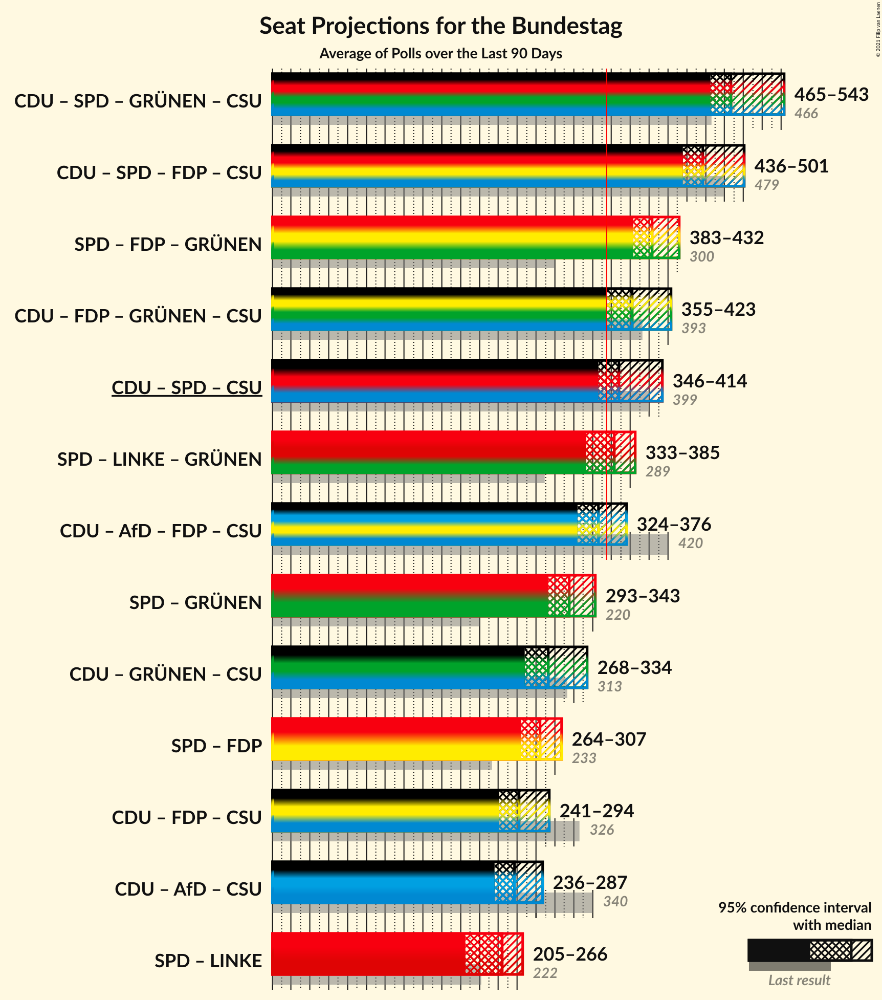

# Overview

The table below lists the most recent polls (less than 90 days old) registered and analyzed so far.

| Period     | Polling firm/Commissioner(s) | CDU | SPD | AfD | FDP | LINKE | GRÜNEN | CSU |
|:----------:|:----------------------------:|:--:|:--:|:--:|:--:|:--:|:--:|:--:|
| 24 September 2017 | General Election | 26.8%   200 | 20.5%   153 | 12.6%   94 | 10.7%   80 | 9.2%   69 | 8.9%   67 | 6.2%   46 |
| N/A | [Poll Average](average.html) | 28–34%   215–263 | 13–17%   99–131 | 7–12%   54–93 | 4–8%   0–62 | 6–10%   47–77 | 15–21%   112–159 | 6–9%   44–67 |
| [8–13 June 2020](2020-06-13-Forsa.html) | Forsa | N/A   N/A | N/A   N/A | N/A   N/A | N/A   N/A | N/A   N/A | N/A   N/A | N/A   N/A |
| [5–8 June 2020](2020-06-08-INSAandYouGov.html) | INSA and YouGov | 29–33%   216–246 | 13–16%   94–117 | 9–11%   66–86 | 5–8%   41–57 | 7–10%   55–73 | 16–19%   119–145 | 6–8%   46–62 |
| [2–3 June 2020](2020-06-03-Infratestdimap.html) | Infratest dimap | 29–33%   213–251 | 13–17%   99–126 | 8–11%   58–78 | 5–7%   0–54 | 7–9%   50–70 | 17–21%   127–157 | 6–9%   44–64 |
| [28 May–3 June 2020](2020-06-03-Emnid.html) | Emnid | 29–33%   220–255 | 13–17%   103–130 | 7–10%   49–73 | 6–8%   43–64 | 7–10%   50–74 | 14–18%   110–138 | 6–9%   44–68 |
| [26–28 May 2020](2020-05-28-ForschungsgruppeWahlen.html) | Forschungsgruppe Wahlen | 29–34%   233–269 | 13–17%   103–132 | 8–11%   60–83 | 3–5%   0–37 | 7–10%   53–72 | 17–21%   131–167 | 6–9%   47–69 |
| [20–26 May 2020](2020-05-26-YouGov.html) | YouGov | 28–32%   213–256 | 13–17%   101–134 | 10–13%   73–100 | 4–6%   0–47 | 8–11%   59–83 | 14–18%   109–142 | 6–8%   45–65 |
| [6–14 May 2020](2020-05-14-Allensbach.html) | Allensbach | 28–34%   211–261 | 13–18%   103–139 | 7–11%   56–85 | 4–7%   0–53 | 6–9%   44–69 | 17–21%   126–165 | 6–9%   43–69 |
| 24 September 2017 | General Election | 26.8%   200 | 20.5%   153 | 12.6%   94 | 10.7%   80 | 9.2%   69 | 8.9%   67 | 6.2%   46 |

Only polls for which at least the sample size has been published are included in the table above.

**Legend:**
+ **Top half of each row:** Voting intentions (95% confidence interval)
+ **Bottom half of each row:** Seat projections for the Bundestag (95% confidence interval)
+ **CDU:** Christlich Demokratische Union Deutschlands
+ **SPD:** Sozialdemokratische Partei Deutschlands
+ **AfD:** Alternative für Deutschland
+ **FDP:** Freie Demokratische Partei
+ **LINKE:** Die Linke
+ **GRÜNEN:** Bündnis 90/Die Grünen
+ **CSU:** Christlich-Soziale Union in Bayern
+ **N/A (single party):** Party not included the published results
+ **N/A (entire row):** Calculation for this opinion poll not started yet

