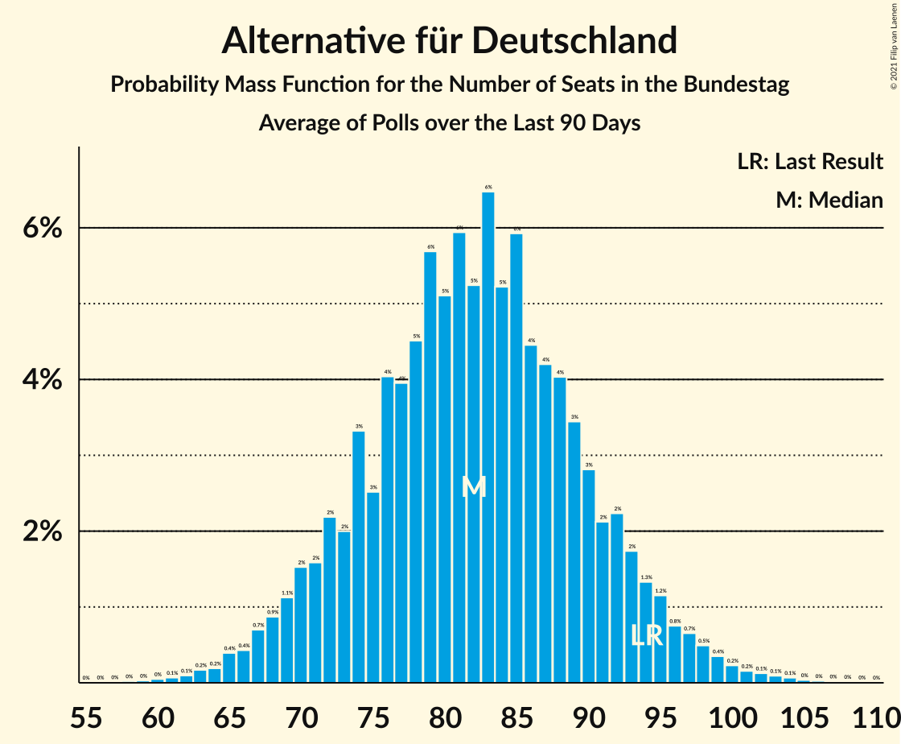

# Alternative für Deutschland

<a href="#voting-intentions">Voting Intentions</a> | <a href="#seats">Seats</a>

## Voting Intentions

Last result: **12.6%** (General Election of 24 September 2017)

### Confidence Intervals

| Period     | Polling firm/Commissioner(s) | Median | 80% Confidence Interval | 90% Confidence Interval | 95% Confidence Interval | 99% Confidence Interval |
|:----------:|:----------------:|:-----------:|:-----------------------:|:-----------------------:|:-----------------------:|:-----------------------:|
| N/A | [Poll Average](average.html) | 10.1% | 8.6–12.1% | 8.2–12.6% | 7.9–12.9% | 7.4–13.5% |
| [6–9 November 2020](2020-11-09-INSAandYouGov.html) | INSA and YouGov | 12.0% | 11.1–13.0% | 10.9–13.3% | 10.7–13.5% | 10.3–14.0% |
| [4–9 November 2020](2020-11-09-GMS.html) | GMS | 10.0% | N/A | N/A | N/A | N/A |
| [2–6 November 2020](2020-11-06-Forsa.html) | Forsa | 10.0% | 9.2–10.9% | 8.9–11.2% | 8.7–11.4% | 8.4–11.9% |
| [29 October–4 November 2020](2020-11-04-Emnid.html) | Emnid | 9.0% | 8.1–10.0% | 7.8–10.3% | 7.6–10.6% | 7.2–11.1% |
| [26–30 October 2020](2020-10-30-Forsa.html) | Forsa | 10.0% | N/A | N/A | N/A | N/A |
| [22–26 October 2020](2020-10-26-YouGov.html) | YouGov | 12.0% | N/A | N/A | N/A | N/A |
| [19–23 October 2020](2020-10-23-Forsa.html) | Forsa | 9.0% | 8.2–9.9% | 8.0–10.2% | 7.8–10.4% | 7.5–10.8% |
| [20–22 October 2020](2020-10-22-ForschungsgruppeWahlen.html) | Forschungsgruppe Wahlen | 9.0% | 8.1–10.1% | 7.8–10.4% | 7.6–10.7% | 7.1–11.3% |
| [15–20 October 2020](2020-10-20-Emnid.html) | Emnid | 11.0% | 10.0–12.1% | 9.7–12.5% | 9.5–12.8% | 9.0–13.3% |
| [7–20 October 2020](2020-10-20-Allensbach.html) | Allensbach | 10.0% | 8.9–11.3% | 8.6–11.7% | 8.4–12.0% | 7.9–12.7% |
| [16–19 October 2020](2020-10-19-INSAandYouGov.html) | INSA and YouGov | 11.5% | 10.7–12.5% | 10.4–12.7% | 10.2–13.0% | 9.8–13.4% |
| [12–16 October 2020](2020-10-16-Forsa.html) | Forsa | 9.0% | 8.2–9.9% | 8.0–10.2% | 7.8–10.4% | 7.5–10.8% |
| [12–14 October 2020](2020-10-14-Infratestdimap.html) | Infratest dimap | 11.0% | 9.8–12.3% | 9.5–12.7% | 9.2–13.0% | 8.7–13.7% |
| [8–14 October 2020](2020-10-14-Emnid.html) | Emnid | 10.0% | 9.3–10.9% | 9.1–11.1% | 8.9–11.3% | 8.5–11.7% |
| [9–12 October 2020](2020-10-12-INSAandYouGov.html) | INSA and YouGov | 11.0% | 10.2–11.9% | 9.9–12.2% | 9.7–12.4% | 9.3–12.9% |
| [7–12 October 2020](2020-10-12-GMS.html) | GMS | 10.0% | 8.9–11.4% | 8.6–11.8% | 8.3–12.1% | 7.8–12.7% |
| [5–9 October 2020](2020-10-09-Forsa.html) | Forsa | 9.0% | 8.2–9.9% | 8.0–10.1% | 7.8–10.3% | 7.5–10.8% |
| [6–8 October 2020](2020-10-08-ForschungsgruppeWahlen.html) | Forschungsgruppe Wahlen | 10.0% | 9.0–11.2% | 8.7–11.5% | 8.4–11.8% | 8.0–12.4% |
| [1–7 October 2020](2020-10-07-Emnid.html) | Emnid | 9.0% | 8.1–10.1% | 7.8–10.3% | 7.6–10.6% | 7.2–11.1% |
| [2–5 October 2020](2020-10-05-INSAandYouGov.html) | INSA and YouGov | 11.5% | 10.7–12.5% | 10.4–12.7% | 10.2–13.0% | 9.8–13.4% |
| [29 September–2 October 2020](2020-10-02-Forsa.html) | Forsa | 9.0% | 8.2–9.9% | 8.0–10.2% | 7.8–10.4% | 7.5–10.8% |
| [28–30 September 2020](2020-09-30-Infratestdimap.html) | Infratest dimap | 10.0% | 9.1–11.1% | 8.8–11.4% | 8.6–11.6% | 8.1–12.1% |
| [22–30 September 2020](2020-09-30-Emnid.html) | Emnid | 11.0% | 10.2–11.9% | 10.0–12.1% | 9.8–12.3% | 9.4–12.8% |
| [25–28 September 2020](2020-09-28-INSAandYouGov.html) | INSA and YouGov | 11.5% | 10.6–12.4% | 10.4–12.7% | 10.2–12.9% | 9.8–13.4% |
| [21–25 September 2020](2020-09-25-Forsa.html) | Forsa | 9.0% | 8.2–9.9% | 8.0–10.2% | 7.8–10.4% | 7.5–10.8% |
| [17–23 September 2020](2020-09-23-Emnid.html) | Emnid | 11.0% | 10.0–12.1% | 9.8–12.4% | 9.5–12.7% | 9.1–13.2% |
| [19–21 September 2020](2020-09-21-YouGov.html) | YouGov | 12.0% | 10.9–13.3% | 10.6–13.6% | 10.3–13.9% | 9.8–14.5% |
| [18–21 September 2020](2020-09-21-INSAandYouGov.html) | INSA and YouGov | 12.0% | 11.1–13.0% | 10.9–13.2% | 10.7–13.5% | 10.3–13.9% |
| [14–18 September 2020](2020-09-18-Forsa.html) | Forsa | 8.0% | 7.3–8.8% | 7.0–9.1% | 6.9–9.3% | 6.5–9.7% |
| [15–16 September 2020](2020-09-16-Infratestdimap.html) | Infratest dimap | 10.0% | 8.9–11.3% | 8.6–11.6% | 8.3–12.0% | 7.8–12.6% |
| [14–16 September 2020](2020-09-16-ForschungsgruppeWahlen.html) | Forschungsgruppe Wahlen | 10.0% | 9.0–11.2% | 8.7–11.5% | 8.4–11.8% | 8.0–12.4% |
| [10–16 September 2020](2020-09-16-Emnid.html) | Emnid | 11.0% | 10.0–12.1% | 9.8–12.4% | 9.5–12.7% | 9.1–13.2% |
| [4–16 September 2020](2020-09-16-Allensbach.html) | Allensbach | 9.0% | 8.0–10.3% | 7.7–10.6% | 7.4–10.9% | 7.0–11.5% |
| [11–14 September 2020](2020-09-14-INSAandYouGov.html) | INSA and YouGov | 11.5% | 10.6–12.5% | 10.4–12.7% | 10.2–13.0% | 9.8–13.4% |
| [7–11 September 2020](2020-09-11-Forsa.html) | Forsa | 9.0% | 8.2–9.9% | 8.0–10.1% | 7.8–10.3% | 7.4–10.8% |
| [3–9 September 2020](2020-09-09-Emnid.html) | Emnid | 10.0% | 9.1–11.1% | 8.8–11.4% | 8.6–11.7% | 8.1–12.2% |
| [4–7 September 2020](2020-09-07-INSAandYouGov.html) | INSA and YouGov | 11.0% | 10.1–11.9% | 9.9–12.2% | 9.7–12.4% | 9.3–12.9% |
| [31 August–4 September 2020](2020-09-04-Forsa.html) | Forsa | 9.0% | 8.2–9.9% | 8.0–10.2% | 7.8–10.4% | 7.5–10.8% |
| [31 August–2 September 2020](2020-09-02-Infratestdimap.html) | Infratest dimap | 10.0% | 9.1–11.1% | 8.8–11.4% | 8.6–11.6% | 8.2–12.2% |
| [27 August–2 September 2020](2020-09-02-Emnid.html) | Emnid | 11.0% | 10.0–12.1% | 9.7–12.4% | 9.5–12.7% | 9.0–13.3% |
| [28–31 August 2020](2020-08-31-INSAandYouGov.html) | INSA and YouGov | 11.0% | 10.1–11.9% | 9.9–12.2% | 9.7–12.4% | 9.3–12.9% |
| [24–28 August 2020](2020-08-28-Forsa.html) | Forsa | 9.0% | 8.2–9.9% | 8.0–10.1% | 7.8–10.3% | 7.4–10.8% |
| [25–27 August 2020](2020-08-27-ForschungsgruppeWahlen.html) | Forschungsgruppe Wahlen | 9.0% | 8.0–10.1% | 7.8–10.4% | 7.5–10.7% | 7.1–11.2% |
| [18–26 August 2020](2020-08-26-Emnid.html) | Emnid | 11.0% | 10.1–12.1% | 9.8–12.4% | 9.6–12.7% | 9.1–13.2% |
| [20–24 August 2020](2020-08-24-YouGov.html) | YouGov | 11.0% | 10.0–12.1% | 9.8–12.3% | 9.5–12.6% | 9.1–13.1% |
| [21–24 August 2020](2020-08-24-INSAandYouGov.html) | INSA and YouGov | 11.0% | 10.0–12.1% | 9.8–12.4% | 9.5–12.6% | 9.1–13.2% |
| [17–21 August 2020](2020-08-21-Forsa.html) | Forsa | 9.0% | 8.2–9.9% | 8.0–10.2% | 7.8–10.4% | 7.5–10.8% |
| [18–19 August 2020](2020-08-19-Infratestdimap.html) | Infratest dimap | 10.0% | 8.9–11.3% | 8.6–11.7% | 8.4–12.0% | 7.9–12.7% |
| [13–19 August 2020](2020-08-19-Emnid.html) | Emnid | 10.0% | 9.2–10.9% | 9.0–11.2% | 8.8–11.4% | 8.4–11.8% |
| [5–18 August 2020](2020-08-18-Allensbach.html) | Allensbach | 9.0% | 8.0–10.2% | 7.8–10.5% | 7.5–10.8% | 7.1–11.3% |
| [14–17 August 2020](2020-08-17-INSAandYouGov.html) | INSA and YouGov | 11.0% | 10.2–11.9% | 9.9–12.2% | 9.7–12.4% | 9.3–12.9% |
| [10–14 August 2020](2020-08-14-Forsa.html) | Forsa | 9.0% | 8.2–9.9% | 8.0–10.2% | 7.8–10.4% | 7.5–10.8% |
| [6–12 August 2020](2020-08-12-Emnid.html) | Emnid | 11.0% | 10.1–12.0% | 9.9–12.2% | 9.6–12.5% | 9.3–13.0% |
| [11 August 2020](2020-08-11-INSAandYouGov.html) | INSA and YouGov | 11.0% | 9.8–12.3% | 9.5–12.7% | 9.2–13.0% | 8.7–13.7% |
| [3–7 August 2020](2020-08-07-Forsa.html) | Forsa | 8.0% | 7.3–8.8% | 7.0–9.1% | 6.9–9.3% | 6.5–9.7% |
| [30 July–6 August 2020](2020-08-06-Emnid.html) | Emnid | 11.0% | 10.0–12.1% | 9.8–12.4% | 9.5–12.7% | 9.1–13.2% |
| [3–5 August 2020](2020-08-05-Infratestdimap.html) | Infratest dimap | 11.0% | 10.0–12.1% | 9.7–12.4% | 9.5–12.7% | 9.1–13.2% |
| [30 July–4 August 2020](2020-08-04-YouGov.html) | YouGov | 11.0% | 10.1–12.1% | 9.8–12.4% | 9.6–12.7% | 9.2–13.2% |
| [31 July–3 August 2020](2020-08-03-INSAandYouGov.html) | INSA and YouGov | 11.0% | 10.2–11.9% | 9.9–12.2% | 9.7–12.4% | 9.3–12.9% |
| [27–31 July 2020](2020-07-31-Forsa.html) | Forsa | 8.0% | 7.2–8.8% | 7.0–9.1% | 6.9–9.3% | 6.5–9.7% |
| [28–30 July 2020](2020-07-30-ForschungsgruppeWahlen.html) | Forschungsgruppe Wahlen | 9.0% | 8.0–10.1% | 7.7–10.4% | 7.5–10.7% | 7.1–11.2% |
| [23–29 July 2020](2020-07-29-Emnid.html) | Emnid | 10.0% | 9.1–11.1% | 8.8–11.4% | 8.6–11.7% | 8.1–12.2% |
| [24–27 July 2020](2020-07-27-INSAandYouGov.html) | INSA and YouGov | 11.0% | 10.1–11.9% | 9.9–12.2% | 9.7–12.4% | 9.3–12.9% |
| [22–27 July 2020](2020-07-27-GMS.html) | GMS | 10.0% | 8.8–11.3% | 8.5–11.7% | 8.3–12.0% | 7.8–12.7% |
| [20–24 July 2020](2020-07-24-Forsa.html) | Forsa | 9.0% | 8.2–9.9% | 8.0–10.2% | 7.8–10.4% | 7.5–10.8% |
| [21–22 July 2020](2020-07-22-Infratestdimap.html) | Infratest dimap | 11.0% | 9.8–12.3% | 9.5–12.7% | 9.3–13.0% | 8.7–13.7% |
| [16–22 July 2020](2020-07-22-Emnid.html) | Emnid | 11.0% | 10.1–11.9% | 9.9–12.2% | 9.7–12.4% | 9.3–12.9% |
| [17–20 July 2020](2020-07-20-INSAandYouGov.html) | INSA and YouGov | 10.0% | 9.2–10.9% | 9.0–11.2% | 8.8–11.4% | 8.4–11.8% |
| [13–16 July 2020](2020-07-16-Forsa.html) | Forsa | 9.0% | 8.2–9.9% | 8.0–10.1% | 7.8–10.3% | 7.4–10.8% |
| [3–16 July 2020](2020-07-16-Allensbach.html) | Allensbach | 9.0% | 8.0–10.1% | 7.7–10.4% | 7.5–10.7% | 7.1–11.3% |
| [9–15 July 2020](2020-07-15-Emnid.html) | Emnid | 10.0% | 9.1–11.1% | 8.8–11.4% | 8.6–11.7% | 8.1–12.2% |
| [10–13 July 2020](2020-07-13-INSAandYouGov.html) | INSA and YouGov | 11.0% | 10.2–12.0% | 9.9–12.2% | 9.7–12.5% | 9.3–12.9% |
| [6–10 July 2020](2020-07-10-Forsa.html) | Forsa | 10.0% | 9.2–10.9% | 8.9–11.2% | 8.7–11.4% | 8.3–11.9% |
| [7–9 July 2020](2020-07-09-ForschungsgruppeWahlen.html) | Forschungsgruppe Wahlen | 9.0% | 8.0–10.1% | 7.7–10.4% | 7.5–10.7% | 7.1–11.3% |
| [2–8 July 2020](2020-07-08-Emnid.html) | Emnid | 11.0% | 10.0–12.1% | 9.7–12.5% | 9.5–12.7% | 9.0–13.3% |
| [3–6 July 2020](2020-07-06-INSAandYouGov.html) | INSA and YouGov | 11.0% | 10.1–11.9% | 9.9–12.2% | 9.7–12.4% | 9.3–12.9% |
| [29 June–3 July 2020](2020-07-03-Forsa.html) | Forsa | 10.0% | 9.2–11.0% | 8.9–11.2% | 8.7–11.5% | 8.3–12.0% |
| [24 June–2 July 2020](2020-07-02-Emnid.html) | Emnid | 10.0% | 9.1–11.1% | 8.8–11.4% | 8.6–11.7% | 8.1–12.2% |
| [29 June–1 July 2020](2020-07-01-Infratestdimap.html) | Infratest dimap | 10.0% | 9.0–11.1% | 8.8–11.3% | 8.6–11.6% | 8.1–12.1% |
| [26–29 June 2020](2020-06-29-INSAandYouGov.html) | INSA and YouGov | 10.5% | 9.6–11.4% | 9.4–11.7% | 9.2–11.9% | 8.8–12.3% |
| [22–26 June 2020](2020-06-26-Forsa.html) | Forsa | 10.0% | 9.2–11.0% | 8.9–11.2% | 8.7–11.5% | 8.3–12.0% |
| [23–25 June 2020](2020-06-25-ForschungsgruppeWahlen.html) | Forschungsgruppe Wahlen | 9.0% | 8.0–10.1% | 7.7–10.4% | 7.5–10.7% | 7.0–11.3% |
| [23–24 June 2020](2020-06-24-Infratestdimap.html) | Infratest dimap | 10.0% | 8.9–11.3% | 8.6–11.7% | 8.4–12.0% | 7.8–12.6% |
| [18–24 June 2020](2020-06-24-Emnid.html) | Emnid | 10.0% | 9.1–11.1% | 8.8–11.3% | 8.6–11.6% | 8.2–12.1% |
| [18–22 June 2020](2020-06-22-YouGov.html) | YouGov | 11.0% | 10.1–12.1% | 9.8–12.4% | 9.6–12.6% | 9.1–13.1% |
| [19–22 June 2020](2020-06-22-INSAandYouGov.html) | INSA and YouGov | 10.0% | 9.2–10.9% | 9.0–11.2% | 8.8–11.4% | 8.4–11.8% |
| [15–19 June 2020](2020-06-19-Forsa.html) | Forsa | 9.0% | 8.2–9.9% | 8.0–10.2% | 7.8–10.4% | 7.4–10.9% |
| [10–17 June 2020](2020-06-17-Emnid.html) | Emnid | 10.0% | 9.2–10.8% | 9.0–11.1% | 8.8–11.3% | 8.5–11.7% |
| [12–15 June 2020](2020-06-15-INSAandYouGov.html) | INSA and YouGov | 10.0% | 9.2–10.9% | 9.0–11.2% | 8.8–11.4% | 8.4–11.8% |
| [9–15 June 2020](2020-06-15-GMS.html) | GMS | 9.0% | 7.9–10.2% | 7.6–10.6% | 7.4–10.9% | 6.9–11.6% |
| [8–13 June 2020](2020-06-13-Forsa.html) | Forsa | 8.0% | 7.2–8.9% | 7.0–9.1% | 6.8–9.3% | 6.5–9.8% |
| [1–13 June 2020](2020-06-13-Allensbach.html) | Allensbach | 9.5% | 8.5–10.6% | 8.3–10.9% | 8.0–11.2% | 7.6–11.8% |
| [8–10 June 2020](2020-06-10-ForschungsgruppeWahlen.html) | Forschungsgruppe Wahlen | 9.0% | 8.0–10.1% | 7.7–10.4% | 7.5–10.7% | 7.1–11.2% |
| [4–9 June 2020](2020-06-09-Emnid.html) | Emnid | 9.0% | 8.2–9.9% | 8.0–10.1% | 7.8–10.4% | 7.4–10.8% |
| [5–8 June 2020](2020-06-08-INSAandYouGov.html) | INSA and YouGov | 10.0% | 9.2–10.9% | 9.0–11.2% | 8.8–11.4% | 8.4–11.8% |
| [2–5 June 2020](2020-06-05-Forsa.html) | Forsa | 8.0% | 7.2–9.0% | 6.9–9.3% | 6.7–9.5% | 6.3–10.0% |
| [2–3 June 2020](2020-06-03-Infratestdimap.html) | Infratest dimap | 9.0% | 8.1–10.0% | 7.8–10.3% | 7.6–10.5% | 7.2–11.0% |
| [28 May–3 June 2020](2020-06-03-Emnid.html) | Emnid | 8.0% | 7.1–9.0% | 6.9–9.3% | 6.7–9.5% | 6.3–10.0% |
| [29 May–2 June 2020](2020-06-02-INSAandYouGov.html) | INSA and YouGov | 10.0% | 9.2–10.9% | 9.0–11.2% | 8.8–11.4% | 8.4–11.8% |
| [27–29 May 2020](2020-05-29-Forsa.html) | Forsa | 9.0% | 8.0–10.2% | 7.7–10.5% | 7.4–10.8% | 7.0–11.4% |
| [26–28 May 2020](2020-05-28-ForschungsgruppeWahlen.html) | Forschungsgruppe Wahlen | 9.0% | 8.1–10.1% | 7.8–10.4% | 7.6–10.6% | 7.2–11.2% |
| [20–26 May 2020](2020-05-26-YouGov.html) | YouGov | 11.0% | 10.0–12.1% | 9.8–12.4% | 9.5–12.6% | 9.1–13.2% |
| [20–26 May 2020](2020-05-26-Emnid.html) | Emnid | 9.0% | 8.2–9.9% | 8.0–10.1% | 7.8–10.4% | 7.4–10.8% |
| [22–25 May 2020](2020-05-25-INSAandYouGov.html) | INSA and YouGov | 9.5% | 8.7–10.4% | 8.5–10.6% | 8.3–10.9% | 7.9–11.3% |
| [18–22 May 2020](2020-05-22-Forsa.html) | Forsa | 9.0% | 8.1–10.0% | 7.8–10.3% | 7.6–10.5% | 7.2–11.1% |
| [14–19 May 2020](2020-05-19-Emnid.html) | Emnid | 10.0% | 9.1–10.9% | 8.9–11.2% | 8.7–11.4% | 8.3–11.9% |
| [15–18 May 2020](2020-05-18-INSAandYouGov.html) | INSA and YouGov | 10.5% | 9.7–11.4% | 9.5–11.7% | 9.3–11.9% | 8.9–12.4% |
| [11–15 May 2020](2020-05-15-Forsa.html) | Forsa | 9.0% | 8.2–9.9% | 8.0–10.1% | 7.8–10.4% | 7.4–10.8% |
| [12–14 May 2020](2020-05-14-ForschungsgruppeWahlen.html) | Forschungsgruppe Wahlen | 10.0% | 9.0–11.1% | 8.7–11.5% | 8.5–11.8% | 8.0–12.3% |
| [6–14 May 2020](2020-05-14-Allensbach.html) | Allensbach | 9.0% | 7.9–10.2% | 7.6–10.6% | 7.4–10.9% | 6.9–11.5% |
| [12–13 May 2020](2020-05-13-Infratestdimap.html) | Infratest dimap | 10.0% | 8.9–11.2% | 8.6–11.6% | 8.3–11.9% | 7.8–12.5% |
| [7–13 May 2020](2020-05-13-Emnid.html) | Emnid | 11.0% | 10.0–12.1% | 9.7–12.4% | 9.5–12.6% | 9.1–13.2% |
| [8–11 May 2020](2020-05-11-INSAandYouGov.html) | INSA and YouGov | 11.0% | 10.2–11.9% | 9.9–12.2% | 9.7–12.5% | 9.3–12.9% |
| [4–8 May 2020](2020-05-08-Forsa.html) | Forsa | 10.0% | 9.3–10.8% | 9.0–11.0% | 8.9–11.2% | 8.5–11.6% |
| [4–6 May 2020](2020-05-06-Infratestdimap.html) | Infratest dimap | 9.0% | 8.1–10.0% | 7.8–10.3% | 7.6–10.5% | 7.2–11.1% |
| [30 April–6 May 2020](2020-05-06-Emnid.html) | Emnid | 12.0% | 10.9–13.2% | 10.7–13.5% | 10.4–13.8% | 9.9–14.4% |
| [1–4 May 2020](2020-05-04-INSAandYouGov.html) | INSA and YouGov | 11.0% | 10.2–11.9% | 9.9–12.2% | 9.7–12.4% | 9.3–12.9% |
| [27–30 April 2020](2020-04-30-Forsa.html) | Forsa | 10.0% | 9.0–11.1% | 8.8–11.4% | 8.6–11.6% | 8.1–12.1% |
| [22–29 April 2020](2020-04-29-Emnid.html) | Emnid | 12.0% | 10.9–13.2% | 10.7–13.5% | 10.4–13.8% | 9.9–14.4% |
| [23–27 April 2020](2020-04-27-YouGov.html) | YouGov | 11.0% | 10.1–12.1% | 9.8–12.4% | 9.6–12.6% | 9.1–13.1% |
| [24–27 April 2020](2020-04-27-INSAandYouGov.html) | INSA and YouGov | 10.5% | 9.6–11.4% | 9.4–11.7% | 9.2–11.9% | 8.8–12.3% |
| [20–27 April 2020](2020-04-27-GMS.html) | GMS | 10.0% | 8.9–11.3% | 8.5–11.7% | 8.3–12.0% | 7.8–12.7% |
| [20–24 April 2020](2020-04-24-Forsa.html) | Forsa | 9.0% | 8.2–9.9% | 8.0–10.1% | 7.8–10.4% | 7.4–10.8% |
| [20–23 April 2020](2020-04-23-ForschungsgruppeWahlen.html) | Forschungsgruppe Wahlen | 9.0% | 8.0–10.1% | 7.8–10.4% | 7.6–10.7% | 7.1–11.2% |
| [16–22 April 2020](2020-04-22-Emnid.html) | Emnid | 11.0% | 10.1–11.9% | 9.9–12.2% | 9.7–12.4% | 9.3–12.9% |
| [17–20 April 2020](2020-04-20-INSAandYouGov.html) | INSA and YouGov | 10.5% | 9.7–11.4% | 9.4–11.7% | 9.3–11.9% | 8.9–12.4% |
| [14–17 April 2020](2020-04-17-Forsa.html) | Forsa | 10.0% | 9.1–11.1% | 8.8–11.4% | 8.6–11.6% | 8.1–12.1% |
| [14–15 April 2020](2020-04-15-Infratestdimap.html) | Infratest dimap | 9.0% | 7.9–10.2% | 7.7–10.6% | 7.4–10.9% | 6.9–11.5% |
| [9–15 April 2020](2020-04-15-Emnid.html) | Emnid | 9.0% | 8.1–10.0% | 7.9–10.3% | 7.7–10.5% | 7.3–11.0% |
| [1–15 April 2020](2020-04-15-Allensbach.html) | Allensbach | 9.0% | 8.0–10.2% | 7.7–10.5% | 7.5–10.8% | 7.0–11.4% |
| [9–14 April 2020](2020-04-14-INSAandYouGov.html) | INSA and YouGov | 10.5% | 9.7–11.4% | 9.4–11.6% | 9.2–11.9% | 8.9–12.3% |
| [6–9 April 2020](2020-04-09-Forsa.html) | Forsa | 10.0% | 9.2–10.9% | 8.9–11.2% | 8.7–11.4% | 8.4–11.8% |
| [6–8 April 2020](2020-04-08-ForschungsgruppeWahlen.html) | Forschungsgruppe Wahlen | 10.0% | 9.0–11.3% | 8.7–11.6% | 8.4–11.9% | 8.0–12.5% |
| [2–8 April 2020](2020-04-08-Emnid.html) | Emnid | 10.0% | 9.2–10.9% | 8.9–11.2% | 8.7–11.4% | 8.3–11.9% |
| [3–6 April 2020](2020-04-06-INSAandYouGov.html) | INSA and YouGov | 10.0% | 9.2–10.9% | 9.0–11.1% | 8.8–11.4% | 8.4–11.8% |
| [30 March–3 April 2020](2020-04-03-Forsa.html) | Forsa | 9.0% | 8.2–9.9% | 8.0–10.2% | 7.8–10.4% | 7.4–10.8% |
| [30 March–1 April 2020](2020-04-01-Infratestdimap.html) | Infratest dimap | 10.0% | 9.1–11.1% | 8.8–11.4% | 8.6–11.6% | 8.1–12.1% |
| [25 March–1 April 2020](2020-04-01-Emnid.html) | Emnid | 11.0% | 10.0–12.1% | 9.7–12.5% | 9.5–12.7% | 9.0–13.3% |
| [27–30 March 2020](2020-03-30-YouGov.html) | YouGov | 12.0% | 11.0–13.1% | 10.7–13.4% | 10.5–13.7% | 10.1–14.2% |
| [27–30 March 2020](2020-03-30-INSAandYouGov.html) | INSA and YouGov | 12.0% | 11.1–13.0% | 10.9–13.2% | 10.6–13.5% | 10.2–13.9% |
| [23–27 March 2020](2020-03-27-Forsa.html) | Forsa | 9.0% | 8.2–9.9% | 8.0–10.1% | 7.8–10.4% | 7.4–10.8% |
| [23–26 March 2020](2020-03-26-ForschungsgruppeWahlen.html) | Forschungsgruppe Wahlen | 10.0% | 9.0–11.1% | 8.8–11.4% | 8.6–11.6% | 8.1–12.2% |
| [23–25 March 2020](2020-03-25-Forsa.html) | Forsa | 9.0% | 8.0–10.2% | 7.7–10.5% | 7.5–10.8% | 7.0–11.4% |
| [18–25 March 2020](2020-03-25-Emnid.html) | Emnid | 11.0% | 10.0–12.2% | 9.8–12.5% | 9.5–12.8% | 9.1–13.3% |
| [20–23 March 2020](2020-03-23-INSAandYouGov.html) | INSA and YouGov | 12.0% | 11.1–13.0% | 10.9–13.2% | 10.6–13.5% | 10.2–13.9% |
| [16–20 March 2020](2020-03-20-Forsa.html) | Forsa | 9.0% | 8.2–9.9% | 8.0–10.1% | 7.8–10.4% | 7.4–10.8% |
| [17–18 March 2020](2020-03-18-Infratestdimap.html) | Infratest dimap | 10.0% | 8.9–11.4% | 8.6–11.7% | 8.4–12.0% | 7.8–12.7% |
| [12–18 March 2020](2020-03-18-Emnid.html) | Emnid | 13.0% | 11.9–14.1% | 11.7–14.4% | 11.4–14.7% | 10.9–15.3% |
| [5–18 March 2020](2020-03-18-Allensbach.html) | Allensbach | 11.5% | 10.4–12.7% | 10.1–13.1% | 9.8–13.4% | 9.3–14.0% |
| [13–16 March 2020](2020-03-16-INSAandYouGov.html) | INSA and YouGov | 13.0% | 12.1–14.0% | 11.8–14.3% | 11.6–14.5% | 11.2–15.0% |
| [9–13 March 2020](2020-03-13-Forsa.html) | Forsa | 10.0% | 9.2–10.9% | 8.9–11.2% | 8.7–11.4% | 8.4–11.9% |
| [4–11 March 2020](2020-03-11-Emnid.html) | Emnid | 14.0% | 12.9–15.3% | 12.6–15.6% | 12.3–15.9% | 11.8–16.5% |
| [6–9 March 2020](2020-03-09-INSAandYouGov.html) | INSA and YouGov | 14.0% | 13.0–15.0% | 12.8–15.3% | 12.6–15.6% | 12.1–16.1% |
| [2–6 March 2020](2020-03-06-Forsa.html) | Forsa | 11.0% | 10.1–12.0% | 9.9–12.3% | 9.6–12.5% | 9.2–13.0% |
| [3–5 March 2020](2020-03-05-ForschungsgruppeWahlen.html) | Forschungsgruppe Wahlen | 14.0% | 12.8–15.3% | 12.5–15.7% | 12.2–16.0% | 11.7–16.7% |
| [2–4 March 2020](2020-03-04-Infratestdimap.html) | Infratest dimap | 12.0% | 11.0–13.1% | 10.7–13.4% | 10.4–13.7% | 10.0–14.3% |
| [27 February–4 March 2020](2020-03-04-Emnid.html) | Emnid | 14.0% | 12.9–15.2% | 12.5–15.6% | 12.3–15.9% | 11.8–16.5% |
| [28 February–2 March 2020](2020-03-02-YouGov.html) | YouGov | 14.0% | 12.9–15.1% | 12.6–15.5% | 12.4–15.7% | 11.9–16.3% |
| [28 February–2 March 2020](2020-03-02-INSAandYouGov.html) | INSA and YouGov | 13.5% | 12.6–14.5% | 12.3–14.8% | 12.1–15.0% | 11.6–15.5% |
| [24–28 February 2020](2020-02-28-Forsa.html) | Forsa | 10.0% | 9.2–11.0% | 8.9–11.2% | 8.7–11.4% | 8.3–11.9% |
| [20–27 February 2020](2020-02-27-Emnid.html) | Emnid | 14.0% | 12.9–15.2% | 12.6–15.5% | 12.3–15.8% | 11.8–16.4% |
| [21–24 February 2020](2020-02-24-INSAandYouGov.html) | INSA and YouGov | 13.0% | 12.1–14.0% | 11.8–14.3% | 11.6–14.5% | 11.2–15.0% |
| [17–21 February 2020](2020-02-21-Forsa.html) | Forsa | 10.0% | 9.2–10.9% | 8.9–11.2% | 8.7–11.4% | 8.4–11.9% |
| [13–19 February 2020](2020-02-19-Emnid.html) | Emnid | 14.0% | 12.8–15.2% | 12.5–15.6% | 12.3–15.9% | 11.7–16.5% |
| [14–17 February 2020](2020-02-17-INSAandYouGov.html) | INSA and YouGov | 15.0% | 14.0–16.1% | 13.8–16.4% | 13.5–16.6% | 13.1–17.1% |
| [10–14 February 2020](2020-02-14-Forsa.html) | Forsa | 11.0% | 10.1–11.9% | 9.9–12.2% | 9.7–12.4% | 9.3–12.9% |
| [11–13 February 2020](2020-02-13-Infratestdimap.html) | Infratest dimap | 14.0% | 12.7–15.5% | 12.3–15.9% | 12.0–16.3% | 11.4–17.0% |
| [6–12 February 2020](2020-02-12-Emnid.html) | Emnid | 15.0% | 14.0–16.1% | 13.7–16.4% | 13.5–16.7% | 13.0–17.2% |
| [1–12 February 2020](2020-02-12-Allensbach.html) | Allensbach | 13.0% | 11.8–14.3% | 11.5–14.6% | 11.2–15.0% | 10.7–15.6% |
| [7–10 February 2020](2020-02-10-INSAandYouGov.html) | INSA and YouGov | 14.0% | 13.1–15.0% | 12.8–15.3% | 12.6–15.6% | 12.1–16.1% |
| [3–7 February 2020](2020-02-07-Forsa.html) | Forsa | 10.0% | 9.3–10.8% | 9.0–11.0% | 8.9–11.2% | 8.5–11.6% |
| [4–6 February 2020](2020-02-06-ForschungsgruppeWahlen.html) | Forschungsgruppe Wahlen   ZDF | 14.0% | 12.7–15.4% | 12.3–15.8% | 12.0–16.2% | 11.4–16.9% |
| [3–5 February 2020](2020-02-05-Infratestdimap.html) | Infratest dimap | 14.0% | 12.9–15.2% | 12.6–15.5% | 12.3–15.8% | 11.8–16.4% |
| [30 January–5 February 2020](2020-02-05-Emnid.html) | Emnid | 15.0% | 14.0–16.1% | 13.7–16.4% | 13.4–16.7% | 13.0–17.2% |
| [31 January–3 February 2020](2020-02-03-INSAandYouGov.html) | INSA and YouGov | 14.0% | 13.0–15.0% | 12.8–15.3% | 12.5–15.6% | 12.1–16.1% |
| [27–31 January 2020](2020-01-31-Forsa.html) | Forsa | 11.0% | 10.1–12.0% | 9.9–12.2% | 9.6–12.5% | 9.3–13.0% |
| [23–29 January 2020](2020-01-29-Emnid.html) | Emnid | 14.0% | 12.9–15.2% | 12.6–15.6% | 12.3–15.9% | 11.8–16.5% |
| [24–27 January 2020](2020-01-27-INSAandYouGov.html) | INSA and YouGov | 15.0% | 14.0–16.0% | 13.7–16.3% | 13.5–16.6% | 13.1–17.1% |
| [20–24 January 2020](2020-01-24-Forsa.html) | Forsa | 12.0% | 11.2–12.9% | 11.0–13.1% | 10.8–13.4% | 10.4–13.8% |
| [21–22 January 2020](2020-01-22-Infratestdimap.html) | Infratest dimap   ARD | 14.0% | 12.7–15.5% | 12.3–15.9% | 12.0–16.2% | 11.4–17.0% |
| [16–22 January 2020](2020-01-22-Emnid.html) | Emnid | 15.0% | 14.0–16.0% | 13.8–16.3% | 13.5–16.6% | 13.1–17.1% |
| [9–22 January 2020](2020-01-22-Allensbach.html) | Allensbach | 13.0% | 11.8–14.3% | 11.5–14.6% | 11.2–14.9% | 10.7–15.6% |
| [17–20 January 2020](2020-01-20-INSAandYouGov.html) | INSA and YouGov | 15.0% | 14.0–16.0% | 13.7–16.3% | 13.5–16.6% | 13.1–17.1% |
| [13–17 January 2020](2020-01-17-Forsa.html) | Forsa | 13.0% | 12.1–14.0% | 11.8–14.3% | 11.6–14.6% | 11.1–15.1% |
| [13–15 January 2020](2020-01-15-ForschungsgruppeWahlen.html) | Forschungsgruppe Wahlen   ZDF | 14.0% | 12.8–15.3% | 12.5–15.7% | 12.2–16.0% | 11.6–16.6% |
| [9–15 January 2020](2020-01-15-Emnid.html) | Emnid | 14.0% | 13.0–15.0% | 12.8–15.3% | 12.5–15.6% | 12.1–16.1% |
| [10–13 January 2020](2020-01-13-INSAandYouGov.html) | INSA and YouGov | 15.0% | 14.0–16.1% | 13.7–16.4% | 13.5–16.6% | 13.1–17.1% |
| [6–10 January 2020](2020-01-10-Forsa.html) | Forsa | 13.0% | 12.1–14.1% | 11.8–14.4% | 11.6–14.6% | 11.2–15.1% |
| [7–8 January 2020](2020-01-08-Infratestdimap.html) | Infratest dimap   ARD | 14.0% | 12.9–15.2% | 12.6–15.6% | 12.3–15.9% | 11.8–16.5% |
| [19 December 2019–8 January 2020](2020-01-08-Emnid.html) | Emnid | 14.0% | 13.0–15.1% | 12.7–15.4% | 12.5–15.7% | 12.0–16.2% |
| [3–6 January 2020](2020-01-06-INSAandYouGov.html) | INSA and YouGov | 14.0% | 13.1–15.0% | 12.8–15.3% | 12.6–15.6% | 12.1–16.1% |
| [27 December 2019–2 January 2020](2020-01-02-GMS.html) | GMS | 14.0% | 12.7–15.5% | 12.3–16.0% | 12.0–16.3% | 11.4–17.1% |
| [20–23 December 2019](2019-12-23-INSAandYouGov.html) | INSA and YouGov | 15.0% | 14.0–16.1% | 13.7–16.4% | 13.5–16.6% | 13.0–17.1% |
| [16–20 December 2019](2019-12-20-Forsa.html) | Forsa | 13.0% | 12.0–14.0% | 11.8–14.3% | 11.6–14.6% | 11.1–15.1% |
| [12–18 December 2019](2019-12-18-Emnid.html) | Emnid   Bild am Sonntag | 14.0% | 13.0–15.1% | 12.7–15.4% | 12.5–15.7% | 12.1–16.2% |
| [13–17 December 2019](2019-12-17-YouGov.html) | YouGov | 15.0% | 13.9–16.2% | 13.6–16.6% | 13.3–16.9% | 12.8–17.5% |
| [13–16 December 2019](2019-12-16-INSAandYouGov.html) | INSA and YouGov | 15.0% | 14.0–16.1% | 13.7–16.4% | 13.5–16.6% | 13.0–17.1% |
| [9–13 December 2019](2019-12-13-Forsa.html) | Forsa | 13.0% | 12.1–14.0% | 11.8–14.3% | 11.6–14.6% | 11.2–15.1% |
| [10–12 December 2019](2019-12-12-ForschungsgruppeWahlen.html) | Forschungsgruppe Wahlen   ZDF | 14.0% | 12.8–15.3% | 12.5–15.6% | 12.2–15.9% | 11.7–16.6% |
| [10–11 December 2019](2019-12-11-Infratestdimap.html) | Infratest dimap   ARD | 15.0% | 14.1–15.9% | 13.9–16.2% | 13.6–16.4% | 13.2–16.9% |
| [5–11 December 2019](2019-12-11-Emnid.html) | Emnid   Bild am Sonntag | 13.0% | 12.1–14.0% | 11.8–14.3% | 11.6–14.6% | 11.1–15.1% |
| [1–11 December 2019](2019-12-11-Allensbach.html) | Allensbach | 15.0% | 13.8–16.4% | 13.5–16.8% | 13.2–17.1% | 12.6–17.8% |
| [6–9 December 2019](2019-12-09-INSAandYouGov.html) | INSA and YouGov | 14.7% | 13.7–15.8% | 13.5–16.1% | 13.2–16.3% | 12.8–16.8% |
| [2–6 December 2019](2019-12-06-Forsa.html) | Forsa | 14.0% | 13.1–14.9% | 12.9–15.2% | 12.7–15.4% | 12.3–15.9% |
| [2–4 December 2019](2019-12-04-Infratestdimap.html) | Infratest dimap   ARD | 15.0% | 13.9–16.2% | 13.5–16.6% | 13.3–16.9% | 12.8–17.5% |
| [28 November–4 December 2019](2019-12-04-Emnid.html) | Emnid   Bild am Sonntag | 13.0% | 12.1–14.1% | 11.8–14.4% | 11.6–14.6% | 11.1–15.1% |
| [29 November–2 December 2019](2019-12-02-INSAandYouGov.html) | INSA and YouGov | 15.0% | 14.0–16.1% | 13.7–16.4% | 13.5–16.6% | 13.1–17.1% |
| [27 November–2 December 2019](2019-12-02-GMS.html) | GMS | 15.0% | 13.7–16.6% | 13.3–17.0% | 13.0–17.4% | 12.3–18.2% |
| [25–29 November 2019](2019-11-29-Forsa.html) | Forsa | 13.0% | 12.0–14.0% | 11.8–14.3% | 11.6–14.6% | 11.1–15.1% |
| [26–28 November 2019](2019-11-28-ForschungsgruppeWahlen.html) | Forschungsgruppe Wahlen   ZDF | 14.0% | 12.9–15.3% | 12.5–15.7% | 12.3–16.0% | 11.7–16.6% |
| [20–27 November 2019](2019-11-27-Emnid.html) | Emnid   Bild am Sonntag | 14.0% | 13.0–15.0% | 12.7–15.3% | 12.5–15.6% | 12.0–16.1% |
| [22–26 November 2019](2019-11-26-YouGov.html) | YouGov | 15.0% | 13.9–16.2% | 13.6–16.5% | 13.3–16.8% | 12.8–17.4% |
| [22–25 November 2019](2019-11-25-INSAandYouGov.html) | INSA and YouGov | 14.0% | 13.1–15.0% | 12.8–15.3% | 12.6–15.6% | 12.1–16.1% |
| [18–22 November 2019](2019-11-22-Forsa.html) | Forsa | 13.0% | 12.1–14.1% | 11.8–14.3% | 11.6–14.6% | 11.2–15.1% |
| [13–20 November 2019](2019-11-20-Emnid.html) | Emnid   Bild am Sonntag | 13.0% | 12.1–14.1% | 11.8–14.4% | 11.6–14.6% | 11.1–15.1% |
| [15–18 November 2019](2019-11-18-INSAandYouGov.html) | INSA and YouGov | 14.9% | 14.2–15.7% | 14.0–15.9% | 13.9–16.0% | 13.5–16.4% |
| [11–15 November 2019](2019-11-15-Forsa.html) | Forsa | 13.0% | 12.0–14.0% | 11.8–14.3% | 11.6–14.6% | 11.1–15.1% |
| [12–13 November 2019](2019-11-13-Infratestdimap.html) | Infratest dimap   ARD | 14.0% | 12.7–15.4% | 12.3–15.8% | 12.0–16.2% | 11.4–16.9% |
| [7–13 November 2019](2019-11-13-Emnid.html) | Emnid   Bild am Sonntag | 14.0% | 12.9–15.2% | 12.6–15.6% | 12.4–15.9% | 11.9–16.5% |
| [2–13 November 2019](2019-11-13-Allensbach.html) | Allensbach | 14.5% | 13.3–15.8% | 13.0–16.2% | 12.7–16.5% | 12.1–17.2% |
| [8–11 November 2019](2019-11-11-INSAandYouGov.html) | INSA and YouGov | 15.0% | 14.0–16.0% | 13.7–16.3% | 13.5–16.6% | 13.1–17.1% |
| [4–8 November 2019](2019-11-08-Forsa.html) | Forsa | 13.0% | 12.0–14.0% | 11.8–14.3% | 11.6–14.6% | 11.1–15.1% |
| [5–7 November 2019](2019-11-07-ForschungsgruppeWahlen.html) | Forschungsgruppe Wahlen   ZDF | 14.0% | 12.8–15.3% | 12.5–15.7% | 12.2–16.0% | 11.6–16.7% |
| [4–6 November 2019](2019-11-06-Infratestdimap.html) | Infratest dimap   ARD | 14.0% | 12.9–15.2% | 12.6–15.6% | 12.3–15.9% | 11.8–16.4% |
| [30 October–6 November 2019](2019-11-06-Emnid.html) | Emnid   Bild am Sonntag | 14.0% | 12.8–15.2% | 12.5–15.6% | 12.3–15.9% | 11.8–16.5% |
| [31 October–5 November 2019](2019-11-05-YouGov.html) | YouGov | 14.0% | 13.0–15.2% | 12.7–15.5% | 12.4–15.8% | 11.9–16.4% |
| [1–4 November 2019](2019-11-04-INSAandYouGov.html) | INSA and YouGov | 16.0% | 15.0–17.1% | 14.7–17.4% | 14.5–17.7% | 14.0–18.2% |
| [28 October–1 November 2019](2019-11-01-Forsa.html) | Forsa | 13.0% | 12.0–14.1% | 11.8–14.3% | 11.6–14.6% | 11.1–15.1% |
| [24–30 October 2019](2019-10-30-Emnid.html) | Emnid   Bild am Sonntag | 15.0% | 14.0–16.1% | 13.7–16.4% | 13.5–16.7% | 13.0–17.2% |
| [25–28 October 2019](2019-10-28-INSAandYouGov.html) | INSA and YouGov | 15.5% | 14.5–16.6% | 14.3–16.9% | 14.0–17.2% | 13.5–17.7% |
| [21–25 October 2019](2019-10-25-Forsa.html) | Forsa | 13.0% | 12.2–13.9% | 11.9–14.2% | 11.7–14.4% | 11.3–14.8% |
| [17–23 October 2019](2019-10-23-Emnid.html) | Emnid   Bild am Sonntag | 14.0% | 12.9–15.3% | 12.6–15.6% | 12.3–15.9% | 11.8–16.5% |
| [18–21 October 2019](2019-10-21-INSAandYouGov.html) | INSA and YouGov | 15.0% | 14.0–16.0% | 13.7–16.4% | 13.5–16.6% | 13.0–17.1% |
| [14–18 October 2019](2019-10-18-Forsa.html) | Forsa | 13.0% | 12.2–13.9% | 11.9–14.2% | 11.7–14.4% | 11.3–14.8% |
| [15–17 October 2019](2019-10-17-ForschungsgruppeWahlen.html) | Forschungsgruppe Wahlen   ZDF | 13.0% | 11.8–14.3% | 11.5–14.6% | 11.2–15.0% | 10.7–15.6% |
| [14–16 October 2019](2019-10-16-Infratestdimap.html) | Infratest dimap   ARD | 14.0% | 12.7–15.5% | 12.4–15.9% | 12.1–16.3% | 11.5–17.0% |
| [10–16 October 2019](2019-10-16-Emnid.html) | Emnid   Bild am Sonntag | 13.0% | 11.9–14.2% | 11.6–14.6% | 11.4–14.9% | 10.9–15.5% |
| [11–14 October 2019](2019-10-14-INSAandYouGov.html) | INSA and YouGov | 15.0% | 14.0–16.1% | 13.8–16.4% | 13.5–16.6% | 13.1–17.1% |
| [7–11 October 2019](2019-10-11-Forsa.html) | Forsa | 12.0% | 11.1–13.0% | 10.8–13.3% | 10.6–13.5% | 10.2–14.0% |
| [29 September–10 October 2019](2019-10-10-Allensbach.html) | Allensbach | 13.0% | 11.8–14.3% | 11.5–14.7% | 11.2–15.0% | 10.7–15.7% |
| [7–9 October 2019](2019-10-09-Infratestdimap.html) | Infratest dimap   ARD | 14.0% | 12.9–15.2% | 12.6–15.6% | 12.4–15.9% | 11.9–16.5% |
| [2–9 October 2019](2019-10-09-Emnid.html) | Emnid   Bild am Sonntag | 15.0% | 14.0–16.1% | 13.7–16.4% | 13.4–16.7% | 13.0–17.2% |
| [4–7 October 2019](2019-10-07-INSAandYouGov.html) | INSA and YouGov | 16.0% | 15.0–17.1% | 14.7–17.4% | 14.4–17.6% | 14.0–18.2% |
| [1–7 October 2019](2019-10-07-GMS.html) | GMS | 15.0% | 13.6–16.5% | 13.2–16.9% | 12.9–17.3% | 12.3–18.1% |
| [30 September–4 October 2019](2019-10-04-Forsa.html) | Forsa | 13.0% | 12.1–14.0% | 11.8–14.3% | 11.6–14.6% | 11.1–15.1% |
| [27 September–1 October 2019](2019-10-01-YouGov.html) | YouGov | 15.0% | 13.9–16.2% | 13.6–16.6% | 13.3–16.9% | 12.8–17.5% |
| [26 September–1 October 2019](2019-10-01-Emnid.html) | Emnid   Bild am Sonntag | 15.0% | 13.8–16.2% | 13.5–16.6% | 13.2–16.9% | 12.7–17.5% |
| [27–30 September 2019](2019-09-30-INSAandYouGov.html) | INSA and YouGov | 16.0% | 15.0–17.1% | 14.7–17.4% | 14.5–17.6% | 14.0–18.2% |
| [23–27 September 2019](2019-09-27-Forsa.html) | Forsa | 13.0% | 12.1–14.0% | 11.8–14.3% | 11.6–14.6% | 11.2–15.1% |
| [24–26 September 2019](2019-09-26-ForschungsgruppeWahlen.html) | Forschungsgruppe Wahlen   ZDF | 14.0% | 12.9–15.3% | 12.5–15.7% | 12.3–16.0% | 11.7–16.7% |
| [19–25 September 2019](2019-09-25-Emnid.html) | Emnid   Bild am Sonntag | 15.0% | 13.9–16.2% | 13.6–16.5% | 13.4–16.8% | 12.9–17.3% |
| [20–23 September 2019](2019-09-23-INSAandYouGov.html) | INSA and YouGov | 16.0% | 15.0–17.1% | 14.7–17.4% | 14.4–17.6% | 14.0–18.2% |
| [16–20 September 2019](2019-09-20-Forsa.html) | Forsa | 13.0% | 12.1–14.0% | 11.8–14.3% | 11.6–14.6% | 11.2–15.1% |
| [17–18 September 2019](2019-09-18-Infratestdimap.html) | Infratest dimap   ARD | 14.0% | 12.7–15.4% | 12.3–15.8% | 12.0–16.2% | 11.4–16.9% |
| [12–18 September 2019](2019-09-18-Emnid.html) | Emnid   Bild am Sonntag | 14.0% | 12.9–15.1% | 12.6–15.5% | 12.4–15.7% | 11.9–16.3% |
| [13–16 September 2019](2019-09-16-INSAandYouGov.html) | INSA and YouGov | 16.0% | 15.0–17.1% | 14.7–17.4% | 14.4–17.6% | 14.0–18.2% |
| [9–13 September 2019](2019-09-13-Forsa.html) | Forsa | 14.0% | 13.0–15.1% | 12.8–15.4% | 12.5–15.6% | 12.1–16.1% |
| [6–12 September 2019](2019-09-12-GMS.html) | GMS | 12.0% | 10.8–13.5% | 10.5–13.9% | 10.2–14.2% | 9.6–14.9% |
| [1–12 September 2019](2019-09-12-Allensbach.html) | Allensbach | 14.0% | 12.8–15.4% | 12.5–15.7% | 12.2–16.1% | 11.7–16.7% |
| [5–11 September 2019](2019-09-11-Emnid.html) | Emnid   Bild am Sonntag | 15.0% | 14.2–15.9% | 13.9–16.1% | 13.7–16.4% | 13.3–16.8% |
| [6–10 September 2019](2019-09-10-YouGov.html) | YouGov | 14.0% | 12.9–15.1% | 12.6–15.5% | 12.4–15.7% | 11.9–16.3% |
| [6–9 September 2019](2019-09-09-INSAandYouGov.html) | INSA and YouGov | 15.5% | 14.5–16.6% | 14.2–16.9% | 14.0–17.1% | 13.5–17.7% |
| [2–6 September 2019](2019-09-06-Forsa.html) | Forsa | 13.0% | 12.1–14.0% | 11.8–14.3% | 11.6–14.5% | 11.2–15.0% |
| [3–4 September 2019](2019-09-04-Infratestdimap.html) | Infratest dimap   ARD | 15.0% | 13.9–16.2% | 13.5–16.6% | 13.3–16.9% | 12.8–17.5% |
| [2–4 September 2019](2019-09-04-ForschungsgruppeWahlen.html) | Forschungsgruppe Wahlen   ZDF | 13.0% | 11.8–14.3% | 11.5–14.6% | 11.2–15.0% | 10.7–15.6% |
| [29 August–4 September 2019](2019-09-04-Emnid.html) | Emnid   Bild am Sonntag | 14.0% | 13.0–15.1% | 12.7–15.4% | 12.5–15.7% | 12.1–16.2% |
| [30 August–2 September 2019](2019-09-02-INSAandYouGov.html) | INSA and YouGov | 15.0% | 14.0–16.1% | 13.8–16.4% | 13.5–16.7% | 13.1–17.2% |
| [26–30 August 2019](2019-08-30-Forsa.html) | Forsa | 12.2% | 11.3–13.2% | 11.1–13.5% | 10.9–13.7% | 10.5–14.2% |
| [22–28 August 2019](2019-08-28-Emnid.html) | Emnid   Bild am Sonntag | 14.0% | 12.9–15.3% | 12.6–15.6% | 12.3–15.9% | 11.8–16.5% |
| [23–26 August 2019](2019-08-26-INSAandYouGov.html) | INSA and YouGov | 15.0% | 14.0–16.1% | 13.8–16.4% | 13.5–16.6% | 13.1–17.1% |
| [19–23 August 2019](2019-08-23-Forsa.html) | Forsa | 13.0% | 12.1–14.0% | 11.8–14.3% | 11.6–14.6% | 11.1–15.1% |
| [20–21 August 2019](2019-08-21-Infratestdimap.html) | Infratest dimap   ARD | 14.0% | 12.7–15.5% | 12.4–15.9% | 12.1–16.2% | 11.5–17.0% |
| [15–21 August 2019](2019-08-21-Emnid.html) | Emnid   Bild am Sonntag | 14.0% | 12.9–15.2% | 12.6–15.5% | 12.4–15.8% | 11.9–16.4% |
| [16–19 August 2019](2019-08-19-INSAandYouGov.html) | INSA and YouGov | 14.3% | 13.4–15.4% | 13.1–15.7% | 12.9–15.9% | 12.5–16.4% |
| [12–16 August 2019](2019-08-16-Forsa.html) | Forsa | 13.0% | 12.0–14.0% | 11.8–14.3% | 11.6–14.6% | 11.1–15.1% |
| [2–15 August 2019](2019-08-15-Allensbach.html) | Allensbach | 12.5% | 11.4–13.8% | 11.1–14.2% | 10.8–14.5% | 10.3–15.1% |
| [8–14 August 2019](2019-08-14-Emnid.html) | Emnid   Bild am Sonntag | 14.0% | 13.0–15.1% | 12.8–15.4% | 12.5–15.7% | 12.1–16.2% |
| [9–11 August 2019](2019-08-11-INSAandYouGov.html) | INSA and YouGov | 14.5% | 13.5–15.6% | 13.3–15.9% | 13.0–16.1% | 12.6–16.6% |
| [5–9 August 2019](2019-08-09-Forsa.html) | Forsa | 13.0% | 12.1–14.0% | 11.8–14.3% | 11.6–14.6% | 11.2–15.1% |
| [6–8 August 2019](2019-08-08-ForschungsgruppeWahlen.html) | Forschungsgruppe Wahlen   ZDF | 13.0% | 11.9–14.3% | 11.6–14.6% | 11.3–15.0% | 10.8–15.6% |
| [1–7 August 2019](2019-08-07-Emnid.html) | Emnid   Bild am Sonntag | 14.0% | 13.1–14.9% | 12.9–15.2% | 12.7–15.4% | 12.2–15.9% |
| [2–5 August 2019](2019-08-05-INSAandYouGov.html) | INSA and YouGov | 15.0% | 14.0–16.0% | 13.7–16.3% | 13.5–16.6% | 13.0–17.1% |
| [29 July–2 August 2019](2019-08-02-Forsa.html) | Forsa | 13.0% | 12.1–14.1% | 11.8–14.3% | 11.6–14.6% | 11.2–15.1% |
| [29–31 July 2019](2019-07-31-Infratestdimap.html) | Infratest dimap   ARD | 14.0% | 12.9–15.2% | 12.6–15.5% | 12.3–15.8% | 11.8–16.4% |
| [25–31 July 2019](2019-07-31-Emnid.html) | Emnid   Bild am Sonntag | 14.0% | 12.9–15.3% | 12.6–15.6% | 12.3–15.9% | 11.8–16.6% |
| [26–29 July 2019](2019-07-29-YouGov.html) | YouGov | 14.0% | 12.9–15.2% | 12.6–15.5% | 12.4–15.8% | 11.9–16.4% |
| [26–29 July 2019](2019-07-29-INSAandYouGov.html) | INSA and YouGov | 14.5% | 13.5–15.5% | 13.3–15.8% | 13.0–16.1% | 12.6–16.6% |
| [22–26 July 2019](2019-07-26-Forsa.html) | Forsa | 13.0% | 12.1–14.0% | 11.8–14.3% | 11.6–14.5% | 11.2–15.0% |
| [22–24 July 2019](2019-07-24-Infratestdimap.html) | Infratest dimap   ARD | 12.0% | 10.8–13.4% | 10.5–13.8% | 10.2–14.2% | 9.6–14.9% |
| [18–24 July 2019](2019-07-24-Emnid.html) | Emnid   Bild am Sonntag | 13.0% | 12.0–14.2% | 11.7–14.5% | 11.4–14.8% | 10.9–15.4% |
| [19–22 July 2019](2019-07-22-INSAandYouGov.html) | INSA and YouGov | 14.5% | 13.5–15.5% | 13.3–15.8% | 13.1–16.1% | 12.6–16.6% |
| [17–22 July 2019](2019-07-22-GMS.html) | GMS | 12.0% | 10.7–13.4% | 10.4–13.8% | 10.1–14.1% | 9.5–14.8% |
| [15–19 July 2019](2019-07-19-Forsa.html) | Forsa | 12.0% | 11.1–13.0% | 10.9–13.3% | 10.6–13.5% | 10.2–14.0% |
| [16–18 July 2019](2019-07-18-ForschungsgruppeWahlen.html) | Forschungsgruppe Wahlen   ZDF | 12.0% | 10.9–13.3% | 10.6–13.6% | 10.3–13.9% | 9.8–14.5% |
| [11–17 July 2019](2019-07-17-Emnid.html) | Emnid   Bild am Sonntag | 13.0% | 12.1–14.0% | 11.8–14.3% | 11.6–14.6% | 11.1–15.1% |
| [12–15 July 2019](2019-07-15-INSAandYouGov.html) | INSA and YouGov | 14.0% | 13.0–15.0% | 12.8–15.3% | 12.6–15.6% | 12.1–16.1% |
| [8–12 July 2019](2019-07-12-Forsa.html) | Forsa | 13.0% | 12.1–14.0% | 11.8–14.3% | 11.6–14.5% | 11.2–15.0% |
| [1–11 July 2019](2019-07-11-Allensbach.html) | Allensbach | 11.5% | 10.4–12.7% | 10.1–13.1% | 9.8–13.4% | 9.3–14.0% |
| [4–10 July 2019](2019-07-10-Emnid.html) | Emnid   Bild am Sonntag | 13.0% | 12.1–13.9% | 11.9–14.2% | 11.7–14.4% | 11.3–14.9% |
| [5–8 July 2019](2019-07-08-INSAandYouGov.html) | INSA and YouGov | 14.0% | 13.1–15.0% | 12.8–15.3% | 12.6–15.6% | 12.1–16.1% |
| [1–5 July 2019](2019-07-05-Forsa.html) | Forsa | 12.0% | 11.1–13.0% | 10.9–13.2% | 10.6–13.5% | 10.2–14.0% |
| [1–3 July 2019](2019-07-03-Infratestdimap.html) | Infratest dimap   ARD | 13.0% | 11.9–14.2% | 11.7–14.5% | 11.4–14.8% | 10.9–15.4% |
| [27 June–3 July 2019](2019-07-03-Emnid.html) | Emnid   Bild am Sonntag | 14.0% | 13.2–14.9% | 13.0–15.1% | 12.8–15.3% | 12.4–15.7% |
| [28 June–2 July 2019](2019-07-02-YouGov.html) | YouGov | 12.9% | 11.9–14.0% | 11.6–14.3% | 11.4–14.6% | 10.9–15.2% |
| [28 June–1 July 2019](2019-07-01-INSAandYouGov.html) | INSA and YouGov | 14.0% | 13.0–15.0% | 12.8–15.3% | 12.5–15.6% | 12.1–16.1% |
| [24–28 June 2019](2019-06-28-Forsa.html) | Forsa | 12.0% | 11.1–13.0% | 10.9–13.2% | 10.6–13.5% | 10.2–14.0% |
| [24–26 June 2019](2019-06-26-Infratestdimap.html) | Infratest dimap   ARD | 12.0% | N/A | N/A | N/A | N/A |
| [21–26 June 2019](2019-06-26-Emnid.html) | Emnid   Bild am Sonntag | 13.7% | N/A | N/A | N/A | N/A |
| [21–24 June 2019](2019-06-24-INSAandYouGov.html) | INSA and YouGov | 13.5% | N/A | N/A | N/A | N/A |
| [18–24 June 2019](2019-06-24-GMS.html) | GMS | 13.0% | N/A | N/A | N/A | N/A |
| [17–21 June 2019](2019-06-21-Forsa.html) | Forsa | 13.0% | N/A | N/A | N/A | N/A |
| [17–19 June 2019](2019-06-19-ForschungsgruppeWahlen.html) | Forschungsgruppe Wahlen   ZDF | 13.0% | N/A | N/A | N/A | N/A |
| [13–18 June 2019](2019-06-18-Emnid.html) | Emnid   Bild am Sonntag | 14.0% | N/A | N/A | N/A | N/A |
| [14–17 June 2019](2019-06-17-INSAandYouGov.html) | INSA and YouGov | 14.2% | N/A | N/A | N/A | N/A |
| [11–14 June 2019](2019-06-14-Forsa.html) | Forsa | 13.0% | N/A | N/A | N/A | N/A |
| [6–12 June 2019](2019-06-12-Emnid.html) | Emnid   Bild am Sonntag | 13.0% | N/A | N/A | N/A | N/A |
| [1–12 June 2019](2019-06-12-Allensbach.html) | Allensbach | 12.0% | N/A | N/A | N/A | N/A |
| [7–10 June 2019](2019-06-10-INSAandYouGov.html) | INSA and YouGov | 13.5% | N/A | N/A | N/A | N/A |
| [3–7 June 2019](2019-06-07-Forsa.html) | Forsa | 12.0% | N/A | N/A | N/A | N/A |
| [3–5 June 2019](2019-06-05-Infratestdimap.html) | Infratest dimap   ARD | 13.0% | N/A | N/A | N/A | N/A |
| [3–5 June 2019](2019-06-05-ForschungsgruppeWahlen.html) | Forschungsgruppe Wahlen   ZDF | 13.0% | N/A | N/A | N/A | N/A |
| [29 May–5 June 2019](2019-06-05-Emnid.html) | Emnid   Bild am Sonntag | 12.0% | N/A | N/A | N/A | N/A |
| [3 June 2019](2019-06-03-INSAandYouGov.html) | INSA and YouGov | 13.0% | N/A | N/A | N/A | N/A |
| [27–31 May 2019](2019-05-31-Forsa.html) | Forsa | 11.0% | N/A | N/A | N/A | N/A |
| [23–28 May 2019](2019-05-28-Emnid.html) | Emnid   Bild am Sonntag | 13.0% | N/A | N/A | N/A | N/A |
| [24–27 May 2019](2019-05-27-INSAandYouGov.html) | INSA and YouGov | 13.5% | N/A | N/A | N/A | N/A |
| [20–24 May 2019](2019-05-24-Forsa.html) | Forsa | 13.0% | N/A | N/A | N/A | N/A |
| [16–22 May 2019](2019-05-22-Emnid.html) | Emnid   Bild am Sonntag | 13.0% | N/A | N/A | N/A | N/A |
| [17–21 May 2019](2019-05-21-YouGov.html) | YouGov | 12.0% | N/A | N/A | N/A | N/A |
| [17–20 May 2019](2019-05-20-INSAandYouGov.html) | INSA and YouGov | 13.6% | N/A | N/A | N/A | N/A |
| [13–17 May 2019](2019-05-17-Forsa.html) | Forsa | 13.0% | N/A | N/A | N/A | N/A |
| [3–16 May 2019](2019-05-16-Allensbach.html) | Allensbach | 13.0% | N/A | N/A | N/A | N/A |
| [9–15 May 2019](2019-05-15-Emnid.html) | Emnid   Bild am Sonntag | 13.0% | N/A | N/A | N/A | N/A |
| [10–13 May 2019](2019-05-13-INSAandYouGov.html) | INSA and YouGov   Bild | 14.1% | N/A | N/A | N/A | N/A |
| [6–10 May 2019](2019-05-10-Forsa.html) | Forsa   Stern and RTL | 13.0% | N/A | N/A | N/A | N/A |
| [2–8 May 2019](2019-05-08-GMS.html) | GMS | 13.0% | N/A | N/A | N/A | N/A |
| [2–8 May 2019](2019-05-08-Emnid.html) | Emnid   Bild am Sonntag | 13.0% | N/A | N/A | N/A | N/A |
| [3 April–6 May 2019](2019-05-06-INSAandYouGov.html) | INSA and YouGov   Bild | 13.9% | N/A | N/A | N/A | N/A |
| [29 April–3 May 2019](2019-05-03-Forsa.html) | Forsa   Stern and RTL | 13.0% | N/A | N/A | N/A | N/A |
| [29–30 April 2019](2019-04-30-Infratestdimap.html) | Infratest dimap   ARD | 12.0% | N/A | N/A | N/A | N/A |
| [25–30 April 2019](2019-04-30-Emnid.html) | Emnid   Bild am Sonntag | 13.0% | N/A | N/A | N/A | N/A |
| [26–29 April 2019](2019-04-29-YouGov.html) | YouGov   RedaktionsNetzwerk Deutschland | 13.0% | N/A | N/A | N/A | N/A |
| [26–29 April 2019](2019-04-29-INSAandYouGov.html) | INSA and YouGov   Bild | 14.0% | N/A | N/A | N/A | N/A |
| [23–26 April 2019](2019-04-26-Forsa.html) | Forsa   Stern and RTL | 13.0% | N/A | N/A | N/A | N/A |
| [18–24 April 2019](2019-04-24-Emnid.html) | Emnid   Bild am Sonntag | 13.0% | N/A | N/A | N/A | N/A |
| [18–21 April 2019](2019-04-21-INSAandYouGov.html) | INSA and YouGov   Bild | 14.0% | N/A | N/A | N/A | N/A |
| [15–18 April 2019](2019-04-18-Forsa.html) | Forsa   Stern and RTL | 13.0% | N/A | N/A | N/A | N/A |
| [11–17 April 2019](2019-04-17-Emnid.html) | Emnid   Bild am Sonntag | 13.0% | N/A | N/A | N/A | N/A |
| [15–16 April 2019](2019-04-16-Infratestdimap.html) | Infratest dimap   ARD | 13.0% | N/A | N/A | N/A | N/A |
| [12–15 April 2019](2019-04-15-INSAandYouGov.html) | INSA and YouGov   Bild | 14.0% | N/A | N/A | N/A | N/A |
| [8–12 April 2019](2019-04-12-Forsa.html) | Forsa   Stern and RTL | 12.0% | N/A | N/A | N/A | N/A |
| [1–12 April 2019](2019-04-12-Allensbach.html) | Allensbach   Frankfurter Allgemeine Zeitung | 12.5% | N/A | N/A | N/A | N/A |
| [9–11 April 2019](2019-04-11-ForschungsgruppeWahlen.html) | Forschungsgruppe Wahlen   ZDF | 13.0% | N/A | N/A | N/A | N/A |
| [10 April 2019](2019-04-10-Emnid.html) | Emnid   Bild am Sonntag | 12.0% | N/A | N/A | N/A | N/A |
| [5–8 April 2019](2019-04-08-INSAandYouGov.html) | INSA and YouGov   Bild | 14.0% | N/A | N/A | N/A | N/A |
| [1–5 April 2019](2019-04-05-Forsa.html) | Forsa   Stern and RTL | 12.0% | N/A | N/A | N/A | N/A |
| [1–3 April 2019](2019-04-03-Infratestdimap.html) | Infratest dimap   ARD | 12.0% | N/A | N/A | N/A | N/A |
| [28 March–3 April 2019](2019-04-03-GMS.html) | GMS | 13.0% | N/A | N/A | N/A | N/A |
| [28 March–3 April 2019](2019-04-03-Emnid.html) | Emnid   Bild am Sonntag | 12.0% | N/A | N/A | N/A | N/A |
| [28 March–1 April 2019](2019-04-01-INSAandYouGov.html) | INSA and YouGov   Bild | 13.5% | N/A | N/A | N/A | N/A |
| [25–29 March 2019](2019-03-29-Forsa.html) | Forsa   Stern and RTL | 12.0% | N/A | N/A | N/A | N/A |
| [25–27 March 2019](2019-03-27-ForschungsgruppeWahlen.html) | Forschungsgruppe Wahlen   ZDF | 13.0% | N/A | N/A | N/A | N/A |
| [21–27 March 2019](2019-03-27-Emnid.html) | Emnid   Bild am Sonntag | 13.0% | N/A | N/A | N/A | N/A |
| [22–26 March 2019](2019-03-26-YouGov.html) | YouGov   RedaktionsNetzwerk Deutschland | 12.0% | N/A | N/A | N/A | N/A |
| [22–25 March 2019](2019-03-25-INSAandYouGov.html) | INSA and YouGov   Bild | 13.5% | N/A | N/A | N/A | N/A |
| [18–22 March 2019](2019-03-22-Forsa.html) | Forsa   Stern and RTL | 11.0% | N/A | N/A | N/A | N/A |
| [7–21 March 2019](2019-03-21-Allensbach.html) | Allensbach   Frankfurter Allgemeine Zeitung | 12.0% | N/A | N/A | N/A | N/A |
| [19–20 March 2019](2019-03-20-Infratestdimap.html) | Infratest dimap   ARD | 12.0% | N/A | N/A | N/A | N/A |
| [14–20 March 2019](2019-03-20-Emnid.html) | Emnid   Bild am Sonntag | 14.0% | N/A | N/A | N/A | N/A |
| [15–18 March 2019](2019-03-18-INSAandYouGov.html) | INSA and YouGov   Bild | 14.5% | N/A | N/A | N/A | N/A |
| [11–15 March 2019](2019-03-15-Forsa.html) | Forsa   Stern and RTL | 12.0% | N/A | N/A | N/A | N/A |
| [12–14 March 2019](2019-03-14-ForschungsgruppeWahlen.html) | Forschungsgruppe Wahlen   ZDF | 12.0% | N/A | N/A | N/A | N/A |
| [11–13 March 2019](2019-03-13-Infratestdimap.html) | Infratest dimap   ARD | 13.0% | N/A | N/A | N/A | N/A |
| [7–13 March 2019](2019-03-13-Emnid.html) | Emnid   Bild am Sonntag | 13.0% | N/A | N/A | N/A | N/A |
| [8–11 March 2019](2019-03-11-INSAandYouGov.html) | INSA and YouGov   Bild | 14.5% | N/A | N/A | N/A | N/A |
| [4–8 March 2019](2019-03-08-Forsa.html) | Forsa   Stern and RTL | 12.0% | N/A | N/A | N/A | N/A |
| [28 February–6 March 2019](2019-03-06-Emnid.html) | Emnid   Bild am Sonntag | 14.0% | N/A | N/A | N/A | N/A |
| [27 February–1 March 2019](2019-03-01-INSAandYouGov.html) | INSA and YouGov   Bild | 14.5% | N/A | N/A | N/A | N/A |
| [25 February–1 March 2019](2019-03-01-Forsa.html) | Forsa   Stern and RTL | 11.0% | N/A | N/A | N/A | N/A |
| [21–27 February 2019](2019-02-27-GMS.html) | GMS | 14.0% | N/A | N/A | N/A | N/A |
| [21–27 February 2019](2019-02-27-Emnid.html) | Emnid   Bild am Sonntag | 14.0% | N/A | N/A | N/A | N/A |
| [22–26 February 2019](2019-02-26-YouGov.html) | YouGov   RedaktionsNetzwerk Deutschland | 13.0% | N/A | N/A | N/A | N/A |
| [22–25 February 2019](2019-02-25-INSAandYouGov.html) | INSA and YouGov   Bild | 14.0% | N/A | N/A | N/A | N/A |
| [18–22 February 2019](2019-02-22-Forsa.html) | Forsa   Stern and RTL | 12.0% | N/A | N/A | N/A | N/A |
| [19–21 February 2019](2019-02-21-ForschungsgruppeWahlen.html) | Forschungsgruppe Wahlen   ZDF | 13.0% | N/A | N/A | N/A | N/A |
| [19–20 February 2019](2019-02-20-Infratestdimap.html) | Infratest dimap   ARD | 12.0% | N/A | N/A | N/A | N/A |
| [14–20 February 2019](2019-02-20-Emnid.html) | Emnid   Bild am Sonntag | 13.0% | N/A | N/A | N/A | N/A |
| [15–18 February 2019](2019-02-18-INSAandYouGov.html) | INSA and YouGov   Bild | 14.0% | N/A | N/A | N/A | N/A |
| [11–15 February 2019](2019-02-15-Forsa.html) | Forsa   Stern and RTL | 12.0% | N/A | N/A | N/A | N/A |
| [11–13 February 2019](2019-02-13-Infratestdimap.html) | Infratest dimap   ARD | 13.0% | N/A | N/A | N/A | N/A |
| [7–13 February 2019](2019-02-13-Emnid.html) | Emnid   Bild am Sonntag | 13.0% | N/A | N/A | N/A | N/A |
| [1–13 February 2019](2019-02-13-Allensbach.html) | Allensbach   Frankfurter Allgemeine Zeitung | 13.5% | N/A | N/A | N/A | N/A |
| [8–11 February 2019](2019-02-11-INSAandYouGov.html) | INSA and YouGov   Bild | 13.9% | N/A | N/A | N/A | N/A |
| [4–8 February 2019](2019-02-08-Forsa.html) | Forsa   Stern and RTL | 12.0% | N/A | N/A | N/A | N/A |
| [5–7 February 2019](2019-02-07-ForschungsgruppeWahlen.html) | Forschungsgruppe Wahlen   ZDF | 12.0% | N/A | N/A | N/A | N/A |
| [31 January–6 February 2019](2019-02-06-Emnid.html) | Emnid   Bild am Sonntag | 13.0% | N/A | N/A | N/A | N/A |
| [1–4 February 2019](2019-02-04-INSAandYouGov.html) | INSA and YouGov   Bild | 14.0% | N/A | N/A | N/A | N/A |
| [28 January–1 February 2019](2019-02-01-Forsa.html) | Forsa   Stern and RTL | 12.0% | N/A | N/A | N/A | N/A |
| [24–30 January 2019](2019-01-30-Emnid.html) | Emnid   Bild am Sonntag | 15.0% | N/A | N/A | N/A | N/A |
| [25–29 January 2019](2019-01-29-YouGov.html) | YouGov   RedaktionsNetzwerk Deutschland | 14.0% | N/A | N/A | N/A | N/A |
| [25–28 January 2019](2019-01-28-INSAandYouGov.html) | INSA and YouGov   Bild | 14.0% | N/A | N/A | N/A | N/A |
| [21–25 January 2019](2019-01-25-Forsa.html) | Forsa   Stern and RTL | 11.0% | N/A | N/A | N/A | N/A |
| [22–24 January 2019](2019-01-24-ForschungsgruppeWahlen.html) | Forschungsgruppe Wahlen   ZDF | 13.0% | N/A | N/A | N/A | N/A |
| [22–23 January 2019](2019-01-23-Infratestdimap.html) | Infratest dimap   ARD | 15.0% | N/A | N/A | N/A | N/A |
| [16–23 January 2019](2019-01-23-GMS.html) | GMS | 13.0% | N/A | N/A | N/A | N/A |
| [17–23 January 2019](2019-01-23-Emnid.html) | Emnid   Bild am Sonntag | 14.0% | N/A | N/A | N/A | N/A |
| [18–21 January 2019](2019-01-21-INSAandYouGov.html) | INSA and YouGov   Bild | 13.0% | N/A | N/A | N/A | N/A |
| [14–18 January 2019](2019-01-18-Forsa.html) | Forsa   Stern and RTL | 12.0% | N/A | N/A | N/A | N/A |
| [5–17 January 2019](2019-01-17-Allensbach.html) | Allensbach   Frankfurter Allgemeine Zeitung | 13.0% | N/A | N/A | N/A | N/A |
| [10–16 January 2019](2019-01-16-Emnid.html) | Emnid   Bild am Sonntag | 14.0% | N/A | N/A | N/A | N/A |
| [11–14 January 2019](2019-01-14-INSAandYouGov.html) | INSA and YouGov   Bild | 14.5% | N/A | N/A | N/A | N/A |
| [7–11 January 2019](2019-01-11-Forsa.html) | Forsa   Stern and RTL | 12.0% | N/A | N/A | N/A | N/A |
| [8–10 January 2019](2019-01-10-ForschungsgruppeWahlen.html) | Forschungsgruppe Wahlen   ZDF | 14.0% | N/A | N/A | N/A | N/A |
| [7–9 January 2019](2019-01-09-Infratestdimap.html) | Infratest dimap   ARD | 14.0% | N/A | N/A | N/A | N/A |
| [3–9 January 2019](2019-01-09-Emnid.html) | Emnid   Bild am Sonntag | 14.0% | N/A | N/A | N/A | N/A |
| [5–7 January 2019](2019-01-07-INSAandYouGov.html) | INSA and YouGov   Bild | 14.3% | N/A | N/A | N/A | N/A |
| [2–4 January 2019](2019-01-04-Forsa.html) | Forsa   Stern and RTL | 12.0% | N/A | N/A | N/A | N/A |
| [2–3 January 2019](2019-01-03-INSAandYouGov.html) | INSA and YouGov   Bild | 14.0% | N/A | N/A | N/A | N/A |
| [21–27 December 2018](2018-12-27-YouGov.html) | YouGov   RedaktionsNetzwerk Deutschland | 14.0% | N/A | N/A | N/A | N/A |
| [20–21 December 2018](2018-12-21-INSAandYouGov.html) | INSA and YouGov   Bild | 15.0% | N/A | N/A | N/A | N/A |
| [17–21 December 2018](2018-12-21-Forsa.html) | Forsa   Stern and RTL | 13.0% | N/A | N/A | N/A | N/A |
| [13–19 December 2018](2018-12-19-Emnid.html) | Emnid   Bild am Sonntag | 14.0% | N/A | N/A | N/A | N/A |
| [14–17 December 2018](2018-12-17-INSAandYouGov.html) | INSA and YouGov   Bild | 15.0% | N/A | N/A | N/A | N/A |
| [10–14 December 2018](2018-12-14-Forsa.html) | Forsa   Stern and RTL | 12.0% | N/A | N/A | N/A | N/A |
| [11–13 December 2018](2018-12-13-ForschungsgruppeWahlen.html) | Forschungsgruppe Wahlen   ZDF | 15.0% | N/A | N/A | N/A | N/A |
| [11–12 December 2018](2018-12-12-Infratestdimap.html) | Infratest dimap   ARD | 13.0% | N/A | N/A | N/A | N/A |
| [6–12 December 2018](2018-12-12-GMS.html) | GMS | 15.0% | N/A | N/A | N/A | N/A |
| [6–12 December 2018](2018-12-12-Emnid.html) | Emnid   Bild am Sonntag | 14.0% | N/A | N/A | N/A | N/A |
| [1–12 December 2018](2018-12-12-Allensbach.html) | Allensbach   Frankfurter Allgemeine Zeitung | 14.0% | N/A | N/A | N/A | N/A |
| [8–10 December 2018](2018-12-10-INSAandYouGov.html) | INSA and YouGov   Bild | 15.0% | N/A | N/A | N/A | N/A |
| [7–9 December 2018](2018-12-09-Forsa.html) | Forsa   Stern and RTL | 13.0% | N/A | N/A | N/A | N/A |
| [3–6 December 2018](2018-12-06-Forsa.html) | Forsa   Stern and RTL | 13.0% | N/A | N/A | N/A | N/A |
| [3–5 December 2018](2018-12-05-Infratestdimap.html) | Infratest dimap   ARD | 14.0% | N/A | N/A | N/A | N/A |
| [29 November–5 December 2018](2018-12-05-Emnid.html) | Emnid   Bild am Sonntag | 14.0% | N/A | N/A | N/A | N/A |
| [30 November–3 December 2018](2018-12-03-INSAandYouGov.html) | INSA and YouGov   Bild | 16.0% | N/A | N/A | N/A | N/A |
| [26–30 November 2018](2018-11-30-Forsa.html) | Forsa   Stern and RTL | 14.0% | N/A | N/A | N/A | N/A |
| [27–28 November 2018](2018-11-28-Infratestdimap.html) | Infratest dimap   ARD | 15.0% | N/A | N/A | N/A | N/A |
| [22–28 November 2018](2018-11-28-Emnid.html) | Emnid   Bild am Sonntag | 15.0% | N/A | N/A | N/A | N/A |
| [23–27 November 2018](2018-11-27-YouGov.html) | YouGov   RedaktionsNetzwerk Deutschland | 14.0% | N/A | N/A | N/A | N/A |
| [23–26 November 2018](2018-11-26-INSAandYouGov.html) | INSA and YouGov   Bild | 16.0% | N/A | N/A | N/A | N/A |
| [19–23 November 2018](2018-11-23-Forsa.html) | Forsa   Stern and RTL | 14.0% | N/A | N/A | N/A | N/A |
| [20–22 November 2018](2018-11-22-ForschungsgruppeWahlen.html) | Forschungsgruppe Wahlen   ZDF | 16.0% | N/A | N/A | N/A | N/A |
| [15–21 November 2018](2018-11-21-Emnid.html) | Emnid   Bild am Sonntag | 15.0% | N/A | N/A | N/A | N/A |
| [16–19 November 2018](2018-11-19-INSAandYouGov.html) | INSA and YouGov   Bild | 15.5% | N/A | N/A | N/A | N/A |
| [12–16 November 2018](2018-11-16-Forsa.html) | Forsa   Stern and RTL | 12.0% | N/A | N/A | N/A | N/A |
| [2–15 November 2018](2018-11-15-Allensbach.html) | Allensbach | 13.5% | N/A | N/A | N/A | N/A |
| [12–14 November 2018](2018-11-14-Infratestdimap.html) | Infratest dimap   ARD | 14.0% | N/A | N/A | N/A | N/A |
| [8–14 November 2018](2018-11-14-Emnid.html) | Emnid   Bild am Sonntag | 15.0% | N/A | N/A | N/A | N/A |
| [9–12 November 2018](2018-11-12-INSAandYouGov.html) | INSA and YouGov   Bild | 16.7% | N/A | N/A | N/A | N/A |
| [5–9 November 2018](2018-11-09-Forsa.html) | Forsa   Stern and RTL | 13.0% | N/A | N/A | N/A | N/A |
| [6–8 November 2018](2018-11-08-ForschungsgruppeWahlen.html) | Forschungsgruppe Wahlen   ZDF | 14.0% | N/A | N/A | N/A | N/A |
| [5–7 November 2018](2018-11-07-Emnid.html) | Emnid   Bild am Sonntag | 15.0% | N/A | N/A | N/A | N/A |
| [2–5 November 2018](2018-11-05-INSAandYouGov.html) | INSA and YouGov   Bild | 16.8% | N/A | N/A | N/A | N/A |
| [28 October–4 November 2018](2018-11-04-YouGov.html) | YouGov   RedaktionsNetzwerk Deutschland | 16.0% | N/A | N/A | N/A | N/A |
| [29 October–2 November 2018](2018-11-02-Forsa.html) | Forsa   Stern and RTL | 13.0% | N/A | N/A | N/A | N/A |
| [25–31 October 2018](2018-10-31-Emnid.html) | Emnid   Bild am Sonntag | 15.0% | N/A | N/A | N/A | N/A |
| [26–29 October 2018](2018-10-29-INSAandYouGov.html) | INSA and YouGov   Bild | 16.5% | N/A | N/A | N/A | N/A |
| [22–26 October 2018](2018-10-26-Forsa.html) | Forsa   Stern and RTL | 14.0% | N/A | N/A | N/A | N/A |
| [18–24 October 2018](2018-10-24-Emnid.html) | Emnid   Bild am Sonntag | 16.0% | N/A | N/A | N/A | N/A |
| [19–22 October 2018](2018-10-22-INSAandYouGov.html) | INSA and YouGov   Bild | 17.0% | N/A | N/A | N/A | N/A |
| [15–19 October 2018](2018-10-19-Forsa.html) | Forsa   Stern and RTL | 15.0% | N/A | N/A | N/A | N/A |
| [16–18 October 2018](2018-10-18-ForschungsgruppeWahlen.html) | Forschungsgruppe Wahlen   ZDF | 16.0% | N/A | N/A | N/A | N/A |
| [16–17 October 2018](2018-10-17-Infratestdimap.html) | Infratest dimap   ARD | 16.0% | N/A | N/A | N/A | N/A |
| [11–17 October 2018](2018-10-17-Emnid.html) | Emnid   Bild am Sonntag | 15.0% | N/A | N/A | N/A | N/A |
| [12–15 October 2018](2018-10-15-INSAandYouGov.html) | INSA and YouGov   Bild | 18.0% | N/A | N/A | N/A | N/A |
| [8–12 October 2018](2018-10-12-Forsa.html) | Forsa   Stern and RTL | 14.0% | N/A | N/A | N/A | N/A |
| [28 September–11 October 2018](2018-10-11-Allensbach.html) | Allensbach   Frankfurter Allgemeine Zeitung | 15.0% | N/A | N/A | N/A | N/A |
| [8–10 October 2018](2018-10-10-Infratestdimap.html) | Infratest dimap   ARD | 16.0% | N/A | N/A | N/A | N/A |
| [4–10 October 2018](2018-10-10-GMS.html) | GMS | 18.0% | N/A | N/A | N/A | N/A |
| [4–10 October 2018](2018-10-10-Emnid.html) | Emnid   Bild am Sonntag | 15.0% | N/A | N/A | N/A | N/A |
| [5–8 October 2018](2018-10-08-INSAandYouGov.html) | INSA and YouGov   Bild | 18.0% | N/A | N/A | N/A | N/A |
| [1–5 October 2018](2018-10-05-Forsa.html) | Forsa   Stern and RTL | 14.0% | N/A | N/A | N/A | N/A |
| [27 September–2 October 2018](2018-10-02-Emnid.html) | Emnid   Bild am Sonntag | 16.0% | N/A | N/A | N/A | N/A |
| [28 September–1 October 2018](2018-10-01-INSAandYouGov.html) | INSA and YouGov   Bild | 18.5% | N/A | N/A | N/A | N/A |
| [24–28 September 2018](2018-09-28-Forsa.html) | Forsa   Stern and RTL | 15.0% | N/A | N/A | N/A | N/A |
| [25–27 September 2018](2018-09-27-ForschungsgruppeWahlen.html) | Forschungsgruppe Wahlen   ZDF | 16.0% | N/A | N/A | N/A | N/A |
| [20–26 September 2018](2018-09-26-GMS.html) | GMS | 18.0% | N/A | N/A | N/A | N/A |
| [20–26 September 2018](2018-09-26-Emnid.html) | Emnid   Bild am Sonntag | 17.0% | N/A | N/A | N/A | N/A |
| [21–25 September 2018](2018-09-25-YouGov.html) | YouGov   RedaktionsNetzwerk Deutschland | 18.0% | N/A | N/A | N/A | N/A |
| [21–24 September 2018](2018-09-24-INSAandYouGov.html) | INSA and YouGov   Bild | 18.0% | N/A | N/A | N/A | N/A |
| [17–21 September 2018](2018-09-21-Forsa.html) | Forsa   Stern and RTL | 15.0% | N/A | N/A | N/A | N/A |
| [17–19 September 2018](2018-09-19-Infratestdimap.html) | Infratest dimap   ARD | 18.0% | N/A | N/A | N/A | N/A |
| [19 September 2018](2018-09-19-INSAandYouGov.html) | INSA and YouGov   Focus | 17.5% | N/A | N/A | N/A | N/A |
| [13–19 September 2018](2018-09-19-Emnid.html) | Emnid   Bild am Sonntag | 16.0% | N/A | N/A | N/A | N/A |
| [14–17 September 2018](2018-09-17-INSAandYouGov.html) | INSA and YouGov   Bild | 17.5% | N/A | N/A | N/A | N/A |
| [10–14 September 2018](2018-09-14-Forsa.html) | Forsa   Stern and RTL | 13.0% | N/A | N/A | N/A | N/A |
| [11–13 September 2018](2018-09-13-ForschungsgruppeWahlen.html) | Forschungsgruppe Wahlen   ZDF | 15.0% | N/A | N/A | N/A | N/A |
| [1–13 September 2018](2018-09-13-Allensbach.html) | Allensbach   Frankfurter Allgemeine Zeitung | 15.0% | N/A | N/A | N/A | N/A |
| [6–12 September 2018](2018-09-12-Emnid.html) | Emnid   Bild am Sonntag | 15.0% | N/A | N/A | N/A | N/A |
| [7–10 September 2018](2018-09-10-INSAandYouGov.html) | INSA and YouGov   Bild | 17.5% | N/A | N/A | N/A | N/A |
| [4–10 September 2018](2018-09-10-GMS.html) | GMS | 16.0% | N/A | N/A | N/A | N/A |
| [3–7 September 2018](2018-09-07-Forsa.html) | Forsa   Stern and RTL | 14.0% | N/A | N/A | N/A | N/A |
| [3–5 September 2018](2018-09-05-Infratestdimap.html) | Infratest dimap   ARD | 16.0% | N/A | N/A | N/A | N/A |
| [30 August–5 September 2018](2018-09-05-Emnid.html) | Emnid   Bild am Sonntag | 15.0% | N/A | N/A | N/A | N/A |
| [31 August–3 September 2018](2018-09-03-INSAandYouGov.html) | INSA and YouGov   Bild | 17.0% | N/A | N/A | N/A | N/A |
| [27–31 August 2018](2018-08-31-Forsa.html) | Forsa   Stern and RTL | 16.0% | N/A | N/A | N/A | N/A |
| [28–30 August 2018](2018-08-30-ForschungsgruppeWahlen.html) | Forschungsgruppe Wahlen   ZDF | 17.0% | N/A | N/A | N/A | N/A |
| [23–29 August 2018](2018-08-29-Emnid.html) | Emnid   Bild am Sonntag | 15.0% | N/A | N/A | N/A | N/A |
| [24–28 August 2018](2018-08-28-YouGov.html) | YouGov   RedaktionsNetzwerk Deutschland | 17.0% | N/A | N/A | N/A | N/A |
| [24–27 August 2018](2018-08-27-INSAandYouGov.html) | INSA and YouGov   Bild | 16.5% | N/A | N/A | N/A | N/A |
| [20–24 August 2018](2018-08-24-Forsa.html) | Forsa   Stern and RTL | 14.0% | N/A | N/A | N/A | N/A |
| [20–22 August 2018](2018-08-22-Infratestdimap.html) | Infratest dimap   ARD | 17.0% | N/A | N/A | N/A | N/A |
| [16–22 August 2018](2018-08-22-Emnid.html) | Emnid   Bild am Sonntag | 14.0% | N/A | N/A | N/A | N/A |
| [16–20 August 2018](2018-08-20-INSAandYouGov.html) | INSA and YouGov   Bild | 16.0% | N/A | N/A | N/A | N/A |
| [13–17 August 2018](2018-08-17-Forsa.html) | Forsa   Stern and RTL | 14.0% | N/A | N/A | N/A | N/A |
| [9–15 August 2018](2018-08-15-Emnid.html) | Emnid   Bild am Sonntag | 15.0% | N/A | N/A | N/A | N/A |
| [10–13 August 2018](2018-08-13-INSAandYouGov.html) | INSA and YouGov   Bild | 16.9% | N/A | N/A | N/A | N/A |
| [6–10 August 2018](2018-08-10-Forsa.html) | Forsa   Stern and RTL | 14.0% | N/A | N/A | N/A | N/A |
| [7–9 August 2018](2018-08-09-ForschungsgruppeWahlen.html) | Forschungsgruppe Wahlen   ZDF | 16.0% | N/A | N/A | N/A | N/A |
| [27 July–9 August 2018](2018-08-09-Allensbach.html) | Allensbach   Frankfurter Allgemeine Zeitung | 14.5% | N/A | N/A | N/A | N/A |
| [2–8 August 2018](2018-08-08-Emnid.html) | Emnid   Bild am Sonntag | 14.0% | N/A | N/A | N/A | N/A |
| [3–6 August 2018](2018-08-06-INSAandYouGov.html) | INSA and YouGov   Bild | 17.0% | N/A | N/A | N/A | N/A |
| [30 July–3 August 2018](2018-08-03-Forsa.html) | Forsa   Stern and RTL | 14.0% | N/A | N/A | N/A | N/A |
| [30 July–1 August 2018](2018-08-01-Infratestdimap.html) | Infratest dimap   ARD | 17.0% | N/A | N/A | N/A | N/A |
| [26 July–1 August 2018](2018-08-01-Emnid.html) | Emnid   Bild am Sonntag | 15.0% | N/A | N/A | N/A | N/A |
| [25–31 July 2018](2018-07-31-GMS.html) | GMS | 16.0% | N/A | N/A | N/A | N/A |
| [27–30 July 2018](2018-07-30-INSAandYouGov.html) | INSA and YouGov   Bild | 17.5% | N/A | N/A | N/A | N/A |
| [23–27 July 2018](2018-07-27-Forsa.html) | Forsa   Stern and RTL | 14.0% | N/A | N/A | N/A | N/A |
| [24–25 July 2018](2018-07-25-Infratestdimap.html) | Infratest dimap   ARD | 16.0% | N/A | N/A | N/A | N/A |
| [19–25 July 2018](2018-07-25-Emnid.html) | Emnid   Bild am Sonntag | 15.0% | N/A | N/A | N/A | N/A |
| [20–24 July 2018](2018-07-24-YouGov.html) | YouGov   RedaktionsNetzwerk Deutschland | 17.0% | N/A | N/A | N/A | N/A |
| [20–23 July 2018](2018-07-23-INSAandYouGov.html) | INSA and YouGov   Bild | 17.5% | N/A | N/A | N/A | N/A |
| [16–20 July 2018](2018-07-20-Forsa.html) | Forsa   Stern and RTL | 15.0% | N/A | N/A | N/A | N/A |
| [12–18 July 2018](2018-07-18-Emnid.html) | Emnid   Bild am Sonntag | 15.0% | N/A | N/A | N/A | N/A |
| [13–16 July 2018](2018-07-16-INSAandYouGov.html) | INSA and YouGov   Bild | 17.5% | N/A | N/A | N/A | N/A |
| [9–13 July 2018](2018-07-13-Forsa.html) | Forsa   Stern and RTL | 16.0% | N/A | N/A | N/A | N/A |
| [9–12 July 2018](2018-07-12-ForschungsgruppeWahlen.html) | Forschungsgruppe Wahlen   ZDF | 15.0% | N/A | N/A | N/A | N/A |
| [1–12 July 2018](2018-07-12-Allensbach.html) | Allensbach   Frankfurter Allgemeine Zeitung | 15.0% | N/A | N/A | N/A | N/A |
| [5–11 July 2018](2018-07-11-GMS.html) | GMS | 17.0% | N/A | N/A | N/A | N/A |
| [5–11 July 2018](2018-07-11-Emnid.html) | Emnid   Bild am Sonntag | 16.0% | N/A | N/A | N/A | N/A |
| [6–9 July 2018](2018-07-09-INSAandYouGov.html) | INSA and YouGov   Bild | 17.5% | N/A | N/A | N/A | N/A |
| [2–6 July 2018](2018-07-06-Forsa.html) | Forsa   Stern and RTL | 16.0% | N/A | N/A | N/A | N/A |
| [3–4 July 2018](2018-07-04-Infratestdimap.html) | Infratest dimap   ARD | 16.0% | N/A | N/A | N/A | N/A |
| [28 June–4 July 2018](2018-07-04-Emnid.html) | Emnid   Bild am Sonntag | 17.0% | N/A | N/A | N/A | N/A |
| [29 June–2 July 2018](2018-07-02-INSAandYouGov.html) | INSA and YouGov   Bild | 16.5% | N/A | N/A | N/A | N/A |
| [25–29 June 2018](2018-06-29-Forsa.html) | Forsa   Stern and RTL | 15.0% | N/A | N/A | N/A | N/A |
| [25–28 June 2018](2018-06-28-ForschungsgruppeWahlen.html) | Forschungsgruppe Wahlen   ZDF | 14.0% | N/A | N/A | N/A | N/A |
| [21–28 June 2018](2018-06-28-Emnid.html) | Emnid   Bild am Sonntag | 14.0% | N/A | N/A | N/A | N/A |
| [22–26 June 2018](2018-06-26-YouGov.html) | YouGov   RedaktionsNetzwerk Deutschland | 16.0% | N/A | N/A | N/A | N/A |
| [25–26 June 2018](2018-06-26-Infratestdimap.html) | Infratest dimap   ARD | 14.0% | N/A | N/A | N/A | N/A |
| [22–25 June 2018](2018-06-25-INSAandYouGov.html) | INSA and YouGov   Bild | 16.0% | N/A | N/A | N/A | N/A |
| [18–22 June 2018](2018-06-22-Forsa.html) | Forsa   Stern and RTL | 15.0% | N/A | N/A | N/A | N/A |
| [14–20 June 2018](2018-06-20-Emnid.html) | Emnid   Bild am Sonntag | 16.0% | N/A | N/A | N/A | N/A |
| [15–18 June 2018](2018-06-18-INSAandYouGov.html) | INSA and YouGov   Bild | 16.0% | N/A | N/A | N/A | N/A |
| [14–15 June 2018](2018-06-15-Forsa.html) | Forsa   Stern and RTL | 15.0% | N/A | N/A | N/A | N/A |
| [11–13 June 2018](2018-06-13-Infratestdimap.html) | Infratest dimap   ARD | 15.0% | N/A | N/A | N/A | N/A |
| [11–13 June 2018](2018-06-13-Forsa.html) | Forsa   Stern and RTL | 13.0% | N/A | N/A | N/A | N/A |
| [7–13 June 2018](2018-06-13-Emnid.html) | Emnid   Bild am Sonntag | 15.0% | N/A | N/A | N/A | N/A |
| [1–13 June 2018](2018-06-13-Allensbach.html) | Allensbach   Frankfurter Allgemeine Zeitung | 13.0% | N/A | N/A | N/A | N/A |
| [8–11 June 2018](2018-06-11-INSAandYouGov.html) | INSA and YouGov   Bild | 16.0% | N/A | N/A | N/A | N/A |
| [4–8 June 2018](2018-06-08-Forsa.html) | Forsa   Stern and RTL | 13.0% | N/A | N/A | N/A | N/A |
| [5–7 June 2018](2018-06-07-ForschungsgruppeWahlen.html) | Forschungsgruppe Wahlen   ZDF | 13.0% | N/A | N/A | N/A | N/A |
| [30 May–6 June 2018](2018-06-06-Emnid.html) | Emnid   Bild am Sonntag | 14.0% | N/A | N/A | N/A | N/A |
| [1–4 June 2018](2018-06-04-INSAandYouGov.html) | INSA and YouGov   Bild | 16.0% | N/A | N/A | N/A | N/A |
| [28 May–1 June 2018](2018-06-01-Forsa.html) | Forsa   Stern and RTL | 13.0% | N/A | N/A | N/A | N/A |
| [25–29 May 2018](2018-05-29-YouGov.html) | YouGov   RedaktionsNetzwerk Deutschland | 16.0% | N/A | N/A | N/A | N/A |
| [24–29 May 2018](2018-05-29-Emnid.html) | Emnid   Bild am Sonntag | 15.0% | N/A | N/A | N/A | N/A |
| [25–28 May 2018](2018-05-28-INSAandYouGov.html) | INSA and YouGov   Bild | 15.5% | N/A | N/A | N/A | N/A |
| [22–25 May 2018](2018-05-25-Forsa.html) | Forsa   Stern and RTL | 13.0% | N/A | N/A | N/A | N/A |
| [17–23 May 2018](2018-05-23-Emnid.html) | Emnid   Bild am Sonntag | 14.0% | N/A | N/A | N/A | N/A |
| [18–22 May 2018](2018-05-22-INSAandYouGov.html) | INSA and YouGov   Bild | 15.5% | N/A | N/A | N/A | N/A |
| [14–18 May 2018](2018-05-18-Forsa.html) | Forsa   Stern and RTL | 13.0% | N/A | N/A | N/A | N/A |
| [15–17 May 2018](2018-05-17-ForschungsgruppeWahlen.html) | Forschungsgruppe Wahlen   ZDF | 14.0% | N/A | N/A | N/A | N/A |
| [14–16 May 2018](2018-05-16-Infratestdimap.html) | Infratest dimap   ARD | 14.0% | N/A | N/A | N/A | N/A |
| [11–16 May 2018](2018-05-16-GMS.html) | GMS | 14.0% | N/A | N/A | N/A | N/A |
| [9–16 May 2018](2018-05-16-Emnid.html) | Emnid   Bild am Sonntag | 14.0% | N/A | N/A | N/A | N/A |
| [11–14 May 2018](2018-05-14-INSAandYouGov.html) | INSA and YouGov   Bild | 15.5% | N/A | N/A | N/A | N/A |
| [7–11 May 2018](2018-05-11-Forsa.html) | Forsa   Stern and RTL | 13.0% | N/A | N/A | N/A | N/A |
| [7–8 May 2018](2018-05-08-Infratestdimap.html) | Infratest dimap   ARD | 15.0% | N/A | N/A | N/A | N/A |
| [3–8 May 2018](2018-05-08-Emnid.html) | Emnid   Bild am Sonntag | 14.0% | N/A | N/A | N/A | N/A |
| [24 April–8 May 2018](2018-05-08-Allensbach.html) | Allensbach   Frankfurter Allgemeine Zeitung | 11.5% | N/A | N/A | N/A | N/A |
| [4–7 May 2018](2018-05-07-INSAandYouGov.html) | INSA and YouGov   Bild | 15.5% | N/A | N/A | N/A | N/A |
| [30 April–4 May 2018](2018-05-04-Forsa.html) | Forsa   Stern and RTL | 13.0% | N/A | N/A | N/A | N/A |
| [26 April–2 May 2018](2018-05-02-Emnid.html) | Emnid   Bild am Sonntag | 14.0% | N/A | N/A | N/A | N/A |
| [27–30 April 2018](2018-04-30-INSAandYouGov.html) | INSA and YouGov   Bild | 15.5% | N/A | N/A | N/A | N/A |
| [23–27 April 2018](2018-04-27-Forsa.html) | Forsa   Stern and RTL | 12.0% | N/A | N/A | N/A | N/A |
| [20–26 April 2018](2018-04-26-GMS.html) | GMS | 13.0% | N/A | N/A | N/A | N/A |
| [24–26 April 2018](2018-04-26-ForschungsgruppeWahlen.html) | Forschungsgruppe Wahlen   ZDF | 13.0% | N/A | N/A | N/A | N/A |
| [19–25 April 2018](2018-04-25-Emnid.html) | Emnid   Bild am Sonntag | 14.0% | N/A | N/A | N/A | N/A |
| [20–24 April 2018](2018-04-24-YouGov.html) | YouGov   RedaktionsNetzwerk Deutschland | 15.0% | N/A | N/A | N/A | N/A |
| [20–23 April 2018](2018-04-23-INSAandYouGov.html) | INSA and YouGov   Bild | 15.5% | N/A | N/A | N/A | N/A |
| [16–20 April 2018](2018-04-20-Forsa.html) | Forsa   Stern and RTL | 12.0% | N/A | N/A | N/A | N/A |
| [16–18 April 2018](2018-04-18-Infratestdimap.html) | Infratest dimap   ARD | 15.0% | N/A | N/A | N/A | N/A |
| [12–18 April 2018](2018-04-18-Emnid.html) | Emnid   Bild am Sonntag | 13.0% | N/A | N/A | N/A | N/A |
| [3–17 April 2018](2018-04-17-Allensbach.html) | Allensbach   Frankfurter Allgemeine Zeitung | 12.0% | N/A | N/A | N/A | N/A |
| [13–16 April 2018](2018-04-16-INSAandYouGov.html) | INSA and YouGov   Bild | 15.0% | N/A | N/A | N/A | N/A |
| [9–13 April 2018](2018-04-13-Forsa.html) | Forsa   Stern and RTL | 12.0% | N/A | N/A | N/A | N/A |
| [10–12 April 2018](2018-04-12-ForschungsgruppeWahlen.html) | Forschungsgruppe Wahlen   ZDF | 13.0% | N/A | N/A | N/A | N/A |
| [5–11 April 2018](2018-04-11-Emnid.html) | Emnid   Bild am Sonntag | 14.0% | N/A | N/A | N/A | N/A |
| [6–9 April 2018](2018-04-09-INSAandYouGov.html) | INSA and YouGov   Bild | 15.5% | N/A | N/A | N/A | N/A |
| [3–6 April 2018](2018-04-06-Forsa.html) | Forsa   Stern and RTL | 13.0% | N/A | N/A | N/A | N/A |
| [29 March–5 April 2018](2018-04-05-Emnid.html) | Emnid   Bild am Sonntag | 13.0% | N/A | N/A | N/A | N/A |
| [23 March–4 April 2018](2018-04-04-pollytix.html) | pollytix | 15.0% | N/A | N/A | N/A | N/A |
| [3–4 April 2018](2018-04-04-Infratestdimap.html) | Infratest dimap   ARD | 14.0% | N/A | N/A | N/A | N/A |
| [29–31 March 2018](2018-03-31-INSAandYouGov.html) | INSA and YouGov   Bild | 15.0% | N/A | N/A | N/A | N/A |
| [26–29 March 2018](2018-03-29-Forsa.html) | Forsa   Stern and RTL | 13.0% | N/A | N/A | N/A | N/A |
| [22–28 March 2018](2018-03-28-Emnid.html) | Emnid   Bild am Sonntag | 12.0% | N/A | N/A | N/A | N/A |
| [23–27 March 2018](2018-03-27-YouGov.html) | YouGov   RedaktionsNetzwerk Deutschland | 15.0% | N/A | N/A | N/A | N/A |
| [23–26 March 2018](2018-03-26-INSAandYouGov.html) | INSA and YouGov   Bild | 15.0% | N/A | N/A | N/A | N/A |
| [19–23 March 2018](2018-03-23-Forsa.html) | Forsa   Stern and RTL | 14.0% | N/A | N/A | N/A | N/A |
| [20–21 March 2018](2018-03-21-Infratestdimap.html) | Infratest dimap   ARD | 13.0% | N/A | N/A | N/A | N/A |
| [16–21 March 2018](2018-03-21-GMS.html) | GMS | 13.0% | N/A | N/A | N/A | N/A |
| [15–21 March 2018](2018-03-21-Emnid.html) | Emnid   Bild am Sonntag | 13.0% | N/A | N/A | N/A | N/A |
| [16–19 March 2018](2018-03-19-INSAandYouGov.html) | INSA and YouGov   Bild | 15.0% | N/A | N/A | N/A | N/A |
| [12–16 March 2018](2018-03-16-Forsa.html) | Forsa   Stern and RTL | 13.0% | N/A | N/A | N/A | N/A |
| [13–15 March 2018](2018-03-15-ForschungsgruppeWahlen.html) | Forschungsgruppe Wahlen   ZDF | 13.0% | N/A | N/A | N/A | N/A |
| [2–15 March 2018](2018-03-15-Allensbach.html) | Allensbach   Frankfurter Allgemeine Zeitung | 12.5% | N/A | N/A | N/A | N/A |
| [8–14 March 2018](2018-03-14-Emnid.html) | Emnid   Bild am Sonntag | 14.0% | N/A | N/A | N/A | N/A |
| [9–12 March 2018](2018-03-12-INSAandYouGov.html) | INSA and YouGov   Bild | 15.0% | N/A | N/A | N/A | N/A |
| [5–9 March 2018](2018-03-09-Forsa.html) | Forsa   Stern and RTL | 12.0% | N/A | N/A | N/A | N/A |
| [1–7 March 2018](2018-03-07-Emnid.html) | Emnid   Bild am Sonntag | 13.0% | N/A | N/A | N/A | N/A |
| [5 March 2018](2018-03-05-INSAandYouGov.html) | INSA and YouGov   Bild | 15.0% | N/A | N/A | N/A | N/A |
| [4–5 March 2018](2018-03-05-Forsa.html) | Forsa   Stern and RTL | 13.0% | N/A | N/A | N/A | N/A |
| [26 February–2 March 2018](2018-03-02-Forsa.html) | Forsa   Stern and RTL | 13.0% | N/A | N/A | N/A | N/A |
| [26–28 February 2018](2018-02-28-YouGov.html) | YouGov   RedaktionsNetzwerk Deutschland | 16.0% | N/A | N/A | N/A | N/A |
| [26–28 February 2018](2018-02-28-Infratestdimap.html) | Infratest dimap   ARD | 15.0% | N/A | N/A | N/A | N/A |
| [22–28 February 2018](2018-02-28-Emnid.html) | Emnid   Bild am Sonntag | 15.0% | N/A | N/A | N/A | N/A |
| [23–26 February 2018](2018-02-26-INSAandYouGov.html) | INSA and YouGov   Bild | 16.0% | N/A | N/A | N/A | N/A |
| [19–23 February 2018](2018-02-23-Forsa.html) | Forsa   Stern and RTL | 13.0% | N/A | N/A | N/A | N/A |
| [20–22 February 2018](2018-02-22-ForschungsgruppeWahlen.html) | Forschungsgruppe Wahlen   ZDF | 14.0% | N/A | N/A | N/A | N/A |
| [20–21 February 2018](2018-02-21-Infratestdimap.html) | Infratest dimap   ARD | 14.0% | N/A | N/A | N/A | N/A |
| [15–21 February 2018](2018-02-21-Emnid.html) | Emnid   Bild am Sonntag | 15.0% | N/A | N/A | N/A | N/A |
| [16–19 February 2018](2018-02-19-INSAandYouGov.html) | INSA and YouGov   Bild | 16.0% | N/A | N/A | N/A | N/A |
| [12–16 February 2018](2018-02-16-Forsa.html) | Forsa   Stern and RTL | 13.0% | N/A | N/A | N/A | N/A |
| [13–15 February 2018](2018-02-15-Infratestdimap.html) | Infratest dimap   ARD | 15.0% | N/A | N/A | N/A | N/A |
| [2–15 February 2018](2018-02-15-Allensbach.html) | Allensbach   Frankfurter Allgemeine Zeitung | 13.0% | N/A | N/A | N/A | N/A |
| [8–14 February 2018](2018-02-14-Emnid.html) | Emnid   Bild am Sonntag | 14.0% | N/A | N/A | N/A | N/A |
| [9–12 February 2018](2018-02-12-INSAandYouGov.html) | INSA and YouGov   Bild | 15.0% | N/A | N/A | N/A | N/A |
| [7–8 February 2018](2018-02-08-Forsa.html) | Forsa   Stern and RTL | 13.0% | N/A | N/A | N/A | N/A |
| [1–7 February 2018](2018-02-07-GMS.html) | GMS | 14.0% | N/A | N/A | N/A | N/A |
| [1–7 February 2018](2018-02-07-Emnid.html) | Emnid   Bild am Sonntag | 12.0% | N/A | N/A | N/A | N/A |
| [2–5 February 2018](2018-02-05-INSAandYouGov.html) | INSA and YouGov   Bild | 15.0% | N/A | N/A | N/A | N/A |
| [29 January–2 February 2018](2018-02-02-Forsa.html) | Forsa   Stern and RTL | 13.0% | N/A | N/A | N/A | N/A |
| [30 January–1 February 2018](2018-02-01-ForschungsgruppeWahlen.html) | Forschungsgruppe Wahlen   ZDF | 14.0% | N/A | N/A | N/A | N/A |
| [29–31 January 2018](2018-01-31-Infratestdimap.html) | Infratest dimap   ARD | 14.0% | N/A | N/A | N/A | N/A |
| [25–31 January 2018](2018-01-31-Emnid.html) | Emnid   Bild am Sonntag | 13.0% | N/A | N/A | N/A | N/A |
| [26–29 January 2018](2018-01-29-INSAandYouGov.html) | INSA and YouGov   Bild | 14.1% | N/A | N/A | N/A | N/A |
| [22–26 January 2018](2018-01-26-Forsa.html) | Forsa   Stern and RTL | 12.0% | N/A | N/A | N/A | N/A |
| [22–24 January 2018](2018-01-24-Infratestdimap.html) | Infratest dimap   ARD | 12.0% | N/A | N/A | N/A | N/A |
| [18–24 January 2018](2018-01-24-Emnid.html) | Emnid   Bild am Sonntag | 12.0% | N/A | N/A | N/A | N/A |
| [19–23 January 2018](2018-01-23-YouGov.html) | YouGov   RedaktionsNetzwerk Deutschland | 14.0% | N/A | N/A | N/A | N/A |
| [22 January 2018](2018-01-22-INSAandYouGov.html) | INSA and YouGov   Bild | 14.0% | N/A | N/A | N/A | N/A |
| [22 January 2018](2018-01-22-Forsa.html) | Forsa   Stern and RTL | 13.0% | N/A | N/A | N/A | N/A |
| [15–19 January 2018](2018-01-19-Forsa.html) | Forsa   Stern and RTL | 12.0% | N/A | N/A | N/A | N/A |
| [16–18 January 2018](2018-01-18-ForschungsgruppeWahlen.html) | Forschungsgruppe Wahlen   ZDF | 12.0% | N/A | N/A | N/A | N/A |
| [5–18 January 2018](2018-01-18-Allensbach.html) | Allensbach   Frankfurter Allgemeine Zeitung | 12.0% | N/A | N/A | N/A | N/A |
| [15–17 January 2018](2018-01-17-Forsa.html) | Forsa   Stern and RTL | 12.0% | N/A | N/A | N/A | N/A |
| [11–17 January 2018](2018-01-17-Emnid.html) | Emnid   Bild am Sonntag | 13.0% | N/A | N/A | N/A | N/A |
| [12–15 January 2018](2018-01-15-INSAandYouGov.html) | INSA and YouGov   Bild | 14.0% | N/A | N/A | N/A | N/A |
| [8–12 January 2018](2018-01-12-Forsa.html) | Forsa   Stern and RTL | 11.0% | N/A | N/A | N/A | N/A |
| [4–10 January 2018](2018-01-10-Emnid.html) | Emnid   Bild am Sonntag | 13.0% | N/A | N/A | N/A | N/A |
| [5–8 January 2018](2018-01-08-INSAandYouGov.html) | INSA and YouGov   Bild | 13.5% | N/A | N/A | N/A | N/A |
| [2–5 January 2018](2018-01-05-Forsa.html) | Forsa   Stern and RTL | 10.0% | N/A | N/A | N/A | N/A |
| [2–3 January 2018](2018-01-03-Infratestdimap.html) | Infratest dimap   ARD | 13.0% | N/A | N/A | N/A | N/A |
| [21 December 2017–3 January 2018](2018-01-03-Emnid.html) | Emnid   Bild am Sonntag | 12.0% | N/A | N/A | N/A | N/A |
| [29 December 2017–2 January 2018](2018-01-02-INSAandYouGov.html) | INSA and YouGov   Bild | 13.0% | N/A | N/A | N/A | N/A |
| [27 December 2017–2 January 2018](2018-01-02-GMS.html) | GMS | 14.0% | N/A | N/A | N/A | N/A |
| [25–27 December 2017](2017-12-27-YouGov.html) | YouGov | 13.0% | N/A | N/A | N/A | N/A |
| [21–22 December 2017](2017-12-22-INSAandYouGov.html) | INSA and YouGov | 13.0% | N/A | N/A | N/A | N/A |
| [18–22 December 2017](2017-12-22-Forsa.html) | Forsa | 12.0% | N/A | N/A | N/A | N/A |
| [14–20 December 2017](2017-12-20-Emnid.html) | Emnid | 12.0% | N/A | N/A | N/A | N/A |
| [15–18 December 2017](2017-12-18-INSAandYouGov.html) | INSA and YouGov | 14.0% | N/A | N/A | N/A | N/A |
| [11–15 December 2017](2017-12-15-Forsa.html) | Forsa | 12.0% | N/A | N/A | N/A | N/A |
| [1–14 December 2017](2017-12-14-Allensbach.html) | Allensbach | 11.0% | N/A | N/A | N/A | N/A |
| [11–13 December 2017](2017-12-13-Infratestdimap.html) | Infratest dimap | 13.0% | N/A | N/A | N/A | N/A |
| [7–13 December 2017](2017-12-13-Emnid.html) | Emnid | 13.0% | N/A | N/A | N/A | N/A |
| [8–11 December 2017](2017-12-11-INSAandYouGov.html) | INSA and YouGov | 13.5% | N/A | N/A | N/A | N/A |
| [9–10 December 2017](2017-12-10-Forsa.html) | Forsa | 11.0% | N/A | N/A | N/A | N/A |
| [4–8 December 2017](2017-12-08-Forsa.html) | Forsa | 11.0% | N/A | N/A | N/A | N/A |
| [5–7 December 2017](2017-12-07-ForschungsgruppeWahlen.html) | Forschungsgruppe Wahlen | 12.0% | N/A | N/A | N/A | N/A |
| [4–6 December 2017](2017-12-06-Infratestdimap.html) | Infratest dimap | 13.0% | N/A | N/A | N/A | N/A |
| [30 November–6 December 2017](2017-12-06-Emnid.html) | Emnid | 12.0% | N/A | N/A | N/A | N/A |
| [1–4 December 2017](2017-12-04-INSAandYouGov.html) | INSA and YouGov | 13.0% | N/A | N/A | N/A | N/A |
| [28 November–1 December 2017](2017-12-01-GMS.html) | GMS | 13.0% | N/A | N/A | N/A | N/A |
| [27 November–1 December 2017](2017-12-01-Forsa.html) | Forsa | 10.0% | N/A | N/A | N/A | N/A |
| [23–29 November 2017](2017-11-29-Emnid.html) | Emnid | 12.0% | N/A | N/A | N/A | N/A |
| [24–28 November 2017](2017-11-28-YouGov.html) | YouGov | 13.0% | N/A | N/A | N/A | N/A |
| [24–27 November 2017](2017-11-27-INSAandYouGov.html) | INSA and YouGov | 13.0% | N/A | N/A | N/A | N/A |
| [22–27 November 2017](2017-11-27-Allensbach.html) | Allensbach | 11.0% | N/A | N/A | N/A | N/A |
| [20–24 November 2017](2017-11-24-Forsa.html) | Forsa | 11.0% | N/A | N/A | N/A | N/A |
| [20–23 November 2017](2017-11-23-Emnid.html) | Emnid | 11.0% | N/A | N/A | N/A | N/A |
| [21–22 November 2017](2017-11-22-INSAandYouGov.html) | INSA and YouGov | 12.0% | N/A | N/A | N/A | N/A |
| [20 November 2017](2017-11-20-Infratestdimap.html) | Infratest dimap | 11.0% | N/A | N/A | N/A | N/A |
| [20 November 2017](2017-11-20-INSAandYouGov.html) | INSA and YouGov | 14.0% | N/A | N/A | N/A | N/A |
| [20 November 2017](2017-11-20-Forsa.html) | Forsa | 12.0% | N/A | N/A | N/A | N/A |
| [17–19 November 2017](2017-11-19-INSAandYouGov.html) | INSA and YouGov | 14.0% | N/A | N/A | N/A | N/A |
| [13–17 November 2017](2017-11-17-Forsa.html) | Forsa | 12.0% | N/A | N/A | N/A | N/A |
| [14–16 November 2017](2017-11-16-ForschungsgruppeWahlen.html) | Forschungsgruppe Wahlen | 11.0% | N/A | N/A | N/A | N/A |
| [10–15 November 2017](2017-11-15-Infratestdimap.html) | Infratest dimap | 12.0% | N/A | N/A | N/A | N/A |
| [9–15 November 2017](2017-11-15-Emnid.html) | Emnid | 13.0% | N/A | N/A | N/A | N/A |
| [10–13 November 2017](2017-11-13-INSAandYouGov.html) | INSA and YouGov | 13.5% | N/A | N/A | N/A | N/A |
| [6–10 November 2017](2017-11-10-Forsa.html) | Forsa | 12.0% | N/A | N/A | N/A | N/A |
| [6–8 November 2017](2017-11-08-Infratestdimap.html) | Infratest dimap | 13.0% | N/A | N/A | N/A | N/A |
| [2–8 November 2017](2017-11-08-Emnid.html) | Emnid | 13.0% | N/A | N/A | N/A | N/A |
| [3–6 November 2017](2017-11-06-INSAandYouGov.html) | INSA and YouGov | 13.5% | N/A | N/A | N/A | N/A |
| [30 October–3 November 2017](2017-11-03-Forsa.html) | Forsa | 12.0% | N/A | N/A | N/A | N/A |
| [26–30 October 2017](2017-10-30-Emnid.html) | Emnid | 12.0% | N/A | N/A | N/A | N/A |
| [27–28 October 2017](2017-10-28-INSAandYouGov.html) | INSA and YouGov | 13.0% | N/A | N/A | N/A | N/A |
| [23–27 October 2017](2017-10-27-Forsa.html) | Forsa | 11.0% | N/A | N/A | N/A | N/A |
| [24–26 October 2017](2017-10-26-ForschungsgruppeWahlen.html) | Forschungsgruppe Wahlen | 12.0% | N/A | N/A | N/A | N/A |
| [19–25 October 2017](2017-10-25-Emnid.html) | Emnid | 12.0% | N/A | N/A | N/A | N/A |
| [23 October 2017](2017-10-23-INSAandYouGov.html) | INSA and YouGov | 13.0% | N/A | N/A | N/A | N/A |
| [16–20 October 2017](2017-10-20-Forsa.html) | Forsa | 11.0% | N/A | N/A | N/A | N/A |
| [7–19 October 2017](2017-10-19-Allensbach.html) | Allensbach | 12.0% | N/A | N/A | N/A | N/A |
| [16–18 October 2017](2017-10-18-Infratestdimap.html) | Infratest dimap | 12.0% | N/A | N/A | N/A | N/A |
| [12–18 October 2017](2017-10-18-GMS.html) | GMS | 13.0% | N/A | N/A | N/A | N/A |
| [12–18 October 2017](2017-10-18-Emnid.html) | Emnid | 12.0% | N/A | N/A | N/A | N/A |
| [13–16 October 2017](2017-10-16-INSAandYouGov.html) | INSA and YouGov | 13.0% | N/A | N/A | N/A | N/A |
| [9–13 October 2017](2017-10-13-Forsa.html) | Forsa | 12.0% | N/A | N/A | N/A | N/A |
| [10–12 October 2017](2017-10-12-ForschungsgruppeWahlen.html) | Forschungsgruppe Wahlen | 12.0% | N/A | N/A | N/A | N/A |
| [9–11 October 2017](2017-10-11-Infratestdimap.html) | Infratest dimap | 11.0% | N/A | N/A | N/A | N/A |
| [5–11 October 2017](2017-10-11-Emnid.html) | Emnid | 12.0% | N/A | N/A | N/A | N/A |
| [6–9 October 2017](2017-10-09-INSAandYouGov.html) | INSA and YouGov | 13.0% | N/A | N/A | N/A | N/A |
| [2–6 October 2017](2017-10-06-Forsa.html) | Forsa | 12.0% | N/A | N/A | N/A | N/A |
| [28 September–4 October 2017](2017-10-04-Emnid.html) | Emnid | 12.0% | N/A | N/A | N/A | N/A |
| [25–29 September 2017](2017-09-29-Forsa.html) | Forsa | 12.0% | N/A | N/A | N/A | N/A |
| [27–28 September 2017](2017-09-28-INSAandYouGov.html) | INSA and YouGov | 13.0% | N/A | N/A | N/A | N/A |
| [26–28 September 2017](2017-09-28-ForschungsgruppeWahlen.html) | Forschungsgruppe Wahlen | 12.0% | N/A | N/A | N/A | N/A |
| [25–27 September 2017](2017-09-27-Emnid.html) | Emnid | 12.0% | N/A | N/A | N/A | N/A |

### Probability Mass Function

The following table shows the probability mass function per percentage block of voting intentions for the [poll average](average.html) for Alternative für Deutschland.

| Voting Intentions | Probability | Accumulated | Special Marks |
|:-----------------:|:-----------:|:-----------:|:-------------:|
| 5.5–6.5% | 0% | 100% |  |
| 6.5–7.5% | 0.7% | 100% |  |
| 7.5–8.5% | 9% | 99.3% |  |
| 8.5–9.5% | 25% | 90% |  |
| 9.5–10.5% | 28% | 66% | Median |
| 10.5–11.5% | 19% | 38% |  |
| 11.5–12.5% | 14% | 19% |  |
| 12.5–13.5% | 5% | 5% | Last Result |
| 13.5–14.5% | 0.5% | 0.5% |  |
| 14.5–15.5% | 0% | 0% |  |

## Seats

Last result: **94** seats (General Election of 24 September 2017)

### Confidence Intervals

| Period     | Polling firm/Commissioner(s) | Median | 80% Confidence Interval | 90% Confidence Interval | 95% Confidence Interval | 99% Confidence Interval |
|:----------:|:----------------:|:------:|:-----------------------:|:-----------------------:|:-----------------------:|:-----------------------:|
| N/A | [Poll Average](average.html) | 75 | 65–91 | 62–95 | 60–97 | 56–102 |
| [6–9 November 2020](2020-11-09-INSAandYouGov.html) | INSA and YouGov | 90 | 84–97 | 82–101 | 80–102 | 77–106 |
| [4–9 November 2020](2020-11-09-GMS.html) | GMS |  |  |  |  |  |
| [2–6 November 2020](2020-11-06-Forsa.html) | Forsa | 76 | 70–83 | 68–85 | 66–87 | 63–91 |
| [29 October–4 November 2020](2020-11-04-Emnid.html) | Emnid | 68 | 61–75 | 59–78 | 57–79 | 54–84 |
| [26–30 October 2020](2020-10-30-Forsa.html) | Forsa |  |  |  |  |  |
| [22–26 October 2020](2020-10-26-YouGov.html) | YouGov |  |  |  |  |  |
| [19–23 October 2020](2020-10-23-Forsa.html) | Forsa | 69 | 63–76 | 61–77 | 59–79 | 57–82 |
| [20–22 October 2020](2020-10-22-ForschungsgruppeWahlen.html) | Forschungsgruppe Wahlen | 69 | 61–77 | 59–80 | 57–82 | 54–87 |
| [15–20 October 2020](2020-10-20-Emnid.html) | Emnid | 83 | 75–92 | 74–94 | 72–97 | 68–101 |
| [7–20 October 2020](2020-10-20-Allensbach.html) | Allensbach | 73 | 66–81 | 64–84 | 62–86 | 58–92 |
| [16–19 October 2020](2020-10-19-INSAandYouGov.html) | INSA and YouGov | 86 | 80–93 | 78–95 | 76–97 | 74–100 |
| [12–16 October 2020](2020-10-16-Forsa.html) | Forsa | 69 | 63–75 | 61–77 | 59–79 | 57–83 |
| [12–14 October 2020](2020-10-14-Infratestdimap.html) | Infratest dimap | 83 | 74–93 | 71–96 | 69–99 | 65–104 |
| [8–14 October 2020](2020-10-14-Emnid.html) | Emnid | 76 | 70–82 | 68–84 | 67–85 | 64–88 |
| [9–12 October 2020](2020-10-12-INSAandYouGov.html) | INSA and YouGov | 83 | 76–90 | 75–92 | 73–93 | 70–97 |
| [7–12 October 2020](2020-10-12-GMS.html) | GMS | 77 | 68–89 | 67–92 | 65–93 | 59–97 |
| [5–9 October 2020](2020-10-09-Forsa.html) | Forsa | 70 | 64–77 | 62–80 | 60–82 | 57–85 |
| [6–8 October 2020](2020-10-08-ForschungsgruppeWahlen.html) | Forschungsgruppe Wahlen | 76 | 68–86 | 66–89 | 64–91 | 60–96 |
| [1–7 October 2020](2020-10-07-Emnid.html) | Emnid | 70 | 63–79 | 61–81 | 59–83 | 55–88 |
| [2–5 October 2020](2020-10-05-INSAandYouGov.html) | INSA and YouGov | 88 | 81–94 | 79–96 | 77–98 | 74–102 |
| [29 September–2 October 2020](2020-10-02-Forsa.html) | Forsa | 69 | 63–76 | 61–77 | 59–79 | 57–82 |
| [28–30 September 2020](2020-09-30-Infratestdimap.html) | Infratest dimap | 75 | 68–82 | 66–85 | 64–87 | 60–91 |
| [22–30 September 2020](2020-09-30-Emnid.html) | Emnid | 82 | 76–89 | 75–90 | 73–92 | 70–95 |
| [25–28 September 2020](2020-09-28-INSAandYouGov.html) | INSA and YouGov | 86 | 80–94 | 78–96 | 77–97 | 74–101 |
| [21–25 September 2020](2020-09-25-Forsa.html) | Forsa | 68 | 62–75 | 60–77 | 59–78 | 56–82 |
| [17–23 September 2020](2020-09-23-Emnid.html) | Emnid | 82 | 74–91 | 72–93 | 71–95 | 67–99 |
| [19–21 September 2020](2020-09-21-YouGov.html) | YouGov | 93 | 83–102 | 81–105 | 79–109 | 74–113 |
| [18–21 September 2020](2020-09-21-INSAandYouGov.html) | INSA and YouGov | 91 | 84–98 | 82–100 | 81–102 | 77–106 |
| [14–18 September 2020](2020-09-18-Forsa.html) | Forsa | 63 | 56–69 | 54–71 | 53–73 | 50–77 |
| [15–16 September 2020](2020-09-16-Infratestdimap.html) | Infratest dimap | 76 | 67–86 | 65–89 | 63–92 | 59–97 |
| [14–16 September 2020](2020-09-16-ForschungsgruppeWahlen.html) | Forschungsgruppe Wahlen | 76 | 68–85 | 66–88 | 64–91 | 60–95 |
| [10–16 September 2020](2020-09-16-Emnid.html) | Emnid | 85 | 77–94 | 75–97 | 73–99 | 69–103 |
| [4–16 September 2020](2020-09-16-Allensbach.html) | Allensbach | 67 | 59–76 | 57–79 | 55–81 | 51–86 |
| [11–14 September 2020](2020-09-14-INSAandYouGov.html) | INSA and YouGov | 87 | 79–93 | 78–95 | 76–97 | 73–101 |
| [7–11 September 2020](2020-09-11-Forsa.html) | Forsa | 71 | 63–78 | 61–80 | 60–82 | 57–85 |
| [3–9 September 2020](2020-09-09-Emnid.html) | Emnid | 75 | 67–83 | 66–85 | 64–87 | 60–92 |
| [4–7 September 2020](2020-09-07-INSAandYouGov.html) | INSA and YouGov | 82 | 76–89 | 74–91 | 73–93 | 70–96 |
| [31 August–4 September 2020](2020-09-04-Forsa.html) | Forsa | 71 | 64–78 | 63–79 | 61–82 | 58–85 |
| [31 August–2 September 2020](2020-09-02-Infratestdimap.html) | Infratest dimap | 75 | 68–82 | 66–85 | 64–87 | 61–91 |
| [27 August–2 September 2020](2020-09-02-Emnid.html) | Emnid | 82 | 75–90 | 72–93 | 71–95 | 67–99 |
| [28–31 August 2020](2020-08-31-INSAandYouGov.html) | INSA and YouGov | 82 | 76–89 | 74–91 | 72–93 | 70–97 |
| [24–28 August 2020](2020-08-28-Forsa.html) | Forsa | 71 | 64–78 | 62–80 | 61–82 | 58–86 |
| [25–27 August 2020](2020-08-27-ForschungsgruppeWahlen.html) | Forschungsgruppe Wahlen | 69 | 61–77 | 59–80 | 57–82 | 54–86 |
| [18–26 August 2020](2020-08-26-Emnid.html) | Emnid | 82 | 75–90 | 73–92 | 71–94 | 68–99 |
| [20–24 August 2020](2020-08-24-YouGov.html) | YouGov | 86 | 77–94 | 74–96 | 72–98 | 69–102 |
| [21–24 August 2020](2020-08-24-INSAandYouGov.html) | INSA and YouGov | 82 | 75–90 | 73–92 | 71–94 | 68–98 |
| [17–21 August 2020](2020-08-21-Forsa.html) | Forsa | 71 | 64–78 | 62–80 | 61–82 | 58–87 |
| [18–19 August 2020](2020-08-19-Infratestdimap.html) | Infratest dimap | 77 | 68–85 | 65–88 | 63–90 | 59–95 |
| [13–19 August 2020](2020-08-19-Emnid.html) | Emnid | 75 | 70–82 | 68–84 | 66–86 | 64–89 |
| [5–18 August 2020](2020-08-18-Allensbach.html) | Allensbach | 68 | 60–76 | 58–79 | 56–81 | 53–86 |
| [14–17 August 2020](2020-08-17-INSAandYouGov.html) | INSA and YouGov | 83 | 76–89 | 74–91 | 73–93 | 70–96 |
| [10–14 August 2020](2020-08-14-Forsa.html) | Forsa | 69 | 63–76 | 61–77 | 60–79 | 57–83 |
| [6–12 August 2020](2020-08-12-Emnid.html) | Emnid | 82 | 76–89 | 74–91 | 72–93 | 69–97 |
| [11 August 2020](2020-08-11-INSAandYouGov.html) | INSA and YouGov | 81 | 72–90 | 70–93 | 67–96 | 64–101 |
| [3–7 August 2020](2020-08-07-Forsa.html) | Forsa | 62 | 56–68 | 54–70 | 53–71 | 50–75 |
| [30 July–6 August 2020](2020-08-06-Emnid.html) | Emnid | 82 | 74–89 | 72–91 | 70–93 | 67–98 |
| [3–5 August 2020](2020-08-05-Infratestdimap.html) | Infratest dimap | 80 | 76–91 | 74–92 | 71–93 | 67–99 |
| [30 July–4 August 2020](2020-08-04-YouGov.html) | YouGov | 83 | 76–91 | 74–93 | 72–95 | 69–100 |
| [31 July–3 August 2020](2020-08-03-INSAandYouGov.html) | INSA and YouGov | 83 | 76–90 | 75–92 | 73–93 | 70–97 |
| [27–31 July 2020](2020-07-31-Forsa.html) | Forsa | 62 | 56–68 | 54–70 | 53–72 | 50–75 |
| [28–30 July 2020](2020-07-30-ForschungsgruppeWahlen.html) | Forschungsgruppe Wahlen | 70 | 60–76 | 59–78 | 58–83 | 54–87 |
| [23–29 July 2020](2020-07-29-Emnid.html) | Emnid | 76 | 68–84 | 66–86 | 64–88 | 61–92 |
| [24–27 July 2020](2020-07-27-INSAandYouGov.html) | INSA and YouGov | 83 | 77–90 | 75–92 | 74–94 | 70–97 |
| [22–27 July 2020](2020-07-27-GMS.html) | GMS | 76 | 67–87 | 65–90 | 63–92 | 59–98 |
| [20–24 July 2020](2020-07-24-Forsa.html) | Forsa | 69 | 63–76 | 61–77 | 59–79 | 57–83 |
| [21–22 July 2020](2020-07-22-Infratestdimap.html) | Infratest dimap | 85 | 76–96 | 73–98 | 70–101 | 67–106 |
| [16–22 July 2020](2020-07-22-Emnid.html) | Emnid | 82 | 75–89 | 74–91 | 72–92 | 69–96 |
| [17–20 July 2020](2020-07-20-INSAandYouGov.html) | INSA and YouGov | 76 | 70–82 | 68–84 | 66–86 | 64–89 |
| [13–16 July 2020](2020-07-16-Forsa.html) | Forsa | 68 | 62–75 | 61–77 | 59–79 | 57–82 |
| [3–16 July 2020](2020-07-16-Allensbach.html) | Allensbach | 67 | 60–76 | 58–78 | 56–80 | 53–85 |
| [9–15 July 2020](2020-07-15-Emnid.html) | Emnid | 75 | 67–83 | 65–85 | 64–87 | 60–91 |
| [10–13 July 2020](2020-07-13-INSAandYouGov.html) | INSA and YouGov | 83 | 76–89 | 74–91 | 73–93 | 70–97 |
| [6–10 July 2020](2020-07-10-Forsa.html) | Forsa | 76 | 70–83 | 68–85 | 66–87 | 64–91 |
| [7–9 July 2020](2020-07-09-ForschungsgruppeWahlen.html) | Forschungsgruppe Wahlen | 69 | 60–77 | 59–80 | 57–82 | 53–87 |
| [2–8 July 2020](2020-07-08-Emnid.html) | Emnid | 82 | 74–91 | 72–93 | 71–95 | 67–100 |
| [3–6 July 2020](2020-07-06-INSAandYouGov.html) | INSA and YouGov | 83 | 76–89 | 75–92 | 73–93 | 70–97 |
| [29 June–3 July 2020](2020-07-03-Forsa.html) | Forsa | 78 | 71–86 | 69–89 | 67–91 | 64–94 |
| [24 June–2 July 2020](2020-07-02-Emnid.html) | Emnid | 74 | 67–82 | 65–84 | 63–87 | 60–91 |
| [29 June–1 July 2020](2020-07-01-Infratestdimap.html) | Infratest dimap | 77 | 68–85 | 66–88 | 65–89 | 61–94 |
| [26–29 June 2020](2020-06-29-INSAandYouGov.html) | INSA and YouGov | 78 | 72–85 | 70–87 | 69–88 | 66–92 |
| [22–26 June 2020](2020-06-26-Forsa.html) | Forsa | 77 | 70–83 | 68–86 | 67–88 | 64–91 |
| [23–25 June 2020](2020-06-25-ForschungsgruppeWahlen.html) | Forschungsgruppe Wahlen | 69 | 61–78 | 59–80 | 57–82 | 53–87 |
| [23–24 June 2020](2020-06-24-Infratestdimap.html) | Infratest dimap | 76 | 66–85 | 64–90 | 63–93 | 59–97 |
| [18–24 June 2020](2020-06-24-Emnid.html) | Emnid | 75 | 68–82 | 66–85 | 64–87 | 61–92 |
| [18–22 June 2020](2020-06-22-YouGov.html) | YouGov | 85 | 77–92 | 75–95 | 72–97 | 69–102 |
| [19–22 June 2020](2020-06-22-INSAandYouGov.html) | INSA and YouGov | 76 | 69–82 | 67–83 | 66–85 | 63–89 |
| [15–19 June 2020](2020-06-19-Forsa.html) | Forsa | 70 | 63–77 | 62–79 | 61–81 | 57–87 |
| [10–17 June 2020](2020-06-17-Emnid.html) | Emnid | 75 | 68–80 | 67–83 | 66–84 | 63–87 |
| [12–15 June 2020](2020-06-15-INSAandYouGov.html) | INSA and YouGov | 75 | 68–81 | 66–83 | 65–85 | 63–88 |
| [9–15 June 2020](2020-06-15-GMS.html) | GMS | 72 | 59–77 | 56–78 | 54–80 | 52–88 |
| [8–13 June 2020](2020-06-13-Forsa.html) | Forsa | 61 | 55–68 | 53–69 | 52–71 | 49–75 |
| [1–13 June 2020](2020-06-13-Allensbach.html) | Allensbach | 75 | 66–82 | 64–85 | 63–88 | 57–90 |
| [8–10 June 2020](2020-06-10-ForschungsgruppeWahlen.html) | Forschungsgruppe Wahlen | 70 | 62–78 | 60–83 | 59–84 | 55–88 |
| [4–9 June 2020](2020-06-09-Emnid.html) | Emnid | 67 | 63–74 | 61–75 | 58–77 | 56–82 |
| [5–8 June 2020](2020-06-08-INSAandYouGov.html) | INSA and YouGov | 75 | 69–82 | 68–83 | 66–86 | 63–88 |
| [2–5 June 2020](2020-06-05-Forsa.html) | Forsa | 61 | 54–68 | 53–71 | 52–72 | 49–76 |
| [2–3 June 2020](2020-06-03-Infratestdimap.html) | Infratest dimap | 65 | 61–75 | 60–76 | 58–78 | 53–83 |
| [28 May–3 June 2020](2020-06-03-Emnid.html) | Emnid | 61 | 54–69 | 54–71 | 51–73 | 49–76 |
| [29 May–2 June 2020](2020-06-02-INSAandYouGov.html) | INSA and YouGov | 76 | 69–83 | 67–85 | 66–86 | 63–91 |
| [27–29 May 2020](2020-05-29-Forsa.html) | Forsa | 69 | 61–79 | 60–82 | 58–84 | 54–90 |
| [26–28 May 2020](2020-05-28-ForschungsgruppeWahlen.html) | Forschungsgruppe Wahlen | 72 | 63–79 | 61–82 | 60–85 | 56–88 |
| [20–26 May 2020](2020-05-26-YouGov.html) | YouGov | 84 | 77–96 | 75–98 | 73–100 | 69–105 |
| [20–26 May 2020](2020-05-26-Emnid.html) | Emnid | 66 | 62–74 | 60–76 | 58–77 | 55–80 |
| [22–25 May 2020](2020-05-25-INSAandYouGov.html) | INSA and YouGov | 72 | 66–79 | 64–81 | 63–82 | 60–86 |
| [18–22 May 2020](2020-05-22-Forsa.html) | Forsa | 70 | 63–79 | 60–80 | 59–82 | 56–88 |
| [14–19 May 2020](2020-05-19-Emnid.html) | Emnid | 74 | 69–82 | 66–84 | 65–86 | 63–89 |
| [15–18 May 2020](2020-05-18-INSAandYouGov.html) | INSA and YouGov | 79 | 74–87 | 72–88 | 71–90 | 68–93 |
| [11–15 May 2020](2020-05-15-Forsa.html) | Forsa | 69 | 62–75 | 61–76 | 60–79 | 57–83 |
| [12–14 May 2020](2020-05-14-ForschungsgruppeWahlen.html) | Forschungsgruppe Wahlen | 77 | 70–86 | 66–90 | 64–94 | 61–97 |
| [6–14 May 2020](2020-05-14-Allensbach.html) | Allensbach | 71 | 60–80 | 58–82 | 56–85 | 52–91 |
| [12–13 May 2020](2020-05-13-Infratestdimap.html) | Infratest dimap | 75 | 66–85 | 64–87 | 62–89 | 59–95 |
| [7–13 May 2020](2020-05-13-Emnid.html) | Emnid | 82 | 75–91 | 73–93 | 72–96 | 69–99 |
| [8–11 May 2020](2020-05-11-INSAandYouGov.html) | INSA and YouGov | 84 | 77–90 | 75–92 | 75–95 | 70–97 |
| [4–8 May 2020](2020-05-08-Forsa.html) | Forsa | 77 | 69–81 | 68–83 | 67–85 | 64–90 |
| [4–6 May 2020](2020-05-06-Infratestdimap.html) | Infratest dimap | 68 | 60–78 | 58–80 | 57–81 | 53–84 |
| [30 April–6 May 2020](2020-05-06-Emnid.html) | Emnid | 91 | 83–102 | 81–104 | 79–105 | 75–111 |
| [1–4 May 2020](2020-05-04-INSAandYouGov.html) | INSA and YouGov | 82 | 77–88 | 76–90 | 75–92 | 72–97 |
| [27–30 April 2020](2020-04-30-Forsa.html) | Forsa | 72 | 66–84 | 64–86 | 63–89 | 61–94 |
| [22–29 April 2020](2020-04-29-Emnid.html) | Emnid | 90 | 82–101 | 81–102 | 78–104 | 75–108 |
| [23–27 April 2020](2020-04-27-YouGov.html) | YouGov | 85 | 76–95 | 75–96 | 73–97 | 71–101 |
| [24–27 April 2020](2020-04-27-INSAandYouGov.html) | INSA and YouGov | 80 | 72–87 | 70–89 | 69–90 | 66–93 |
| [20–27 April 2020](2020-04-27-GMS.html) | GMS | 75 | 67–86 | 64–87 | 64–90 | 59–97 |
| [20–24 April 2020](2020-04-24-Forsa.html) | Forsa | 68 | 62–75 | 60–77 | 59–79 | 56–82 |
| [20–23 April 2020](2020-04-23-ForschungsgruppeWahlen.html) | Forschungsgruppe Wahlen | 69 | 62–78 | 60–79 | 58–82 | 55–86 |
| [16–22 April 2020](2020-04-22-Emnid.html) | Emnid | 84 | 77–90 | 75–91 | 74–93 | 71–98 |
| [17–20 April 2020](2020-04-20-INSAandYouGov.html) | INSA and YouGov | 79 | 73–86 | 71–88 | 69–88 | 66–93 |
| [14–17 April 2020](2020-04-17-Forsa.html) | Forsa | 78 | 72–86 | 68–87 | 66–91 | 63–95 |
| [14–15 April 2020](2020-04-15-Infratestdimap.html) | Infratest dimap | 68 | 60–78 | 58–81 | 56–84 | 52–88 |
| [9–15 April 2020](2020-04-15-Emnid.html) | Emnid | 69 | 69 | 69 | 69 | 69 |
| [1–15 April 2020](2020-04-15-Allensbach.html) | Allensbach | 67 | 60–75 | 58–79 | 56–80 | 53–85 |
| [9–14 April 2020](2020-04-14-INSAandYouGov.html) | INSA and YouGov | 79 | 72–85 | 71–87 | 69–89 | 66–92 |
| [6–9 April 2020](2020-04-09-Forsa.html) | Forsa | 78 | 72–86 | 69–88 | 68–90 | 65–94 |
| [6–8 April 2020](2020-04-08-ForschungsgruppeWahlen.html) | Forschungsgruppe Wahlen | 77 | 68–87 | 66–90 | 65–92 | 61–97 |
| [2–8 April 2020](2020-04-08-Emnid.html) | Emnid | 75 | 68–82 | 66–84 | 65–85 | 62–89 |
| [3–6 April 2020](2020-04-06-INSAandYouGov.html) | INSA and YouGov | 75 | 69–82 | 67–85 | 66–86 | 63–91 |
| [30 March–3 April 2020](2020-04-03-Forsa.html) | Forsa | 69 | 62–75 | 60–77 | 59–79 | 56–82 |
| [30 March–1 April 2020](2020-04-01-Infratestdimap.html) | Infratest dimap | 80 | 72–86 | 68–88 | 65–90 | 61–93 |
| [25 March–1 April 2020](2020-04-01-Emnid.html) | Emnid | 82 | 75–91 | 72–93 | 71–95 | 67–99 |
| [27–30 March 2020](2020-03-30-YouGov.html) | YouGov | 89 | 82–98 | 80–100 | 78–102 | 75–106 |
| [27–30 March 2020](2020-03-30-INSAandYouGov.html) | INSA and YouGov | 90 | 84–97 | 82–100 | 80–101 | 77–105 |
| [23–27 March 2020](2020-03-27-Forsa.html) | Forsa | 69 | 63–76 | 61–78 | 60–80 | 57–83 |
| [23–26 March 2020](2020-03-26-ForschungsgruppeWahlen.html) | Forschungsgruppe Wahlen | 75 | 68–84 | 66–86 | 64–88 | 61–92 |
| [23–25 March 2020](2020-03-25-Forsa.html) | Forsa | 69 | 61–78 | 60–81 | 58–83 | 54–88 |
| [18–25 March 2020](2020-03-25-Emnid.html) | Emnid | 83 | 75–90 | 73–93 | 71–96 | 68–100 |
| [20–23 March 2020](2020-03-23-INSAandYouGov.html) | INSA and YouGov | 90 | 83–98 | 82–99 | 81–100 | 77–105 |
| [16–20 March 2020](2020-03-20-Forsa.html) | Forsa | 69 | 63–75 | 61–78 | 60–80 | 57–83 |
| [17–18 March 2020](2020-03-18-Infratestdimap.html) | Infratest dimap | 76 | 68–88 | 66–89 | 63–92 | 59–96 |
| [12–18 March 2020](2020-03-18-Emnid.html) | Emnid | 102 | 102 | 102 | 102 | 102 |
| [5–18 March 2020](2020-03-18-Allensbach.html) | Allensbach | 85 | 77–95 | 75–97 | 73–99 | 69–103 |
| [13–16 March 2020](2020-03-16-INSAandYouGov.html) | INSA and YouGov | 94 | 89–98 | 88–103 | 87–109 | 85–113 |
| [9–13 March 2020](2020-03-13-Forsa.html) | Forsa | 79 | 71–85 | 69–87 | 68–89 | 65–93 |
| [4–11 March 2020](2020-03-11-Emnid.html) | Emnid | 107 | 98–116 | 96–119 | 94–121 | 89–125 |
| [6–9 March 2020](2020-03-09-INSAandYouGov.html) | INSA and YouGov | 106 | 98–113 | 96–115 | 95–117 | 91–121 |
| [2–6 March 2020](2020-03-06-Forsa.html) | Forsa | 85 | 78–93 | 77–94 | 75–96 | 72–100 |
| [3–5 March 2020](2020-03-05-ForschungsgruppeWahlen.html) | Forschungsgruppe Wahlen | 108 | 98–119 | 95–120 | 93–123 | 89–129 |
| [2–4 March 2020](2020-03-04-Infratestdimap.html) | Infratest dimap | 92 | 84–100 | 83–101 | 80–104 | 76–109 |
| [27 February–4 March 2020](2020-03-04-Emnid.html) | Emnid | 106 | 98–115 | 96–118 | 93–121 | 89–125 |
| [28 February–2 March 2020](2020-03-02-YouGov.html) | YouGov | 108 | 100–113 | 98–116 | 96–119 | 92–126 |
| [28 February–2 March 2020](2020-03-02-INSAandYouGov.html) | INSA and YouGov | 103 | 95–109 | 91–110 | 89–112 | 86–114 |
| [24–28 February 2020](2020-02-28-Forsa.html) | Forsa | 79 | 70–88 | 70–91 | 69–91 | 65–94 |
| [20–27 February 2020](2020-02-27-Emnid.html) | Emnid | 106 | 99–116 | 97–119 | 94–120 | 89–126 |
| [21–24 February 2020](2020-02-24-INSAandYouGov.html) | INSA and YouGov | 98 | 91–107 | 90–108 | 87–109 | 85–114 |
| [17–21 February 2020](2020-02-21-Forsa.html) | Forsa | 77 | 72–82 | 71–84 | 69–85 | 66–88 |
| [13–19 February 2020](2020-02-19-Emnid.html) | Emnid | 106 | 98–115 | 95–117 | 93–120 | 89–125 |
| [14–17 February 2020](2020-02-17-INSAandYouGov.html) | INSA and YouGov | 113 | 106–122 | 104–125 | 102–126 | 99–130 |
| [10–14 February 2020](2020-02-14-Forsa.html) | Forsa | 85 | 78–93 | 76–94 | 74–96 | 72–100 |
| [11–13 February 2020](2020-02-13-Infratestdimap.html) | Infratest dimap | 104 | 94–119 | 93–120 | 93–120 | 87–124 |
| [6–12 February 2020](2020-02-12-Emnid.html) | Emnid | 114 | 108–119 | 105–119 | 102–119 | 98–122 |
| [1–12 February 2020](2020-02-12-Allensbach.html) | Allensbach | 95 | 87–104 | 85–107 | 82–109 | 79–113 |
| [7–10 February 2020](2020-02-10-INSAandYouGov.html) | INSA and YouGov | 105 | 99–112 | 97–116 | 94–116 | 91–120 |
| [3–7 February 2020](2020-02-07-Forsa.html) | Forsa | 78 | 72–89 | 72–89 | 72–89 | 72–89 |
| [4–6 February 2020](2020-02-06-ForschungsgruppeWahlen.html) | Forschungsgruppe Wahlen   ZDF | 106 | 94–118 | 92–121 | 90–123 | 86–130 |
| [3–5 February 2020](2020-02-05-Infratestdimap.html) | Infratest dimap | 105 | 98–113 | 95–116 | 94–118 | 90–122 |
| [30 January–5 February 2020](2020-02-05-Emnid.html) | Emnid | 113 | 105–119 | 102–121 | 100–124 | 96–127 |
| [31 January–3 February 2020](2020-02-03-INSAandYouGov.html) | INSA and YouGov | 105 | 98–112 | 96–114 | 94–117 | 91–121 |
| [27–31 January 2020](2020-01-31-Forsa.html) | Forsa | 85 | 77–92 | 76–94 | 74–95 | 71–99 |
| [23–29 January 2020](2020-01-29-Emnid.html) | Emnid | 107 | 96–114 | 94–116 | 93–119 | 89–125 |
| [24–27 January 2020](2020-01-27-INSAandYouGov.html) | INSA and YouGov | 113 | 105–120 | 102–122 | 101–124 | 99–128 |
| [20–24 January 2020](2020-01-24-Forsa.html) | Forsa | 92 | 86–97 | 84–98 | 82–102 | 79–105 |
| [21–22 January 2020](2020-01-22-Infratestdimap.html) | Infratest dimap   ARD | 107 | 96–117 | 92–119 | 91–122 | 86–127 |
| [16–22 January 2020](2020-01-22-Emnid.html) | Emnid | 113 | 104–119 | 102–122 | 101–124 | 98–127 |
| [9–22 January 2020](2020-01-22-Allensbach.html) | Allensbach | 97 | 88–105 | 86–108 | 84–110 | 80–116 |
| [17–20 January 2020](2020-01-20-INSAandYouGov.html) | INSA and YouGov | 112 | 105–119 | 102–122 | 101–123 | 98–128 |
| [13–17 January 2020](2020-01-17-Forsa.html) | Forsa | 97 | 90–107 | 88–109 | 87–112 | 84–115 |
| [13–15 January 2020](2020-01-15-ForschungsgruppeWahlen.html) | Forschungsgruppe Wahlen   ZDF | 108 | 96–114 | 94–115 | 92–120 | 87–124 |
| [9–15 January 2020](2020-01-15-Emnid.html) | Emnid | 107 | 102–109 | 100–114 | 97–115 | 95–120 |
| [10–13 January 2020](2020-01-13-INSAandYouGov.html) | INSA and YouGov | 113 | 106–120 | 103–123 | 102–125 | 99–128 |
| [6–10 January 2020](2020-01-10-Forsa.html) | Forsa | 100 | 93–108 | 91–110 | 89–113 | 86–116 |
| [7–8 January 2020](2020-01-08-Infratestdimap.html) | Infratest dimap   ARD | 105 | 97–114 | 95–117 | 94–119 | 88–123 |
| [19 December 2019–8 January 2020](2020-01-08-Emnid.html) | Emnid | 105 | 97–113 | 96–117 | 93–117 | 92–121 |
| [3–6 January 2020](2020-01-06-INSAandYouGov.html) | INSA and YouGov | 104 | 97–112 | 96–114 | 94–116 | 91–120 |
| [27 December 2019–2 January 2020](2020-01-02-GMS.html) | GMS | 105 | 98–117 | 95–120 | 92–124 | 87–128 |
| [20–23 December 2019](2019-12-23-INSAandYouGov.html) | INSA and YouGov | 111 | 103–119 | 101–120 | 101–123 | 98–127 |
| [16–20 December 2019](2019-12-20-Forsa.html) | Forsa | 100 | 95–106 | 91–108 | 89–113 | 85–116 |
| [12–18 December 2019](2019-12-18-Emnid.html) | Emnid   Bild am Sonntag | 105 | 98–113 | 95–115 | 94–118 | 90–122 |
| [13–17 December 2019](2019-12-17-YouGov.html) | YouGov | 114 | 105–123 | 104–125 | 102–128 | 98–131 |
| [13–16 December 2019](2019-12-16-INSAandYouGov.html) | INSA and YouGov | 113 | 106–121 | 104–123 | 101–125 | 98–129 |
| [9–13 December 2019](2019-12-13-Forsa.html) | Forsa | 100 | 93–107 | 91–109 | 89–112 | 86–116 |
| [10–12 December 2019](2019-12-12-ForschungsgruppeWahlen.html) | Forschungsgruppe Wahlen   ZDF | 104 | 99–126 | 99–126 | 98–126 | 91–126 |
| [10–11 December 2019](2019-12-11-Infratestdimap.html) | Infratest dimap   ARD | 114 | 108–123 | 104–124 | 103–125 | 101–127 |
| [5–11 December 2019](2019-12-11-Emnid.html) | Emnid   Bild am Sonntag | 104 | 85–107 | 85–107 | 85–107 | 84–107 |
| [1–11 December 2019](2019-12-11-Allensbach.html) | Allensbach | 108 | 108 | 108–116 | 108–127 | 94–138 |
| [6–9 December 2019](2019-12-09-INSAandYouGov.html) | INSA and YouGov | 107 | 98–114 | 98–125 | 98–125 | 98–125 |
| [2–6 December 2019](2019-12-06-Forsa.html) | Forsa | 112 | 112 | 96–112 | 96–112 | 96–114 |
| [2–4 December 2019](2019-12-04-Infratestdimap.html) | Infratest dimap   ARD | 119 | 119 | 98–119 | 98–119 | 98–121 |
| [28 November–4 December 2019](2019-12-04-Emnid.html) | Emnid   Bild am Sonntag | 96 | 96–101 | 96–101 | 96–101 | 95–101 |
| [29 November–2 December 2019](2019-12-02-INSAandYouGov.html) | INSA and YouGov | 116 | 116 | 111–116 | 111–116 | 109–124 |
| [27 November–2 December 2019](2019-12-02-GMS.html) | GMS | 120 | 107–120 | 107–120 | 107–120 | 105–120 |
| [25–29 November 2019](2019-11-29-Forsa.html) | Forsa | 89 | 87–111 | 87–111 | 87–112 | 86–112 |
| [26–28 November 2019](2019-11-28-ForschungsgruppeWahlen.html) | Forschungsgruppe Wahlen   ZDF | 106 | 106–119 | 106–119 | 105–120 | 99–127 |
| [20–27 November 2019](2019-11-27-Emnid.html) | Emnid   Bild am Sonntag | 104 | 93–112 | 93–112 | 93–112 | 93–115 |
| [22–26 November 2019](2019-11-26-YouGov.html) | YouGov | 112 | 105–122 | 105–129 | 99–129 | 99–135 |
| [22–25 November 2019](2019-11-25-INSAandYouGov.html) | INSA and YouGov | 95 | 95 | 95 | 95–103 | 95–120 |
| [18–22 November 2019](2019-11-22-Forsa.html) | Forsa | 91 | 89–91 | 89–91 | 84–94 | 84–98 |
| [13–20 November 2019](2019-11-20-Emnid.html) | Emnid   Bild am Sonntag | 102 | 93–104 | 93–104 | 89–106 | 80–116 |
| [15–18 November 2019](2019-11-18-INSAandYouGov.html) | INSA and YouGov | 109 | 109–112 | 109–114 | 105–120 | 100–120 |
| [11–15 November 2019](2019-11-15-Forsa.html) | Forsa | 95 | 92–105 | 92–106 | 92–107 | 90–107 |
| [12–13 November 2019](2019-11-13-Infratestdimap.html) | Infratest dimap   ARD | 114 | 109–114 | 109–114 | 107–114 | 107–119 |
| [7–13 November 2019](2019-11-13-Emnid.html) | Emnid   Bild am Sonntag | 112 | 112–118 | 100–118 | 86–118 | 86–119 |
| [2–13 November 2019](2019-11-13-Allensbach.html) | Allensbach | 116 |  |  |  |  |
| [8–11 November 2019](2019-11-11-INSAandYouGov.html) | INSA and YouGov | 115 | 106–121 | 104–122 | 103–125 | 99–128 |
| [4–8 November 2019](2019-11-08-Forsa.html) | Forsa | 93 | 90–104 | 90–104 | 90–105 | 89–107 |
| [5–7 November 2019](2019-11-07-ForschungsgruppeWahlen.html) | Forschungsgruppe Wahlen   ZDF | 96 | 96–116 | 96–116 | 91–116 | 88–116 |
| [4–6 November 2019](2019-11-06-Infratestdimap.html) | Infratest dimap   ARD | 98 | 95–122 | 94–122 | 94–122 | 92–126 |
| [30 October–6 November 2019](2019-11-06-Emnid.html) | Emnid   Bild am Sonntag | 105 | 92–109 | 92–109 | 92–109 | 79–123 |
| [31 October–5 November 2019](2019-11-05-YouGov.html) | YouGov | 100 | 93–119 | 93–119 | 93–119 | 92–119 |
| [1–4 November 2019](2019-11-04-INSAandYouGov.html) | INSA and YouGov | 128 | 122–128 | 121–128 | 121–128 | 106–128 |
| [28 October–1 November 2019](2019-11-01-Forsa.html) | Forsa | 91 | 90–108 | 90–115 | 90–115 | 84–116 |
| [24–30 October 2019](2019-10-30-Emnid.html) | Emnid   Bild am Sonntag | 112 | 112 | 104–112 | 101–112 | 89–121 |
| [25–28 October 2019](2019-10-28-INSAandYouGov.html) | INSA and YouGov | 114 | 103–114 | 102–133 | 101–134 | 99–134 |
| [21–25 October 2019](2019-10-25-Forsa.html) | Forsa | 99 | 93–105 | 91–108 | 90–109 | 88–113 |
| [17–23 October 2019](2019-10-23-Emnid.html) | Emnid   Bild am Sonntag | 105 | 97–114 | 94–115 | 91–118 | 88–122 |
| [18–21 October 2019](2019-10-21-INSAandYouGov.html) | INSA and YouGov | 113 | 111–121 | 104–121 | 99–128 | 92–128 |
| [14–18 October 2019](2019-10-18-Forsa.html) | Forsa | 101 | 93–107 | 92–108 | 90–112 | 88–113 |
| [15–17 October 2019](2019-10-17-ForschungsgruppeWahlen.html) | Forschungsgruppe Wahlen   ZDF | 98 | 88–107 | 86–111 | 84–113 | 80–118 |
| [14–16 October 2019](2019-10-16-Infratestdimap.html) | Infratest dimap   ARD | 110 | 99–119 | 94–125 | 90–128 | 86–130 |
| [10–16 October 2019](2019-10-16-Emnid.html) | Emnid   Bild am Sonntag | 101 | 92–109 | 89–112 | 87–113 | 83–118 |
| [11–14 October 2019](2019-10-14-INSAandYouGov.html) | INSA and YouGov | 113 | 106–120 | 104–122 | 102–125 | 99–128 |
| [7–11 October 2019](2019-10-11-Forsa.html) | Forsa | 91 | 86–101 | 85–102 | 84–103 | 78–107 |
| [29 September–10 October 2019](2019-10-10-Allensbach.html) | Allensbach | 96 | 89–104 | 86–108 | 85–109 | 81–115 |
| [7–9 October 2019](2019-10-09-Infratestdimap.html) | Infratest dimap   ARD | 105 | 99–114 | 98–116 | 94–116 | 88–125 |
| [2–9 October 2019](2019-10-09-Emnid.html) | Emnid   Bild am Sonntag | 114 | 105–123 | 103–124 | 103–126 | 100–130 |
| [4–7 October 2019](2019-10-07-INSAandYouGov.html) | INSA and YouGov | 120 | 113–127 | 110–129 | 109–132 | 105–135 |
| [1–7 October 2019](2019-10-07-GMS.html) | GMS | 115 | 103–124 | 100–128 | 98–131 | 93–137 |
| [30 September–4 October 2019](2019-10-04-Forsa.html) | Forsa | 101 | 92–108 | 90–111 | 89–112 | 85–116 |
| [27 September–1 October 2019](2019-10-01-YouGov.html) | YouGov | 114 | 108–126 | 105–127 | 103–127 | 97–134 |
| [26 September–1 October 2019](2019-10-01-Emnid.html) | Emnid   Bild am Sonntag | 114 | 105–122 | 101–124 | 99–127 | 96–132 |
| [27–30 September 2019](2019-09-30-INSAandYouGov.html) | INSA and YouGov | 120 | 113–129 | 111–131 | 110–132 | 107–136 |
| [23–27 September 2019](2019-09-27-Forsa.html) | Forsa | 100 | 93–109 | 90–110 | 90–112 | 87–116 |
| [24–26 September 2019](2019-09-26-ForschungsgruppeWahlen.html) | Forschungsgruppe Wahlen   ZDF | 105 | 97–114 | 95–117 | 93–120 | 88–127 |
| [19–25 September 2019](2019-09-25-Emnid.html) | Emnid   Bild am Sonntag | 112 | 104–121 | 104–123 | 102–126 | 96–129 |
| [20–23 September 2019](2019-09-23-INSAandYouGov.html) | INSA and YouGov | 120 | 113–129 | 111–132 | 109–134 | 106–137 |
| [16–20 September 2019](2019-09-20-Forsa.html) | Forsa | 100 | 94–106 | 93–109 | 90–112 | 87–116 |
| [17–18 September 2019](2019-09-18-Infratestdimap.html) | Infratest dimap   ARD | 103 | 95–114 | 92–119 | 90–122 | 87–128 |
| [12–18 September 2019](2019-09-18-Emnid.html) | Emnid   Bild am Sonntag | 106 | 97–112 | 95–117 | 93–117 | 89–122 |
| [13–16 September 2019](2019-09-16-INSAandYouGov.html) | INSA and YouGov | 121 | 113–130 | 111–131 | 109–136 | 106–137 |
| [9–13 September 2019](2019-09-13-Forsa.html) | Forsa | 102 | 101–103 | 101–111 | 94–111 | 92–127 |
| [6–12 September 2019](2019-09-12-GMS.html) | GMS | 82 | 82–87 | 81–87 | 76–89 | 73–89 |
| [1–12 September 2019](2019-09-12-Allensbach.html) | Allensbach | 93 | 92–108 | 87–108 | 85–114 | 78–131 |
| [5–11 September 2019](2019-09-11-Emnid.html) | Emnid   Bild am Sonntag | 108 | 103–113 | 100–118 | 100–120 | 100–129 |
| [6–10 September 2019](2019-09-10-YouGov.html) | YouGov | 113 | 113–118 | 113–118 | 113–118 | 98–119 |
| [6–9 September 2019](2019-09-09-INSAandYouGov.html) | INSA and YouGov | 116 | 111–125 | 107–126 | 106–130 | 103–133 |
| [2–6 September 2019](2019-09-06-Forsa.html) | Forsa | 100 | 93–108 | 91–111 | 89–113 | 86–117 |
| [3–4 September 2019](2019-09-04-Infratestdimap.html) | Infratest dimap   ARD | 112 | 105–124 | 102–127 | 100–130 | 97–133 |
| [2–4 September 2019](2019-09-04-ForschungsgruppeWahlen.html) | Forschungsgruppe Wahlen   ZDF | 100 | 94–105 | 90–112 | 89–113 | 81–114 |
| [29 August–4 September 2019](2019-09-04-Emnid.html) | Emnid   Bild am Sonntag | 98 | 98–105 | 98–113 | 95–120 | 89–122 |
| [30 August–2 September 2019](2019-09-02-INSAandYouGov.html) | INSA and YouGov | 117 | 113–120 | 112–120 | 105–120 | 92–121 |
| [26–30 August 2019](2019-08-30-Forsa.html) | Forsa | 86 | 85–87 | 83–93 | 83–98 | 75–108 |
| [22–28 August 2019](2019-08-28-Emnid.html) | Emnid   Bild am Sonntag | 107 | 107 | 107 | 107–118 | 107–119 |
| [23–26 August 2019](2019-08-26-INSAandYouGov.html) | INSA and YouGov | 108 | 108–111 | 108–121 | 108–121 | 108–125 |
| [19–23 August 2019](2019-08-23-Forsa.html) | Forsa | 96 | 95–96 | 92–96 | 92–105 | 85–105 |
| [20–21 August 2019](2019-08-21-Infratestdimap.html) | Infratest dimap   ARD | 99 | 91–99 | 90–105 | 90–105 | 90–106 |
| [15–21 August 2019](2019-08-21-Emnid.html) | Emnid   Bild am Sonntag | 87 | 87–112 | 87–112 | 87–114 | 87–130 |
| [16–19 August 2019](2019-08-19-INSAandYouGov.html) | INSA and YouGov | 116 | 102–120 | 98–120 | 98–120 | 94–120 |
| [12–16 August 2019](2019-08-16-Forsa.html) | Forsa | 100 | 94–119 | 83–119 | 83–119 | 83–119 |
| [2–15 August 2019](2019-08-15-Allensbach.html) | Allensbach | 89 | 88–102 | 88–102 | 88–102 | 77–109 |
| [8–14 August 2019](2019-08-14-Emnid.html) | Emnid   Bild am Sonntag | 119 | 92–122 | 92–122 | 92–122 | 92–122 |
| [9–11 August 2019](2019-08-11-INSAandYouGov.html) | INSA and YouGov | 117 | 102–122 | 97–122 | 97–122 | 97–122 |
| [5–9 August 2019](2019-08-09-Forsa.html) | Forsa | 99 | 88–109 | 88–109 | 88–112 | 85–112 |
| [6–8 August 2019](2019-08-08-ForschungsgruppeWahlen.html) | Forschungsgruppe Wahlen   ZDF | 100 | 88–101 | 88–116 | 80–116 | 79–117 |
| [1–7 August 2019](2019-08-07-Emnid.html) | Emnid   Bild am Sonntag | 105 | 98–112 | 97–114 | 95–117 | 92–119 |
| [2–5 August 2019](2019-08-05-INSAandYouGov.html) | INSA and YouGov | 111 | 103–119 | 101–121 | 99–123 | 96–127 |
| [29 July–2 August 2019](2019-08-02-Forsa.html) | Forsa | 100 | 92–106 | 89–109 | 89–110 | 85–114 |
| [29–31 July 2019](2019-07-31-Infratestdimap.html) | Infratest dimap   ARD | 107 | 98–116 | 96–118 | 94–120 | 90–125 |
| [25–31 July 2019](2019-07-31-Emnid.html) | Emnid   Bild am Sonntag | 104 | 98–116 | 95–119 | 93–120 | 90–125 |
| [26–29 July 2019](2019-07-29-YouGov.html) | YouGov | 102 | 102–105 | 102–120 | 102–120 | 86–121 |
| [26–29 July 2019](2019-07-29-INSAandYouGov.html) | INSA and YouGov | 109 | 101–113 | 100–118 | 99–119 | 93–121 |
| [22–26 July 2019](2019-07-26-Forsa.html) | Forsa | 99 | 93–106 | 90–108 | 88–110 | 85–114 |
| [22–24 July 2019](2019-07-24-Infratestdimap.html) | Infratest dimap   ARD | 92 | 80–103 | 78–107 | 75–108 | 72–112 |
| [18–24 July 2019](2019-07-24-Emnid.html) | Emnid   Bild am Sonntag | 98 | 90–105 | 89–108 | 87–110 | 84–115 |
| [19–22 July 2019](2019-07-22-INSAandYouGov.html) | INSA and YouGov | 111 | 102–116 | 100–118 | 99–121 | 95–125 |
| [17–22 July 2019](2019-07-22-GMS.html) | GMS | 90 | 80–100 | 78–104 | 75–105 | 71–112 |
| [15–19 July 2019](2019-07-19-Forsa.html) | Forsa | 93 | 85–99 | 84–101 | 82–103 | 79–107 |
| [16–18 July 2019](2019-07-18-ForschungsgruppeWahlen.html) | Forschungsgruppe Wahlen   ZDF | 91 | 82–98 | 80–101 | 78–105 | 74–107 |
| [11–17 July 2019](2019-07-17-Emnid.html) | Emnid   Bild am Sonntag | 98 | 91–105 | 89–107 | 87–109 | 84–113 |
| [12–15 July 2019](2019-07-15-INSAandYouGov.html) | INSA and YouGov | 105 | 97–111 | 95–114 | 93–117 | 89–119 |
| [8–12 July 2019](2019-07-12-Forsa.html) | Forsa | 100 | 93–107 | 91–109 | 89–111 | 86–114 |
| [1–11 July 2019](2019-07-11-Allensbach.html) | Allensbach | 87 | 78–96 | 76–98 | 74–100 | 69–107 |
| [4–10 July 2019](2019-07-10-Emnid.html) | Emnid   Bild am Sonntag | 96 | 91–104 | 90–106 | 87–108 | 84–112 |
| [5–8 July 2019](2019-07-08-INSAandYouGov.html) | INSA and YouGov | 101 | 97–113 | 96–115 | 95–115 | 93–117 |
| [1–5 July 2019](2019-07-05-Forsa.html) | Forsa | 91 | 86–100 | 84–102 | 82–103 | 78–106 |
| [1–3 July 2019](2019-07-03-Infratestdimap.html) | Infratest dimap   ARD | 98 | 91–107 | 89–109 | 87–112 | 83–116 |
| [27 June–3 July 2019](2019-07-03-Emnid.html) | Emnid   Bild am Sonntag | 107 | 100–114 | 98–116 | 97–117 | 94–120 |
| [28 June–2 July 2019](2019-07-02-YouGov.html) | YouGov | 102 | 102 | 102 | 102 | 102 |
| [28 June–1 July 2019](2019-07-01-INSAandYouGov.html) | INSA and YouGov | 106 | 98–112 | 95–116 | 94–117 | 92–120 |
| [24–28 June 2019](2019-06-28-Forsa.html) | Forsa | 91 | 86–100 | 84–102 | 82–103 | 78–106 |
| [24–26 June 2019](2019-06-26-Infratestdimap.html) | Infratest dimap   ARD |  |  |  |  |  |
| [21–26 June 2019](2019-06-26-Emnid.html) | Emnid   Bild am Sonntag |  |  |  |  |  |
| [21–24 June 2019](2019-06-24-INSAandYouGov.html) | INSA and YouGov |  |  |  |  |  |
| [18–24 June 2019](2019-06-24-GMS.html) | GMS |  |  |  |  |  |
| [17–21 June 2019](2019-06-21-Forsa.html) | Forsa |  |  |  |  |  |
| [17–19 June 2019](2019-06-19-ForschungsgruppeWahlen.html) | Forschungsgruppe Wahlen   ZDF |  |  |  |  |  |
| [13–18 June 2019](2019-06-18-Emnid.html) | Emnid   Bild am Sonntag |  |  |  |  |  |
| [14–17 June 2019](2019-06-17-INSAandYouGov.html) | INSA and YouGov |  |  |  |  |  |
| [11–14 June 2019](2019-06-14-Forsa.html) | Forsa |  |  |  |  |  |
| [6–12 June 2019](2019-06-12-Emnid.html) | Emnid   Bild am Sonntag |  |  |  |  |  |
| [1–12 June 2019](2019-06-12-Allensbach.html) | Allensbach |  |  |  |  |  |
| [7–10 June 2019](2019-06-10-INSAandYouGov.html) | INSA and YouGov |  |  |  |  |  |
| [3–7 June 2019](2019-06-07-Forsa.html) | Forsa |  |  |  |  |  |
| [3–5 June 2019](2019-06-05-Infratestdimap.html) | Infratest dimap   ARD |  |  |  |  |  |
| [3–5 June 2019](2019-06-05-ForschungsgruppeWahlen.html) | Forschungsgruppe Wahlen   ZDF |  |  |  |  |  |
| [29 May–5 June 2019](2019-06-05-Emnid.html) | Emnid   Bild am Sonntag |  |  |  |  |  |
| [3 June 2019](2019-06-03-INSAandYouGov.html) | INSA and YouGov |  |  |  |  |  |
| [27–31 May 2019](2019-05-31-Forsa.html) | Forsa |  |  |  |  |  |
| [23–28 May 2019](2019-05-28-Emnid.html) | Emnid   Bild am Sonntag |  |  |  |  |  |
| [24–27 May 2019](2019-05-27-INSAandYouGov.html) | INSA and YouGov |  |  |  |  |  |
| [20–24 May 2019](2019-05-24-Forsa.html) | Forsa |  |  |  |  |  |
| [16–22 May 2019](2019-05-22-Emnid.html) | Emnid   Bild am Sonntag |  |  |  |  |  |
| [17–21 May 2019](2019-05-21-YouGov.html) | YouGov |  |  |  |  |  |
| [17–20 May 2019](2019-05-20-INSAandYouGov.html) | INSA and YouGov |  |  |  |  |  |
| [13–17 May 2019](2019-05-17-Forsa.html) | Forsa |  |  |  |  |  |
| [3–16 May 2019](2019-05-16-Allensbach.html) | Allensbach |  |  |  |  |  |
| [9–15 May 2019](2019-05-15-Emnid.html) | Emnid   Bild am Sonntag |  |  |  |  |  |
| [10–13 May 2019](2019-05-13-INSAandYouGov.html) | INSA and YouGov   Bild |  |  |  |  |  |
| [6–10 May 2019](2019-05-10-Forsa.html) | Forsa   Stern and RTL |  |  |  |  |  |
| [2–8 May 2019](2019-05-08-GMS.html) | GMS |  |  |  |  |  |
| [2–8 May 2019](2019-05-08-Emnid.html) | Emnid   Bild am Sonntag |  |  |  |  |  |
| [3 April–6 May 2019](2019-05-06-INSAandYouGov.html) | INSA and YouGov   Bild |  |  |  |  |  |
| [29 April–3 May 2019](2019-05-03-Forsa.html) | Forsa   Stern and RTL |  |  |  |  |  |
| [29–30 April 2019](2019-04-30-Infratestdimap.html) | Infratest dimap   ARD |  |  |  |  |  |
| [25–30 April 2019](2019-04-30-Emnid.html) | Emnid   Bild am Sonntag |  |  |  |  |  |
| [26–29 April 2019](2019-04-29-YouGov.html) | YouGov   RedaktionsNetzwerk Deutschland |  |  |  |  |  |
| [26–29 April 2019](2019-04-29-INSAandYouGov.html) | INSA and YouGov   Bild |  |  |  |  |  |
| [23–26 April 2019](2019-04-26-Forsa.html) | Forsa   Stern and RTL |  |  |  |  |  |
| [18–24 April 2019](2019-04-24-Emnid.html) | Emnid   Bild am Sonntag |  |  |  |  |  |
| [18–21 April 2019](2019-04-21-INSAandYouGov.html) | INSA and YouGov   Bild |  |  |  |  |  |
| [15–18 April 2019](2019-04-18-Forsa.html) | Forsa   Stern and RTL |  |  |  |  |  |
| [11–17 April 2019](2019-04-17-Emnid.html) | Emnid   Bild am Sonntag |  |  |  |  |  |
| [15–16 April 2019](2019-04-16-Infratestdimap.html) | Infratest dimap   ARD |  |  |  |  |  |
| [12–15 April 2019](2019-04-15-INSAandYouGov.html) | INSA and YouGov   Bild |  |  |  |  |  |
| [8–12 April 2019](2019-04-12-Forsa.html) | Forsa   Stern and RTL |  |  |  |  |  |
| [1–12 April 2019](2019-04-12-Allensbach.html) | Allensbach   Frankfurter Allgemeine Zeitung |  |  |  |  |  |
| [9–11 April 2019](2019-04-11-ForschungsgruppeWahlen.html) | Forschungsgruppe Wahlen   ZDF |  |  |  |  |  |
| [10 April 2019](2019-04-10-Emnid.html) | Emnid   Bild am Sonntag |  |  |  |  |  |
| [5–8 April 2019](2019-04-08-INSAandYouGov.html) | INSA and YouGov   Bild |  |  |  |  |  |
| [1–5 April 2019](2019-04-05-Forsa.html) | Forsa   Stern and RTL |  |  |  |  |  |
| [1–3 April 2019](2019-04-03-Infratestdimap.html) | Infratest dimap   ARD |  |  |  |  |  |
| [28 March–3 April 2019](2019-04-03-GMS.html) | GMS |  |  |  |  |  |
| [28 March–3 April 2019](2019-04-03-Emnid.html) | Emnid   Bild am Sonntag |  |  |  |  |  |
| [28 March–1 April 2019](2019-04-01-INSAandYouGov.html) | INSA and YouGov   Bild |  |  |  |  |  |
| [25–29 March 2019](2019-03-29-Forsa.html) | Forsa   Stern and RTL |  |  |  |  |  |
| [25–27 March 2019](2019-03-27-ForschungsgruppeWahlen.html) | Forschungsgruppe Wahlen   ZDF |  |  |  |  |  |
| [21–27 March 2019](2019-03-27-Emnid.html) | Emnid   Bild am Sonntag |  |  |  |  |  |
| [22–26 March 2019](2019-03-26-YouGov.html) | YouGov   RedaktionsNetzwerk Deutschland |  |  |  |  |  |
| [22–25 March 2019](2019-03-25-INSAandYouGov.html) | INSA and YouGov   Bild |  |  |  |  |  |
| [18–22 March 2019](2019-03-22-Forsa.html) | Forsa   Stern and RTL |  |  |  |  |  |
| [7–21 March 2019](2019-03-21-Allensbach.html) | Allensbach   Frankfurter Allgemeine Zeitung |  |  |  |  |  |
| [19–20 March 2019](2019-03-20-Infratestdimap.html) | Infratest dimap   ARD |  |  |  |  |  |
| [14–20 March 2019](2019-03-20-Emnid.html) | Emnid   Bild am Sonntag |  |  |  |  |  |
| [15–18 March 2019](2019-03-18-INSAandYouGov.html) | INSA and YouGov   Bild |  |  |  |  |  |
| [11–15 March 2019](2019-03-15-Forsa.html) | Forsa   Stern and RTL |  |  |  |  |  |
| [12–14 March 2019](2019-03-14-ForschungsgruppeWahlen.html) | Forschungsgruppe Wahlen   ZDF |  |  |  |  |  |
| [11–13 March 2019](2019-03-13-Infratestdimap.html) | Infratest dimap   ARD |  |  |  |  |  |
| [7–13 March 2019](2019-03-13-Emnid.html) | Emnid   Bild am Sonntag |  |  |  |  |  |
| [8–11 March 2019](2019-03-11-INSAandYouGov.html) | INSA and YouGov   Bild |  |  |  |  |  |
| [4–8 March 2019](2019-03-08-Forsa.html) | Forsa   Stern and RTL |  |  |  |  |  |
| [28 February–6 March 2019](2019-03-06-Emnid.html) | Emnid   Bild am Sonntag |  |  |  |  |  |
| [27 February–1 March 2019](2019-03-01-INSAandYouGov.html) | INSA and YouGov   Bild |  |  |  |  |  |
| [25 February–1 March 2019](2019-03-01-Forsa.html) | Forsa   Stern and RTL |  |  |  |  |  |
| [21–27 February 2019](2019-02-27-GMS.html) | GMS |  |  |  |  |  |
| [21–27 February 2019](2019-02-27-Emnid.html) | Emnid   Bild am Sonntag |  |  |  |  |  |
| [22–26 February 2019](2019-02-26-YouGov.html) | YouGov   RedaktionsNetzwerk Deutschland |  |  |  |  |  |
| [22–25 February 2019](2019-02-25-INSAandYouGov.html) | INSA and YouGov   Bild |  |  |  |  |  |
| [18–22 February 2019](2019-02-22-Forsa.html) | Forsa   Stern and RTL |  |  |  |  |  |
| [19–21 February 2019](2019-02-21-ForschungsgruppeWahlen.html) | Forschungsgruppe Wahlen   ZDF |  |  |  |  |  |
| [19–20 February 2019](2019-02-20-Infratestdimap.html) | Infratest dimap   ARD |  |  |  |  |  |
| [14–20 February 2019](2019-02-20-Emnid.html) | Emnid   Bild am Sonntag |  |  |  |  |  |
| [15–18 February 2019](2019-02-18-INSAandYouGov.html) | INSA and YouGov   Bild |  |  |  |  |  |
| [11–15 February 2019](2019-02-15-Forsa.html) | Forsa   Stern and RTL |  |  |  |  |  |
| [11–13 February 2019](2019-02-13-Infratestdimap.html) | Infratest dimap   ARD |  |  |  |  |  |
| [7–13 February 2019](2019-02-13-Emnid.html) | Emnid   Bild am Sonntag |  |  |  |  |  |
| [1–13 February 2019](2019-02-13-Allensbach.html) | Allensbach   Frankfurter Allgemeine Zeitung |  |  |  |  |  |
| [8–11 February 2019](2019-02-11-INSAandYouGov.html) | INSA and YouGov   Bild |  |  |  |  |  |
| [4–8 February 2019](2019-02-08-Forsa.html) | Forsa   Stern and RTL |  |  |  |  |  |
| [5–7 February 2019](2019-02-07-ForschungsgruppeWahlen.html) | Forschungsgruppe Wahlen   ZDF |  |  |  |  |  |
| [31 January–6 February 2019](2019-02-06-Emnid.html) | Emnid   Bild am Sonntag |  |  |  |  |  |
| [1–4 February 2019](2019-02-04-INSAandYouGov.html) | INSA and YouGov   Bild |  |  |  |  |  |
| [28 January–1 February 2019](2019-02-01-Forsa.html) | Forsa   Stern and RTL |  |  |  |  |  |
| [24–30 January 2019](2019-01-30-Emnid.html) | Emnid   Bild am Sonntag |  |  |  |  |  |
| [25–29 January 2019](2019-01-29-YouGov.html) | YouGov   RedaktionsNetzwerk Deutschland |  |  |  |  |  |
| [25–28 January 2019](2019-01-28-INSAandYouGov.html) | INSA and YouGov   Bild |  |  |  |  |  |
| [21–25 January 2019](2019-01-25-Forsa.html) | Forsa   Stern and RTL |  |  |  |  |  |
| [22–24 January 2019](2019-01-24-ForschungsgruppeWahlen.html) | Forschungsgruppe Wahlen   ZDF |  |  |  |  |  |
| [22–23 January 2019](2019-01-23-Infratestdimap.html) | Infratest dimap   ARD |  |  |  |  |  |
| [16–23 January 2019](2019-01-23-GMS.html) | GMS |  |  |  |  |  |
| [17–23 January 2019](2019-01-23-Emnid.html) | Emnid   Bild am Sonntag |  |  |  |  |  |
| [18–21 January 2019](2019-01-21-INSAandYouGov.html) | INSA and YouGov   Bild |  |  |  |  |  |
| [14–18 January 2019](2019-01-18-Forsa.html) | Forsa   Stern and RTL |  |  |  |  |  |
| [5–17 January 2019](2019-01-17-Allensbach.html) | Allensbach   Frankfurter Allgemeine Zeitung |  |  |  |  |  |
| [10–16 January 2019](2019-01-16-Emnid.html) | Emnid   Bild am Sonntag |  |  |  |  |  |
| [11–14 January 2019](2019-01-14-INSAandYouGov.html) | INSA and YouGov   Bild |  |  |  |  |  |
| [7–11 January 2019](2019-01-11-Forsa.html) | Forsa   Stern and RTL |  |  |  |  |  |
| [8–10 January 2019](2019-01-10-ForschungsgruppeWahlen.html) | Forschungsgruppe Wahlen   ZDF |  |  |  |  |  |
| [7–9 January 2019](2019-01-09-Infratestdimap.html) | Infratest dimap   ARD |  |  |  |  |  |
| [3–9 January 2019](2019-01-09-Emnid.html) | Emnid   Bild am Sonntag |  |  |  |  |  |
| [5–7 January 2019](2019-01-07-INSAandYouGov.html) | INSA and YouGov   Bild |  |  |  |  |  |
| [2–4 January 2019](2019-01-04-Forsa.html) | Forsa   Stern and RTL |  |  |  |  |  |
| [2–3 January 2019](2019-01-03-INSAandYouGov.html) | INSA and YouGov   Bild |  |  |  |  |  |
| [21–27 December 2018](2018-12-27-YouGov.html) | YouGov   RedaktionsNetzwerk Deutschland |  |  |  |  |  |
| [20–21 December 2018](2018-12-21-INSAandYouGov.html) | INSA and YouGov   Bild |  |  |  |  |  |
| [17–21 December 2018](2018-12-21-Forsa.html) | Forsa   Stern and RTL |  |  |  |  |  |
| [13–19 December 2018](2018-12-19-Emnid.html) | Emnid   Bild am Sonntag |  |  |  |  |  |
| [14–17 December 2018](2018-12-17-INSAandYouGov.html) | INSA and YouGov   Bild |  |  |  |  |  |
| [10–14 December 2018](2018-12-14-Forsa.html) | Forsa   Stern and RTL |  |  |  |  |  |
| [11–13 December 2018](2018-12-13-ForschungsgruppeWahlen.html) | Forschungsgruppe Wahlen   ZDF |  |  |  |  |  |
| [11–12 December 2018](2018-12-12-Infratestdimap.html) | Infratest dimap   ARD |  |  |  |  |  |
| [6–12 December 2018](2018-12-12-GMS.html) | GMS |  |  |  |  |  |
| [6–12 December 2018](2018-12-12-Emnid.html) | Emnid   Bild am Sonntag |  |  |  |  |  |
| [1–12 December 2018](2018-12-12-Allensbach.html) | Allensbach   Frankfurter Allgemeine Zeitung |  |  |  |  |  |
| [8–10 December 2018](2018-12-10-INSAandYouGov.html) | INSA and YouGov   Bild |  |  |  |  |  |
| [7–9 December 2018](2018-12-09-Forsa.html) | Forsa   Stern and RTL |  |  |  |  |  |
| [3–6 December 2018](2018-12-06-Forsa.html) | Forsa   Stern and RTL |  |  |  |  |  |
| [3–5 December 2018](2018-12-05-Infratestdimap.html) | Infratest dimap   ARD |  |  |  |  |  |
| [29 November–5 December 2018](2018-12-05-Emnid.html) | Emnid   Bild am Sonntag |  |  |  |  |  |
| [30 November–3 December 2018](2018-12-03-INSAandYouGov.html) | INSA and YouGov   Bild |  |  |  |  |  |
| [26–30 November 2018](2018-11-30-Forsa.html) | Forsa   Stern and RTL |  |  |  |  |  |
| [27–28 November 2018](2018-11-28-Infratestdimap.html) | Infratest dimap   ARD |  |  |  |  |  |
| [22–28 November 2018](2018-11-28-Emnid.html) | Emnid   Bild am Sonntag |  |  |  |  |  |
| [23–27 November 2018](2018-11-27-YouGov.html) | YouGov   RedaktionsNetzwerk Deutschland |  |  |  |  |  |
| [23–26 November 2018](2018-11-26-INSAandYouGov.html) | INSA and YouGov   Bild |  |  |  |  |  |
| [19–23 November 2018](2018-11-23-Forsa.html) | Forsa   Stern and RTL |  |  |  |  |  |
| [20–22 November 2018](2018-11-22-ForschungsgruppeWahlen.html) | Forschungsgruppe Wahlen   ZDF |  |  |  |  |  |
| [15–21 November 2018](2018-11-21-Emnid.html) | Emnid   Bild am Sonntag |  |  |  |  |  |
| [16–19 November 2018](2018-11-19-INSAandYouGov.html) | INSA and YouGov   Bild |  |  |  |  |  |
| [12–16 November 2018](2018-11-16-Forsa.html) | Forsa   Stern and RTL |  |  |  |  |  |
| [2–15 November 2018](2018-11-15-Allensbach.html) | Allensbach |  |  |  |  |  |
| [12–14 November 2018](2018-11-14-Infratestdimap.html) | Infratest dimap   ARD |  |  |  |  |  |
| [8–14 November 2018](2018-11-14-Emnid.html) | Emnid   Bild am Sonntag |  |  |  |  |  |
| [9–12 November 2018](2018-11-12-INSAandYouGov.html) | INSA and YouGov   Bild |  |  |  |  |  |
| [5–9 November 2018](2018-11-09-Forsa.html) | Forsa   Stern and RTL |  |  |  |  |  |
| [6–8 November 2018](2018-11-08-ForschungsgruppeWahlen.html) | Forschungsgruppe Wahlen   ZDF |  |  |  |  |  |
| [5–7 November 2018](2018-11-07-Emnid.html) | Emnid   Bild am Sonntag |  |  |  |  |  |
| [2–5 November 2018](2018-11-05-INSAandYouGov.html) | INSA and YouGov   Bild |  |  |  |  |  |
| [28 October–4 November 2018](2018-11-04-YouGov.html) | YouGov   RedaktionsNetzwerk Deutschland |  |  |  |  |  |
| [29 October–2 November 2018](2018-11-02-Forsa.html) | Forsa   Stern and RTL |  |  |  |  |  |
| [25–31 October 2018](2018-10-31-Emnid.html) | Emnid   Bild am Sonntag |  |  |  |  |  |
| [26–29 October 2018](2018-10-29-INSAandYouGov.html) | INSA and YouGov   Bild |  |  |  |  |  |
| [22–26 October 2018](2018-10-26-Forsa.html) | Forsa   Stern and RTL |  |  |  |  |  |
| [18–24 October 2018](2018-10-24-Emnid.html) | Emnid   Bild am Sonntag |  |  |  |  |  |
| [19–22 October 2018](2018-10-22-INSAandYouGov.html) | INSA and YouGov   Bild |  |  |  |  |  |
| [15–19 October 2018](2018-10-19-Forsa.html) | Forsa   Stern and RTL |  |  |  |  |  |
| [16–18 October 2018](2018-10-18-ForschungsgruppeWahlen.html) | Forschungsgruppe Wahlen   ZDF |  |  |  |  |  |
| [16–17 October 2018](2018-10-17-Infratestdimap.html) | Infratest dimap   ARD |  |  |  |  |  |
| [11–17 October 2018](2018-10-17-Emnid.html) | Emnid   Bild am Sonntag |  |  |  |  |  |
| [12–15 October 2018](2018-10-15-INSAandYouGov.html) | INSA and YouGov   Bild |  |  |  |  |  |
| [8–12 October 2018](2018-10-12-Forsa.html) | Forsa   Stern and RTL |  |  |  |  |  |
| [28 September–11 October 2018](2018-10-11-Allensbach.html) | Allensbach   Frankfurter Allgemeine Zeitung |  |  |  |  |  |
| [8–10 October 2018](2018-10-10-Infratestdimap.html) | Infratest dimap   ARD |  |  |  |  |  |
| [4–10 October 2018](2018-10-10-GMS.html) | GMS |  |  |  |  |  |
| [4–10 October 2018](2018-10-10-Emnid.html) | Emnid   Bild am Sonntag |  |  |  |  |  |
| [5–8 October 2018](2018-10-08-INSAandYouGov.html) | INSA and YouGov   Bild |  |  |  |  |  |
| [1–5 October 2018](2018-10-05-Forsa.html) | Forsa   Stern and RTL |  |  |  |  |  |
| [27 September–2 October 2018](2018-10-02-Emnid.html) | Emnid   Bild am Sonntag |  |  |  |  |  |
| [28 September–1 October 2018](2018-10-01-INSAandYouGov.html) | INSA and YouGov   Bild |  |  |  |  |  |
| [24–28 September 2018](2018-09-28-Forsa.html) | Forsa   Stern and RTL |  |  |  |  |  |
| [25–27 September 2018](2018-09-27-ForschungsgruppeWahlen.html) | Forschungsgruppe Wahlen   ZDF |  |  |  |  |  |
| [20–26 September 2018](2018-09-26-GMS.html) | GMS |  |  |  |  |  |
| [20–26 September 2018](2018-09-26-Emnid.html) | Emnid   Bild am Sonntag |  |  |  |  |  |
| [21–25 September 2018](2018-09-25-YouGov.html) | YouGov   RedaktionsNetzwerk Deutschland |  |  |  |  |  |
| [21–24 September 2018](2018-09-24-INSAandYouGov.html) | INSA and YouGov   Bild |  |  |  |  |  |
| [17–21 September 2018](2018-09-21-Forsa.html) | Forsa   Stern and RTL |  |  |  |  |  |
| [17–19 September 2018](2018-09-19-Infratestdimap.html) | Infratest dimap   ARD |  |  |  |  |  |
| [19 September 2018](2018-09-19-INSAandYouGov.html) | INSA and YouGov   Focus |  |  |  |  |  |
| [13–19 September 2018](2018-09-19-Emnid.html) | Emnid   Bild am Sonntag |  |  |  |  |  |
| [14–17 September 2018](2018-09-17-INSAandYouGov.html) | INSA and YouGov   Bild |  |  |  |  |  |
| [10–14 September 2018](2018-09-14-Forsa.html) | Forsa   Stern and RTL |  |  |  |  |  |
| [11–13 September 2018](2018-09-13-ForschungsgruppeWahlen.html) | Forschungsgruppe Wahlen   ZDF |  |  |  |  |  |
| [1–13 September 2018](2018-09-13-Allensbach.html) | Allensbach   Frankfurter Allgemeine Zeitung |  |  |  |  |  |
| [6–12 September 2018](2018-09-12-Emnid.html) | Emnid   Bild am Sonntag |  |  |  |  |  |
| [7–10 September 2018](2018-09-10-INSAandYouGov.html) | INSA and YouGov   Bild |  |  |  |  |  |
| [4–10 September 2018](2018-09-10-GMS.html) | GMS |  |  |  |  |  |
| [3–7 September 2018](2018-09-07-Forsa.html) | Forsa   Stern and RTL |  |  |  |  |  |
| [3–5 September 2018](2018-09-05-Infratestdimap.html) | Infratest dimap   ARD |  |  |  |  |  |
| [30 August–5 September 2018](2018-09-05-Emnid.html) | Emnid   Bild am Sonntag |  |  |  |  |  |
| [31 August–3 September 2018](2018-09-03-INSAandYouGov.html) | INSA and YouGov   Bild |  |  |  |  |  |
| [27–31 August 2018](2018-08-31-Forsa.html) | Forsa   Stern and RTL |  |  |  |  |  |
| [28–30 August 2018](2018-08-30-ForschungsgruppeWahlen.html) | Forschungsgruppe Wahlen   ZDF |  |  |  |  |  |
| [23–29 August 2018](2018-08-29-Emnid.html) | Emnid   Bild am Sonntag |  |  |  |  |  |
| [24–28 August 2018](2018-08-28-YouGov.html) | YouGov   RedaktionsNetzwerk Deutschland |  |  |  |  |  |
| [24–27 August 2018](2018-08-27-INSAandYouGov.html) | INSA and YouGov   Bild |  |  |  |  |  |
| [20–24 August 2018](2018-08-24-Forsa.html) | Forsa   Stern and RTL |  |  |  |  |  |
| [20–22 August 2018](2018-08-22-Infratestdimap.html) | Infratest dimap   ARD |  |  |  |  |  |
| [16–22 August 2018](2018-08-22-Emnid.html) | Emnid   Bild am Sonntag |  |  |  |  |  |
| [16–20 August 2018](2018-08-20-INSAandYouGov.html) | INSA and YouGov   Bild |  |  |  |  |  |
| [13–17 August 2018](2018-08-17-Forsa.html) | Forsa   Stern and RTL |  |  |  |  |  |
| [9–15 August 2018](2018-08-15-Emnid.html) | Emnid   Bild am Sonntag |  |  |  |  |  |
| [10–13 August 2018](2018-08-13-INSAandYouGov.html) | INSA and YouGov   Bild |  |  |  |  |  |
| [6–10 August 2018](2018-08-10-Forsa.html) | Forsa   Stern and RTL |  |  |  |  |  |
| [7–9 August 2018](2018-08-09-ForschungsgruppeWahlen.html) | Forschungsgruppe Wahlen   ZDF |  |  |  |  |  |
| [27 July–9 August 2018](2018-08-09-Allensbach.html) | Allensbach   Frankfurter Allgemeine Zeitung |  |  |  |  |  |
| [2–8 August 2018](2018-08-08-Emnid.html) | Emnid   Bild am Sonntag |  |  |  |  |  |
| [3–6 August 2018](2018-08-06-INSAandYouGov.html) | INSA and YouGov   Bild |  |  |  |  |  |
| [30 July–3 August 2018](2018-08-03-Forsa.html) | Forsa   Stern and RTL |  |  |  |  |  |
| [30 July–1 August 2018](2018-08-01-Infratestdimap.html) | Infratest dimap   ARD |  |  |  |  |  |
| [26 July–1 August 2018](2018-08-01-Emnid.html) | Emnid   Bild am Sonntag |  |  |  |  |  |
| [25–31 July 2018](2018-07-31-GMS.html) | GMS |  |  |  |  |  |
| [27–30 July 2018](2018-07-30-INSAandYouGov.html) | INSA and YouGov   Bild |  |  |  |  |  |
| [23–27 July 2018](2018-07-27-Forsa.html) | Forsa   Stern and RTL |  |  |  |  |  |
| [24–25 July 2018](2018-07-25-Infratestdimap.html) | Infratest dimap   ARD |  |  |  |  |  |
| [19–25 July 2018](2018-07-25-Emnid.html) | Emnid   Bild am Sonntag |  |  |  |  |  |
| [20–24 July 2018](2018-07-24-YouGov.html) | YouGov   RedaktionsNetzwerk Deutschland |  |  |  |  |  |
| [20–23 July 2018](2018-07-23-INSAandYouGov.html) | INSA and YouGov   Bild |  |  |  |  |  |
| [16–20 July 2018](2018-07-20-Forsa.html) | Forsa   Stern and RTL |  |  |  |  |  |
| [12–18 July 2018](2018-07-18-Emnid.html) | Emnid   Bild am Sonntag |  |  |  |  |  |
| [13–16 July 2018](2018-07-16-INSAandYouGov.html) | INSA and YouGov   Bild |  |  |  |  |  |
| [9–13 July 2018](2018-07-13-Forsa.html) | Forsa   Stern and RTL |  |  |  |  |  |
| [9–12 July 2018](2018-07-12-ForschungsgruppeWahlen.html) | Forschungsgruppe Wahlen   ZDF |  |  |  |  |  |
| [1–12 July 2018](2018-07-12-Allensbach.html) | Allensbach   Frankfurter Allgemeine Zeitung |  |  |  |  |  |
| [5–11 July 2018](2018-07-11-GMS.html) | GMS |  |  |  |  |  |
| [5–11 July 2018](2018-07-11-Emnid.html) | Emnid   Bild am Sonntag |  |  |  |  |  |
| [6–9 July 2018](2018-07-09-INSAandYouGov.html) | INSA and YouGov   Bild |  |  |  |  |  |
| [2–6 July 2018](2018-07-06-Forsa.html) | Forsa   Stern and RTL |  |  |  |  |  |
| [3–4 July 2018](2018-07-04-Infratestdimap.html) | Infratest dimap   ARD |  |  |  |  |  |
| [28 June–4 July 2018](2018-07-04-Emnid.html) | Emnid   Bild am Sonntag |  |  |  |  |  |
| [29 June–2 July 2018](2018-07-02-INSAandYouGov.html) | INSA and YouGov   Bild |  |  |  |  |  |
| [25–29 June 2018](2018-06-29-Forsa.html) | Forsa   Stern and RTL |  |  |  |  |  |
| [25–28 June 2018](2018-06-28-ForschungsgruppeWahlen.html) | Forschungsgruppe Wahlen   ZDF |  |  |  |  |  |
| [21–28 June 2018](2018-06-28-Emnid.html) | Emnid   Bild am Sonntag |  |  |  |  |  |
| [22–26 June 2018](2018-06-26-YouGov.html) | YouGov   RedaktionsNetzwerk Deutschland |  |  |  |  |  |
| [25–26 June 2018](2018-06-26-Infratestdimap.html) | Infratest dimap   ARD |  |  |  |  |  |
| [22–25 June 2018](2018-06-25-INSAandYouGov.html) | INSA and YouGov   Bild |  |  |  |  |  |
| [18–22 June 2018](2018-06-22-Forsa.html) | Forsa   Stern and RTL |  |  |  |  |  |
| [14–20 June 2018](2018-06-20-Emnid.html) | Emnid   Bild am Sonntag |  |  |  |  |  |
| [15–18 June 2018](2018-06-18-INSAandYouGov.html) | INSA and YouGov   Bild |  |  |  |  |  |
| [14–15 June 2018](2018-06-15-Forsa.html) | Forsa   Stern and RTL |  |  |  |  |  |
| [11–13 June 2018](2018-06-13-Infratestdimap.html) | Infratest dimap   ARD |  |  |  |  |  |
| [11–13 June 2018](2018-06-13-Forsa.html) | Forsa   Stern and RTL |  |  |  |  |  |
| [7–13 June 2018](2018-06-13-Emnid.html) | Emnid   Bild am Sonntag |  |  |  |  |  |
| [1–13 June 2018](2018-06-13-Allensbach.html) | Allensbach   Frankfurter Allgemeine Zeitung |  |  |  |  |  |
| [8–11 June 2018](2018-06-11-INSAandYouGov.html) | INSA and YouGov   Bild |  |  |  |  |  |
| [4–8 June 2018](2018-06-08-Forsa.html) | Forsa   Stern and RTL |  |  |  |  |  |
| [5–7 June 2018](2018-06-07-ForschungsgruppeWahlen.html) | Forschungsgruppe Wahlen   ZDF |  |  |  |  |  |
| [30 May–6 June 2018](2018-06-06-Emnid.html) | Emnid   Bild am Sonntag |  |  |  |  |  |
| [1–4 June 2018](2018-06-04-INSAandYouGov.html) | INSA and YouGov   Bild |  |  |  |  |  |
| [28 May–1 June 2018](2018-06-01-Forsa.html) | Forsa   Stern and RTL |  |  |  |  |  |
| [25–29 May 2018](2018-05-29-YouGov.html) | YouGov   RedaktionsNetzwerk Deutschland |  |  |  |  |  |
| [24–29 May 2018](2018-05-29-Emnid.html) | Emnid   Bild am Sonntag |  |  |  |  |  |
| [25–28 May 2018](2018-05-28-INSAandYouGov.html) | INSA and YouGov   Bild |  |  |  |  |  |
| [22–25 May 2018](2018-05-25-Forsa.html) | Forsa   Stern and RTL |  |  |  |  |  |
| [17–23 May 2018](2018-05-23-Emnid.html) | Emnid   Bild am Sonntag |  |  |  |  |  |
| [18–22 May 2018](2018-05-22-INSAandYouGov.html) | INSA and YouGov   Bild |  |  |  |  |  |
| [14–18 May 2018](2018-05-18-Forsa.html) | Forsa   Stern and RTL |  |  |  |  |  |
| [15–17 May 2018](2018-05-17-ForschungsgruppeWahlen.html) | Forschungsgruppe Wahlen   ZDF |  |  |  |  |  |
| [14–16 May 2018](2018-05-16-Infratestdimap.html) | Infratest dimap   ARD |  |  |  |  |  |
| [11–16 May 2018](2018-05-16-GMS.html) | GMS |  |  |  |  |  |
| [9–16 May 2018](2018-05-16-Emnid.html) | Emnid   Bild am Sonntag |  |  |  |  |  |
| [11–14 May 2018](2018-05-14-INSAandYouGov.html) | INSA and YouGov   Bild |  |  |  |  |  |
| [7–11 May 2018](2018-05-11-Forsa.html) | Forsa   Stern and RTL |  |  |  |  |  |
| [7–8 May 2018](2018-05-08-Infratestdimap.html) | Infratest dimap   ARD |  |  |  |  |  |
| [3–8 May 2018](2018-05-08-Emnid.html) | Emnid   Bild am Sonntag |  |  |  |  |  |
| [24 April–8 May 2018](2018-05-08-Allensbach.html) | Allensbach   Frankfurter Allgemeine Zeitung |  |  |  |  |  |
| [4–7 May 2018](2018-05-07-INSAandYouGov.html) | INSA and YouGov   Bild |  |  |  |  |  |
| [30 April–4 May 2018](2018-05-04-Forsa.html) | Forsa   Stern and RTL |  |  |  |  |  |
| [26 April–2 May 2018](2018-05-02-Emnid.html) | Emnid   Bild am Sonntag |  |  |  |  |  |
| [27–30 April 2018](2018-04-30-INSAandYouGov.html) | INSA and YouGov   Bild |  |  |  |  |  |
| [23–27 April 2018](2018-04-27-Forsa.html) | Forsa   Stern and RTL |  |  |  |  |  |
| [20–26 April 2018](2018-04-26-GMS.html) | GMS |  |  |  |  |  |
| [24–26 April 2018](2018-04-26-ForschungsgruppeWahlen.html) | Forschungsgruppe Wahlen   ZDF |  |  |  |  |  |
| [19–25 April 2018](2018-04-25-Emnid.html) | Emnid   Bild am Sonntag |  |  |  |  |  |
| [20–24 April 2018](2018-04-24-YouGov.html) | YouGov   RedaktionsNetzwerk Deutschland |  |  |  |  |  |
| [20–23 April 2018](2018-04-23-INSAandYouGov.html) | INSA and YouGov   Bild |  |  |  |  |  |
| [16–20 April 2018](2018-04-20-Forsa.html) | Forsa   Stern and RTL |  |  |  |  |  |
| [16–18 April 2018](2018-04-18-Infratestdimap.html) | Infratest dimap   ARD |  |  |  |  |  |
| [12–18 April 2018](2018-04-18-Emnid.html) | Emnid   Bild am Sonntag |  |  |  |  |  |
| [3–17 April 2018](2018-04-17-Allensbach.html) | Allensbach   Frankfurter Allgemeine Zeitung |  |  |  |  |  |
| [13–16 April 2018](2018-04-16-INSAandYouGov.html) | INSA and YouGov   Bild |  |  |  |  |  |
| [9–13 April 2018](2018-04-13-Forsa.html) | Forsa   Stern and RTL |  |  |  |  |  |
| [10–12 April 2018](2018-04-12-ForschungsgruppeWahlen.html) | Forschungsgruppe Wahlen   ZDF |  |  |  |  |  |
| [5–11 April 2018](2018-04-11-Emnid.html) | Emnid   Bild am Sonntag |  |  |  |  |  |
| [6–9 April 2018](2018-04-09-INSAandYouGov.html) | INSA and YouGov   Bild |  |  |  |  |  |
| [3–6 April 2018](2018-04-06-Forsa.html) | Forsa   Stern and RTL |  |  |  |  |  |
| [29 March–5 April 2018](2018-04-05-Emnid.html) | Emnid   Bild am Sonntag |  |  |  |  |  |
| [23 March–4 April 2018](2018-04-04-pollytix.html) | pollytix |  |  |  |  |  |
| [3–4 April 2018](2018-04-04-Infratestdimap.html) | Infratest dimap   ARD |  |  |  |  |  |
| [29–31 March 2018](2018-03-31-INSAandYouGov.html) | INSA and YouGov   Bild |  |  |  |  |  |
| [26–29 March 2018](2018-03-29-Forsa.html) | Forsa   Stern and RTL |  |  |  |  |  |
| [22–28 March 2018](2018-03-28-Emnid.html) | Emnid   Bild am Sonntag |  |  |  |  |  |
| [23–27 March 2018](2018-03-27-YouGov.html) | YouGov   RedaktionsNetzwerk Deutschland |  |  |  |  |  |
| [23–26 March 2018](2018-03-26-INSAandYouGov.html) | INSA and YouGov   Bild |  |  |  |  |  |
| [19–23 March 2018](2018-03-23-Forsa.html) | Forsa   Stern and RTL |  |  |  |  |  |
| [20–21 March 2018](2018-03-21-Infratestdimap.html) | Infratest dimap   ARD |  |  |  |  |  |
| [16–21 March 2018](2018-03-21-GMS.html) | GMS |  |  |  |  |  |
| [15–21 March 2018](2018-03-21-Emnid.html) | Emnid   Bild am Sonntag |  |  |  |  |  |
| [16–19 March 2018](2018-03-19-INSAandYouGov.html) | INSA and YouGov   Bild |  |  |  |  |  |
| [12–16 March 2018](2018-03-16-Forsa.html) | Forsa   Stern and RTL |  |  |  |  |  |
| [13–15 March 2018](2018-03-15-ForschungsgruppeWahlen.html) | Forschungsgruppe Wahlen   ZDF |  |  |  |  |  |
| [2–15 March 2018](2018-03-15-Allensbach.html) | Allensbach   Frankfurter Allgemeine Zeitung |  |  |  |  |  |
| [8–14 March 2018](2018-03-14-Emnid.html) | Emnid   Bild am Sonntag |  |  |  |  |  |
| [9–12 March 2018](2018-03-12-INSAandYouGov.html) | INSA and YouGov   Bild |  |  |  |  |  |
| [5–9 March 2018](2018-03-09-Forsa.html) | Forsa   Stern and RTL |  |  |  |  |  |
| [1–7 March 2018](2018-03-07-Emnid.html) | Emnid   Bild am Sonntag |  |  |  |  |  |
| [5 March 2018](2018-03-05-INSAandYouGov.html) | INSA and YouGov   Bild |  |  |  |  |  |
| [4–5 March 2018](2018-03-05-Forsa.html) | Forsa   Stern and RTL |  |  |  |  |  |
| [26 February–2 March 2018](2018-03-02-Forsa.html) | Forsa   Stern and RTL |  |  |  |  |  |
| [26–28 February 2018](2018-02-28-YouGov.html) | YouGov   RedaktionsNetzwerk Deutschland |  |  |  |  |  |
| [26–28 February 2018](2018-02-28-Infratestdimap.html) | Infratest dimap   ARD |  |  |  |  |  |
| [22–28 February 2018](2018-02-28-Emnid.html) | Emnid   Bild am Sonntag |  |  |  |  |  |
| [23–26 February 2018](2018-02-26-INSAandYouGov.html) | INSA and YouGov   Bild |  |  |  |  |  |
| [19–23 February 2018](2018-02-23-Forsa.html) | Forsa   Stern and RTL |  |  |  |  |  |
| [20–22 February 2018](2018-02-22-ForschungsgruppeWahlen.html) | Forschungsgruppe Wahlen   ZDF |  |  |  |  |  |
| [20–21 February 2018](2018-02-21-Infratestdimap.html) | Infratest dimap   ARD |  |  |  |  |  |
| [15–21 February 2018](2018-02-21-Emnid.html) | Emnid   Bild am Sonntag |  |  |  |  |  |
| [16–19 February 2018](2018-02-19-INSAandYouGov.html) | INSA and YouGov   Bild |  |  |  |  |  |
| [12–16 February 2018](2018-02-16-Forsa.html) | Forsa   Stern and RTL |  |  |  |  |  |
| [13–15 February 2018](2018-02-15-Infratestdimap.html) | Infratest dimap   ARD |  |  |  |  |  |
| [2–15 February 2018](2018-02-15-Allensbach.html) | Allensbach   Frankfurter Allgemeine Zeitung |  |  |  |  |  |
| [8–14 February 2018](2018-02-14-Emnid.html) | Emnid   Bild am Sonntag |  |  |  |  |  |
| [9–12 February 2018](2018-02-12-INSAandYouGov.html) | INSA and YouGov   Bild |  |  |  |  |  |
| [7–8 February 2018](2018-02-08-Forsa.html) | Forsa   Stern and RTL |  |  |  |  |  |
| [1–7 February 2018](2018-02-07-GMS.html) | GMS |  |  |  |  |  |
| [1–7 February 2018](2018-02-07-Emnid.html) | Emnid   Bild am Sonntag |  |  |  |  |  |
| [2–5 February 2018](2018-02-05-INSAandYouGov.html) | INSA and YouGov   Bild |  |  |  |  |  |
| [29 January–2 February 2018](2018-02-02-Forsa.html) | Forsa   Stern and RTL |  |  |  |  |  |
| [30 January–1 February 2018](2018-02-01-ForschungsgruppeWahlen.html) | Forschungsgruppe Wahlen   ZDF |  |  |  |  |  |
| [29–31 January 2018](2018-01-31-Infratestdimap.html) | Infratest dimap   ARD |  |  |  |  |  |
| [25–31 January 2018](2018-01-31-Emnid.html) | Emnid   Bild am Sonntag |  |  |  |  |  |
| [26–29 January 2018](2018-01-29-INSAandYouGov.html) | INSA and YouGov   Bild |  |  |  |  |  |
| [22–26 January 2018](2018-01-26-Forsa.html) | Forsa   Stern and RTL |  |  |  |  |  |
| [22–24 January 2018](2018-01-24-Infratestdimap.html) | Infratest dimap   ARD |  |  |  |  |  |
| [18–24 January 2018](2018-01-24-Emnid.html) | Emnid   Bild am Sonntag |  |  |  |  |  |
| [19–23 January 2018](2018-01-23-YouGov.html) | YouGov   RedaktionsNetzwerk Deutschland |  |  |  |  |  |
| [22 January 2018](2018-01-22-INSAandYouGov.html) | INSA and YouGov   Bild |  |  |  |  |  |
| [22 January 2018](2018-01-22-Forsa.html) | Forsa   Stern and RTL |  |  |  |  |  |
| [15–19 January 2018](2018-01-19-Forsa.html) | Forsa   Stern and RTL |  |  |  |  |  |
| [16–18 January 2018](2018-01-18-ForschungsgruppeWahlen.html) | Forschungsgruppe Wahlen   ZDF |  |  |  |  |  |
| [5–18 January 2018](2018-01-18-Allensbach.html) | Allensbach   Frankfurter Allgemeine Zeitung |  |  |  |  |  |
| [15–17 January 2018](2018-01-17-Forsa.html) | Forsa   Stern and RTL |  |  |  |  |  |
| [11–17 January 2018](2018-01-17-Emnid.html) | Emnid   Bild am Sonntag |  |  |  |  |  |
| [12–15 January 2018](2018-01-15-INSAandYouGov.html) | INSA and YouGov   Bild |  |  |  |  |  |
| [8–12 January 2018](2018-01-12-Forsa.html) | Forsa   Stern and RTL |  |  |  |  |  |
| [4–10 January 2018](2018-01-10-Emnid.html) | Emnid   Bild am Sonntag |  |  |  |  |  |
| [5–8 January 2018](2018-01-08-INSAandYouGov.html) | INSA and YouGov   Bild |  |  |  |  |  |
| [2–5 January 2018](2018-01-05-Forsa.html) | Forsa   Stern and RTL |  |  |  |  |  |
| [2–3 January 2018](2018-01-03-Infratestdimap.html) | Infratest dimap   ARD |  |  |  |  |  |
| [21 December 2017–3 January 2018](2018-01-03-Emnid.html) | Emnid   Bild am Sonntag |  |  |  |  |  |
| [29 December 2017–2 January 2018](2018-01-02-INSAandYouGov.html) | INSA and YouGov   Bild |  |  |  |  |  |
| [27 December 2017–2 January 2018](2018-01-02-GMS.html) | GMS |  |  |  |  |  |
| [25–27 December 2017](2017-12-27-YouGov.html) | YouGov |  |  |  |  |  |
| [21–22 December 2017](2017-12-22-INSAandYouGov.html) | INSA and YouGov |  |  |  |  |  |
| [18–22 December 2017](2017-12-22-Forsa.html) | Forsa |  |  |  |  |  |
| [14–20 December 2017](2017-12-20-Emnid.html) | Emnid |  |  |  |  |  |
| [15–18 December 2017](2017-12-18-INSAandYouGov.html) | INSA and YouGov |  |  |  |  |  |
| [11–15 December 2017](2017-12-15-Forsa.html) | Forsa |  |  |  |  |  |
| [1–14 December 2017](2017-12-14-Allensbach.html) | Allensbach |  |  |  |  |  |
| [11–13 December 2017](2017-12-13-Infratestdimap.html) | Infratest dimap |  |  |  |  |  |
| [7–13 December 2017](2017-12-13-Emnid.html) | Emnid |  |  |  |  |  |
| [8–11 December 2017](2017-12-11-INSAandYouGov.html) | INSA and YouGov |  |  |  |  |  |
| [9–10 December 2017](2017-12-10-Forsa.html) | Forsa |  |  |  |  |  |
| [4–8 December 2017](2017-12-08-Forsa.html) | Forsa |  |  |  |  |  |
| [5–7 December 2017](2017-12-07-ForschungsgruppeWahlen.html) | Forschungsgruppe Wahlen |  |  |  |  |  |
| [4–6 December 2017](2017-12-06-Infratestdimap.html) | Infratest dimap |  |  |  |  |  |
| [30 November–6 December 2017](2017-12-06-Emnid.html) | Emnid |  |  |  |  |  |
| [1–4 December 2017](2017-12-04-INSAandYouGov.html) | INSA and YouGov |  |  |  |  |  |
| [28 November–1 December 2017](2017-12-01-GMS.html) | GMS |  |  |  |  |  |
| [27 November–1 December 2017](2017-12-01-Forsa.html) | Forsa |  |  |  |  |  |
| [23–29 November 2017](2017-11-29-Emnid.html) | Emnid |  |  |  |  |  |
| [24–28 November 2017](2017-11-28-YouGov.html) | YouGov |  |  |  |  |  |
| [24–27 November 2017](2017-11-27-INSAandYouGov.html) | INSA and YouGov |  |  |  |  |  |
| [22–27 November 2017](2017-11-27-Allensbach.html) | Allensbach |  |  |  |  |  |
| [20–24 November 2017](2017-11-24-Forsa.html) | Forsa |  |  |  |  |  |
| [20–23 November 2017](2017-11-23-Emnid.html) | Emnid |  |  |  |  |  |
| [21–22 November 2017](2017-11-22-INSAandYouGov.html) | INSA and YouGov |  |  |  |  |  |
| [20 November 2017](2017-11-20-Infratestdimap.html) | Infratest dimap |  |  |  |  |  |
| [20 November 2017](2017-11-20-INSAandYouGov.html) | INSA and YouGov |  |  |  |  |  |
| [20 November 2017](2017-11-20-Forsa.html) | Forsa |  |  |  |  |  |
| [17–19 November 2017](2017-11-19-INSAandYouGov.html) | INSA and YouGov |  |  |  |  |  |
| [13–17 November 2017](2017-11-17-Forsa.html) | Forsa |  |  |  |  |  |
| [14–16 November 2017](2017-11-16-ForschungsgruppeWahlen.html) | Forschungsgruppe Wahlen |  |  |  |  |  |
| [10–15 November 2017](2017-11-15-Infratestdimap.html) | Infratest dimap |  |  |  |  |  |
| [9–15 November 2017](2017-11-15-Emnid.html) | Emnid |  |  |  |  |  |
| [10–13 November 2017](2017-11-13-INSAandYouGov.html) | INSA and YouGov |  |  |  |  |  |
| [6–10 November 2017](2017-11-10-Forsa.html) | Forsa |  |  |  |  |  |
| [6–8 November 2017](2017-11-08-Infratestdimap.html) | Infratest dimap |  |  |  |  |  |
| [2–8 November 2017](2017-11-08-Emnid.html) | Emnid |  |  |  |  |  |
| [3–6 November 2017](2017-11-06-INSAandYouGov.html) | INSA and YouGov |  |  |  |  |  |
| [30 October–3 November 2017](2017-11-03-Forsa.html) | Forsa |  |  |  |  |  |
| [26–30 October 2017](2017-10-30-Emnid.html) | Emnid |  |  |  |  |  |
| [27–28 October 2017](2017-10-28-INSAandYouGov.html) | INSA and YouGov |  |  |  |  |  |
| [23–27 October 2017](2017-10-27-Forsa.html) | Forsa |  |  |  |  |  |
| [24–26 October 2017](2017-10-26-ForschungsgruppeWahlen.html) | Forschungsgruppe Wahlen |  |  |  |  |  |
| [19–25 October 2017](2017-10-25-Emnid.html) | Emnid |  |  |  |  |  |
| [23 October 2017](2017-10-23-INSAandYouGov.html) | INSA and YouGov |  |  |  |  |  |
| [16–20 October 2017](2017-10-20-Forsa.html) | Forsa |  |  |  |  |  |
| [7–19 October 2017](2017-10-19-Allensbach.html) | Allensbach |  |  |  |  |  |
| [16–18 October 2017](2017-10-18-Infratestdimap.html) | Infratest dimap |  |  |  |  |  |
| [12–18 October 2017](2017-10-18-GMS.html) | GMS |  |  |  |  |  |
| [12–18 October 2017](2017-10-18-Emnid.html) | Emnid |  |  |  |  |  |
| [13–16 October 2017](2017-10-16-INSAandYouGov.html) | INSA and YouGov |  |  |  |  |  |
| [9–13 October 2017](2017-10-13-Forsa.html) | Forsa |  |  |  |  |  |
| [10–12 October 2017](2017-10-12-ForschungsgruppeWahlen.html) | Forschungsgruppe Wahlen |  |  |  |  |  |
| [9–11 October 2017](2017-10-11-Infratestdimap.html) | Infratest dimap |  |  |  |  |  |
| [5–11 October 2017](2017-10-11-Emnid.html) | Emnid |  |  |  |  |  |
| [6–9 October 2017](2017-10-09-INSAandYouGov.html) | INSA and YouGov |  |  |  |  |  |
| [2–6 October 2017](2017-10-06-Forsa.html) | Forsa |  |  |  |  |  |
| [28 September–4 October 2017](2017-10-04-Emnid.html) | Emnid |  |  |  |  |  |
| [25–29 September 2017](2017-09-29-Forsa.html) | Forsa |  |  |  |  |  |
| [27–28 September 2017](2017-09-28-INSAandYouGov.html) | INSA and YouGov |  |  |  |  |  |
| [26–28 September 2017](2017-09-28-ForschungsgruppeWahlen.html) | Forschungsgruppe Wahlen |  |  |  |  |  |
| [25–27 September 2017](2017-09-27-Emnid.html) | Emnid |  |  |  |  |  |

### Probability Mass Function

The following table shows the probability mass function per seat for the [poll average](average.html) for Alternative für Deutschland.

| Number of Seats | Probability | Accumulated | Special Marks |
|:---------------:|:-----------:|:-----------:|:-------------:|
| 52 | 0% | 100% |  |
| 53 | 0.1% | 99.9% |  |
| 54 | 0.1% | 99.8% |  |
| 55 | 0.2% | 99.7% |  |
| 56 | 0.3% | 99.6% |  |
| 57 | 0.3% | 99.3% |  |
| 58 | 0.4% | 99.0% |  |
| 59 | 0.6% | 98.6% |  |
| 60 | 1.1% | 98% |  |
| 61 | 1.3% | 97% |  |
| 62 | 1.0% | 95% |  |
| 63 | 2% | 94% |  |
| 64 | 2% | 92% |  |
| 65 | 2% | 90% |  |
| 66 | 3% | 88% |  |
| 67 | 5% | 86% |  |
| 68 | 3% | 81% |  |
| 69 | 3% | 78% |  |
| 70 | 5% | 75% |  |
| 71 | 5% | 71% |  |
| 72 | 4% | 65% |  |
| 73 | 4% | 62% |  |
| 74 | 4% | 58% |  |
| 75 | 4% | 54% | Median |
| 76 | 3% | 50% |  |
| 77 | 4% | 46% |  |
| 78 | 3% | 43% |  |
| 79 | 3% | 39% |  |
| 80 | 3% | 36% |  |
| 81 | 2% | 33% |  |
| 82 | 2% | 31% |  |
| 83 | 2% | 28% |  |
| 84 | 3% | 26% |  |
| 85 | 2% | 23% |  |
| 86 | 2% | 21% |  |
| 87 | 2% | 19% |  |
| 88 | 1.3% | 18% |  |
| 89 | 3% | 16% |  |
| 90 | 3% | 14% |  |
| 91 | 2% | 11% |  |
| 92 | 0.9% | 9% |  |
| 93 | 2% | 8% |  |
| 94 | 1.1% | 6% | Last Result |
| 95 | 1.2% | 5% |  |
| 96 | 1.1% | 4% |  |
| 97 | 0.7% | 3% |  |
| 98 | 0.4% | 2% |  |
| 99 | 0.3% | 2% |  |
| 100 | 0.3% | 1.5% |  |
| 101 | 0.5% | 1.2% |  |
| 102 | 0.3% | 0.7% |  |
| 103 | 0.1% | 0.4% |  |
| 104 | 0.1% | 0.2% |  |
| 105 | 0% | 0.2% |  |
| 106 | 0.1% | 0.2% |  |
| 107 | 0% | 0.1% |  |
| 108 | 0% | 0.1% |  |
| 109 | 0% | 0% |  |

