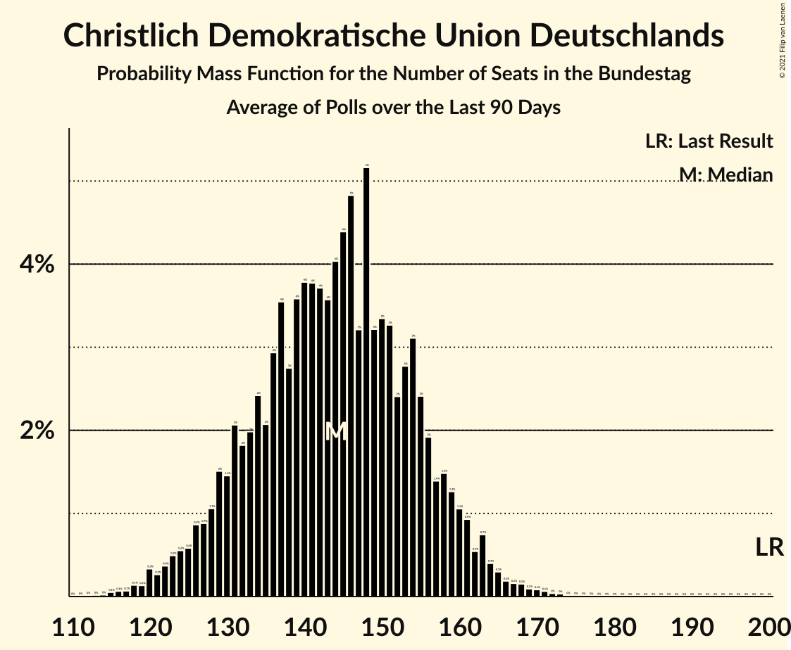

# Christlich Demokratische Union Deutschlands

<a href="#voting-intentions">Voting Intentions</a> | <a href="#seats">Seats</a>

## Voting Intentions

Last result: **26.8%** (General Election of 24 September 2017)

### Confidence Intervals

| Period     | Polling firm/Commissioner(s) | Median | 80% Confidence Interval | 90% Confidence Interval | 95% Confidence Interval | 99% Confidence Interval |
|:----------:|:----------------:|:-----------:|:-----------------------:|:-----------------------:|:-----------------------:|:-----------------------:|
| N/A | [Poll Average](average.html) | 21.9% | 20.4–23.9% | 19.9–24.6% | 19.6–25.1% | 18.7–26.2% |
| [9–12 April 2021](2021-04-12-INSAandYouGov.html) | INSA and YouGov | 21.0% | 20.1–22.0% | 19.8–22.2% | 19.6–22.5% | 19.2–22.9% |
| [6–12 April 2021](2021-04-12-Forsa.html) | Forsa | 22.0% | 20.8–23.2% | 20.5–23.6% | 20.2–23.9% | 19.6–24.5% |
| [31 March–7 April 2021](2021-04-07-Kantar.html) | Kantar | 22.0% | 20.6–23.4% | 20.2–23.8% | 19.9–24.2% | 19.3–24.9% |
| [30 March–1 April 2021](2021-04-01-INSAandYouGov.html) | INSA and YouGov | 21.0% | 20.1–22.0% | 19.8–22.3% | 19.6–22.5% | 19.1–23.0% |
| [30 March–1 April 2021](2021-04-01-Forsa.html) | Forsa | 21.9% | 20.4–23.5% | 20.0–24.0% | 19.7–24.4% | 19.0–25.2% |
| [25–31 March 2021](2021-03-31-Kantar.html) | Kantar   BamS | 21.1% | N/A | N/A | N/A | N/A |
| [29–30 March 2021](2021-03-30-Infratestdimap.html) | Infratest dimap   ARD | 22.0% | N/A | N/A | N/A | N/A |
| [25–29 March 2021](2021-03-29-YouGov.html) | YouGov | 22.0% | N/A | N/A | N/A | N/A |
| [26–29 March 2021](2021-03-29-INSAandYouGov.html) | INSA and YouGov | 19.0% | 18.1–19.9% | 17.8–20.2% | 17.6–20.4% | 17.2–20.9% |
| [24–29 March 2021](2021-03-29-GMS.html) | GMS | 21.1% | 19.6–22.9% | 19.1–23.4% | 18.7–23.8% | 18.0–24.6% |
| [23–29 March 2021](2021-03-29-Forsa.html) | Forsa | 21.9% | 20.8–23.2% | 20.4–23.5% | 20.1–23.8% | 19.6–24.4% |
| [23–25 March 2021](2021-03-25-ForschungsgruppeWahlen.html) | Forschungsgruppe Wahlen | 22.8% | 20.9–24.8% | 20.4–25.4% | 20.0–25.9% | 19.1–26.9% |
| [18–24 March 2021](2021-03-24-Kantar.html) | Kantar | 20.3% | 19.0–21.7% | 18.6–22.1% | 18.3–22.5% | 17.7–23.2% |
| [19–22 March 2021](2021-03-22-INSAandYouGov.html) | INSA and YouGov | 21.0% | 20.1–22.0% | 19.8–22.2% | 19.6–22.5% | 19.2–23.0% |
| [16–22 March 2021](2021-03-22-Forsa.html) | Forsa | 21.1% | 20.0–22.3% | 19.6–22.7% | 19.4–23.0% | 18.8–23.6% |
| [8–21 March 2021](2021-03-21-Allensbach.html) | Allensbach | 23.2% | 21.5–24.9% | 21.0–25.4% | 20.7–25.9% | 19.9–26.7% |
| [11–17 March 2021](2021-03-17-Kantar.html) | Kantar | 21.9% | 20.8–23.2% | 20.4–23.5% | 20.1–23.8% | 19.6–24.4% |
| [15–17 March 2021](2021-03-17-Infratestdimap.html) | Infratest dimap | 23.5% | 22.0–25.1% | 21.6–25.6% | 21.2–26.0% | 20.5–26.8% |
| [12–15 March 2021](2021-03-15-INSAandYouGov.html) | INSA and YouGov | 24.0% | 22.8–25.2% | 22.5–25.6% | 22.2–25.9% | 21.6–26.5% |
| [9–15 March 2021](2021-03-15-Forsa.html) | Forsa | 23.6% | 22.4–24.8% | 22.0–25.2% | 21.7–25.5% | 21.2–26.1% |
| [4–10 March 2021](2021-03-10-Kantar.html) | Kantar | 25.2% | 24.1–26.4% | 23.7–26.7% | 23.5–27.0% | 23.0–27.5% |
| [5–8 March 2021](2021-03-08-INSAandYouGov.html) | INSA and YouGov | 23.0% | 21.8–24.2% | 21.5–24.6% | 21.2–24.9% | 20.7–25.5% |
| [2–8 March 2021](2021-03-08-Forsa.html) | Forsa | 26.8% | 25.5–28.1% | 25.2–28.5% | 24.9–28.8% | 24.3–29.5% |
| [25 February–3 March 2021](2021-03-03-Kantar.html) | Kantar | 26.0% | 24.9–27.2% | 24.6–27.5% | 24.3–27.8% | 23.8–28.4% |
| [1–2 March 2021](2021-03-02-Infratestdimap.html) | Infratest dimap | 26.9% | 25.3–28.5% | 24.9–28.9% | 24.5–29.3% | 23.8–30.1% |
| [26 February–1 March 2021](2021-03-01-INSAandYouGov.html) | INSA and YouGov | 25.5% | 24.3–26.8% | 23.9–27.1% | 23.6–27.4% | 23.1–28.1% |
| [25 February–1 March 2021](2021-03-01-Forsa.html) | Forsa | 27.6% | 26.3–29.0% | 26.0–29.3% | 25.7–29.7% | 25.0–30.3% |
| [23–25 February 2021](2021-02-25-ForschungsgruppeWahlen.html) | Forschungsgruppe Wahlen | 28.5% | 26.6–30.5% | 26.1–31.0% | 25.6–31.5% | 24.8–32.5% |
| [18–24 February 2021](2021-02-24-Kantar.html) | Kantar | 27.6% | 26.3–29.0% | 25.9–29.4% | 25.6–29.7% | 25.0–30.3% |
| [18–22 February 2021](2021-02-22-YouGov.html) | YouGov | 26.8% | 25.4–28.3% | 25.0–28.7% | 24.7–29.0% | 24.1–29.7% |
| [19–22 February 2021](2021-02-22-INSAandYouGov.html) | INSA and YouGov | 27.2% | 26.0–28.5% | 25.7–28.9% | 25.3–29.2% | 24.8–29.8% |
| [16–22 February 2021](2021-02-22-Forsa.html) | Forsa | 28.5% | 27.2–29.8% | 26.8–30.2% | 26.5–30.5% | 25.9–31.2% |
| [11–17 February 2021](2021-02-17-Kantar.html) | Kantar | 27.7% | 26.4–29.0% | 26.0–29.4% | 25.7–29.7% | 25.1–30.4% |
| [15–17 February 2021](2021-02-17-Infratestdimap.html) | Infratest dimap | 26.8% | 25.1–28.7% | 24.6–29.2% | 24.2–29.6% | 23.4–30.5% |
| [4–17 February 2021](2021-02-17-Allensbach.html) | Allensbach | 30.0% | 28.3–31.9% | 27.8–32.4% | 27.4–32.8% | 26.6–33.7% |
| [12–15 February 2021](2021-02-15-INSAandYouGov.html) | INSA and YouGov | 27.8% | 26.5–29.1% | 26.2–29.5% | 25.9–29.8% | 25.3–30.4% |
| [10–15 February 2021](2021-02-15-GMS.html) | GMS | 30.0% | 28.2–32.0% | 27.7–32.5% | 27.3–33.0% | 26.4–33.9% |
| [9–15 February 2021](2021-02-15-Forsa.html) | Forsa | 28.4% | 27.1–29.8% | 26.8–30.1% | 26.5–30.5% | 25.9–31.1% |
| [4–10 February 2021](2021-02-10-Kantar.html) | Kantar | 28.4% | 27.0–29.9% | 26.6–30.3% | 26.2–30.7% | 25.6–31.4% |
| [5–8 February 2021](2021-02-08-INSAandYouGov.html) | INSA and YouGov | 28.5% | 27.2–29.8% | 26.9–30.1% | 26.6–30.5% | 26.0–31.1% |
| [2–8 February 2021](2021-02-08-Forsa.html) | Forsa | 30.1% | 28.8–31.4% | 28.4–31.8% | 28.1–32.1% | 27.5–32.8% |
| [28 January–3 February 2021](2021-02-03-Kantar.html) | Kantar | 29.2% | 27.7–30.8% | 27.3–31.3% | 26.9–31.7% | 26.2–32.4% |
| [1–3 February 2021](2021-02-03-Infratestdimap.html) | Infratest dimap | 27.6% | 26.2–29.1% | 25.8–29.6% | 25.4–29.9% | 24.7–30.7% |
| [29 January–1 February 2021](2021-02-01-YouGov.html) | YouGov | 29.3% | 28.0–30.6% | 27.6–31.0% | 27.3–31.3% | 26.7–31.9% |
| [29 January–1 February 2021](2021-02-01-INSAandYouGov.html) | INSA and YouGov | 29.0% | 27.7–30.3% | 27.4–30.7% | 27.1–31.0% | 26.5–31.7% |
| [26 January–1 February 2021](2021-02-01-Forsa.html) | Forsa | 30.0% | 28.7–31.4% | 28.3–31.8% | 28.0–32.1% | 27.4–32.8% |
| [21–27 January 2021](2021-01-27-Kantar.html) | Kantar | 29.3% | 27.8–30.9% | 27.3–31.3% | 27.0–31.7% | 26.3–32.5% |
| [25–27 January 2021](2021-01-27-ForschungsgruppeWahlen.html) | Forschungsgruppe Wahlen | 30.1% | 28.5–31.7% | 28.1–32.1% | 27.7–32.5% | 26.9–33.3% |
| [22–25 January 2021](2021-01-25-INSAandYouGov.html) | INSA and YouGov   Bild | 28.0% | 26.8–29.3% | 26.4–29.7% | 26.1–30.0% | 25.5–30.7% |
| [18–25 January 2021](2021-01-25-Forsa.html) | Forsa | 30.1% | 28.9–31.3% | 28.5–31.7% | 28.2–32.0% | 27.7–32.6% |
| [14–20 January 2021](2021-01-20-Kantar.html) | Kantar | 28.5% | 27.2–29.8% | 26.8–30.2% | 26.5–30.5% | 25.9–31.2% |
| [18–20 January 2021](2021-01-20-Infratestdimap.html) | Infratest dimap | 27.7% | 25.9–29.5% | 25.4–30.0% | 25.0–30.5% | 24.2–31.4% |
| [10–20 January 2021](2021-01-20-Allensbach.html) | Allensbach | 30.1% | 28.3–31.9% | 27.8–32.4% | 27.4–32.9% | 26.6–33.8% |
| [17–18 January 2021](2021-01-18-INSAandYouGov.html) | INSA and YouGov | 28.0% | 26.7–29.4% | 26.3–29.8% | 26.0–30.1% | 25.4–30.8% |
| [16–17 January 2021](2021-01-17-Forsa.html) | Forsa | 28.5% | 27.0–30.0% | 26.6–30.4% | 26.3–30.8% | 25.6–31.5% |
| [11–15 January 2021](2021-01-15-Forsa.html) | Forsa | 29.3% | 28.0–30.6% | 27.6–31.0% | 27.3–31.4% | 26.6–32.0% |
| [12–14 January 2021](2021-01-14-ForschungsgruppeWahlen.html) | Forschungsgruppe Wahlen | 30.1% | 28.5–31.8% | 28.0–32.3% | 27.6–32.7% | 26.9–33.5% |
| [5–13 January 2021](2021-01-13-Kantar.html) | Kantar | 29.2% | 28.1–30.5% | 27.7–30.8% | 27.4–31.1% | 26.9–31.7% |
| [8–11 January 2021](2021-01-11-INSAandYouGov.html) | INSA and YouGov | 28.0% | 26.8–29.3% | 26.4–29.7% | 26.1–30.0% | 25.5–30.6% |
| [4–8 January 2021](2021-01-08-Forsa.html) | Forsa | 29.3% | 28.0–30.6% | 27.6–31.0% | 27.3–31.3% | 26.7–32.0% |
| [4–6 January 2021](2021-01-06-Infratestdimap.html) | Infratest dimap | 28.4% | 27.0–29.9% | 26.6–30.4% | 26.2–30.7% | 25.5–31.5% |
| [30 December 2020–5 January 2021](2021-01-05-YouGov.html) | YouGov | 29.3% | 27.8–30.8% | 27.4–31.2% | 27.1–31.6% | 26.4–32.3% |
| [1–4 January 2021](2021-01-04-INSAandYouGov.html) | INSA and YouGov | 29.2% | 28.0–30.6% | 27.6–30.9% | 27.3–31.2% | 26.7–31.9% |
| [29 December 2020–4 January 2021](2021-01-04-GMS.html) | GMS | 30.0% | 28.2–31.9% | 27.7–32.4% | 27.2–32.9% | 26.4–33.8% |
| [21–23 December 2020](2020-12-23-Forsa.html) | Forsa | 29.2% | 27.8–30.8% | 27.4–31.2% | 27.0–31.6% | 26.3–32.4% |
| [18–21 December 2020](2020-12-21-INSAandYouGov.html) | INSA and YouGov | 28.4% | 27.2–29.7% | 26.8–30.1% | 26.5–30.4% | 25.9–31.0% |
| [14–18 December 2020](2020-12-18-Forsa.html) | Forsa | 30.1% | 28.7–31.4% | 28.4–31.8% | 28.1–32.2% | 27.4–32.8% |
| [10–16 December 2020](2020-12-16-Kantar.html) | Kantar | 28.4% | 27.3–29.7% | 26.9–30.0% | 26.7–30.3% | 26.1–30.9% |
| [11–14 December 2020](2020-12-14-INSAandYouGov.html) | INSA and YouGov | 29.0% | 27.7–30.3% | 27.4–30.7% | 27.1–31.1% | 26.5–31.7% |
| [7–11 December 2020](2020-12-11-Forsa.html) | Forsa | 30.0% | 28.7–31.4% | 28.3–31.8% | 28.0–32.1% | 27.4–32.8% |
| [28 November–10 December 2020](2020-12-10-Allensbach.html) | Allensbach | 30.0% | 28.2–31.9% | 27.7–32.5% | 27.3–32.9% | 26.5–33.9% |
| [3–9 December 2020](2020-12-09-Kantar.html) | Kantar | 28.4% | 27.3–29.6% | 26.9–30.0% | 26.6–30.3% | 26.1–30.9% |
| [7–9 December 2020](2020-12-09-Infratestdimap.html) | Infratest dimap | 29.2% | 27.4–31.1% | 26.9–31.6% | 26.4–32.1% | 25.6–33.0% |
| [7–9 December 2020](2020-12-09-ForschungsgruppeWahlen.html) | Forschungsgruppe Wahlen | 30.1% | 28.5–31.8% | 28.0–32.3% | 27.6–32.7% | 26.8–33.5% |
| [4–7 December 2020](2020-12-07-INSAandYouGov.html) | INSA and YouGov | 27.5% | 26.3–28.8% | 25.9–29.2% | 25.6–29.5% | 25.0–30.1% |
| [30 November–4 December 2020](2020-12-04-Forsa.html) | Forsa | 29.2% | 27.9–30.6% | 27.6–30.9% | 27.3–31.3% | 26.7–31.9% |
| [26 November–2 December 2020](2020-12-02-Kantar.html) | Kantar | 28.4% | 26.9–30.0% | 26.5–30.5% | 26.2–30.8% | 25.5–31.6% |
| [30 November–2 December 2020](2020-12-02-Infratestdimap.html) | Infratest dimap | 29.3% | 27.8–30.8% | 27.4–31.2% | 27.0–31.6% | 26.3–32.4% |
| [27–30 November 2020](2020-11-30-INSAandYouGov.html) | INSA and YouGov | 28.5% | 27.2–29.8% | 26.9–30.2% | 26.6–30.5% | 26.0–31.1% |
| [23–27 November 2020](2020-11-27-Forsa.html) | Forsa | 30.1% | 28.9–31.3% | 28.6–31.6% | 28.3–31.9% | 27.8–32.5% |
| [24–26 November 2020](2020-11-26-ForschungsgruppeWahlen.html) | Forschungsgruppe Wahlen | 30.1% | 28.5–31.7% | 28.0–32.2% | 27.7–32.6% | 26.9–33.4% |
| [19–25 November 2020](2020-11-25-Kantar.html) | Kantar | 27.6% | 26.2–29.1% | 25.8–29.6% | 25.4–29.9% | 24.7–30.7% |
| [24–25 November 2020](2020-11-25-Infratestdimap.html) | Infratest dimap | 28.4% | 26.6–30.2% | 26.1–30.7% | 25.7–31.2% | 24.9–32.1% |
| [19–23 November 2020](2020-11-23-YouGov.html) | YouGov | 30.1% | 28.7–31.6% | 28.3–32.0% | 27.9–32.4% | 27.2–33.1% |
| [20–23 November 2020](2020-11-23-INSAandYouGov.html) | INSA and YouGov | 28.0% | 26.8–29.3% | 26.4–29.7% | 26.1–30.0% | 25.5–30.6% |
| [16–19 November 2020](2020-11-19-Forsa.html) | Forsa | 29.5% | 28.4–30.7% | 28.1–31.1% | 27.8–31.4% | 27.2–31.9% |
| [12–18 November 2020](2020-11-18-Kantar.html) | Kantar | 29.3% | 28.0–30.6% | 27.6–31.0% | 27.3–31.4% | 26.7–32.0% |
| [13–16 November 2020](2020-11-16-INSAandYouGov.html) | INSA and YouGov | 29.5% | 28.2–30.8% | 27.9–31.2% | 27.6–31.5% | 27.0–32.2% |
| [9–13 November 2020](2020-11-13-Forsa.html) | Forsa | 29.3% | 28.0–30.6% | 27.6–31.0% | 27.3–31.3% | 26.7–32.0% |
| [10–12 November 2020](2020-11-12-ForschungsgruppeWahlen.html) | Forschungsgruppe Wahlen | 30.1% | 28.5–31.7% | 28.1–32.2% | 27.7–32.6% | 26.9–33.4% |
| [5–11 November 2020](2020-11-11-Kantar.html) | Kantar | 28.4% | 27.3–29.6% | 26.9–30.0% | 26.7–30.3% | 26.1–30.9% |
| [9–11 November 2020](2020-11-11-Infratestdimap.html) | Infratest dimap | 29.3% | 27.8–30.8% | 27.4–31.2% | 27.0–31.6% | 26.3–32.4% |
| [1–11 November 2020](2020-11-11-Allensbach.html) | Allensbach | 30.1% | 28.5–31.8% | 28.0–32.3% | 27.6–32.7% | 26.9–33.5% |
| [6–9 November 2020](2020-11-09-INSAandYouGov.html) | INSA and YouGov | 27.0% | 25.8–28.3% | 25.4–28.7% | 25.1–29.0% | 24.5–29.6% |
| [4–9 November 2020](2020-11-09-GMS.html) | GMS | 30.1% | 28.3–32.0% | 27.8–32.5% | 27.3–33.0% | 26.5–33.9% |
| [2–6 November 2020](2020-11-06-Forsa.html) | Forsa | 29.3% | 28.0–30.6% | 27.6–31.0% | 27.3–31.3% | 26.7–32.0% |
| [29 October–4 November 2020](2020-11-04-Kantar.html) | Kantar | 29.3% | 27.7–30.8% | 27.3–31.3% | 26.9–31.7% | 26.2–32.5% |
| [30 October–2 November 2020](2020-11-02-INSAandYouGov.html) | INSA and YouGov | 27.0% | 25.7–28.3% | 25.4–28.6% | 25.1–29.0% | 24.5–29.6% |
| [26–30 October 2020](2020-10-30-Forsa.html) | Forsa | 28.4% | 27.1–29.8% | 26.8–30.1% | 26.5–30.5% | 25.9–31.1% |
| [22–28 October 2020](2020-10-28-Kantar.html) | Kantar | 28.4% | 27.2–29.8% | 26.8–30.1% | 26.5–30.5% | 25.9–31.1% |
| [22–26 October 2020](2020-10-26-YouGov.html) | YouGov | 28.4% | 27.0–29.9% | 26.7–30.3% | 26.3–30.7% | 25.7–31.4% |
| [23–26 October 2020](2020-10-26-INSAandYouGov.html) | INSA and YouGov | 29.0% | 27.7–30.3% | 27.4–30.7% | 27.1–31.0% | 26.5–31.6% |
| [19–23 October 2020](2020-10-23-Forsa.html) | Forsa | 29.3% | 28.0–30.6% | 27.6–31.0% | 27.3–31.3% | 26.7–32.0% |
| [20–22 October 2020](2020-10-22-ForschungsgruppeWahlen.html) | Forschungsgruppe Wahlen | 30.9% | 29.3–32.6% | 28.9–33.1% | 28.5–33.5% | 27.7–34.3% |
| [15–21 October 2020](2020-10-21-Kantar.html) | Kantar | 28.5% | 26.9–30.0% | 26.5–30.5% | 26.2–30.8% | 25.5–31.6% |
| [7–20 October 2020](2020-10-20-Allensbach.html) | Allensbach | 28.8% | 27.1–30.7% | 26.6–31.2% | 26.1–31.6% | 25.3–32.5% |
| [16–19 October 2020](2020-10-19-INSAandYouGov.html) | INSA and YouGov | 29.0% | 27.7–30.3% | 27.4–30.7% | 27.1–31.0% | 26.5–31.6% |
| [12–16 October 2020](2020-10-16-Forsa.html) | Forsa | 29.3% | 27.9–30.6% | 27.6–31.0% | 27.3–31.3% | 26.6–32.0% |
| [8–14 October 2020](2020-10-14-Kantar.html) | Kantar | 28.4% | 27.3–29.6% | 26.9–30.0% | 26.6–30.3% | 26.1–30.8% |
| [12–14 October 2020](2020-10-14-Infratestdimap.html) | Infratest dimap | 28.4% | 26.7–30.3% | 26.2–30.8% | 25.8–31.2% | 24.9–32.1% |
| [9–12 October 2020](2020-10-12-INSAandYouGov.html) | INSA and YouGov | 29.0% | 27.7–30.3% | 27.4–30.7% | 27.1–31.0% | 26.5–31.6% |
| [7–12 October 2020](2020-10-12-GMS.html) | GMS | 29.3% | 27.5–31.2% | 26.9–31.7% | 26.5–32.1% | 25.7–33.1% |
| [5–9 October 2020](2020-10-09-Forsa.html) | Forsa | 29.3% | 28.0–30.6% | 27.6–31.0% | 27.3–31.3% | 26.7–32.0% |
| [6–8 October 2020](2020-10-08-ForschungsgruppeWahlen.html) | Forschungsgruppe Wahlen | 30.1% | 28.5–31.8% | 28.0–32.3% | 27.6–32.7% | 26.8–33.6% |
| [1–7 October 2020](2020-10-07-Kantar.html) | Kantar | 27.6% | 26.1–29.2% | 25.7–29.7% | 25.4–30.0% | 24.7–30.8% |
| [2–5 October 2020](2020-10-05-INSAandYouGov.html) | INSA and YouGov | 28.0% | 26.7–29.3% | 26.4–29.7% | 26.1–30.0% | 25.5–30.6% |
| [29 September–2 October 2020](2020-10-02-Forsa.html) | Forsa | 29.3% | 28.0–30.6% | 27.6–31.0% | 27.3–31.3% | 26.7–32.0% |
| [22–30 September 2020](2020-09-30-Kantar.html) | Kantar | 28.5% | 27.3–29.7% | 27.0–30.0% | 26.7–30.3% | 26.1–30.9% |
| [28–30 September 2020](2020-09-30-Infratestdimap.html) | Infratest dimap | 28.4% | 27.0–30.0% | 26.6–30.4% | 26.2–30.8% | 25.5–31.5% |
| [25–28 September 2020](2020-09-28-INSAandYouGov.html) | INSA and YouGov | 27.0% | 25.8–28.3% | 25.4–28.7% | 25.1–29.0% | 24.6–29.6% |
| [21–25 September 2020](2020-09-25-Forsa.html) | Forsa | 28.5% | 27.2–29.8% | 26.8–30.2% | 26.5–30.5% | 25.9–31.2% |
| [17–23 September 2020](2020-09-23-Kantar.html) | Kantar | 29.2% | 27.8–30.8% | 27.3–31.2% | 27.0–31.6% | 26.3–32.3% |
| [19–21 September 2020](2020-09-21-YouGov.html) | YouGov | 28.4% | 26.8–30.1% | 26.4–30.6% | 26.0–31.0% | 25.3–31.8% |
| [18–21 September 2020](2020-09-21-INSAandYouGov.html) | INSA and YouGov | 28.0% | 26.8–29.3% | 26.4–29.7% | 26.1–30.0% | 25.5–30.6% |
| [14–18 September 2020](2020-09-18-Forsa.html) | Forsa | 29.2% | 27.9–30.6% | 27.5–31.0% | 27.2–31.3% | 26.6–31.9% |
| [10–16 September 2020](2020-09-16-Kantar.html) | Kantar | 29.3% | 27.8–30.8% | 27.4–31.2% | 27.0–31.6% | 26.4–32.3% |
| [15–16 September 2020](2020-09-16-Infratestdimap.html) | Infratest dimap | 29.2% | 27.5–31.1% | 27.0–31.6% | 26.5–32.0% | 25.7–32.9% |
| [14–16 September 2020](2020-09-16-ForschungsgruppeWahlen.html) | Forschungsgruppe Wahlen | 30.1% | 28.4–31.8% | 28.0–32.3% | 27.6–32.7% | 26.8–33.5% |
| [4–16 September 2020](2020-09-16-Allensbach.html) | Allensbach | 30.1% | 28.3–32.0% | 27.8–32.5% | 27.4–33.0% | 26.6–33.9% |
| [11–14 September 2020](2020-09-14-INSAandYouGov.html) | INSA and YouGov | 27.5% | 26.3–28.8% | 25.9–29.2% | 25.6–29.5% | 25.0–30.1% |
| [7–11 September 2020](2020-09-11-Forsa.html) | Forsa | 29.2% | 27.9–30.6% | 27.6–31.0% | 27.2–31.3% | 26.6–32.0% |
| [3–9 September 2020](2020-09-09-Kantar.html) | Kantar | 29.3% | 27.8–30.8% | 27.3–31.3% | 27.0–31.7% | 26.2–32.4% |
| [4–7 September 2020](2020-09-07-INSAandYouGov.html) | INSA and YouGov | 27.0% | 25.8–28.3% | 25.4–28.6% | 25.1–28.9% | 24.5–29.6% |
| [31 August–4 September 2020](2020-09-04-Forsa.html) | Forsa | 29.3% | 28.0–30.6% | 27.6–31.0% | 27.3–31.3% | 26.7–32.0% |
| [27 August–2 September 2020](2020-09-02-Kantar.html) | Kantar | 29.2% | 27.7–30.8% | 27.3–31.2% | 26.9–31.6% | 26.2–32.4% |
| [31 August–2 September 2020](2020-09-02-Infratestdimap.html) | Infratest dimap | 29.3% | 27.8–30.8% | 27.4–31.2% | 27.0–31.6% | 26.4–32.4% |
| [28–31 August 2020](2020-08-31-INSAandYouGov.html) | INSA and YouGov | 29.0% | 27.8–30.3% | 27.4–30.7% | 27.1–31.0% | 26.5–31.6% |
| [24–28 August 2020](2020-08-28-Forsa.html) | Forsa | 29.3% | 28.0–30.6% | 27.6–31.0% | 27.3–31.4% | 26.7–32.0% |
| [25–27 August 2020](2020-08-27-ForschungsgruppeWahlen.html) | Forschungsgruppe Wahlen | 30.9% | 29.2–32.5% | 28.8–33.0% | 28.4–33.4% | 27.6–34.2% |
| [18–26 August 2020](2020-08-26-Kantar.html) | Kantar | 29.2% | 27.8–30.7% | 27.4–31.2% | 27.1–31.5% | 26.4–32.3% |
| [20–24 August 2020](2020-08-24-YouGov.html) | YouGov | 29.2% | 27.8–30.7% | 27.4–31.2% | 27.1–31.5% | 26.4–32.2% |
| [21–24 August 2020](2020-08-24-INSAandYouGov.html) | INSA and YouGov | 28.0% | 26.8–29.3% | 26.4–29.7% | 26.1–30.0% | 25.5–30.6% |
| [17–21 August 2020](2020-08-21-Forsa.html) | Forsa | 29.3% | 27.9–30.6% | 27.6–31.0% | 27.3–31.3% | 26.6–32.0% |
| [13–19 August 2020](2020-08-19-Kantar.html) | Kantar | 29.3% | 28.0–30.6% | 27.7–31.0% | 27.4–31.3% | 26.8–31.9% |
| [18–19 August 2020](2020-08-19-Infratestdimap.html) | Infratest dimap | 30.0% | 28.3–31.9% | 27.8–32.4% | 27.4–32.9% | 26.5–33.8% |
| [5–18 August 2020](2020-08-18-Allensbach.html) | Allensbach | 30.9% | 29.2–32.6% | 28.7–33.1% | 28.3–33.5% | 27.6–34.4% |
| [14–17 August 2020](2020-08-17-INSAandYouGov.html) | INSA and YouGov | 28.0% | 26.7–29.3% | 26.4–29.6% | 26.1–29.9% | 25.5–30.6% |
| [10–14 August 2020](2020-08-14-Forsa.html) | Forsa | 29.2% | 27.9–30.6% | 27.5–31.0% | 27.2–31.3% | 26.6–31.9% |
| [6–12 August 2020](2020-08-12-Kantar.html) | Kantar | 29.2% | 27.9–30.6% | 27.6–31.0% | 27.2–31.3% | 26.6–32.0% |
| [11 August 2020](2020-08-11-INSAandYouGov.html) | INSA and YouGov | 29.2% | 27.5–31.1% | 27.0–31.7% | 26.5–32.1% | 25.7–33.0% |
| [7–10 August 2020](2020-08-10-INSAandYouGov.html) | INSA and YouGov | 28.0% | 26.7–29.3% | 26.4–29.7% | 26.1–30.0% | 25.5–30.6% |
| [3–7 August 2020](2020-08-07-Forsa.html) | Forsa | 30.9% | 29.6–32.3% | 29.2–32.6% | 28.9–33.0% | 28.2–33.7% |
| [30 July–6 August 2020](2020-08-06-Kantar.html) | Kantar | 30.9% | 29.4–32.4% | 29.0–32.8% | 28.6–33.2% | 27.9–34.0% |
| [3–5 August 2020](2020-08-05-Infratestdimap.html) | Infratest dimap | 30.8% | 29.3–32.4% | 28.9–32.8% | 28.6–33.2% | 27.8–34.0% |
| [30 July–4 August 2020](2020-08-04-YouGov.html) | YouGov | 29.3% | 27.8–30.8% | 27.5–31.2% | 27.1–31.5% | 26.4–32.3% |
| [31 July–3 August 2020](2020-08-03-INSAandYouGov.html) | INSA and YouGov | 28.5% | 27.3–29.8% | 26.9–30.2% | 26.6–30.5% | 26.0–31.1% |
| [27–31 July 2020](2020-07-31-Forsa.html) | Forsa | 30.9% | 29.6–32.3% | 29.2–32.6% | 28.9–33.0% | 28.2–33.6% |
| [28–30 July 2020](2020-07-30-ForschungsgruppeWahlen.html) | Forschungsgruppe Wahlen | 30.9% | 29.3–32.6% | 28.8–33.1% | 28.4–33.5% | 27.6–34.4% |
| [23–29 July 2020](2020-07-29-Kantar.html) | Kantar | 30.1% | 28.6–31.7% | 28.2–32.1% | 27.8–32.5% | 27.1–33.3% |
| [24–27 July 2020](2020-07-27-INSAandYouGov.html) | INSA and YouGov | 28.5% | 27.2–29.8% | 26.9–30.2% | 26.6–30.5% | 26.0–31.1% |
| [22–27 July 2020](2020-07-27-GMS.html) | GMS | 30.9% | 29.1–32.8% | 28.6–33.4% | 28.1–33.9% | 27.3–34.8% |
| [20–24 July 2020](2020-07-24-Forsa.html) | Forsa | 30.9% | 29.6–32.3% | 29.2–32.7% | 28.9–33.0% | 28.3–33.7% |
| [16–22 July 2020](2020-07-22-Kantar.html) | Kantar | 30.0% | 28.7–31.4% | 28.4–31.7% | 28.1–32.1% | 27.5–32.7% |
| [21–22 July 2020](2020-07-22-Infratestdimap.html) | Infratest dimap | 30.1% | 28.3–31.9% | 27.8–32.4% | 27.4–32.9% | 26.6–33.8% |
| [17–20 July 2020](2020-07-20-INSAandYouGov.html) | INSA and YouGov | 29.5% | 28.2–30.8% | 27.8–31.2% | 27.5–31.5% | 26.9–32.1% |
| [13–16 July 2020](2020-07-16-Forsa.html) | Forsa | 30.9% | 29.6–32.3% | 29.2–32.7% | 28.9–33.0% | 28.2–33.7% |
| [3–16 July 2020](2020-07-16-Allensbach.html) | Allensbach | 30.9% | 29.2–32.6% | 28.8–33.1% | 28.4–33.5% | 27.6–34.4% |
| [9–15 July 2020](2020-07-15-Kantar.html) | Kantar | 30.9% | 29.4–32.5% | 29.0–33.0% | 28.6–33.3% | 27.9–34.1% |
| [10–13 July 2020](2020-07-13-INSAandYouGov.html) | INSA and YouGov | 29.0% | 27.7–30.3% | 27.4–30.7% | 27.1–31.0% | 26.5–31.7% |
| [6–10 July 2020](2020-07-10-Forsa.html) | Forsa | 30.9% | 29.6–32.3% | 29.2–32.7% | 28.9–33.0% | 28.2–33.7% |
| [7–9 July 2020](2020-07-09-ForschungsgruppeWahlen.html) | Forschungsgruppe Wahlen | 31.6% | 30.0–33.4% | 29.5–33.9% | 29.1–34.3% | 28.3–35.2% |
| [2–8 July 2020](2020-07-08-Kantar.html) | Kantar | 30.9% | 29.3–32.5% | 28.9–32.9% | 28.5–33.3% | 27.8–34.1% |
| [3–6 July 2020](2020-07-06-INSAandYouGov.html) | INSA and YouGov | 29.0% | 27.8–30.3% | 27.4–30.7% | 27.1–31.0% | 26.5–31.7% |
| [29 June–3 July 2020](2020-07-03-Forsa.html) | Forsa | 30.9% | 29.5–32.3% | 29.1–32.7% | 28.8–33.0% | 28.1–33.7% |
| [24 June–2 July 2020](2020-07-02-Kantar.html) | Kantar | 30.1% | 28.6–31.7% | 28.1–32.1% | 27.8–32.5% | 27.0–33.3% |
| [29 June–1 July 2020](2020-07-01-Infratestdimap.html) | Infratest dimap | 30.1% | 28.6–31.6% | 28.2–32.1% | 27.8–32.4% | 27.1–33.2% |
| [26–29 June 2020](2020-06-29-INSAandYouGov.html) | INSA and YouGov | 28.5% | 27.3–29.8% | 26.9–30.2% | 26.6–30.5% | 26.0–31.2% |
| [22–26 June 2020](2020-06-26-Forsa.html) | Forsa | 30.9% | 29.5–32.3% | 29.1–32.7% | 28.8–33.1% | 28.2–33.7% |
| [23–25 June 2020](2020-06-25-ForschungsgruppeWahlen.html) | Forschungsgruppe Wahlen | 32.5% | 30.8–34.3% | 30.4–34.8% | 29.9–35.2% | 29.2–36.0% |
| [18–24 June 2020](2020-06-24-Kantar.html) | Kantar | 30.1% | 28.6–31.6% | 28.2–32.0% | 27.8–32.4% | 27.1–33.1% |
| [23–24 June 2020](2020-06-24-Infratestdimap.html) | Infratest dimap | 30.1% | 28.3–31.9% | 27.8–32.4% | 27.4–32.9% | 26.6–33.8% |
| [18–22 June 2020](2020-06-22-YouGov.html) | YouGov | 30.1% | 28.6–31.6% | 28.2–32.0% | 27.9–32.3% | 27.2–33.1% |
| [19–22 June 2020](2020-06-22-INSAandYouGov.html) | INSA and YouGov | 29.5% | 28.2–30.8% | 27.9–31.2% | 27.6–31.5% | 27.0–32.1% |
| [15–19 June 2020](2020-06-19-Forsa.html) | Forsa | 31.7% | 30.4–33.1% | 30.0–33.5% | 29.6–33.9% | 29.0–34.5% |
| [10–17 June 2020](2020-06-17-Kantar.html) | Kantar | 30.9% | 29.7–32.1% | 29.3–32.5% | 29.1–32.8% | 28.5–33.4% |
| [12–15 June 2020](2020-06-15-INSAandYouGov.html) | INSA and YouGov | 31.3% | 30.0–32.6% | 29.7–33.0% | 29.4–33.4% | 28.7–34.0% |
| [9–15 June 2020](2020-06-15-GMS.html) | GMS | 31.7% | 29.9–33.7% | 29.4–34.2% | 28.9–34.7% | 28.1–35.6% |
| [8–13 June 2020](2020-06-13-Forsa.html) | Forsa | 32.5% | 31.1–33.9% | 30.7–34.3% | 30.4–34.7% | 29.7–35.3% |
| [1–13 June 2020](2020-06-13-Allensbach.html) | Allensbach | 32.5% | 30.9–34.2% | 30.4–34.7% | 30.0–35.1% | 29.2–35.9% |
| [8–10 June 2020](2020-06-10-ForschungsgruppeWahlen.html) | Forschungsgruppe Wahlen | 31.7% | 30.0–33.4% | 29.6–33.9% | 29.1–34.3% | 28.4–35.1% |
| [4–9 June 2020](2020-06-09-Kantar.html) | Kantar | 31.7% | 30.4–33.1% | 30.0–33.5% | 29.7–33.8% | 29.0–34.5% |
| [5–8 June 2020](2020-06-08-INSAandYouGov.html) | INSA and YouGov | 31.0% | 29.7–32.3% | 29.4–32.7% | 29.0–33.1% | 28.4–33.7% |
| [2–5 June 2020](2020-06-05-Forsa.html) | Forsa | 32.5% | 31.0–34.1% | 30.5–34.6% | 30.1–35.0% | 29.4–35.7% |
| [28 May–3 June 2020](2020-06-03-Kantar.html) | Kantar | 30.9% | 29.3–32.5% | 28.9–32.9% | 28.5–33.3% | 27.8–34.1% |
| [2–3 June 2020](2020-06-03-Infratestdimap.html) | Infratest dimap | 30.9% | 29.4–32.5% | 29.0–32.9% | 28.6–33.3% | 27.9–34.0% |
| [29 May–2 June 2020](2020-06-02-INSAandYouGov.html) | INSA and YouGov | 30.5% | 29.2–31.8% | 28.8–32.2% | 28.5–32.5% | 27.9–33.2% |
| [27–29 May 2020](2020-05-29-Forsa.html) | Forsa | 32.5% | 30.7–34.3% | 30.2–34.8% | 29.8–35.3% | 28.9–36.2% |
| [26–28 May 2020](2020-05-28-ForschungsgruppeWahlen.html) | Forschungsgruppe Wahlen | 31.7% | 30.1–33.3% | 29.6–33.8% | 29.2–34.2% | 28.5–35.0% |
| [20–26 May 2020](2020-05-26-YouGov.html) | YouGov | 30.1% | 28.6–31.6% | 28.2–32.0% | 27.8–32.4% | 27.1–33.1% |
| [20–26 May 2020](2020-05-26-Kantar.html) | Kantar | 32.5% | 31.2–33.9% | 30.8–34.3% | 30.5–34.7% | 29.8–35.3% |
| [22–25 May 2020](2020-05-25-INSAandYouGov.html) | INSA and YouGov | 30.0% | 28.7–31.3% | 28.4–31.7% | 28.1–32.0% | 27.5–32.7% |
| [18–22 May 2020](2020-05-22-Forsa.html) | Forsa | 32.5% | 30.9–34.1% | 30.5–34.5% | 30.1–34.9% | 29.4–35.7% |
| [14–19 May 2020](2020-05-19-Kantar.html) | Kantar | 30.9% | 29.5–32.3% | 29.2–32.6% | 28.8–33.0% | 28.2–33.7% |
| [15–18 May 2020](2020-05-18-INSAandYouGov.html) | INSA and YouGov | 30.0% | 28.7–31.3% | 28.4–31.7% | 28.1–32.0% | 27.5–32.7% |
| [11–15 May 2020](2020-05-15-Forsa.html) | Forsa | 31.7% | 30.3–33.1% | 29.9–33.5% | 29.6–33.8% | 29.0–34.5% |
| [12–14 May 2020](2020-05-14-ForschungsgruppeWahlen.html) | Forschungsgruppe Wahlen | 30.9% | 29.3–32.6% | 28.8–33.1% | 28.4–33.5% | 27.6–34.3% |
| [6–14 May 2020](2020-05-14-Allensbach.html) | Allensbach | 30.9% | 29.1–32.8% | 28.6–33.3% | 28.1–33.8% | 27.3–34.8% |
| [7–13 May 2020](2020-05-13-Kantar.html) | Kantar | 31.7% | 30.2–33.2% | 29.8–33.7% | 29.4–34.0% | 28.7–34.8% |
| [12–13 May 2020](2020-05-13-Infratestdimap.html) | Infratest dimap | 30.9% | 29.1–32.8% | 28.6–33.3% | 28.2–33.7% | 27.4–34.6% |
| [8–11 May 2020](2020-05-11-INSAandYouGov.html) | INSA and YouGov | 29.5% | 28.2–30.8% | 27.9–31.2% | 27.6–31.5% | 27.0–32.1% |
| [4–8 May 2020](2020-05-08-Forsa.html) | Forsa | 32.5% | 31.3–33.7% | 31.0–34.0% | 30.7–34.4% | 30.1–34.9% |
| [30 April–6 May 2020](2020-05-06-Kantar.html) | Kantar | 30.9% | 29.3–32.5% | 28.9–32.9% | 28.5–33.3% | 27.8–34.1% |
| [4–6 May 2020](2020-05-06-Infratestdimap.html) | Infratest dimap | 31.7% | 30.1–33.2% | 29.7–33.7% | 29.4–34.1% | 28.6–34.8% |
| [1–4 May 2020](2020-05-04-INSAandYouGov.html) | INSA and YouGov | 30.0% | 28.7–31.3% | 28.4–31.7% | 28.1–32.0% | 27.5–32.6% |
| [27–30 April 2020](2020-04-30-Forsa.html) | Forsa | 30.9% | 29.4–32.5% | 28.9–32.9% | 28.6–33.3% | 27.9–34.0% |
| [22–29 April 2020](2020-04-29-Kantar.html) | Kantar | 30.1% | 28.6–31.7% | 28.1–32.1% | 27.8–32.5% | 27.0–33.3% |
| [23–27 April 2020](2020-04-27-YouGov.html) | YouGov | 30.1% | 28.6–31.6% | 28.2–32.0% | 27.9–32.3% | 27.2–33.1% |
| [24–27 April 2020](2020-04-27-INSAandYouGov.html) | INSA and YouGov | 29.0% | 27.8–30.3% | 27.4–30.7% | 27.1–31.0% | 26.5–31.7% |
| [20–27 April 2020](2020-04-27-GMS.html) | GMS | 30.9% | 29.1–32.9% | 28.6–33.4% | 28.2–33.9% | 27.3–34.8% |
| [20–24 April 2020](2020-04-24-Forsa.html) | Forsa | 31.7% | 30.4–33.1% | 30.0–33.5% | 29.7–33.9% | 29.0–34.5% |
| [20–23 April 2020](2020-04-23-ForschungsgruppeWahlen.html) | Forschungsgruppe Wahlen | 31.7% | 30.1–33.3% | 29.6–33.8% | 29.2–34.2% | 28.5–35.0% |
| [16–22 April 2020](2020-04-22-Kantar.html) | Kantar | 30.9% | 29.6–32.2% | 29.2–32.6% | 28.9–32.9% | 28.2–33.6% |
| [17–20 April 2020](2020-04-20-INSAandYouGov.html) | INSA and YouGov | 29.5% | 28.2–30.8% | 27.9–31.2% | 27.6–31.5% | 27.0–32.2% |
| [14–17 April 2020](2020-04-17-Forsa.html) | Forsa | 31.7% | 30.2–33.3% | 29.8–33.7% | 29.4–34.1% | 28.7–34.9% |
| [9–15 April 2020](2020-04-15-Kantar.html) | Kantar | 30.1% | 28.6–31.7% | 28.2–32.1% | 27.9–32.5% | 27.2–33.2% |
| [14–15 April 2020](2020-04-15-Infratestdimap.html) | Infratest dimap | 30.9% | 29.2–32.8% | 28.7–33.3% | 28.2–33.8% | 27.4–34.7% |
| [1–15 April 2020](2020-04-15-Allensbach.html) | Allensbach | 30.9% | 29.2–32.7% | 28.7–33.2% | 28.3–33.6% | 27.5–34.5% |
| [9–14 April 2020](2020-04-14-INSAandYouGov.html) | INSA and YouGov | 29.5% | 28.2–30.8% | 27.9–31.2% | 27.6–31.5% | 27.0–32.1% |
| [6–9 April 2020](2020-04-09-Forsa.html) | Forsa | 30.0% | 28.7–31.4% | 28.4–31.8% | 28.1–32.1% | 27.5–32.7% |
| [2–8 April 2020](2020-04-08-Kantar.html) | Kantar | 30.1% | 28.7–31.4% | 28.4–31.8% | 28.1–32.2% | 27.4–32.8% |
| [6–8 April 2020](2020-04-08-ForschungsgruppeWahlen.html) | Forschungsgruppe Wahlen | 28.4% | 26.8–30.2% | 26.3–30.7% | 25.9–31.1% | 25.1–31.9% |
| [3–6 April 2020](2020-04-06-INSAandYouGov.html) | INSA and YouGov | 29.0% | 27.7–30.3% | 27.4–30.7% | 27.1–31.0% | 26.5–31.6% |
| [30 March–3 April 2020](2020-04-03-Forsa.html) | Forsa | 30.1% | 28.8–31.5% | 28.4–31.9% | 28.1–32.2% | 27.4–32.9% |
| [25 March–1 April 2020](2020-04-01-Kantar.html) | Kantar | 26.9% | 25.4–28.4% | 25.0–28.9% | 24.6–29.2% | 23.9–30.0% |
| [30 March–1 April 2020](2020-04-01-Infratestdimap.html) | Infratest dimap | 27.6% | 26.2–29.2% | 25.8–29.6% | 25.4–29.9% | 24.7–30.7% |
| [27–30 March 2020](2020-03-30-YouGov.html) | YouGov | 27.6% | 26.2–29.1% | 25.8–29.5% | 25.5–29.9% | 24.8–30.6% |
| [27–30 March 2020](2020-03-30-INSAandYouGov.html) | INSA and YouGov | 27.5% | 26.3–28.8% | 25.9–29.2% | 25.6–29.5% | 25.0–30.1% |
| [23–27 March 2020](2020-03-27-Forsa.html) | Forsa | 29.3% | 27.9–30.6% | 27.6–31.0% | 27.2–31.4% | 26.6–32.0% |
| [23–26 March 2020](2020-03-26-ForschungsgruppeWahlen.html) | Forschungsgruppe Wahlen | 26.8% | 25.4–28.3% | 25.0–28.8% | 24.6–29.1% | 23.9–29.9% |
| [18–25 March 2020](2020-03-25-Kantar.html) | Kantar | 26.0% | 24.6–27.6% | 24.2–28.0% | 23.8–28.4% | 23.1–29.1% |
| [23–25 March 2020](2020-03-25-Forsa.html) | Forsa | 29.2% | 27.6–31.0% | 27.1–31.5% | 26.7–32.0% | 25.9–32.8% |
| [20–23 March 2020](2020-03-23-INSAandYouGov.html) | INSA and YouGov | 26.5% | 25.3–27.8% | 25.0–28.2% | 24.7–28.5% | 24.1–29.1% |
| [16–20 March 2020](2020-03-20-Forsa.html) | Forsa | 26.0% | 24.8–27.3% | 24.4–27.7% | 24.1–28.0% | 23.5–28.7% |
| [12–18 March 2020](2020-03-18-Kantar.html) | Kantar | 22.8% | 21.5–24.2% | 21.1–24.6% | 20.8–24.9% | 20.2–25.6% |
| [17–18 March 2020](2020-03-18-Infratestdimap.html) | Infratest dimap | 24.4% | 22.8–26.2% | 22.3–26.7% | 21.9–27.2% | 21.1–28.0% |
| [5–18 March 2020](2020-03-18-Allensbach.html) | Allensbach | 23.6% | 22.1–25.2% | 21.7–25.7% | 21.3–26.1% | 20.6–26.9% |
| [13–16 March 2020](2020-03-16-INSAandYouGov.html) | INSA and YouGov | 22.0% | 20.9–23.2% | 20.5–23.6% | 20.3–23.9% | 19.7–24.4% |
| [9–13 March 2020](2020-03-13-Forsa.html) | Forsa | 23.6% | 22.4–24.8% | 22.0–25.2% | 21.7–25.5% | 21.2–26.1% |
| [4–11 March 2020](2020-03-11-Kantar.html) | Kantar | 21.1% | 19.8–22.6% | 19.4–23.0% | 19.1–23.4% | 18.5–24.1% |
| [6–9 March 2020](2020-03-09-INSAandYouGov.html) | INSA and YouGov | 20.5% | 19.4–21.7% | 19.1–22.0% | 18.8–22.3% | 18.3–22.9% |
| [2–6 March 2020](2020-03-06-Forsa.html) | Forsa | 21.1% | 19.9–22.4% | 19.6–22.8% | 19.3–23.1% | 18.7–23.7% |
| [3–5 March 2020](2020-03-05-ForschungsgruppeWahlen.html) | Forschungsgruppe Wahlen | 21.2% | 19.7–22.7% | 19.3–23.1% | 19.0–23.5% | 18.3–24.2% |
| [27 February–4 March 2020](2020-03-04-Kantar.html) | Kantar | 19.5% | 18.2–20.9% | 17.9–21.3% | 17.6–21.7% | 16.9–22.4% |
| [2–4 March 2020](2020-03-04-Infratestdimap.html) | Infratest dimap | 22.0% | 20.6–23.4% | 20.3–23.8% | 19.9–24.1% | 19.3–24.8% |
| [28 February–2 March 2020](2020-03-02-YouGov.html) | YouGov | 21.9% | 20.7–23.3% | 20.3–23.7% | 20.0–24.0% | 19.4–24.7% |
| [28 February–2 March 2020](2020-03-02-INSAandYouGov.html) | INSA and YouGov | 20.5% | 19.4–21.7% | 19.1–22.0% | 18.8–22.3% | 18.3–22.9% |
| [24–28 February 2020](2020-02-28-Forsa.html) | Forsa | 21.9% | 20.7–23.2% | 20.4–23.5% | 20.1–23.9% | 19.6–24.5% |
| [20–27 February 2020](2020-02-27-Kantar.html) | Kantar | 20.3% | 19.0–21.7% | 18.6–22.1% | 18.3–22.4% | 17.7–23.1% |
| [21–24 February 2020](2020-02-24-INSAandYouGov.html) | INSA and YouGov | 20.0% | 18.9–21.2% | 18.6–21.5% | 18.3–21.8% | 17.8–22.4% |
| [17–21 February 2020](2020-02-21-Forsa.html) | Forsa | 21.9% | 20.7–23.2% | 20.4–23.5% | 20.1–23.8% | 19.6–24.4% |
| [13–19 February 2020](2020-02-19-Kantar.html) | Kantar | 21.9% | 20.6–23.4% | 20.2–23.8% | 19.9–24.2% | 19.2–24.9% |
| [14–17 February 2020](2020-02-17-INSAandYouGov.html) | INSA and YouGov | 21.0% | 19.9–22.2% | 19.6–22.5% | 19.3–22.8% | 18.8–23.4% |
| [10–14 February 2020](2020-02-14-Forsa.html) | Forsa | 22.0% | 20.8–23.2% | 20.5–23.5% | 20.2–23.9% | 19.7–24.4% |
| [11–13 February 2020](2020-02-13-Infratestdimap.html) | Infratest dimap | 21.2% | 19.6–22.9% | 19.1–23.4% | 18.7–23.8% | 18.0–24.6% |
| [6–12 February 2020](2020-02-12-Kantar.html) | Kantar | 22.7% | 21.5–24.0% | 21.2–24.4% | 20.9–24.7% | 20.3–25.3% |
| [1–12 February 2020](2020-02-12-Allensbach.html) | Allensbach | 22.3% | 20.9–23.9% | 20.5–24.4% | 20.1–24.7% | 19.4–25.5% |
| [7–10 February 2020](2020-02-10-INSAandYouGov.html) | INSA and YouGov | 22.0% | 20.9–23.2% | 20.5–23.5% | 20.3–23.8% | 19.7–24.4% |
| [3–7 February 2020](2020-02-07-Forsa.html) | Forsa | 22.8% | 21.7–23.9% | 21.4–24.2% | 21.2–24.4% | 20.7–25.0% |
| [4–6 February 2020](2020-02-06-ForschungsgruppeWahlen.html) | Forschungsgruppe Wahlen   ZDF | 21.9% | 20.4–23.6% | 19.9–24.1% | 19.5–24.5% | 18.8–25.3% |
| [30 January–5 February 2020](2020-02-05-Kantar.html) | Kantar | 22.8% | 21.6–24.0% | 21.2–24.4% | 20.9–24.7% | 20.4–25.3% |
| [3–5 February 2020](2020-02-05-Infratestdimap.html) | Infratest dimap | 22.0% | 20.6–23.4% | 20.3–23.8% | 19.9–24.1% | 19.3–24.8% |
| [31 January–3 February 2020](2020-02-03-INSAandYouGov.html) | INSA and YouGov | 22.0% | 20.9–23.2% | 20.5–23.5% | 20.3–23.9% | 19.7–24.4% |
| [27–31 January 2020](2020-01-31-Forsa.html) | Forsa | 22.8% | 21.6–24.0% | 21.2–24.4% | 20.9–24.7% | 20.3–25.3% |
| [23–29 January 2020](2020-01-29-Kantar.html) | Kantar | 21.9% | 20.6–23.4% | 20.2–23.8% | 19.8–24.1% | 19.2–24.8% |
| [24–27 January 2020](2020-01-27-INSAandYouGov.html) | INSA and YouGov | 20.0% | 18.9–21.2% | 18.6–21.5% | 18.3–21.8% | 17.8–22.3% |
| [20–24 January 2020](2020-01-24-Forsa.html) | Forsa | 22.7% | 21.7–23.8% | 21.4–24.2% | 21.1–24.4% | 20.6–25.0% |
| [16–22 January 2020](2020-01-22-Kantar.html) | Kantar | 21.1% | 20.0–22.3% | 19.7–22.7% | 19.4–23.0% | 18.9–23.5% |
| [21–22 January 2020](2020-01-22-Infratestdimap.html) | Infratest dimap   ARD | 21.1% | 19.5–22.8% | 19.1–23.3% | 18.7–23.7% | 18.0–24.5% |
| [9–22 January 2020](2020-01-22-Allensbach.html) | Allensbach | 23.2% | 21.7–24.8% | 21.3–25.2% | 20.9–25.6% | 20.2–26.3% |
| [17–20 January 2020](2020-01-20-INSAandYouGov.html) | INSA and YouGov | 21.5% | 20.4–22.7% | 20.1–23.0% | 19.8–23.3% | 19.3–23.9% |
| [13–17 January 2020](2020-01-17-Forsa.html) | Forsa | 22.8% | 21.6–24.0% | 21.3–24.4% | 21.0–24.7% | 20.4–25.3% |
| [9–15 January 2020](2020-01-15-Kantar.html) | Kantar | 21.1% | 20.0–22.3% | 19.6–22.6% | 19.4–23.0% | 18.8–23.5% |
| [13–15 January 2020](2020-01-15-ForschungsgruppeWahlen.html) | Forschungsgruppe Wahlen   ZDF | 21.9% | 20.5–23.5% | 20.1–23.9% | 19.7–24.3% | 19.1–25.0% |
| [10–13 January 2020](2020-01-13-INSAandYouGov.html) | INSA and YouGov | 21.0% | 19.9–22.2% | 19.5–22.5% | 19.3–22.8% | 18.7–23.4% |
| [6–10 January 2020](2020-01-10-Forsa.html) | Forsa | 22.8% | 21.6–24.1% | 21.2–24.4% | 21.0–24.7% | 20.4–25.3% |
| [19 December 2019–8 January 2020](2020-01-08-Kantar.html) | Kantar | 21.9% | 20.7–23.2% | 20.4–23.6% | 20.1–23.9% | 19.5–24.5% |
| [7–8 January 2020](2020-01-08-Infratestdimap.html) | Infratest dimap   ARD | 22.0% | 20.7–23.4% | 20.3–23.8% | 20.0–24.1% | 19.3–24.8% |
| [3–6 January 2020](2020-01-06-INSAandYouGov.html) | INSA and YouGov | 22.8% | 21.6–24.0% | 21.3–24.3% | 21.0–24.6% | 20.4–25.2% |
| [27 December 2019–2 January 2020](2020-01-02-GMS.html) | GMS | 22.7% | 21.0–24.4% | 20.6–25.0% | 20.2–25.4% | 19.4–26.2% |
| [20–23 December 2019](2019-12-23-INSAandYouGov.html) | INSA and YouGov | 21.0% | 19.9–22.2% | 19.5–22.5% | 19.3–22.8% | 18.7–23.4% |
| [16–20 December 2019](2019-12-20-Forsa.html) | Forsa | 22.7% | 21.6–24.0% | 21.2–24.4% | 20.9–24.7% | 20.4–25.3% |
| [12–18 December 2019](2019-12-18-Kantar.html) | Kantar   Bild am Sonntag | 22.0% | 20.8–23.2% | 20.4–23.6% | 20.1–23.9% | 19.6–24.5% |
| [13–17 December 2019](2019-12-17-YouGov.html) | YouGov | 21.9% | 20.7–23.3% | 20.3–23.7% | 20.0–24.1% | 19.4–24.7% |
| [13–16 December 2019](2019-12-16-INSAandYouGov.html) | INSA and YouGov | 21.0% | 19.9–22.2% | 19.5–22.5% | 19.3–22.8% | 18.7–23.4% |
| [9–13 December 2019](2019-12-13-Forsa.html) | Forsa | 22.8% | 21.6–24.1% | 21.3–24.4% | 21.0–24.7% | 20.4–25.3% |
| [10–12 December 2019](2019-12-12-ForschungsgruppeWahlen.html) | Forschungsgruppe Wahlen   ZDF | 22.0% | 20.6–23.5% | 20.2–23.9% | 19.8–24.2% | 19.2–25.0% |
| [5–11 December 2019](2019-12-11-Kantar.html) | Kantar   Bild am Sonntag | 22.8% | 21.6–24.0% | 21.2–24.4% | 21.0–24.7% | 20.4–25.3% |
| [10–11 December 2019](2019-12-11-Infratestdimap.html) | Infratest dimap   ARD | 21.9% | 20.9–23.0% | 20.6–23.4% | 20.4–23.6% | 19.9–24.1% |
| [1–11 December 2019](2019-12-11-Allensbach.html) | Allensbach | 23.1% | 21.7–24.7% | 21.3–25.2% | 20.9–25.6% | 20.2–26.3% |
| [6–9 December 2019](2019-12-09-INSAandYouGov.html) | INSA and YouGov | 22.5% | 21.4–23.7% | 21.0–24.1% | 20.8–24.4% | 20.2–25.0% |
| [2–6 December 2019](2019-12-06-Forsa.html) | Forsa | 22.8% | 21.7–23.9% | 21.4–24.2% | 21.2–24.5% | 20.7–25.0% |
| [28 November–4 December 2019](2019-12-04-Kantar.html) | Kantar   Bild am Sonntag | 22.8% | 21.6–24.1% | 21.2–24.4% | 20.9–24.7% | 20.3–25.3% |
| [2–4 December 2019](2019-12-04-Infratestdimap.html) | Infratest dimap   ARD | 20.3% | 19.0–21.7% | 18.7–22.1% | 18.4–22.4% | 17.7–23.1% |
| [29 November–2 December 2019](2019-12-02-INSAandYouGov.html) | INSA and YouGov | 21.0% | 19.9–22.2% | 19.6–22.5% | 19.3–22.8% | 18.8–23.4% |
| [27 November–2 December 2019](2019-12-02-GMS.html) | GMS | 21.9% | 20.3–23.7% | 19.8–24.2% | 19.5–24.6% | 18.7–25.4% |
| [25–29 November 2019](2019-11-29-Forsa.html) | Forsa | 22.0% | 20.8–23.2% | 20.5–23.6% | 20.2–23.9% | 19.6–24.5% |
| [26–28 November 2019](2019-11-28-ForschungsgruppeWahlen.html) | Forschungsgruppe Wahlen   ZDF | 21.9% | 20.5–23.4% | 20.1–23.9% | 19.8–24.2% | 19.1–25.0% |
| [20–27 November 2019](2019-11-27-Kantar.html) | Kantar   Bild am Sonntag | 22.8% | 21.6–24.1% | 21.2–24.4% | 20.9–24.7% | 20.4–25.3% |
| [22–26 November 2019](2019-11-26-YouGov.html) | YouGov | 21.1% | 19.9–22.5% | 19.5–22.8% | 19.2–23.2% | 18.6–23.8% |
| [22–25 November 2019](2019-11-25-INSAandYouGov.html) | INSA and YouGov | 22.0% | 20.9–23.2% | 20.5–23.5% | 20.3–23.8% | 19.7–24.4% |
| [18–22 November 2019](2019-11-22-Forsa.html) | Forsa | 21.1% | 20.0–22.3% | 19.6–22.7% | 19.4–23.0% | 18.8–23.6% |
| [13–20 November 2019](2019-11-20-Kantar.html) | Kantar   Bild am Sonntag | 22.7% | 21.5–24.0% | 21.2–24.4% | 20.9–24.7% | 20.3–25.3% |
| [15–18 November 2019](2019-11-18-INSAandYouGov.html) | INSA and YouGov | 20.0% | 19.2–20.8% | 19.0–21.0% | 18.8–21.3% | 18.4–21.7% |
| [11–15 November 2019](2019-11-15-Forsa.html) | Forsa | 21.1% | 20.0–22.4% | 19.6–22.7% | 19.4–23.0% | 18.8–23.6% |
| [7–13 November 2019](2019-11-13-Kantar.html) | Kantar   Bild am Sonntag | 22.0% | 20.7–23.4% | 20.3–23.8% | 20.0–24.1% | 19.3–24.8% |
| [12–13 November 2019](2019-11-13-Infratestdimap.html) | Infratest dimap   ARD | 20.4% | 18.8–22.0% | 18.4–22.5% | 18.0–22.9% | 17.3–23.7% |
| [2–13 November 2019](2019-11-13-Allensbach.html) | Allensbach | 24.0% | 22.5–25.5% | 22.1–26.0% | 21.7–26.4% | 21.0–27.1% |
| [8–11 November 2019](2019-11-11-INSAandYouGov.html) | INSA and YouGov | 20.7% | 19.6–21.9% | 19.3–22.2% | 19.0–22.5% | 18.5–23.1% |
| [4–8 November 2019](2019-11-08-Forsa.html) | Forsa | 21.1% | 19.9–22.3% | 19.6–22.7% | 19.3–23.0% | 18.8–23.6% |
| [5–7 November 2019](2019-11-07-ForschungsgruppeWahlen.html) | Forschungsgruppe Wahlen   ZDF | 21.9% | 20.5–23.5% | 20.1–23.9% | 19.7–24.3% | 19.0–25.0% |
| [30 October–6 November 2019](2019-11-06-Kantar.html) | Kantar   Bild am Sonntag | 21.1% | 19.8–22.5% | 19.4–23.0% | 19.1–23.3% | 18.4–24.0% |
| [4–6 November 2019](2019-11-06-Infratestdimap.html) | Infratest dimap   ARD | 21.2% | 19.9–22.6% | 19.5–23.0% | 19.2–23.3% | 18.6–24.0% |
| [31 October–5 November 2019](2019-11-05-YouGov.html) | YouGov | 21.9% | 20.6–23.3% | 20.3–23.7% | 20.0–24.0% | 19.3–24.7% |
| [1–4 November 2019](2019-11-04-INSAandYouGov.html) | INSA and YouGov | 20.7% | 19.6–21.9% | 19.3–22.2% | 19.0–22.5% | 18.5–23.1% |
| [28 October–1 November 2019](2019-11-01-Forsa.html) | Forsa | 22.7% | 21.5–24.0% | 21.2–24.4% | 20.9–24.7% | 20.3–25.3% |
| [24–30 October 2019](2019-10-30-Kantar.html) | Kantar   Bild am Sonntag | 21.9% | 20.7–23.2% | 20.4–23.5% | 20.1–23.8% | 19.6–24.4% |
| [25–28 October 2019](2019-10-28-INSAandYouGov.html) | INSA and YouGov | 21.2% | 20.0–22.4% | 19.7–22.7% | 19.4–23.0% | 18.9–23.6% |
| [21–25 October 2019](2019-10-25-Forsa.html) | Forsa | 23.6% | 22.5–24.7% | 22.2–25.0% | 21.9–25.3% | 21.4–25.8% |
| [17–23 October 2019](2019-10-23-Kantar.html) | Kantar   Bild am Sonntag | 23.6% | 22.2–25.1% | 21.8–25.5% | 21.5–25.9% | 20.8–26.6% |
| [18–21 October 2019](2019-10-21-INSAandYouGov.html) | INSA and YouGov | 22.0% | 20.8–23.2% | 20.5–23.5% | 20.2–23.8% | 19.7–24.4% |
| [14–18 October 2019](2019-10-18-Forsa.html) | Forsa | 22.0% | 20.9–23.0% | 20.6–23.4% | 20.4–23.6% | 19.9–24.2% |
| [15–17 October 2019](2019-10-17-ForschungsgruppeWahlen.html) | Forschungsgruppe Wahlen   ZDF | 23.6% | 22.1–25.2% | 21.6–25.6% | 21.3–26.0% | 20.6–26.8% |
| [10–16 October 2019](2019-10-16-Kantar.html) | Kantar   Bild am Sonntag | 23.6% | 22.2–25.1% | 21.8–25.5% | 21.5–25.9% | 20.8–26.6% |
| [14–16 October 2019](2019-10-16-Infratestdimap.html) | Infratest dimap   ARD | 22.7% | 21.1–24.4% | 20.7–24.9% | 20.3–25.3% | 19.5–26.2% |
| [11–14 October 2019](2019-10-14-INSAandYouGov.html) | INSA and YouGov | 22.8% | 21.6–24.0% | 21.3–24.3% | 21.0–24.6% | 20.4–25.2% |
| [7–11 October 2019](2019-10-11-Forsa.html) | Forsa | 21.9% | 20.8–23.2% | 20.4–23.5% | 20.2–23.9% | 19.6–24.4% |
| [29 September–10 October 2019](2019-10-10-Allensbach.html) | Allensbach | 24.0% | 22.5–25.6% | 22.1–26.1% | 21.7–26.5% | 21.0–27.2% |
| [2–9 October 2019](2019-10-09-Kantar.html) | Kantar   Bild am Sonntag | 22.8% | 21.6–24.0% | 21.2–24.4% | 20.9–24.7% | 20.4–25.3% |
| [7–9 October 2019](2019-10-09-Infratestdimap.html) | Infratest dimap   ARD | 22.7% | 21.4–24.2% | 21.0–24.6% | 20.7–24.9% | 20.1–25.6% |
| [4–7 October 2019](2019-10-07-INSAandYouGov.html) | INSA and YouGov | 22.0% | 20.8–23.2% | 20.5–23.5% | 20.2–23.8% | 19.7–24.4% |
| [1–7 October 2019](2019-10-07-GMS.html) | GMS | 22.0% | 20.3–23.7% | 19.9–24.2% | 19.5–24.6% | 18.7–25.5% |
| [30 September–4 October 2019](2019-10-04-Forsa.html) | Forsa | 22.8% | 21.6–24.0% | 21.2–24.4% | 21.0–24.7% | 20.4–25.3% |
| [27 September–1 October 2019](2019-10-01-YouGov.html) | YouGov | 21.1% | 19.8–22.5% | 19.5–22.9% | 19.2–23.2% | 18.5–23.9% |
| [26 September–1 October 2019](2019-10-01-Kantar.html) | Kantar   Bild am Sonntag | 21.9% | 20.6–23.4% | 20.2–23.8% | 19.9–24.2% | 19.3–24.9% |
| [27–30 September 2019](2019-09-30-INSAandYouGov.html) | INSA and YouGov | 21.5% | 20.4–22.7% | 20.1–23.1% | 19.8–23.4% | 19.3–23.9% |
| [23–27 September 2019](2019-09-27-Forsa.html) | Forsa | 22.0% | 20.8–23.2% | 20.5–23.5% | 20.2–23.8% | 19.6–24.4% |
| [24–26 September 2019](2019-09-26-ForschungsgruppeWahlen.html) | Forschungsgruppe Wahlen   ZDF | 22.0% | 20.5–23.5% | 20.1–23.9% | 19.8–24.3% | 19.1–25.0% |
| [19–25 September 2019](2019-09-25-Kantar.html) | Kantar   Bild am Sonntag | 21.9% | 20.7–23.3% | 20.3–23.6% | 20.0–24.0% | 19.4–24.6% |
| [20–23 September 2019](2019-09-23-INSAandYouGov.html) | INSA and YouGov | 21.2% | 20.0–22.3% | 19.7–22.7% | 19.4–23.0% | 18.9–23.6% |
| [16–20 September 2019](2019-09-20-Forsa.html) | Forsa | 21.9% | 20.8–23.2% | 20.4–23.5% | 20.1–23.8% | 19.6–24.4% |
| [12–18 September 2019](2019-09-18-Kantar.html) | Kantar   Bild am Sonntag | 23.6% | 22.2–24.9% | 21.9–25.3% | 21.6–25.7% | 20.9–26.4% |
| [17–18 September 2019](2019-09-18-Infratestdimap.html) | Infratest dimap   ARD | 21.9% | 20.4–23.6% | 19.9–24.1% | 19.5–24.5% | 18.8–25.3% |
| [13–16 September 2019](2019-09-16-INSAandYouGov.html) | INSA and YouGov | 20.4% | 19.3–21.6% | 19.0–21.9% | 18.7–22.2% | 18.2–22.8% |
| [9–13 September 2019](2019-09-13-Forsa.html) | Forsa | 22.0% | 20.8–23.2% | 20.5–23.5% | 20.2–23.8% | 19.6–24.4% |
| [6–12 September 2019](2019-09-12-GMS.html) | GMS | 21.9% | 20.3–23.6% | 19.8–24.1% | 19.4–24.6% | 18.7–25.4% |
| [1–12 September 2019](2019-09-12-Allensbach.html) | Allensbach | 23.6% | 22.1–25.2% | 21.7–25.6% | 21.3–26.0% | 20.6–26.8% |
| [5–11 September 2019](2019-09-11-Kantar.html) | Kantar   Bild am Sonntag | 22.8% | 21.8–23.8% | 21.5–24.1% | 21.2–24.3% | 20.8–24.8% |
| [6–10 September 2019](2019-09-10-YouGov.html) | YouGov | 21.9% | 20.7–23.3% | 20.3–23.7% | 20.0–24.0% | 19.4–24.7% |
| [6–9 September 2019](2019-09-09-INSAandYouGov.html) | INSA and YouGov | 21.0% | 19.9–22.2% | 19.6–22.5% | 19.3–22.8% | 18.7–23.4% |
| [2–6 September 2019](2019-09-06-Forsa.html) | Forsa | 22.0% | 20.8–23.2% | 20.5–23.5% | 20.2–23.9% | 19.7–24.4% |
| [29 August–4 September 2019](2019-09-04-Kantar.html) | Kantar   Bild am Sonntag | 23.6% | 22.3–24.9% | 22.0–25.2% | 21.7–25.5% | 21.1–26.2% |
| [3–4 September 2019](2019-09-04-Infratestdimap.html) | Infratest dimap   ARD | 21.9% | 20.6–23.4% | 20.2–23.7% | 19.9–24.1% | 19.3–24.8% |
| [2–4 September 2019](2019-09-04-ForschungsgruppeWahlen.html) | Forschungsgruppe Wahlen   ZDF | 22.8% | 21.3–24.3% | 20.9–24.8% | 20.5–25.1% | 19.8–25.9% |
| [30 August–2 September 2019](2019-09-02-INSAandYouGov.html) | INSA and YouGov | 20.2% | 19.1–21.4% | 18.7–21.7% | 18.5–22.0% | 18.0–22.6% |
| [26–30 August 2019](2019-08-30-Forsa.html) | Forsa | 22.4% | 21.2–23.6% | 20.9–23.9% | 20.6–24.2% | 20.0–24.8% |
| [22–28 August 2019](2019-08-28-Kantar.html) | Kantar   Bild am Sonntag | 23.6% | 22.2–25.1% | 21.8–25.5% | 21.4–25.8% | 20.8–26.6% |
| [23–26 August 2019](2019-08-26-INSAandYouGov.html) | INSA and YouGov | 21.0% | 19.9–22.2% | 19.6–22.5% | 19.3–22.8% | 18.7–23.4% |
| [19–23 August 2019](2019-08-23-Forsa.html) | Forsa | 21.1% | 20.0–22.3% | 19.7–22.7% | 19.4–23.0% | 18.8–23.6% |
| [15–21 August 2019](2019-08-21-Kantar.html) | Kantar   Bild am Sonntag | 21.9% | 20.6–23.3% | 20.3–23.7% | 19.9–24.1% | 19.3–24.7% |
| [20–21 August 2019](2019-08-21-Infratestdimap.html) | Infratest dimap   ARD | 21.1% | 19.5–22.8% | 19.1–23.2% | 18.7–23.6% | 18.0–24.4% |
| [16–19 August 2019](2019-08-19-INSAandYouGov.html) | INSA and YouGov | 21.3% | 20.2–22.5% | 19.9–22.8% | 19.6–23.1% | 19.1–23.7% |
| [12–16 August 2019](2019-08-16-Forsa.html) | Forsa | 20.4% | 19.2–21.6% | 18.9–21.9% | 18.6–22.2% | 18.1–22.8% |
| [2–15 August 2019](2019-08-15-Allensbach.html) | Allensbach | 23.9% | 22.4–25.5% | 22.0–26.0% | 21.7–26.4% | 21.0–27.1% |
| [8–14 August 2019](2019-08-14-Kantar.html) | Kantar   Bild am Sonntag | 21.9% | 20.7–23.2% | 20.4–23.5% | 20.1–23.9% | 19.6–24.5% |
| [9–11 August 2019](2019-08-11-INSAandYouGov.html) | INSA and YouGov | 21.5% | 20.4–22.7% | 20.1–23.0% | 19.8–23.3% | 19.3–23.9% |
| [5–9 August 2019](2019-08-09-Forsa.html) | Forsa | 21.2% | 20.0–22.4% | 19.7–22.7% | 19.4–23.0% | 18.9–23.6% |
| [6–8 August 2019](2019-08-08-ForschungsgruppeWahlen.html) | Forschungsgruppe Wahlen   ZDF | 22.7% | 21.3–24.3% | 20.9–24.7% | 20.5–25.1% | 19.9–25.8% |
| [1–7 August 2019](2019-08-07-Kantar.html) | Kantar   Bild am Sonntag | 21.1% | 20.1–22.3% | 19.8–22.6% | 19.6–22.8% | 19.1–23.4% |
| [2–5 August 2019](2019-08-05-INSAandYouGov.html) | INSA and YouGov | 21.0% | 19.9–22.2% | 19.5–22.5% | 19.3–22.8% | 18.7–23.4% |
| [29 July–2 August 2019](2019-08-02-Forsa.html) | Forsa | 21.9% | 20.8–23.2% | 20.4–23.5% | 20.1–23.8% | 19.6–24.4% |
| [25–31 July 2019](2019-07-31-Kantar.html) | Kantar   Bild am Sonntag | 21.1% | 19.8–22.6% | 19.4–23.0% | 19.1–23.4% | 18.5–24.1% |
| [29–31 July 2019](2019-07-31-Infratestdimap.html) | Infratest dimap   ARD | 21.2% | 19.8–22.6% | 19.5–23.0% | 19.2–23.3% | 18.5–24.0% |
| [26–29 July 2019](2019-07-29-YouGov.html) | YouGov | 21.1% | 19.8–22.4% | 19.4–22.8% | 19.1–23.2% | 18.5–23.8% |
| [26–29 July 2019](2019-07-29-INSAandYouGov.html) | INSA and YouGov | 21.5% | 20.4–22.7% | 20.1–23.1% | 19.8–23.4% | 19.2–23.9% |
| [22–26 July 2019](2019-07-26-Forsa.html) | Forsa | 22.0% | 20.8–23.2% | 20.5–23.5% | 20.2–23.9% | 19.7–24.4% |
| [18–24 July 2019](2019-07-24-Kantar.html) | Kantar   Bild am Sonntag | 21.1% | 19.8–22.5% | 19.4–22.9% | 19.1–23.2% | 18.5–23.9% |
| [22–24 July 2019](2019-07-24-Infratestdimap.html) | Infratest dimap   ARD | 21.1% | 19.6–22.8% | 19.1–23.3% | 18.8–23.7% | 18.0–24.5% |
| [19–22 July 2019](2019-07-22-INSAandYouGov.html) | INSA and YouGov | 22.7% | 21.5–23.9% | 21.2–24.2% | 20.9–24.5% | 20.4–25.1% |
| [17–22 July 2019](2019-07-22-GMS.html) | GMS | 22.8% | 21.1–24.5% | 20.7–25.0% | 20.3–25.5% | 19.5–26.3% |
| [15–19 July 2019](2019-07-19-Forsa.html) | Forsa | 22.0% | 20.8–23.2% | 20.5–23.5% | 20.2–23.8% | 19.6–24.4% |
| [16–18 July 2019](2019-07-18-ForschungsgruppeWahlen.html) | Forschungsgruppe Wahlen   ZDF | 22.7% | 21.3–24.3% | 20.9–24.7% | 20.5–25.1% | 19.8–25.8% |
| [11–17 July 2019](2019-07-17-Kantar.html) | Kantar   Bild am Sonntag | 22.0% | 20.8–23.2% | 20.4–23.6% | 20.1–23.9% | 19.6–24.5% |
| [12–15 July 2019](2019-07-15-INSAandYouGov.html) | INSA and YouGov | 20.0% | 18.9–21.2% | 18.6–21.5% | 18.3–21.8% | 17.8–22.4% |
| [8–12 July 2019](2019-07-12-Forsa.html) | Forsa | 21.1% | 20.0–22.3% | 19.7–22.7% | 19.4–23.0% | 18.9–23.5% |
| [1–11 July 2019](2019-07-11-Allensbach.html) | Allensbach | 23.9% | 22.4–25.6% | 22.0–26.0% | 21.6–26.4% | 20.9–27.2% |
| [4–10 July 2019](2019-07-10-Kantar.html) | Kantar   Bild am Sonntag | 21.1% | 20.1–22.2% | 19.8–22.5% | 19.5–22.8% | 19.0–23.4% |
| [5–8 July 2019](2019-07-08-INSAandYouGov.html) | INSA and YouGov | 20.8% | 19.7–22.0% | 19.4–22.3% | 19.1–22.6% | 18.6–23.2% |
| [1–5 July 2019](2019-07-05-Forsa.html) | Forsa | 21.1% | 20.0–22.3% | 19.7–22.7% | 19.4–23.0% | 18.9–23.5% |
| [27 June–3 July 2019](2019-07-03-Kantar.html) | Kantar   Bild am Sonntag | 21.2% | 20.2–22.1% | 20.0–22.4% | 19.7–22.7% | 19.3–23.1% |
| [1–3 July 2019](2019-07-03-Infratestdimap.html) | Infratest dimap   ARD | 20.3% | 19.0–21.7% | 18.7–22.1% | 18.4–22.4% | 17.8–23.1% |
| [28 June–2 July 2019](2019-07-02-YouGov.html) | YouGov | 20.9% | 19.7–22.3% | 19.3–22.6% | 19.0–23.0% | 18.4–23.6% |
| [28 June–1 July 2019](2019-07-01-INSAandYouGov.html) | INSA and YouGov | 23.0% | 21.8–24.2% | 21.5–24.6% | 21.2–24.9% | 20.7–25.5% |
| [24–28 June 2019](2019-06-28-Forsa.html) | Forsa | 21.1% | 20.0–22.3% | 19.7–22.7% | 19.4–23.0% | 18.9–23.5% |
| [21–26 June 2019](2019-06-26-Kantar.html) | Kantar   Bild am Sonntag | 20.7% | 19.6–22.0% | 19.2–22.3% | 19.0–22.6% | 18.4–23.2% |
| [24–26 June 2019](2019-06-26-Infratestdimap.html) | Infratest dimap   ARD | 21.1% | 19.6–22.8% | 19.1–23.3% | 18.8–23.7% | 18.0–24.5% |
| [21–24 June 2019](2019-06-24-INSAandYouGov.html) | INSA and YouGov | 19.4% | 18.3–20.5% | 18.0–20.9% | 17.7–21.2% | 17.2–21.7% |
| [18–24 June 2019](2019-06-24-GMS.html) | GMS | 21.1% | 19.5–22.8% | 19.1–23.3% | 18.7–23.8% | 18.0–24.6% |
| [17–21 June 2019](2019-06-21-Forsa.html) | Forsa | 19.5% | 18.4–20.7% | 18.1–21.0% | 17.8–21.3% | 17.3–21.9% |
| [17–19 June 2019](2019-06-19-ForschungsgruppeWahlen.html) | Forschungsgruppe Wahlen   ZDF | 22.0% | 20.6–23.5% | 20.2–24.0% | 19.8–24.3% | 19.1–25.1% |
| [13–18 June 2019](2019-06-18-Kantar.html) | Kantar   Bild am Sonntag | 21.9% | 20.8–23.2% | 20.4–23.5% | 20.1–23.9% | 19.6–24.5% |
| [14–17 June 2019](2019-06-17-INSAandYouGov.html) | INSA and YouGov | 21.1% | 19.9–22.3% | 19.6–22.6% | 19.4–22.9% | 18.8–23.5% |
| [11–14 June 2019](2019-06-14-Forsa.html) | Forsa | 19.5% | 18.3–20.8% | 17.9–21.2% | 17.6–21.5% | 17.1–22.1% |
| [6–12 June 2019](2019-06-12-Kantar.html) | Kantar   Bild am Sonntag | 20.3% | 19.3–21.4% | 19.0–21.7% | 18.7–22.0% | 18.3–22.5% |
| [1–12 June 2019](2019-06-12-Allensbach.html) | Allensbach | 23.6% | 22.1–25.1% | 21.7–25.6% | 21.3–26.0% | 20.6–26.7% |
| [7–10 June 2019](2019-06-10-INSAandYouGov.html) | INSA and YouGov | 18.0% | 16.9–19.1% | 16.6–19.4% | 16.4–19.7% | 15.9–20.3% |
| [3–7 June 2019](2019-06-07-Forsa.html) | Forsa | 19.5% | 18.4–20.7% | 18.1–21.0% | 17.8–21.3% | 17.3–21.8% |
| [29 May–5 June 2019](2019-06-05-Kantar.html) | Kantar   Bild am Sonntag | 22.0% | 20.8–23.2% | 20.4–23.6% | 20.1–23.9% | 19.6–24.5% |
| [3–5 June 2019](2019-06-05-Infratestdimap.html) | Infratest dimap   ARD | 20.3% | 19.0–21.7% | 18.7–22.1% | 18.4–22.5% | 17.8–23.1% |
| [3–5 June 2019](2019-06-05-ForschungsgruppeWahlen.html) | Forschungsgruppe Wahlen   ZDF | 21.9% | 20.5–23.4% | 20.1–23.9% | 19.7–24.2% | 19.1–25.0% |
| [3 June 2019](2019-06-03-INSAandYouGov.html) | INSA and YouGov | 21.0% | 19.4–22.7% | 19.0–23.2% | 18.6–23.6% | 17.8–24.5% |
| [27–31 May 2019](2019-05-31-Forsa.html) | Forsa | 21.1% | 19.9–22.5% | 19.5–22.8% | 19.2–23.2% | 18.6–23.8% |
| [23–28 May 2019](2019-05-28-Kantar.html) | Kantar   Bild am Sonntag | 22.8% | 21.4–24.3% | 21.0–24.7% | 20.7–25.1% | 20.0–25.8% |
| [24–27 May 2019](2019-05-27-INSAandYouGov.html) | INSA and YouGov | 21.0% | 19.9–22.2% | 19.5–22.5% | 19.3–22.8% | 18.7–23.4% |
| [20–24 May 2019](2019-05-24-Forsa.html) | Forsa | 22.7% | 21.5–24.0% | 21.2–24.4% | 20.9–24.7% | 20.3–25.3% |
| [16–22 May 2019](2019-05-22-Kantar.html) | Kantar   Bild am Sonntag | 23.6% | 22.4–24.9% | 22.0–25.2% | 21.7–25.6% | 21.2–26.2% |
| [17–21 May 2019](2019-05-21-YouGov.html) | YouGov | 23.6% | 22.3–25.0% | 21.9–25.4% | 21.6–25.8% | 21.0–26.4% |
| [17–20 May 2019](2019-05-20-INSAandYouGov.html) | INSA and YouGov | 21.4% | 20.2–22.6% | 19.9–22.9% | 19.6–23.2% | 19.1–23.8% |
| [13–17 May 2019](2019-05-17-Forsa.html) | Forsa | 23.6% | 22.4–24.8% | 22.0–25.2% | 21.7–25.5% | 21.2–26.1% |
| [3–16 May 2019](2019-05-16-Allensbach.html) | Allensbach | 24.4% | 22.9–26.0% | 22.5–26.4% | 22.1–26.8% | 21.4–27.6% |
| [9–15 May 2019](2019-05-15-Kantar.html) | Kantar   Bild am Sonntag | 23.6% | 22.4–24.9% | 22.1–25.2% | 21.8–25.5% | 21.2–26.1% |
| [10–13 May 2019](2019-05-13-INSAandYouGov.html) | INSA and YouGov   Bild | 23.7% | 22.5–25.0% | 22.2–25.3% | 21.9–25.6% | 21.4–26.2% |
| [6–10 May 2019](2019-05-10-Forsa.html) | Forsa   Stern and RTL | 24.4% | 23.3–25.5% | 23.0–25.8% | 22.7–26.1% | 22.2–26.7% |
| [2–8 May 2019](2019-05-08-Kantar.html) | Kantar   Bild am Sonntag | 23.6% | 22.5–24.7% | 22.2–25.0% | 21.9–25.3% | 21.4–25.9% |
| [2–8 May 2019](2019-05-08-GMS.html) | GMS | 23.6% | 21.9–25.3% | 21.4–25.8% | 21.0–26.3% | 20.3–27.2% |
| [3 April–6 May 2019](2019-05-06-INSAandYouGov.html) | INSA and YouGov   Bild | 22.4% | 21.3–23.6% | 20.9–23.9% | 20.7–24.2% | 20.1–24.8% |
| [29 April–3 May 2019](2019-05-03-Forsa.html) | Forsa   Stern and RTL | 23.5% | 22.2–25.0% | 21.8–25.4% | 21.5–25.7% | 20.9–26.4% |
| [25–30 April 2019](2019-04-30-Kantar.html) | Kantar   Bild am Sonntag | 22.8% | 21.6–24.0% | 21.2–24.4% | 20.9–24.7% | 20.3–25.3% |
| [29–30 April 2019](2019-04-30-Infratestdimap.html) | Infratest dimap   ARD | 22.7% | 21.4–24.2% | 21.0–24.6% | 20.7–24.9% | 20.0–25.6% |
| [26–29 April 2019](2019-04-29-YouGov.html) | YouGov   RedaktionsNetzwerk Deutschland | 23.6% | 22.3–25.0% | 21.9–25.3% | 21.6–25.7% | 21.0–26.4% |
| [26–29 April 2019](2019-04-29-INSAandYouGov.html) | INSA and YouGov   Bild | 23.0% | 21.8–24.2% | 21.5–24.6% | 21.2–24.9% | 20.6–25.5% |
| [23–26 April 2019](2019-04-26-Forsa.html) | Forsa   Stern and RTL | 21.9% | 20.6–23.3% | 20.3–23.7% | 19.9–24.1% | 19.3–24.8% |
| [18–24 April 2019](2019-04-24-Kantar.html) | Kantar   Bild am Sonntag | 22.7% | 21.4–24.2% | 21.0–24.6% | 20.7–25.0% | 20.0–25.7% |
| [18–21 April 2019](2019-04-21-INSAandYouGov.html) | INSA and YouGov   Bild | 24.4% | 22.7–26.2% | 22.2–26.7% | 21.8–27.1% | 21.0–28.0% |
| [15–18 April 2019](2019-04-18-Forsa.html) | Forsa   Stern and RTL | 22.7% | 21.4–24.2% | 21.0–24.6% | 20.7–24.9% | 20.1–25.6% |
| [11–17 April 2019](2019-04-17-Kantar.html) | Kantar   Bild am Sonntag | 22.8% | 21.8–23.8% | 21.5–24.1% | 21.2–24.4% | 20.8–24.9% |
| [15–16 April 2019](2019-04-16-Infratestdimap.html) | Infratest dimap   ARD | 23.6% | 22.2–25.0% | 21.8–25.5% | 21.5–25.8% | 20.9–26.5% |
| [12–15 April 2019](2019-04-15-INSAandYouGov.html) | INSA and YouGov   Bild | 25.1% | 23.9–26.4% | 23.5–26.7% | 23.2–27.0% | 22.7–27.6% |
| [8–12 April 2019](2019-04-12-Forsa.html) | Forsa   Stern and RTL | 23.6% | 22.3–24.9% | 22.0–25.2% | 21.7–25.5% | 21.1–26.2% |
| [1–12 April 2019](2019-04-12-Allensbach.html) | Allensbach   Frankfurter Allgemeine Zeitung | 24.4% | 23.0–26.0% | 22.5–26.5% | 22.2–26.9% | 21.5–27.6% |
| [9–11 April 2019](2019-04-11-ForschungsgruppeWahlen.html) | Forschungsgruppe Wahlen   ZDF | 22.8% | N/A | N/A | N/A | N/A |
| [10 April 2019](2019-04-10-Kantar.html) | Kantar   Bild am Sonntag | 24.4% | N/A | N/A | N/A | N/A |
| [5–8 April 2019](2019-04-08-INSAandYouGov.html) | INSA and YouGov   Bild | 23.5% | N/A | N/A | N/A | N/A |
| [1–5 April 2019](2019-04-05-Forsa.html) | Forsa   Stern and RTL | 23.6% | N/A | N/A | N/A | N/A |
| [28 March–3 April 2019](2019-04-03-Kantar.html) | Kantar   Bild am Sonntag | 25.2% | N/A | N/A | N/A | N/A |
| [1–3 April 2019](2019-04-03-Infratestdimap.html) | Infratest dimap   ARD | 23.6% | N/A | N/A | N/A | N/A |
| [28 March–3 April 2019](2019-04-03-GMS.html) | GMS | 24.4% | N/A | N/A | N/A | N/A |
| [28 March–1 April 2019](2019-04-01-INSAandYouGov.html) | INSA and YouGov   Bild | 23.5% | N/A | N/A | N/A | N/A |
| [25–29 March 2019](2019-03-29-Forsa.html) | Forsa   Stern and RTL | 22.8% | N/A | N/A | N/A | N/A |
| [21–27 March 2019](2019-03-27-Kantar.html) | Kantar   Bild am Sonntag | 24.4% | N/A | N/A | N/A | N/A |
| [25–27 March 2019](2019-03-27-ForschungsgruppeWahlen.html) | Forschungsgruppe Wahlen   ZDF | 24.4% | N/A | N/A | N/A | N/A |
| [22–26 March 2019](2019-03-26-YouGov.html) | YouGov   RedaktionsNetzwerk Deutschland | 24.4% | N/A | N/A | N/A | N/A |
| [22–25 March 2019](2019-03-25-INSAandYouGov.html) | INSA and YouGov   Bild | 23.5% | N/A | N/A | N/A | N/A |
| [18–22 March 2019](2019-03-22-Forsa.html) | Forsa   Stern and RTL | 24.4% | N/A | N/A | N/A | N/A |
| [7–21 March 2019](2019-03-21-Allensbach.html) | Allensbach   Frankfurter Allgemeine Zeitung | 24.4% | N/A | N/A | N/A | N/A |
| [14–20 March 2019](2019-03-20-Kantar.html) | Kantar   Bild am Sonntag | 25.2% | N/A | N/A | N/A | N/A |
| [19–20 March 2019](2019-03-20-Infratestdimap.html) | Infratest dimap   ARD | 23.5% | N/A | N/A | N/A | N/A |
| [15–18 March 2019](2019-03-18-INSAandYouGov.html) | INSA and YouGov   Bild | 22.5% | N/A | N/A | N/A | N/A |
| [11–15 March 2019](2019-03-15-Forsa.html) | Forsa   Stern and RTL | 25.2% | N/A | N/A | N/A | N/A |
| [12–14 March 2019](2019-03-14-ForschungsgruppeWahlen.html) | Forschungsgruppe Wahlen   ZDF | 25.2% | N/A | N/A | N/A | N/A |
| [7–13 March 2019](2019-03-13-Kantar.html) | Kantar   Bild am Sonntag | 25.2% | N/A | N/A | N/A | N/A |
| [11–13 March 2019](2019-03-13-Infratestdimap.html) | Infratest dimap   ARD | 23.5% | N/A | N/A | N/A | N/A |
| [8–11 March 2019](2019-03-11-INSAandYouGov.html) | INSA and YouGov   Bild | 23.5% | N/A | N/A | N/A | N/A |
| [4–8 March 2019](2019-03-08-Forsa.html) | Forsa   Stern and RTL | 25.2% | N/A | N/A | N/A | N/A |
| [28 February–6 March 2019](2019-03-06-Kantar.html) | Kantar   Bild am Sonntag | 25.2% | N/A | N/A | N/A | N/A |
| [27 February–1 March 2019](2019-03-01-INSAandYouGov.html) | INSA and YouGov   Bild | 23.0% | N/A | N/A | N/A | N/A |
| [25 February–1 March 2019](2019-03-01-Forsa.html) | Forsa   Stern and RTL | 24.4% | N/A | N/A | N/A | N/A |
| [21–27 February 2019](2019-02-27-Kantar.html) | Kantar   Bild am Sonntag | 23.6% | N/A | N/A | N/A | N/A |
| [21–27 February 2019](2019-02-27-GMS.html) | GMS | 25.3% | N/A | N/A | N/A | N/A |
| [22–26 February 2019](2019-02-26-YouGov.html) | YouGov   RedaktionsNetzwerk Deutschland | 24.4% | N/A | N/A | N/A | N/A |
| [22–25 February 2019](2019-02-25-INSAandYouGov.html) | INSA and YouGov   Bild | 23.5% | N/A | N/A | N/A | N/A |
| [18–22 February 2019](2019-02-22-Forsa.html) | Forsa   Stern and RTL | 24.4% | N/A | N/A | N/A | N/A |
| [19–21 February 2019](2019-02-21-ForschungsgruppeWahlen.html) | Forschungsgruppe Wahlen   ZDF | 25.2% | N/A | N/A | N/A | N/A |
| [14–20 February 2019](2019-02-20-Kantar.html) | Kantar   Bild am Sonntag | 23.6% | N/A | N/A | N/A | N/A |
| [19–20 February 2019](2019-02-20-Infratestdimap.html) | Infratest dimap   ARD | 24.4% | N/A | N/A | N/A | N/A |
| [15–18 February 2019](2019-02-18-INSAandYouGov.html) | INSA and YouGov   Bild | 25.0% | N/A | N/A | N/A | N/A |
| [11–15 February 2019](2019-02-15-Forsa.html) | Forsa   Stern and RTL | 23.6% | N/A | N/A | N/A | N/A |
| [7–13 February 2019](2019-02-13-Kantar.html) | Kantar   Bild am Sonntag | 24.4% | N/A | N/A | N/A | N/A |
| [11–13 February 2019](2019-02-13-Infratestdimap.html) | Infratest dimap   ARD | 23.6% | N/A | N/A | N/A | N/A |
| [1–13 February 2019](2019-02-13-Allensbach.html) | Allensbach   Frankfurter Allgemeine Zeitung | 24.4% | N/A | N/A | N/A | N/A |
| [8–11 February 2019](2019-02-11-INSAandYouGov.html) | INSA and YouGov   Bild | 23.9% | N/A | N/A | N/A | N/A |
| [4–8 February 2019](2019-02-08-Forsa.html) | Forsa   Stern and RTL | 25.2% | N/A | N/A | N/A | N/A |
| [5–7 February 2019](2019-02-07-ForschungsgruppeWahlen.html) | Forschungsgruppe Wahlen   ZDF | 24.4% | N/A | N/A | N/A | N/A |
| [31 January–6 February 2019](2019-02-06-Kantar.html) | Kantar   Bild am Sonntag | 24.4% | N/A | N/A | N/A | N/A |
| [1–4 February 2019](2019-02-04-INSAandYouGov.html) | INSA and YouGov   Bild | 24.0% | N/A | N/A | N/A | N/A |
| [28 January–1 February 2019](2019-02-01-Forsa.html) | Forsa   Stern and RTL | 26.0% | N/A | N/A | N/A | N/A |
| [24–30 January 2019](2019-01-30-Kantar.html) | Kantar   Bild am Sonntag | 23.6% | N/A | N/A | N/A | N/A |
| [25–29 January 2019](2019-01-29-YouGov.html) | YouGov   RedaktionsNetzwerk Deutschland | 26.0% | N/A | N/A | N/A | N/A |
| [25–28 January 2019](2019-01-28-INSAandYouGov.html) | INSA and YouGov   Bild | 24.0% | N/A | N/A | N/A | N/A |
| [21–25 January 2019](2019-01-25-Forsa.html) | Forsa   Stern and RTL | 26.0% | N/A | N/A | N/A | N/A |
| [22–24 January 2019](2019-01-24-ForschungsgruppeWahlen.html) | Forschungsgruppe Wahlen   ZDF | 25.1% | N/A | N/A | N/A | N/A |
| [17–23 January 2019](2019-01-23-Kantar.html) | Kantar   Bild am Sonntag | 23.5% | N/A | N/A | N/A | N/A |
| [22–23 January 2019](2019-01-23-Infratestdimap.html) | Infratest dimap   ARD | 22.7% | N/A | N/A | N/A | N/A |
| [16–23 January 2019](2019-01-23-GMS.html) | GMS | 25.2% | N/A | N/A | N/A | N/A |
| [18–21 January 2019](2019-01-21-INSAandYouGov.html) | INSA and YouGov   Bild | 25.0% | N/A | N/A | N/A | N/A |
| [14–18 January 2019](2019-01-18-Forsa.html) | Forsa   Stern and RTL | 26.0% | N/A | N/A | N/A | N/A |
| [5–17 January 2019](2019-01-17-Allensbach.html) | Allensbach   Frankfurter Allgemeine Zeitung | 25.5% | N/A | N/A | N/A | N/A |
| [10–16 January 2019](2019-01-16-Kantar.html) | Kantar   Bild am Sonntag | 24.4% | N/A | N/A | N/A | N/A |
| [11–14 January 2019](2019-01-14-INSAandYouGov.html) | INSA and YouGov   Bild | 22.5% | N/A | N/A | N/A | N/A |
| [7–11 January 2019](2019-01-11-Forsa.html) | Forsa   Stern and RTL | 26.0% | N/A | N/A | N/A | N/A |
| [8–10 January 2019](2019-01-10-ForschungsgruppeWahlen.html) | Forschungsgruppe Wahlen   ZDF | 23.5% | N/A | N/A | N/A | N/A |
| [3–9 January 2019](2019-01-09-Kantar.html) | Kantar   Bild am Sonntag | 25.2% | N/A | N/A | N/A | N/A |
| [7–9 January 2019](2019-01-09-Infratestdimap.html) | Infratest dimap   ARD | 23.5% | N/A | N/A | N/A | N/A |
| [5–7 January 2019](2019-01-07-INSAandYouGov.html) | INSA and YouGov   Bild | 22.4% | N/A | N/A | N/A | N/A |
| [2–4 January 2019](2019-01-04-Forsa.html) | Forsa   Stern and RTL | 26.0% | N/A | N/A | N/A | N/A |
| [2–3 January 2019](2019-01-03-INSAandYouGov.html) | INSA and YouGov   Bild | 23.0% | N/A | N/A | N/A | N/A |
| [21–27 December 2018](2018-12-27-YouGov.html) | YouGov   RedaktionsNetzwerk Deutschland | 24.4% | N/A | N/A | N/A | N/A |
| [20–21 December 2018](2018-12-21-INSAandYouGov.html) | INSA and YouGov   Bild | 23.0% | N/A | N/A | N/A | N/A |
| [17–21 December 2018](2018-12-21-Forsa.html) | Forsa   Stern and RTL | 25.2% | N/A | N/A | N/A | N/A |
| [13–19 December 2018](2018-12-19-Kantar.html) | Kantar   Bild am Sonntag | 23.6% | N/A | N/A | N/A | N/A |
| [14–17 December 2018](2018-12-17-INSAandYouGov.html) | INSA and YouGov   Bild | 23.0% | N/A | N/A | N/A | N/A |
| [10–14 December 2018](2018-12-14-Forsa.html) | Forsa   Stern and RTL | 26.0% | N/A | N/A | N/A | N/A |
| [11–13 December 2018](2018-12-13-ForschungsgruppeWahlen.html) | Forschungsgruppe Wahlen   ZDF | 24.4% | N/A | N/A | N/A | N/A |
| [6–12 December 2018](2018-12-12-Kantar.html) | Kantar   Bild am Sonntag | 24.4% | N/A | N/A | N/A | N/A |
| [11–12 December 2018](2018-12-12-Infratestdimap.html) | Infratest dimap   ARD | 25.2% | N/A | N/A | N/A | N/A |
| [6–12 December 2018](2018-12-12-GMS.html) | GMS | 24.4% | N/A | N/A | N/A | N/A |
| [1–12 December 2018](2018-12-12-Allensbach.html) | Allensbach   Frankfurter Allgemeine Zeitung | 23.6% | N/A | N/A | N/A | N/A |
| [8–10 December 2018](2018-12-10-INSAandYouGov.html) | INSA and YouGov   Bild | 23.0% | N/A | N/A | N/A | N/A |
| [7–9 December 2018](2018-12-09-Forsa.html) | Forsa   Stern and RTL | 26.0% | N/A | N/A | N/A | N/A |
| [3–6 December 2018](2018-12-06-Forsa.html) | Forsa   Stern and RTL | 23.6% | N/A | N/A | N/A | N/A |
| [29 November–5 December 2018](2018-12-05-Kantar.html) | Kantar   Bild am Sonntag | 23.6% | N/A | N/A | N/A | N/A |
| [3–5 December 2018](2018-12-05-Infratestdimap.html) | Infratest dimap   ARD | 24.4% | N/A | N/A | N/A | N/A |
| [30 November–3 December 2018](2018-12-03-INSAandYouGov.html) | INSA and YouGov   Bild | 21.5% | N/A | N/A | N/A | N/A |
| [26–30 November 2018](2018-11-30-Forsa.html) | Forsa   Stern and RTL | 22.0% | N/A | N/A | N/A | N/A |
| [22–28 November 2018](2018-11-28-Kantar.html) | Kantar   Bild am Sonntag | 22.8% | N/A | N/A | N/A | N/A |
| [27–28 November 2018](2018-11-28-Infratestdimap.html) | Infratest dimap   ARD | 22.8% | N/A | N/A | N/A | N/A |
| [23–27 November 2018](2018-11-27-YouGov.html) | YouGov   RedaktionsNetzwerk Deutschland | 22.0% | N/A | N/A | N/A | N/A |
| [23–26 November 2018](2018-11-26-INSAandYouGov.html) | INSA and YouGov   Bild | 22.0% | N/A | N/A | N/A | N/A |
| [19–23 November 2018](2018-11-23-Forsa.html) | Forsa   Stern and RTL | 22.0% | N/A | N/A | N/A | N/A |
| [20–22 November 2018](2018-11-22-ForschungsgruppeWahlen.html) | Forschungsgruppe Wahlen   ZDF | 21.9% | N/A | N/A | N/A | N/A |
| [15–21 November 2018](2018-11-21-Kantar.html) | Kantar   Bild am Sonntag | 21.1% | N/A | N/A | N/A | N/A |
| [16–19 November 2018](2018-11-19-INSAandYouGov.html) | INSA and YouGov   Bild | 20.0% | N/A | N/A | N/A | N/A |
| [12–16 November 2018](2018-11-16-Forsa.html) | Forsa   Stern and RTL | 22.8% | N/A | N/A | N/A | N/A |
| [2–15 November 2018](2018-11-15-Allensbach.html) | Allensbach | 22.8% | N/A | N/A | N/A | N/A |
| [8–14 November 2018](2018-11-14-Kantar.html) | Kantar   Bild am Sonntag | 21.1% | N/A | N/A | N/A | N/A |
| [12–14 November 2018](2018-11-14-Infratestdimap.html) | Infratest dimap   ARD | 21.2% | N/A | N/A | N/A | N/A |
| [9–12 November 2018](2018-11-12-INSAandYouGov.html) | INSA and YouGov   Bild | 20.7% | N/A | N/A | N/A | N/A |
| [5–9 November 2018](2018-11-09-Forsa.html) | Forsa   Stern and RTL | 21.9% | N/A | N/A | N/A | N/A |
| [6–8 November 2018](2018-11-08-ForschungsgruppeWahlen.html) | Forschungsgruppe Wahlen   ZDF | 21.9% | N/A | N/A | N/A | N/A |
| [5–7 November 2018](2018-11-07-Kantar.html) | Kantar   Bild am Sonntag | 20.4% | N/A | N/A | N/A | N/A |
| [2–5 November 2018](2018-11-05-INSAandYouGov.html) | INSA and YouGov   Bild | 19.3% | N/A | N/A | N/A | N/A |
| [28 October–4 November 2018](2018-11-04-YouGov.html) | YouGov   RedaktionsNetzwerk Deutschland | 20.4% | N/A | N/A | N/A | N/A |
| [29 October–2 November 2018](2018-11-02-Forsa.html) | Forsa   Stern and RTL | 22.0% | N/A | N/A | N/A | N/A |
| [25–31 October 2018](2018-10-31-Kantar.html) | Kantar   Bild am Sonntag | 20.3% | N/A | N/A | N/A | N/A |
| [26–29 October 2018](2018-10-29-INSAandYouGov.html) | INSA and YouGov   Bild | 19.0% | N/A | N/A | N/A | N/A |
| [22–26 October 2018](2018-10-26-Forsa.html) | Forsa   Stern and RTL | 21.1% | N/A | N/A | N/A | N/A |
| [18–24 October 2018](2018-10-24-Kantar.html) | Kantar   Bild am Sonntag | 19.5% | N/A | N/A | N/A | N/A |
| [19–22 October 2018](2018-10-22-INSAandYouGov.html) | INSA and YouGov   Bild | 21.0% | N/A | N/A | N/A | N/A |
| [15–19 October 2018](2018-10-19-Forsa.html) | Forsa   Stern and RTL | 21.9% | N/A | N/A | N/A | N/A |
| [16–18 October 2018](2018-10-18-ForschungsgruppeWahlen.html) | Forschungsgruppe Wahlen   ZDF | 21.9% | N/A | N/A | N/A | N/A |
| [11–17 October 2018](2018-10-17-Kantar.html) | Kantar   Bild am Sonntag | 20.3% | N/A | N/A | N/A | N/A |
| [16–17 October 2018](2018-10-17-Infratestdimap.html) | Infratest dimap   ARD | 20.3% | N/A | N/A | N/A | N/A |
| [12–15 October 2018](2018-10-15-INSAandYouGov.html) | INSA and YouGov   Bild | 21.0% | N/A | N/A | N/A | N/A |
| [8–12 October 2018](2018-10-12-Forsa.html) | Forsa   Stern and RTL | 22.8% | N/A | N/A | N/A | N/A |
| [28 September–11 October 2018](2018-10-11-Allensbach.html) | Allensbach   Frankfurter Allgemeine Zeitung | 23.6% | N/A | N/A | N/A | N/A |
| [4–10 October 2018](2018-10-10-Kantar.html) | Kantar   Bild am Sonntag | 21.1% | N/A | N/A | N/A | N/A |
| [8–10 October 2018](2018-10-10-Infratestdimap.html) | Infratest dimap   ARD | 21.2% | N/A | N/A | N/A | N/A |
| [4–10 October 2018](2018-10-10-GMS.html) | GMS | 21.9% | N/A | N/A | N/A | N/A |
| [5–8 October 2018](2018-10-08-INSAandYouGov.html) | INSA and YouGov   Bild | 21.0% | N/A | N/A | N/A | N/A |
| [1–5 October 2018](2018-10-05-Forsa.html) | Forsa   Stern and RTL | 22.7% | N/A | N/A | N/A | N/A |
| [27 September–2 October 2018](2018-10-02-Kantar.html) | Kantar   Bild am Sonntag | 21.9% | N/A | N/A | N/A | N/A |
| [28 September–1 October 2018](2018-10-01-INSAandYouGov.html) | INSA and YouGov   Bild | 20.0% | N/A | N/A | N/A | N/A |
| [24–28 September 2018](2018-09-28-Forsa.html) | Forsa   Stern and RTL | 22.8% | N/A | N/A | N/A | N/A |
| [25–27 September 2018](2018-09-27-ForschungsgruppeWahlen.html) | Forschungsgruppe Wahlen   ZDF | 22.8% | N/A | N/A | N/A | N/A |
| [20–26 September 2018](2018-09-26-Kantar.html) | Kantar   Bild am Sonntag | 22.0% | N/A | N/A | N/A | N/A |
| [20–26 September 2018](2018-09-26-GMS.html) | GMS | 21.9% | N/A | N/A | N/A | N/A |
| [21–25 September 2018](2018-09-25-YouGov.html) | YouGov   RedaktionsNetzwerk Deutschland | 21.9% | N/A | N/A | N/A | N/A |
| [21–24 September 2018](2018-09-24-INSAandYouGov.html) | INSA and YouGov   Bild | 23.0% | N/A | N/A | N/A | N/A |
| [17–21 September 2018](2018-09-21-Forsa.html) | Forsa   Stern and RTL | 22.8% | N/A | N/A | N/A | N/A |
| [13–19 September 2018](2018-09-19-Kantar.html) | Kantar   Bild am Sonntag | 22.8% | N/A | N/A | N/A | N/A |
| [17–19 September 2018](2018-09-19-Infratestdimap.html) | Infratest dimap   ARD | 22.8% | N/A | N/A | N/A | N/A |
| [19 September 2018](2018-09-19-INSAandYouGov.html) | INSA and YouGov   Focus | 22.3% | N/A | N/A | N/A | N/A |
| [14–17 September 2018](2018-09-17-INSAandYouGov.html) | INSA and YouGov   Bild | 23.5% | N/A | N/A | N/A | N/A |
| [10–14 September 2018](2018-09-14-Forsa.html) | Forsa   Stern and RTL | 24.4% | N/A | N/A | N/A | N/A |
| [11–13 September 2018](2018-09-13-ForschungsgruppeWahlen.html) | Forschungsgruppe Wahlen   ZDF | 24.4% | N/A | N/A | N/A | N/A |
| [1–13 September 2018](2018-09-13-Allensbach.html) | Allensbach   Frankfurter Allgemeine Zeitung | 25.6% | N/A | N/A | N/A | N/A |
| [6–12 September 2018](2018-09-12-Kantar.html) | Kantar   Bild am Sonntag | 24.4% | N/A | N/A | N/A | N/A |
| [7–10 September 2018](2018-09-10-INSAandYouGov.html) | INSA and YouGov   Bild | 21.0% | N/A | N/A | N/A | N/A |
| [4–10 September 2018](2018-09-10-GMS.html) | GMS | 23.5% | N/A | N/A | N/A | N/A |
| [3–7 September 2018](2018-09-07-Forsa.html) | Forsa   Stern and RTL | 25.2% | N/A | N/A | N/A | N/A |
| [30 August–5 September 2018](2018-09-05-Kantar.html) | Kantar   Bild am Sonntag | 23.6% | N/A | N/A | N/A | N/A |
| [3–5 September 2018](2018-09-05-Infratestdimap.html) | Infratest dimap   ARD | 23.6% | N/A | N/A | N/A | N/A |
| [31 August–3 September 2018](2018-09-03-INSAandYouGov.html) | INSA and YouGov   Bild | 22.7% | N/A | N/A | N/A | N/A |
| [27–31 August 2018](2018-08-31-Forsa.html) | Forsa   Stern and RTL | 24.4% | N/A | N/A | N/A | N/A |
| [28–30 August 2018](2018-08-30-ForschungsgruppeWahlen.html) | Forschungsgruppe Wahlen   ZDF | 25.2% | N/A | N/A | N/A | N/A |
| [23–29 August 2018](2018-08-29-Kantar.html) | Kantar   Bild am Sonntag | 24.4% | N/A | N/A | N/A | N/A |
| [24–28 August 2018](2018-08-28-YouGov.html) | YouGov   RedaktionsNetzwerk Deutschland | 22.8% | N/A | N/A | N/A | N/A |
| [24–27 August 2018](2018-08-27-INSAandYouGov.html) | INSA and YouGov   Bild | 23.0% | N/A | N/A | N/A | N/A |
| [20–24 August 2018](2018-08-24-Forsa.html) | Forsa   Stern and RTL | 24.4% | N/A | N/A | N/A | N/A |
| [16–22 August 2018](2018-08-22-Kantar.html) | Kantar   Bild am Sonntag | 24.4% | N/A | N/A | N/A | N/A |
| [20–22 August 2018](2018-08-22-Infratestdimap.html) | Infratest dimap   ARD | 23.6% | N/A | N/A | N/A | N/A |
| [16–20 August 2018](2018-08-20-INSAandYouGov.html) | INSA and YouGov   Bild | 22.0% | N/A | N/A | N/A | N/A |
| [13–17 August 2018](2018-08-17-Forsa.html) | Forsa   Stern and RTL | 24.4% | N/A | N/A | N/A | N/A |
| [9–15 August 2018](2018-08-15-Kantar.html) | Kantar   Bild am Sonntag | 24.4% | N/A | N/A | N/A | N/A |
| [10–13 August 2018](2018-08-13-INSAandYouGov.html) | INSA and YouGov   Bild | 21.9% | N/A | N/A | N/A | N/A |
| [6–10 August 2018](2018-08-10-Forsa.html) | Forsa   Stern and RTL | 24.4% | N/A | N/A | N/A | N/A |
| [7–9 August 2018](2018-08-09-ForschungsgruppeWahlen.html) | Forschungsgruppe Wahlen   ZDF | 25.2% | N/A | N/A | N/A | N/A |
| [27 July–9 August 2018](2018-08-09-Allensbach.html) | Allensbach   Frankfurter Allgemeine Zeitung | 25.2% | N/A | N/A | N/A | N/A |
| [2–8 August 2018](2018-08-08-Kantar.html) | Kantar   Bild am Sonntag | 25.2% | N/A | N/A | N/A | N/A |
| [3–6 August 2018](2018-08-06-INSAandYouGov.html) | INSA and YouGov   Bild | 24.0% | N/A | N/A | N/A | N/A |
| [30 July–3 August 2018](2018-08-03-Forsa.html) | Forsa   Stern and RTL | 25.2% | N/A | N/A | N/A | N/A |
| [26 July–1 August 2018](2018-08-01-Kantar.html) | Kantar   Bild am Sonntag | 24.4% | N/A | N/A | N/A | N/A |
| [30 July–1 August 2018](2018-08-01-Infratestdimap.html) | Infratest dimap   ARD | 23.5% | N/A | N/A | N/A | N/A |
| [25–31 July 2018](2018-07-31-GMS.html) | GMS | 24.4% | N/A | N/A | N/A | N/A |
| [27–30 July 2018](2018-07-30-INSAandYouGov.html) | INSA and YouGov   Bild | 24.0% | N/A | N/A | N/A | N/A |
| [23–27 July 2018](2018-07-27-Forsa.html) | Forsa   Stern and RTL | 27.0% | N/A | N/A | N/A | N/A |
| [19–25 July 2018](2018-07-25-Kantar.html) | Kantar   Bild am Sonntag | 23.5% | N/A | N/A | N/A | N/A |
| [24–25 July 2018](2018-07-25-Infratestdimap.html) | Infratest dimap   ARD | 24.4% | N/A | N/A | N/A | N/A |
| [20–24 July 2018](2018-07-24-YouGov.html) | YouGov   RedaktionsNetzwerk Deutschland | 24.4% | N/A | N/A | N/A | N/A |
| [20–23 July 2018](2018-07-23-INSAandYouGov.html) | INSA and YouGov   Bild | 24.0% | N/A | N/A | N/A | N/A |
| [16–20 July 2018](2018-07-20-Forsa.html) | Forsa   Stern and RTL | 26.0% | N/A | N/A | N/A | N/A |
| [12–18 July 2018](2018-07-18-Kantar.html) | Kantar   Bild am Sonntag | 24.4% | N/A | N/A | N/A | N/A |
| [13–16 July 2018](2018-07-16-INSAandYouGov.html) | INSA and YouGov   Bild | 23.0% | N/A | N/A | N/A | N/A |
| [9–13 July 2018](2018-07-13-Forsa.html) | Forsa   Stern and RTL | 26.0% | N/A | N/A | N/A | N/A |
| [9–12 July 2018](2018-07-12-ForschungsgruppeWahlen.html) | Forschungsgruppe Wahlen   ZDF | 25.1% | N/A | N/A | N/A | N/A |
| [1–12 July 2018](2018-07-12-Allensbach.html) | Allensbach   Frankfurter Allgemeine Zeitung | 24.8% | N/A | N/A | N/A | N/A |
| [5–11 July 2018](2018-07-11-Kantar.html) | Kantar   Bild am Sonntag | 24.4% | N/A | N/A | N/A | N/A |
| [5–11 July 2018](2018-07-11-GMS.html) | GMS | 24.4% | N/A | N/A | N/A | N/A |
| [6–9 July 2018](2018-07-09-INSAandYouGov.html) | INSA and YouGov   Bild | 24.0% | N/A | N/A | N/A | N/A |
| [2–6 July 2018](2018-07-06-Forsa.html) | Forsa   Stern and RTL | 24.4% | N/A | N/A | N/A | N/A |
| [28 June–4 July 2018](2018-07-04-Kantar.html) | Kantar   Bild am Sonntag | 24.4% | N/A | N/A | N/A | N/A |
| [3–4 July 2018](2018-07-04-Infratestdimap.html) | Infratest dimap   ARD | 24.4% | N/A | N/A | N/A | N/A |
| [29 June–2 July 2018](2018-07-02-INSAandYouGov.html) | INSA and YouGov   Bild | 23.0% | N/A | N/A | N/A | N/A |
| [25–29 June 2018](2018-06-29-Forsa.html) | Forsa   Stern and RTL | 26.0% | N/A | N/A | N/A | N/A |
| [21–28 June 2018](2018-06-28-Kantar.html) | Kantar   Bild am Sonntag | 26.0% | N/A | N/A | N/A | N/A |
| [25–28 June 2018](2018-06-28-ForschungsgruppeWahlen.html) | Forschungsgruppe Wahlen   ZDF | 26.0% | N/A | N/A | N/A | N/A |
| [22–26 June 2018](2018-06-26-YouGov.html) | YouGov   RedaktionsNetzwerk Deutschland | 24.4% | N/A | N/A | N/A | N/A |
| [25–26 June 2018](2018-06-26-Infratestdimap.html) | Infratest dimap   ARD | 26.0% | N/A | N/A | N/A | N/A |
| [22–25 June 2018](2018-06-25-INSAandYouGov.html) | INSA and YouGov   Bild | 23.0% | N/A | N/A | N/A | N/A |
| [18–22 June 2018](2018-06-22-Forsa.html) | Forsa   Stern and RTL | 24.4% | N/A | N/A | N/A | N/A |
| [14–20 June 2018](2018-06-20-Kantar.html) | Kantar   Bild am Sonntag | 25.2% | N/A | N/A | N/A | N/A |
| [15–18 June 2018](2018-06-18-INSAandYouGov.html) | INSA and YouGov   Bild | 23.0% | N/A | N/A | N/A | N/A |
| [14–15 June 2018](2018-06-15-Forsa.html) | Forsa   Stern and RTL | 24.3% | N/A | N/A | N/A | N/A |
| [7–13 June 2018](2018-06-13-Kantar.html) | Kantar   Bild am Sonntag | 26.8% | N/A | N/A | N/A | N/A |
| [11–13 June 2018](2018-06-13-Infratestdimap.html) | Infratest dimap   ARD | 25.2% | N/A | N/A | N/A | N/A |
| [11–13 June 2018](2018-06-13-Forsa.html) | Forsa   Stern and RTL | 27.6% | N/A | N/A | N/A | N/A |
| [1–13 June 2018](2018-06-13-Allensbach.html) | Allensbach   Frankfurter Allgemeine Zeitung | 26.8% | N/A | N/A | N/A | N/A |
| [8–11 June 2018](2018-06-11-INSAandYouGov.html) | INSA and YouGov   Bild | 24.2% | N/A | N/A | N/A | N/A |
| [4–8 June 2018](2018-06-08-Forsa.html) | Forsa   Stern and RTL | 26.8% | N/A | N/A | N/A | N/A |
| [5–7 June 2018](2018-06-07-ForschungsgruppeWahlen.html) | Forschungsgruppe Wahlen   ZDF | 26.9% | N/A | N/A | N/A | N/A |
| [30 May–6 June 2018](2018-06-06-Kantar.html) | Kantar   Bild am Sonntag | 26.0% | N/A | N/A | N/A | N/A |
| [1–4 June 2018](2018-06-04-INSAandYouGov.html) | INSA and YouGov   Bild | 27.0% | N/A | N/A | N/A | N/A |
| [28 May–1 June 2018](2018-06-01-Forsa.html) | Forsa   Stern and RTL | 27.6% | N/A | N/A | N/A | N/A |
| [25–29 May 2018](2018-05-29-YouGov.html) | YouGov   RedaktionsNetzwerk Deutschland | 26.8% | N/A | N/A | N/A | N/A |
| [24–29 May 2018](2018-05-29-Kantar.html) | Kantar   Bild am Sonntag | 26.0% | N/A | N/A | N/A | N/A |
| [25–28 May 2018](2018-05-28-INSAandYouGov.html) | INSA and YouGov   Bild | 25.6% | N/A | N/A | N/A | N/A |
| [22–25 May 2018](2018-05-25-Forsa.html) | Forsa   Stern and RTL | 26.8% | N/A | N/A | N/A | N/A |
| [17–23 May 2018](2018-05-23-Kantar.html) | Kantar   Bild am Sonntag | 26.8% | N/A | N/A | N/A | N/A |
| [18–22 May 2018](2018-05-22-INSAandYouGov.html) | INSA and YouGov   Bild | 26.9% | N/A | N/A | N/A | N/A |
| [14–18 May 2018](2018-05-18-Forsa.html) | Forsa   Stern and RTL | 26.8% | N/A | N/A | N/A | N/A |
| [15–17 May 2018](2018-05-17-ForschungsgruppeWahlen.html) | Forschungsgruppe Wahlen   ZDF | 27.7% | N/A | N/A | N/A | N/A |
| [9–16 May 2018](2018-05-16-Kantar.html) | Kantar   Bild am Sonntag | 26.8% | N/A | N/A | N/A | N/A |
| [14–16 May 2018](2018-05-16-Infratestdimap.html) | Infratest dimap   ARD | 26.9% | N/A | N/A | N/A | N/A |
| [11–16 May 2018](2018-05-16-GMS.html) | GMS | 27.6% | N/A | N/A | N/A | N/A |
| [11–14 May 2018](2018-05-14-INSAandYouGov.html) | INSA and YouGov   Bild | 26.9% | N/A | N/A | N/A | N/A |
| [7–11 May 2018](2018-05-11-Forsa.html) | Forsa   Stern and RTL | 27.7% | N/A | N/A | N/A | N/A |
| [3–8 May 2018](2018-05-08-Kantar.html) | Kantar   Bild am Sonntag | 26.8% | N/A | N/A | N/A | N/A |
| [7–8 May 2018](2018-05-08-Infratestdimap.html) | Infratest dimap   ARD | 26.0% | N/A | N/A | N/A | N/A |
| [24 April–8 May 2018](2018-05-08-Allensbach.html) | Allensbach   Frankfurter Allgemeine Zeitung | 27.6% | N/A | N/A | N/A | N/A |
| [4–7 May 2018](2018-05-07-INSAandYouGov.html) | INSA and YouGov   Bild | 25.3% | N/A | N/A | N/A | N/A |
| [30 April–4 May 2018](2018-05-04-Forsa.html) | Forsa   Stern and RTL | 27.6% | N/A | N/A | N/A | N/A |
| [26 April–2 May 2018](2018-05-02-Kantar.html) | Kantar   Bild am Sonntag | 27.6% | N/A | N/A | N/A | N/A |
| [27–30 April 2018](2018-04-30-INSAandYouGov.html) | INSA and YouGov   Bild | 26.7% | N/A | N/A | N/A | N/A |
| [23–27 April 2018](2018-04-27-Forsa.html) | Forsa   Stern and RTL | 27.6% | N/A | N/A | N/A | N/A |
| [20–26 April 2018](2018-04-26-GMS.html) | GMS | 26.9% | N/A | N/A | N/A | N/A |
| [24–26 April 2018](2018-04-26-ForschungsgruppeWahlen.html) | Forschungsgruppe Wahlen   ZDF | 27.6% | N/A | N/A | N/A | N/A |
| [19–25 April 2018](2018-04-25-Kantar.html) | Kantar   Bild am Sonntag | 26.0% | N/A | N/A | N/A | N/A |
| [20–24 April 2018](2018-04-24-YouGov.html) | YouGov   RedaktionsNetzwerk Deutschland | 26.0% | N/A | N/A | N/A | N/A |
| [20–23 April 2018](2018-04-23-INSAandYouGov.html) | INSA and YouGov   Bild | 26.0% | N/A | N/A | N/A | N/A |
| [16–20 April 2018](2018-04-20-Forsa.html) | Forsa   Stern and RTL | 27.7% | N/A | N/A | N/A | N/A |
| [12–18 April 2018](2018-04-18-Kantar.html) | Kantar   Bild am Sonntag | 26.8% | N/A | N/A | N/A | N/A |
| [16–18 April 2018](2018-04-18-Infratestdimap.html) | Infratest dimap   ARD | 26.0% | N/A | N/A | N/A | N/A |
| [3–17 April 2018](2018-04-17-Allensbach.html) | Allensbach   Frankfurter Allgemeine Zeitung | 27.7% | N/A | N/A | N/A | N/A |
| [13–16 April 2018](2018-04-16-INSAandYouGov.html) | INSA and YouGov   Bild | 25.2% | N/A | N/A | N/A | N/A |
| [9–13 April 2018](2018-04-13-Forsa.html) | Forsa   Stern and RTL | 27.6% | N/A | N/A | N/A | N/A |
| [10–12 April 2018](2018-04-12-ForschungsgruppeWahlen.html) | Forschungsgruppe Wahlen   ZDF | 26.7% | N/A | N/A | N/A | N/A |
| [5–11 April 2018](2018-04-11-Kantar.html) | Kantar   Bild am Sonntag | 26.8% | N/A | N/A | N/A | N/A |
| [6–9 April 2018](2018-04-09-INSAandYouGov.html) | INSA and YouGov   Bild | 27.0% | N/A | N/A | N/A | N/A |
| [3–6 April 2018](2018-04-06-Forsa.html) | Forsa   Stern and RTL | 26.0% | N/A | N/A | N/A | N/A |
| [29 March–5 April 2018](2018-04-05-Kantar.html) | Kantar   Bild am Sonntag | 27.7% | N/A | N/A | N/A | N/A |
| [23 March–4 April 2018](2018-04-04-pollytix.html) | pollytix | 24.4% | N/A | N/A | N/A | N/A |
| [3–4 April 2018](2018-04-04-Infratestdimap.html) | Infratest dimap   ARD | 26.8% | N/A | N/A | N/A | N/A |
| [29–31 March 2018](2018-03-31-INSAandYouGov.html) | INSA and YouGov   Bild | 26.7% | N/A | N/A | N/A | N/A |
| [26–29 March 2018](2018-03-29-Forsa.html) | Forsa   Stern and RTL | 26.8% | N/A | N/A | N/A | N/A |
| [22–28 March 2018](2018-03-28-Kantar.html) | Kantar   Bild am Sonntag | 27.6% | N/A | N/A | N/A | N/A |
| [23–27 March 2018](2018-03-27-YouGov.html) | YouGov   RedaktionsNetzwerk Deutschland | 27.6% | N/A | N/A | N/A | N/A |
| [23–26 March 2018](2018-03-26-INSAandYouGov.html) | INSA and YouGov   Bild | 26.9% | N/A | N/A | N/A | N/A |
| [19–23 March 2018](2018-03-23-Forsa.html) | Forsa   Stern and RTL | 25.2% | N/A | N/A | N/A | N/A |
| [15–21 March 2018](2018-03-21-Kantar.html) | Kantar   Bild am Sonntag | 27.6% | N/A | N/A | N/A | N/A |
| [20–21 March 2018](2018-03-21-Infratestdimap.html) | Infratest dimap   ARD | 26.9% | N/A | N/A | N/A | N/A |
| [16–21 March 2018](2018-03-21-GMS.html) | GMS | 26.8% | N/A | N/A | N/A | N/A |
| [16–19 March 2018](2018-03-19-INSAandYouGov.html) | INSA and YouGov   Bild | 25.0% | N/A | N/A | N/A | N/A |
| [12–16 March 2018](2018-03-16-Forsa.html) | Forsa   Stern and RTL | 27.6% | N/A | N/A | N/A | N/A |
| [13–15 March 2018](2018-03-15-ForschungsgruppeWahlen.html) | Forschungsgruppe Wahlen   ZDF | 25.9% | N/A | N/A | N/A | N/A |
| [2–15 March 2018](2018-03-15-Allensbach.html) | Allensbach   Frankfurter Allgemeine Zeitung | 27.6% | N/A | N/A | N/A | N/A |
| [8–14 March 2018](2018-03-14-Kantar.html) | Kantar   Bild am Sonntag | 26.8% | N/A | N/A | N/A | N/A |
| [9–12 March 2018](2018-03-12-INSAandYouGov.html) | INSA and YouGov   Bild | 25.9% | N/A | N/A | N/A | N/A |
| [5–9 March 2018](2018-03-09-Forsa.html) | Forsa   Stern and RTL | 27.7% | N/A | N/A | N/A | N/A |
| [1–7 March 2018](2018-03-07-Kantar.html) | Kantar   Bild am Sonntag | 26.8% | N/A | N/A | N/A | N/A |
| [5 March 2018](2018-03-05-INSAandYouGov.html) | INSA and YouGov   Bild | 28.5% | N/A | N/A | N/A | N/A |
| [4–5 March 2018](2018-03-05-Forsa.html) | Forsa   Stern and RTL | 27.6% | N/A | N/A | N/A | N/A |
| [26 February–2 March 2018](2018-03-02-Forsa.html) | Forsa   Stern and RTL | 28.5% | N/A | N/A | N/A | N/A |
| [26–28 February 2018](2018-02-28-YouGov.html) | YouGov   RedaktionsNetzwerk Deutschland | 26.0% | N/A | N/A | N/A | N/A |
| [22–28 February 2018](2018-02-28-Kantar.html) | Kantar   Bild am Sonntag | 26.8% | N/A | N/A | N/A | N/A |
| [26–28 February 2018](2018-02-28-Infratestdimap.html) | Infratest dimap   ARD | 27.6% | N/A | N/A | N/A | N/A |
| [23–26 February 2018](2018-02-26-INSAandYouGov.html) | INSA and YouGov   Bild | 26.8% | N/A | N/A | N/A | N/A |
| [19–23 February 2018](2018-02-23-Forsa.html) | Forsa   Stern and RTL | 28.5% | N/A | N/A | N/A | N/A |
| [20–22 February 2018](2018-02-22-ForschungsgruppeWahlen.html) | Forschungsgruppe Wahlen   ZDF | 26.8% | N/A | N/A | N/A | N/A |
| [15–21 February 2018](2018-02-21-Kantar.html) | Kantar   Bild am Sonntag | 26.8% | N/A | N/A | N/A | N/A |
| [20–21 February 2018](2018-02-21-Infratestdimap.html) | Infratest dimap   ARD | 27.7% | N/A | N/A | N/A | N/A |
| [16–19 February 2018](2018-02-19-INSAandYouGov.html) | INSA and YouGov   Bild | 25.2% | N/A | N/A | N/A | N/A |
| [12–16 February 2018](2018-02-16-Forsa.html) | Forsa   Stern and RTL | 27.6% | N/A | N/A | N/A | N/A |
| [13–15 February 2018](2018-02-15-Infratestdimap.html) | Infratest dimap   ARD | 26.8% | N/A | N/A | N/A | N/A |
| [2–15 February 2018](2018-02-15-Allensbach.html) | Allensbach   Frankfurter Allgemeine Zeitung | 26.0% | N/A | N/A | N/A | N/A |
| [8–14 February 2018](2018-02-14-Kantar.html) | Kantar   Bild am Sonntag | 26.9% | N/A | N/A | N/A | N/A |
| [9–12 February 2018](2018-02-12-INSAandYouGov.html) | INSA and YouGov   Bild | 24.1% | N/A | N/A | N/A | N/A |
| [7–8 February 2018](2018-02-08-Forsa.html) | Forsa   Stern and RTL | 25.2% | N/A | N/A | N/A | N/A |
| [1–7 February 2018](2018-02-07-Kantar.html) | Kantar   Bild am Sonntag | 27.7% | N/A | N/A | N/A | N/A |
| [1–7 February 2018](2018-02-07-GMS.html) | GMS | 26.0% | N/A | N/A | N/A | N/A |
| [2–5 February 2018](2018-02-05-INSAandYouGov.html) | INSA and YouGov   Bild | 24.6% | N/A | N/A | N/A | N/A |
| [29 January–2 February 2018](2018-02-02-Forsa.html) | Forsa   Stern and RTL | 26.8% | N/A | N/A | N/A | N/A |
| [30 January–1 February 2018](2018-02-01-ForschungsgruppeWahlen.html) | Forschungsgruppe Wahlen   ZDF | 25.2% | N/A | N/A | N/A | N/A |
| [25–31 January 2018](2018-01-31-Kantar.html) | Kantar   Bild am Sonntag | 26.9% | N/A | N/A | N/A | N/A |
| [29–31 January 2018](2018-01-31-Infratestdimap.html) | Infratest dimap   ARD | 26.8% | N/A | N/A | N/A | N/A |
| [26–29 January 2018](2018-01-29-INSAandYouGov.html) | INSA and YouGov   Bild | 27.0% | N/A | N/A | N/A | N/A |
| [22–26 January 2018](2018-01-26-Forsa.html) | Forsa   Stern and RTL | 27.6% | N/A | N/A | N/A | N/A |
| [18–24 January 2018](2018-01-24-Kantar.html) | Kantar   Bild am Sonntag | 27.6% | N/A | N/A | N/A | N/A |
| [22–24 January 2018](2018-01-24-Infratestdimap.html) | Infratest dimap   ARD | 26.8% | N/A | N/A | N/A | N/A |
| [19–23 January 2018](2018-01-23-YouGov.html) | YouGov   RedaktionsNetzwerk Deutschland | 27.6% | N/A | N/A | N/A | N/A |
| [22 January 2018](2018-01-22-INSAandYouGov.html) | INSA and YouGov   Bild | 25.6% | N/A | N/A | N/A | N/A |
| [22 January 2018](2018-01-22-Forsa.html) | Forsa   Stern and RTL | 27.6% | N/A | N/A | N/A | N/A |
| [15–19 January 2018](2018-01-19-Forsa.html) | Forsa   Stern and RTL | 27.6% | N/A | N/A | N/A | N/A |
| [16–18 January 2018](2018-01-18-ForschungsgruppeWahlen.html) | Forschungsgruppe Wahlen   ZDF | 26.9% | N/A | N/A | N/A | N/A |
| [5–18 January 2018](2018-01-18-Allensbach.html) | Allensbach   Frankfurter Allgemeine Zeitung | 27.6% | N/A | N/A | N/A | N/A |
| [11–17 January 2018](2018-01-17-Kantar.html) | Kantar   Bild am Sonntag | 26.8% | N/A | N/A | N/A | N/A |
| [15–17 January 2018](2018-01-17-Forsa.html) | Forsa   Stern and RTL | 27.6% | N/A | N/A | N/A | N/A |
| [12–15 January 2018](2018-01-15-INSAandYouGov.html) | INSA and YouGov   Bild | 25.4% | N/A | N/A | N/A | N/A |
| [8–12 January 2018](2018-01-12-Forsa.html) | Forsa   Stern and RTL | 26.8% | N/A | N/A | N/A | N/A |
| [4–10 January 2018](2018-01-10-Kantar.html) | Kantar   Bild am Sonntag | 27.6% | N/A | N/A | N/A | N/A |
| [5–8 January 2018](2018-01-08-INSAandYouGov.html) | INSA and YouGov   Bild | 25.2% | N/A | N/A | N/A | N/A |
| [2–5 January 2018](2018-01-05-Forsa.html) | Forsa   Stern and RTL | 27.7% | N/A | N/A | N/A | N/A |
| [21 December 2017–3 January 2018](2018-01-03-Kantar.html) | Kantar   Bild am Sonntag | 26.8% | N/A | N/A | N/A | N/A |
| [2–3 January 2018](2018-01-03-Infratestdimap.html) | Infratest dimap   ARD | 26.8% | N/A | N/A | N/A | N/A |
| [29 December 2017–2 January 2018](2018-01-02-INSAandYouGov.html) | INSA and YouGov   Bild | 26.9% | N/A | N/A | N/A | N/A |
| [27 December 2017–2 January 2018](2018-01-02-GMS.html) | GMS | 26.1% | N/A | N/A | N/A | N/A |
| [25–27 December 2017](2017-12-27-YouGov.html) | YouGov | 26.8% | N/A | N/A | N/A | N/A |
| [21–22 December 2017](2017-12-22-INSAandYouGov.html) | INSA and YouGov | 26.8% | N/A | N/A | N/A | N/A |
| [18–22 December 2017](2017-12-22-Forsa.html) | Forsa | 27.6% | N/A | N/A | N/A | N/A |
| [14–20 December 2017](2017-12-20-Kantar.html) | Kantar | 26.8% | N/A | N/A | N/A | N/A |
| [15–18 December 2017](2017-12-18-INSAandYouGov.html) | INSA and YouGov | 24.8% | N/A | N/A | N/A | N/A |
| [11–15 December 2017](2017-12-15-Forsa.html) | Forsa | 26.8% | N/A | N/A | N/A | N/A |
| [1–14 December 2017](2017-12-14-Allensbach.html) | Allensbach | 27.7% | N/A | N/A | N/A | N/A |
| [7–13 December 2017](2017-12-13-Kantar.html) | Kantar | 26.0% | N/A | N/A | N/A | N/A |
| [11–13 December 2017](2017-12-13-Infratestdimap.html) | Infratest dimap | 25.9% | N/A | N/A | N/A | N/A |
| [8–11 December 2017](2017-12-11-INSAandYouGov.html) | INSA and YouGov | 25.7% | N/A | N/A | N/A | N/A |
| [9–10 December 2017](2017-12-10-Forsa.html) | Forsa | 27.6% | N/A | N/A | N/A | N/A |
| [4–8 December 2017](2017-12-08-Forsa.html) | Forsa | 27.6% | N/A | N/A | N/A | N/A |
| [5–7 December 2017](2017-12-07-ForschungsgruppeWahlen.html) | Forschungsgruppe Wahlen | 26.0% | N/A | N/A | N/A | N/A |
| [30 November–6 December 2017](2017-12-06-Kantar.html) | Kantar | 26.8% | N/A | N/A | N/A | N/A |
| [4–6 December 2017](2017-12-06-Infratestdimap.html) | Infratest dimap | 26.0% | N/A | N/A | N/A | N/A |
| [1–4 December 2017](2017-12-04-INSAandYouGov.html) | INSA and YouGov | 25.0% | N/A | N/A | N/A | N/A |
| [28 November–1 December 2017](2017-12-01-GMS.html) | GMS | 25.9% | N/A | N/A | N/A | N/A |
| [27 November–1 December 2017](2017-12-01-Forsa.html) | Forsa | 27.7% | N/A | N/A | N/A | N/A |
| [23–29 November 2017](2017-11-29-Kantar.html) | Kantar | 26.8% | N/A | N/A | N/A | N/A |
| [24–28 November 2017](2017-11-28-YouGov.html) | YouGov | 26.0% | N/A | N/A | N/A | N/A |
| [24–27 November 2017](2017-11-27-INSAandYouGov.html) | INSA and YouGov | 25.2% | N/A | N/A | N/A | N/A |
| [22–27 November 2017](2017-11-27-Allensbach.html) | Allensbach | 26.9% | N/A | N/A | N/A | N/A |
| [20–24 November 2017](2017-11-24-Forsa.html) | Forsa | 26.8% | N/A | N/A | N/A | N/A |
| [20–23 November 2017](2017-11-23-Kantar.html) | Kantar | 26.8% | N/A | N/A | N/A | N/A |
| [21–22 November 2017](2017-11-22-INSAandYouGov.html) | INSA and YouGov | 26.0% | N/A | N/A | N/A | N/A |
| [20 November 2017](2017-11-20-Infratestdimap.html) | Infratest dimap | 26.0% | N/A | N/A | N/A | N/A |
| [20 November 2017](2017-11-20-INSAandYouGov.html) | INSA and YouGov | 24.4% | N/A | N/A | N/A | N/A |
| [20 November 2017](2017-11-20-Forsa.html) | Forsa | 25.2% | N/A | N/A | N/A | N/A |
| [17–19 November 2017](2017-11-19-INSAandYouGov.html) | INSA and YouGov | 24.7% | N/A | N/A | N/A | N/A |
| [13–17 November 2017](2017-11-17-Forsa.html) | Forsa | 26.0% | N/A | N/A | N/A | N/A |
| [14–16 November 2017](2017-11-16-ForschungsgruppeWahlen.html) | Forschungsgruppe Wahlen | 26.8% | N/A | N/A | N/A | N/A |
| [9–15 November 2017](2017-11-15-Kantar.html) | Kantar | 25.2% | N/A | N/A | N/A | N/A |
| [10–15 November 2017](2017-11-15-Infratestdimap.html) | Infratest dimap | 25.2% | N/A | N/A | N/A | N/A |
| [10–13 November 2017](2017-11-13-INSAandYouGov.html) | INSA and YouGov | 25.7% | N/A | N/A | N/A | N/A |
| [6–10 November 2017](2017-11-10-Forsa.html) | Forsa | 26.0% | N/A | N/A | N/A | N/A |
| [2–8 November 2017](2017-11-08-Kantar.html) | Kantar | 24.4% | N/A | N/A | N/A | N/A |
| [6–8 November 2017](2017-11-08-Infratestdimap.html) | Infratest dimap | 24.4% | N/A | N/A | N/A | N/A |
| [3–6 November 2017](2017-11-06-INSAandYouGov.html) | INSA and YouGov | 24.6% | N/A | N/A | N/A | N/A |
| [30 October–3 November 2017](2017-11-03-Forsa.html) | Forsa | 26.0% | N/A | N/A | N/A | N/A |
| [26–30 October 2017](2017-10-30-Kantar.html) | Kantar | 25.2% | N/A | N/A | N/A | N/A |
| [27–28 October 2017](2017-10-28-INSAandYouGov.html) | INSA and YouGov | 25.7% | N/A | N/A | N/A | N/A |
| [23–27 October 2017](2017-10-27-Forsa.html) | Forsa | 26.8% | N/A | N/A | N/A | N/A |
| [24–26 October 2017](2017-10-26-ForschungsgruppeWahlen.html) | Forschungsgruppe Wahlen | 26.8% | N/A | N/A | N/A | N/A |
| [19–25 October 2017](2017-10-25-Kantar.html) | Kantar | 25.2% | N/A | N/A | N/A | N/A |
| [23 October 2017](2017-10-23-INSAandYouGov.html) | INSA and YouGov | 28.1% | N/A | N/A | N/A | N/A |
| [16–20 October 2017](2017-10-20-Forsa.html) | Forsa | 25.2% | N/A | N/A | N/A | N/A |
| [7–19 October 2017](2017-10-19-Allensbach.html) | Allensbach | 26.8% | N/A | N/A | N/A | N/A |
| [12–18 October 2017](2017-10-18-Kantar.html) | Kantar | 26.0% | N/A | N/A | N/A | N/A |
| [16–18 October 2017](2017-10-18-Infratestdimap.html) | Infratest dimap | 25.1% | N/A | N/A | N/A | N/A |
| [12–18 October 2017](2017-10-18-GMS.html) | GMS | 25.3% | N/A | N/A | N/A | N/A |
| [13–16 October 2017](2017-10-16-INSAandYouGov.html) | INSA and YouGov | 26.7% | N/A | N/A | N/A | N/A |
| [9–13 October 2017](2017-10-13-Forsa.html) | Forsa | 26.0% | N/A | N/A | N/A | N/A |
| [10–12 October 2017](2017-10-12-ForschungsgruppeWahlen.html) | Forschungsgruppe Wahlen | 25.2% | N/A | N/A | N/A | N/A |
| [5–11 October 2017](2017-10-11-Kantar.html) | Kantar | 25.2% | N/A | N/A | N/A | N/A |
| [9–11 October 2017](2017-10-11-Infratestdimap.html) | Infratest dimap | 26.0% | N/A | N/A | N/A | N/A |
| [6–9 October 2017](2017-10-09-INSAandYouGov.html) | INSA and YouGov | 25.7% | N/A | N/A | N/A | N/A |
| [2–6 October 2017](2017-10-06-Forsa.html) | Forsa | 26.0% | N/A | N/A | N/A | N/A |
| [28 September–4 October 2017](2017-10-04-Kantar.html) | Kantar | 26.0% | N/A | N/A | N/A | N/A |
| [25–29 September 2017](2017-09-29-Forsa.html) | Forsa | 26.0% | N/A | N/A | N/A | N/A |
| [27–28 September 2017](2017-09-28-INSAandYouGov.html) | INSA and YouGov | 25.2% | N/A | N/A | N/A | N/A |
| [26–28 September 2017](2017-09-28-ForschungsgruppeWahlen.html) | Forschungsgruppe Wahlen | 26.0% | N/A | N/A | N/A | N/A |
| [25–27 September 2017](2017-09-27-Kantar.html) | Kantar | 26.9% | 25.2–28.7% | 24.7–29.2% | 24.3–29.7% | 23.5–30.6% |

### Probability Mass Function

The following table shows the probability mass function per percentage block of voting intentions for the [poll average](average.html) for Christlich Demokratische Union Deutschlands.

| Voting Intentions | Probability | Accumulated | Special Marks |
|:-----------------:|:-----------:|:-----------:|:-------------:|
| 16.5–17.5% | 0% | 100% |  |
| 17.5–18.5% | 0.3% | 100% |  |
| 18.5–19.5% | 2% | 99.7% |  |
| 19.5–20.5% | 11% | 98% |  |
| 20.5–21.5% | 26% | 87% |  |
| 21.5–22.5% | 28% | 61% | Median |
| 22.5–23.5% | 19% | 33% |  |
| 23.5–24.5% | 10% | 15% |  |
| 24.5–25.5% | 4% | 5% |  |
| 25.5–26.5% | 1.1% | 1.4% |  |
| 26.5–27.5% | 0.2% | 0.3% | Last Result |
| 27.5–28.5% | 0% | 0% |  |

## Seats

Last result: **200** seats (General Election of 24 September 2017)

### Confidence Intervals

| Period     | Polling firm/Commissioner(s) | Median | 80% Confidence Interval | 90% Confidence Interval | 95% Confidence Interval | 99% Confidence Interval |
|:----------:|:----------------:|:------:|:-----------------------:|:-----------------------:|:-----------------------:|:-----------------------:|
| N/A | [Poll Average](average.html) | 165 | 153–179 | 151–183 | 148–187 | 142–195 |
| [9–12 April 2021](2021-04-12-INSAandYouGov.html) | INSA and YouGov | 158 | 152–165 | 150–168 | 147–170 | 145–172 |
| [6–12 April 2021](2021-04-12-Forsa.html) | Forsa | 168 | 159–177 | 156–180 | 152–182 | 150–188 |
| [31 March–7 April 2021](2021-04-07-Kantar.html) | Kantar | 165 | 155–179 | 153–182 | 150–184 | 147–190 |
| [30 March–1 April 2021](2021-04-01-INSAandYouGov.html) | INSA and YouGov | 158 | 151–165 | 149–167 | 148–169 | 144–172 |
| [30 March–1 April 2021](2021-04-01-Forsa.html) | Forsa | 165 |  |  |  |  |
| [25–31 March 2021](2021-03-31-Kantar.html) | Kantar   BamS |  |  |  |  |  |
| [29–30 March 2021](2021-03-30-Infratestdimap.html) | Infratest dimap   ARD |  |  |  |  |  |
| [25–29 March 2021](2021-03-29-YouGov.html) | YouGov |  |  |  |  |  |
| [26–29 March 2021](2021-03-29-INSAandYouGov.html) | INSA and YouGov | 144 | 137–151 | 135–153 | 134–155 | 131–158 |
| [24–29 March 2021](2021-03-29-GMS.html) | GMS | 160 | 148–174 | 145–177 | 142–180 | 137–187 |
| [23–29 March 2021](2021-03-29-Forsa.html) | Forsa | 166 | 159–174 | 155–178 | 152–180 | 149–187 |
| [23–25 March 2021](2021-03-25-ForschungsgruppeWahlen.html) | Forschungsgruppe Wahlen | 170 | 156–185 | 153–189 | 149–193 | 143–201 |
| [18–24 March 2021](2021-03-24-Kantar.html) | Kantar | 153 | 143–163 | 140–166 | 138–169 | 133–174 |
| [19–22 March 2021](2021-03-22-INSAandYouGov.html) | INSA and YouGov | 157 | 150–164 | 148–166 | 147–168 | 144–171 |
| [16–22 March 2021](2021-03-22-Forsa.html) | Forsa | 163 | 154–172 | 151–174 | 149–176 | 145–181 |
| [8–21 March 2021](2021-03-21-Allensbach.html) | Allensbach | 172 | 160–184 | 156–188 | 153–192 | 148–198 |
| [11–17 March 2021](2021-03-17-Kantar.html) | Kantar | 166 | 157–174 | 154–177 | 152–180 | 148–183 |
| [15–17 March 2021](2021-03-17-Infratestdimap.html) | Infratest dimap | 179 | 167–191 | 164–194 | 161–197 | 156–203 |
| [12–15 March 2021](2021-03-15-INSAandYouGov.html) | INSA and YouGov | 182 | 173–190 | 170–193 | 168–195 | 164–200 |
| [9–15 March 2021](2021-03-15-Forsa.html) | Forsa | 181 | 172–190 | 169–193 | 167–196 | 163–200 |
| [4–10 March 2021](2021-03-10-Kantar.html) | Kantar | 192 | 183–200 | 181–203 | 179–205 | 175–209 |
| [5–8 March 2021](2021-03-08-INSAandYouGov.html) | INSA and YouGov | 172 | 163–181 | 160–183 | 159–186 | 154–190 |
| [2–8 March 2021](2021-03-08-Forsa.html) | Forsa | 204 | 194–215 | 191–217 | 189–219 | 185–224 |
| [25 February–3 March 2021](2021-03-03-Kantar.html) | Kantar | 194 | 185–202 | 183–205 | 181–207 | 177–211 |
| [1–2 March 2021](2021-03-02-Infratestdimap.html) | Infratest dimap | 202 | 190–214 | 187–217 | 184–220 | 179–226 |
| [26 February–1 March 2021](2021-03-01-INSAandYouGov.html) | INSA and YouGov | 189 | 180–198 | 177–201 | 175–203 | 171–208 |
| [25 February–1 March 2021](2021-03-01-Forsa.html) | Forsa | 210 | 201–220 | 198–223 | 195–225 | 191–231 |
| [23–25 February 2021](2021-02-25-ForschungsgruppeWahlen.html) | Forschungsgruppe Wahlen | 215 | 200–229 | 196–234 | 193–237 | 186–244 |
| [18–24 February 2021](2021-02-24-Kantar.html) | Kantar | 208 | 198–218 | 196–221 | 193–223 | 188–228 |
| [18–22 February 2021](2021-02-22-YouGov.html) | YouGov | 202 | 191–212 | 188–215 | 186–218 | 181–223 |
| [19–22 February 2021](2021-02-22-INSAandYouGov.html) | INSA and YouGov | 204 | 195–213 | 192–216 | 190–218 | 185–223 |
| [16–22 February 2021](2021-02-22-Forsa.html) | Forsa | 216 | 207–227 | 204–229 | 202–232 | 197–237 |
| [11–17 February 2021](2021-02-17-Kantar.html) | Kantar | 209 | 199–218 | 196–221 | 194–223 | 189–228 |
| [15–17 February 2021](2021-02-17-Infratestdimap.html) | Infratest dimap | 202 | 189–216 | 185–221 | 182–225 | 176–232 |
| [4–17 February 2021](2021-02-17-Allensbach.html) | Allensbach | 222 | 209–235 | 206–239 | 202–242 | 196–249 |
| [12–15 February 2021](2021-02-15-INSAandYouGov.html) | INSA and YouGov | 205 | 196–214 | 193–216 | 191–219 | 187–224 |
| [10–15 February 2021](2021-02-15-GMS.html) | GMS | 223 | 210–237 | 206–241 | 203–244 | 197–252 |
| [9–15 February 2021](2021-02-15-Forsa.html) | Forsa | 216 | 207–227 | 204–229 | 201–231 | 197–236 |
| [4–10 February 2021](2021-02-10-Kantar.html) | Kantar | 217 | 210–223 | 196–224 | 193–225 | 188–228 |
| [5–8 February 2021](2021-02-08-INSAandYouGov.html) | INSA and YouGov | 210 | 201–219 | 198–222 | 196–225 | 192–229 |
| [2–8 February 2021](2021-02-08-Forsa.html) | Forsa | 229 | 219–239 | 216–242 | 214–244 | 209–249 |
| [28 January–3 February 2021](2021-02-03-Kantar.html) | Kantar | 220 | 209–232 | 205–235 | 202–238 | 197–244 |
| [1–3 February 2021](2021-02-03-Infratestdimap.html) | Infratest dimap | 208 | 197–220 | 194–224 | 191–227 | 186–234 |
| [29 January–1 February 2021](2021-02-01-YouGov.html) | YouGov | 218 | 209–228 | 206–230 | 204–233 | 200–237 |
| [29 January–1 February 2021](2021-02-01-INSAandYouGov.html) | INSA and YouGov | 216 | 207–226 | 204–228 | 202–230 | 197–235 |
| [26 January–1 February 2021](2021-02-01-Forsa.html) | Forsa | 229 | 219–240 | 216–243 | 214–246 | 209–253 |
| [21–27 January 2021](2021-01-27-Kantar.html) | Kantar | 220 | 209–232 | 206–235 | 203–238 | 198–244 |
| [25–27 January 2021](2021-01-27-ForschungsgruppeWahlen.html) | Forschungsgruppe Wahlen | 226 | 215–239 | 211–243 | 208–246 | 203–255 |
| [22–25 January 2021](2021-01-25-INSAandYouGov.html) | INSA and YouGov   Bild | 208 | 202–220 | 199–224 | 197–224 | 193–229 |
| [18–25 January 2021](2021-01-25-Forsa.html) | Forsa | 229 | 220–238 | 217–239 | 213–243 | 212–249 |
| [14–20 January 2021](2021-01-20-Kantar.html) | Kantar | 214 | 204–223 | 202–226 | 200–229 | 195–234 |
| [18–20 January 2021](2021-01-20-Infratestdimap.html) | Infratest dimap | 210 | 197–225 | 193–229 | 190–233 | 184–242 |
| [10–20 January 2021](2021-01-20-Allensbach.html) | Allensbach | 221 | 209–234 | 205–239 | 202–242 | 196–249 |
| [17–18 January 2021](2021-01-18-INSAandYouGov.html) | INSA and YouGov | 209 | 199–219 | 196–222 | 193–224 | 189–229 |
| [16–17 January 2021](2021-01-17-Forsa.html) | Forsa | 216 | 206–228 | 203–231 | 200–234 | 195–239 |
| [11–15 January 2021](2021-01-15-Forsa.html) | Forsa | 223 | 213–234 | 210–237 | 208–240 | 203–246 |
| [12–14 January 2021](2021-01-14-ForschungsgruppeWahlen.html) | Forschungsgruppe Wahlen | 230 | 214–245 | 211–249 | 207–253 | 201–260 |
| [5–13 January 2021](2021-01-13-Kantar.html) | Kantar | 220 | 211–229 | 209–231 | 207–234 | 202–238 |
| [8–11 January 2021](2021-01-11-INSAandYouGov.html) | INSA and YouGov | 210 | 200–220 | 198–222 | 195–225 | 191–229 |
| [4–8 January 2021](2021-01-08-Forsa.html) | Forsa | 223 | 213–233 | 210–236 | 208–238 | 203–243 |
| [4–6 January 2021](2021-01-06-Infratestdimap.html) | Infratest dimap | 213 | 203–224 | 200–228 | 197–231 | 192–236 |
| [30 December 2020–5 January 2021](2021-01-05-YouGov.html) | YouGov | 220 | 209–232 | 207–236 | 204–239 | 199–246 |
| [1–4 January 2021](2021-01-04-INSAandYouGov.html) | INSA and YouGov | 218 | 208–227 | 206–230 | 204–233 | 199–237 |
| [29 December 2020–4 January 2021](2021-01-04-GMS.html) | GMS | 226 | 212–242 | 208–246 | 205–250 | 199–259 |
| [21–23 December 2020](2020-12-23-Forsa.html) | Forsa | 223 | 211–235 | 208–239 | 205–242 | 201–250 |
| [18–21 December 2020](2020-12-21-INSAandYouGov.html) | INSA and YouGov | 214 | 205–223 | 202–226 | 200–229 | 195–233 |
| [14–18 December 2020](2020-12-18-Forsa.html) | Forsa | 229 | 219–239 | 216–242 | 213–245 | 209–252 |
| [10–16 December 2020](2020-12-16-Kantar.html) | Kantar | 212 | 203–221 | 201–224 | 199–226 | 195–232 |
| [11–14 December 2020](2020-12-14-INSAandYouGov.html) | INSA and YouGov | 217 | 208–227 | 205–230 | 203–232 | 198–237 |
| [7–11 December 2020](2020-12-11-Forsa.html) | Forsa | 234 | 221–250 | 217–252 | 215–255 | 210–261 |
| [28 November–10 December 2020](2020-12-10-Allensbach.html) | Allensbach | 222 | 209–236 | 205–240 | 202–243 | 195–250 |
| [3–9 December 2020](2020-12-09-Kantar.html) | Kantar | 214 | 206–223 | 203–226 | 201–228 | 197–232 |
| [7–9 December 2020](2020-12-09-Infratestdimap.html) | Infratest dimap | 220 | 206–235 | 202–241 | 199–245 | 192–254 |
| [7–9 December 2020](2020-12-09-ForschungsgruppeWahlen.html) | Forschungsgruppe Wahlen | 227 | 212–242 | 208–247 | 205–251 | 199–257 |
| [4–7 December 2020](2020-12-07-INSAandYouGov.html) | INSA and YouGov | 207 | 198–216 | 195–219 | 193–221 | 188–226 |
| [30 November–4 December 2020](2020-12-04-Forsa.html) | Forsa | 222 | 213–233 | 210–235 | 208–239 | 203–245 |
| [26 November–2 December 2020](2020-12-02-Kantar.html) | Kantar | 214 | 202–225 | 200–228 | 197–231 | 192–237 |
| [30 November–2 December 2020](2020-12-02-Infratestdimap.html) | Infratest dimap | 218 | 207–231 | 204–235 | 201–238 | 196–243 |
| [27–30 November 2020](2020-11-30-INSAandYouGov.html) | INSA and YouGov | 215 | 206–224 | 202–226 | 200–230 | 196–233 |
| [23–27 November 2020](2020-11-27-Forsa.html) | Forsa | 227 | 218–235 | 216–238 | 213–241 | 209–246 |
| [24–26 November 2020](2020-11-26-ForschungsgruppeWahlen.html) | Forschungsgruppe Wahlen | 229 | 214–244 | 210–248 | 208–252 | 202–259 |
| [19–25 November 2020](2020-11-25-Kantar.html) | Kantar | 210 | 199–221 | 196–225 | 193–227 | 188–232 |
| [24–25 November 2020](2020-11-25-Infratestdimap.html) | Infratest dimap | 209 | 196–222 | 192–226 | 189–229 | 183–236 |
| [19–23 November 2020](2020-11-23-YouGov.html) | YouGov | 225 | 213–236 | 210–239 | 208–243 | 203–249 |
| [20–23 November 2020](2020-11-23-INSAandYouGov.html) | INSA and YouGov | 211 | 202–220 | 199–223 | 197–226 | 192–230 |
| [16–19 November 2020](2020-11-19-Forsa.html) | Forsa | 225 | 216–234 | 214–237 | 212–239 | 208–244 |
| [12–18 November 2020](2020-11-18-Kantar.html) | Kantar | 223 | 213–233 | 210–236 | 208–238 | 203–243 |
| [13–16 November 2020](2020-11-16-INSAandYouGov.html) | INSA and YouGov | 220 | 211–229 | 208–232 | 206–234 | 201–239 |
| [9–13 November 2020](2020-11-13-Forsa.html) | Forsa | 227 | 214–241 | 211–246 | 209–248 | 203–255 |
| [10–12 November 2020](2020-11-12-ForschungsgruppeWahlen.html) | Forschungsgruppe Wahlen | 232 | 217–248 | 213–251 | 210–255 | 204–261 |
| [5–11 November 2020](2020-11-11-Kantar.html) | Kantar | 217 | 208–226 | 205–228 | 203–230 | 198–234 |
| [9–11 November 2020](2020-11-11-Infratestdimap.html) | Infratest dimap | 220 | 209–233 | 206–236 | 203–240 | 198–246 |
| [1–11 November 2020](2020-11-11-Allensbach.html) | Allensbach | 222 | 210–233 | 207–237 | 204–240 | 198–246 |
| [6–9 November 2020](2020-11-09-INSAandYouGov.html) | INSA and YouGov | 203 | 194–213 | 191–216 | 189–218 | 185–223 |
| [4–9 November 2020](2020-11-09-GMS.html) | GMS | 234 | 218–251 | 213–257 | 209–260 | 203–268 |
| [2–6 November 2020](2020-11-06-Forsa.html) | Forsa | 223 | 212–233 | 210–236 | 207–239 | 203–246 |
| [29 October–4 November 2020](2020-11-04-Kantar.html) | Kantar | 220 | 209–232 | 206–235 | 203–238 | 198–244 |
| [30 October–2 November 2020](2020-11-02-INSAandYouGov.html) | INSA and YouGov | 204 | 194–214 | 191–216 | 189–218 | 186–221 |
| [26–30 October 2020](2020-10-30-Forsa.html) | Forsa | 214 | 205–225 | 202–228 | 199–231 | 195–237 |
| [22–28 October 2020](2020-10-28-Kantar.html) | Kantar | 214 | 205–224 | 202–226 | 200–229 | 195–234 |
| [22–26 October 2020](2020-10-26-YouGov.html) | YouGov | 212 | 201–223 | 198–227 | 196–230 | 191–237 |
| [23–26 October 2020](2020-10-26-INSAandYouGov.html) | INSA and YouGov | 220 | 210–229 | 208–232 | 206–234 | 201–240 |
| [19–23 October 2020](2020-10-23-Forsa.html) | Forsa | 223 | 213–233 | 210–236 | 208–239 | 203–246 |
| [20–22 October 2020](2020-10-22-ForschungsgruppeWahlen.html) | Forschungsgruppe Wahlen | 234 | 221–251 | 217–256 | 213–260 | 207–266 |
| [15–21 October 2020](2020-10-21-Kantar.html) | Kantar | 214 | 203–227 | 199–231 | 197–234 | 192–242 |
| [7–20 October 2020](2020-10-20-Allensbach.html) | Allensbach | 211 | 200–227 | 197–230 | 193–233 | 186–240 |
| [16–19 October 2020](2020-10-19-INSAandYouGov.html) | INSA and YouGov | 217 | 208–227 | 205–229 | 203–231 | 198–236 |
| [12–16 October 2020](2020-10-16-Forsa.html) | Forsa | 222 | 213–233 | 210–236 | 208–239 | 203–246 |
| [8–14 October 2020](2020-10-14-Kantar.html) | Kantar | 214 | 206–223 | 203–226 | 201–229 | 197–235 |
| [12–14 October 2020](2020-10-14-Infratestdimap.html) | Infratest dimap | 214 | 200–228 | 197–233 | 194–238 | 187–245 |
| [9–12 October 2020](2020-10-12-INSAandYouGov.html) | INSA and YouGov | 218 | 209–228 | 206–230 | 204–233 | 199–238 |
| [7–12 October 2020](2020-10-12-GMS.html) | GMS | 224 | 209–242 | 205–246 | 201–251 | 195–259 |
| [5–9 October 2020](2020-10-09-Forsa.html) | Forsa | 229 | 215–242 | 212–246 | 209–248 | 204–254 |
| [6–8 October 2020](2020-10-08-ForschungsgruppeWahlen.html) | Forschungsgruppe Wahlen | 230 | 214–245 | 210–250 | 207–253 | 201–260 |
| [1–7 October 2020](2020-10-07-Kantar.html) | Kantar | 216 | 201–229 | 198–234 | 194–237 | 189–243 |
| [2–5 October 2020](2020-10-05-INSAandYouGov.html) | INSA and YouGov | 212 | 203–222 | 200–225 | 197–228 | 193–235 |
| [29 September–2 October 2020](2020-10-02-Forsa.html) | Forsa | 223 | 213–233 | 210–236 | 208–239 | 203–246 |
| [22–30 September 2020](2020-09-30-Kantar.html) | Kantar | 212 | 203–221 | 201–224 | 199–226 | 195–231 |
| [28–30 September 2020](2020-09-30-Infratestdimap.html) | Infratest dimap | 212 | 201–224 | 198–227 | 195–231 | 190–238 |
| [25–28 September 2020](2020-09-28-INSAandYouGov.html) | INSA and YouGov | 205 | 194–211 | 192–217 | 190–219 | 185–223 |
| [21–25 September 2020](2020-09-25-Forsa.html) | Forsa | 214 | 205–225 | 202–228 | 200–231 | 195–237 |
| [17–23 September 2020](2020-09-23-Kantar.html) | Kantar | 217 | 207–229 | 203–233 | 201–236 | 196–244 |
| [19–21 September 2020](2020-09-21-YouGov.html) | YouGov | 219 | 205–235 | 200–239 | 197–242 | 191–249 |
| [18–21 September 2020](2020-09-21-INSAandYouGov.html) | INSA and YouGov | 211 | 201–220 | 199–223 | 196–226 | 193–230 |
| [14–18 September 2020](2020-09-18-Forsa.html) | Forsa | 228 | 215–242 | 211–245 | 208–247 | 204–254 |
| [10–16 September 2020](2020-09-16-Kantar.html) | Kantar | 225 | 211–241 | 208–243 | 204–247 | 200–254 |
| [15–16 September 2020](2020-09-16-Infratestdimap.html) | Infratest dimap | 222 | 206–239 | 202–243 | 199–247 | 192–254 |
| [14–16 September 2020](2020-09-16-ForschungsgruppeWahlen.html) | Forschungsgruppe Wahlen | 229 | 214–245 | 210–250 | 206–252 | 201–259 |
| [4–16 September 2020](2020-09-16-Allensbach.html) | Allensbach | 223 | 210–238 | 206–242 | 203–247 | 197–255 |
| [11–14 September 2020](2020-09-14-INSAandYouGov.html) | INSA and YouGov | 206 | 197–216 | 194–218 | 192–221 | 187–226 |
| [7–11 September 2020](2020-09-11-Forsa.html) | Forsa | 228 | 214–242 | 212–246 | 209–249 | 204–255 |
| [3–9 September 2020](2020-09-09-Kantar.html) | Kantar | 218 | 206–230 | 203–234 | 201–238 | 195–245 |
| [4–7 September 2020](2020-09-07-INSAandYouGov.html) | INSA and YouGov | 202 | 194–212 | 192–214 | 189–217 | 183–221 |
| [31 August–4 September 2020](2020-09-04-Forsa.html) | Forsa | 227 | 215–242 | 211–246 | 209–249 | 204–254 |
| [27 August–2 September 2020](2020-09-02-Kantar.html) | Kantar | 218 | 206–230 | 203–234 | 201–237 | 196–245 |
| [31 August–2 September 2020](2020-09-02-Infratestdimap.html) | Infratest dimap | 218 | 207–230 | 203–233 | 201–236 | 196–243 |
| [28–31 August 2020](2020-08-31-INSAandYouGov.html) | INSA and YouGov | 219 | 208–226 | 206–230 | 203–232 | 198–240 |
| [24–28 August 2020](2020-08-28-Forsa.html) | Forsa | 231 | 217–245 | 214–249 | 212–252 | 206–258 |
| [25–27 August 2020](2020-08-27-ForschungsgruppeWahlen.html) | Forschungsgruppe Wahlen | 235 | 220–251 | 216–255 | 213–259 | 207–266 |
| [18–26 August 2020](2020-08-26-Kantar.html) | Kantar | 218 | 207–229 | 204–233 | 201–237 | 196–243 |
| [20–24 August 2020](2020-08-24-YouGov.html) | YouGov | 225 | 211–239 | 208–243 | 205–246 | 199–252 |
| [21–24 August 2020](2020-08-24-INSAandYouGov.html) | INSA and YouGov | 209 | 200–218 | 197–222 | 195–225 | 190–228 |
| [17–21 August 2020](2020-08-21-Forsa.html) | Forsa | 230 | 218–244 | 214–248 | 212–252 | 207–258 |
| [13–19 August 2020](2020-08-19-Kantar.html) | Kantar | 220 | 211–230 | 208–233 | 206–235 | 202–240 |
| [18–19 August 2020](2020-08-19-Infratestdimap.html) | Infratest dimap | 226 | 213–241 | 209–246 | 206–249 | 200–258 |
| [5–18 August 2020](2020-08-18-Allensbach.html) | Allensbach | 230 | 217–245 | 213–251 | 210–255 | 204–263 |
| [14–17 August 2020](2020-08-17-INSAandYouGov.html) | INSA and YouGov | 209 | 200–219 | 197–221 | 195–225 | 191–229 |
| [10–14 August 2020](2020-08-14-Forsa.html) | Forsa | 223 | 213–234 | 210–237 | 207–240 | 203–248 |
| [6–12 August 2020](2020-08-12-Kantar.html) | Kantar | 218 | 208–228 | 205–232 | 203–234 | 198–241 |
| [11 August 2020](2020-08-11-INSAandYouGov.html) | INSA and YouGov | 215 | 202–228 | 198–232 | 195–236 | 189–243 |
| [7–10 August 2020](2020-08-10-INSAandYouGov.html) | INSA and YouGov | 209 | 198–221 | 196–222 | 195–224 | 188–232 |
| [3–7 August 2020](2020-08-07-Forsa.html) | Forsa | 237 | 227–248 | 225–252 | 222–255 | 217–262 |
| [30 July–6 August 2020](2020-08-06-Kantar.html) | Kantar | 227 | 217–240 | 213–243 | 211–246 | 206–254 |
| [3–5 August 2020](2020-08-05-Infratestdimap.html) | Infratest dimap | 230 | 218–242 | 215–246 | 213–249 | 208–257 |
| [30 July–4 August 2020](2020-08-04-YouGov.html) | YouGov | 221 | 210–232 | 207–235 | 204–239 | 199–246 |
| [31 July–3 August 2020](2020-08-03-INSAandYouGov.html) | INSA and YouGov | 215 | 206–223 | 202–227 | 200–229 | 196–233 |
| [27–31 July 2020](2020-07-31-Forsa.html) | Forsa | 238 | 227–248 | 225–252 | 222–255 | 217–263 |
| [28–30 July 2020](2020-07-30-ForschungsgruppeWahlen.html) | Forschungsgruppe Wahlen | 236 | 221–252 | 216–255 | 214–260 | 207–266 |
| [23–29 July 2020](2020-07-29-Kantar.html) | Kantar | 226 | 215–239 | 212–243 | 209–246 | 204–254 |
| [24–27 July 2020](2020-07-27-INSAandYouGov.html) | INSA and YouGov | 216 | 206–227 | 204–229 | 201–231 | 196–235 |
| [22–27 July 2020](2020-07-27-GMS.html) | GMS | 236 | 221–252 | 218–258 | 214–262 | 208–273 |
| [20–24 July 2020](2020-07-24-Forsa.html) | Forsa | 235 | 225–246 | 222–249 | 220–252 | 215–260 |
| [16–22 July 2020](2020-07-22-Kantar.html) | Kantar | 224 | 214–234 | 212–237 | 209–240 | 205–246 |
| [21–22 July 2020](2020-07-22-Infratestdimap.html) | Infratest dimap | 232 | 215–249 | 212–253 | 207–257 | 200–265 |
| [17–20 July 2020](2020-07-20-INSAandYouGov.html) | INSA and YouGov | 223 | 215–232 | 212–234 | 209–238 | 204–242 |
| [13–16 July 2020](2020-07-16-Forsa.html) | Forsa | 235 | 225–246 | 222–249 | 220–252 | 215–259 |
| [3–16 July 2020](2020-07-16-Allensbach.html) | Allensbach | 230 | 217–247 | 213–251 | 210–256 | 204–263 |
| [9–15 July 2020](2020-07-15-Kantar.html) | Kantar | 230 | 219–243 | 216–247 | 213–250 | 207–258 |
| [10–13 July 2020](2020-07-13-INSAandYouGov.html) | INSA and YouGov | 216 | 208–226 | 205–228 | 203–231 | 199–236 |
| [6–10 July 2020](2020-07-10-Forsa.html) | Forsa | 235 | 225–246 | 222–249 | 219–252 | 215–259 |
| [7–9 July 2020](2020-07-09-ForschungsgruppeWahlen.html) | Forschungsgruppe Wahlen | 241 | 226–258 | 222–262 | 218–265 | 212–273 |
| [2–8 July 2020](2020-07-08-Kantar.html) | Kantar | 228 | 217–243 | 215–246 | 213–249 | 208–259 |
| [3–6 July 2020](2020-07-06-INSAandYouGov.html) | INSA and YouGov | 220 | 209–228 | 206–231 | 203–233 | 200–239 |
| [29 June–3 July 2020](2020-07-03-Forsa.html) | Forsa | 240 | 227–256 | 223–260 | 221–263 | 215–268 |
| [24 June–2 July 2020](2020-07-02-Kantar.html) | Kantar | 222 | 210–234 | 207–238 | 204–242 | 199–250 |
| [29 June–1 July 2020](2020-07-01-Infratestdimap.html) | Infratest dimap | 230 | 215–244 | 211–248 | 209–251 | 203–258 |
| [26–29 June 2020](2020-06-29-INSAandYouGov.html) | INSA and YouGov | 213 | 203–223 | 200–224 | 196–227 | 194–231 |
| [22–26 June 2020](2020-06-26-Forsa.html) | Forsa | 235 | 225–246 | 222–249 | 219–253 | 214–260 |
| [23–25 June 2020](2020-06-25-ForschungsgruppeWahlen.html) | Forschungsgruppe Wahlen | 249 | 232–265 | 228–269 | 224–273 | 218–279 |
| [18–24 June 2020](2020-06-24-Kantar.html) | Kantar | 225 | 211–239 | 208–239 | 206–242 | 202–249 |
| [23–24 June 2020](2020-06-24-Infratestdimap.html) | Infratest dimap | 231 | 214–247 | 209–248 | 205–256 | 200–259 |
| [18–22 June 2020](2020-06-22-YouGov.html) | YouGov | 229 | 216–246 | 215–252 | 214–256 | 208–258 |
| [19–22 June 2020](2020-06-22-INSAandYouGov.html) | INSA and YouGov | 220 | 213–231 | 209–234 | 207–237 | 203–242 |
| [15–19 June 2020](2020-06-19-Forsa.html) | Forsa | 245 | 235–260 | 231–262 | 226–264 | 221–276 |
| [10–17 June 2020](2020-06-17-Kantar.html) | Kantar | 231 | 221–241 | 219–242 | 216–244 | 213–249 |
| [12–15 June 2020](2020-06-15-INSAandYouGov.html) | INSA and YouGov | 232 | 225–243 | 223–247 | 220–249 | 214–253 |
| [9–15 June 2020](2020-06-15-GMS.html) | GMS | 238 | 225–253 | 220–259 | 218–266 | 212–272 |
| [8–13 June 2020](2020-06-13-Forsa.html) | Forsa | 247 | 237–260 | 233–263 | 231–267 | 226–274 |
| [1–13 June 2020](2020-06-13-Allensbach.html) | Allensbach | 249 | 234–262 | 229–267 | 227–269 | 219–276 |
| [8–10 June 2020](2020-06-10-ForschungsgruppeWahlen.html) | Forschungsgruppe Wahlen | 247 | 236–262 | 232–266 | 228–270 | 221–275 |
| [4–9 June 2020](2020-06-09-Kantar.html) | Kantar | 240 | 228–249 | 227–253 | 223–254 | 220–260 |
| [5–8 June 2020](2020-06-08-INSAandYouGov.html) | INSA and YouGov | 233 | 222–242 | 219–246 | 217–247 | 213–251 |
| [2–5 June 2020](2020-06-05-Forsa.html) | Forsa | 247 | 237–258 | 234–263 | 232–268 | 225–273 |
| [28 May–3 June 2020](2020-06-03-Kantar.html) | Kantar | 238 | 226–249 | 223–253 | 220–255 | 214–261 |
| [2–3 June 2020](2020-06-03-Infratestdimap.html) | Infratest dimap | 231 | 219–242 | 217–246 | 213–251 | 209–257 |
| [29 May–2 June 2020](2020-06-02-INSAandYouGov.html) | INSA and YouGov | 230 | 220–244 | 217–253 | 214–254 | 210–258 |
| [27–29 May 2020](2020-05-29-Forsa.html) | Forsa | 254 | 237–268 | 233–273 | 227–279 | 223–285 |
| [26–28 May 2020](2020-05-28-ForschungsgruppeWahlen.html) | Forschungsgruppe Wahlen | 249 | 235–261 | 233–266 | 228–267 | 221–274 |
| [20–26 May 2020](2020-05-26-YouGov.html) | YouGov | 234 | 222–248 | 215–254 | 213–256 | 210–262 |
| [20–26 May 2020](2020-05-26-Kantar.html) | Kantar | 243 | 232–252 | 229–255 | 227–258 | 222–264 |
| [22–25 May 2020](2020-05-25-INSAandYouGov.html) | INSA and YouGov | 230 | 216–238 | 213–242 | 211–246 | 207–250 |
| [18–22 May 2020](2020-05-22-Forsa.html) | Forsa | 254 | 237–266 | 234–272 | 230–277 | 226–282 |
| [14–19 May 2020](2020-05-19-Kantar.html) | Kantar | 233 | 223–244 | 219–245 | 217–248 | 212–253 |
| [15–18 May 2020](2020-05-18-INSAandYouGov.html) | INSA and YouGov | 228 | 219–240 | 217–241 | 213–245 | 209–251 |
| [11–15 May 2020](2020-05-15-Forsa.html) | Forsa | 241 | 232–255 | 228–256 | 225–262 | 220–266 |
| [12–14 May 2020](2020-05-14-ForschungsgruppeWahlen.html) | Forschungsgruppe Wahlen | 235 | 223–252 | 219–258 | 217–260 | 210–270 |
| [6–14 May 2020](2020-05-14-Allensbach.html) | Allensbach | 237 | 222–254 | 217–259 | 214–262 | 206–270 |
| [7–13 May 2020](2020-05-13-Kantar.html) | Kantar | 239 | 228–250 | 224–254 | 221–257 | 216–266 |
| [12–13 May 2020](2020-05-13-Infratestdimap.html) | Infratest dimap | 237 | 221–245 | 214–255 | 210–257 | 206–268 |
| [8–11 May 2020](2020-05-11-INSAandYouGov.html) | INSA and YouGov | 223 | 215–234 | 213–237 | 210–239 | 206–244 |
| [4–8 May 2020](2020-05-08-Forsa.html) | Forsa | 249 | 239–257 | 235–260 | 234–263 | 229–267 |
| [30 April–6 May 2020](2020-05-06-Kantar.html) | Kantar | 236 | 223–246 | 221–252 | 218–258 | 213–265 |
| [4–6 May 2020](2020-05-06-Infratestdimap.html) | Infratest dimap | 241 | 229–256 | 227–261 | 223–263 | 217–274 |
| [1–4 May 2020](2020-05-04-INSAandYouGov.html) | INSA and YouGov | 227 | 218–235 | 214–238 | 211–239 | 206–247 |
| [27–30 April 2020](2020-04-30-Forsa.html) | Forsa | 239 | 226–251 | 222–255 | 218–257 | 212–264 |
| [22–29 April 2020](2020-04-29-Kantar.html) | Kantar | 227 | 214–238 | 212–243 | 209–246 | 203–252 |
| [23–27 April 2020](2020-04-27-YouGov.html) | YouGov | 232 | 218–244 | 214–249 | 212–252 | 204–260 |
| [24–27 April 2020](2020-04-27-INSAandYouGov.html) | INSA and YouGov | 219 | 210–229 | 207–230 | 205–233 | 200–237 |
| [20–27 April 2020](2020-04-27-GMS.html) | GMS | 233 | 219–247 | 215–252 | 212–257 | 205–266 |
| [20–24 April 2020](2020-04-24-Forsa.html) | Forsa | 241 | 232–252 | 229–257 | 226–261 | 221–266 |
| [20–23 April 2020](2020-04-23-ForschungsgruppeWahlen.html) | Forschungsgruppe Wahlen | 248 | 231–262 | 226–267 | 222–269 | 215–274 |
| [16–22 April 2020](2020-04-22-Kantar.html) | Kantar | 227 | 221–235 | 218–239 | 216–241 | 212–247 |
| [17–20 April 2020](2020-04-20-INSAandYouGov.html) | INSA and YouGov | 221 | 212–231 | 208–234 | 207–236 | 201–241 |
| [14–17 April 2020](2020-04-17-Forsa.html) | Forsa | 248 | 233–265 | 229–268 | 227–272 | 220–278 |
| [9–15 April 2020](2020-04-15-Kantar.html) | Kantar | 225 | 214–235 | 211–238 | 207–242 | 203–247 |
| [14–15 April 2020](2020-04-15-Infratestdimap.html) | Infratest dimap | 235 | 219–252 | 216–257 | 211–261 | 205–269 |
| [1–15 April 2020](2020-04-15-Allensbach.html) | Allensbach | 232 | 217–242 | 215–247 | 212–252 | 205–261 |
| [9–14 April 2020](2020-04-14-INSAandYouGov.html) | INSA and YouGov | 218 | 213–232 | 211–233 | 209–234 | 200–239 |
| [6–9 April 2020](2020-04-09-Forsa.html) | Forsa | 233 | 220–247 | 218–254 | 217–257 | 211–260 |
| [2–8 April 2020](2020-04-08-Kantar.html) | Kantar | 225 | 214–235 | 211–237 | 209–240 | 205–247 |
| [6–8 April 2020](2020-04-08-ForschungsgruppeWahlen.html) | Forschungsgruppe Wahlen | 218 | 204–234 | 200–239 | 197–243 | 190–250 |
| [3–6 April 2020](2020-04-06-INSAandYouGov.html) | INSA and YouGov | 223 | 210–233 | 206–236 | 204–241 | 198–241 |
| [30 March–3 April 2020](2020-04-03-Forsa.html) | Forsa | 229 | 219–240 | 217–243 | 214–246 | 208–253 |
| [25 March–1 April 2020](2020-04-01-Kantar.html) | Kantar | 199 | 189–212 | 186–216 | 183–219 | 178–226 |
| [30 March–1 April 2020](2020-04-01-Infratestdimap.html) | Infratest dimap | 214 | 200–228 | 197–232 | 194–236 | 188–241 |
| [27–30 March 2020](2020-03-30-YouGov.html) | YouGov | 206 | 195–217 | 192–221 | 190–224 | 185–231 |
| [27–30 March 2020](2020-03-30-INSAandYouGov.html) | INSA and YouGov | 207 | 197–217 | 196–219 | 193–222 | 188–226 |
| [23–27 March 2020](2020-03-27-Forsa.html) | Forsa | 225 | 216–236 | 213–239 | 210–243 | 205–249 |
| [23–26 March 2020](2020-03-26-ForschungsgruppeWahlen.html) | Forschungsgruppe Wahlen | 202 | 191–214 | 188–218 | 185–221 | 180–229 |
| [18–25 March 2020](2020-03-25-Kantar.html) | Kantar | 194 | 183–206 | 180–209 | 177–213 | 172–220 |
| [23–25 March 2020](2020-03-25-Forsa.html) | Forsa | 226 | 214–239 | 210–244 | 206–250 | 199–256 |
| [20–23 March 2020](2020-03-23-INSAandYouGov.html) | INSA and YouGov | 199 | 191–209 | 187–211 | 186–213 | 181–218 |
| [16–20 March 2020](2020-03-20-Forsa.html) | Forsa | 199 | 192–211 | 187–214 | 185–215 | 181–219 |
| [12–18 March 2020](2020-03-18-Kantar.html) | Kantar | 173 | 161–182 | 160–184 | 157–187 | 152–194 |
| [17–18 March 2020](2020-03-18-Infratestdimap.html) | Infratest dimap | 183 | 176–197 | 173–205 | 169–207 | 160–212 |
| [5–18 March 2020](2020-03-18-Allensbach.html) | Allensbach | 177 | 165–188 | 162–191 | 159–194 | 153–200 |
| [13–16 March 2020](2020-03-16-INSAandYouGov.html) | INSA and YouGov | 164 | 156–172 | 153–174 | 151–179 | 149–181 |
| [9–13 March 2020](2020-03-13-Forsa.html) | Forsa | 182 | 174–194 | 171–197 | 170–198 | 165–203 |
| [4–11 March 2020](2020-03-11-Kantar.html) | Kantar | 160 | 151–172 | 147–175 | 145–176 | 140–183 |
| [6–9 March 2020](2020-03-09-INSAandYouGov.html) | INSA and YouGov | 156 | 146–164 | 143–164 | 141–166 | 138–172 |
| [2–6 March 2020](2020-03-06-Forsa.html) | Forsa | 162 | 154–170 | 153–175 | 148–176 | 146–183 |
| [3–5 March 2020](2020-03-05-ForschungsgruppeWahlen.html) | Forschungsgruppe Wahlen | 156 | 149–174 | 147–179 | 145–181 | 142–186 |
| [27 February–4 March 2020](2020-03-04-Kantar.html) | Kantar | 149 | 138–159 | 136–162 | 133–165 | 130–169 |
| [2–4 March 2020](2020-03-04-Infratestdimap.html) | Infratest dimap | 166 | 159–178 | 155–181 | 153–185 | 147–192 |
| [28 February–2 March 2020](2020-03-02-YouGov.html) | YouGov | 166 | 157–175 | 154–179 | 152–181 | 148–187 |
| [28 February–2 March 2020](2020-03-02-INSAandYouGov.html) | INSA and YouGov | 153 | 144–161 | 143–164 | 140–166 | 137–171 |
| [24–28 February 2020](2020-02-28-Forsa.html) | Forsa | 171 | 160–186 | 158–186 | 157–188 | 152–197 |
| [20–27 February 2020](2020-02-27-Kantar.html) | Kantar | 154 | 145–165 | 142–168 | 140–172 | 135–177 |
| [21–24 February 2020](2020-02-24-INSAandYouGov.html) | INSA and YouGov | 147 | 140–164 | 138–166 | 137–167 | 135–170 |
| [17–21 February 2020](2020-02-21-Forsa.html) | Forsa | 169 | 165–172 | 164–174 | 163–174 | 161–177 |
| [13–19 February 2020](2020-02-19-Kantar.html) | Kantar | 167 | 156–179 | 153–181 | 151–184 | 146–189 |
| [14–17 February 2020](2020-02-17-INSAandYouGov.html) | INSA and YouGov | 159 | 150–169 | 147–171 | 146–172 | 143–177 |
| [10–14 February 2020](2020-02-14-Forsa.html) | Forsa | 170 | 161–178 | 158–182 | 156–185 | 151–190 |
| [11–13 February 2020](2020-02-13-Infratestdimap.html) | Infratest dimap | 159 | 147–169 | 143–175 | 141–178 | 135–185 |
| [6–12 February 2020](2020-02-12-Kantar.html) | Kantar | 171 | 163–182 | 159–183 | 158–187 | 153–192 |
| [1–12 February 2020](2020-02-12-Allensbach.html) | Allensbach | 164 | 154–174 | 150–178 | 147–181 | 143–185 |
| [7–10 February 2020](2020-02-10-INSAandYouGov.html) | INSA and YouGov | 166 | 156–173 | 153–176 | 152–178 | 148–183 |
| [3–7 February 2020](2020-02-07-Forsa.html) | Forsa | 177 | 167–183 | 165–187 | 162–189 | 159–192 |
| [4–6 February 2020](2020-02-06-ForschungsgruppeWahlen.html) | Forschungsgruppe Wahlen   ZDF | 168 | 153–181 | 151–186 | 148–189 | 143–195 |
| [30 January–5 February 2020](2020-02-05-Kantar.html) | Kantar | 170 | 159–180 | 157–184 | 156–187 | 151–189 |
| [3–5 February 2020](2020-02-05-Infratestdimap.html) | Infratest dimap | 166 | 156–175 | 153–178 | 151–181 | 146–187 |
| [31 January–3 February 2020](2020-02-03-INSAandYouGov.html) | INSA and YouGov | 167 | 161–171 | 158–174 | 153–177 | 148–186 |
| [27–31 January 2020](2020-01-31-Forsa.html) | Forsa | 176 | 165–186 | 163–188 | 161–190 | 156–194 |
| [23–29 January 2020](2020-01-29-Kantar.html) | Kantar | 165 | 154–177 | 152–180 | 150–182 | 145–186 |
| [24–27 January 2020](2020-01-27-INSAandYouGov.html) | INSA and YouGov | 154 | 140–161 | 138–163 | 136–165 | 132–167 |
| [20–24 January 2020](2020-01-24-Forsa.html) | Forsa | 173 | 165–180 | 163–184 | 161–186 | 158–189 |
| [16–22 January 2020](2020-01-22-Kantar.html) | Kantar | 155 | 147–167 | 146–169 | 143–171 | 141–173 |
| [21–22 January 2020](2020-01-22-Infratestdimap.html) | Infratest dimap   ARD | 159 | 147–173 | 144–176 | 140–178 | 136–183 |
| [9–22 January 2020](2020-01-22-Allensbach.html) | Allensbach | 171 | 160–184 | 160–187 | 156–192 | 151–197 |
| [17–20 January 2020](2020-01-20-INSAandYouGov.html) | INSA and YouGov | 162 | 153–170 | 152–173 | 149–175 | 145–180 |
| [13–17 January 2020](2020-01-17-Forsa.html) | Forsa | 176 | 164–185 | 161–188 | 159–191 | 155–194 |
| [9–15 January 2020](2020-01-15-Kantar.html) | Kantar | 159 | 150–167 | 149–170 | 146–172 | 142–177 |
| [13–15 January 2020](2020-01-15-ForschungsgruppeWahlen.html) | Forschungsgruppe Wahlen   ZDF | 164 | 154–176 | 151–181 | 148–183 | 144–189 |
| [10–13 January 2020](2020-01-13-INSAandYouGov.html) | INSA and YouGov | 158 | 149–167 | 147–169 | 145–171 | 141–176 |
| [6–10 January 2020](2020-01-10-Forsa.html) | Forsa | 174 | 167–185 | 163–189 | 161–189 | 158–196 |
| [19 December 2019–8 January 2020](2020-01-08-Kantar.html) | Kantar | 165 | 156–173 | 153–177 | 151–181 | 147–185 |
| [7–8 January 2020](2020-01-08-Infratestdimap.html) | Infratest dimap   ARD | 165 | 155–175 | 153–179 | 150–180 | 146–186 |
| [3–6 January 2020](2020-01-06-INSAandYouGov.html) | INSA and YouGov | 169 | 161–177 | 158–179 | 157–182 | 152–187 |
| [27 December 2019–2 January 2020](2020-01-02-GMS.html) | GMS | 173 | 160–185 | 158–188 | 154–193 | 149–198 |
| [20–23 December 2019](2019-12-23-INSAandYouGov.html) | INSA and YouGov | 158 | 148–165 | 146–168 | 144–171 | 139–174 |
| [16–20 December 2019](2019-12-20-Forsa.html) | Forsa | 174 | 165–182 | 162–186 | 161–189 | 157–194 |
| [12–18 December 2019](2019-12-18-Kantar.html) | Kantar   Bild am Sonntag | 167 | 157–174 | 153–176 | 151–178 | 147–183 |
| [13–17 December 2019](2019-12-17-YouGov.html) | YouGov | 165 | 157–177 | 154–180 | 152–183 | 148–189 |
| [13–16 December 2019](2019-12-16-INSAandYouGov.html) | INSA and YouGov | 158 | 150–167 | 147–170 | 145–171 | 142–176 |
| [9–13 December 2019](2019-12-13-Forsa.html) | Forsa | 176 | 167–184 | 165–187 | 161–189 | 157–194 |
| [10–12 December 2019](2019-12-12-ForschungsgruppeWahlen.html) | Forschungsgruppe Wahlen   ZDF | 166 | 160–175 | 160–175 | 160–175 | 157–176 |
| [5–11 December 2019](2019-12-11-Kantar.html) | Kantar   Bild am Sonntag | 171 | 164–178 | 164–178 | 164–178 | 164–189 |
| [10–11 December 2019](2019-12-11-Infratestdimap.html) | Infratest dimap   ARD | 166 | 159–176 | 157–177 | 156–180 | 151–184 |
| [1–11 December 2019](2019-12-11-Allensbach.html) | Allensbach | 180 | 179–180 | 168–180 | 161–180 | 149–180 |
| [6–9 December 2019](2019-12-09-INSAandYouGov.html) | INSA and YouGov | 170 | 160–177 | 157–180 | 155–182 | 150–187 |
| [2–6 December 2019](2019-12-06-Forsa.html) | Forsa | 182 | 181–182 | 169–182 | 169–182 | 168–182 |
| [28 November–4 December 2019](2019-12-04-Kantar.html) | Kantar   Bild am Sonntag | 178 | 159–178 | 159–178 | 159–183 | 159–192 |
| [2–4 December 2019](2019-12-04-Infratestdimap.html) | Infratest dimap   ARD | 162 | 162 | 162–163 | 162–163 | 144–163 |
| [29 November–2 December 2019](2019-12-02-INSAandYouGov.html) | INSA and YouGov | 159 | 149–168 | 148–171 | 145–172 | 141–176 |
| [27 November–2 December 2019](2019-12-02-GMS.html) | GMS | 169 | 163–169 | 145–170 | 145–170 | 135–179 |
| [25–29 November 2019](2019-11-29-Forsa.html) | Forsa | 172 | 168–175 | 157–175 | 154–175 | 154–180 |
| [26–28 November 2019](2019-11-28-ForschungsgruppeWahlen.html) | Forschungsgruppe Wahlen   ZDF | 184 | 174–184 | 174–184 | 170–184 | 166–187 |
| [20–27 November 2019](2019-11-27-Kantar.html) | Kantar   Bild am Sonntag | 173 | 168–180 | 166–180 | 162–180 | 155–180 |
| [22–26 November 2019](2019-11-26-YouGov.html) | YouGov | 163 | 148–176 | 147–176 | 145–186 | 145–186 |
| [22–25 November 2019](2019-11-25-INSAandYouGov.html) | INSA and YouGov | 162 | 155–173 | 152–176 | 150–178 | 147–182 |
| [18–22 November 2019](2019-11-22-Forsa.html) | Forsa | 162 | 153–162 | 153–174 | 153–175 | 141–175 |
| [13–20 November 2019](2019-11-20-Kantar.html) | Kantar   Bild am Sonntag | 154 | 154–177 | 153–179 | 153–183 | 153–185 |
| [15–18 November 2019](2019-11-18-INSAandYouGov.html) | INSA and YouGov | 149 | 143–155 | 141–157 | 140–159 | 137–161 |
| [11–15 November 2019](2019-11-15-Forsa.html) | Forsa | 176 | 155–176 | 151–176 | 151–179 | 151–179 |
| [7–13 November 2019](2019-11-13-Kantar.html) | Kantar   Bild am Sonntag | 166 | 150–166 | 150–170 | 148–174 | 148–191 |
| [12–13 November 2019](2019-11-13-Infratestdimap.html) | Infratest dimap   ARD | 156 | 148–166 | 145–170 | 145–170 | 135–170 |
| [2–13 November 2019](2019-11-13-Allensbach.html) | Allensbach | 209 |  |  |  |  |
| [8–11 November 2019](2019-11-11-INSAandYouGov.html) | INSA and YouGov | 157 | 149–165 | 146–167 | 144–170 | 140–173 |
| [4–8 November 2019](2019-11-08-Forsa.html) | Forsa | 163 | 155–172 | 151–173 | 147–178 | 146–181 |
| [5–7 November 2019](2019-11-07-ForschungsgruppeWahlen.html) | Forschungsgruppe Wahlen   ZDF | 151 | 151–186 | 151–186 | 151–186 | 146–187 |
| [30 October–6 November 2019](2019-11-06-Kantar.html) | Kantar   Bild am Sonntag | 167 | 159–167 | 159–177 | 159–185 | 133–185 |
| [4–6 November 2019](2019-11-06-Infratestdimap.html) | Infratest dimap   ARD | 169 | 144–178 | 141–178 | 136–181 | 132–185 |
| [31 October–5 November 2019](2019-11-05-YouGov.html) | YouGov | 176 | 145–189 | 145–190 | 145–191 | 143–191 |
| [1–4 November 2019](2019-11-04-INSAandYouGov.html) | INSA and YouGov | 150 | 142–164 | 140–165 | 140–165 | 140–167 |
| [28 October–1 November 2019](2019-11-01-Forsa.html) | Forsa | 177 | 171–177 | 167–177 | 167–185 | 167–200 |
| [24–30 October 2019](2019-10-30-Kantar.html) | Kantar   Bild am Sonntag | 166 | 166 | 163–176 | 163–176 | 151–190 |
| [25–28 October 2019](2019-10-28-INSAandYouGov.html) | INSA and YouGov | 155 | 155–166 | 147–167 | 147–167 | 142–175 |
| [21–25 October 2019](2019-10-25-Forsa.html) | Forsa | 182 | 173–191 | 171–193 | 169–195 | 165–199 |
| [17–23 October 2019](2019-10-23-Kantar.html) | Kantar   Bild am Sonntag | 176 | 166–187 | 162–189 | 160–190 | 157–198 |
| [18–21 October 2019](2019-10-21-INSAandYouGov.html) | INSA and YouGov | 169 | 155–181 | 155–181 | 155–181 | 155–181 |
| [14–18 October 2019](2019-10-18-Forsa.html) | Forsa | 167 | 162–174 | 161–177 | 159–180 | 155–186 |
| [15–17 October 2019](2019-10-17-ForschungsgruppeWahlen.html) | Forschungsgruppe Wahlen   ZDF | 177 | 165–189 | 162–193 | 160–197 | 155–203 |
| [10–16 October 2019](2019-10-16-Kantar.html) | Kantar   Bild am Sonntag | 176 | 167–190 | 165–192 | 163–197 | 157–201 |
| [14–16 October 2019](2019-10-16-Infratestdimap.html) | Infratest dimap   ARD | 173 | 160–185 | 157–190 | 153–193 | 148–199 |
| [11–14 October 2019](2019-10-14-INSAandYouGov.html) | INSA and YouGov | 172 | 164–179 | 161–182 | 158–184 | 153–190 |
| [7–11 October 2019](2019-10-11-Forsa.html) | Forsa | 170 | 160–178 | 157–180 | 155–183 | 151–187 |
| [29 September–10 October 2019](2019-10-10-Allensbach.html) | Allensbach | 178 | 167–189 | 163–193 | 161–196 | 156–202 |
| [2–9 October 2019](2019-10-09-Kantar.html) | Kantar   Bild am Sonntag | 173 | 165–183 | 161–185 | 160–188 | 155–193 |
| [7–9 October 2019](2019-10-09-Infratestdimap.html) | Infratest dimap   ARD | 169 | 161–180 | 157–184 | 154–188 | 150–193 |
| [4–7 October 2019](2019-10-07-INSAandYouGov.html) | INSA and YouGov | 165 | 157–174 | 154–176 | 152–178 | 147–182 |
| [1–7 October 2019](2019-10-07-GMS.html) | GMS | 168 | 155–179 | 151–183 | 147–187 | 142–195 |
| [30 September–4 October 2019](2019-10-04-Forsa.html) | Forsa | 174 | 165–184 | 164–188 | 162–190 | 156–193 |
| [27 September–1 October 2019](2019-10-01-YouGov.html) | YouGov | 162 | 153–173 | 150–176 | 147–177 | 144–183 |
| [26 September–1 October 2019](2019-10-01-Kantar.html) | Kantar   Bild am Sonntag | 160 | 153–179 | 152–180 | 151–182 | 148–187 |
| [27–30 September 2019](2019-09-30-INSAandYouGov.html) | INSA and YouGov | 163 | 153–173 | 152–176 | 149–177 | 145–181 |
| [23–27 September 2019](2019-09-27-Forsa.html) | Forsa | 170 | 160–177 | 156–181 | 155–182 | 150–187 |
| [24–26 September 2019](2019-09-26-ForschungsgruppeWahlen.html) | Forschungsgruppe Wahlen   ZDF | 165 | 156–179 | 153–182 | 149–186 | 143–189 |
| [19–25 September 2019](2019-09-25-Kantar.html) | Kantar   Bild am Sonntag | 164 | 156–175 | 155–177 | 152–182 | 148–184 |
| [20–23 September 2019](2019-09-23-INSAandYouGov.html) | INSA and YouGov | 158 | 152–168 | 149–171 | 147–172 | 143–177 |
| [16–20 September 2019](2019-09-20-Forsa.html) | Forsa | 168 | 162–175 | 159–177 | 155–179 | 150–187 |
| [12–18 September 2019](2019-09-18-Kantar.html) | Kantar   Bild am Sonntag | 173 | 169–186 | 167–187 | 158–189 | 157–196 |
| [17–18 September 2019](2019-09-18-Infratestdimap.html) | Infratest dimap   ARD | 165 | 153–176 | 150–181 | 147–184 | 141–191 |
| [13–16 September 2019](2019-09-16-INSAandYouGov.html) | INSA and YouGov | 154 | 145–164 | 144–165 | 142–166 | 138–174 |
| [9–13 September 2019](2019-09-13-Forsa.html) | Forsa | 159 | 154–164 | 153–170 | 152–176 | 152–191 |
| [6–12 September 2019](2019-09-12-GMS.html) | GMS | 175 | 174–175 | 174–175 | 167–176 | 147–193 |
| [1–12 September 2019](2019-09-12-Allensbach.html) | Allensbach | 177 | 162–198 | 162–198 | 158–198 | 151–201 |
| [5–11 September 2019](2019-09-11-Kantar.html) | Kantar   Bild am Sonntag | 162 | 154–176 | 154–179 | 152–181 | 148–192 |
| [6–10 September 2019](2019-09-10-YouGov.html) | YouGov | 174 | 152–174 | 152–174 | 152–174 | 152–178 |
| [6–9 September 2019](2019-09-09-INSAandYouGov.html) | INSA and YouGov | 158 | 151–167 | 147–170 | 145–173 | 142–176 |
| [2–6 September 2019](2019-09-06-Forsa.html) | Forsa | 170 | 159–179 | 157–182 | 156–185 | 152–191 |
| [29 August–4 September 2019](2019-09-04-Kantar.html) | Kantar   Bild am Sonntag | 175 | 170–175 | 161–179 | 161–183 | 161–197 |
| [3–4 September 2019](2019-09-04-Infratestdimap.html) | Infratest dimap   ARD | 168 | 157–178 | 155–181 | 152–183 | 147–188 |
| [2–4 September 2019](2019-09-04-ForschungsgruppeWahlen.html) | Forschungsgruppe Wahlen   ZDF | 172 | 162–186 | 161–193 | 160–193 | 156–194 |
| [30 August–2 September 2019](2019-09-02-INSAandYouGov.html) | INSA and YouGov | 153 | 144–161 | 143–164 | 140–165 | 136–169 |
| [26–30 August 2019](2019-08-30-Forsa.html) | Forsa | 170 | 152–177 | 152–183 | 152–183 | 152–183 |
| [22–28 August 2019](2019-08-28-Kantar.html) | Kantar   Bild am Sonntag | 173 | 173 | 173 | 173–177 | 173–184 |
| [23–26 August 2019](2019-08-26-INSAandYouGov.html) | INSA and YouGov | 157 | 151–157 | 151–157 | 151–157 | 151–166 |
| [19–23 August 2019](2019-08-23-Forsa.html) | Forsa | 158 | 158–159 | 158–167 | 158–167 | 145–167 |
| [15–21 August 2019](2019-08-21-Kantar.html) | Kantar   Bild am Sonntag | 170 | 145–170 | 145–171 | 145–186 | 145–191 |
| [20–21 August 2019](2019-08-21-Infratestdimap.html) | Infratest dimap   ARD | 169 | 165–169 | 165–169 | 165–170 | 165–170 |
| [16–19 August 2019](2019-08-19-INSAandYouGov.html) | INSA and YouGov | 162 | 154–164 | 154–172 | 149–172 | 141–174 |
| [12–16 August 2019](2019-08-16-Forsa.html) | Forsa | 173 | 147–173 | 147–183 | 146–183 | 137–183 |
| [2–15 August 2019](2019-08-15-Allensbach.html) | Allensbach | 174 | 174–179 | 174–181 | 174–206 | 167–206 |
| [8–14 August 2019](2019-08-14-Kantar.html) | Kantar   Bild am Sonntag | 163 | 153–178 | 153–184 | 153–184 | 148–188 |
| [9–11 August 2019](2019-08-11-INSAandYouGov.html) | INSA and YouGov | 155 | 154–159 | 149–159 | 149–168 | 149–168 |
| [5–9 August 2019](2019-08-09-Forsa.html) | Forsa | 165 | 151–180 | 146–180 | 146–180 | 140–180 |
| [6–8 August 2019](2019-08-08-ForschungsgruppeWahlen.html) | Forschungsgruppe Wahlen   ZDF | 175 | 162–179 | 160–180 | 160–180 | 152–192 |
| [1–7 August 2019](2019-08-07-Kantar.html) | Kantar   Bild am Sonntag | 159 | 152–168 | 149–169 | 148–172 | 143–177 |
| [2–5 August 2019](2019-08-05-INSAandYouGov.html) | INSA and YouGov | 159 | 149–167 | 146–169 | 143–172 | 138–174 |
| [29 July–2 August 2019](2019-08-02-Forsa.html) | Forsa | 167 | 158–175 | 157–179 | 154–179 | 149–184 |
| [25–31 July 2019](2019-07-31-Kantar.html) | Kantar   Bild am Sonntag | 162 | 151–173 | 147–176 | 146–178 | 141–182 |
| [29–31 July 2019](2019-07-31-Infratestdimap.html) | Infratest dimap   ARD | 161 | 151–171 | 149–174 | 147–177 | 141–181 |
| [26–29 July 2019](2019-07-29-YouGov.html) | YouGov | 168 | 152–170 | 139–170 | 137–170 | 137–173 |
| [26–29 July 2019](2019-07-29-INSAandYouGov.html) | INSA and YouGov | 158 | 151–168 | 148–169 | 147–172 | 144–176 |
| [22–26 July 2019](2019-07-26-Forsa.html) | Forsa | 168 | 160–176 | 156–179 | 153–181 | 150–185 |
| [18–24 July 2019](2019-07-24-Kantar.html) | Kantar   Bild am Sonntag | 159 | 148–170 | 147–173 | 146–175 | 140–181 |
| [22–24 July 2019](2019-07-24-Infratestdimap.html) | Infratest dimap   ARD | 154 | 144–176 | 141–178 | 139–181 | 135–184 |
| [19–22 July 2019](2019-07-22-INSAandYouGov.html) | INSA and YouGov | 170 | 160–180 | 159–183 | 157–185 | 154–189 |
| [17–22 July 2019](2019-07-22-GMS.html) | GMS | 171 | 158–183 | 155–187 | 151–191 | 146–197 |
| [15–19 July 2019](2019-07-19-Forsa.html) | Forsa | 169 | 161–177 | 158–180 | 155–182 | 151–186 |
| [16–18 July 2019](2019-07-18-ForschungsgruppeWahlen.html) | Forschungsgruppe Wahlen   ZDF | 170 | 162–181 | 156–184 | 154–188 | 148–192 |
| [11–17 July 2019](2019-07-17-Kantar.html) | Kantar   Bild am Sonntag | 167 | 157–174 | 155–178 | 152–179 | 148–184 |
| [12–15 July 2019](2019-07-15-INSAandYouGov.html) | INSA and YouGov | 150 | 142–157 | 138–159 | 136–162 | 133–166 |
| [8–12 July 2019](2019-07-12-Forsa.html) | Forsa | 163 | 154–170 | 152–174 | 151–175 | 147–179 |
| [1–11 July 2019](2019-07-11-Allensbach.html) | Allensbach | 181 | 168–192 | 165–193 | 163–197 | 158–205 |
| [4–10 July 2019](2019-07-10-Kantar.html) | Kantar   Bild am Sonntag | 159 | 150–167 | 147–168 | 146–169 | 141–173 |
| [5–8 July 2019](2019-07-08-INSAandYouGov.html) | INSA and YouGov | 155 | 147–163 | 143–167 | 142–168 | 137–173 |
| [1–5 July 2019](2019-07-05-Forsa.html) | Forsa | 164 | 154–172 | 152–175 | 150–175 | 146–181 |
| [27 June–3 July 2019](2019-07-03-Kantar.html) | Kantar   Bild am Sonntag | 162 | 155–169 | 152–170 | 150–174 | 147–175 |
| [1–3 July 2019](2019-07-03-Infratestdimap.html) | Infratest dimap   ARD | 155 | 144–165 | 143–167 | 140–169 | 134–177 |
| [28 June–2 July 2019](2019-07-02-YouGov.html) | YouGov | 170 | 170 | 170 | 170 | 170 |
| [28 June–1 July 2019](2019-07-01-INSAandYouGov.html) | INSA and YouGov | 172 | 163–183 | 162–185 | 161–186 | 155–190 |
| [24–28 June 2019](2019-06-28-Forsa.html) | Forsa | 164 | 154–172 | 152–175 | 150–175 | 146–181 |
| [21–26 June 2019](2019-06-26-Kantar.html) | Kantar   Bild am Sonntag | 159 | 151–168 | 148–172 | 146–173 | 142–178 |
| [24–26 June 2019](2019-06-26-Infratestdimap.html) | Infratest dimap   ARD | 164 | 154–169 | 152–174 | 147–177 | 138–186 |
| [21–24 June 2019](2019-06-24-INSAandYouGov.html) | INSA and YouGov | 145 | 137–154 | 135–156 | 133–159 | 129–161 |
| [18–24 June 2019](2019-06-24-GMS.html) | GMS | 158 | 146–172 | 142–175 | 140–178 | 135–183 |
| [17–21 June 2019](2019-06-21-Forsa.html) | Forsa | 153 | 146–159 | 143–161 | 142–163 | 139–166 |
| [17–19 June 2019](2019-06-19-ForschungsgruppeWahlen.html) | Forschungsgruppe Wahlen   ZDF | 166 | 154–176 | 152–179 | 151–182 | 144–188 |
| [13–18 June 2019](2019-06-18-Kantar.html) | Kantar   Bild am Sonntag | 167 | 157–177 | 155–180 | 154–182 | 150–184 |
| [14–17 June 2019](2019-06-17-INSAandYouGov.html) | INSA and YouGov | 150 | 141–158 | 140–160 | 138–161 | 133–165 |
| [11–14 June 2019](2019-06-14-Forsa.html) | Forsa | 150 | 141–160 | 138–162 | 135–164 | 131–170 |
| [6–12 June 2019](2019-06-12-Kantar.html) | Kantar   Bild am Sonntag | 155 | 149–161 | 146–164 | 144–165 | 139–170 |
| [1–12 June 2019](2019-06-12-Allensbach.html) | Allensbach | 177 | 167–188 | 163–190 | 161–193 | 155–202 |
| [7–10 June 2019](2019-06-10-INSAandYouGov.html) | INSA and YouGov | 141 | 141 | 141 | 141 | 141 |
| [3–7 June 2019](2019-06-07-Forsa.html) | Forsa | 154 | 146–161 | 145–162 | 143–164 | 139–168 |
| [29 May–5 June 2019](2019-06-05-Kantar.html) | Kantar   Bild am Sonntag | 167 | 159–176 | 156–180 | 153–182 | 150–185 |
| [3–5 June 2019](2019-06-05-Infratestdimap.html) | Infratest dimap   ARD | 159 | 148–168 | 144–171 | 143–173 | 137–179 |
| [3–5 June 2019](2019-06-05-ForschungsgruppeWahlen.html) | Forschungsgruppe Wahlen   ZDF | 166 | 156–176 | 152–180 | 149–183 | 144–189 |
| [3 June 2019](2019-06-03-INSAandYouGov.html) | INSA and YouGov | 159 | 145–171 | 143–175 | 140–177 | 135–183 |
| [27–31 May 2019](2019-05-31-Forsa.html) | Forsa | 163 | 155–174 | 152–177 | 149–179 | 145–185 |
| [23–28 May 2019](2019-05-28-Kantar.html) | Kantar   Bild am Sonntag | 173 | 163–185 | 158–186 | 157–191 | 152–196 |
| [24–27 May 2019](2019-05-27-INSAandYouGov.html) | INSA and YouGov | 158 | 150–167 | 148–168 | 145–171 | 141–176 |
| [20–24 May 2019](2019-05-24-Forsa.html) | Forsa | 175 | 167–185 | 164–187 | 161–189 | 157–195 |
| [16–22 May 2019](2019-05-22-Kantar.html) | Kantar   Bild am Sonntag | 173 | 167–186 | 165–188 | 164–190 | 159–197 |
| [17–21 May 2019](2019-05-21-YouGov.html) | YouGov | 178 | 167–188 | 165–191 | 163–193 | 157–198 |
| [17–20 May 2019](2019-05-20-INSAandYouGov.html) | INSA and YouGov | 161 | 152–168 | 150–170 | 148–173 | 143–177 |
| [13–17 May 2019](2019-05-17-Forsa.html) | Forsa | 178 | 169–188 | 167–190 | 164–191 | 159–196 |
| [3–16 May 2019](2019-05-16-Allensbach.html) | Allensbach | 183 | 171–193 | 169–195 | 165–199 | 159–205 |
| [9–15 May 2019](2019-05-15-Kantar.html) | Kantar   Bild am Sonntag | 176 | 169–188 | 166–191 | 164–194 | 160–197 |
| [10–13 May 2019](2019-05-13-INSAandYouGov.html) | INSA and YouGov   Bild | 174 | 166–182 | 162–183 | 161–187 | 155–190 |
| [6–10 May 2019](2019-05-10-Forsa.html) | Forsa   Stern and RTL | 184 | 176–190 | 174–194 | 171–196 | 167–201 |
| [2–8 May 2019](2019-05-08-Kantar.html) | Kantar   Bild am Sonntag | 175 | 167–185 | 165–186 | 164–187 | 160–193 |
| [2–8 May 2019](2019-05-08-GMS.html) | GMS | 174 | 164–187 | 160–191 | 155–196 | 151–201 |
| [3 April–6 May 2019](2019-05-06-INSAandYouGov.html) | INSA and YouGov   Bild | 165 | 156–173 | 155–177 | 153–179 | 148–182 |
| [29 April–3 May 2019](2019-05-03-Forsa.html) | Forsa   Stern and RTL | 177 | 167–188 | 164–190 | 162–193 | 157–198 |
| [25–30 April 2019](2019-04-30-Kantar.html) | Kantar   Bild am Sonntag | 169 | 160–179 | 157–181 | 156–183 | 151–189 |
| [29–30 April 2019](2019-04-30-Infratestdimap.html) | Infratest dimap   ARD | 170 | 159–180 | 157–184 | 154–187 | 150–191 |
| [26–29 April 2019](2019-04-29-YouGov.html) | YouGov   RedaktionsNetzwerk Deutschland | 176 | 165–185 | 163–187 | 160–190 | 156–196 |
| [26–29 April 2019](2019-04-29-INSAandYouGov.html) | INSA and YouGov   Bild | 169 | 160–178 | 158–182 | 155–184 | 153–188 |
| [23–26 April 2019](2019-04-26-Forsa.html) | Forsa   Stern and RTL | 162 | 156–176 | 154–178 | 150–180 | 146–184 |
| [18–24 April 2019](2019-04-24-Kantar.html) | Kantar   Bild am Sonntag | 169 | 156–181 | 155–184 | 153–185 | 149–190 |
| [18–21 April 2019](2019-04-21-INSAandYouGov.html) | INSA and YouGov   Bild | 178 | 165–190 | 163–193 | 160–198 | 153–205 |
| [15–18 April 2019](2019-04-18-Forsa.html) | Forsa   Stern and RTL | 172 | 162–182 | 161–184 | 155–185 | 152–192 |
| [11–17 April 2019](2019-04-17-Kantar.html) | Kantar   Bild am Sonntag | 169 | 162–177 | 160–179 | 156–182 | 155–185 |
| [15–16 April 2019](2019-04-16-Infratestdimap.html) | Infratest dimap   ARD | 174 | 165–187 | 163–191 | 161–193 | 157–198 |
| [12–15 April 2019](2019-04-15-INSAandYouGov.html) | INSA and YouGov   Bild | 189 | 180–194 | 178–198 | 175–200 | 171–204 |
| [8–12 April 2019](2019-04-12-Forsa.html) | Forsa   Stern and RTL | 175 | 167–187 | 165–189 | 164–191 | 159–195 |
| [1–12 April 2019](2019-04-12-Allensbach.html) | Allensbach   Frankfurter Allgemeine Zeitung | 181 | 168–194 | 165–196 | 162–199 | 157–206 |
| [9–11 April 2019](2019-04-11-ForschungsgruppeWahlen.html) | Forschungsgruppe Wahlen   ZDF |  |  |  |  |  |
| [10 April 2019](2019-04-10-Kantar.html) | Kantar   Bild am Sonntag |  |  |  |  |  |
| [5–8 April 2019](2019-04-08-INSAandYouGov.html) | INSA and YouGov   Bild |  |  |  |  |  |
| [1–5 April 2019](2019-04-05-Forsa.html) | Forsa   Stern and RTL |  |  |  |  |  |
| [28 March–3 April 2019](2019-04-03-Kantar.html) | Kantar   Bild am Sonntag |  |  |  |  |  |
| [1–3 April 2019](2019-04-03-Infratestdimap.html) | Infratest dimap   ARD |  |  |  |  |  |
| [28 March–3 April 2019](2019-04-03-GMS.html) | GMS |  |  |  |  |  |
| [28 March–1 April 2019](2019-04-01-INSAandYouGov.html) | INSA and YouGov   Bild |  |  |  |  |  |
| [25–29 March 2019](2019-03-29-Forsa.html) | Forsa   Stern and RTL |  |  |  |  |  |
| [21–27 March 2019](2019-03-27-Kantar.html) | Kantar   Bild am Sonntag |  |  |  |  |  |
| [25–27 March 2019](2019-03-27-ForschungsgruppeWahlen.html) | Forschungsgruppe Wahlen   ZDF |  |  |  |  |  |
| [22–26 March 2019](2019-03-26-YouGov.html) | YouGov   RedaktionsNetzwerk Deutschland |  |  |  |  |  |
| [22–25 March 2019](2019-03-25-INSAandYouGov.html) | INSA and YouGov   Bild |  |  |  |  |  |
| [18–22 March 2019](2019-03-22-Forsa.html) | Forsa   Stern and RTL |  |  |  |  |  |
| [7–21 March 2019](2019-03-21-Allensbach.html) | Allensbach   Frankfurter Allgemeine Zeitung |  |  |  |  |  |
| [14–20 March 2019](2019-03-20-Kantar.html) | Kantar   Bild am Sonntag |  |  |  |  |  |
| [19–20 March 2019](2019-03-20-Infratestdimap.html) | Infratest dimap   ARD |  |  |  |  |  |
| [15–18 March 2019](2019-03-18-INSAandYouGov.html) | INSA and YouGov   Bild |  |  |  |  |  |
| [11–15 March 2019](2019-03-15-Forsa.html) | Forsa   Stern and RTL |  |  |  |  |  |
| [12–14 March 2019](2019-03-14-ForschungsgruppeWahlen.html) | Forschungsgruppe Wahlen   ZDF |  |  |  |  |  |
| [7–13 March 2019](2019-03-13-Kantar.html) | Kantar   Bild am Sonntag |  |  |  |  |  |
| [11–13 March 2019](2019-03-13-Infratestdimap.html) | Infratest dimap   ARD |  |  |  |  |  |
| [8–11 March 2019](2019-03-11-INSAandYouGov.html) | INSA and YouGov   Bild |  |  |  |  |  |
| [4–8 March 2019](2019-03-08-Forsa.html) | Forsa   Stern and RTL |  |  |  |  |  |
| [28 February–6 March 2019](2019-03-06-Kantar.html) | Kantar   Bild am Sonntag |  |  |  |  |  |
| [27 February–1 March 2019](2019-03-01-INSAandYouGov.html) | INSA and YouGov   Bild |  |  |  |  |  |
| [25 February–1 March 2019](2019-03-01-Forsa.html) | Forsa   Stern and RTL |  |  |  |  |  |
| [21–27 February 2019](2019-02-27-Kantar.html) | Kantar   Bild am Sonntag |  |  |  |  |  |
| [21–27 February 2019](2019-02-27-GMS.html) | GMS |  |  |  |  |  |
| [22–26 February 2019](2019-02-26-YouGov.html) | YouGov   RedaktionsNetzwerk Deutschland |  |  |  |  |  |
| [22–25 February 2019](2019-02-25-INSAandYouGov.html) | INSA and YouGov   Bild |  |  |  |  |  |
| [18–22 February 2019](2019-02-22-Forsa.html) | Forsa   Stern and RTL |  |  |  |  |  |
| [19–21 February 2019](2019-02-21-ForschungsgruppeWahlen.html) | Forschungsgruppe Wahlen   ZDF |  |  |  |  |  |
| [14–20 February 2019](2019-02-20-Kantar.html) | Kantar   Bild am Sonntag |  |  |  |  |  |
| [19–20 February 2019](2019-02-20-Infratestdimap.html) | Infratest dimap   ARD |  |  |  |  |  |
| [15–18 February 2019](2019-02-18-INSAandYouGov.html) | INSA and YouGov   Bild |  |  |  |  |  |
| [11–15 February 2019](2019-02-15-Forsa.html) | Forsa   Stern and RTL |  |  |  |  |  |
| [7–13 February 2019](2019-02-13-Kantar.html) | Kantar   Bild am Sonntag |  |  |  |  |  |
| [11–13 February 2019](2019-02-13-Infratestdimap.html) | Infratest dimap   ARD |  |  |  |  |  |
| [1–13 February 2019](2019-02-13-Allensbach.html) | Allensbach   Frankfurter Allgemeine Zeitung |  |  |  |  |  |
| [8–11 February 2019](2019-02-11-INSAandYouGov.html) | INSA and YouGov   Bild |  |  |  |  |  |
| [4–8 February 2019](2019-02-08-Forsa.html) | Forsa   Stern and RTL |  |  |  |  |  |
| [5–7 February 2019](2019-02-07-ForschungsgruppeWahlen.html) | Forschungsgruppe Wahlen   ZDF |  |  |  |  |  |
| [31 January–6 February 2019](2019-02-06-Kantar.html) | Kantar   Bild am Sonntag |  |  |  |  |  |
| [1–4 February 2019](2019-02-04-INSAandYouGov.html) | INSA and YouGov   Bild |  |  |  |  |  |
| [28 January–1 February 2019](2019-02-01-Forsa.html) | Forsa   Stern and RTL |  |  |  |  |  |
| [24–30 January 2019](2019-01-30-Kantar.html) | Kantar   Bild am Sonntag |  |  |  |  |  |
| [25–29 January 2019](2019-01-29-YouGov.html) | YouGov   RedaktionsNetzwerk Deutschland |  |  |  |  |  |
| [25–28 January 2019](2019-01-28-INSAandYouGov.html) | INSA and YouGov   Bild |  |  |  |  |  |
| [21–25 January 2019](2019-01-25-Forsa.html) | Forsa   Stern and RTL |  |  |  |  |  |
| [22–24 January 2019](2019-01-24-ForschungsgruppeWahlen.html) | Forschungsgruppe Wahlen   ZDF |  |  |  |  |  |
| [17–23 January 2019](2019-01-23-Kantar.html) | Kantar   Bild am Sonntag |  |  |  |  |  |
| [22–23 January 2019](2019-01-23-Infratestdimap.html) | Infratest dimap   ARD |  |  |  |  |  |
| [16–23 January 2019](2019-01-23-GMS.html) | GMS |  |  |  |  |  |
| [18–21 January 2019](2019-01-21-INSAandYouGov.html) | INSA and YouGov   Bild |  |  |  |  |  |
| [14–18 January 2019](2019-01-18-Forsa.html) | Forsa   Stern and RTL |  |  |  |  |  |
| [5–17 January 2019](2019-01-17-Allensbach.html) | Allensbach   Frankfurter Allgemeine Zeitung |  |  |  |  |  |
| [10–16 January 2019](2019-01-16-Kantar.html) | Kantar   Bild am Sonntag |  |  |  |  |  |
| [11–14 January 2019](2019-01-14-INSAandYouGov.html) | INSA and YouGov   Bild |  |  |  |  |  |
| [7–11 January 2019](2019-01-11-Forsa.html) | Forsa   Stern and RTL |  |  |  |  |  |
| [8–10 January 2019](2019-01-10-ForschungsgruppeWahlen.html) | Forschungsgruppe Wahlen   ZDF |  |  |  |  |  |
| [3–9 January 2019](2019-01-09-Kantar.html) | Kantar   Bild am Sonntag |  |  |  |  |  |
| [7–9 January 2019](2019-01-09-Infratestdimap.html) | Infratest dimap   ARD |  |  |  |  |  |
| [5–7 January 2019](2019-01-07-INSAandYouGov.html) | INSA and YouGov   Bild |  |  |  |  |  |
| [2–4 January 2019](2019-01-04-Forsa.html) | Forsa   Stern and RTL |  |  |  |  |  |
| [2–3 January 2019](2019-01-03-INSAandYouGov.html) | INSA and YouGov   Bild |  |  |  |  |  |
| [21–27 December 2018](2018-12-27-YouGov.html) | YouGov   RedaktionsNetzwerk Deutschland |  |  |  |  |  |
| [20–21 December 2018](2018-12-21-INSAandYouGov.html) | INSA and YouGov   Bild |  |  |  |  |  |
| [17–21 December 2018](2018-12-21-Forsa.html) | Forsa   Stern and RTL |  |  |  |  |  |
| [13–19 December 2018](2018-12-19-Kantar.html) | Kantar   Bild am Sonntag |  |  |  |  |  |
| [14–17 December 2018](2018-12-17-INSAandYouGov.html) | INSA and YouGov   Bild |  |  |  |  |  |
| [10–14 December 2018](2018-12-14-Forsa.html) | Forsa   Stern and RTL |  |  |  |  |  |
| [11–13 December 2018](2018-12-13-ForschungsgruppeWahlen.html) | Forschungsgruppe Wahlen   ZDF |  |  |  |  |  |
| [6–12 December 2018](2018-12-12-Kantar.html) | Kantar   Bild am Sonntag |  |  |  |  |  |
| [11–12 December 2018](2018-12-12-Infratestdimap.html) | Infratest dimap   ARD |  |  |  |  |  |
| [6–12 December 2018](2018-12-12-GMS.html) | GMS |  |  |  |  |  |
| [1–12 December 2018](2018-12-12-Allensbach.html) | Allensbach   Frankfurter Allgemeine Zeitung |  |  |  |  |  |
| [8–10 December 2018](2018-12-10-INSAandYouGov.html) | INSA and YouGov   Bild |  |  |  |  |  |
| [7–9 December 2018](2018-12-09-Forsa.html) | Forsa   Stern and RTL |  |  |  |  |  |
| [3–6 December 2018](2018-12-06-Forsa.html) | Forsa   Stern and RTL |  |  |  |  |  |
| [29 November–5 December 2018](2018-12-05-Kantar.html) | Kantar   Bild am Sonntag |  |  |  |  |  |
| [3–5 December 2018](2018-12-05-Infratestdimap.html) | Infratest dimap   ARD |  |  |  |  |  |
| [30 November–3 December 2018](2018-12-03-INSAandYouGov.html) | INSA and YouGov   Bild |  |  |  |  |  |
| [26–30 November 2018](2018-11-30-Forsa.html) | Forsa   Stern and RTL |  |  |  |  |  |
| [22–28 November 2018](2018-11-28-Kantar.html) | Kantar   Bild am Sonntag |  |  |  |  |  |
| [27–28 November 2018](2018-11-28-Infratestdimap.html) | Infratest dimap   ARD |  |  |  |  |  |
| [23–27 November 2018](2018-11-27-YouGov.html) | YouGov   RedaktionsNetzwerk Deutschland |  |  |  |  |  |
| [23–26 November 2018](2018-11-26-INSAandYouGov.html) | INSA and YouGov   Bild |  |  |  |  |  |
| [19–23 November 2018](2018-11-23-Forsa.html) | Forsa   Stern and RTL |  |  |  |  |  |
| [20–22 November 2018](2018-11-22-ForschungsgruppeWahlen.html) | Forschungsgruppe Wahlen   ZDF |  |  |  |  |  |
| [15–21 November 2018](2018-11-21-Kantar.html) | Kantar   Bild am Sonntag |  |  |  |  |  |
| [16–19 November 2018](2018-11-19-INSAandYouGov.html) | INSA and YouGov   Bild |  |  |  |  |  |
| [12–16 November 2018](2018-11-16-Forsa.html) | Forsa   Stern and RTL |  |  |  |  |  |
| [2–15 November 2018](2018-11-15-Allensbach.html) | Allensbach |  |  |  |  |  |
| [8–14 November 2018](2018-11-14-Kantar.html) | Kantar   Bild am Sonntag |  |  |  |  |  |
| [12–14 November 2018](2018-11-14-Infratestdimap.html) | Infratest dimap   ARD |  |  |  |  |  |
| [9–12 November 2018](2018-11-12-INSAandYouGov.html) | INSA and YouGov   Bild |  |  |  |  |  |
| [5–9 November 2018](2018-11-09-Forsa.html) | Forsa   Stern and RTL |  |  |  |  |  |
| [6–8 November 2018](2018-11-08-ForschungsgruppeWahlen.html) | Forschungsgruppe Wahlen   ZDF |  |  |  |  |  |
| [5–7 November 2018](2018-11-07-Kantar.html) | Kantar   Bild am Sonntag |  |  |  |  |  |
| [2–5 November 2018](2018-11-05-INSAandYouGov.html) | INSA and YouGov   Bild |  |  |  |  |  |
| [28 October–4 November 2018](2018-11-04-YouGov.html) | YouGov   RedaktionsNetzwerk Deutschland |  |  |  |  |  |
| [29 October–2 November 2018](2018-11-02-Forsa.html) | Forsa   Stern and RTL |  |  |  |  |  |
| [25–31 October 2018](2018-10-31-Kantar.html) | Kantar   Bild am Sonntag |  |  |  |  |  |
| [26–29 October 2018](2018-10-29-INSAandYouGov.html) | INSA and YouGov   Bild |  |  |  |  |  |
| [22–26 October 2018](2018-10-26-Forsa.html) | Forsa   Stern and RTL |  |  |  |  |  |
| [18–24 October 2018](2018-10-24-Kantar.html) | Kantar   Bild am Sonntag |  |  |  |  |  |
| [19–22 October 2018](2018-10-22-INSAandYouGov.html) | INSA and YouGov   Bild |  |  |  |  |  |
| [15–19 October 2018](2018-10-19-Forsa.html) | Forsa   Stern and RTL |  |  |  |  |  |
| [16–18 October 2018](2018-10-18-ForschungsgruppeWahlen.html) | Forschungsgruppe Wahlen   ZDF |  |  |  |  |  |
| [11–17 October 2018](2018-10-17-Kantar.html) | Kantar   Bild am Sonntag |  |  |  |  |  |
| [16–17 October 2018](2018-10-17-Infratestdimap.html) | Infratest dimap   ARD |  |  |  |  |  |
| [12–15 October 2018](2018-10-15-INSAandYouGov.html) | INSA and YouGov   Bild |  |  |  |  |  |
| [8–12 October 2018](2018-10-12-Forsa.html) | Forsa   Stern and RTL |  |  |  |  |  |
| [28 September–11 October 2018](2018-10-11-Allensbach.html) | Allensbach   Frankfurter Allgemeine Zeitung |  |  |  |  |  |
| [4–10 October 2018](2018-10-10-Kantar.html) | Kantar   Bild am Sonntag |  |  |  |  |  |
| [8–10 October 2018](2018-10-10-Infratestdimap.html) | Infratest dimap   ARD |  |  |  |  |  |
| [4–10 October 2018](2018-10-10-GMS.html) | GMS |  |  |  |  |  |
| [5–8 October 2018](2018-10-08-INSAandYouGov.html) | INSA and YouGov   Bild |  |  |  |  |  |
| [1–5 October 2018](2018-10-05-Forsa.html) | Forsa   Stern and RTL |  |  |  |  |  |
| [27 September–2 October 2018](2018-10-02-Kantar.html) | Kantar   Bild am Sonntag |  |  |  |  |  |
| [28 September–1 October 2018](2018-10-01-INSAandYouGov.html) | INSA and YouGov   Bild |  |  |  |  |  |
| [24–28 September 2018](2018-09-28-Forsa.html) | Forsa   Stern and RTL |  |  |  |  |  |
| [25–27 September 2018](2018-09-27-ForschungsgruppeWahlen.html) | Forschungsgruppe Wahlen   ZDF |  |  |  |  |  |
| [20–26 September 2018](2018-09-26-Kantar.html) | Kantar   Bild am Sonntag |  |  |  |  |  |
| [20–26 September 2018](2018-09-26-GMS.html) | GMS |  |  |  |  |  |
| [21–25 September 2018](2018-09-25-YouGov.html) | YouGov   RedaktionsNetzwerk Deutschland |  |  |  |  |  |
| [21–24 September 2018](2018-09-24-INSAandYouGov.html) | INSA and YouGov   Bild |  |  |  |  |  |
| [17–21 September 2018](2018-09-21-Forsa.html) | Forsa   Stern and RTL |  |  |  |  |  |
| [13–19 September 2018](2018-09-19-Kantar.html) | Kantar   Bild am Sonntag |  |  |  |  |  |
| [17–19 September 2018](2018-09-19-Infratestdimap.html) | Infratest dimap   ARD |  |  |  |  |  |
| [19 September 2018](2018-09-19-INSAandYouGov.html) | INSA and YouGov   Focus |  |  |  |  |  |
| [14–17 September 2018](2018-09-17-INSAandYouGov.html) | INSA and YouGov   Bild |  |  |  |  |  |
| [10–14 September 2018](2018-09-14-Forsa.html) | Forsa   Stern and RTL |  |  |  |  |  |
| [11–13 September 2018](2018-09-13-ForschungsgruppeWahlen.html) | Forschungsgruppe Wahlen   ZDF |  |  |  |  |  |
| [1–13 September 2018](2018-09-13-Allensbach.html) | Allensbach   Frankfurter Allgemeine Zeitung |  |  |  |  |  |
| [6–12 September 2018](2018-09-12-Kantar.html) | Kantar   Bild am Sonntag |  |  |  |  |  |
| [7–10 September 2018](2018-09-10-INSAandYouGov.html) | INSA and YouGov   Bild |  |  |  |  |  |
| [4–10 September 2018](2018-09-10-GMS.html) | GMS |  |  |  |  |  |
| [3–7 September 2018](2018-09-07-Forsa.html) | Forsa   Stern and RTL |  |  |  |  |  |
| [30 August–5 September 2018](2018-09-05-Kantar.html) | Kantar   Bild am Sonntag |  |  |  |  |  |
| [3–5 September 2018](2018-09-05-Infratestdimap.html) | Infratest dimap   ARD |  |  |  |  |  |
| [31 August–3 September 2018](2018-09-03-INSAandYouGov.html) | INSA and YouGov   Bild |  |  |  |  |  |
| [27–31 August 2018](2018-08-31-Forsa.html) | Forsa   Stern and RTL |  |  |  |  |  |
| [28–30 August 2018](2018-08-30-ForschungsgruppeWahlen.html) | Forschungsgruppe Wahlen   ZDF |  |  |  |  |  |
| [23–29 August 2018](2018-08-29-Kantar.html) | Kantar   Bild am Sonntag |  |  |  |  |  |
| [24–28 August 2018](2018-08-28-YouGov.html) | YouGov   RedaktionsNetzwerk Deutschland |  |  |  |  |  |
| [24–27 August 2018](2018-08-27-INSAandYouGov.html) | INSA and YouGov   Bild |  |  |  |  |  |
| [20–24 August 2018](2018-08-24-Forsa.html) | Forsa   Stern and RTL |  |  |  |  |  |
| [16–22 August 2018](2018-08-22-Kantar.html) | Kantar   Bild am Sonntag |  |  |  |  |  |
| [20–22 August 2018](2018-08-22-Infratestdimap.html) | Infratest dimap   ARD |  |  |  |  |  |
| [16–20 August 2018](2018-08-20-INSAandYouGov.html) | INSA and YouGov   Bild |  |  |  |  |  |
| [13–17 August 2018](2018-08-17-Forsa.html) | Forsa   Stern and RTL |  |  |  |  |  |
| [9–15 August 2018](2018-08-15-Kantar.html) | Kantar   Bild am Sonntag |  |  |  |  |  |
| [10–13 August 2018](2018-08-13-INSAandYouGov.html) | INSA and YouGov   Bild |  |  |  |  |  |
| [6–10 August 2018](2018-08-10-Forsa.html) | Forsa   Stern and RTL |  |  |  |  |  |
| [7–9 August 2018](2018-08-09-ForschungsgruppeWahlen.html) | Forschungsgruppe Wahlen   ZDF |  |  |  |  |  |
| [27 July–9 August 2018](2018-08-09-Allensbach.html) | Allensbach   Frankfurter Allgemeine Zeitung |  |  |  |  |  |
| [2–8 August 2018](2018-08-08-Kantar.html) | Kantar   Bild am Sonntag |  |  |  |  |  |
| [3–6 August 2018](2018-08-06-INSAandYouGov.html) | INSA and YouGov   Bild |  |  |  |  |  |
| [30 July–3 August 2018](2018-08-03-Forsa.html) | Forsa   Stern and RTL |  |  |  |  |  |
| [26 July–1 August 2018](2018-08-01-Kantar.html) | Kantar   Bild am Sonntag |  |  |  |  |  |
| [30 July–1 August 2018](2018-08-01-Infratestdimap.html) | Infratest dimap   ARD |  |  |  |  |  |
| [25–31 July 2018](2018-07-31-GMS.html) | GMS |  |  |  |  |  |
| [27–30 July 2018](2018-07-30-INSAandYouGov.html) | INSA and YouGov   Bild |  |  |  |  |  |
| [23–27 July 2018](2018-07-27-Forsa.html) | Forsa   Stern and RTL |  |  |  |  |  |
| [19–25 July 2018](2018-07-25-Kantar.html) | Kantar   Bild am Sonntag |  |  |  |  |  |
| [24–25 July 2018](2018-07-25-Infratestdimap.html) | Infratest dimap   ARD |  |  |  |  |  |
| [20–24 July 2018](2018-07-24-YouGov.html) | YouGov   RedaktionsNetzwerk Deutschland |  |  |  |  |  |
| [20–23 July 2018](2018-07-23-INSAandYouGov.html) | INSA and YouGov   Bild |  |  |  |  |  |
| [16–20 July 2018](2018-07-20-Forsa.html) | Forsa   Stern and RTL |  |  |  |  |  |
| [12–18 July 2018](2018-07-18-Kantar.html) | Kantar   Bild am Sonntag |  |  |  |  |  |
| [13–16 July 2018](2018-07-16-INSAandYouGov.html) | INSA and YouGov   Bild |  |  |  |  |  |
| [9–13 July 2018](2018-07-13-Forsa.html) | Forsa   Stern and RTL |  |  |  |  |  |
| [9–12 July 2018](2018-07-12-ForschungsgruppeWahlen.html) | Forschungsgruppe Wahlen   ZDF |  |  |  |  |  |
| [1–12 July 2018](2018-07-12-Allensbach.html) | Allensbach   Frankfurter Allgemeine Zeitung |  |  |  |  |  |
| [5–11 July 2018](2018-07-11-Kantar.html) | Kantar   Bild am Sonntag |  |  |  |  |  |
| [5–11 July 2018](2018-07-11-GMS.html) | GMS |  |  |  |  |  |
| [6–9 July 2018](2018-07-09-INSAandYouGov.html) | INSA and YouGov   Bild |  |  |  |  |  |
| [2–6 July 2018](2018-07-06-Forsa.html) | Forsa   Stern and RTL |  |  |  |  |  |
| [28 June–4 July 2018](2018-07-04-Kantar.html) | Kantar   Bild am Sonntag |  |  |  |  |  |
| [3–4 July 2018](2018-07-04-Infratestdimap.html) | Infratest dimap   ARD |  |  |  |  |  |
| [29 June–2 July 2018](2018-07-02-INSAandYouGov.html) | INSA and YouGov   Bild |  |  |  |  |  |
| [25–29 June 2018](2018-06-29-Forsa.html) | Forsa   Stern and RTL |  |  |  |  |  |
| [21–28 June 2018](2018-06-28-Kantar.html) | Kantar   Bild am Sonntag |  |  |  |  |  |
| [25–28 June 2018](2018-06-28-ForschungsgruppeWahlen.html) | Forschungsgruppe Wahlen   ZDF |  |  |  |  |  |
| [22–26 June 2018](2018-06-26-YouGov.html) | YouGov   RedaktionsNetzwerk Deutschland |  |  |  |  |  |
| [25–26 June 2018](2018-06-26-Infratestdimap.html) | Infratest dimap   ARD |  |  |  |  |  |
| [22–25 June 2018](2018-06-25-INSAandYouGov.html) | INSA and YouGov   Bild |  |  |  |  |  |
| [18–22 June 2018](2018-06-22-Forsa.html) | Forsa   Stern and RTL |  |  |  |  |  |
| [14–20 June 2018](2018-06-20-Kantar.html) | Kantar   Bild am Sonntag |  |  |  |  |  |
| [15–18 June 2018](2018-06-18-INSAandYouGov.html) | INSA and YouGov   Bild |  |  |  |  |  |
| [14–15 June 2018](2018-06-15-Forsa.html) | Forsa   Stern and RTL |  |  |  |  |  |
| [7–13 June 2018](2018-06-13-Kantar.html) | Kantar   Bild am Sonntag |  |  |  |  |  |
| [11–13 June 2018](2018-06-13-Infratestdimap.html) | Infratest dimap   ARD |  |  |  |  |  |
| [11–13 June 2018](2018-06-13-Forsa.html) | Forsa   Stern and RTL |  |  |  |  |  |
| [1–13 June 2018](2018-06-13-Allensbach.html) | Allensbach   Frankfurter Allgemeine Zeitung |  |  |  |  |  |
| [8–11 June 2018](2018-06-11-INSAandYouGov.html) | INSA and YouGov   Bild |  |  |  |  |  |
| [4–8 June 2018](2018-06-08-Forsa.html) | Forsa   Stern and RTL |  |  |  |  |  |
| [5–7 June 2018](2018-06-07-ForschungsgruppeWahlen.html) | Forschungsgruppe Wahlen   ZDF |  |  |  |  |  |
| [30 May–6 June 2018](2018-06-06-Kantar.html) | Kantar   Bild am Sonntag |  |  |  |  |  |
| [1–4 June 2018](2018-06-04-INSAandYouGov.html) | INSA and YouGov   Bild |  |  |  |  |  |
| [28 May–1 June 2018](2018-06-01-Forsa.html) | Forsa   Stern and RTL |  |  |  |  |  |
| [25–29 May 2018](2018-05-29-YouGov.html) | YouGov   RedaktionsNetzwerk Deutschland |  |  |  |  |  |
| [24–29 May 2018](2018-05-29-Kantar.html) | Kantar   Bild am Sonntag |  |  |  |  |  |
| [25–28 May 2018](2018-05-28-INSAandYouGov.html) | INSA and YouGov   Bild |  |  |  |  |  |
| [22–25 May 2018](2018-05-25-Forsa.html) | Forsa   Stern and RTL |  |  |  |  |  |
| [17–23 May 2018](2018-05-23-Kantar.html) | Kantar   Bild am Sonntag |  |  |  |  |  |
| [18–22 May 2018](2018-05-22-INSAandYouGov.html) | INSA and YouGov   Bild |  |  |  |  |  |
| [14–18 May 2018](2018-05-18-Forsa.html) | Forsa   Stern and RTL |  |  |  |  |  |
| [15–17 May 2018](2018-05-17-ForschungsgruppeWahlen.html) | Forschungsgruppe Wahlen   ZDF |  |  |  |  |  |
| [9–16 May 2018](2018-05-16-Kantar.html) | Kantar   Bild am Sonntag |  |  |  |  |  |
| [14–16 May 2018](2018-05-16-Infratestdimap.html) | Infratest dimap   ARD |  |  |  |  |  |
| [11–16 May 2018](2018-05-16-GMS.html) | GMS |  |  |  |  |  |
| [11–14 May 2018](2018-05-14-INSAandYouGov.html) | INSA and YouGov   Bild |  |  |  |  |  |
| [7–11 May 2018](2018-05-11-Forsa.html) | Forsa   Stern and RTL |  |  |  |  |  |
| [3–8 May 2018](2018-05-08-Kantar.html) | Kantar   Bild am Sonntag |  |  |  |  |  |
| [7–8 May 2018](2018-05-08-Infratestdimap.html) | Infratest dimap   ARD |  |  |  |  |  |
| [24 April–8 May 2018](2018-05-08-Allensbach.html) | Allensbach   Frankfurter Allgemeine Zeitung |  |  |  |  |  |
| [4–7 May 2018](2018-05-07-INSAandYouGov.html) | INSA and YouGov   Bild |  |  |  |  |  |
| [30 April–4 May 2018](2018-05-04-Forsa.html) | Forsa   Stern and RTL |  |  |  |  |  |
| [26 April–2 May 2018](2018-05-02-Kantar.html) | Kantar   Bild am Sonntag |  |  |  |  |  |
| [27–30 April 2018](2018-04-30-INSAandYouGov.html) | INSA and YouGov   Bild |  |  |  |  |  |
| [23–27 April 2018](2018-04-27-Forsa.html) | Forsa   Stern and RTL |  |  |  |  |  |
| [20–26 April 2018](2018-04-26-GMS.html) | GMS |  |  |  |  |  |
| [24–26 April 2018](2018-04-26-ForschungsgruppeWahlen.html) | Forschungsgruppe Wahlen   ZDF |  |  |  |  |  |
| [19–25 April 2018](2018-04-25-Kantar.html) | Kantar   Bild am Sonntag |  |  |  |  |  |
| [20–24 April 2018](2018-04-24-YouGov.html) | YouGov   RedaktionsNetzwerk Deutschland |  |  |  |  |  |
| [20–23 April 2018](2018-04-23-INSAandYouGov.html) | INSA and YouGov   Bild |  |  |  |  |  |
| [16–20 April 2018](2018-04-20-Forsa.html) | Forsa   Stern and RTL |  |  |  |  |  |
| [12–18 April 2018](2018-04-18-Kantar.html) | Kantar   Bild am Sonntag |  |  |  |  |  |
| [16–18 April 2018](2018-04-18-Infratestdimap.html) | Infratest dimap   ARD |  |  |  |  |  |
| [3–17 April 2018](2018-04-17-Allensbach.html) | Allensbach   Frankfurter Allgemeine Zeitung |  |  |  |  |  |
| [13–16 April 2018](2018-04-16-INSAandYouGov.html) | INSA and YouGov   Bild |  |  |  |  |  |
| [9–13 April 2018](2018-04-13-Forsa.html) | Forsa   Stern and RTL |  |  |  |  |  |
| [10–12 April 2018](2018-04-12-ForschungsgruppeWahlen.html) | Forschungsgruppe Wahlen   ZDF |  |  |  |  |  |
| [5–11 April 2018](2018-04-11-Kantar.html) | Kantar   Bild am Sonntag |  |  |  |  |  |
| [6–9 April 2018](2018-04-09-INSAandYouGov.html) | INSA and YouGov   Bild |  |  |  |  |  |
| [3–6 April 2018](2018-04-06-Forsa.html) | Forsa   Stern and RTL |  |  |  |  |  |
| [29 March–5 April 2018](2018-04-05-Kantar.html) | Kantar   Bild am Sonntag |  |  |  |  |  |
| [23 March–4 April 2018](2018-04-04-pollytix.html) | pollytix |  |  |  |  |  |
| [3–4 April 2018](2018-04-04-Infratestdimap.html) | Infratest dimap   ARD |  |  |  |  |  |
| [29–31 March 2018](2018-03-31-INSAandYouGov.html) | INSA and YouGov   Bild |  |  |  |  |  |
| [26–29 March 2018](2018-03-29-Forsa.html) | Forsa   Stern and RTL |  |  |  |  |  |
| [22–28 March 2018](2018-03-28-Kantar.html) | Kantar   Bild am Sonntag |  |  |  |  |  |
| [23–27 March 2018](2018-03-27-YouGov.html) | YouGov   RedaktionsNetzwerk Deutschland |  |  |  |  |  |
| [23–26 March 2018](2018-03-26-INSAandYouGov.html) | INSA and YouGov   Bild |  |  |  |  |  |
| [19–23 March 2018](2018-03-23-Forsa.html) | Forsa   Stern and RTL |  |  |  |  |  |
| [15–21 March 2018](2018-03-21-Kantar.html) | Kantar   Bild am Sonntag |  |  |  |  |  |
| [20–21 March 2018](2018-03-21-Infratestdimap.html) | Infratest dimap   ARD |  |  |  |  |  |
| [16–21 March 2018](2018-03-21-GMS.html) | GMS |  |  |  |  |  |
| [16–19 March 2018](2018-03-19-INSAandYouGov.html) | INSA and YouGov   Bild |  |  |  |  |  |
| [12–16 March 2018](2018-03-16-Forsa.html) | Forsa   Stern and RTL |  |  |  |  |  |
| [13–15 March 2018](2018-03-15-ForschungsgruppeWahlen.html) | Forschungsgruppe Wahlen   ZDF |  |  |  |  |  |
| [2–15 March 2018](2018-03-15-Allensbach.html) | Allensbach   Frankfurter Allgemeine Zeitung |  |  |  |  |  |
| [8–14 March 2018](2018-03-14-Kantar.html) | Kantar   Bild am Sonntag |  |  |  |  |  |
| [9–12 March 2018](2018-03-12-INSAandYouGov.html) | INSA and YouGov   Bild |  |  |  |  |  |
| [5–9 March 2018](2018-03-09-Forsa.html) | Forsa   Stern and RTL |  |  |  |  |  |
| [1–7 March 2018](2018-03-07-Kantar.html) | Kantar   Bild am Sonntag |  |  |  |  |  |
| [5 March 2018](2018-03-05-INSAandYouGov.html) | INSA and YouGov   Bild |  |  |  |  |  |
| [4–5 March 2018](2018-03-05-Forsa.html) | Forsa   Stern and RTL |  |  |  |  |  |
| [26 February–2 March 2018](2018-03-02-Forsa.html) | Forsa   Stern and RTL |  |  |  |  |  |
| [26–28 February 2018](2018-02-28-YouGov.html) | YouGov   RedaktionsNetzwerk Deutschland |  |  |  |  |  |
| [22–28 February 2018](2018-02-28-Kantar.html) | Kantar   Bild am Sonntag |  |  |  |  |  |
| [26–28 February 2018](2018-02-28-Infratestdimap.html) | Infratest dimap   ARD |  |  |  |  |  |
| [23–26 February 2018](2018-02-26-INSAandYouGov.html) | INSA and YouGov   Bild |  |  |  |  |  |
| [19–23 February 2018](2018-02-23-Forsa.html) | Forsa   Stern and RTL |  |  |  |  |  |
| [20–22 February 2018](2018-02-22-ForschungsgruppeWahlen.html) | Forschungsgruppe Wahlen   ZDF |  |  |  |  |  |
| [15–21 February 2018](2018-02-21-Kantar.html) | Kantar   Bild am Sonntag |  |  |  |  |  |
| [20–21 February 2018](2018-02-21-Infratestdimap.html) | Infratest dimap   ARD |  |  |  |  |  |
| [16–19 February 2018](2018-02-19-INSAandYouGov.html) | INSA and YouGov   Bild |  |  |  |  |  |
| [12–16 February 2018](2018-02-16-Forsa.html) | Forsa   Stern and RTL |  |  |  |  |  |
| [13–15 February 2018](2018-02-15-Infratestdimap.html) | Infratest dimap   ARD |  |  |  |  |  |
| [2–15 February 2018](2018-02-15-Allensbach.html) | Allensbach   Frankfurter Allgemeine Zeitung |  |  |  |  |  |
| [8–14 February 2018](2018-02-14-Kantar.html) | Kantar   Bild am Sonntag |  |  |  |  |  |
| [9–12 February 2018](2018-02-12-INSAandYouGov.html) | INSA and YouGov   Bild |  |  |  |  |  |
| [7–8 February 2018](2018-02-08-Forsa.html) | Forsa   Stern and RTL |  |  |  |  |  |
| [1–7 February 2018](2018-02-07-Kantar.html) | Kantar   Bild am Sonntag |  |  |  |  |  |
| [1–7 February 2018](2018-02-07-GMS.html) | GMS |  |  |  |  |  |
| [2–5 February 2018](2018-02-05-INSAandYouGov.html) | INSA and YouGov   Bild |  |  |  |  |  |
| [29 January–2 February 2018](2018-02-02-Forsa.html) | Forsa   Stern and RTL |  |  |  |  |  |
| [30 January–1 February 2018](2018-02-01-ForschungsgruppeWahlen.html) | Forschungsgruppe Wahlen   ZDF |  |  |  |  |  |
| [25–31 January 2018](2018-01-31-Kantar.html) | Kantar   Bild am Sonntag |  |  |  |  |  |
| [29–31 January 2018](2018-01-31-Infratestdimap.html) | Infratest dimap   ARD |  |  |  |  |  |
| [26–29 January 2018](2018-01-29-INSAandYouGov.html) | INSA and YouGov   Bild |  |  |  |  |  |
| [22–26 January 2018](2018-01-26-Forsa.html) | Forsa   Stern and RTL |  |  |  |  |  |
| [18–24 January 2018](2018-01-24-Kantar.html) | Kantar   Bild am Sonntag |  |  |  |  |  |
| [22–24 January 2018](2018-01-24-Infratestdimap.html) | Infratest dimap   ARD |  |  |  |  |  |
| [19–23 January 2018](2018-01-23-YouGov.html) | YouGov   RedaktionsNetzwerk Deutschland |  |  |  |  |  |
| [22 January 2018](2018-01-22-INSAandYouGov.html) | INSA and YouGov   Bild |  |  |  |  |  |
| [22 January 2018](2018-01-22-Forsa.html) | Forsa   Stern and RTL |  |  |  |  |  |
| [15–19 January 2018](2018-01-19-Forsa.html) | Forsa   Stern and RTL |  |  |  |  |  |
| [16–18 January 2018](2018-01-18-ForschungsgruppeWahlen.html) | Forschungsgruppe Wahlen   ZDF |  |  |  |  |  |
| [5–18 January 2018](2018-01-18-Allensbach.html) | Allensbach   Frankfurter Allgemeine Zeitung |  |  |  |  |  |
| [11–17 January 2018](2018-01-17-Kantar.html) | Kantar   Bild am Sonntag |  |  |  |  |  |
| [15–17 January 2018](2018-01-17-Forsa.html) | Forsa   Stern and RTL |  |  |  |  |  |
| [12–15 January 2018](2018-01-15-INSAandYouGov.html) | INSA and YouGov   Bild |  |  |  |  |  |
| [8–12 January 2018](2018-01-12-Forsa.html) | Forsa   Stern and RTL |  |  |  |  |  |
| [4–10 January 2018](2018-01-10-Kantar.html) | Kantar   Bild am Sonntag |  |  |  |  |  |
| [5–8 January 2018](2018-01-08-INSAandYouGov.html) | INSA and YouGov   Bild |  |  |  |  |  |
| [2–5 January 2018](2018-01-05-Forsa.html) | Forsa   Stern and RTL |  |  |  |  |  |
| [21 December 2017–3 January 2018](2018-01-03-Kantar.html) | Kantar   Bild am Sonntag |  |  |  |  |  |
| [2–3 January 2018](2018-01-03-Infratestdimap.html) | Infratest dimap   ARD |  |  |  |  |  |
| [29 December 2017–2 January 2018](2018-01-02-INSAandYouGov.html) | INSA and YouGov   Bild |  |  |  |  |  |
| [27 December 2017–2 January 2018](2018-01-02-GMS.html) | GMS |  |  |  |  |  |
| [25–27 December 2017](2017-12-27-YouGov.html) | YouGov |  |  |  |  |  |
| [21–22 December 2017](2017-12-22-INSAandYouGov.html) | INSA and YouGov |  |  |  |  |  |
| [18–22 December 2017](2017-12-22-Forsa.html) | Forsa |  |  |  |  |  |
| [14–20 December 2017](2017-12-20-Kantar.html) | Kantar |  |  |  |  |  |
| [15–18 December 2017](2017-12-18-INSAandYouGov.html) | INSA and YouGov |  |  |  |  |  |
| [11–15 December 2017](2017-12-15-Forsa.html) | Forsa |  |  |  |  |  |
| [1–14 December 2017](2017-12-14-Allensbach.html) | Allensbach |  |  |  |  |  |
| [7–13 December 2017](2017-12-13-Kantar.html) | Kantar |  |  |  |  |  |
| [11–13 December 2017](2017-12-13-Infratestdimap.html) | Infratest dimap |  |  |  |  |  |
| [8–11 December 2017](2017-12-11-INSAandYouGov.html) | INSA and YouGov |  |  |  |  |  |
| [9–10 December 2017](2017-12-10-Forsa.html) | Forsa |  |  |  |  |  |
| [4–8 December 2017](2017-12-08-Forsa.html) | Forsa |  |  |  |  |  |
| [5–7 December 2017](2017-12-07-ForschungsgruppeWahlen.html) | Forschungsgruppe Wahlen |  |  |  |  |  |
| [30 November–6 December 2017](2017-12-06-Kantar.html) | Kantar |  |  |  |  |  |
| [4–6 December 2017](2017-12-06-Infratestdimap.html) | Infratest dimap |  |  |  |  |  |
| [1–4 December 2017](2017-12-04-INSAandYouGov.html) | INSA and YouGov |  |  |  |  |  |
| [28 November–1 December 2017](2017-12-01-GMS.html) | GMS |  |  |  |  |  |
| [27 November–1 December 2017](2017-12-01-Forsa.html) | Forsa |  |  |  |  |  |
| [23–29 November 2017](2017-11-29-Kantar.html) | Kantar |  |  |  |  |  |
| [24–28 November 2017](2017-11-28-YouGov.html) | YouGov |  |  |  |  |  |
| [24–27 November 2017](2017-11-27-INSAandYouGov.html) | INSA and YouGov |  |  |  |  |  |
| [22–27 November 2017](2017-11-27-Allensbach.html) | Allensbach |  |  |  |  |  |
| [20–24 November 2017](2017-11-24-Forsa.html) | Forsa |  |  |  |  |  |
| [20–23 November 2017](2017-11-23-Kantar.html) | Kantar |  |  |  |  |  |
| [21–22 November 2017](2017-11-22-INSAandYouGov.html) | INSA and YouGov |  |  |  |  |  |
| [20 November 2017](2017-11-20-Infratestdimap.html) | Infratest dimap |  |  |  |  |  |
| [20 November 2017](2017-11-20-INSAandYouGov.html) | INSA and YouGov |  |  |  |  |  |
| [20 November 2017](2017-11-20-Forsa.html) | Forsa |  |  |  |  |  |
| [17–19 November 2017](2017-11-19-INSAandYouGov.html) | INSA and YouGov |  |  |  |  |  |
| [13–17 November 2017](2017-11-17-Forsa.html) | Forsa |  |  |  |  |  |
| [14–16 November 2017](2017-11-16-ForschungsgruppeWahlen.html) | Forschungsgruppe Wahlen |  |  |  |  |  |
| [9–15 November 2017](2017-11-15-Kantar.html) | Kantar |  |  |  |  |  |
| [10–15 November 2017](2017-11-15-Infratestdimap.html) | Infratest dimap |  |  |  |  |  |
| [10–13 November 2017](2017-11-13-INSAandYouGov.html) | INSA and YouGov |  |  |  |  |  |
| [6–10 November 2017](2017-11-10-Forsa.html) | Forsa |  |  |  |  |  |
| [2–8 November 2017](2017-11-08-Kantar.html) | Kantar |  |  |  |  |  |
| [6–8 November 2017](2017-11-08-Infratestdimap.html) | Infratest dimap |  |  |  |  |  |
| [3–6 November 2017](2017-11-06-INSAandYouGov.html) | INSA and YouGov |  |  |  |  |  |
| [30 October–3 November 2017](2017-11-03-Forsa.html) | Forsa |  |  |  |  |  |
| [26–30 October 2017](2017-10-30-Kantar.html) | Kantar |  |  |  |  |  |
| [27–28 October 2017](2017-10-28-INSAandYouGov.html) | INSA and YouGov |  |  |  |  |  |
| [23–27 October 2017](2017-10-27-Forsa.html) | Forsa |  |  |  |  |  |
| [24–26 October 2017](2017-10-26-ForschungsgruppeWahlen.html) | Forschungsgruppe Wahlen |  |  |  |  |  |
| [19–25 October 2017](2017-10-25-Kantar.html) | Kantar |  |  |  |  |  |
| [23 October 2017](2017-10-23-INSAandYouGov.html) | INSA and YouGov |  |  |  |  |  |
| [16–20 October 2017](2017-10-20-Forsa.html) | Forsa |  |  |  |  |  |
| [7–19 October 2017](2017-10-19-Allensbach.html) | Allensbach |  |  |  |  |  |
| [12–18 October 2017](2017-10-18-Kantar.html) | Kantar |  |  |  |  |  |
| [16–18 October 2017](2017-10-18-Infratestdimap.html) | Infratest dimap |  |  |  |  |  |
| [12–18 October 2017](2017-10-18-GMS.html) | GMS |  |  |  |  |  |
| [13–16 October 2017](2017-10-16-INSAandYouGov.html) | INSA and YouGov |  |  |  |  |  |
| [9–13 October 2017](2017-10-13-Forsa.html) | Forsa |  |  |  |  |  |
| [10–12 October 2017](2017-10-12-ForschungsgruppeWahlen.html) | Forschungsgruppe Wahlen |  |  |  |  |  |
| [5–11 October 2017](2017-10-11-Kantar.html) | Kantar |  |  |  |  |  |
| [9–11 October 2017](2017-10-11-Infratestdimap.html) | Infratest dimap |  |  |  |  |  |
| [6–9 October 2017](2017-10-09-INSAandYouGov.html) | INSA and YouGov |  |  |  |  |  |
| [2–6 October 2017](2017-10-06-Forsa.html) | Forsa |  |  |  |  |  |
| [28 September–4 October 2017](2017-10-04-Kantar.html) | Kantar |  |  |  |  |  |
| [25–29 September 2017](2017-09-29-Forsa.html) | Forsa |  |  |  |  |  |
| [27–28 September 2017](2017-09-28-INSAandYouGov.html) | INSA and YouGov |  |  |  |  |  |
| [26–28 September 2017](2017-09-28-ForschungsgruppeWahlen.html) | Forschungsgruppe Wahlen |  |  |  |  |  |
| [25–27 September 2017](2017-09-27-Kantar.html) | Kantar | 192 | 183–202 | 177–202 | 169–202 | 169–202 |

### Probability Mass Function

The following table shows the probability mass function per seat for the [poll average](average.html) for Christlich Demokratische Union Deutschlands.

| Number of Seats | Probability | Accumulated | Special Marks |
|:---------------:|:-----------:|:-----------:|:-------------:|
| 135 | 0% | 100% |  |
| 136 | 0% | 99.9% |  |
| 137 | 0% | 99.9% |  |
| 138 | 0% | 99.9% |  |
| 139 | 0.1% | 99.8% |  |
| 140 | 0.1% | 99.8% |  |
| 141 | 0.1% | 99.7% |  |
| 142 | 0.1% | 99.6% |  |
| 143 | 0.2% | 99.4% |  |
| 144 | 0.3% | 99.3% |  |
| 145 | 0.3% | 99.0% |  |
| 146 | 0.5% | 98.7% |  |
| 147 | 0.6% | 98% |  |
| 148 | 0.6% | 98% |  |
| 149 | 0.8% | 97% |  |
| 150 | 1.2% | 96% |  |
| 151 | 1.1% | 95% |  |
| 152 | 2% | 94% |  |
| 153 | 2% | 92% |  |
| 154 | 3% | 89% |  |
| 155 | 3% | 86% |  |
| 156 | 2% | 84% |  |
| 157 | 3% | 81% |  |
| 158 | 2% | 78% |  |
| 159 | 2% | 76% |  |
| 160 | 5% | 73% |  |
| 161 | 5% | 68% |  |
| 162 | 4% | 63% |  |
| 163 | 5% | 59% |  |
| 164 | 3% | 55% |  |
| 165 | 3% | 52% | Median |
| 166 | 3% | 49% |  |
| 167 | 4% | 46% |  |
| 168 | 4% | 42% |  |
| 169 | 4% | 38% |  |
| 170 | 3% | 34% |  |
| 171 | 3% | 31% |  |
| 172 | 3% | 28% |  |
| 173 | 3% | 25% |  |
| 174 | 2% | 22% |  |
| 175 | 2% | 20% |  |
| 176 | 2% | 18% |  |
| 177 | 2% | 16% |  |
| 178 | 2% | 14% |  |
| 179 | 2% | 12% |  |
| 180 | 2% | 10% |  |
| 181 | 1.0% | 8% |  |
| 182 | 1.2% | 7% |  |
| 183 | 1.2% | 6% |  |
| 184 | 0.7% | 5% |  |
| 185 | 0.7% | 4% |  |
| 186 | 0.4% | 3% |  |
| 187 | 0.4% | 3% |  |
| 188 | 0.5% | 2% |  |
| 189 | 0.4% | 2% |  |
| 190 | 0.3% | 2% |  |
| 191 | 0.2% | 1.3% |  |
| 192 | 0.2% | 1.1% |  |
| 193 | 0.1% | 0.9% |  |
| 194 | 0.2% | 0.7% |  |
| 195 | 0.1% | 0.5% |  |
| 196 | 0.1% | 0.4% |  |
| 197 | 0.1% | 0.4% |  |
| 198 | 0% | 0.3% |  |
| 199 | 0.1% | 0.2% |  |
| 200 | 0% | 0.2% | Last Result |
| 201 | 0% | 0.1% |  |
| 202 | 0% | 0.1% |  |
| 203 | 0% | 0.1% |  |
| 204 | 0% | 0.1% |  |
| 205 | 0% | 0% |  |

